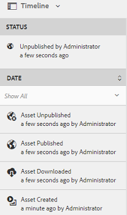

# Aktivitetsström på tidslinjen {#activity-stream-in-timeline}

Den här funktionen visar aktivitetsloggar för resurser på tidslinjen. Om du utför någon av följande resursrelaterade åtgärder i Adobe Experience Manager Resurser (AEM) uppdaterar aktivitetsströmfunktionen tidslinjen för att återspegla aktiviteten.

Följande åtgärder är loggade i aktivitetsströmmen:

* Skapa
* Ta bort
* Ladda ned (inklusive återgivningar)
* Publicera
* Avpublicera
* Godkänn
* Avvisa
* Flytta

Aktivitetsloggarna som ska visas på tidslinjen hämtas från platsen `/var/audit/com.day.cq.dam/content/dam` i CRX, där loggfilerna lagras.  Dessutom loggas tidslinjeaktiviteten när nya resurser överförs eller befintliga resurser ändras och checkas in i AEM via [Adobe Asset Link](https://helpx.adobe.com/enterprise/using/manage-assets-using-adobe-asset-link.html) eller [AEM-datorprogrammet](https://docs.adobe.com/content/help/en/experience-manager-desktop-app/using/release-notes.html).

>[!NOTE]
>
>Övergående arbetsflöden visas inte på tidslinjen eftersom ingen historikinformation sparas för dessa arbetsflöden.

Om du vill visa aktivitetsströmmen utför du en eller flera av åtgärderna på resursen, markerar resursen och väljer sedan **[!UICONTROL Tidslinje]** i listan GlobalNav.

Tidslinjen visar aktivitetsströmmen för de åtgärder du utför på resurserna.

>[!NOTE]
>
>Standardplatsen för logglagring för **[!UICONTROL publicerings]** - och **[!UICONTROL avpubliceringsåtgärder]** är `/var/audit/com.day.cq.replication/content`. Standardplatsen för **[!UICONTROL Flytta]** -uppgifter är `/var/audit/com.day.cq.wcm.core.page`.
