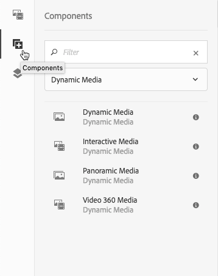
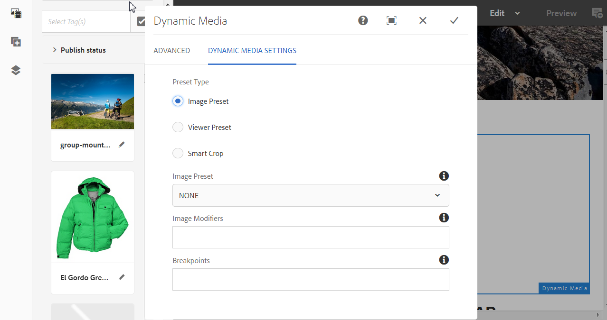

# Lägga till Dynamic Media-resurser på sidor{#adding-dynamic-media-assets-to-pages}

Om du vill lägga till Dynamic Media-funktioner i resurser som du använder på dina webbplatser kan du lägga till komponenten **Dynamic Media**, **Interaktiva media**, **Panoramabilder** eller **Video 360 Media** direkt på sidan. Du lägger till komponenter genom att öppna layoutläget och aktivera Dynamic Media-komponenterna. Sedan kan du lägga till komponenterna på sidan och lägga till resurser i komponenterna. Dynamic Media-komponenterna är smarta – de känner av om du lägger till en bild eller en video och konfigurationsalternativen ändras i enlighet med detta.

Du kan lägga till Dynamic Media-resurser direkt på sidan om du använder Adobe Experience Manager som WCM-fil. Om ni använder en annan leverantör för innehållshanteringssystemet kan ni antingen [länka](/help/assets/linking-urls-to-yourwebapplication.md) eller [bädda in](/help/assets/embed-code.md) resurserna. Om du har en responsiv webbplats hos en extern leverantör läser du [Leverera optimerade bilder till en responsiv webbplats](/help/assets/responsive-site.md).

>[!NOTE]
>
>Se till att du publicerar resurser innan du lägger till dem på sidor i Experience Manager. Se [Publish Dynamic Media-resurser](/help/assets/publishing-dynamicmedia-assets.md).

## Lägga till en Dynamic Media-komponent på en sida {#adding-a-dynamic-media-component-to-a-page}

Att lägga till en 3D-mediekomponent, Dynamic Media, Interactive Media, Panoramic Media, Smart Crop Video eller Video 360 Media på en sida är detsamma som att lägga till en komponent på en sida. Dynamic Media-komponenterna beskrivs i följande avsnitt.

**Så här lägger du till en Dynamic Media-komponent på en sida:**

1. Öppna den sida i Experience Manager där du vill lägga till Dynamic Media-komponenten.
1. Välj ikonen **[!UICONTROL Components]** på panelen till vänster på sidan (om det behövs för att växla visning av sidopanelen).
1. Under rubriken **[!UICONTROL Components]** väljer du **[!UICONTROL Dynamic Media]** i listrutan.

   Om det inte finns någon lista över Dynamic Media-komponenter måste du aktivera de Dynamic Media-komponenter som du vill använda. Se [Aktivera Dynamic Media-komponenter](#enabling-dynamic-media-components).

   

1. Dra en **[!UICONTROL Dynamic Media]**-komponent som du vill använda och släpp den på önskad plats på sidan.

1. Håll muspekaren direkt på komponenten. När komponenten omges av en blå ruta väljer du en gång för att visa komponentens verktygsfält. Välj ikonen **[!UICONTROL Configuration (wrench)]**.

   

1. Beroende på vilken Dynamic Media-komponent du släppte på sidan öppnas en konfigurationsdialogruta. [Ange komponentens alternativ](/help/assets/adding-dynamic-media-assets-to-pages.md#dynamic-media-components) efter behov.

   I exemplet nedan visas komponentdialogrutan för Dynamic Media **[!UICONTROL Video 360 Media]** och de alternativ som är tillgängliga i listrutan Visningsförinställning.

   

   Dynamic Media Video 360 Media-komponenten.

1. När du är klar markerar du kryssrutan i dialogrutans övre högra hörn för att spara ändringarna.

### Aktivera Dynamic Media-komponenter {#enabling-dynamic-media-components}

Om det inte finns några Dynamic Media-komponenter att lägga till på en sida betyder det troligtvis att du först måste aktivera de komponenter som du vill använda.

**Så här aktiverar du Dynamic Media-komponenter:**

1. Öppna den sida i Experience Manager där du vill lägga till Dynamic Media-komponenten.
1. Till vänster i verktygsfältet uppe på sidan väljer du ikonen Sidinformation och sedan **[!UICONTROL Edit Template]** i listrutan.

   

1. Välj **[!UICONTROL Structure]** i listrutan till höger om verktygsfältet uppe på sidan.

   

1. Långt ned på sidan väljer du **[!UICONTROL Layout Container]** för att öppna verktygsfältet och sedan principikonen.
1. Kontrollera att fliken **[!UICONTROL Allowed Components]** är markerad under rubriken **[!UICONTROL Properties]** på sidan **[!UICONTROL Layout Container]**.

   

1. Rulla tills du ser **[!UICONTROL Dynamic Media]**.
1. Välj ikonen > till vänster om **[!UICONTROL Dynamic Media]** så att du kan expandera listan och sedan markera de Dynamic Media-komponenter som du vill aktivera.

   

1. I närheten av det övre högra hörnet på sidan **[!UICONTROL Layout Container]** väljer du ikonen Klar (bock).

1. Till höger om verktygsfältet uppe på sidan väljer du **[!UICONTROL Initial Content]** i listrutan och sedan [lägger du till en Dynamic Media-komponent på en sida](#adding-a-dynamic-media-component-to-a-page) som vanligt.

## Lokalisera Dynamic Media-komponenter {#localizing-dynamic-media-components}

Du kan lokalisera Dynamic Media-komponenter på ett av två sätt:

* Från en webbsida i Sites öppnar du **[!UICONTROL Properties]** och väljer fliken **[!UICONTROL Advanced]**. Välj språk för lokalisering.

  

* Välj önskad sida eller sidgrupp i platsväljaren. Markera **[!UICONTROL Properties]** och välj fliken **[!UICONTROL Advanced]**. Välj språk för lokalisering.

  >[!NOTE]
  >
  >Alla språk som är tillgängliga på menyn **[!UICONTROL Language]** har för närvarande inte tilldelats variabler.

## Dynamic Media Components {#dynamic-media-components}

Dynamic Media-komponenter är tillgängliga när du väljer ikonen **[!UICONTROL Components]** och sedan filtrerar på **[!UICONTROL Dynamic Media]**.

Följande Dynamic Media-komponenter är tillgängliga:

* **[!UICONTROL Dynamic Media]** – Används för t.ex. bilder, video, e-kataloger och rotationsuppsättningar.
* **[!UICONTROL Interactive Media]** - Använd för interaktiva resurser som interaktiv video, interaktiva bilder eller karuselluppsättningar.
* **[!UICONTROL Panoramic Media]** - Använd för panoramabilder eller panoramabilder-VR-bildresurser.
* **[!UICONTROL Video 360 Media]** - Använd för 360-video och 360-VR-videor.

>[!NOTE]
>
>De här komponenterna är inte tillgängliga som standard. De måste vara tillgängliga via mallredigeraren innan du kan använda dem. [När de har gjorts tillgängliga i](/help/sites-authoring/templates.md#editing-templates-template-authors)mallredigeraren kan du lägga till komponenterna på sidan på samma sätt som andra Experience Manager-komponenter.

### Dynamic Media-komponent {#dynamic-media-component}

Dynamic Media-komponenten är smart. Oavsett om du lägger till en bild eller en video har du olika alternativ. Komponenten har stöd för bildförinställningar, bildbaserade visningsprogram som bilduppsättningar, snurruppsättningar, blandade medieuppsättningar och video. Dessutom är visningsprogrammet responsivt - skärmstorleken ändras automatiskt baserat på skärmstorleken. Alla visningsprogram är HTML5-visningsprogram.

>[!NOTE]
>
>Om din webbsida har följande:
>
>* Flera instanser av Dynamic Media-komponenten som används på samma sida.
>* Varje instans använder samma resurstyp.
>
>Det går inte att tilldela olika visningsprogramförinställningar till varje Dynamic Media-komponent på den sidan.
>
>Du kan dock använda samma visningsförinställning för alla Dynamic Media-komponenter som använder resurser av samma typ på sidan.

När du lägger till Dynamic Media-komponenten och **[!UICONTROL Dynamic Media Settings]** är tom eller du inte kan lägga till en resurs korrekt bör du kontrollera följande:

* Du har [aktiverat Dynamic Media](/help/assets/config-dynamic.md). Dynamic Media är inaktiverat som standard.
* Bilden har en pyramidformad fil. Bilder som du importerar innan du aktiverar Dynamic Media har ingen pyramidtiff-fil.

#### När du arbetar med bilder {#when-working-with-images}

Med Dynamic Media-komponenten kan du lägga till dynamiska bilder, inklusive bilduppsättningar, snurremsor och blandade medieuppsättningar. Du kan zooma in, zooma ut och, om tillämpligt, vrida en bild i en snurra eller välja en bild från en annan typ av uppsättning.

Du kan också konfigurera visningsförinställningen, bildförinställningen eller bildformatet direkt i komponenten. Om du vill göra en bild responsiv kan du antingen ange brytpunkter eller använda en responsiv bildförinställning.

Redigera följande Dynamic Media-inställningar genom att markera ikonen **[!UICONTROL Edit]** i komponenten och sedan **[!UICONTROL Dynamic Media Settings]**.

>[!NOTE]
>
>Som standard är Dynamic Media-bildkomponenten adaptiv. Om du vill att den ska ha en fast storlek anger du det i komponenten på fliken **[!UICONTROL Advanced]** med **[!UICONTROL Width]** och **[!UICONTROL Height]**.

* **[!UICONTROL Viewer preset]** - Välj en befintlig visningsförinställning i listrutan. Om den visningsförinställning du söker efter inte visas måste du göra den synlig. Se [Hantera visningsförinställningar](/help/assets/managing-viewer-presets.md). Du kan inte välja en visningsförinställning om du använder en bildförinställning och omvänt.

  Det här alternativet är det enda tillgängliga alternativet om du visar bilduppsättningar, snurruppsättningar eller blandade medieuppsättningar. De visningsförinställningar som visas är smarta - endast relevanta visningsprogramförinställningar visas.

* **[!UICONTROL Viewer modifiers]** - Visningsprogrammodifierare har formen av namn=värde-par med en &amp;-avgränsare och du kan ändra visningsprogram enligt riktlinjerna i referenshandboken för visningsprogram. Ett exempel på en visningsmodifierare är `posterimage=img.jpg&caption=text.vtt,1` som anger en annan bild för videominiatyrbilden och associerar en undertextfil med videon.

* **[!UICONTROL Image preset]** - Välj en befintlig bildförinställning i listrutan. Om den bildförinställning du söker inte syns måste du göra den synlig. Se Hantera bildförinställningar. Du kan inte välja en visningsförinställning om du använder en bildförinställning och omvänt.

  Det här alternativet är inte tillgängligt om du visar bilduppsättningar, snurruppsättningar eller blandade medieuppsättningar.

* **[!UICONTROL Image Modifiers]** - Du kan använda bildeffekter genom att ange ytterligare bildkommandon. Dessa effekter beskrivs i Bildförinställningar och i Referens för bildserverkommando.

  Det här alternativet är inte tillgängligt om du visar bilduppsättningar, snurruppsättningar eller blandade medieuppsättningar.

* **[!UICONTROL Breakpoints]** - Om du använder den här resursen på en responsiv webbplats måste du lägga till bildbrytpunkterna. Bildbrytpunkter avgränsas med kommatecken (,). Det här alternativet fungerar när ingen höjd eller bredd har definierats i en bildförinställning.

  Det här alternativet är inte tillgängligt om du visar bilduppsättningar, snurruppsättningar eller blandade medieuppsättningar.

  Du kan redigera följande avancerade inställningar genom att välja **[!UICONTROL Edit]** i komponenten.

* **[!UICONTROL Optimize for higher resolution devices]** - Markera (standard) kryssrutan för att tillåta optimering av DPR (Device Pixel Ratio).

  Alternativet **[!UICONTROL Optimize for higher resolution devices]** visas bara när följande är sant:

   * Under Förinställningstyp markeras **[!UICONTROL Image Preset]** och **[!UICONTROL RESS_IP]** markeras i listrutan **[!UICONTROL Image Preset]**.

  

  Se även [Om optimering av enhetens pixelproportioner](/help/assets/imaging-faq.md#dpr). Alla DPR-värden för Adobe Experience Manager Dynamic Media Smart Imaging ignoreras.

* **[!UICONTROL Title]** - Ändra bildens titel.

* **[!UICONTROL Alt Text]** - Lägg till en titel i bilden för de användare som har inaktiverat grafik.

  Det här alternativet är inte tillgängligt om du visar bilduppsättningar, snurruppsättningar eller blandade medieuppsättningar.

* **[!UICONTROL URL, Open in]** - Du kan ange att en resurs ska öppna en länk. Ange URL-adressen och i **Öppna i** anger du om du vill att den ska öppnas i samma fönster eller i ett nytt fönster.

  Det här alternativet är inte tillgängligt om du visar bilduppsättningar, snurruppsättningar eller blandade medieuppsättningar.

* **[!UICONTROL Width]** - Ange värdet i pixlar om du vill att bilden ska ha en fast storlek. Om värdet lämnas tomt anpassas resursen.

* **[!UICONTROL Height]** - Ange värdet i pixlar om du vill att bilden ska ha en fast storlek. Om värdet lämnas tomt anpassas resursen.

#### När du arbetar med video {#when-working-with-video}

Använd Dynamic Media-komponenten för att lägga till dynamisk video på dina webbsidor. När du redigerar komponenten kan du välja att använda en fördefinierad videovisningsförinställning för att spela upp videon på sidan.

Redigera följande Dynamic Media-inställningar genom att välja **[!UICONTROL Edit]** i komponenten.

>[!NOTE]
>
>Som standard är videokomponenten i Dynamic Media adaptiv. Om du vill göra den till en fast storlek anger du den i komponenten med **[!UICONTROL Width]** och **[!UICONTROL Height]** på fliken **[!UICONTROL Advanced]**.

* **[!UICONTROL Viewer preset]** - Välj en befintlig förinställning för visningsprogram för video i listrutan. Om den visningsförinställning du söker efter inte visas måste du göra den synlig. Se [Hantera visningsförinställningar](/help/assets/managing-viewer-presets.md).

* **[!UICONTROL Viewer modifiers]** - Visningsprogrammodifierare har formen av namn=värde-par med en &amp;-avgränsare och du kan ändra visningsprogram enligt riktlinjerna i referenshandboken för Adobe-visningsprogram. Ett exempel på en visningsmodifierare är `posterimage=img.jpg&caption=text.vtt,1`

  Med visningsmodifierare kan du till exempel göra följande:

   * Associera en beskrivningsfil med en video: [caption](https://experienceleague.adobe.com/docs/dynamic-media-developer-resources/library/viewers-aem-assets-dmc/video/command-reference-url-video/r-html5-video-viewer-url-caption.html?lang=sv-SE)
   * Associera en navigeringsfil med en video: [navigation](https://experienceleague.adobe.com/docs/dynamic-media-developer-resources/library/viewers-aem-assets-dmc/video/command-reference-url-video/r-html5-video-viewer-url-navigation.html?lang=sv-SE)

     Du kan redigera följande avancerade inställningar genom att välja **[!UICONTROL Edit]** i komponenten.

* **[!UICONTROL Title]** - Ändra videons titel.

* **[!UICONTROL Width]** - Ange värdet i pixlar om du vill att bilden ska ha en fast storlek. Om värdet lämnas tomt anpassas resursen.

* **[!UICONTROL Height]** - Ange värdet i pixlar om du vill att bilden ska ha en fast storlek. Om värdet lämnas tomt anpassas resursen.

#### När du arbetar med smart beskärning {#when-working-with-smart-crop}

Använd Dynamic Media-komponenten för att lägga till bildresurser för Smart beskärning på dina webbsidor. När du redigerar komponenten kan du välja att använda en fördefinierad videovisningsförinställning för att spela upp videon på sidan.

Se även [Bildprofiler](/help/assets/image-profiles.md).

Redigera följande Dynamic Media-inställning genom att välja **[!UICONTROL Edit]** i komponenten.

>[!NOTE]
>
>Som standard är Dynamic Media-bildkomponenten adaptiv. Om du vill att den ska ha en fast storlek anger du det i komponenten på fliken **[!UICONTROL Advanced]** med **[!UICONTROL Width]** och **[!UICONTROL Height]**.

* **[!UICONTROL Image Modifiers]** - Du kan använda bildeffekter genom att ange ytterligare bildkommandon. Dessa effekter beskrivs i Bildförinställningar och i Referens för bildserverkommando.

  Det här alternativet är inte tillgängligt om du visar bilduppsättningar, snurruppsättningar eller blandade medieuppsättningar.

  Du kan redigera följande avancerade inställningar genom att välja **[!UICONTROL Edit]** i komponenten.

* **[!UICONTROL Enable Aspect Ratio match]** - Välj det här alternativet om du vill att Dynamic Media ska välja en smart beskärningsåtergivning med de proportioner som bäst matchar originalbildens proportioner.

* **[!UICONTROL Optimize for higher resolution devices]** - Markera (standard) kryssrutan för att tillåta optimering av DPR (Device Pixel Ratio).

  Alternativet **[!UICONTROL Optimize for higher resolution devices]** visas bara när följande är sant:

   * Under Förinställningstyp är alternativet **[!UICONTROL Smart Crop]** markerat.

  

  Se även [Om optimering av enhetens pixelproportioner](/help/assets/imaging-faq.md#dpr). Alla DPR-värden för Adobe Experience Manager Dynamic Media Smart Imaging ignoreras.

* **[!UICONTROL Title]** - Ändra titeln för bilden för smart beskärning.

* **[!UICONTROL Alt Text]** - Lägg till en titel i den smarta beskärningsbilden för de användare som har inaktiverat grafik.

  Det här alternativet är inte tillgängligt om du visar bilduppsättningar, snurruppsättningar eller blandade medieuppsättningar.

* **[!UICONTROL URL, Open in]** - Du kan ange att en resurs ska öppna en länk. Ange URL:en och Öppna i anger om du vill att den ska öppnas i samma fönster eller i ett nytt fönster.

  Det här alternativet är inte tillgängligt om du visar bilduppsättningar, snurruppsättningar eller blandade medieuppsättningar.

* **[!UICONTROL Width]** - Ange värdet i pixlar om du vill att bilden ska ha en fast storlek. Om värdet lämnas tomt anpassas resursen.

* **[!UICONTROL Height]** - Ange värdet i pixlar om du vill att bilden ska ha en fast storlek. Om värdet lämnas tomt anpassas resursen.

### Interaktiv mediakomponent {#interactive-media-component}

Komponenten Interactive Media är till för de resurser som har interaktivitet på dem, till exempel hotspot-områden eller bildscheman. Om du har en interaktiv bild, interaktiv video eller karusellbanderoll använder du komponenten **[!UICONTROL Interactive Media]**.

Komponenten Interactive Media är smart. Oavsett om du lägger till en bild eller en video har du olika alternativ. Dessutom är visningsprogrammet responsivt - skärmstorleken ändras automatiskt baserat på skärmstorleken. Alla visningsprogram är HTML5-visningsprogram.

>[!NOTE]
>
>Om din webbsida har följande:
>
>* Flera instanser av komponenten Interactive Media används på samma sida.
>* Varje instans använder samma resurstyp.
>
>Det går inte att tilldela olika visningsprogramförinställningar till varje interaktiv mediekomponent på den sidan.
>
>Du kan dock använda samma visningsförinställning för alla interaktiva mediekomponenter som använder resurser av samma typ på sidan.

Du kan redigera följande **[!UICONTROL General]**-inställningar genom att välja **[!UICONTROL Edit]** i komponenten.

* **[!UICONTROL Viewer preset]** - Välj en befintlig visningsförinställning i listrutan. Om den visningsförinställning du söker efter inte visas måste du göra den synlig. Förinställningar för visningsprogram måste publiceras innan de kan användas. Se Hantera förinställningar för visningsprogram.

* **[!UICONTROL Title]** - Ändra videons titel.

* **[!UICONTROL Width]** - Ange värdet i pixlar om du vill att bilden ska ha en fast storlek. Om värdet lämnas tomt anpassas resursen.

* **[!UICONTROL Height]** - Ange värdet i pixlar om du vill att bilden ska ha en fast storlek. Om värdet lämnas tomt anpassas resursen.

  Du kan redigera följande **[!UICONTROL Add To Cart]**-inställningar genom att välja **[!UICONTROL Edit]** i komponenten.

* **[!UICONTROL Show Product Asset]** - Som standard är det här värdet markerat. Produktresursen visar en bild av produkten enligt definitionen i modulen Commerce. Avmarkera bockmarkeringen så att produktresursen inte visas.

* **[!UICONTROL Show Product Price]** - Som standard är det här värdet markerat. Produktpriset visar priset på artikeln enligt definitionen i Commerce-modulen. Avmarkera bockmarkeringen så att produktpriset inte visas.

* **[!UICONTROL Show Product Form]** - Som standard är det här värdet inte markerat. Produktformuläret innehåller alla produktvarianter som storlek och färg. Avmarkera bockmarkeringen så att produktvarianterna inte visas.

### Panoramamakomponent {#panoramic-media-component}

Komponenten för panoramamedia är avsedd för resurser som är sfäriska panoramabilder. Sådana bilder ger en 360-graders visningsupplevelse av ett rum, en egenskap, plats eller liggande. För att en bild ska kvalificeras som ett sfäriskt panorama måste den ha antingen ett ELLER båda av följande:

* Proportionerna 2:1.
* Taggad med nyckelorden `equirectangular` eller (`spherical` + `panorama`) eller (`spherical` + `panoramic`). Se [Använda taggar](/help/sites-authoring/tags.md).

Kriterierna för proportioner och nyckelord gäller även för panoramaresurser på sidan med resursinformation och för komponenten **[!UICONTROL Panoramic Media]** i innehållshanteringssystemet.

>[!NOTE]
>
>Om din webbsida har följande:
>
>* Flera instanser av komponenten **[!UICONTROL Panoramic Media]** används på samma sida.
>* Varje instans använder samma resurstyp.
>
>Det går inte att tilldela olika visningsprogramförinställningar till varje **[!UICONTROL Panoramic Media]**-komponent på den sidan.
>
>Du kan dock använda samma visningsförinställning för alla panoramakomponenter som använder resurser av samma typ på sidan.

Du kan redigera följande inställning genom att markera **[!UICONTROL Configure]** i komponenten.

* **[!UICONTROL Viewer Preset]** - Välj ett befintligt visningsprogram i listrutan med visningsförinställningar.

Om den visningsförinställning du sökte efter inte visas kontrollerar du att den är publicerad. Förinställningar för Publish-visningsprogram innan du använder dem. Se [Hantera visningsförinställningar](/help/assets/managing-viewer-presets.md).

### Video 360 Media Component {#video-media-component}

Använd komponenten **[!UICONTROL Video 360 Media]** för att återge ekvirektangulär video på din webbsida för en engagerande visningsupplevelse av ett rum, en egenskap, en plats, ett landskap eller en medicinsk procedur.

Vid uppspelning på en platt skärm har användaren kontroll över visningsvinkeln. Vid uppspelning på mobila enheter används vanligtvis de inbyggda gyroskopkontrollerna.

Visningsprogrammet har inbyggt stöd för leverans av 360 videomaterial. Som standard krävs ingen ytterligare konfiguration för visning eller uppspelning. Du levererar 360-video med standardvideotillägg som .mp4, .mkv och .mov. Den vanligaste kodeken är H.264.

Du kan redigera följande inställning genom att markera **[!UICONTROL Configure]** i komponenten.

* **[!UICONTROL Viewer Preset]** - Välj ett befintligt visningsprogram i listrutan med visningsförinställningar. Använd `Video360VR` för slutanvändare som använder virtuella verklighetsglasögon. Det innehåller grundläggande videouppspelningskontroller och funktioner för sociala medier. Använd `Video360_social` som innehåller grundläggande videouppspelningskontroller. Videoåtergivning sker i stereoläge. Manuell vypunktskontroll är inaktiverad men gyroskopisk kontroll är aktiverad. Det finns inga funktioner för sociala medier.

Om den visningsförinställning du sökte efter inte visas kontrollerar du att den är publicerad. Kontrollera att du publicerar förinställningarna för visningsprogrammet innan du använder dem. Se [Hantera visningsförinställningar](/help/assets/managing-viewer-presets.md).

### Använda HTTP/2 för att leverera Dynamic Media-material {#using-http-to-delivery-dynamic-media-assets}

HTTP/2 är det nya, uppdaterade webbprotokollet som förbättrar kommunikationen mellan webbläsare och servrar. Det ger snabbare överföring av information och minskar mängden processorkraft som behövs. Dynamic Media-material kan nu levereras via HTTP/2 som ger bättre respons och laddningstider.

Se [HTTP2 Delivery of Content](/help/assets/http2.md) för fullständig information om hur du kommer igång med HTTP/2 med ditt Dynamic Media-konto.

>[!MORELIKETHIS]
>
>* [Använd videospelaren i Experience Manager Dynamic Media](https://experienceleague.adobe.com/docs/experience-manager-learn/assets/dynamic-media/video/dynamic-media-video-player-feature-video-use.html?lang=sv-SE)
>* [Använd interaktiv video med Experience Manager Dynamic Media](https://experienceleague.adobe.com/docs/experience-manager-learn/assets/dynamic-media/video/dynamic-media-interactive-video-feature-video-use.html?lang=sv-SE)
>* [Förstå resursvisningsprogrammet med Experience Manager Dynamic Media](https://experienceleague.adobe.com/docs/experience-manager-learn/assets/dynamic-media/viewers/dynamic-media-viewer-feature-video-understand.html?lang=sv-SE)
>* [Använd en anpassad videominiatyr med Experience Manager Dynamic Media](https://experienceleague.adobe.com/docs/experience-manager-learn/assets/dynamic-media/video/dynamic-media-video-thumbnails-feature-video-use.html?lang=sv-SE)
>* [Förstå färghantering med Experience Manager Dynamic Media](https://experienceleague.adobe.com/docs/experience-manager-learn/assets/dynamic-media/images/dynamic-media-color-management-technical-video-setup.html?lang=sv-SE)
>* [Använda bildskärpa med Experience Manager Dynamic Media](https://experienceleague.adobe.com/docs/experience-manager-learn/assets/dynamic-media/images/dynamic-media-image-sharpening-feature-video-use.html?lang=sv-SE)
