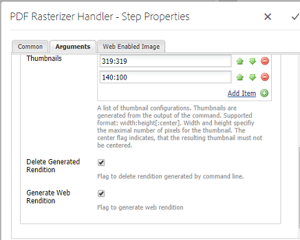
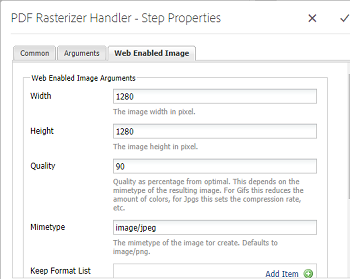

# Använd PDF-rastrering {#using-pdf-rasterizer}

När du överför stora, innehållsintensiva PDF- eller AI-filer till Adobe Experience Manager-resurser (AEM) kanske standardbiblioteket inte genererar korrekta utdata. I sådana fall kan Adobes PDF Rasterizer-bibliotek generera tillförlitligare och exaktare utdata jämfört med utdata från ett standardbibliotek.

Adobe rekommenderar att du använder PDF-rastreringsbiblioteket för följande:

* Tunga, innehållsintensiva AI-/PDF-filer
* AI/PDF-filer med miniatyrbilder som inte genererats direkt
* AI-filer med Pantone Matching System-färger (PMS)

Miniatyrbilder och förhandsgranskningar som genererats med PDF Rasterizer har bättre kvalitet jämfört med färdiga utdata och ger därför en konsekvent visningsupplevelse på olika enheter. Adobe PDF Rasterizer-biblioteket har inte stöd för konvertering av färgrymd. Det skrivs alltid ut på RGB, oavsett källfilens färgrymd.

1. Installera PDF-rastreringspaketet på din AEM-instans från [paketresursen](https://www.adobeaemcloud.com/content/marketplace/marketplaceProxy.html?packagePath=/content/companies/public/adobe/packages/cq640/product/assets/aem-assets-pdf-rasterizer-pkg).

   >[!NOTE]
   >
   >PDF Rasterizer-biblioteket är endast tillgängligt för Windows och Linux.

1. Gå till arbetsflödeskonsolen för AEM Assets på `https://[server]:[port]/workflow`.

   Öppna arbetsflödessidan DAM Update Asset.

1. Följ de här stegen för att förhindra att miniatyrbilder och webbåtergivning genereras för PDF- och AI-filer med standardmetoderna:

   * Öppna steget **[!UICONTROL Bearbeta miniatyrer]** och lägg till `application/pdf` eller `application/postscript` i fältet **[!UICONTROL Hoppa över Mime-typer]** under fliken **[!UICONTROL Miniatyrer]** om det behövs.
   

   * På fliken **[!UICONTROL Webbaktiverad bild]** lägger du till `application/pdf` eller `application/postscript` under **[!UICONTROL Hoppa över lista]** beroende på dina behov.
   

1. Öppna steget **[!UICONTROL Rastrera återgivning av PDF/AI-bildförhandsvisning]** och ta bort den MIME-typ som du vill hoppa över standardgenereringen av förhandsvisningsbildåtergivningar för. Ta till exempel bort MIME-typen `application/pdf`, `application/postscript`eller `application/illustrator` från listan **[!UICONTROL MIME-typer]** .

   

1. Dra **[!UICONTROL PDF-rastreringshanterarens]** steg från sidopanelen till nedanför steget **[!UICONTROL Bearbeta miniatyrer]** .
1. Konfigurera följande argument för **[!UICONTROL PDF Rasterizer Handler]** -steget:

   * MIME-typer: `application/pdf` eller `application/postscript`

   * Kommandon: `PDFRasterizer -d -p 1 -s 1280 -t PNG -i ${file}`
   * Lägg till miniatyrstorlekar: 319:319, 140:100, 48:48. Lägg till anpassad miniatyrkonfiguration, om det behövs.
   Kommandoradsargumenten för `PDFRasterizer` kommandot kan innehålla följande:

   * `-d`: Flagga för smidig återgivning av text, vektorgrafik och bilder. Skapar bilder med bättre kvalitet. Om du tar med den här parametern körs kommandot långsamt och bildstorleken ökar.

   * `-p`: Sidnummer. Standardvärdet är alla sidor. * betecknar alla sidor.

   * `-s`: Största bilddimension (höjd eller bredd). Detta konverteras till DPI för varje sida. Om sidorna har olika storlek kan varje sida eventuellt skalas med olika mängd. Standardvärdet är faktisk sidstorlek.

   * `-t`: Typ av utdatabild. Giltiga typer är JPEG, PNG, GIF och BMP. Standardvärdet är JPEG.

   * `-i`: Sökväg för PDF-indata. Det är en obligatorisk parameter.

   * `-h`: Hjälp

1. Om du vill ta bort mellanliggande återgivningar väljer du **[!UICONTROL Ta bort genererad återgivning]**.
1. Om du vill låta PDF-rastrering generera webbåtergivningar väljer du **[!UICONTROL Generera webbåtergivning]**.

   

1. Ange inställningarna på fliken **[!UICONTROL Webbaktiverad bild]** .

   

1. Spara arbetsflödet.
1. Om du vill att PDF-rastreraren ska kunna bearbeta PDF-sidor med PDF-bibliotek öppnar du modellen **[!UICONTROL DAM Process Subasset]** i arbetsflödeskonsolen.
1. Dra steget PDF-rastreringshanteraren från sidopanelen under **[!UICONTROL Skapa webbaktiverad bildåtergivning]** .
1. Konfigurera följande argument för **[!UICONTROL PDF Rasterizer Handler]** -steget:

   * MIME-typer: `application/pdf` eller `application/postscript`

   * Kommandon: `PDFRasterizer -d -p 1 -s 1280 -t PNG -i ${file}`
   * Lägg till miniatyrstorlekar: 319:319, 140:100, 48:48. Lägg till anpassad miniatyrkonfiguration, om det behövs.
   Kommandoradsargumenten för PDFRasterizer-kommandot kan innehålla följande:

   * `-d`: Flagga för smidig återgivning av text, vektorgrafik och bilder. Skapar bilder med bättre kvalitet. Om du tar med den här parametern körs kommandot långsamt och bildstorleken ökar.

   * `-p`: Sidnummer. Standardvärdet är alla sidor. `*` anger alla sidor.

   * `-s`: Största bilddimension (höjd eller bredd). Detta konverteras till DPI för varje sida. Om sidorna har olika storlek kan varje sida eventuellt skalas med olika mängd. Standardvärdet är faktisk sidstorlek.

   * `-t`: Typ av utdatabild. Giltiga typer är JPEG, PNG, GIF och BMP. Standardvärdet är JPEG.

   * `-i`: Sökväg för PDF-indata. Det är en obligatorisk parameter.

   * `-h`: Hjälp

1. Om du vill ta bort mellanliggande återgivningar väljer du **[!UICONTROL Ta bort genererad återgivning]**.
1. Om du vill låta PDF-rastrering generera webbåtergivningar väljer du **[!UICONTROL Generera webbåtergivning]**.

   

1. Ange inställningarna på fliken **[!UICONTROL Webbaktiverad bild]** .

   

1. Spara arbetsflödet.
1. Överför en PDF- eller AI-fil till AEM Assets. I PDF-rastreraren genereras miniatyrbilder och webbåtergivningar för filen.
