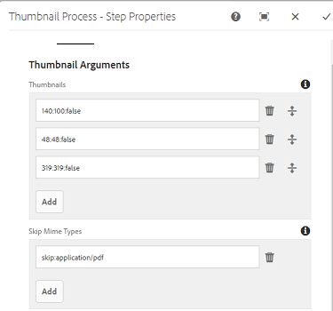

# Använd PDF rastrerare {#using-pdf-rasterizer}

När du överför stora, innehållsintensiva PDF- eller AI-filer till [!DNL Adobe Experience Manager Assets] kanske standardbiblioteket inte genererar korrekta utdata. Adobe Rasterizer-biblioteket kan generera tillförlitliga och korrekta utdata jämfört med utdata från ett standardbibliotek. Adobe rekommenderar att du använder PDF rastrerarbiblioteket för följande scenarier:

Adobe rekommenderar att du använder PDF rastrerarbiblioteket för följande:

* Tunga, innehållsintensiva AI-filer eller PDF.
* AI-filer och PDF-filer med miniatyrer som inte genereras som standard.
* AI-filer med Pantone Matching System-färger (PMS).

Miniatyrbilder och förhandsgranskningar som genererats med PDF Rasterizer har bättre kvalitet jämfört med färdiga utdata och ger därför en konsekvent visningsupplevelse på alla enheter. Adobe PDF Rasterizer-biblioteket har inte stöd för någon färgmodellskonvertering. Det skrivs alltid ut på RGB, oavsett källfilens färgrymd.

1. Installera PDF Rasterizer-paketet på din [!DNL Adobe Experience Manager]-distribution från [Programvarudistribution](https://experience.adobe.com/#/downloads/content/software-distribution/en/aem.html?package=/content/software-distribution/en/details.html/content/dam/aem/public/adobe/packages/cq650/product/assets/aem-assets-pdf-rasterizer-pkg-4.6.zip).

   >[!NOTE]
   >
   >Biblioteket PDF Rasterizer finns endast för Windows och Linux®.

1. Gå till arbetsflödeskonsolen [!DNL Assets] på `https://[aem_server]:[port]/workflow`. Öppna arbetsflödet [!UICONTROL DAM Update Asset].

1. Följ de här stegen för att förhindra att miniatyrbilder och webbåtergivning genereras för PDF-filer och AI-filer med standardmetoderna:

   * Öppna steget **[!UICONTROL Process Thumbnails]** och lägg till `application/pdf` eller `application/postscript` i fältet **[!UICONTROL Skip Mime Types]** under fliken **[!UICONTROL Thumbnails]** efter behov.

   

   * På fliken **[!UICONTROL Web Enabled Image]** lägger du till `application/pdf` eller `application/postscript` under **[!UICONTROL Skip List]** beroende på dina behov.

   

1. Öppna steget **[!UICONTROL Rasterize PDF/AI Image Preview Rendition]** och ta bort MIME-typen som du vill hoppa över standardgenereringen av förhandsvisningsbildåtergivningar för. Ta till exempel bort MIME-typen `application/pdf`, `application/postscript` eller `application/illustrator` från listan **[!UICONTROL MIME Types]**.

   

1. Dra steget **[!UICONTROL PDF Rasterizer Handler]** från sidopanelen till nedanför steget **[!UICONTROL Process Thumbnails]**.
1. Konfigurera följande argument för steget **[!UICONTROL PDF Rasterizer Handler]**:

   * MIME-typer: `application/pdf` eller `application/postscript`
   * Kommandon: `PDFRasterizer -d -s 1280 -t PNG -i ${file}`
   * Lägg till miniatyrstorlekar: 319:319, 140:100, 48:48. Lägg till anpassad miniatyrkonfiguration, om det behövs.

   Kommandoradsargumenten för kommandot `PDFRasterizer` kan innehålla följande:

   * `-d`: Flagga för smidig återgivning av text, vektorgrafik och bilder. Skapar bilder med bättre kvalitet. Om du tar med den här parametern körs kommandot långsamt och bildstorleken ökar.

   * `-s`: Högsta bilddimension (höjd eller bredd). Detta konverteras till DPI för varje sida. Om sidorna har olika storlek kan varje sida eventuellt skalas med olika mängd. Standardvärdet är faktisk sidstorlek.

   * `-t`: Typ av utdatabild. Giltiga typer är JPEG, PNG, GIF och BMP. Standardvärdet är JPEG.

   * `-i`: Sökväg för indata-PDF. Det är en obligatorisk parameter.

   * `-h`: Hjälp

1. Om du vill ta bort mellanliggande återgivningar väljer du **[!UICONTROL Delete Generated Rendition]**.
1. Om du vill låta PDF Rasterizer generera webbåtergivningar väljer du **[!UICONTROL Generate Web Rendition]**.

   

1. Ange inställningarna på fliken **[!UICONTROL Web Enabled Image]**.

   

1. Spara arbetsflödet.
1. Om du vill att PDF Rasterizer ska kunna bearbeta PDF-sidor med PDF-bibliotek öppnar du modellen **[!UICONTROL DAM Process Subasset]** från konsolen [!UICONTROL Workflow].
1. Dra PDF i steg för Rastrerarhanteraren under steget **[!UICONTROL Create Web-Enabled Image Rendition]** från sidopanelen.
1. Konfigurera följande argument för steget **[!UICONTROL PDF Rasterizer Handler]**:

   * MIME-typer: `application/pdf` eller `application/postscript`
   * Kommandon: `PDFRasterizer -d -s 1280 -t PNG -i ${file}`
   * Lägg till miniatyrstorlekar: `319:319`, `140:100`, `48:48`. Lägg till en anpassad miniatyrkonfiguration efter behov.

   Kommandoradsargumenten för kommandot `PDFRasterizer` kan innehålla följande:

   * `-d`: Flagga för smidig återgivning av text, vektorgrafik och bilder. Skapar bilder med bättre kvalitet. Om du tar med den här parametern körs kommandot långsamt och bildstorleken ökar.

   * `-s`: Högsta bilddimension (höjd eller bredd). Detta konverteras till DPI för varje sida. Om sidorna har olika storlek kan varje sida eventuellt skalas med olika mängd. Standardvärdet är faktisk sidstorlek.

   * `-t`: Typ av utdatabild. Giltiga typer är JPEG, PNG, GIF och BMP. Standardvärdet är JPEG.

   * `-i`: Sökväg för indata-PDF. Det är en obligatorisk parameter.

   * `-h`: Hjälp

1. Om du vill ta bort mellanliggande återgivningar väljer du **[!UICONTROL Delete Generated Rendition]**.
1. Om du vill låta PDF Rasterizer generera webbåtergivningar väljer du **[!UICONTROL Generate Web Rendition]**.

   

1. Ange inställningarna på fliken **[!UICONTROL Web Enabled Image]**.

   

1. Spara arbetsflödet.
1. Överför en PDF-fil eller en AI-fil till [!DNL Experience Manager Assets]. Med PDF rastreraren genereras miniatyrbilder och webbåtergivningar för filen.
