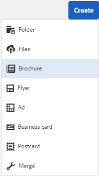
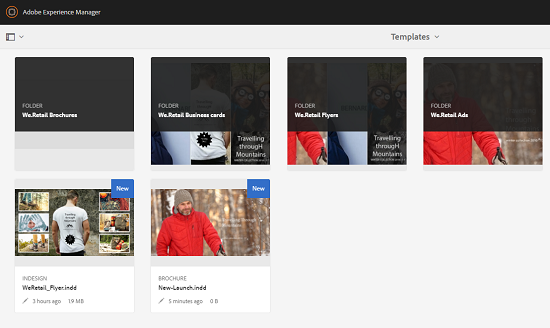

# Resursmallar {#asset-templates}

Resursmallar är en speciell typ av material som gör det enkelt att snabbt återanvända grafiskt avancerat innehåll för digitala medier och trycksaker. En resursmall består av två delar, avsnittet med fasta meddelanden och det redigerbara avsnittet. Avsnittet med fasta meddelanden kan innehålla eget innehåll, t.ex. varumärkeslogotyp och copyrightinformation som har inaktiverats för redigering. Det redigerbara avsnittet kan innehålla visuellt och textbaserat innehåll i fält som kan redigeras för att anpassa meddelanden.

Flexibiliteten att göra begränsade redigeringar samtidigt som du skyddar globala skyltar gör resursmallarna till idealiska byggstenar för snabb innehållsanpassning och distribution som innehållsartefakter för olika funktioner. Återanvändning av innehåll minskar kostnaderna för att hantera tryckta och digitala kanaler och leverera en helhetsbild och enhetliga upplevelser i alla dessa kanaler.

Som marknadsförare kan du lagra och hantera mallar i [!DNL Experience Manager Assets] och använda en enda basmall för att enkelt skapa flera personaliserade utskriftsupplevelser. Ni kan skapa olika typer av marknadsföringsmaterial, som broschyrer, flygblad, vykort, visitkort och så vidare, för att på ett enkelt sätt förmedla ert marknadsföringsbudskap till kunderna. Du kan också montera flersidiga utskrifter från befintliga eller nya utskrifter. Framför allt kan ni enkelt leverera både digitala och tryckta upplevelser samtidigt för att skapa en enhetlig, integrerad upplevelse för användarna.

Resursmallar är till största delen [!DNL Adobe InDesign] filer, men kunskaper i [!DNL Adobe InDesign] är inte ett hinder för att skapa stelära artefakter. Du behöver inte mappa fälten i mallen [!DNL Adobe InDesign] till de produktfält som du annars behöver när du skapar kataloger. Du kan redigera mallarna i WYSIWYG-läge direkt i webbgränssnittet. För att [!DNL Adobe InDesign] ska kunna bearbeta dina redigeringsändringar måste du först konfigurera [!DNL Experience Manager Assets] så att den integreras med [!DNL Adobe InDesign Server].

Möjligheten att redigera [!DNL Adobe InDesign]-mallar från webbgränssnittet bidrar till att förbättra samarbetet mellan kreatörer och marknadsförare. Den ökade innehållshastigheten minskar time-to-market för marknadsföringsmaterial.

Du kan göra följande med resursmallar:

* Ändra redigerbara mallfält från webbgränssnittet.
* Styr den grundläggande formateringen av text, t.ex. teckenstorlek, stil och typ på taggnivå.
* Ändra bilder i mallen med hjälp av Innehållsväljaren.
* Förhandsgranska malländringar.
* Sammanfoga flera mallfiler så att du kan skapa en flersidig artefakt.

När du väljer en mall för din säkerhet skapar [!DNL Experience Manager Assets] en kopia av mallen som du kan redigera. Den ursprungliga mallen bevaras, vilket säkerställer att den globala signaturen förblir intakt och kan återanvändas för att stärka varumärkets enhetlighet.

Du kan exportera den uppdaterade filen i den överordnade mappen i INDD-, PDF- eller JPG-format. Du kan även hämta utdata i dessa format till det lokala filsystemet.

## Skapa en pusselbit {#creating-a-collateral}

Tänk dig ett scenario där du vill skapa digital tryckbar information som broschyrer, flygblad och annonser för en kommande kampanj och dela med butiker globalt. Genom att skapa material som bygger på en mall kan ni leverera en enhetlig kundupplevelse över alla kanaler. Designers kan skapa kampanjmallar (en eller flera sidor) med hjälp av en kreativ lösning, som [!DNL InDesign], och överföra mallarna till [!DNL Experience Manager Assets] åt dig. Innan du skapar en del ska du ha en eller flera INDD-mallar överförda till och tillgängliga i [!DNL Experience Manager] i förväg.

1. Välj [!UICONTROL Assets] i gränssnittet [!DNL Experience Manager].

1. Välj **[!UICONTROL Templates]** bland alternativen.

   

1. Välj **[!UICONTROL Create]** och välj sedan den information som du vill skapa på menyn. Välj till exempel **[!UICONTROL Brochure]**.

   

1. Ha en eller flera INDD-mallar överförda till och tillgängliga i [!DNL Experience Manager] i förväg. Välj en mall för din broschyr och klicka på **[!UICONTROL Next]**.
1. Ange ett namn och en valfri beskrivning för broschyren.

   

1. (Valfritt) Klicka på **[!UICONTROL Tags]** och välj en eller flera taggar för broschyren. Klicka på **[!UICONTROL Confirm]** för att bekräfta ditt val.
1. Klicka på **[!UICONTROL Create]**. En dialogruta bekräftar att en ny broschyr har skapats. Klicka på **[!UICONTROL Open]** för att öppna broschyren i redigeringsläge.

   <!-- -->

   Du kan också stänga dialogrutan och navigera till mappen på mallsidan som du började med för att visa den broschyr du skapade. Typen av säkerhet visas på miniatyrbilden i kortvyn. I det här fallet visas till exempel ordet [!UICONTROL Brochure] på miniatyrbilden.

   

## Redigera en bit {#editing-a-collateral}

Du kan redigera en del direkt när du har skapat den. Du kan även öppna den från sidan [!UICONTROL Templates] eller resursen.

1. Gör något av följande om du vill öppna materialet för redigering:

   * Öppna den säkerhet (broschyr i det här fallet) som du skapade i steg 7 av [Skapa en pantartikel](/help/assets/asset-templates.md#creating-a-collateral).
   * Navigera från sidan Mallar till en mapp där du skapade materialet och klicka på snabbåtgärden [!UICONTROL Edit] på miniatyrbilden för ett informationsstycke.
   * Klicka på **[!UICONTROL Edit]** i verktygsfältet på resurssidan för säkerheten.
   * Markera säkerheten och klicka på **[!UICONTROL Edit]** i verktygsfältet.

   <!-- -->

   Resurssökaren och textredigeraren visas till vänster på sidan. Textredigeraren är öppen som standard.

   Använd textredigeraren för att ändra texten som ska visas i textfältet. Du kan ändra teckenstorlek, stil, färg och typ på taggnivå.

   Om du vill använda sökaren kan du söka efter bilder i [!DNL Experience Manager Assets] och ersätta de redigerbara bilderna i mallen med de bilder du väljer.

   

   De redigerbara bilderna visas till höger. För att ett fält ska kunna redigeras i [!DNL Experience Manager Assets] måste motsvarande fält i mallen taggas i [!DNL InDesign]. De bör med andra ord markeras som redigerbara i [!DNL InDesign].

   >[!NOTE]
   >
   >Kontrollera att din [!DNL Experience Manager]-distribution är integrerad med en [!DNL InDesign Server] så att [!DNL Experience Manager Assets] kan extrahera data från [!DNL InDesign]-mallen och göra den tillgänglig för redigering. Mer information finns i [Integrera Experience Manager Assets med InDesign Server](/help/assets/indesign.md).

1. Om du vill ändra texten i ett redigerbart fält klickar du på textfältet i listan med redigerbara fält och redigerar texten i fältet.

   

   Du kan redigera textegenskaperna, till exempel teckensnittsstil, färg och storlek, med de alternativ som finns.

1. Välj **[!UICONTROL Preview]** så att du kan förhandsgranska textändringarna.

1. Välj **[!UICONTROL Asset Finder]**  om du vill byta ut en bild.

1. Markera bildfältet i listan med redigerbara fält och dra sedan en önskad bild från resursväljaren till det redigerbara fältet.

   

   Du kan också söka efter bilder med hjälp av nyckelord, taggar och baserat på deras publiceringsstatus. Du kan bläddra genom databasen [!DNL Experience Manager Assets] och navigera till platsen för den önskade bilden.

   

1. Välj **[!UICONTROL Preview]** så att du kan förhandsgranska bilden.
1. Om du vill redigera en viss sida i en flersidig säkerhetssida använder du sidnavigeraren längst ned.

1. Välj **[!UICONTROL Preview]** i verktygsfältet så att du kan förhandsgranska alla ändringar. Välj **[!UICONTROL Done]** om du vill spara redigeringsändringarna i sidodelen.

   >[!NOTE]
   >
   >Alternativen Förhandsvisa och Klar är bara aktiverade när de redigerbara bildfälten i den sammansatta bilden inte har några ikoner som saknas. Om det saknas ikoner i din säkerhetsinformation beror det på att [!DNL Experience Manager] inte kan matcha bilderna i mallen [!DNL InDesign]. Vanligtvis kan [!DNL Experience Manager] inte matcha bilder i följande fall:
   >
   >* Bilder bäddas inte in i den underliggande [!DNL InDesign]-mallen.
   >* Bilderna länkas från det lokala filsystemet.
   >
   >Så här aktiverar du [!DNL Experience Manager] för att lösa bilder:
   >
   >* Bädda in bilder när du skapar [!DNL InDesign]-mallar (se [Om länkar och inbäddade bilder](https://helpx.adobe.com/indesign/using/graphics-links.html)).
   >* Montera [!DNL Experience Manager] i det lokala filsystemet och mappa sedan saknade ikoner med befintliga resurser i [!DNL Experience Manager].
   >
   >Mer information om hur du arbetar med [!DNL InDesign]-dokument finns i [Bästa tillvägagångssätt för att arbeta med InDesign-dokument i Experience Manager](https://helpx.adobe.com/experience-manager/kb/best-practices-idd-docs-aem.html).

1. Om du vill skapa en PDF-återgivning för broschyren väljer du alternativet Acrobat i dialogrutan och klickar sedan på **[!UICONTROL Continue]**.
1. Den sammansatta delen skapas i den mapp som du började med. Om du vill visa återgivningarna öppnar du materialet och väljer **[!UICONTROL Renditions]** i listan GlobalNav.

   

1. Markera återgivningen PDF i listan över återgivningar så att du kan hämta PDF-filen. Öppna PDF-filen för att granska materialet.

   

## Sammanfoga säkerhet {#merge-collateral}

1. I [!DNL Experience Manager]-gränssnittet väljer du [!UICONTROL Assets] på navigeringssidan.

1. Välj **[!UICONTROL Templates]** bland alternativen.

1. Välj **[!UICONTROL Create]** och välj sedan **[!UICONTROL Merge]** på menyn.

   

1. Välj **[!UICONTROL Merge]**  på sidan [!UICONTROL Template Merge].

1. Navigera till platsen för den del av materialet som du vill sammanfoga och markera miniatyrbilderna för den del som du vill sammanfoga.

   

   Du kan också söka efter mallar från sökrutan.

   Du kan bläddra igenom [!DNL Experience Manager Assets]-databasen eller samlingar, navigera till platsen för önskade mallar och sedan välja dem att sammanfoga.

   Du kan använda olika filter för att söka efter de önskade mallarna. Du kan till exempel söka efter mallar baserat på filtyp eller taggar.

1. Välj **[!UICONTROL Next]** i verktygsfältet.
1. Ordna om mallarna om det behövs på skärmen **[!UICONTROL Preview & Reorder]** och förhandsgranska valet av mallar som ska sammanfogas. Välj **[!UICONTROL Next]** i verktygsfältet.

   

1. Ange ett namn för säkerheten på skärmen [!UICONTROL Configure Template]. Du kan också ange de taggar som du anser lämpliga. Om du vill exportera utdata i PDF-format väljer du **[!UICONTROL Acrobat (.PDF)]**. Som standard exporteras säkerheten i JPG- och [!DNL InDesign]-format. Klicka på **[!UICONTROL Change Thumbnail]** om du vill ändra visningsminiatyrbilden för den flersidiga säkerheten.

   

1. Välj **[!UICONTROL Save]** och stäng sedan dialogrutan genom att välja **[!UICONTROL OK]**. Flersidig säkerhet skapas i den mapp som du började med.

   >[!NOTE]
   >
   >Du kan inte redigera en sammanfogad säkerhetsdel senare eller använda den för att skapa en annan säkerhetsdel.

## Bästa praxis och begränsningar {#best-practices-limitations-tips}

* [!DNL InDesign]-redigeraren i [!DNL Experience Manager] fungerar på taggnivå och all text under en enskild tagg betraktas som en enskild entitet. Om du vill bevara textformatering och format när du redigerar, lägger du till märkord i varje stycke (eller text med olika format) separat.
