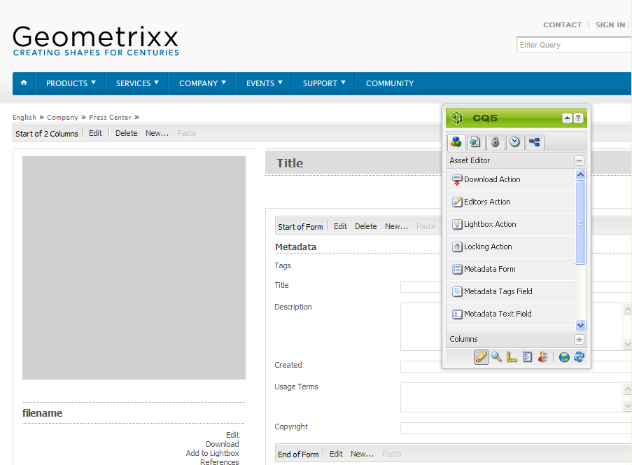
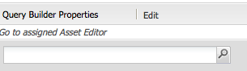
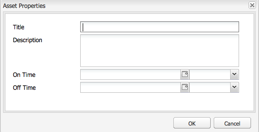
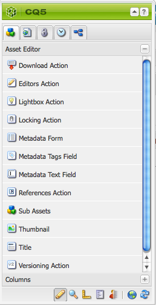

# Skapa och konfigurera sidor för Resursredigeraren {#creating-and-configuring-asset-editor-pages}

I det här dokumentet beskrivs följande:

* Därför ska du skapa anpassade resursredigeringssidor.
* Skapa och anpassa resursredigeringssidor, dvs. WCM-sidor, där du kan visa och redigera metadata samt utföra åtgärder på resursen.
* Så här redigerar du flera resurser samtidigt.

<!-- TBD: Add UICONTROL tags. Need PM review. Flatten the structure a bit. Re-write to remove Geometrixx mentions and to adhere to 6.5 default samples. -->

>[!NOTE]
>
>Resursresurs är tillgänglig som en referensimplementering med öppen källkod. Se Kommentarer för [resursdelning](https://adobe-marketing-cloud.github.io/asset-share-commons/). Det stöds inte officiellt.

## Varför skapa och konfigurera sidor i Resursredigeraren? {#why-create-and-configure-asset-editor-pages}

Digital Asset Management används i allt fler scenarier. När man går över från en småskalig lösning för en liten användargrupp yrkesutbildade användare - till exempel fotografer eller taxonomier - till större och mer mångsidiga användargrupper - t.ex. affärsanvändare, WCM-författare, journalister osv. - kan det kraftfulla användargränssnittet för professionella användare tillhandahålla för mycket information och intressenter börjar begära specifika användargränssnitt eller applikationer för att få tillgång till de digitala resurser som är relevanta för dem. [!DNL Adobe Experience Manager Assets]

Dessa resurscentrerade program kan vara enkla fotogallerier i ett intranät där medarbetarna kan ladda upp bilder från mässor eller ett presscenter på en offentlig webbplats. Tillgångscentrerade tillämpningar kan även omfatta kompletta lösningar som kundvagnar, kassor och verifieringsprocesser.

Att skapa ett resurscentrerat program blir i stor utsträckning en konfigurationsprocess som inte kräver kodning, bara kunskap om användargrupper och deras behov samt kunskap om de metadata som används. Resurscentrerade program som skapats med [!DNL Assets] är utökningsbara: med måttlig kodningsansträngning kan återanvändbara komponenter för att söka, visa och ändra resurser skapas.

Ett resurscentrerat program i [!DNL Experience Manager] består av en tillgångsredigeringssida, som kan användas för att få en detaljerad vy av en viss resurs. På en resursredigeringssida kan du även redigera metadata, förutsatt att användaren som använder resursen har de behörigheter som krävs.

<!--
## Create and configure an Asset Share page {#creating-and-configuring-an-asset-share-page}

You customize the DAM Finder functionality and create pages that have all the functionality you require, which are called Asset Share pages. To create a new Asset Share page, you add the page using the Geometrixx Asset Share template and then you customize the actions users can perform on that page, determine how viewers see the assets, and decide how users can build their queries.

Here are some use cases for creating a customized Asset Share page:

* Press Center for Journalists.
* Image Search Engine for internal business users.
* Image Database for website users.
* Media Tagging Interface for metadata editors.

### Create an Asset Share page {#creating-an-asset-share-page}

To create a new Asset Share page, you can either create it when you are working on web sites or from the digital asset manager.

>[!NOTE]
>
>By default, when you create an Asset Share page from **New** in the digital asset manager, an Asset viewer and Asset editor are automatically created for you.

To create an new Asset Share page in the **Websites** console:

1. In the **Websites** tab, navigate to the place where you want to create an asset share page and click **New**.

1. Select the **Asset Share** page and click **Create**. The new page is created and the asset share page is listed in the **Websites** tab.

The basic page created using the Geometrixx DAM Asset Share template looks as follows:

To customize your Asset Share page, you use elements from the sidekick and you also edit query builder properties. The page **Geometrixx Press Center** is a customized version of a page based on this template:

To create a new asset share page via the digital asset manager:

1. In the digital asset manager, in **New**, select **New Asset Share**.
1. In the **Title**, enter the name of the asset share page. If desired, enter a name for the URL.

   

1. Double-click the asset share page to open it and configure the page.

   

   By default, when you create an Asset Share page from **New**, an Asset viewer and Asset editor are automatically created for you.

#### Customize actions {#customizing-actions}

You can determine what actions users can perform on selected digital assets from a selection of predefined actions.

To add actions to the Asset Share page:

1. In the Asset Share page that you want to customize, click **Actions** in the sidekick.

The following actions are available:

 | Action | Description |
 |---|---|
 | [!UICONTROL Delete Action] | Users can delete the selected assets. |
 | [!UICONTROL Download Action] | Lets users download selected assets to their computers. |
 | [!UICONTROL Lightbox Action] | Saves assets to a "lightbox"   where you can perform other actions on them. This comes in handy when working   with assets across multiple pages. The lightbox can also be used as a   shopping cart for assets. |
 | [!UICONTROL Move Action] | Users can move the asset to another   location |
 | [!UICONTROL Tags Action] | Lets users add tags to selected assets |
 | [!UICONTROL View Asset Action] | Opens the asset in the Asset editor for   user manipulation. |

1. Drag the appropriate action to the **Actions** area on the page. Doing so creates a button that is used to execute that action.

#### Determine how search results are presented {#determining-how-search-results-are-presented}

You determine how results are displayed from a predefined list of lenses.

To change how search results are viewed:

1. In the Asset Share page that you want to customize, click Search.

1. Drag the appropriate lens to the top center of the page. In the Press Center, the lenses are already available. Users press the appropriate lens icon to display search results as desired.

The following lenses are available:

| Lens | Description |
|---|---|
| **[!UICONTROL List Lens]** |Presents the assets in a list fashion with details. |
| **[!UICONTROL Mosaic Lens]** |Presents assets in a mosaic fashion. |

#### Mosaic Lens {#mosaic-lens}

#### List Lens {#list-lens}

#### Customize the Query Builder {#customizing-the-query-builder}

The query builder lets you enter search terms and create content for the Asset Share page. When you edit the query builder, you also get to determine how many search results are displayed per page, which asset editor opens when you double-click an asset, the path the query searches, and customizes nodetypes.

To customize the query builder:

1. In the Asset Share page that you want to customize, click **Edit** in the Query Builder. By default, the **General** tab opens.
1. Select the number of results per page, the path of the asset editor (if you have a customized asset editor) and the Actions title.

1. Click the **Paths** tab. Enter a path or multiple paths that the search will run. These paths are overwritten if the user uses the Paths predicate.

1. Enter another node type, if desired.

1. In the **Query Builder URL** field, you can override or wrap the query builder and enter the new servlet URLs with the existing query builder component. In the **Feed URL** field, you can override the Feed URL as well.

1. In the **Text** field, enter the text you want to appear for results and page numbers of results. Click **OK** when finished making changes.

#### Add predicates {#adding-predicates}

Experience Manager Assets includes a number of predicates that you can add to the Asset Share page. These let your users further narrow searches. In some cases, they may override a query builder parameter (for example, the Path parameter).

To add predicates:

1. In the Asset Share page that you want to customize, click **Search**.

1. Drag the appropriate predicates to the Asset Share page underneath the query builder. Doing so creates the appropriate fields.

The following predicates are available:

| Predicate | Description |
|---|---|
| **[!UICONTROL Date Predicate]** |Lets users search for assets that were modified before and after certain dates. |
| **[!UICONTROL Options Predicate]** |The site owner can specify a property to search for (as in the property predicate, for example cq:tags) and a content tree to populate the options from (for example the tag tree). Doing so generates a list of options where the users can select the values (tags) that the selected property (tag property) should have. This predicate lets you build list controls like the list of tags, file types, image orientations, and so on. It is great for a fixed set of options. |
| **[!UICONTROL Path Predicate]** |Lets users define the path and subfolders, if desired. |
| **[!UICONTROL Property Predicate]** |The site owner specifies a property to search for, e.g. tiff:ImageLength and the user can then enter a value, e.g. 800. This returns all images that are 800 pixels high. Useful predicate if your property can have arbitrary values. |

For more information, see the [predicate Javadocs](https://helpx.adobe.com/experience-manager/6-5/sites/developing/using/reference-materials/javadoc/com/day/cq/search/eval/package-summary.html).

1. To configure the predicate further, double-click it. For example, when you open the Path Predicate, you need to assign the root path.

-->

## Skapa och konfigurera en resursredigeringssida {#creating-and-configuring-an-asset-editor-page}

Du anpassar resursredigeraren för att avgöra hur användare kan visa och redigera digitala resurser. För att göra detta skapar du en ny resursredigeringssida och anpassar sedan vyerna och de åtgärder som användarna kan utföra på den sidan.

>[!NOTE]
>
>Om du vill lägga till anpassade fält i DAM-resursredigeraren lägger du till nya `cq:Widget` noder i `/apps/dam/content/asseteditors.`

### Skapa en resursredigeringssida {#creating-the-asset-editor-page}

När du skapar sidan Resursredigerare kan det vara bra att skapa sidan direkt under sidan Resursdelning.

Så här skapar du en resursredigeringssida:

1. Gå till den plats där du vill skapa en resursredigeringssida på **[!UICONTROL Websites]** fliken och klicka på **Ny**.
1. Markera **Geometrixx Resursredigerare** och klicka på **Skapa**. Den nya sidan skapas och sidan visas på fliken **Webbplatser** .

Grundsidan som skapas med Geometrixx Resursredigeraren ser ut så här:

Om du vill anpassa resursredigeringssidan använder du element från sidosparken. Sidan Resursredigeraren som öppnas från **Geometrixx Press Center** är en anpassad version av en sida som är baserad på den här mallen:

#### Ange att en resursredigerare ska öppnas från en resursdelningssida {#setting-which-asset-editor-opens-from-an-asset-share-page}

När du har skapat den anpassade resursredigeringssidan måste du se till att när du dubbelklickar på resurser som den anpassade resursresursen du skapade öppnar resurserna på den anpassade redigeringssidan.

Så här anger du sidan Resursredigeraren:

1. På sidan Resursresurs klickar du på **Redigera** bredvid Frågebyggaren.

1. Klicka på fliken **Allmänt** om den inte redan är markerad.

1. I fältet **Sökväg till resursredigeraren** anger du sökvägen till den resursredigerare som du vill att sidan Resursdelning ska öppna resurser i och klickar på **OK**.

#### Lägg till komponenterna i Resursredigeraren {#adding-asset-editor-components}

Du bestämmer vilken funktionalitet en resursredigerare har genom att lägga till komponenter på sidan.

Så här lägger du till komponenterna för redigering av resurser:

1. På sidan Resursredigeraren som du vill anpassa väljer du **Resursredigeraren** i sidosparken. Alla tillgängliga komponenterna för redigeringsprogrammet för resurser visas.

>[!NOTE]
>
>Vad du kan anpassa beror på vilka komponenter som är tillgängliga. Om du vill aktivera komponenter går du till designläge och markerar de komponenter som du behöver ha aktiverade.

1. Dra komponenterna från sidosparken till resursredigeraren och gör eventuella ändringar i komponentdialogrutorna. Komponenterna beskrivs i följande tabell och beskrivs i de detaljerade instruktionerna som följer.

>[!NOTE]
>
>När du utformar resursredigeringssidan skapar du komponenter som är skrivskyddade eller redigerbara. Användarna vet att ett fält kan redigeras om en bild av en penna visas i den komponenten. Som standard är de flesta komponenter skrivskyddade.

| Komponent | Beskrivning |
|---|---|
| **[!UICONTROL Metadata Form]and[!UICONTROL Metadata Text Field]** | Gör att du kan lägga till ytterligare metadata för en resurs och utföra en åtgärd, som att skicka, för den resursen. |
| **[!UICONTROL Sub Assets]** | Gör att du kan anpassa underresurser. |
| **Taggar** | Tillåter användare att markera och lägga till taggar i en resurs. |
| **[!UICONTROL Thumbnail]** | Visar en miniatyrbild av resursen, dess filnamn och låter dig lägga till en alternativ text. Du kan även lägga till resursredigeringsåtgärder här. |
| **[!UICONTROL Title]** | Visar resursens titel, som kan anpassas. |

#### Metadataformulär och textfält - Konfigurera komponenten Visa metadata {#metadata-form-and-text-field-configuring-the-view-metadata-component}

Metadataformuläret är ett formulär som innehåller en start- och slutåtgärd. däremellan anger du **textfält** . Mer information om hur du arbetar med formulär finns i [Forms](/help/sites-authoring/default-components-foundation.md#form-component) .

1. Skapa en startåtgärd genom att klicka på **Redigera** i formulärets startdel. Om du vill kan du ange en Box-titel. Som standard är rutans rubrik **Metadata**. Markera kryssrutan Klientvalidering om du vill att Java-script-klientkoden ska genereras för validering.

1. Skapa en slutåtgärd genom att klicka på **Redigera** i formulärets slutområde. Du kan till exempel skapa en **Skicka** -knapp som tillåter användare att skicka metadataändringar. Du kan också lägga till en **återställningsknapp** som återställer metadata till det ursprungliga läget.

1. Dra metadatatextfält mellan **Formulärstart** och **Formulärslut** till formuläret. Användare fyller i metadata i dessa textfält som de kan skicka eller slutföra en annan åtgärd på.

1. Dubbelklicka på fältnamnet, till exempel **Titel** , för att öppna metadatafältet och göra ändringar. På fliken **Allmänt** i fönstret **Redigera komponent** definierar du namnutrymmet och fältetiketten samt typ, till exempel `dc:title`.

Mer information om hur du ändrar de namnutrymmen som finns i metadataformuläret finns i [Anpassa och utöka resurser](/help/assets/extending-assets.md) .

1. Klicka på fliken **Begränsningar** . Här kan du välja om ett fält är obligatoriskt och vid behov lägga till begränsningar.

1. Klicka på fliken **Visa** . Här kan du ange en ny bredd och ett nytt antal rader för metadatafältet. Markera kryssrutan **Fältet är skrivskyddat** om du vill tillåta användare att redigera metadata.

Följande är ett exempel på ett metadataformulär med olika fält:

På sidan Resursredigeraren kan användare sedan ange värden i metadatafälten (om de är redigerbara) och utföra slutåtgärden (till exempel skicka ändringarna).

#### Deltillgångar {#sub-assets}

I delresurskomponenten kan du visa och välja delresurser. Du kan bestämma vilka namn som ska visas under [huvudresursen](/help/assets/assets.md#what-are-digital-assets) och underresurserna.

Dubbelklicka på delresurskomponenten för att öppna dialogrutan med delresurser där du kan ändra rubrikerna för huvudresursen och eventuella delresurser. Standardvärdena visas under motsvarande fält.

Följande är ett exempel på en ifylld delresurskomponent:

Om du till exempel markerar en underresurs bör du tänka på hur komponenten visar rätt sida och ruttiteln ändras från underresurser till syskon.

#### Taggar {#tags}

Komponenten Tags är en komponent där användare kan tilldela befintliga taggar till en resurs, vilket gör det enklare att ordna och hämta den senare. Du kan göra den här komponenten skrivskyddad, så användarna kan inte lägga till taggar, utan bara visa dem.

Dubbelklicka på taggkomponenten för att öppna dialogrutan Taggar där du kan ändra titeln från Taggar, om du vill, och där du kan välja de tilldelade namnutrymmena. Om du vill göra det här fältet redigerbart avmarkerar du **[!UICONTROL Hide Edit]** kryssrutan. Som standard är taggar redigerbara.

Om användare kan redigera taggar kan de klicka på pennan för att lägga till taggar genom att välja dem i listrutan Taggar.

Följande är en ifylld tagg-komponent:

#### Miniatyrbild {#thumbnail}

Miniatyrkomponenten är den plats där den valda miniatyrbilden visas (för många av formaten extraheras miniatyrbilden automatiskt). Komponenten visar dessutom filnamnet och de [åtgärder som du kan ändra](/help/assets/assets-finder-editor.md#adding-asset-editor-actions).

Dubbelklicka på miniatyrkomponenten för att öppna dialogrutan med miniatyrbilder där du kan ändra alternativ text. Som standard används miniatyrbilden för alternativ text som **Klicka för att hämta** resursen.

Följande är ett exempel på en fylld miniatyrkomponent:

#### Titel {#title}

Rubrikkomponenten visar resursens namn och en beskrivning.

Som standard är den i skrivskyddat läge, så användare kan inte redigera den. Dubbelklicka på komponenten och avmarkera kryssrutan **Dölj redigeringsknapp** om du vill göra den redigerbar. Ange dessutom en titel för flera resurser.

Om du kan redigera titeln kan du lägga till en titel och en beskrivning genom att klicka på pennan för att öppna fönstret **Resursegenskaper** . Dessutom kan du aktivera och inaktivera resursen genom att välja datum och tid.

När du redigerar [!UICONTROL Title]kan du ändra **titel**, **beskrivning** och ange **På** - och **Av-tider** för att aktivera och inaktivera resursen.

Följande är ett exempel på en ifylld Title-komponent:

#### Lägg till resursredigeringsåtgärder {#adding-asset-editor-actions}

Du kan avgöra vilka åtgärder användare kan utföra på valda digitala resurser från ett urval av fördefinierade åtgärder.

Så här lägger du till åtgärder på sidan Resursredigeraren:

1. På sidan Resursredigeraren som du vill anpassa klickar du på **Resursredigeraren** i sidosparken.

Följande åtgärder är tillgängliga:

| Åtgärd | Beskrivning |
|---|---|
| [!UICONTROL Download] | Tillåter användare att hämta valda resurser till sina datorer. |
| [!UICONTROL Editors] | Tillåter användare att redigera en bild (interaktiv redigering) |
| [!UICONTROL Lightbox] | Sparar resurser i en&quot;ljuslåda&quot; där du kan utföra andra åtgärder på dem. Detta är praktiskt när du arbetar med resurser på flera sidor. |
| [!UICONTROL Locking] | Tillåter användare att låsa en resurs. Den här funktionen är inte aktiverad som standard och måste aktiveras i komponentlistan. |
| [!UICONTROL References] | Klicka här för att visa på vilka sidor resursen används. |
| [!UICONTROL Versioning] | Gör att du kan skapa och återställa versioner av en resurs. |

1. Dra lämplig åtgärd till området **Åtgärder** på sidan. När du gör det skapas en knapp som används för att utföra åtgärden.

## Flera redigeringsresurser med sidan Resursredigeraren {#multi-editing-assets-with-the-asset-editor-page}

Med [!DNL Experience Manager Assets] hjälp av kan du ändra flera resurser samtidigt. När du har valt resurser kan du ändra deras:

* Taggar
* Metadata

Så här gör du om du vill redigera flera resurser på sidan Resursredigeraren:

1. Öppna sidan Geometrixx **Press Center** :
   `https://localhost:4502/content/geometrixx/en/company/press.html`

1. Välj resurser:

   * i Windows: `Ctrl + click` varje resurs.
   * på Mac: `Cmd + click` varje resurs.

   Så här väljer du en rad resurser: klicka på den första resursen och sedan på `Shift + click` den sista resursen.

1. Klicka på **Redigera metadata** i fältet **Åtgärder** (vänster del av sidan).
1. Geometrixx **Press Center Asset Editor** öppnas på en ny flik. Resursernas metadata visas enligt följande:

   * En tagg som inte gäller för alla resurser utan bara för ett fåtal, visas i kursiv stil.
   * En tagg som gäller för alla resurser visas med ett vanligt teckensnitt.
   * Andra metadata än taggar: värdet för fältet visas bara om det är samma för alla markerade resurser.

1. Klicka på **Hämta** för att hämta en ZIP-fil som innehåller de ursprungliga resursåtergivningarna.
1. Klicka på Redigera taggalternativet som finns bredvid fältet **Taggar** .

   * En tagg som inte gäller för alla resurser, men bara för ett fåtal har en grå bakgrund.
   * En tagg som gäller för alla resurser har en vit bakgrund.

   Du kan:

   * Klicka `x` för att ta bort taggen för alla resurser.
   * Klicka `+` för att lägga till taggen i alla resurser.
   * Klicka på **pilen** och välj en tagg för att lägga till en ny tagg till alla resurser.

   Klicka på **OK** för att skriva ändringarna i formuläret. Rutan bredvid fältet **Taggar** markeras automatiskt.

1. Redigera beskrivningsfältet. Ange det till exempel till:

   `This is a common description`

   När ett fält redigeras skrivs de befintliga värdena för de valda resurserna över när formuläret skickas.

   Obs! kryssrutan bredvid fältet markeras automatiskt när fältet redigeras.

1. Klicka på **Uppdatera metadata** för att skicka formuläret och spara ändringarna för alla resurser.

   Obs! endast markerade metadata ändras.
