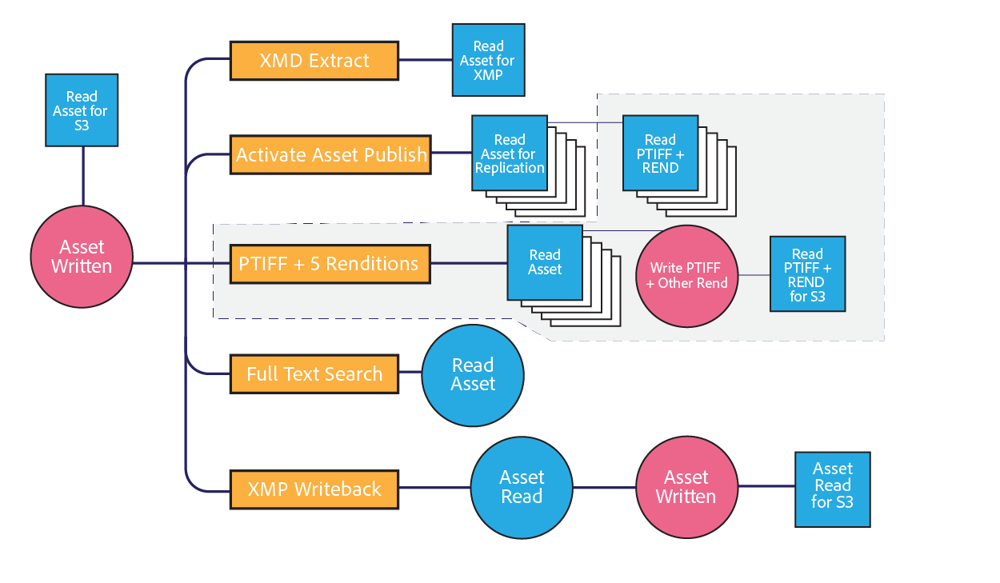

# [!DNL Assets] nätverkshänsyn {#assets-network-considerations}

Det är lika viktigt att förstå ditt nätverk som att förstå [!DNL Adobe Experience Manager Assets]. Nätverket kan påverka uppladdning, nedladdning och användarupplevelser. Genom att diagram över din nätverkstopologi kan du identifiera kodpunkter och underoptimerade områden i nätverket som du måste åtgärda för att förbättra nätverkets prestanda och användarupplevelsen.

Se till att du inkluderar följande i nätverksdiagrammet:

* Anslutning från klientenheten (till exempel dator, mobil och surfplatta) till nätverket.
* Företagsnätets topologi.
* Länka till Internet från företagsnätverket och miljön [!DNL Experience Manager].
* Topologi för miljön [!DNL Experience Manager].
* Definiera samtidiga konsumenter av nätverksgränssnittet [!DNL Experience Manager].
* Definierade arbetsflöden för distributionen [!DNL Experience Manager].

## Anslutning från klientenheten till företagsnätverket {#connectivity-from-the-client-device-to-the-corporate-network}

Börja med att diagram över anslutningen mellan de enskilda klientenheterna och företagsnätverket. I det här skedet kan du identifiera delade resurser, t.ex. WiFi-anslutningar, där flera användare använder samma punkt eller Ethernet-växlar för att överföra och hämta resurser.

Klientenheter ansluter till företagsnätverket på olika sätt, t.ex. via WiFi, Ethernet till en delad switch samt via VPN. Det är viktigt att identifiera och förstå kontrollpunkter i det här nätverket för att [!DNL Assets] ska kunna planera och ändra nätverket.

Överst till vänster i diagrammet visas tre enheter som delar en WiFi-åtkomstpunkt på 48 Mbit/s. Om alla enheter överförs samtidigt delas WiFi-nätverkets bandbredd mellan enheterna. Jämfört med systemet som helhet kan en användare stöta på en annan krymppunkt för de tre klienterna över den här delade kanalen.

Det är en utmaning att mäta den verkliga hastigheten för ett WiFi-nätverk eftersom en långsam enhet kan påverka andra klienter på åtkomstpunkten. Om du tänker använda WiFi för resursinteraktioner, ska du utföra ett hastighetstest från flera klienter samtidigt för att utvärdera genomströmningen.

Bilden längst ned till vänster visar två enheter som är anslutna till företagets nätverk via oberoende kanaler. Därför kan varje enhet ha en minimihastighet på 10 Mbit/s och 100 Mbit/s.

Den dator som visas till höger har en begränsad uppström till företagsnätverket via ett VPN med en hastighet på 1 Mbit/s. Användarupplevelsen för 1 Mbit/s-anslutningen skiljer sig avsevärt från användarupplevelsen via 1 Gbit/s-anslutningen. Beroende på storleken på de resurser som användarna interagerar med kan deras VPN-anslutning vara otillräcklig för uppgiften.

## Företagets topologi {#topology-of-the-corporate-network}

Diagrammet visar högre hastigheter för överordnad länk inom företagsnätverket än vad som vanligtvis används. Dessa rör är delade resurser. Om den delade växeln förväntas hantera 50 klienter kan det vara en krymppunkt. I det inledande diagrammet delar bara två datorer den aktuella anslutningen.

## Länka till Internet från företagsnätverket och miljön [!DNL Experience Manager] {#uplink-to-the-internet-from-the-corporate-network-and-aem-environment}

Det är viktigt att ta hänsyn till okända faktorer på Internet och VPC-anslutningen eftersom bandbredden över Internet kan försämras på grund av belastningstopp eller storskaliga leverantörsavbrott. I allmänhet är internetanslutningen tillförlitlig. Ibland kan det dock medföra att kontrollpunkter läggs till.

På uppkopplingen från ett företagsnätverk till Internet kan det finnas andra tjänster som använder bandbredden. Det är viktigt att du förstår hur stor del av bandbredden som kan dedikeras eller prioriteras för Assets. Om till exempel en 1 Gbit/s-länk redan har 80 % utnyttjandegrad kan du bara allokera högst 20 % av bandbredden för [!DNL Experience Manager Assets].

Företagets brandväggar och proxies kan också forma bandbredden på många olika sätt. Den här typen av enhet kan prioritera bandbredden med hjälp av tjänstekvalitet, bandbreddsbegränsningar per användare eller bithastighetsbegränsningar per värd. Det här är viktiga kontrollpunkter att undersöka eftersom de kan påverka användarupplevelsen för [!DNL Assets] i betydande grad.

I det här exemplet har företaget en upplänk på 10 Gbit/s. Den borde vara tillräckligt stor för flera kunder. Dessutom har brandväggen en värdhastighetsgräns på 10 Mbit/s. Denna begränsning kan potentiellt begränsa trafiken till en enda värd till 10 Mbit/s, även om uppkopplingen till Internet är på 10 Gbit/s.

Det här är den minsta klientorienterade kodpunkten. Du kan dock utvärdera om en tillåtelselista har ändrats eller konfigurerats med den nätverksåtgärdsgrupp som ansvarar för den här brandväggen.

I exempeldiagrammen kan du dra slutsatsen att sex enheter delar en konceptuell kanal på 10 Mbit/s. Beroende på storleken på de resurser som används kan detta vara otillräckligt för att uppfylla användarnas förväntningar.

## Topologi för miljön [!DNL Experience Manager] {#topology-of-the-aem-environment}

För att designa topologin för miljön [!DNL Experience Manager] krävs detaljerade kunskaper om systemkonfigurationen och hur nätverket är anslutet i användarmiljön.

Exempelscenariot innehåller en publiceringsgrupp med fem servrar, en binär S3-butik och Dynamic Media-konfigurerad.

Dispatcharen delar sin 100 Mbit/s-anslutning med två entiteter, utsidan och distributionen [!DNL Experience Manager]. För samtidiga överförings- och nedladdningsåtgärder bör du dividera numret med två. Den anslutna externa lagringsplatsen använder en separat anslutning.

Distributionen [!DNL Experience Manager] delar sin 1 Gbit/s-anslutning med flera tjänster. Från ett nätverkstopologiperspektiv motsvarar det att dela en kanal med olika tjänster.

Om du granskar nätverket från klientenheten till distributionen av [!DNL Experience Manager] verkar den minsta kodpunkten vara begränsningen av företagsbrandväggen på 10 Mbit. Du kan använda de här värdena i storlekskalkylatorn i [Assets storleksguide](assets-sizing-guide.md) för att avgöra användarupplevelsen.

## Definierade arbetsflöden för distributionen [!DNL Experience Manager] {#defined-workflows-of-the-aem-deployment}

När du tar hänsyn till nätverksprestanda kan det vara viktigt att tänka på arbetsflödena och publiceringen som kommer att ske i systemet. Dessutom använder S3 eller annan nätverksansluten lagring som du använder och I/O-begäranden nätverksbandbredd. Det innebär att även i ett helt optimerat nätverk kan prestanda begränsas av disk-I/O.

Om du vill effektivisera processerna kring tillgångsintag (särskilt när du överför ett stort antal resurser) kan du utforska arbetsflödena och förstå mer om deras konfiguration.

När du utvärderar den interna arbetsflödestopologin bör du analysera följande:

* Rutiner som skriver en tillgång
* Arbetsflöden/händelser som utlöses när resurser/metadata ändras
* Rutiner som läser en resurs

Här är några saker att tänka på:

* XMP metadata read/write-back
* Automatisk aktivering och replikering
* Vattenstämpel
* Intag/sidextrahering av delmaterial
* Överlappande arbetsflöden.

Här är ett kundexempel för definitionen av ett arbetsflöde för resurser.

