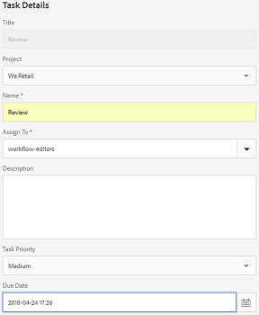
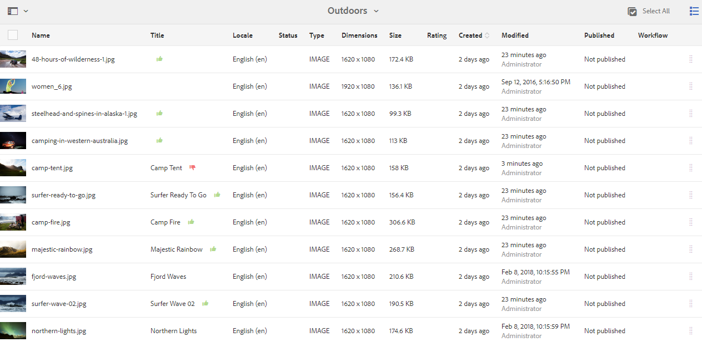

# Granska resurser i mappar och samlingar {#review-folder-assets-and-collections}

Ställ in granskningsarbetsflöden för material i en mapp eller en samling och dela dem med granskare eller kreativa partners för att få feedback.

Med Adobe Experience Manager Assets (AEM) kan ni skapa ett ad hoc-granskningsarbetsflöde för resurser i en mapp eller samling och dela det med granskare eller kreativa partner för att få feedback.

Du kan antingen associera granskningsarbetsflödet med ett projekt eller skapa en oberoende granskningsåtgärd.

När du har delat resurserna kan granskarna godkänna eller avvisa dem. Meddelanden skickas i olika faser av arbetsflödet för att meddela avsedda mottagare om att olika uppgifter har slutförts. När du till exempel delar en mapp eller samling får granskaren ett meddelande om att en mapp/samling har delats för granskning.

När granskaren har slutfört granskningen (godkänner eller avvisar resurser) får du ett meddelande om slutförd granskning.

## Skapa en granskningsuppgift för mappar {#creating-a-review-task-for-folders}

1. I Assets-användargränssnittet väljer du den mapp som du vill skapa en granskningsuppgift för.
1. Tryck på **[!UICONTROL Skapa granskningsuppgift]** i verktygsfältet för att öppna sidan **[!UICONTROL Granskningsuppgift]** . If you cannot see the option in the toolbar, tap/click **[!UICONTROL More]** and then select the option.

   

1. (Valfritt) I listan **[!UICONTROL Projekt]** väljer du det projekt som du vill associera granskningsaktiviteten med. Som standard är alternativet **[!UICONTROL Ingen]** markerat. Om du inte vill associera något projekt med granskningsaktiviteten ska du behålla det här valet.

   >[!NOTE]
   >
   >Endast de projekt som du har redigeringsbehörighet för (eller högre) visas i listan **[!UICONTROL Projekt]** .

1. Ange ett namn för granskningsaktiviteten och välj en godkännare i listan **[!UICONTROL Tilldela till]** .

   >[!NOTE]
   >
   >Medlemmarna/grupperna i det valda projektet är tillgängliga som godkännare i listan **[!UICONTROL Tilldela till]** .

1. Ange en beskrivning, uppgiftsprioritet och förfallodatum för granskningsaktiviteten.

   

1. På fliken Avancerat anger du en etikett som ska användas för att skapa URI:n.

   

1. Tap/click **[!UICONTROL Submit]**, and then tap/click **[!UICONTROL Done]** to close the confirmation message. Ett meddelande om den nya uppgiften skickas till godkännaren.
1. Logga in på AEM Assets som godkännare och navigera till Assets UI. Om du vill godkänna resurser trycker du på **[!UICONTROL Notifications (Meddelanden]** ) och väljer sedan granskningsåtgärden i listan.

   

1. In the **[!UICONTROL Review Task]** page, examine the details of the review task, and then tap/click **[!UICONTROL Review]**.
1. Markera resurser på sidan **[!UICONTROL Granska uppgift]** och tryck på **[!UICONTROL Godkänn/Avvisa]** för att godkänna eller avvisa.

   

1. Tryck på **[!UICONTROL Fullständig]** i verktygsfältet. Skriv en kommentar i dialogrutan och bekräfta genom att trycka/klicka på **[!UICONTROL Slutför]** .
1. Navigera till Assets-användargränssnittet och öppna mappen. Ikonerna för godkännandestatus för resurserna visas i kortvyn och listvyn.

   **Kortvy**

   

   **Listvy**

   

## Skapa en granskningsuppgift för samlingar {#creating-a-review-task-for-collections}

1. På sidan Samlingar väljer du den samling som du vill skapa en granskningsuppgift för.
1. Tryck på **[!UICONTROL Skapa granskningsuppgift]** i verktygsfältet för att öppna sidan **[!UICONTROL Granskningsuppgift]** . Om du inte kan se alternativet i verktygsfältet trycker du på **[!UICONTROL Mer]** och väljer sedan alternativet.

   

1. (Valfritt) I listan **[!UICONTROL Projekt]** väljer du det projekt som du vill associera granskningsaktiviteten med. Som standard är alternativet **[!UICONTROL Ingen]** markerat. Om du inte vill associera något projekt med granskningsaktiviteten ska du behålla det här valet.

   >[!NOTE]
   >
   >Endast de projekt som du har redigeringsbehörighet för (eller högre) visas i listan **[!UICONTROL Projekt]** .

1. Ange ett namn för granskningsaktiviteten och välj en godkännare i listan **[!UICONTROL Tilldela till]** .

   >[!NOTE]
   >
   >Medlemmarna/grupperna i det valda projektet är tillgängliga som godkännare i listan **[!UICONTROL Tilldela till]** .

1. Ange en beskrivning, uppgiftsprioritet och förfallodatum för granskningsaktiviteten.

   

1. Tap/click **[!UICONTROL Submit]**, and then tap/click **[!UICONTROL Done]** to close the confirmation message. Ett meddelande om den nya uppgiften skickas till godkännaren.
1. Logga in på AEM Assets som godkännare och navigera till Assets-konsolen. Om du vill godkänna resurser trycker du på **[!UICONTROL Notifications (Meddelanden]** ) och väljer sedan granskningsåtgärden i listan.
1. In the **[!UICONTROL Review Task]** page, examine the details of the review task, and then tap/click **[!UICONTROL Review]**.
1. Alla resurser i samlingen visas på granskningssidan. Markera resurserna och tryck på **[!UICONTROL Godkänn/Avvisa]** för att godkänna eller avvisa resurser.

   

1. Tryck på **[!UICONTROL Fullständig]** i verktygsfältet. Skriv en kommentar i dialogrutan och bekräfta genom att trycka/klicka på **[!UICONTROL Slutför]** .
1. Navigera till samlingskonsolen och öppna samlingen. Ikonerna för godkännandestatus för resurserna visas både i kort- och listvyn.

   

   *Bild: Kortvy*

   

   *Bild: Listvy*
