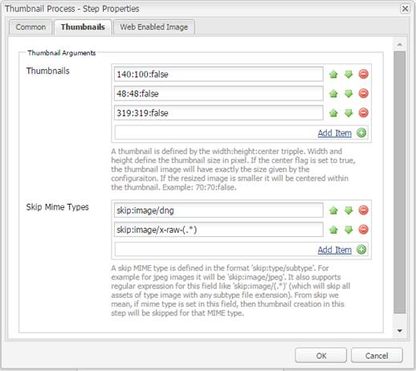

# Stöd för att bearbeta bilder med Camera Raw {#camera-raw-support}

Du kan aktivera Camera Raw-stödet för att bearbeta råfilsformat, som CR2, NEF och RAF, och återge bilderna i JPEG-format. Funktionen stöds i Adobe Experience Manager Assets med hjälp av [Camera Raw-paketet](https://www.adobeaemcloud.com/content/marketplace/marketplaceProxy.html?packagePath=/content/companies/public/adobe/packages/aem630/product/assets/aem-assets-cameraraw-pkg) som är tillgängligt via Paketdelning.

>[!NOTE]
>
>Funktionen stöder endast JPEG-återgivningar. Det stöds i Windows 64-bitars, Mac OS och RHEL 7.x.

Så här aktiverar du stöd för Camera Raw i Adobe Experience Manager Assets:

1. Hämta [Camera Raw-paketet](https://www.adobeaemcloud.com/content/marketplace/marketplaceProxy.html?packagePath=/content/companies/public/adobe/packages/aem630/product/assets/aem-assets-cameraraw-pkg) från paketresursen.
1. Åtkomst `https://[aem_server]:[port]/workflow`. Öppna arbetsflödet för **[!UICONTROL DAM-uppdatering av resurser]** .
1. Öppna steget **[!UICONTROL Bearbeta miniatyrbilder]** .
1. Ange följande konfiguration på fliken **[!UICONTROL Miniatyrbilder]** :

   * **[!UICONTROL Miniatyrbilder]**: `140:100:false, 48:48:false, 319:319:false`
   * **[!UICONTROL Hoppa över MIME-typer]**: `skip:image/dng, skip:image/x-raw-(.*)`
   

1. På fliken **[!UICONTROL Webbaktiverad bild]** anger du **[!UICONTROL i fältet]** Hoppa över lista `audio/mpeg, video/(.*), image/dng, image/x-raw-(.*)`.

   

1. Lägg till **[!UICONTROL Camera Raw/DNG Handler]** -steget under steget Skapa **** miniatyrbilder i sidopanelen.
1. I steget **[!UICONTROL Camera Raw/DNG Handler]** lägger du till följande konfiguration på fliken **[!UICONTROL Argument]** :

   * **[!UICONTROL Mime-typer]**: `image/dng` och `image/x-raw-(.*)`
   * **[!UICONTROL Kommando]**:

      * `DAM_Raw_Converter ${directory}/${filename} ${directory} cq5dam.web.1280.1280.jpeg 1280 1280`
      * `DAM_Raw_Converter ${directory}/${filename} ${directory} cq5dam.thumbnail.319.319.jpeg 319 319`
      * `DAM_Raw_Converter ${directory}/${filename} ${directory} cq5dam.thumbnail.140.100.jpeg 140 100`
      * `DAM_Raw_Converter ${directory}/${filename} ${directory} cq5dam.thumbnail.48.48.jpeg 48 48`
   

1. Click **[!UICONTROL Save]**.

>[!NOTE]
>
>Kontrollera att konfigurationen ovan är densamma som konfigurationen för **[!UICONTROL DAM-uppdateringsresurs med Camera RAW och DNG Handling Step]** .

Nu kan du importera Camera Raw-filer till AEM Resurser. När du har installerat Camera RAW-paketet och konfigurerat det arbetsflöde som krävs visas alternativet **[!UICONTROL Bildjustering]** i listan med sidorutor.

*Bild: Alternativ på sidopanelen.*

*Bild: Använd det här alternativet om du vill göra små ändringar i dina bilder.*

När du har sparat redigeringarna i en Camera Raw-bild `AdjustedPreview.jpg` skapas en ny återgivning för bilden. För andra bildtyper än Camera Raw återspeglas ändringarna i alla återgivningar.

## God praxis, kända problem och begränsningar {#best-practices}

Funktionen har följande begränsningar:

* Funktionen stöder endast JPEG-återgivningar. Det stöds i Windows 64-bitars, Mac OS och RHEL 7.x.
* Metadatatillbakaskrivning stöds inte för RAW- och DNG-format.
* Camera Raw-biblioteket har begränsningar för det totala antalet pixlar som kan bearbetas samtidigt. För närvarande kan programmet bearbeta maximalt 65 000 pixlar på den långa sidan av en fil eller 512 MP, oavsett vilket villkor som påträffas först.
