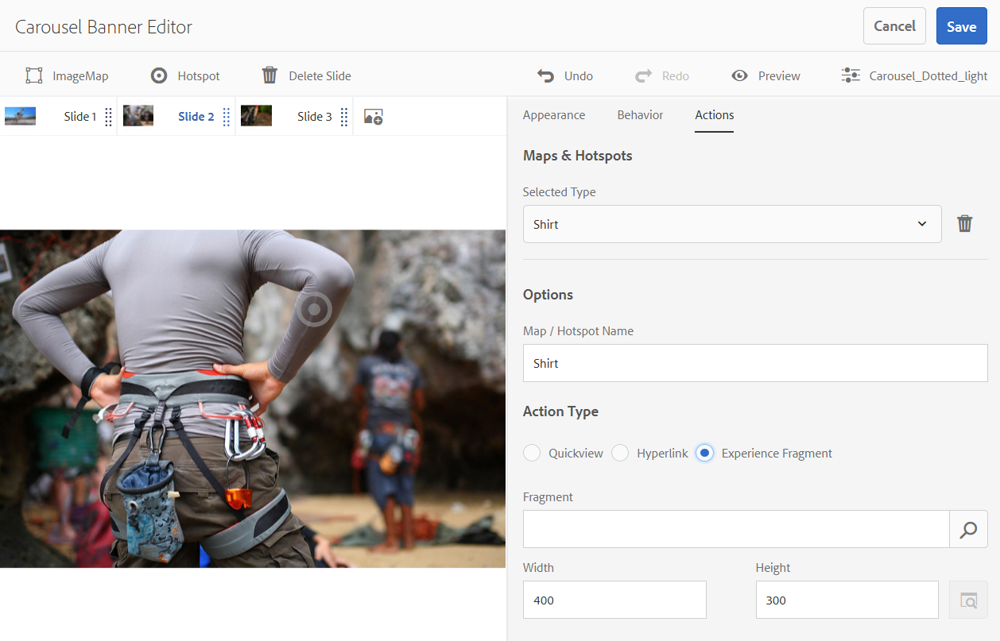

# Carousel banners{#carousel-banners}

Carousel-banners gör det möjligt för marknadsförare att öka konverteringsgraden genom att enkelt skapa interaktivt roterande marknadsföringsmaterial och leverera det till alla skärmar.

Det kan vara tidskrävande att skapa och ändra innehåll i reklambanners, vilket begränsar möjligheten att snabbt publicera nytt innehåll eller göra det mer riktat. Med Carousel-banderoller kan du snabbt skapa eller ändra roterande banderoller. Ni kan lägga till interaktivitet, till exempel hotspot-områden som länkar till produktinformation eller relaterade resurser, och leverera dem till alla skärmar, så att ni snabbare kan få ut nytt marknadsföringsmaterial på marknaden.

Karusellbanderoller definieras av en banderoll med ordet **[!UICONTROL CAROUSELSET]**

På din webbplats kan en karusellbanderoll se ut så här:

Här kan du navigera bland bilderna (genom att klicka på siffrorna). Dessutom roteras bildrutorna automatiskt baserat på ett tidsintervall som du kan anpassa. Bilder som du lägger till i Carousel-banners har stöd för både hotspot-områden och bildscheman, där användarna antingen kan välja eller gå till en hyperlänk eller komma åt ett Quickview-fönster.

I det här exemplet har en användare tryckt på eller klickat på ett bildschema och öppnat fönstret Quickview för handskar:

## Se hur karusellbanners skapas {#watch-how-carousel-banners-are-created}

Spela upp en genomgång om [hur karusellbanderoller skapas](https://s7d5.scene7.com/s7viewers/html5/VideoViewer.html?videoserverurl=https://s7d5.scene7.com/is/content/&amp;emailurl=https://s7d5.scene7.com/s7/emailFriend&amp;serverUrl=https://s7d5.scene7.com/is/image/&amp;config=Scene7SharedAssets/Universal_HTML5_Video_social&amp;contenturl=https://s7d5.scene7.com/skins/&amp;asset=S7tutorials/InteractiveCarouselBanner)(10 minuter och 33 sekunder). Du får också lära dig hur du förhandsgranskar, redigerar och levererar karusellbanderoller.

>[!NOTE]
>
>Icke-administrativa användare måste läggas till i gruppen **[!UICONTROL `dam-users`]** för att kunna skapa eller redigera Carousel-banners. Om du har problem med att skapa eller redigera kontaktar du systemadministratören som kan lägga till dig i gruppen **[!UICONTROL `dam-users`]**.

## Snabbstart: Carousel banners {#quick-start-carousel-banners}

Så här kommer du igång snabbt med Carousel banners:

1. [Identifiera hotspot- och bildschemavariabler](#identifying-hotspot-and-image-map-variables) (endast för kunder som använder Experience Manager Assets + Dynamic Media)

   Börja med att identifiera dynamiska variabler som används i den befintliga Quickview-implementeringen så att du kan ange klickbara områden och data från bildscheman korrekt när du skapar en karusellbanderoll i Adobe Experience Manager Assets.

   >[!NOTE]
   >
   >Om du är kund hos Experience Manager Sites eller e-handel kan du använda den inbyggda funktionen för att navigera till produktsidor och söka efter befintliga SKU:er (Stock Keeping Unit) i produktkatalogen. Du behöver inte ange variabler för hotspot eller bildschema manuellt. Se information om [konfiguration av e-handel](/help/commerce/cif-classic/administering/generic.md).
   >
   >
   >Om du använder Experience Manager Assets och Dynamic Media anger du manuellt data för hotspot-områden och bildscheman och integrerar sedan den publicerade URL:en eller inbäddningskoden med ditt tredjeparts innehållshanteringssystem.

1. Valfritt: [Skapa en visningsförinställning för en karuselluppsättning](/help/assets/managing-viewer-presets.md) om det behövs.

   Om du är administratör kan du anpassa karusellens beteende och utseende genom att skapa en egen förinställning för Carousel-visningsprogrammet. Den största fördelen är att du kan återanvända den här anpassade visningsförinställningen för flera bildspel. Man kan dock anpassa karusellens beteende och utseende direkt när man skapar karusellen. Den här metoden är att föredra när du vill ha en specifik design för en viss karusell.

1. [Överför en bildbanderoll](#uploading-image-banners).

   Överför bildbanderoller som du vill göra interaktiva.

1. [Skapa Carousel-uppsättningar](#creating-carousel-sets).

   I Carousels-uppsättningar navigerar användarna genom banderollbilder och väljer hotspot-områden eller bildscheman för att få tillgång till relevant innehåll.

   Om du vill skapa en Carousel-uppsättning i Assets väljer du **[!UICONTROL Create]** och sedan **[!UICONTROL Carousel Sets]**. Lägg till resurser i varje bildruta och välj **[!UICONTROL Save]**. Du kan också redigera karusellens utseende och beteende direkt i redigeraren.

1. [Lägg till aktiveringspunkter eller bildscheman i en bildbanderoll](#adding-hotspots-or-image-maps-to-an-image-banner).

   Lägg till en eller flera hotspot-områden eller bildscheman i en bildbanderoll och koppla dem till en åtgärd som en länk, en snabbvy eller ett Experience Fragment. När du har lagt till aktiveringspunkter eller bildscheman avslutar du den här uppgiften genom att publicera karuselluppsättningen. Med Publicering skapas den inbäddningskod som du kan använda för att kopiera och tillämpa på webbplatsens landningssida.

   Se [(Valfritt) Förhandsgranska karusellbanderoller ](#optional-previewing-carousel-banners) - valfritt. Om du vill kan du visa en representation av karuselluppsättningen och testa dess interaktivitet.

1. [Publish Carousel banners](#publishing-carousel-banners).

   Du publicerar en Carousel-uppsättning på samma sätt som andra resurser. I Assets går du till Carousel-uppsättningen, markerar den och väljer **[!UICONTROL Publish]**. När du publicerar en Carousel Set aktiveras URL:en och strängen Embed.

1. Gör något av följande:

   * [Lägg till en karusellbanderoll på webbplatssidan](#adding-a-carousel-banner-to-your-website-page) Du kan lägga till karusellbanderollens URL eller inbäddningskod som du har kopierat till webbplatssidan.

      * [Integrera karusellbanderollen med en befintlig Quickview](#integrating-the-carousel-banner-with-an-existing-quickview). Om du använder ett tredjepartssystem för hantering av webbinnehåll måste du integrera den nya Carousel-banderollen med den befintliga Quickview-implementeringen på din webbplats.

   * [Lägg till en karusellbanderoll på webbplatsen i Experience Manager](/help/assets/adding-dynamic-media-assets-to-pages.md) Om du är Experience Manager Sites-kund kan du lägga till karuselluppsättningen direkt på sidan i Experience Manager med hjälp av komponenten Interactive Media.

Mer information om hur du redigerar Carousel-uppsättningar finns i [redigera Carousel-uppsättningar](#editing-carousel-sets). Dessutom kan du visa och redigera [Carousel Set-egenskaper](manage-assets.md#editing-properties).

## Identifiera hotspot- och bildschemavariabler {#identifying-hotspot-and-image-map-variables}

Börja med att identifiera dynamiska variabler som används av den befintliga Quickview-implementeringen så att du kan ange klickbara områden eller data från bildscheman korrekt när du skapar karuselluppsättningar i Experience Manager Assets.

När du lägger till aktiveringspunkter eller bildscheman i en banderollbild i Experience Manager Assets tilldelar du en SKU och valfria extra variabler till varje hotspot eller bildschema. Sådana variabler används senare för att matcha hotspot-områden eller bildscheman med QuickView-innehåll.

>[!NOTE]
>
>Om du är kund hos Experience Manager Sites och/eller Experience Manager Ecommerce hoppar du över det här steget. Du behöver inte identifiera hotspot- eller bildschemavariabler manuellt. Du kan använda integreringen med e-handel för produktintegrering. Se information om [konfiguration av e-handel](/help/commerce/cif-classic/administering/generic.md). Dessutom kan du använda den interaktiva komponenten och lägga till den på webbsidan.
>
>Om du är kund hos Experience Manager Assets eller Media publicerar du URL:en eller Bädda in kod och integrerar sedan med ditt tredjepartssystem för innehållshantering och identifierar hotspot-områden och bildscheman manuellt.

Det är viktigt att kunna identifiera antalet och typen av variabler som ska kopplas till hotspot- eller bildschemadata. Varje hotspot eller bildschema som läggs till i en banderollbild måste innehålla tillräckligt med information för att entydigt identifiera produkten i det befintliga backend-systemet. Samtidigt får varje hotspot eller bildschema inte innehålla mer data än nödvändigt. Orsaken är att det skulle göra inmatningsprocessen alltför komplex och pågående hotspot- eller bildschemahantering mer felbenägen.

Det finns olika sätt att identifiera en uppsättning variabler som ska användas för hotspot- eller bildschemaddata.

Ibland räcker det att rådfråga IT-specialister som är ansvariga för den befintliga Quickview-implementeringen. De vet troligtvis vilken minimiuppsättning data som krävs för att identifiera Quickview i systemet. Vanligtvis går det också att analysera det befintliga beteendet för koden.

De flesta QuickView-implementeringar använder följande paradigm:

* Användaren aktiverar ett element i användargränssnittet på webbplatsen. Till exempel trycker de på en **[!UICONTROL Quickview]**-knapp.
* Webbplatsen skickar en Ajax-begäran till serverdelen för att läsa in QuickView-data eller -innehåll vid behov.
* Quickview-data översätts till innehållet som förberedelse för återgivning på webbsidan.
* Slutligen återges sådant innehåll på skärmen visuellt i koden.

Då besöker man olika delar av den befintliga webbplatsen där QuickView-funktionen används. Starta Quickview och hämta den Ajax-URL som skickats av webbsidan för att läsa in QuickView-data eller -innehåll.

Normalt behöver du inte använda några specialverktyg för felsökning. Moderna webbläsare har webbinspektörer som klarar ett bra jobb. Nedan följer några exempel på webbläsare som innehåller webbinspektörer:

* Om du vill visa alla utgående HTTP-begäranden i Google Chrome trycker du på F12 (Windows) eller Command-Option-I (Mac) för att öppna panelen Utvecklarverktyg och väljer sedan fliken Nätverk.
* I Firefox kan du antingen aktivera plugin-programmet för Firebug genom att trycka på F12 (Windows) eller Command-Option-I (Mac) och använda fliken Net. Du kan också använda det inbyggda inspektörsverktyget och nätverksfliken.

När nätverksövervakning är aktiverat i webbläsaren utlöser du snabbvyn på sidan.

Nu kan du hitta Quickview Ajax-URL:en i nätverksloggen och kopiera den inspelade URL:en för framtida analys. Vanligtvis skickas flera begäranden till servern när du utlöser snabbvyn. Vanligtvis är Quickview Ajax-URL en en av de första i listan. Den har antingen en komplex frågesträngsdel eller sökväg och dess MIME-svarstyp är antingen `text/html`, `text/xml` eller `text/javascript`.

Under den här processen är det viktigt att du besöker olika delar av webbplatsen, med olika produktkategorier och typer. Anledningen är att URL:er för snabbvyn har delar som är gemensamma för en viss webbplatskategori, men som bara ändras om du besöker ett annat område på webbplatsen.

I det enklaste fallet är den enda variabeldelen i snabbvyns URL produktens SKU. I det här fallet är SKU-värdet den enda datadel som du behöver för att lägga till aktiveringspunkter eller bildscheman i banderollbilden.

I komplexa fall har emellertid QuickView-URL:en olika element utöver SKU:n, till exempel kategori-ID, färgkod och storlekskod. I sådana fall är varje element en separat variabel i hotspot- eller bildschemats datadefinition i karusellbanderollfunktionen.

Titta på följande exempel på QuickView-URL:er och deras resulterande hotspot- eller bildschemavariabler:

<table>
 <tbody>
  <tr>
   <td>En SKU, hittades i frågesträngen.</td>
   <td>
De inspelade URL:erna för snabbvyn är bland annat följande:

    <ul>
     <li>
<code>https://server/json?productId=866558&amp;source=100</code>
 </li>
     <li>
<code>https://server/json?productId=1196184&amp;source=100</code>
 </li>
     <li>
<code>https://server/json?productId=1081492&amp;source=100</code>
 </li>
     <li>
<code>https://server/json?productId=1898294&amp;source=100</code>
 </li>
    </ul> 
Den enda variabeldelen i URL:en är värdet på frågesträngsparametern <code>productId=</code>, och det är tydligt ett SKU-värde. Därför behöver aktiveringspunkter och bildscheman bara SKU-fält med värden som <code>866558,</code> <code>1196184,</code> <code>1081492,</code> <code>1898294.</code>
 </td>
  </tr>
  <tr>
   <td>En SKU, finns i URL-sökvägen.</td>
   <td>
De inspelade URL:erna för snabbvyn är bland annat följande:

    <ul>
     <li>
<code>https://server/product/6422350843</code>
 </li>
     <li>
<code>https://server/product/1607745002</code>
 </li>
     <li>
<code>https://server/product/0086724882</code>
 </li>
    </ul> 
Variabeldelen finns i den sista delen av sökvägen och blir SKU-värdet för hotspot-områden/bildscheman:<strong><code>6422350843</code>, <code>1607745002,</code> </strong><code>0086724882.</code>
 </td>
  </tr>
  <tr>
   <td>SKU och kategori-ID i frågesträngen.</td>
   <td>
De inspelade URL:erna för snabbvyn är bland annat följande:

    <ul>
     <li>
<code>https://server/quickView/product/?category=1100004&amp;prodId=305466</code>
 </li>
     <li>
<code>https://server/quickView/product/?category=1100004&amp;prodId=310181</code>
 </li>
     <li>
<code>https://server/quickView/product/?category=1740148&amp;prodId=308706</code>
 </li>
    </ul> 
I det här fallet finns det två olika delar i URL:en. SKU:n lagras i parametern <code>prodId</code> och kategori-ID:t lagras i parametern <code>category=</code>.
 
Definitionerna av hotspot/bildschema är par. Det vill säga ett SKU-värde och en extra variabel som kallas <code>categoryId</code>. De resulterande paren är följande:

    <ul>
     <li>
SKU är <strong><code>305466</code></strong> och <code>categoryId</code> är <code>1100004</code>.
 </li>
     <li>
SKU är <strong><code>310181</code></strong> och <code>categoryId</code> är <strong><code>1100004</code></strong>.
 </li>
     <li>
SKU är <strong><code>308706</code></strong> och <code>categoryId</code> är <strong><code>1740148</code></strong>.
 </li>
    </ul> </td>
  </tr>
 </tbody>
</table>

## Överför bildbanderoller {#uploading-image-banners}

Om du redan har överfört de bilder du vill använda går du vidare till nästa steg, [Skapa Carousel-uppsättningar](#creating-carousel-sets). Observera att bilderna som används i karusellen måste överföras när Dynamic Media har aktiverats.

Mer information om hur du överför bildbanderoller finns i [Överför resurser](/help/assets/manage-assets.md).

## Skapa Carousel-uppsättningar {#creating-carousel-sets}

>[!NOTE]
>
>Icke-administrativa användare måste läggas till i gruppen **[!UICONTROL `dam-users`]** för att kunna skapa eller redigera Carousel-banners. Om du har problem med att skapa eller redigera kontaktar du systemadministratören som kan lägga till dig i gruppen **[!UICONTROL `dam-users`]**.

**Så här skapar du Carousel-uppsättningar:**

1. I Assets navigerar du till den mapp där du vill skapa Carousel-uppsättningen och går till **[!UICONTROL Create]** > **[!UICONTROL Carousel Set]**.
1. På karusellbanderollens redigeringssida väljer du **[!UICONTROL Tap to open Asset Selector]** för att välja bilden för din första bild.

   Gör något av följande på karusellbanderollens redigeringssida:

   * I närheten av sidans övre vänstra hörn väljer du ikonen **[!UICONTROL Add Slide]**.

   * Välj **[!UICONTROL Tap to open Asset Selector]** i mitten av sidan.

   Välj det här alternativet om du vill välja resurser som ska ingå i Carousel-uppsättningen. De markerade resurserna visas med en bock. När du är klar väljer du **[!UICONTROL Select]** i sidans övre högra hörn.

   Med resursväljaren kan du söka efter resurser genom att skriva ett nyckelord och trycka eller klicka på **[!UICONTROL Return]**. Du kan också använda filter för att förfina sökresultatet. Du kan filtrera efter sökväg, samling, filtyp och tagg. Markera filtret och välj sedan ikonen **[!UICONTROL Filter]** i verktygsfältet. Ändra vyn genom att trycka på ikonen Visa och sedan välja **[!UICONTROL Column View]**, **[!UICONTROL Card View]** eller **[!UICONTROL List View]**.

   Mer information finns i [Arbeta med väljare](/help/assets/working-with-selectors.md).

1. Fortsätt med att lägga till bilder tills du har lagt till alla bilder som du vill rotera genom i Carousel-uppsättningen.
1. (Valfritt) Gör något av följande:

   * Om det behövs kan du dra bildrutorna för att ändra ordning på bilderna i listan.
   * Om du vill ta bort en bild markerar du bilden och väljer sedan **[!UICONTROL Delete Slide]** i verktygsfältet.

   * Om du vill använda en förinställning väljer du den förinställda listrutan längst upp till höger på sidan och väljer sedan en förinställning som ska användas på uppsättningen samtidigt.

   Om du vill ta bort en bildruta markerar du bildrutan och väljer **[!UICONTROL Delete Slide]** i verktygsfältet. Om du vill flytta en bildruta markerar du ikonen för att ändra ordning och håller ned musknappen och flyttar den till önskad plats.

1. När du har lagt till bilderna i bildrutor kan du lägga till en aktiveringspunkt, ett bildschema eller båda delarna. Se [Lägga till aktiveringspunkter eller bildscheman i en bildbanderoll](#adding-hotspots-or-image-maps-to-an-image-banner).
1. Du kan ändra den visuella designen och beteendet för karuselluppsättningar. Välj flikarna **[!UICONTROL Behavior]** och **[!UICONTROL Appearance]** och justera hur karusellbanderollen visas eller hur specifika komponenter fungerar. Mer information om hur du använder visningsprogramredigeraren finns i [Hantera visningsförinställningar](/help/assets/viewer-presets.md).

   >[!NOTE]
   >
   >För Carousel banners kan du justera följande:
   >
   >    * Längd som en bild visas. Som standard visas varje bild i 9 sekunder.
   >    * Animering. Som standard tonas varje bildruteövergång ut. Du kan ändra det till en bildövergång.
   >    * Knapparnas format. Användarna kan rotera genom banners genom att trycka på varje punkt eller nummer. Du kan ändra var de angivna indikatorknapparna visas (och om de är numeriska eller prickade) och hur stora de är.
   >    * Ändra markeringsformatet för ett bildschema eller ikonen som används för aktiveringspunkter.
   >    * Innan du redigerar en visningsförinställning väljer du det format som du vill att förinställningen ska baseras på. Om du inte väljer ett format förlorar du alla ändringar när du börjar redigera visningsförinställningen om du väljer att ändra till en annan förinställning.
   >
   >Se [Specialöverväganden för Carousel-banners](/help/assets/managing-viewer-presets.md#special-considerations-for-creating-a-carousel-banner-viewer-preset) för detaljerade anvisningar och mer information om visningsprogrammet.

   Du kan också förhandsgranska hur karusellbanderollen visas. Se [(Valfritt) Förhandsgranska karusellbanderoller ](#optional-previewing-carousel-banners).

1. Välj **[!UICONTROL Save]** när du är klar.

## Lägga till aktiveringspunkter eller bildscheman i en bildbanderoll {#adding-hotspots-or-image-maps-to-an-image-banner}

Du kan lägga till aktiveringspunkter eller bildscheman i en banderoll med hjälp av Carousel Set-redigeraren.

När du lägger till aktiveringspunkter eller bildscheman kan du definiera dem som en snabbvypopup-visning, som en hyperlänk eller som en upplevelsefragment.

Se [Upplevelsefragment](/help/sites-authoring/experience-fragments.md).

>[!NOTE]
>
>Delningsverktygen för sociala medier i Carousel-banderollen stöds inte när du bäddar in visningsprogrammet i en Experience Fragment.
>
>Du kan undvika det här problemet genom att använda eller skapa visningsförinställningar som inte har verktyg för delning av sociala medier. Med sådana visningsförinställningar kan du bädda in dem i Experience Fragments.

Kom ihåg att spara ditt arbete när du lägger till hotspot-områden eller bildscheman i en bild. Alternativen Ångra och Gör om, nära det övre högra hörnet på sidan, stöds under den aktuella skaps-/redigeringssessionen.

När du är klar med att skapa en karusellbanderoll kan du använda Förhandsgranska för att se hur karusellbanderollen ser ut för kunderna.

Se [(Valfritt) Förhandsgranska karusellbanderoller ](#optional-previewing-carousel-banners).

>[!NOTE]
>
>När du lägger till aktiveringspunkter i en bild i en [interaktiv bild](/help/assets/interactive-images.md) eller en Carousel-banderoll lagras hotspot-informationen på samma metadataplats. Platsen är relativ till bildens plats, oavsett om det är en interaktiv bild eller en karusellbanderoll. Den här funktionen innebär att du enkelt kan återanvända samma bild tillsammans med dess definierade hotspot-data i båda visningsprogrammen.
>
>Tänk dock på att karusellbanners stöder bildscheman på bilder som även kan innehålla hotspot-områden, vilket en interaktiv bild inte gör. Kom ihåg den här regeln om du tänker skapa en interaktiv bild eller karusellbanderoll som använder samma bild. Överväg att skapa interaktiva bilder och karusellbanderoller med separata kopior av samma bild istället.

>[!NOTE]
>
>Om du redigerar interaktiva bilder med aktiveringspunkter och beskär bilden tas dina aktiveringspunkter bort.

Se även [Lägg till bildscheman](/help/assets/image-maps.md).

**Så här lägger du till aktiveringspunkter eller bildscheman i en bildbanderoll:**

1. Navigera från Assets till karuselluppsättningen som du vill göra interaktiv.
1. Markera karuselluppsättningen och välj **[!UICONTROL Edit]**. Carousel Viewer Editor öppnas.
1. Markera den bildruta som du vill göra interaktiv.
1. Välj **[!UICONTROL Hotspot]** eller **[!UICONTROL Image Map]** i sidans övre vänstra hörn.
1. Gör något av följande:

   * För aktiveringspunkter: På bilden väljer du en plats där du vill att aktiveringspunkten ska visas.
   * För bildscheman: Markera på bilden och dra sedan från det övre vänstra hörnet till det nedre högra hörnet för att skapa bildschemaområdet. Du kan justera storleken på bildschemat genom att dra i hörnen.

   Om det behövs drar du hotspot- eller bildschemat till en ny plats. Lägg till fler hotspot-områden eller bildscheman efter behov.

   Om du vill ta bort ett hotspot-område eller bildschema väljer du fliken **[!UICONTROL Actions]**. Under rubriken **[!UICONTROL Maps & Hotspots]** i listrutan **[!UICONTROL Selected Type]** väljer du namnet på det hotspot-område eller bildschema som du vill ta bort. Markera ikonen **[!UICONTROL Trash]** bredvid menyn och välj sedan **[!UICONTROL Delete]**.

1. Skriv namnet på aktiveringspunkten eller bildschemat i textfältet Namn. Det här namnet visas också i listrutan **[!UICONTROL Maps & Hotspot]**. Om du anger ett namn blir det enkelt att identifiera hotspot-området eller bildschemat om du vill ändra det i framtiden.
1. Gör något av följande på fliken **[!UICONTROL Actions]**:

   * Välj **[!UICONTROL Quickview]**.

      * Om du är kund hos Experience Manager Sites och e-handel väljer du produktväljarens ikon (förstoringsglas) för att öppna sidan Select Product (Välj produkt). Markera den produkt du vill använda och markera sedan bockmarkeringen i det övre högra hörnet av sidan så att du kan gå tillbaka till karusellbanderollens redigerare.
      * Om du inte är Experience Manager Sites- eller e-handelskund

         * Se [Identifiera hotspot-variabler](#identifying-hotspot-and-image-map-variables) om du vill definiera dessa variabler.
         * Ange sedan SKU-värdet manuellt. I textfältet SKU-värde skriver du produktens SKU (Stock Keeping Unit), som är en unik identifierare för varje separat produkt eller tjänst som du erbjuder. Det angivna SKU-värdet fyller automatiskt i variabeldelen av QuickView-mallen så att systemet vet att den aktiveringspunkt som användaren går till associeras med en viss SKU:s snabbvy.
         * (Valfritt) Om det finns andra variabler i snabbvyn som du måste använda för att identifiera en produkt ytterligare väljer du **[!UICONTROL Add Generic Variable]**. Ange en extra variabel i textfältet. Till exempel är category=Mens en tillagd variabel.

         * Mer information finns i [Arbeta med väljare](/help/assets/working-with-selectors.md).

   * Välj **[!UICONTROL Hyperlink]**.

      * Om du är kund hos Experience Manager Sites väljer du ikonen Platsväljare (mapp) för att navigera till en URL.
        >[!NOTE]
        >
        >Den URL-baserade länkningsmetoden är inte möjlig om det interaktiva innehållet har länkar till relativa URL-adresser, särskilt länkar till Experience Manager Sites-sidor.

      * Om du är en fristående kund anger du den fullständiga URL-sökvägen till en länkad webbsida i textfältet HREF.

   Var noga med att ange om länken ska öppnas på en ny webbläsarflik (rekommenderat standardvärde) eller på samma flik.

   Mer information finns i [Arbeta med väljare](/help/assets/working-with-selectors.md).

   * Välj **[!UICONTROL Experience Fragment]**.

      * Om du är Experience Manager Sites-kund väljer du sökikonen (förstoringsglas) för att öppna sidan Experience Fragment. Välj den Experience Fragment som du vill använda och markera sedan **[!UICONTROL Select]** i det övre högra hörnet av sidan så att du kan gå tillbaka till sidan för hantering av hotspot.
Se [Upplevelsefragment](/help/sites-authoring/experience-fragments.md).

      * Ange bredd och höjd för Experience Fragment så som det visas på banderollen.

        >[!NOTE]
        >
        >Delningsverktygen för sociala medier i Carousel-banderollen stöds inte när du bäddar in visningsprogrammet i en Experience Fragment.
        >
        >Du kan lösa det här problemet genom att skapa visningsförinställningar som inte har verktyg för delning av sociala medier. Med sådana visningsförinställningar kan du bädda in dem i Experience Fragments.

   

   Du kan också förhandsgranska hur karusellbanderollen visas. Se [(Valfritt) Förhandsgranska karusellbanderoller](#optional-previewing-carousel-banners).

1. Välj **[!UICONTROL Save]**.
1. Publish karuselluppsättningen. Publicering skapar den inbäddningskod eller URL som du kan använda på din webbsida. Om du är kund hos Experience Manager Sites kan du lägga till karuselluppsättningen direkt på din webbsida.

   Se [Publicera resurser](/help/assets/publishing-dynamicmedia-assets.md).

   Se [Lägga till en Carousel-uppsättning på webbplatsens landningssida](#adding-a-carousel-banner-to-your-website-page)

## Redigera Carousel-uppsättningar {#editing-carousel-sets}

>[!NOTE]
>
>Icke-administrativa användare måste läggas till i gruppen **[!UICONTROL `dam-users`]** för att kunna skapa eller redigera Carousel-banners. Om du har problem med att skapa eller redigera kontaktar du systemadministratören som kan lägga till dig i gruppen **[!UICONTROL dam-users]**.

Du kan utföra olika redigeringsåtgärder på Carousel Sets, till exempel:

* Lägg till bilder i en Carousel-uppsättning. Se även [Arbeta med väljare](/help/assets/working-with-selectors.md).
* Ändra ordning på bilderna i Carousel Set.
* Ta bort resurser i Carousel Set.
* Använd en visningsförinställning.
* Ta bort Carousel Set.
* Lägg till eller redigera hotspot-områden och bildscheman. Se även [Arbeta med väljare](/help/assets/working-with-selectors.md).

**Så här redigerar du Carousel-uppsättningar:**

1. Gör något av följande:

   * Håll pekaren över en Carousel Set-resurs och välj sedan **[!UICONTROL Edit]** (pennikon).
   * Håll pekaren över en Carousel Set-resurs, välj **[!UICONTROL Select]** (bockmarkeringsikon) och välj sedan **[!UICONTROL Edit]** i verktygsfältet.

   * Välj en Carousel Set-resurs och välj sedan **[!UICONTROL Edit]** (pennikon) i det övre vänstra hörnet på sidan.

1. Om du vill redigera Carousel-uppsättningen gör du något av följande:

   * Om du vill lägga till en bildruta väljer du ikonen **[!UICONTROL Add Slide]** och navigerar sedan till den resurs som du vill lägga till i bildrutan och markerar kryssrutan.
   * Om du vill ändra ordning på bildrutorna drar du en bildruta till en ny plats (markera sorteringsikonen för att flytta objekt).
   * Om du vill lägga till ett hotspot- eller bildschema markerar du hotspot- eller bildschemaikonerna och läser [lägga till hotspot- eller bildscheman](#adding-hotspots-or-image-maps-to-an-image-banner).
   * Om du vill redigera karuselluppsättningens utseende eller beteende väljer du fliken **[!UICONTROL Appearance]** eller fliken **[!UICONTROL Behavior]** och anger sedan önskade alternativ.
   * Om du vill redigera aktiveringspunkter eller bildscheman markerar du ett hotspot- eller bildschema på lämplig bildruta och ändrar vid behov under fliken **[!UICONTROL Actions]**.
   * Om du vill ta bort en bildruta markerar du den och väljer sedan **[!UICONTROL Delete Slide]** i verktygsfältet.
   * Om du vill använda en förinställning väljer du listrutan **[!UICONTROL Preset]** längst upp till höger på sidan och väljer sedan en visningsförinställning.
   * Om du vill ta bort en hel Carousel-uppsättning går du till Carousel-uppsättningen, markerar den och väljer sedan **[!UICONTROL Delete]**.

   >[!NOTE]
   >
   >Om du redigerar interaktiva bilder med aktiveringspunkter och beskär bilden tas dina aktiveringspunkter bort.
   >
   >

## (Valfritt) Förhandsgranska karusellbanners {#optional-previewing-carousel-banners}

Du kan använda Förhandsgranska för att se hur karusellbanderollen ser ut för kunderna och för att testa aktiveringspunkter och bildscheman för att se om de fungerar som förväntat.

När du är nöjd med karusellbanderollen kan du publicera den.
Se [Bädda in video- eller bildvisningsprogrammet på en webbsida](/help/assets/embed-code.md).
Se [Länka URL:er till ditt webbprogram](/help/assets/linking-urls-to-yourwebapplication.md). Den URL-baserade länkningsmetoden är inte möjlig om det interaktiva innehållet har länkar till relativa URL-adresser, särskilt länkar till Experience Manager Sites-sidor.
Se [Lägga till Dynamic Media Assets på sidor](/help/assets/adding-dynamic-media-assets-to-pages.md).

Du kan förhandsgranska karusellbanderoller från Carousel Editor (föredragen metod) eller från listan **[!UICONTROL Viewers]**.

**Så här förhandsgranskar du Carousel-banners:**

1. I **[!UICONTROL Assets]** navigerar du till en befintlig Carousel-banderoll som du har skapat och väljer att öppna den.
1. Välj **[!UICONTROL Edit]**.
1. I listan med visningsförinställningar i det högra hörnet av verktygsfältet väljer du ett visningsprogram för att förhandsgranska karusellbanderollen.

   

1. Välj **[!UICONTROL Preview]**.
1. Markera hotspot-områden eller bildscheman på bilden så att du kan testa deras associerade åtgärder.

**Så här förhandsgranskar du Carousel banners från visningslistan:**

1. I **[!UICONTROL Assets]** navigerar du till en befintlig Carousel-banderoll som du har skapat och väljer att öppna den.
1. I det övre vänstra hörnet av förhandsvisningssidan väljer du ikonen Innehåll.
1. I listan **[!UICONTROL Viewers]** på panelen till vänster på sidan markerar du namnet på den visningsförinställning för Carousel banner som du vill använda.
1. Markera hotspot-områden eller bildscheman på bilden så att du kan testa deras associerade åtgärder.

## Publish Carousel banners {#publishing-carousel-banners}

Publish karusellen så att du kan använda den. När du publicerar en Carousel Set aktiveras URL:en och Bädda in kod. Carousel publiceras också i Dynamic Media Cloud, som är integrerat med ett CDN för skalbar och högpresterande leverans.

>[!NOTE]
>
>Om du använder en befintlig interaktiv bild med aktiveringspunkter för din Carousel-banderoll måste du publicera den interaktiva bilden separat när du har publicerat karusellbanderollen.
>
>Om du ändrar en befintlig publicerad interaktiv bild som du använder i en karusellbanderoll måste du publicera den interaktiva bilden innan ändringarna återspeglas i karusellbanderollen.

Se [Publish Dynamic Media Assets](/help/assets/publishing-dynamicmedia-assets.md) för mer information om hur du publicerar Carousel-banners.

## Lägg till en karusellbanderoll på din webbsida {#adding-a-carousel-banner-to-your-website-page}

När du har överfört banderollbilder för att skapa en karusell, lagt till hotspot-områden och/eller bildscheman i banderollen och publicerat karuselluppsättningen är du nu redo att lägga till den på din befintliga webbsida.

>[!NOTE]
>
>Om du är kund hos Experience Manager Sites kan du lägga till karusellbanderollen direkt på din sida genom att dra Interactive Media-komponenten till din sida. Se [Lägga till Dynamic Media-resurser på sidor](/help/assets/adding-dynamic-media-assets-to-pages.md).

Om du är en fristående kund av Experience Manager-tillgångar kan du dock lägga till Carousel-banderollen manuellt på din webbplats landningssida enligt beskrivningen i detta avsnitt.

1. Kopiera den publicerade Carousel-uppsättningens inbäddningskod.
Se [Bädda in videon eller bildvisningsprogrammet på en webbsida](/help/assets/embed-code.md).

1. Lägg till den inbäddningskod som du kopierade från Experience Manager Assets på din webbsida.
Den kopierade inbäddningskoden är responsiv så den måste automatiskt passa sidans inbäddningsområde.

## Integrera karusellbanderollen med en befintlig QuickView {#integrating-the-carousel-banner-with-an-existing-quickview}

>[!NOTE]
>
>Det här steget gäller endast om du är en fristående Experience Manager Assets-kund.

Det sista steget i den här processen är att integrera karusellbanderollen med en befintlig Quickview-implementering på din webbplats. Alla QuickView-implementeringar är unika och det behövs ett specifikt tillvägagångssätt som inbegriper hjälp av en IT-handläggare.

Den befintliga Quickview-implementeringen representerar normalt en kedja av interrelaterade åtgärder som inträffar på webbsidan i följande ordning:

1. En användare utlöser ett element i användargränssnittet för webbplatsen.
1. FrontEnd-koden hämtar en QuickView-URL som baseras på användargränssnittselementet som utlöstes i steg 1.
1. Front-end-koden skickar en Ajax-begäran med den URL som fås i steg 2.
1. Bakåtlogiken returnerar motsvarande QuickView-data eller -innehåll tillbaka till slutkoden.
1. Slutkoden läser in QuickView-data eller -innehåll.
1. Om du vill kan du konvertera den inlästa QuickView-informationen till en HTML-representation med hjälp av koden.
1. I slutkoden visas en modal dialogruta eller panel och HTML-innehållet på skärmen återges för slutanvändaren.

Dessa anrop representerar inte oberoende offentliga API-anrop som kan anropas av webbsidans logik från ett godtyckligt steg. I stället är det ett kedjat anrop där varje steg döljs i den sista fasen (återanrop) av föregående steg.

Samtidigt som Carousel-banderollen ersätter steg 1 och delvis steg 2, hanteras sådan interaktion av användaren när användaren trycker på en hotspot- eller bildschema inuti karusellbanderollen. Visningsprogrammet returnerar en händelse till webbsidan som innehåller alla hotspot- eller bildschemadata som tidigare lagts till.

I en sådan händelsehanterare gör koden längst fram följande:

* Lyssnar på en händelse som skickas av karusellbanderollen.
* Skapar en URL för snabbvyn baserat på hotspot- eller bildschemats data.
* Startar processen att läsa in snabbvyn från serverdelen och återge den på skärmen för visning.

Den inbäddningskod som returneras av Experience Manager Assets har redan en färdig händelsehanterare på plats som kommenteras ut.

Därför är det bara nödvändigt att avkommentera koden och ersätta dummy-hanterarens brödtext med koden som är specifik för den aktuella webbsidan.

Processen med att skapa QuickView-URL:en är inte densamma som den process som användes för att identifiera hotspot- och bildschemavariabler som beskrivs tidigare.

Se [Identifiera hotspot- och bildschemavariabler](#identifying-hotspot-and-image-map-variables).

Det sista steget för att utlösa snabbgransknings-URL:en och aktivera snabbvypanelen kräver troligen hjälp av en IT-handläggare på IT-avdelningen. De har kunskap om hur de bäst kan utlösa QuickView-implementeringen från rätt steg med en färdig QuickView-URL.

## Skapa anpassade popup-fönster med snabbvyn {#using-quickviews-to-create-custom-pop-ups}

Se [Skapa anpassade popup-fönster med snabbvyn](/help/assets/custom-pop-ups.md).
