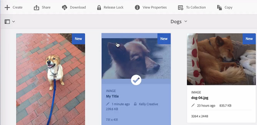

# Checka in och checka ut filer i AEM DAM {#check-in-and-check-out-files-in-assets}

Med Adobe Experience Manager Assets (AEM) kan du checka ut resurser för redigering och checka in dem igen när du är klar med ändringarna. När du har checkat ut en resurs kan bara du redigera, kommentera, publicera, flytta eller ta bort resursen. När du checkar ut en resurs låses den. Andra användare kan inte utföra någon av dessa åtgärder på resursen förrän du checkar in resursen på AEM Resurser igen. De kan dock fortfarande ändra metadata för den låsta resursen.

Om du vill kunna checka ut/in resurser måste du ha skrivbehörighet för dem.

Den här funktionen förhindrar att andra användare åsidosätter ändringar som gjorts av en författare där flera användare samarbetar i redigeringsarbetsflöden mellan team.

## Checka ut resurser {#checking-out-assets}

1. I resursgränssnittet väljer du den resurs du vill checka ut. Du kan också välja flera resurser att checka ut.
1. Klicka/tryck på **[!UICONTROL Utcheckning]**i verktygsfältet.
Alternativet **[!UICONTROL Checka ut]** växlar till **[!UICONTROL Checka in]**.
Logga in som en annan användare om du vill kontrollera om andra användare kan redigera den utcheckade resursen. En låssymbol visas på miniatyrbilden för den resurs som du har checkat ut.

   

   Markera resursen. Observera att verktygsfältet inte visar några alternativ som gör att du kan redigera, kommentera, publicera eller ta bort resursen.

   

   Du kan emellertid trycka på **[!UICONTROL Visa egenskaper]** för att redigera metadata för den låsta resursen.

1. Tryck på **[!UICONTROL Redigera]** för att öppna resursen i redigeringsläge.

   

1. Redigera resursen och spara ändringarna. Beskär till exempel bilden och spara.

   

   Du kan också välja att anteckna eller publicera resursen.

1. Välj den redigerade resursen i resursgränssnittet och tryck på **[!UICONTROL Checka in]** i verktygsfältet. Den ändrade resursen checkas in i AEM Resurser och är tillgänglig för andra användare för redigering.

## Tvingad incheckning {#forced-check-in}

Administratörer kan checka in resurser som är utcheckade av andra användare.

1. Logga in på AEM Assets som administratör.
1. I resursgränssnittet väljer du en eller flera resurser som har checkats ut av andra användare.

   

1. Tryck på **[!UICONTROL Release Lock]** i verktygsfältet. Resursen checkas in igen och är tillgänglig för redigering för andra användare.

>[!MORELIKETHIS]
>
>* [Förstå in- och utcheckning i AEM-datorprogrammet](https://docs.adobe.com/content/help/en/experience-manager-desktop-app/using/using.html#how-app-works2)
>* [Videosjälvstudiekurs för att lära dig hur du checkar in och checkar ut i AEM Assets](https://docs.adobe.com/content/help/en/experience-manager-learn/assets/collaboration/checkin-checkout-technical-video-understand.html)

