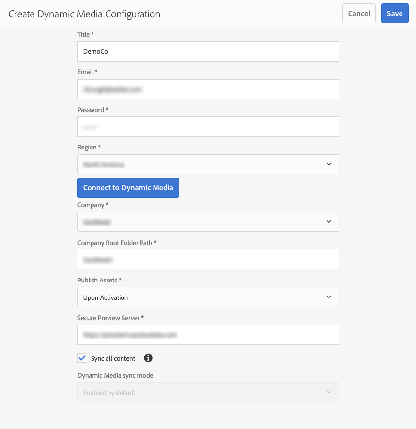

# Konfigurera dynamiska media - Scene7-läge{#configuring-dynamic-media-scene-mode}

Om du använder Adobe Experience Manager som konfigurerats för olika miljöer, till exempel en för utveckling, en för testning och en för liveproduktion, måste du konfigurera Dynamic Media Cloud-tjänster för var och en av dessa miljöer.

## Arkitektur för Dynamic Media - Scene7-läge {#architecture-diagram-of-dynamic-media-scene-mode}

I följande arkitekturdiagram beskrivs hur läget Dynamic Media - Scene7 fungerar.

Med den nya arkitekturen ansvarar AEM för masterresurser och synkronisering med Dynamic Media för bearbetning och publicering av material:

1. När huvudresursen överförs till AEM replikeras den till Dynamic Media. I det läget hanterar Dynamic Media all materialbearbetning och återgivningsgenerering, till exempel videokodning och dynamiska varianter av en bild. (I Dynamic Media - Scene7-läge kan du bara överföra resurser vars filstorlek är 2 GB eller mindre.)
1. När återgivningarna har genererats kan AEM på ett säkert sätt komma åt och förhandsgranska de dynamiska fjärråtergivningarna (inga binärfiler skickas tillbaka till AEM-instansen).
1. När innehållet är klart att publiceras och godkännas utlöses Dynamic Media-tjänsten att skicka ut innehållet till leveransservrar och cachelagra innehållet vid CDN.


## Aktivera Dynamic Media i Scene7-läge {#enabling-dynamic-media-in-scene-mode}

[Dynamiska medier](https://www.adobe.com/solutions/web-experience-management/dynamic-media.html) är inaktiverade som standard. Om du vill utnyttja funktionerna för dynamiska medier måste du aktivera dem.

>[!NOTE]
>
>Dynamic Media - Scene7-läget är endast till för AEM Author-instansen. Därför måste du konfigurera `runmode=dynamicmedia_scene7` på AEM Author-instansen, *inte* AEM Publish-instansen.

Om du vill aktivera dynamiska medier måste du starta AEM med `dynamicmedia_scene7` körningsläget från kommandoraden genom att ange följande i ett terminalfönster (exempelporten som används är 4502):

```shell
java -Xms4096m -Xmx4096m -Doak.queryLimitInMemory=500000 -Doak.queryLimitReads=500000 -jar cq-quickstart-6.5.0.jar -gui -r author,dynamicmedia_scene7 -p 4502
```

## (Valfritt) Migrera förinställningar och konfigurationer för dynamiska media från 6.3 till 6.5 Zero Downtime {#optional-migrating-dynamic-media-presets-and-configurations-from-to-zero-downtime}

Om du uppgraderar AEM Dynamic Media från 6.3 till 6.4 eller 6.5 (som nu innehåller möjligheten till noll driftsättningar vid driftstopp), måste du köra följande kommando för att migrera alla förinställningar och konfigurationer från `/etc` till `/conf` i CRXDE Lite.

>[!NOTE]
>
>Om du kör AEM-instansen i kompatibilitetsläge, d.v.s. har kompatibilitetspaketet installerat, behöver du inte köra dessa kommandon.

För alla uppgraderingar, antingen med eller utan kompatibilitetspaketet, kan du kopiera de förinställda visningsprogrammen som ursprungligen levererades med Dynamic Media genom att köra följande kommando för Linux-vändning:

`curl -u admin:admin -X POST https://<server_address>:<server_port>/libs/settings/dam/dm/presets/viewer.pushviewerpresets.json`

Om du vill migrera anpassade förinställningar och konfigurationer för visningsprogram som du har skapat från `/etc` till `/conf`kör du följande kommando för Linux-kontroll:

`curl -u admin:admin -X POST https://<server_address>:<server_port>/libs/settings/dam/dm/presets.migratedmcontent.json`

## Installerar funktionspaket 18912 för migrering av gruppresurser {#installing-feature-pack-for-bulk-asset-migration}

Installation av funktionspaket 18912 är *valfritt*.

Med funktionspaketet 18912 kan du antingen importera resurser gruppvis via FTP eller migrera resurser från antingen Dynamic Media - hybrid-läge eller Dynamic Media Classic till Dynamic Media - Scene7-läge i AEM. Den kan fås från [Adobe Professional Services](https://www.adobe.com/experience-cloud/consulting-services.html).

Mer information finns i [Installera funktionspaket 18912 för migrering](/help/assets/bulk-ingest-migrate.md) av gruppresurser.

## Konfigurera Dynamic Media Cloud Services {#configuring-dynamic-media-cloud-services}

**Innan du konfigurerar Dynamic Media Cloud-tjänster**: När du har fått ditt e-postmeddelande med inloggningsuppgifter för Dynamic Media måste du [logga in](https://www.adobe.com/marketing-cloud/experience-manager/scene7-login.html) på Dynamic Media Classic för att ändra ditt lösenord. Lösenordet som anges i e-postmeddelandet om etablering genereras av systemet och är endast avsett som ett tillfälligt lösenord. Det är viktigt att du uppdaterar lösenordet så att Dynamic Media Cloud-tjänsten har konfigurerats med rätt autentiseringsuppgifter.

Så här konfigurerar du molntjänster för dynamiska media:

1. I AEM trycker du på AEM-logotypen för att komma åt den globala navigeringskonsolen, trycker eller klickar på verktygsikonen och sedan på **[!UICONTROL Cloud Services > Dynamic Media Configuration]**.
1. På sidan Dynamic Media Configuration Browser (Dynamic Media Configuration Browser) trycker du på **[!UICONTROL global]** i den vänstra rutan (tryck inte på eller välj mappikonen till vänster om **[!UICONTROL global]**) och sedan på **[!UICONTROL Create]**.
1. På sidan Skapa dynamisk mediekonfiguration anger du en titel, e-postadress för Dynamic Media-kontot, lösenord och väljer sedan region. Dessa tillhandahålls av Adobe i e-postmeddelandet om etablering. Kontakta supporten om du inte fått detta.

   Klicka på **[!UICONTROL Anslut till dynamiska media]**.

   >[!NOTE]
   >
   >När du har fått ditt e-postmeddelande med inloggningsuppgifter för Dynamic Media loggar du [in på](https://www.adobe.com/marketing-cloud/experience-manager/scene7-login.html) Dynamic Media Classic för att ändra ditt lösenord. Lösenordet som anges i e-postmeddelandet om etablering genereras av systemet och är endast avsett som ett tillfälligt lösenord. Det är viktigt att du uppdaterar lösenordet så att molntjänsten Dynamic Media är konfigurerad med rätt autentiseringsuppgifter.

1. Om anslutningen lyckas kan du även ange följande:

   * **[!UICONTROL Företag]** - namnet på Dynamic Media-kontot. Det är möjligt att du har flera Dynamic Media-konton för olika undervarumärken, divisioner eller olika miljöer för staging/produktion.

   * **[!UICONTROL Företagets rotmappsökväg]**

   * **[!UICONTROL Publicera resurser]** - alternativet **[!UICONTROL Omedelbart]** innebär att när resurser överförs, importeras resurserna och URL:en/inbäddningen anges omedelbart. Ingen användaråtgärd krävs för att publicera resurser. Alternativet **[!UICONTROL Vid aktivering]** innebär att du måste publicera resursen explicit innan en URL/Embed-länk anges.

   * **[!UICONTROL Secure Preview Server]** - gör att du kan ange URL-sökvägen till den säkra servern för förhandsgranskning av återgivningar. Det innebär att när renderingar har skapats kan AEM på ett säkert sätt komma åt och förhandsgranska de dynamiska fjärrrenderingarna (inga binärfiler skickas tillbaka till AEM-instansen).
Om du inte har ett särskilt arrangemang för att använda ditt företags server eller en speciell server rekommenderar Adobe Systems att du låter den här inställningen vara som den är angiven.
   >[!NOTE]
   >
   >Det finns inget stöd för versionshantering i DMS7. Dessutom gäller fördröjd aktivering endast om **[!UICONTROL Publicera resurser]** på sidan Redigera dynamisk mediekonfiguration är inställd på **[!UICONTROL Vid aktivering]**, och sedan endast tills resursen aktiveras första gången.
   >
   >
   >När en mediefil har aktiverats publiceras uppdateringar direkt till S7 Delivery.

   

1. Tryck på **[!UICONTROL Spara]**.
1. Om du vill förhandsgranska dynamiskt medieinnehåll på ett säkert sätt innan det publiceras måste du vitlista AEM-författarinstansen för att ansluta till Dynamic Media:

   * Logga in på ditt konto för Dynamic Media Classic: [https://www.adobe.com/marketing-cloud/experience-manager/scene7-login.html](https://www.adobe.com/marketing-cloud/experience-manager/scene7-login.html). Dina autentiseringsuppgifter och din inloggning tillhandahölls av Adobe vid tidpunkten för etableringen. Om du inte har den här informationen kontaktar du teknisk support.
   * I navigeringsfältet uppe till höger på sidan klickar du på **[!UICONTROL Inställningar > Programinställningar > Publiceringsinställningar > Bildserver]**.

   * På sidan Image Server Publish (Publicera kontext) väljer du **[!UICONTROL Test Image Serving]**(Testa bildserver).
   * Tryck på **[!UICONTROL Lägg till]** för klientadressfiltret.
   * Markera kryssrutan för att aktivera (aktivera) adressen och ange sedan IP-adressen för AEM Author-instansen (inte Dispatcher IP).
   * Click **[!UICONTROL Save]**.

Du är nu klar med den grundläggande konfigurationen; är du redo att använda Dynamic Media - Scene7-läge.

Om du vill anpassa konfigurationen ytterligare kan du utföra alla åtgärder under [(Valfritt) Konfigurera avancerade inställningar i läget](#optionalconfigurationofadvancedsettingindynamicmediascene7mode)Dynamic Media - Scene7.

## (Valfritt) Konfigurera avancerade inställningar i Dynamic Media - Scene7-läge {#optional-configuring-advanced-settings-in-dynamic-media-scene-mode}

Om du vill anpassa konfigurationen och konfigurationen av läget Dynamic Media - Scene7 ytterligare, eller optimera dess prestanda, kan du utföra en eller flera av följande *valfria* uppgifter:

* [(Valfritt) Installation och konfiguration av Dynamic Media - Scene7-lägesinställningar](#optionalsetupandconfigurationofdynamicmediascene7modesettings)

* [(Valfritt) Justera prestanda för dynamiska media - Scene7-läge](#optional-tuning-the-performance-of-dynamic-media-scene-mode)
* [(Valfritt) Filtrera resurser för replikering](#optional-filtering-assets-for-replication)

### (Valfritt) Installation och konfiguration av Dynamic Media - Scene7-lägesinställningar</p> {#optional-setup-and-configuration-of-dynamic-media-scene-mode-settings-p}

När du är i körläge `dynamicmedia_scene7`använder du användargränssnittet Dynamic Media Classic (Scene7) för att göra ändringar i inställningarna för Dynamic Media.

Vissa av ovanstående uppgifter kräver att du loggar in på Dynamic Media Classic (Scene7) här: [https://www.adobe.com/marketing-cloud/experience-manager/scene7-login.html](https://www.adobe.com/marketing-cloud/experience-manager/scene7-login.html)

Installations- och konfigureringsuppgifter omfattar följande:

* [Publiceringskonfiguration för Image Server](#publishing-setup-for-image-server)
* [Konfigurera allmänna inställningar för programmet](#configuring-application-general-settings)
* [Konfigurera färghantering](#configuring-color-management)
* [Konfigurera bearbetning av resurser](#configuring-asset-processing)
* [Lägga till anpassade MIME-typer för format som inte stöds](#adding-custom-mime-types-for-unsupported-formats)
* [Skapa gruppuppsättningsförinställningar för automatisk generering av bilduppsättningar och snurpuppsättningar](#creating-batch-set-presets-to-auto-generate-image-sets-and-spin-sets)

#### Publiceringskonfiguration för Image Server {#publishing-setup-for-image-server}

Publiceringsinställningarna avgör hur resurser levereras som standard från Dynamic Media. Om ingen inställning anges levererar Dynamic Media en resurs enligt standardinställningarna som definierats i Publiceringsinställningar. En begäran om att leverera en bild som inte innehåller ett upplösningsattribut ger till exempel en bild med inställningen för standardobjektupplösning.

Så här konfigurerar du publiceringsinställningar: i Dynamic Media Classic klickar du på **[!UICONTROL Inställningar > Programinställningar > Publiceringsinställningar > Bildserver]**.

Bildserverskärmen anger standardinställningar för att leverera bilder. I gränssnittsskärmen finns en beskrivning av varje inställning.

* **[!UICONTROL Attribut]** för begäran - De här inställningarna begränsar antalet bilder som kan levereras från servern.
* **[!UICONTROL Standardattribut]** för begäran - De här inställningarna gäller standardutseendet för bilder.
* **[!UICONTROL Vanliga miniatyrattribut]** - De här inställningarna gäller standardutseendet för miniatyrbilder.
* **[!UICONTROL Standardvärden för katalogfält]**- De här inställningarna gäller för upplösningen och standardminiatyrbildstypen för bilder.
* **[!UICONTROL Färghanteringsattribut]** - De här inställningarna avgör vilka ICC-färgprofiler som används.
* **[!UICONTROL Kompatibilitetsattribut]** - Den här inställningen gör att inledande och efterföljande stycken i textlager kan behandlas som de var i version 3.6 för bakåtkompatibilitet.
* **[!UICONTROL Lokaliseringsstöd]** - Med de här inställningarna kan du hantera flera språkattribut. Här kan du också ange en sträng för språkområdeskarta så att du kan definiera vilka språk du vill ha stöd för de olika verktygstipsen i visningsprogram. Mer information om hur du konfigurerar **lokaliseringsstöd]** finns i [Saker att tänka på när du konfigurerar lokalisering av resurser](https://help.adobe.com/en_US/scene7/using/WS997f1dc4cb0179f034e07dc31412799d19a-8000.html).

#### Konfigurera allmänna inställningar för programmet {#configuring-application-general-settings}

Du öppnar sidan Allmänna inställningar för programmet genom att klicka på **[!UICONTROL Inställningar > Programinställningar > Allmänna inställningar]** i fältet Global Navigation i Dynamic Media Classic.

**Servrar - **On account provisioning, ger Dynamic Media automatiskt de servrar som är tilldelade ditt företag. De här servrarna används för att skapa URL-strängar för din webbplats och dina program. Dessa URL-anrop är specifika för ditt konto. Ändra inte något av servernamnen såvida inte AEM-stödet uttryckligen har instruerat att göra det.

**[!UICONTROL Skriv över bilder]** - Dynamiska media tillåter inte att två filer har samma namn. Varje objekts URL-ID (filnamnet minus filtillägget) måste vara unikt. De här alternativen anger hur ersättningsresurser överförs: om de ersätter originalet eller blir dubbletter. Duplicerade resurser får ett nytt namn med namnet&quot;-1&quot; (till exempel heter stol.tif stol-1.tif). Dessa alternativ påverkar resurser som överförts till en annan mapp än den ursprungliga eller resurser med ett annat filnamnstillägg än den ursprungliga (till exempel JPG, TIF eller PNG).

* **[!UICONTROL Skriv över i den aktuella mappen, samma basbildnamn/tillägg]** - Det här alternativet är den striktaste regeln för ersättning. Det kräver att du överför ersättningsbilden till samma mapp som originalbilden och att ersättningsbilden har samma filnamnstillägg som originalbilden. Om dessa krav inte uppfylls skapas en dubblett.

>[!NOTE]
>
>Välj alltid den här inställningen för att vara konsekvent med AEM: Skriv **över i den aktuella mappen, samma basbildnamn/tillägg**

* **[!UICONTROL Skriv över i valfri mapp, samma basresursnamn/filnamnstillägg]** - Kräver att ersättningsbilden har samma filnamnstillägg som den ursprungliga bilden (till exempel måste stol.jpg ersätta stol.jpg, inte stol.tif). Du kan dock överföra ersättningsbilden till en annan mapp än den ursprungliga. Den uppdaterade bilden finns i den nya mappen; filen inte längre kan hittas på sin ursprungliga plats
* **[!UICONTROL Skriv över i valfri mapp, samma basresursnamn oavsett tillägg]** - Det här alternativet är den mest omfattande ersättningsregeln. Du kan överföra en ersättningsbild till en annan mapp än den ursprungliga, överföra en fil med ett annat filnamnstillägg och ersätta den ursprungliga filen. Om originalfilen finns i en annan mapp finns ersättningsbilden i den nya mappen som den överfördes till.

**[!UICONTROL Standardfärgprofiler]** - Mer information finns i [Konfigurera färghantering](#configuring-color-management) .

>[!NOTE]
>
>Som standard visas 15 renderingar när du väljer **[!UICONTROL Renderingar]** och 15 visningsförinställningar när du väljer **[!UICONTROL Visare]** i resursens detaljvy. Du kan öka den här gränsen. Se [Öka antalet bildförinställningar som visas](/help/assets/managing-image-presets.md#increasingthenumberofimagepresetsthatdisplay) eller [Öka antalet visningsförinställningar som visas](/help/assets/managing-viewer-presets.md#increasing-the-number-of-viewer-presets-that-display).


#### Konfigurera färghantering {#configuring-color-management}

Med dynamisk mediefärghantering kan du färgkorrigera resurser. Med färgkorrigering behåller inkapslade resurser sin färgmodell (RGB, CMYK, Grå) och inbäddad färgprofil. När du begär en dynamisk återgivning korrigeras bildfärgen till målfärgrymden med hjälp av CMYK-, RGB- eller grå utdata. Se [Konfigurera bildförinställningar](/help/assets/managing-image-presets.md).

Så här konfigurerar du standardfärgegenskaperna så att färgkorrigering aktiveras när du begär bilder:

1. [Logga in på Dynamic Media Classic](https://www.adobe.com/marketing-cloud/experience-manager/scene7-login.html) med de autentiseringsuppgifter som angavs under etableringen. Navigera till **[!UICONTROL Inställningar > Programinställningar]**.
1. Expandera området **[!UICONTROL Publiceringsinställningar]** och välj **[!UICONTROL Bildserver]**. Ange **[!UICONTROL publiceringskontext]** som **[!UICONTROL bildserver]** när du anger standardvärden för publiceringsinstanser.
1. Bläddra till den egenskap som du behöver ändra, till exempel en egenskap i området **[!UICONTROL Färghanteringsattribut]** .

   Du kan ange följande egenskaper för färgkorrigering:

   * **[!UICONTROL Standardfärgmodell]** för CMYK - namnet på CMYK-standardfärgprofilen
   * **[!UICONTROL Standardfärgmodell för gråskala]** - namnet på standardfärgprofilen för gråskala
   * **[!UICONTROL RGB-standardfärgmodell]** - namnet på RGB-standardfärgprofilen
   * **[!UICONTROL Färgkonverteringsåtergivning]** - Anger återgivningsmetod. Godtagbara värden är: **[!UICONTROL perceptuell]**, **[!UICONTROL relativ kolometrisk]**, **[!UICONTROL mättnad]**, **[!UICONTROL absolut kolometrisk]**. Adobe rekommenderar **[!UICONTROL relative]]**som standard.

1. Tryck på **[!UICONTROL Spara]**.

Du kan till exempel ange standardfärgmodellen **[!UICONTROL för]** RGB till *sRGB* och standardfärgmodellen **[!UICONTROL för]** CMYK till *WebCoated*.

Om du gör det gör du så här:

* Aktiverar färgkorrigering för RGB- och CMYK-bilder.
* RGB-bilder som inte har någon färgprofil antas finnas i *färgrymden sRGB* .
* CMYK-bilder som inte har någon färgprofil antas finnas i *WebCoated* -färgmodellen.
* Dynamiska renderingar som returnerar RGB-utdata returnerar den i färgrymden *sRGB *.
* Dynamiska återgivningar som returnerar CMYK-utdata returnerar det i *WebCoated* -färgrymden.

#### Konfigurera bearbetning av resurser {#configuring-asset-processing}

Du kan definiera vilka resurstyper som ska bearbetas av Dynamic Media och anpassa avancerade parametrar för resurshantering. Du kan till exempel ange parametrar för tillgångsbearbetning för att göra följande:

* Konvertera en Adobe PDF till en eCatalog-resurs.
* Konvertera ett Adobe Photoshop-dokument (.PSD) till en bannermallsresurs för personalisering.
* Rastrera en Adobe Illustrator-fil (.AI) eller en Adobe Photoshop Encapsulated Postscript-fil (.EPS).
* Obs! Videoprofiler och bildprofiler kan användas för att definiera bearbetning av videoklipp och bilder.

Se [Överföra resurser](/help/assets/managing-assets-touch-ui.md#uploading-assets).

**Så här konfigurerar du bearbetning av resurser**

1. I AEM klickar du på AEM-logotypen för att öppna den globala navigeringskonsolen och klickar sedan på **[!UICONTROL Verktyg > Allmänt > CRXDE Lite]**.
1. Navigera till följande i den vänstra listen:

   `/conf/global/settings/cloudconfigs/dmscene7/jcr:content/mimeTypes`

   

1. Välj en mime-typ i mappen mimeTypes.
1. Till höger på CRXDE Lite-sidan i den nedre delen:

   * dubbelklicka på det **[!UICONTROL aktiverade]** fältet. Som standard är alla resursens MIME-typer aktiverade (inställda på **[!UICONTROL true]**), vilket innebär att resurserna synkroniseras till Dynamic Media för bearbetning. Om du vill utesluta den här resursens MIME-typ från bearbetningen ändrar du den här inställningen till **[!UICONTROL false]**.

   * dubbelklicka på **[!UICONTROL jobParam]** för att öppna det tillhörande textfältet. Se [Mime-typer](/help/assets/assets-formats.md#supported-mime-types) som stöds för en lista över tillåtna värden för processparametrar som du kan använda för en viss MIME-typ.

1. Gör något av följande:

   * Upprepa steg 3-4 om du vill redigera ytterligare MIME-typer.
   * Klicka på **[!UICONTROL Spara alla]** på menyraden på sidan CRXDE Lite.

1. Tryck på **[!UICONTROL CRXDE Lite]** i det övre vänstra hörnet av sidan för att gå tillbaka till AEM.

#### Lägga till anpassade MIME-typer för format som inte stöds {#adding-custom-mime-types-for-unsupported-formats}

Du kan lägga till anpassade MIME-typer för format som inte stöds i AEM Resurser. För att säkerställa att alla nya noder som du lägger till i CRXDE Lite inte tas bort av AEM, måste du se till att du flyttar MIME-typen före `image_` och dess aktiverade värde är inställt på **[!UICONTROL false]**.

**Lägga till anpassade MIME-typer för format som inte stöds**

1. I AEM trycker du på **[!UICONTROL Verktyg > Åtgärder > Webbkonsol]**.

   

1. En ny flik i webbläsaren öppnas på sidan Konfiguration **[!UICONTROL av]** Adobe Experience Manager Web Console.

   

1. På sidan bläddrar du nedåt till namnet *Adobe CQ Scene7 Asset MIME type Service* enligt följande skärmbild. Tryck på **[!UICONTROL Redigera konfigurationsvärdena]** (pennikonen) till höger om namnet.

   

1. Klicka på en plusteckenikon &lt;+> på sidan för **Adobe CQ Scene7 Asset MIME-typservice** . Platsen i tabellen där du klickar på plustecknet för att lägga till den nya mime-typen är enkel.

   

1. Skriv `DWG=image/vnd.dwg` i det tomma textfältet som du just lade till.

   Observera att exemplet bara `DWG=image/vnd.dwg` är för illustrationsändamål. MIME-typen som du lägger till här kan vara ett annat format som inte stöds.

   

1. Tryck på **[!UICONTROL Spara]** längst ned till höger på sidan.

   Nu kan du stänga webbläsarfliken som har den öppna konfigurationssidan för Adobe Experience Manager Web Console.

1. Gå tillbaka till webbläsarfliken med din öppna AEM-konsol.
1. Från AEM: tryck på **[!UICONTROL Verktyg > Allmänt > CRXDE Lite]**.

   

1. Navigera till följande i den vänstra listen:

   `conf/global/settings/cloudconfigs/dmscene7/jcr:content/mimeTypes`

1. Dra MIME-typen `image_vnd.dwg` och släpp den direkt ovanför `image_` i trädet så som visas på skärmbilden nedan.

   

1. Med mime-typen `image_vnd.dwg` fortfarande markerad dubbelklickar du på värdet på fliken **[!UICONTROL Egenskaper]** i den **[!UICONTROL aktiverade]** raden under kolumnrubriken **[!UICONTROL Värde]** för att öppna den nedrullningsbara listan **[!UICONTROL Värde]** .
1. Skriv `false` i fältet (eller välj **[!UICONTROL false]** i listrutan).

   

1. Klicka på **[!UICONTROL Spara alla]** i det övre vänstra hörnet på CRXDE Lite-sidan.

#### Skapa gruppuppsättningsförinställningar för automatisk generering av bilduppsättningar och snurpuppsättningar {#creating-batch-set-presets-to-auto-generate-image-sets-and-spin-sets}

Använd förinställningar för gruppuppsättningar för att automatisera skapandet av bilduppsättningar eller snurruppsättningar medan resurser överförs till Dynamic Media.

Definiera först namnkonventionen för hur resurser ska grupperas tillsammans i en uppsättning. Du kan sedan skapa en gruppuppsättningsförinställning som är en unik, självständig uppsättning instruktioner som definierar hur uppsättningen ska skapas med bilder som matchar de definierade namnkonventionerna i förinställningsreceptet.

När du överför filer skapar Dynamic Media automatiskt en uppsättning med alla filer som matchar den definierade namnkonventionen i de aktiva förinställningarna.

**Konfigurerar standardnamngivning**

Skapa en standardnamnkonvention som används i alla förinställda gruppuppsättningar. Den standardnamnkonvention som valts i förinställningsdefinitionen för gruppuppsättning kan vara allt ditt företag behöver för att gruppgenerera uppsättningar. En gruppuppsättningsförinställning skapas för att använda den standardnamnkonvention som du definierar. Du kan skapa så många gruppuppsättningsförinställningar med alternativa, anpassade namnkonventioner som behövs för en viss uppsättning innehåll om det finns ett undantag från den företagsdefinierade standardnamngivningen.

När det inte krävs någon standardnamnkonvention för att använda funktionen för gruppuppsättningsförinställningar rekommenderar vi att du använder standardnamnkonventionen för att definiera så många element i namnkonventionen som du vill gruppera i en uppsättning så att du kan effektivisera skapandet av gruppuppsättningar.

Observera också att du kan använda **[!UICONTROL Visa kod]** utan några formulärfält tillgängliga. I den här vyn skapar du namnkonventionens definitioner helt med hjälp av reguljära uttryck.

Det finns två element för definition, Matcha och Basnamn. Med dessa fält kan du definiera alla element i en namnkonvention och identifiera den del av konventionen som används för att namnge den uppsättning i vilken de finns. Ett företags personliga namnkonvention kan använda en eller flera definitionsrader för vart och ett av dessa element. Du kan använda så många rader för din unika definition och gruppera dem i distinkta element, t.ex. för Huvudbild, Färgelement, Alternativa vyer och Färgruteelement.

**Konfigurera standardnamn**

1. Logga in på ditt konto för Dynamic Media Classic (Scene7): [https://www.adobe.com/marketing-cloud/experience-manager/scene7-login.html](https://www.adobe.com/marketing-cloud/experience-manager/scene7-login.html)

   Dina autentiseringsuppgifter och din inloggning tillhandahölls av Adobe vid tidpunkten för etableringen. Om du inte har den här informationen kontaktar du teknisk support.

1. I navigeringsfältet uppe på sidan trycker du på **[!UICONTROL Inställningar > Programinställningar > Gruppinställda förinställningar > Standardnamngivning]**.
1. Välj **[!UICONTROL Visa formulär]** eller **[!UICONTROL Visa kod]** för att ange hur du vill visa och ange information om varje element.

   Du kan markera kryssrutan **[!UICONTROL Visa kod]** om du vill visa värdeuppbyggnaden för reguljära uttryck bredvid formulärvalen. Du kan ange eller ändra dessa värden för att underlätta definitionen av elementen i namnkonventionen, om formulärvyn begränsar dig av någon anledning. Om dina värden inte kan tolkas i formulärvyn blir formulärfälten inaktiva.

   >[!NOTE]
   >
   >Inaktiverade formulärfält verifierar inte att reguljära uttryck är korrekta. Resultaten av det reguljära uttryck som du skapar för varje element efter resultatraden visas. Det fullständiga reguljära uttrycket visas längst ned på sidan.

1. Expandera varje element efter behov och ange de namnkonventioner som du vill använda.
1. Gör något av följande om det behövs:

   * Tryck på **[!UICONTROL Lägg till]** för att lägga till en annan namnkonvention för ett element.
   * Tryck på **[!UICONTROL Ta bort]** för att ta bort en namnkonvention för ett element.

1. Gör något av följande:

   * Tryck på **[!UICONTROL Spara som]** och skriv ett namn för förinställningen.
   * Tryck på **[!UICONTROL Spara]** om du redigerar en befintlig förinställning.

**Skapa en förinställning för gruppuppsättning**

I Dynamic Media används gruppuppsättningsförinställningar för att ordna resurser i uppsättningar med bilder (alternativa bilder, färgalternativ, 360-rotation) för visning i visningsprogram. Förinställningarna för gruppuppsättningar körs automatiskt tillsammans med överföringsprocesserna för resurser i Dynamic Media.

Du kan skapa, redigera och hantera dina gruppuppsättningsförinställningar. Det finns två former av förinställda gruppuppsättningsdefinitioner: en för en standardnamnkonvention som du kan ha konfigurerat och en för anpassade namnkonventioner som du skapar direkt.

Du kan antingen använda formulärfältsmetoden för att definiera en gruppuppsättningsförinställning eller kodmetoden, som gör att du kan använda reguljära uttryck. Precis som i Standardnamn kan du välja Visa kod samtidigt som du definierar i formulärvyn och använda reguljära uttryck för att skapa definitioner. Du kan också avmarkera en vy om du vill använda den ena eller den andra enbart.

**Skapa en förinställning för gruppuppsättning**

1. Logga in på ditt konto för Dynamic Media Classic (Scene7): [https://www.adobe.com/marketing-cloud/experience-manager/scene7-login.html](https://www.adobe.com/marketing-cloud/experience-manager/scene7-login.html)

   Dina autentiseringsuppgifter och din inloggning tillhandahölls av Adobe vid tidpunkten för etableringen. Om du inte har den här informationen kontaktar du teknisk support.

1. I navigeringsfältet uppe på sidan trycker du på **[!UICONTROL Inställningar > Programinställningar > Gruppinställningsförinställningar > Gruppinställningsförinställning]**.

   Observera att **[!UICONTROL Visa formulär]**, som det anges i det övre högra hörnet på detaljsidan, är standardvyn.

1. På panelen Förinställningslista trycker du på **[!UICONTROL Lägg till]** för att aktivera definitionsfälten på panelen Detaljer till höger på skärmen.
1. Skriv ett namn på förinställningen i fältet Förinställningsnamn på panelen Detaljer.
1. Välj en förinställningstyp i listrutan Gruppuppsättningstyp.
1. Gör något av följande:

   * Om du använder en standardnamnkonvention som du tidigare ställt in under **[!UICONTROL Programinställningar > Gruppinställningar > Standardnamngivning]** expanderar du **[!UICONTROL Konventioner]** för namngivning av resurser och sedan trycker du på **[!UICONTROL Standard]** i listrutan Namnge filer.

   * Om du vill definiera en ny namnkonvention när du ställer in förinställningen expanderar du **[!UICONTROL Konventioner]** för namngivning av resurser och klickar sedan på **[!UICONTROL Anpassad]** i listrutan Namnge fil.

1. I Sekvensordning definierar du i vilken ordning bilderna ska visas efter att uppsättningen har grupperats tillsammans i Dynamic Media.

   Som standard sorteras dina resurser alfanumeriskt. Du kan dock använda en kommaavgränsad lista med reguljära uttryck för att definiera ordningen.

1. Ange suffixet eller prefixet till basnamnet som du definierade i konventionen om namngivning av tillgångar för Ange namngivning och skapande. Definiera också var uppsättningen ska skapas i mappstrukturen Dynamic Media.

   Om du definierar ett stort antal uppsättningar kanske du föredrar att hålla dessa åtskilda från de mappar som innehåller själva resurserna. Du kan till exempel skapa en mapp för bilduppsättningar och placera genererade uppsättningar här.

1. Tryck på **[!UICONTROL Spara]** på panelen Detaljer.
1. Tryck på **[!UICONTROL Aktiv]** bredvid den nya förinställningens namn.

   När du aktiverar förinställningen används den för att generera uppsättningen när du överför resurser till dynamiska media.

**Skapa en gruppuppsättningsförinställning för automatisk generering av en 2D-snurpuppsättning**

Du kan använda **[!UICONTROL multiaxelrotationsuppsättningen]** för gruppuppsättningstyp för att skapa ett recept som automatiserar genereringen av tvådimensionella snurruppsättningar. Vid gruppering av bilder används reguljära uttryck för rad och kolumn så att bildresurserna justeras korrekt på motsvarande plats i den flerdimensionella arrayen. Det finns inget minsta eller högsta antal rader eller kolumner som du måste ha i en rotationsuppsättning med flera axlar.

Anta till exempel att du vill skapa en fleraxelsnurvuppsättning med namnet `spin-2dspin`. Du har en uppsättning bilder med snurra uppsättningar som innehåller tre rader, med 12 bilder per rad. Bilderna får följande namn:

```
spin-01-01
 spin-01-02
 …
 spin-01-12
 spin-02-01
 …
 spin-03-12
```

Med den här informationen kan ditt recept för gruppuppsättningstyp skapas på följande sätt:


Gruppering för den delade resursnamndelen av spinmängden läggs till i fältet **Matcha** (markerat). Variabeldelen av resursnamnet som innehåller raden och kolumnen läggs till i fälten **Rad****och** Kolumn.

När rotationsuppsättningen överförs och publiceras aktiverar du namnet på det 2D-rotationsrecept som visas under **Gruppuppsättningsförinställningar** i dialogrutan **Överför jobbalternativ** .

**Skapa en gruppuppsättningsförinställning för automatisk generering av en 2D-snurpuppsättning**

1. Logga in på ditt konto för Dynamic Media Classic (Scene7): [https://www.adobe.com/marketing-cloud/experience-manager/scene7-login.html](https://www.adobe.com/marketing-cloud/experience-manager/scene7-login.html)

   Dina autentiseringsuppgifter och din inloggning tillhandahölls av Adobe vid tidpunkten för etableringen. Om du inte har den här informationen kontaktar du teknisk support.

1. Klicka på **[!UICONTROL Setup > Application Setup > Batch Set Presets > Batch Set Preset** i navigeringsfältet uppe på sidan.

   Observera att **[!UICONTROL Visa formulär]**, som det anges i det övre högra hörnet på detaljsidan, är standardvyn.

1. Klicka på **[!UICONTROL Lägg]** till på panelen Förinställningslista för att aktivera definitionsfälten på panelen Detaljer till höger på skärmen.
1. Skriv ett namn på förinställningen i fältet Förinställningsnamn på panelen Detaljer.
1. Välj **[!UICONTROL Resursuppsättning]** i listrutan Gruppuppsättningstyp.
1. I listrutan Undertyp väljer du **[!UICONTROL Mångaxelsnurra uppsättning]**.
1. Expandera **[!UICONTROL Konventioner]** för namngivning av resurser och klicka sedan på **[!UICONTROL Anpassad]** i listrutan Namnge fil.
1. Använd attributen **[!UICONTROL Matcha]** och, om du vill, **[!UICONTROL basnamn]** för att definiera ett reguljärt uttryck för namngivning av bildresurser som utgör grupperingen.

   Det reguljära uttrycket för literal Match kan till exempel se ut så här:

   `(w+)-w+-w+`

1. Expandera **[!UICONTROL Radkolumnposition]** och definiera sedan namnformatet för bildresursens position i 2D-rotationsmatrisen.

   Använd parentesen för att omsluta rad- eller kolumnpositionen i filnamnet.

   För en rad med ett reguljärt uttryck kan det se ut så här:

   `\w+-R([0-9]+)-\w+`

   eller

   `\w+-(\d+)-\w+`

   För det reguljära uttrycket i kolumnen kan det se ut så här:

   `\w+-\w+-C([0-9]+)`

   eller

   `\w+-\w+-C(\d+)`

   Kom ihåg att detta bara är exempel. Du kan skapa det reguljära uttrycket hur du vill.

   >[!NOTE]
   >
   >Om kombinationen av reguljära uttryck för rader och kolumner inte kan avgöra positionen för resursen i den flerdimensionella spinset-arrayen, läggs resursen inte till i uppsättningen och ett fel loggas.

1. Ange suffixet eller prefixet till basnamnet som du definierade i konventionen om namngivning av tillgångar för Ange namngivning och skapande.

   Definiera också var rotationsuppsättningen ska skapas i mappstrukturen Dynamic Media Classic.

   Om du definierar ett stort antal uppsättningar kanske du föredrar att hålla dessa åtskilda från de mappar som innehåller själva resurserna. Du kan till exempel skapa en mapp för snurruppsättningar där du kan placera genererade uppsättningar här.

1. Klicka på **[!UICONTROL Spara]** på panelen Detaljer.
1. Klicka på **[!UICONTROL Aktiv]** bredvid den nya förinställningens namn.

   När du aktiverar förinställningen används den för att generera uppsättningen när du överför resurser till dynamiska media.

### (Valfritt) Justera prestanda för dynamiska media - Scene7-läge {#optional-tuning-the-performance-of-dynamic-media-scene-mode}

Adobe rekommenderar följande finjusteringstips för synkroniseringsprestanda/skalbarhet för att Dynamic Media (med `dynamicmedia_scene7` körningsläge) ska fungera smidigt:

* Uppdatera de fördefinierade arbetstrådarna för Granite-arbetsflödet (videoresurser).
* Uppdatera det fördefinierade tillfälliga Granite-arbetsflödet (bilder och andra resurser än videor) för köarbetstrådar.
* Uppdatera de maximala överföringsanslutningarna till Dynamic Media Classic-servern.

#### Uppdaterar kön för Granska tillfälligt arbetsflöde {#updating-the-granite-transient-workflow-queue}

Kön för Bevilja överföring av arbetsflöde används för arbetsflödet för **[!UICONTROL DAM-uppdatering]** . I Dynamic Media används den för bildinläsning och bearbetning.

**Så här uppdaterar du kön för Granska tillfälligt arbetsflöde**

1. Gå till [https://&lt;server>/system/console/configMgr](https://localhost:4502/system/console/configMgr) och sök efter **kö: Bevilja en tillfällig arbetsflödeskö**.

   >[!NOTE]
   >
   >En textsökning är nödvändig i stället för en direkt URL eftersom OSGi PID genereras dynamiskt.

1. I fältet **[!UICONTROL Maximalt antal parallella jobb]** ändrar du talet till önskat värde.

   Som standard beror det maximala antalet parallella jobb på antalet tillgängliga processorkärnor. På en server med fyra kärnor tilldelas till exempel två arbetstrådar. (Ett värde mellan 0,0 och 1,0 är baserat på förhållandet, eller alla tal som är större än 1 tilldelar antalet arbetstrådar.)

   Adobe rekommenderar att 32 **[!UICONTROL maximalt antal parallella jobb]** konfigureras för att ge tillräckligt stöd för överföring av filer till Dynamic Media Classic (Scene7).

   

1. Tryck på **[!UICONTROL Spara]**.

#### Uppdaterar kön för Granite-arbetsflöde {#updating-the-granite-workflow-queue}

Beviljad arbetsflödeskö används för icke-tillfälliga arbetsflöden. I Dynamic Media brukade den bearbeta video med arbetsflödet **[!UICONTROL Dynamic Media Encode Video]** .

**Så här uppdaterar du arbetsflödeskön för Granite**

1. Navigera till `https://<server>/system/console/configMgr` och sök efter **kö: Begränsa arbetsflödeskö**.

   >[!NOTE]
   >
   >En textsökning är nödvändig i stället för en direkt URL eftersom OSGi PID genereras dynamiskt.

1. I fältet **[!UICONTROL Maximalt antal parallella jobb]** ändrar du talet till önskat värde.

   Som standard beror det maximala antalet parallella jobb på antalet tillgängliga processorkärnor. På en server med fyra kärnor tilldelas till exempel två arbetstrådar. (Ett värde mellan 0,0 och 1,0 är baserat på förhållandet, eller alla tal som är större än 1 tilldelar antalet arbetstrådar.)

   I de flesta fall räcker standardinställningen 0,5.

   

1. Tryck på **[!UICONTROL Spara]**.

#### Uppdaterar anslutning för överföring av Scene7 {#updating-the-scene-upload-connection}

Inställningen Scene7 Upload Connection synkroniserar AEM-resurser till dynamiska Media Classic-servrar.

**Så här uppdaterar du anslutningen för överföring av Scene7**

1. Navigera till `https://<server>/system/console/configMgr/com.day.cq.dam.scene7.impl.Scene7UploadServiceImpl`
1. I fältet **[!UICONTROL Antal anslutningar]** och/eller fältet **[!UICONTROL Active job timeout]** ändrar du antalet efter behov.

   Inställningen för **[!UICONTROL antal anslutningar]** styr det maximala antalet HTTP-anslutningar som tillåts för AEM till Dynamic Media-överföring. vanligtvis räcker det fördefinierade värdet på 10 anslutningar.

   Inställningen för tidsgräns **[!UICONTROL för]** aktivt jobb avgör väntetiden för överförda Dynamic Media-resurser som ska publiceras på leveransservern. Det här värdet är som standard 2 100 sekunder eller 35 minuter.

   I de flesta fall räcker det med inställningen 2 100.

   

1. Tryck på **[!UICONTROL Spara]**.

### (Valfritt) Filtrera resurser för replikering {#optional-filtering-assets-for-replication}

I distributioner av icke-dynamiska media replikerar du *alla* resurser (både bilder och video) från AEM-redigeringsmiljön till AEM-publiceringsnoden. Det här arbetsflödet är nödvändigt eftersom AEM-publiceringsservrarna också levererar resurserna.

I Dynamic Media-distributioner behöver du dock inte replikera samma resurser till AEM-publiceringsnoder eftersom resurserna levereras via molntjänsten. Ett sådant&quot;hybridpubliceringsarbetsflöde&quot; undviker extra lagringskostnader och längre bearbetningstider för att replikera resurser. Annat innehåll, till exempel webbplatssidor, fortsätter att hanteras från AEM-publiceringsnoderna.

Med filtren kan du *utesluta* resurser från replikering till AEM-publiceringsnoden.

#### Använda standardresursfilter för replikering {#using-default-asset-filters-for-replication}

Om du använder Dynamic Media för bild och/eller video kan du använda de standardfilter som vi tillhandahåller i befintligt skick. Följande filter är aktiva som standard:

<table>
 <tbody>
  <tr>
   <td> </td>
   <td><strong>Filter</strong></td>
   <td><strong>MimeterType</strong></td>
   <td><strong>Återgivningar</strong></td>
  </tr>
  <tr>
   <td>Dynamic Media Image Delivery</td>
   <td><p>filterbilder</p> <p>filteruppsättningar</p> <p> </p> </td>
   <td><p>Börjar med <strong>bild/</strong></p> <p>Innehåller <strong>program/</strong> och slutar med <strong>en uppsättning</strong>.</p> </td>
   <td>De färdiga filterbilderna (gäller för enstaka bildresurser, inklusive interaktiva bilder) och "filteruppsättningar" (gäller Spin Sets, Image Sets, Mixed Media Sets och Carousel Sets) kommer att
    <ul>
     <li>Uteslut den ursprungliga bilden och statiska bildåtergivningar från replikering.</li>
    </ul> </td>
  </tr>
  <tr>
   <td>Dynamic Media Video Delivery</td>
   <td>filter-video</td>
   <td>Börjar med <strong>video/</strong></td>
   <td>"filter-video" som är klar att användas:
    <ul>
     <li><br /> Undanta återgivningar av originalvideo och statiska miniatyrer från replikering. <br /> </li>
    </ul> </td>
  </tr>
 </tbody>
</table>

>[!NOTE]
>
>Filter gäller för MIME-typer och kan inte vara sökvägsspecifika.

#### Anpassa resursfilter för replikering {#customizing-asset-filters-for-replication}

1. I AEM trycker du på AEM-logotypen för att komma åt den globala navigeringskonsolen och trycker på **[!UICONTROL Verktyg > Allmänt > CRXDE Lite]**.
1. Navigera till det vänstra mappträdet för `/etc/replication/agents.author/publish/jcr:content/damRenditionFilters` att granska filtren.

   

1. Du definierar Mime-typen för filtret genom att leta reda på Mime-typen enligt följande:

   I den vänstra listen expanderar du `content > dam > <locate_your_asset> > jcr:content > metadata`och letar upp `dc:format`.

   Följande bild är ett exempel på en resurs sökväg till `dc:format`.

   

   Observera att `dc:format` för tillgången `Fiji Red.jpg` är `image/jpeg`.

   Om du vill att det här filtret ska gälla för alla bilder, oavsett format, anger du värdet `image/*` där `*` är ett reguljärt uttryck som ska användas för alla bilder i alla format.

   Om du bara vill att filtret ska gälla för bilder av typen JPEG anger du värdet `image/jpeg`.

1. Definiera vilka renderingar du vill inkludera eller exkludera från replikering.

   Följande tecken kan användas för att filtrera replikering:

<table>
 <tbody>
  <tr>
   <td><strong>Tecken som ska användas</strong></td>
   <td><strong>Så här filtrerar du resurser för replikering</strong></td>
  </tr>
  <tr>
   <td>*</td>
   <td>Jokertecken<br /> </td>
  </tr>
  <tr>
   <td>+</td>
   <td>Innehåller resurser för replikering.</td>
  </tr>
  <tr>
   <td>-</td>
   <td>Exkluderar resurser från replikering.</td>
  </tr>
 </tbody>
</table>

Navigera till `content/dam/<locate your asset>/jcr:content/renditions`.

Följande grafik är ett exempel på en resurs återgivningar.


Om du bara vill replikera originalet skriver du `+original`.

