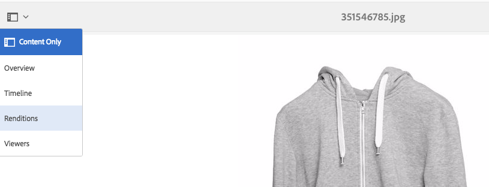
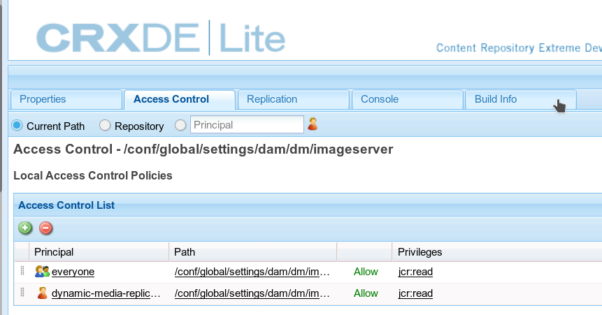

# Konfigurera dynamiska media - hybridläge{#configuring-dynamic-media-hybrid-mode}

Dynamic Media-Hybrid måste aktiveras och konfigureras för användning. Beroende på ditt sätt att arbeta har Dynamic Media flera konfigurationer som [stöds](#supported-dynamic-media-configurations).

>[!NOTE]
>
>Om du tänker konfigurera och köra Dynamic Media i Scene7-körningsläge, se [Konfigurera Dynamic Media - Scene7-läge](/help/assets/config-dms7.md).
>
>Om du tänker konfigurera och köra Dynamic Media i hybridkörningsläge följer du instruktionerna på den här sidan.

Läs mer om hur du arbetar med [video](/help/assets/video.md) i Dynamic Media.

>[!NOTE]
>
>Om du använder Adobe Experience Manager som konfigurerats för olika miljöer, till exempel en för utveckling, en för testning och en för liveproduktion, måste du konfigurera Dynamic Media Cloud-tjänster för var och en av dessa miljöer.

>[!NOTE]
>
>Om du har problem med din dynamiska mediekonfiguration är det viktigt att du tittar på loggfilerna som är specifika för dynamiska media. Dessa installeras automatiskt när du aktiverar dynamiska media:
>
>* `s7access.log`
>* `ImageServing.log`
>
>
De beskrivs i [Övervaka och underhålla din AEM-instans](/help/sites-deploying/monitoring-and-maintaining.md).

Hybridpublicering och -leverans är en viktig funktion i Dynamic Media som tillägg till Adobe Experience Manager. Med hybridpublicering kan ni leverera Dynamic Media-resurser, som bilder, uppsättningar och video, från molnet i stället för från AEM-publiceringsnoderna.

Annat innehåll, som Dynamic Media-visningsprogram, webbplatssidor och statiskt innehåll kommer även i fortsättningen att hanteras från AEM-publiceringsnoderna.

Om du använder Dynamic Media måste du använda hybridleverans som leveransmekanism för allt dynamiskt medieinnehåll.

## Hybrid publiceringsarkitektur för videor {#hybrid-publishing-architecture-for-videos}


## Hybrid-publiceringsarkitektur för bilder {#hybrid-publishing-architecture-for-images}


## Dynamiska mediekonfigurationer som stöds {#supported-dynamic-media-configurations}

Konfigurationsåtgärderna som följer refererar till följande termer:

| **Term** | **Dynamiska media aktiverat** | **Beskrivning** |
|---|---|---|
| AEM-författarnod | Vit bock i en grön cirkel | Författarnoden som du distribuerar till lokal eller via hanterade tjänster. |
| AEM-publiceringsnod | Vitt &quot;X&quot; i en röd kvadrat. | Den publiceringsnod som du distribuerar till lokal eller via hanterade tjänster. |
| Publiceringsnod för bildtjänst | Vit bock i en grön cirkel. | Den publiceringsnod som du kör på datacenter som hanteras av Adobe. Hänvisar till bildtjänstens URL. |

Du kan välja att implementera Dynamic Media endast för bildåtergivning, endast för video eller både för bildåtergivning och video. Om du vill se hur du konfigurerar Dynamic Media för ditt specifika scenario använder du följande tabell.

<table>
 <tbody>
  <tr>
   <td><strong>Scenario</strong></td>
   <td ><strong>Så här fungerar det</strong></td>
   <td><strong>Konfigurationssteg</strong></td>
  </tr>
  <tr>
   <td>Leverera ENDAST bilder i produktion</td>
   <td>Bilderna levereras via servrar i Adobes globala datacenter och cachas sedan av en CDN för skalbara prestanda och global räckvidd.</td>
   <td>
    <ol>
     <li>På AEM- <strong>författarnoden</strong> <a href="#enabling-dynamic-media">aktiverar du dynamiska medier</a>.</li>
     <li>Konfigurera bildbehandling i <a href="#configuring-dynamic-media-cloud-services">Dynamic Media Cloud Services</a>.</li>
     <li><a href="#configuring-image-replication">Konfigurera bildreplikering</a>.</li>
     <li><a href="#replicating-catalog-settings">Replikera kataloginställningar</a>.</li>
     <li><a href="#replicating-viewer-presets">Replikera visningsförinställningar</a>.</li>
     <li><a href="#using-default-asset-filters-for-replication">Använd standardresursfilter för replikering</a>.</li>
     <li><a href="#configuring-dynamic-media-image-server-settings">Konfigurera inställningar</a>för Dynamic Media Image Server.</li>
     <li><a href="#delivering-assets">Leverera resurser</a>.</li>
    </ol> </td>
  </tr>
  <tr>
   <td>Leverera ENDAST bilder i förproduktion (Dev, QE, Stage o.s.v.)</td>
   <td>Bilderna levereras via AEM-publiceringsnoden. Då trafiken är minimal behöver man inte leverera bilder till Adobes datacenter. En annan fördel är att detta ger en säker förhandsgranskning av innehållet innan produktionen startar</td>
   <td>
    <ol>
     <li>På AEM- <strong>författarnoden</strong> <a href="#enabling-dynamic-media">aktiverar du dynamiska medier</a>.</li>
     <li>På AEM- <strong>publiceringsnoden</strong> <a href="#enabling-dynamic-media">aktiverar du dynamiska medier</a>.</li>
     <li><a href="#replicating-viewer-presets">Replikera visningsförinställningar</a>.</li>
     <li>Ställ in <a href="#setting-up-asset-filters-for-imaging-in-non-production-deployments">resursfilter för icke-produktionsbilder</a>.</li>
     <li><a href="#configuring-dynamic-media-image-server-settings">Konfigurera inställningar för Dynamic Media Image Server.</a></li>
     <li><a href="#delivering-assets">Leverera resurser.</a></li>
    </ol> </td>
  </tr>
  <tr>
   <td>Leverera ENDAST video i alla miljöer (Production, Dev, QE, Stage o.s.v.)</td>
   <td>Videor levereras och cachas av ett CDN för skalbara prestanda och global räckvidd. Filmminiatyrbilden (miniatyrbilden av videon som visas innan uppspelningen startar) levereras av AEM-publiceringsinstansen.</td>
   <td>
    <ol>
     <li>På AEM- <strong>författarnoden</strong> <a href="#enabling-dynamic-media">aktiverar du dynamiska medier</a>.</li>
     <li>På AEM- <strong>publiceringsnoden</strong> <a href="#enabling-dynamic-media">aktiverar du dynamiska medier</a> (publiceringsinstansen visar videobilden och tillhandahåller metadata för videouppspelning).</li>
     <li>Konfigurera video i <a href="#configuring-dynamic-media-cloud-services">Dynamic Media Cloud Services.</a></li>
     <li><a href="#replicating-viewer-presets">Replikera visningsförinställningar</a>.</li>
     <li>Ställ in <a href="#setting-up-asset-filters-for-video-only-deployments">resursfilter för enbart</a>video.</li>
     <li><a href="#delivering-assets">Leverera resurser.</a></li>
    </ol> </td>
  </tr>
  <tr>
   <td>Leverera både bilder och video i produktion</td>
   <td><p>Videor levereras och cachas av ett CDN för skalbara prestanda och global räckvidd. Bilder och filmminiatyrbilder levereras via servrar i Adobes globala datacenter och cachas sedan av en CDN för skalbara prestanda och global räckvidd.</p> <p>Se föregående avsnitt för att ställa in bild eller video i förproduktion. </p> </td>
   <td>
    <ol>
     <li>På AEM- <strong>författarnoden</strong> <a href="#enabling-dynamic-media">aktiverar du dynamiska medier</a>.</li>
     <li>Konfigurera video i <a href="#configuring-dynamic-media-cloud-services">Dynamic Media Cloud Services.</a></li>
     <li>Konfigurera bildbehandling i <a href="#configuring-dynamic-media-cloud-services">Dynamic Media Cloud Services.</a></li>
     <li><a href="#configuring-image-replication">Konfigurera bildreplikering</a>.</li>
     <li><a href="#replicating-catalog-settings">Replikera kataloginställningar</a>.</li>
     <li><a href="#replicating-viewer-presets">Replikera visningsförinställningar</a>.</li>
     <li><a href="#using-default-asset-filters-for-replication">Använd standardresursfilter för replikering.</a></li>
     <li><a href="#configuring-dynamic-media-image-server-settings">Konfigurera inställningar för Dynamic Media Image Server.</a></li>
     <li><a href="#delivering-assets">Leverera resurser.</a></li>
    </ol> </td>
  </tr>
 </tbody>
</table>

## Aktivera dynamiska media {#enabling-dynamic-media}

[Dynamiska medier](https://www.adobe.com/solutions/web-experience-management/dynamic-media.html) är inaktiverade som standard. För att kunna utnyttja funktionerna för dynamiska medier måste du aktivera dynamiska medier genom att använda körningsläget på samma sätt som du till exempel använder `dynamicmedia` `publish` körningsläget. Kontrollera de [tekniska kraven innan du aktiverar.](/help/sites-deploying/technical-requirements.md#dynamicmediaaddonprerequisites)

>[!NOTE]
>
>Om du aktiverar dynamiska medier via körningsläget ersätts funktionerna i AEM 6.1 och AEM 6.0, där du aktiverade dynamiska medier genom att du anger `dynamicMediaEnabled` flaggan som **[!UICONTROL true]**. Den här flaggan har ingen funktion i AEM 6.2 och senare. Du behöver inte heller starta om snabbstarten för att aktivera dynamiska medier.

Genom att aktivera Dynamic Media blir de dynamiska mediefunktionerna tillgängliga i användargränssnittet och varje överförd bildresurs får en *cqdam.pyramid.tiff* -rendering som används för snabb leverans av dynamiska bildrenderingar. Dessa PTIFF-filer har avsevärda fördelar, bland annat (1) möjligheten att hantera endast en huvudbild och generera oändliga återgivningar direkt utan ytterligare lagringsutrymme och (2) möjligheten att använda interaktiv visualisering som zoomning, panorering, rotation och så vidare.

Om du vill använda Dynamic Media Classic (Scene7) i AEM bör du inte aktivera Dynamic Media om du inte använder ett [specifikt scenario](/help/sites-administering/scene7.md#aem-scene-integration-versus-dynamic-media). Dynamiska media är inaktiverat om du inte aktiverar dynamiska media i körningsläge.

Om du vill aktivera dynamiska medier måste du aktivera körningsläget för dynamiska media antingen från kommandoraden eller från snabbstartfilens namn.

**Aktivera dynamiska medier**

1. Gör följande på kommandoraden när du startar snabbstarten:

   * Lägg `-r dynamicmedia` till i slutet av kommandoraden när du startar filen jar.

   ```shell
   java -Xmx4096m -Doak.queryLimitInMemory=500000 -Doak.queryLimitReads=500000 -jar cq-quickstart-6.5.0.jar -r dynamicmedia
   ```

   Om du publicerar till s7delivery måste du även inkludera följande trustStore-argument:

   ```
   -Djavax.net.ssl.trustStore=<absoluteFilePath>/customerTrustStoreFileName>
   
    -Djavax.net.ssl.trustStorePassword=<passwordForTrustStoreFile>
   ```

1. Begär `https://localhost:4502/is/image` och kontrollera att Image Server körs.

   >[!NOTE]
   >
   >Om du vill felsöka problem med Dynamic Media läser du följande loggar i `crx-quickstart/logs/` katalogen:
   >
   >* ImageServer-&lt;PortId>-&lt;ååå>&lt;mm>&lt;dd>.log - Loggen för ImageServer innehåller statistik och analytisk information som används för att analysera beteendet hos den interna ImageServer-processen.
   Exempel på ett loggfilsnamn för en Image Server: `ImageServer-57346-2020-07-25.log`
   * s7access-&lt;åååå>&lt;mm>&lt;dd>.log - s7access-loggen registrerar varje begäran som gjorts till Dynamic Media via `/is/image` och `/is/content`.
   Dessa loggar används bara när Dynamic Media är aktiverat. De ingår inte i det **nedladdningsbara, fullständiga** paketet som genereras från `system/console/status-Bundlelist` sidan. när du ringer kundsupport om du har ett problem med dynamiska media, bifoga båda dessa loggar till problemet.

### Om du har installerat AEM på en annan port eller kontextsökväg ... {#if-you-installed-aem-to-a-different-port-or-context-path}

Om du distribuerar [AEM till en programserver](/help/sites-deploying/application-server-install.md) och har Dynamic Media aktiverat, måste du konfigurera **självdomänen** i externaliseraren. Annars fungerar inte generering av miniatyrbilder för resurser korrekt för dynamiska medieresurser.

Om du kör snabbstart på en annan port eller kontextsökväg måste du dessutom ändra **egen** domän.

När Dynamic Media är aktiverat genereras statiska miniatyråtergivningar för bildresurser med Dynamic Media. För att miniatyrbildsgenerering ska fungera för dynamiska medier måste AEM utföra en URL-begäran till sig själv och känna till både portnumret och kontextsökvägen.

I AEM:

* Den **egna** domänen i [externalizer](/help/sites-developing/externalizer.md) används för att hämta både portnumret och kontextsökvägen.
* Om ingen **egen** domän har konfigurerats hämtas portnumret och kontextsökvägen från HTTP-tjänsten Jetty.

I en AEM QuickStart WAR-distribution går det inte att härleda portnumret och kontextsökvägen. Du måste därför konfigurera en **egen** domän. Mer information finns i [dokumentationen](/help/sites-developing/externalizer.md) för externalisering om hur du konfigurerar den **egna** domänen.

>[!NOTE]
I en fristående [AEM Quickstart-distribution](/help/sites-deploying/deploy.md)behöver en **självdomän** vanligtvis inte konfigureras eftersom portnumret och kontextsökvägen kan konfigureras automatiskt. Om alla nätverksgränssnitt är inaktiverade måste du konfigurera **egen** domän.

## Inaktivera dynamiska media {#disabling-dynamic-media}

Dynamiska medier är inte aktiverade som standard. Om du tidigare har aktiverat dynamiska medier kan du stänga av det vid ett senare tillfälle.

Om du vill inaktivera dynamiska medier efter att du har aktiverat dem tar du bort flaggan för `-r dynamicmedia` körningsläge.

**Så här inaktiverar du dynamiska media när det har aktiverats**

1. När du startar snabbstarten på kommandoraden kan du göra något av följande:

   * Lägg inte till `-r dynamicmedia` i kommandoraden när du startar filen jar.

   ```shell
   java -Xmx4096m -Doak.queryLimitInMemory=500000 -Doak.queryLimitReads=500000 -jar cq-quickstart-6.5.0.jar
   ```

1. Begäran `https://localhost:4502/is/image`. Du får ett meddelande om att Dynamic Media är inaktiverat.

   >[!NOTE]
   När körningsläget Dynamic Media har inaktiverats hoppas det arbetsflödessteg som genererar `cqdam.pyramid.tiff` återgivningen över automatiskt. Detta inaktiverar även stöd för dynamisk återgivning och andra dynamiska mediefunktioner.
   Observera också att när körningsläget Dynamic Media är inaktiverat efter att AEM-servern har konfigurerats är alla resurser som har överförts i det körningsläget nu ogiltiga.

## (Valfritt) Migrera förinställningar och konfigurationer för dynamiska media från 6.3 till 6.5 Zero Downtime {#optional-migrating-dynamic-media-presets-and-configurations-from-to-zero-downtime}

Om du uppgraderar AEM Dynamic Media från 6.3 till 6.5 (som nu har funktioner för att inte ha några driftavbrott) måste du köra följande kommando för att migrera alla förinställningar och konfigurationer från `/etc` till `/conf` i CRXDE Lite.

**Obs**:Om du kör AEM-instansen i kompatibilitetsläge, d.v.s. har kompatibilitetspaketet installerat, behöver du inte köra dessa kommandon.

För alla uppgraderingar, antingen med eller utan kompatibilitetspaketet, kan du kopiera de förinställda visningsprogrammen som ursprungligen levererades med Dynamic Media genom att köra följande kommando för Linux-vändning:

`curl -u admin:admin -X POST https://<server_address>:<server_port>/libs/settings/dam/dm/presets/viewer.pushviewerpresets.json`

Om du vill migrera anpassade förinställningar och konfigurationer för visningsprogram som du har skapat från `/etc` till `/conf`kör du följande kommando för Linux-kontroll:

`curl -u admin:admin -X POST https://<server_address>:<server_port>/libs/settings/dam/dm/presets.migratedmcontent.json`

## Konfigurerar avbildningsreplikering {#configuring-image-replication}

Dynamic Media-leverans fungerar genom att publicera bildresurser, inklusive videominiatyrer, från AEM Author och replikera dem till Adobes replikeringstjänst på begäran (URL:en för replikeringstjänsten). Resurserna levereras sedan via tjänsten för bildleverans på begäran (URL:en för bildtjänsten).

Du måste göra följande:

1. [Konfigurera autentisering](#setting-up-authentication).
1. [Konfigurera replikeringsagenten](#configuring-the-replication-agent).

Replikeringsagenten publicerar Dynamic Media-resurser som bilder, videometadata och uppsättningar i Adobe Image Service. Replikeringsagenten är inte aktiverad som standard.

När du har konfigurerat replikeringsagenten måste du [validera och testa att den har konfigurerats](#validating-the-replication-agent-for-dynamic-media). I det här avsnittet beskrivs dessa procedurer.

>[!NOTE]
Standardminnesgränsen för att skapa PTIFF är 3 GB för alla arbetsflöden. Du kan till exempel bearbeta en bild som kräver 3 GB minne medan andra arbetsflöden är pausade, eller så kan du bearbeta 10 bilder parallellt som kräver 300 MB minne vardera.
Minnesgränsen kan konfigureras och bör passa systemresursens tillgänglighet och den typ av bildinnehåll som bearbetas. Om du har många mycket stora resurser och tillräckligt med minne i systemet kan du öka den här gränsen för att se till att bilderna bearbetas parallellt.
En bild som kräver mer än den maximala minnesgränsen kommer att refuseras.
Om du vill ändra minnesgränsen för att skapa PTIFF går du till **[!UICONTROL Verktyg > Åtgärder > Webbkonsol > Adobe CQ Scene7 PTiffManager]** och ändrar **[!UICONTROL maxMemory]** -värdet.

### Konfigurera autentisering {#setting-up-authentication}

Du måste konfigurera replikeringsverifiering för författaren för att kunna replikera bilder till tjänsten Dynamic Media Image delivery. Detta gör du genom att hämta en KeyStore och sedan spara den under **[!UICONTROL Dynamic-media-replication]** -användaren och konfigurera den. Din företagsadministratör bör ha fått ett välkomstmeddelande med KeyStore-filen och nödvändiga autentiseringsuppgifter under etableringsprocessen. Kontakta kundtjänst om du inte fått något sådant.

**Ställa in autentisering**

1. Kontakta kundtjänst för din KeyStore-fil och ditt lösenord om du inte redan har detta. Detta är en del av etableringen och kopplar nycklarna till ditt konto.
1. I AEM trycker du på AEM-logotypen för att komma åt den globala navigeringskonsolen och sedan på **[!UICONTROL Verktyg > Säkerhet > Användare]**.
1. På sidan Användarhantering går du till **[!UICONTROL Dynamic-media-replication]** user och trycker sedan för att öppna.

   

1. På sidan Redigera användarinställningar för dynamisk mediareplikering trycker du på fliken **[!UICONTROL Nyckelbehållare]** och sedan på **[!UICONTROL Skapa nyckelbehållare]**.

   

1. Ange ett lösenord och bekräfta lösenordet i dialogrutan **[!UICONTROL Ange lösenord]** för KeyStore-åtkomst.

   >[!NOTE]
   Kom ihåg lösenordet som du anger. Du måste ange den igen när du konfigurerar replikeringsagenten senare.

   

1. På sidan **[!UICONTROL Redigera användarinställningar för dynamisk mediareplikering]** expanderar du filområdet **** Lägg till privat nyckel från KeyStore och lägger till följande (se bilderna som följer):

   * I fältet **[!UICONTROL Nytt alias]** anger du namnet på ett alias som du senare kommer att använda i replikeringskonfigurationen. till exempel `replication`.
   * Tryck på **[!UICONTROL KeyStore-filen]**. Navigera till den KeyStore-fil som du har fått från Adobe, markera den och tryck sedan på **[!UICONTROL Öppna]**.
   * I fältet **[!UICONTROL KeyStore-fillösenord]** anger du lösenordet för KeyStore-filen. Det här är **inte** det KeyStore-lösenord som du skapade i steg 5, men det är det KeyStore-fillösenord som Adobe anger i det välkomstmeddelande som skickas till dig under etableringen. Kontakta Adobes kundtjänst om du inte fått något lösenord för KeyStore-filen.
   * I fältet Lösenord **[!UICONTROL för]** privat nyckel anger du lösenordet för den privata nyckeln (kan vara samma lösenord för den privata nyckeln som angavs i föregående steg). Adobe tillhandahåller lösenordet för den privata nyckeln i det välkomstmeddelande som skickas till dig under etableringen. Kontakta Adobes kundtjänst om du inte har fått något lösenord för privat nyckel.
   * I fältet Alias för **[!UICONTROL privat nyckel]** anger du alias för den privata nyckeln. Exempel, `*companyname*-alias`. Adobe tillhandahåller alias för den privata nyckeln i det välkomstmeddelande som skickas till dig under etableringen. Kontakta Adobes kundtjänst om du inte har fått något alias för privat nyckel.
   

1. Tryck på **[!UICONTROL Spara och stäng]** för att spara ändringarna för den här användaren.

   Därefter måste du [konfigurera replikeringsagenten.](#configuring-the-replication-agent)

### Konfigurera replikeringsagenten {#configuring-the-replication-agent}

1. I AEM trycker du på AEM-logotypen för att komma åt den globala navigeringskonsolen och sedan trycker du på **[!UICONTROL Verktyg > Distribution > Replikering > Agenter på författaren]**.
1. Tryck på **[!UICONTROL Dynamic Media Hybrid Image Replication (s7delivery)]** på sidan Agents på författare.
1. Tryck på **[!UICONTROL Redigera]**.
1. Tryck på fliken **[!UICONTROL Inställningar]** och ange följande:

   * **[!UICONTROL Aktiverad]** - Markera den här kryssrutan om du vill aktivera replikeringsagenten.
   * **[!UICONTROL Region]** - Ange lämplig region: Nordamerika, Europa eller Asien
   * **[!UICONTROL Klient-ID]** - Det här värdet är namnet på det företag/den klient som publicerar till replikeringstjänsten. Det här värdet är det klient-ID som Adobe tillhandahåller i det välkomstmeddelande som skickas till dig under etableringen. Kontakta Adobes kundtjänst om du inte fått detta.
   * **[!UICONTROL Alias]** för nyckelbehållare - Detta värde är detsamma som det** nya aliasvärdet** som angavs när nyckeln genererades i [Konfigurera autentisering](#setting-up-authentication). till exempel `replication`. (Se steg 7 i [Konfigurera autentisering](#setting-up-authentication).)
   * **[!UICONTROL Nyckelarkivlösenord]** - Det här är det KeyStore-lösenord som skapades när du tryckte på **[!UICONTROL Create KeyStore]**. Adobe tillhandahåller inte detta lösenord. Se steg 5 i [Konfigurera autentisering](#setting-up-authentication).
   Följande bild visar replikeringsagenten med exempeldata:

   

1. Tryck på **[!UICONTROL OK]**.

### Verifierar replikeringsagenten för dynamiska media {#validating-the-replication-agent-for-dynamic-media}

Så här validerar du replikeringsagenten för dynamiska media:

Tryck på **[!UICONTROL Testa anslutning]**. Exempelutdata är följande:

```shell
11.03.2016 10:57:55 - Transferring content for ReplicationAction{type=TEST, path[0]='/content/dam', time=1457722675402, userId='admin', revision='null'}
11.03.2016 10:57:55 - * Auth User: replication-receiver
11.03.2016 10:57:55 - * HTTP Version: 1.1
11.03.2016 10:57:55 - * Using OAuth 2.0 Authorization Grants
11.03.2016 10:57:55 - * OAuth 2.0 User: dynamic-media-replication
11.03.2016 10:57:55 - * OAuth 2.0 Token: '*****' initialized
11.03.2016 10:57:55 - Publishing: POST[https://replicate-na.assetsadobe.com:8580/is-publish/publish-receiver?Cmd=Test&RootId=xfpuu-6613]
11.03.2016 10:57:55 - Publish response: OK[]
11.03.2016 10:57:55 - Transfer succeeded in 141 ms for ReplicationAction{type=TEST, path[0]='/content/dam', time=1457722675402, userId='admin', revision='null'}
-------------------------------------------------------------------------------------------------------------------------------
Replication test succeeded
```

>[!NOTE]
Du kan även kontrollera genom att göra något av följande:
* Kontrollera replikeringsloggarna för att se till att resursen är replikerad.
* Publicera en bild. Tryck på bilden och välj **[!UICONTROL Visare]** i listrutan. Välj sedan en visningsförinställning, klicka på URL-adressen och kopiera/klistra in URL-adressen i webbläsaren för att bekräfta att du kan se bilden.


### Felsökning av autentisering {#troubleshooting-authentication}

När du konfigurerar autentisering kan det finnas problem som du kan stöta på när du skapar lösningar. Kontrollera att du har konfigurerat replikering innan du kontrollerar dessa.

#### Problem: HTTP-statuskod 401 med meddelande - Behörighet krävs {#problem-http-status-code-with-message-authorization-required}

Problemet kan bero på att det inte gick att konfigurera KeyStore för `dynamic-media-replication` användaren.

```shell
Replication test to s7delivery:https://s7bern.macromedia.com:8580/is-publish/
17.06.2016 18:54:43 - Transferring content for ReplicationAction{type=TEST, path[0]='/content/dam', time=1466214883309, userId='admin', revision='null'}
17.06.2016 18:54:43 - * Auth User: replication-receiver
17.06.2016 18:54:43 - * HTTP Version: 1.1
17.06.2016 18:54:43 - * Using OAuth 2.0 Authorization Grants
17.06.2016 18:54:43 - * OAuth 2.0 User: dynamic-media-replication
17.06.2016 18:54:43 - No OAuth token available. OAuth not initialized
17.06.2016 18:54:43 - * Using Client Auth SSL alias - replication-alias *
17.06.2016 18:54:43 - Publishing: POST[https://<localhost>:8580/is-publish//publish-receiver?Cmd=Test&RootId=brough]
17.06.2016 18:54:43 - Transfer failed for ReplicationAction{type=TEST, path[0]='/content/dam', time=1466214883309, userId='admin', revision='null'}. java.io.IOException: Failed to execute request
'https://<localhost>:8580/is-publish//publish-receiver?Cmd=Test&RootId=brough':
 Server returned status code 401 with message: Authorization required.
17.06.2016 18:54:43 - Error while replicating: com.day.cq.replication.ReplicationException: Transfer failed for ReplicationAction{type=TEST, path[0]='/content/dam', time=1466214883309,
 userId='admin', revision='null'}. java.io.IOException: Failed to execute request
'https://<localhost>:8580/is-publish//publish-receiver?Cmd=Test&RootId=brough':
 Server returned status code 401 with message: Authorization required.
```

**Lösning**: Kontrollera att `KeyStore` filen har sparats till en **användare med dynamisk mediareplikering** och att rätt lösenord har angetts.

#### Problem: Det gick inte att dekryptera nyckeln - det gick inte att dekryptera data {#problem-could-not-decrypt-key-could-not-decrypt-data}

```xml
Replication test to s7delivery:https://<localhost>:8580/is-publish/
17.06.2016 19:00:16 - Transferring content for ReplicationAction{type=TEST, path[0]='/content/dam', time=1466215216662, userId='admin', revision='null'}
17.06.2016 19:00:16 - * Auth User: replication-receiver
17.06.2016 19:00:16 - * HTTP Version: 1.1
17.06.2016 19:00:16 - * Using OAuth 2.0 Authorization Grants
17.06.2016 19:00:16 - * OAuth 2.0 User: dynamic-media-replication
17.06.2016 19:00:16 - No OAuth token available. OAuth not initialized
17.06.2016 19:00:16 - * Using Client Auth SSL alias - replication-alias *
17.06.2016 19:00:16 - Transfer failed for ReplicationAction{type=TEST, path[0]='/content/dam', time=1466215216662, userId='admin', revision='null'}. java.lang.SecurityException: java.security.UnrecoverableKeyException: Could not decrypt key: Could not decrypt data.
```

**Lösning**: Kontrollera lösenordet. Lösenordet som har sparats i replikeringsagenten är inte samma lösenord som användes för att skapa nyckelbehållaren.

#### Problem: InvalidAlgorithmParameterException {#problem-invalidalgorithmparameterexception}

Problemet orsakas av ett konfigurationsfel i din AEM Author-instans. Java-processen på författaren hämtar inte rätt `javax.net.ssl.trustStore`. Följande fel visas i replikeringsloggen:

```shell
14.04.2016 09:37:43 - Transfer failed for ReplicationAction{type=TEST, path[0]='/content/dam', time=1460651862089, userId='admin', revision='null'}. java.io.IOException: Failed to execute request 'https://<localhost>:8580/is-publish/publish-receiver?Cmd=Test&RootId=rbrough-osx2': java.lang.RuntimeException: Unexpected error: java.security.InvalidAlgorithmParameterException: the trustAnchors parameter must be non-empty
14.04.2016 09:37:43 - Error while replicating: com.day.cq.replication.ReplicationException: Transfer failed for ReplicationAction{type=TEST, path[0]='/content/dam', time=1460651862089, userId='admin', revision='null'}. java.io.IOException: Failed to execute request 'https://<localhost>:8580/is-publish/publish-receiver?Cmd=Test&RootId=rbrough-osx2': java.lang.RuntimeException: Unexpected error: java.security.InvalidAlgorithmParameterException: the trustAnchors parameter must be non-empty
```

Eller felloggen:

```shell
07.25.2019 12:00:59.893 *ERROR* [sling-threadpool-db2763bb-bc50-4bb5-bb64-10a09f432712-(apache-sling-job-thread-pool)-90-com_day_cq_replication_job_s7delivery(com/day/cq/replication/job/s7delivery)] com.day.cq.replication.Agent.s7delivery.queue Error during processing of replication.

java.io.IOException: Failed to execute request 'https://replicate-na.assetsadobe.com:8580/is-publish/publish-receiver?Cmd=Test&RootId=rbrough-osx': java.lang.RuntimeException: Unexpected error: java.security.InvalidAlgorithmParameterException: the trustAnchors parameter must be non-empty
        at com.scene7.is.catalog.service.publish.atomic.PublishingServiceHttp.executePost(PublishingServiceHttp.scala:195)
```

**Lösning**: Kontrollera att systemegenskapen är `-Djavax.net.ssl.trustStore=` inställd på ett giltigt förtroendearkiv för java-processen på AEM Author.

#### Problem: KeyStore har inte konfigurerats eller är inte initierat {#problem-keystore-is-either-not-set-up-or-it-is-not-initialized}

Problemet kan bero på en snabbkorrigering eller ett funktionspaket som skriver över noden dynamic-media-user eller keystore.

Exempel på replikeringslogg:

```shell
Replication test to s7delivery:https://replicate-na.assetsadobe.com/is-publish
02.08.2016 14:37:44 - Transferring content for ReplicationAction{type=TEST, path[0]='/content/dam', time=1470173864834, userId='admin', revision='null'}
02.08.2016 14:37:44 - * Auth User: replication-receiver
02.08.2016 14:37:44 - * HTTP Version: 1.1
02.08.2016 14:37:44 - * Using OAuth 2.0 Authorization Grants
02.08.2016 14:37:44 - * OAuth 2.0 User: dynamic-media-replication
02.08.2016 14:37:44 - Transfer failed for ReplicationAction{type=TEST, path[0]='/content/dam', time=1470173864834, userId='admin', revision='null'}. com.adobe.granite.keystore.KeyStoreNotInitialisedException: Uninitialised key store for user dynamic-media-replication
```

**Lösning**:

1. Gå till sidan Användarhantering:
   `localhost:4502/libs/granite/security/content/useradmin.html`
1. Navigera till `dynamic-media-replication` användaren på sidan Användarhantering och öppna sedan genom att trycka.
1. Klicka på fliken **[!UICONTROL KeyStore]** . Om knappen **[!UICONTROL Skapa KeyStore]** visas måste du göra om stegen under [Konfigurera autentisering](#setting-up-authentication) tidigare.
1. Om du måste göra om installationen av KeyStore kan du behöva göra om [konfigurationen av replikeringsagenten](/help/assets/config-dynamic.md#configuring-the-replication-agent) .

   Konfigurera om s7delivery Replication Agent.
   `localhost:4502/etc/replication/agents.author/s7delivery.html`

1. Tryck på **[!UICONTROL Testa anslutning]** för att kontrollera att konfigurationen är giltig.

#### Problem: Publiceringsagenten använder SSL i stället för OAuth {#problem-publish-agent-is-using-ssl-instead-of-oauth}

Problemet kan bero på en snabbkorrigering eller ett funktionspaket som inte installerades korrekt eller som skrev över inställningarna.

Exempel på replikeringslogg:

```shell
01.08.2016 18:42:59 - Transferring content for ReplicationAction{type=TEST, path[0]='/content/dam', time=1470073379634, userId='admin', revision='null'}
01.08.2016 18:42:59 - * Auth User: replication-receiver
01.08.2016 18:42:59 - * HTTP Version: 1.1
01.08.2016 18:42:59 - * Using Client Auth SSL alias - replication-receiver *
01.08.2016 18:42:59 - Publishing: POST[https://replicate-eu.assetsadobe2.com:443/is-publish/publish-receiver?Cmd=Test&RootId=altayerstaging]
01.08.2016 18:42:59 - Transfer failed for ReplicationAction{type=TEST, path[0]='/content/dam', time=1470073379634, userId='admin', revision='null'}. java.io.IOException: Failed to execute request 'https://replicate-eu.assetsadobe2.com:443/is-publish/publish-receiver?Cmd=Test&RootId=rbroughstaging': Server returned status code 401 with message: Authorization required.
01.08.2016 18:42:59 - Error while replicating: com.day.cq.replication.ReplicationException: Transfer failed for ReplicationAction{type=TEST, path[0]='/content/dam', time=1470073379634, userId='admin', revision='null'}. java.io.IOException: Failed to execute request 'https://replicate-eu.assetsadobe2.com:443/is-publish/publish-receiver?Cmd=Test&RootId=rbroughstaging': Server returned status code 401 with message: Authorization required.
```

**Lösning:**

1. I AEM klickar du på **[!UICONTROL Verktyg > Allmänt > CRXDE Lite]**.

   `localhost:4502/crx/de/index.jsp`

1. Navigera till s7delivery Replication Agent-noden.
   `localhost:4502/crx/de/index.jsp#/etc/replication/agents.author/s7delivery/jcr:content`

1. Lägg till den här inställningen i replikeringsagenten (Boolean med värdet **[!UICONTROL True]**):

   `enableOauth=true`

1. I det övre vänstra hörnet av sidan trycker du på **[!UICONTROL Spara alla]**.

### Testa konfigurationen {#testing-your-configuration}

Adobe rekommenderar att du utför ett helhetstest av konfigurationen.

Kontrollera att du redan har gjort följande innan du påbörjar testet:

* Lagt till bildförinställningar.
* Konfigurera **[!UICONTROL dynamisk mediekonfiguration (före 6.3)]** under molntjänster. URL till bildtjänsten krävs för det här testet

**Testa konfigurationen**

1. Överför en bildresurs. (Tryck på **[!UICONTROL Skapa > Filer]** i Resurser och markera filen.)
1. Vänta tills arbetsflödet är klart.
1. Publicera bildresursen. (Markera resursen och tryck på **[!UICONTROL Snabbpublicering]**.)
1. Navigera till återgivningarna för bilden genom att öppna bilden och trycka på **[!UICONTROL Återgivningar]**.

   

1. Välj en dynamisk återgivning.
1. Klicka på **[!UICONTROL URL]** för att hämta resursens URL.
1. Navigera till den valda URL:en och kontrollera om bilden fungerar som förväntat.

Ett annat sätt att testa att dina resurser har levererats är att lägga till req=exists till din URL.

## Konfigurera Dynamic Media Cloud Services {#configuring-dynamic-media-cloud-services}

Tjänsten Dynamic Media Cloud ger stöd för molntjänster som hybridpublicering och leverans av bilder och video, videoanalys och videokodning, bland annat.

Som en del av konfigurationen måste du ange ett registrerings-ID, en URL för videotjänst, en URL för bildtjänst, en URL för replikeringstjänsten och ställa in autentisering. Du bör ha fått all den här informationen som en del av kontoetableringsprocessen. Om du inte har fått den här informationen kontaktar du Adobe Experience Manager Administrator eller Adobes tekniska support för att få informationen.

>[!NOTE]
Innan du konfigurerar Dynamic Media Cloud-tjänster måste du se till att du har konfigurerat din publiceringsinstans. Du måste också ha konfigurerat replikeringen innan du konfigurerar tjänsterna i Dynamic Media Cloud.

Så här konfigurerar du molntjänster för dynamiska media:

1. I AEM trycker du på AEM-logotypen för att komma åt den globala navigeringskonsolen och trycker på **[!UICONTROL Verktyg > Cloud Services > Dynamic Media Configuration (Pre-6.3)]**.
1. På sidan Dynamic Media Configuration Browser väljer du **[!UICONTROL global]** i den vänstra rutan och trycker sedan på **[!UICONTROL Create]**.
1. I dialogrutan **[!UICONTROL Skapa dynamisk mediekonfiguration]** skriver du en titel i fältet Titel.
1. Om du konfigurerar Dynamic Media för video,

   * Ange ditt registrerings-ID i fältet **[!UICONTROL Registrerings-ID]** .
   * I fältet URL **[!UICONTROL för ]**videotjänsten anger du URL:en för den dynamiska mediagatewayen.

1. Om du konfigurerar Dynamic Media för bildbehandling anger du bildtjänstens URL **[!UICONTROL i fältet]** Image Service URL (Bildtjänstadress) för Dynamic Media Gateway.
1. Tryck på **[!UICONTROL Spara]** för att återgå till sidan Dynamic Media Configuration Browser.
1. Tryck på AEM-logotypen för att komma åt den globala navigeringskonsolen.

## Konfigurera videorapportering {#configuring-video-reporting}

Du kan konfigurera videorapportering för flera installationer av AEM med Dynamic Media Hybrid.

**** När ska du använda: När du konfigurerar Dynamic Media Configuration (Pre 6.3) startas flera funktioner, bland annat videorapportering. Konfigurationen skapar en rapportserie i ett regionalt Analytics-företag. Om du konfigurerar flera författarnoder skapar du en separat rapportserie för var och en av dem. Därför är rapportering av data inkonsekvent mellan anläggningar. Om varje Author-nod refererar till samma Hybrid Publish-server, ändrar den senaste Author-installationen målrapportsviten för alla videorapporter. Det här problemet överbelastar analyssystemet med för många rapportsviter.

**** Kom igång: Konfigurera videorapportering genom att utföra följande tre uppgifter.

1. Skapa ett förinställt paket för videoanalys när du har konfigurerat Dynamic Media Configuration (Pre 6.3) på den första Author-noden. Den här initiala aktiviteten är viktig eftersom den tillåter en ny konfiguration att fortsätta använda samma rapportserie.
1. Installera förinställningspaketet för Video Analytics på en ***ny*** författarnod ***innan*** du konfigurerar Dynamic Media Configuration (Pre 6.3).
1. Verifiera och felsök paketinstallationen.

### Skapa ett förinställningspaket för videoanalys efter att du har konfigurerat den första redigeringsnoden {#creating-a-video-analytics-preset-package-after-configuring-the-first-author-node}

När du är klar med den här uppgiften har du en paketfil som innehåller förinställningarna för videoanalys. Dessa förinställningar innehåller en rapportserie, spårningsservern, spårningsnamnutrymmet och Marketing Cloud Organization ID (om tillgängligt).

1. Om du inte redan har gjort det konfigurerar du Dynamic Media Configuration (Pre 6.3).
1. (Valfritt) Visa och kopiera Report Suite-ID:t (du måste ha tillgång till JCR:et). Även om det inte krävs något ID för Report Suite gör det valideringen enklare.
1. Skapa ett paket med Pakethanteraren.
1. Redigera paketet för att inkludera ett filter.

   I AEM: `/conf/global/settings/dam/dm/presets/analytics/jcr:content/userdata`

1. Bygg paketet.
1. Hämta eller dela förinställningspaketet för Video Analytics så att det kan delas med efterföljande nya redigeringsnoder.

### Installera förinställningspaketet för videoanalys innan du konfigurerar ytterligare redigeringsnoder {#installing-the-video-analytics-preset-package-before-you-configure-additional-author-nodes}

Se till att du slutför den här uppgiften ***innan*** du konfigurerar Dynamic Media Configuration (Pre 6.3). Om du inte gör det skapas en annan oanvänd rapportserie. Dessutom är datainsamlingen inte optimerad även om videorapporteringen fortfarande fungerar som den ska.

Kontrollera att förinställningspaketet för Video Analytics från den första författarnoden är tillgängligt på den nya författarnoden.

1. Överför förinställningspaketet för Video Analytics som du skapade tidigare till Package Manager.
1. Installera förinställningspaketet för Video Analytics.
1. Konfigurera dynamisk mediekonfiguration (före 6.3).

### Verifiera och felsöka paketinstallationen {#verifying-and-debugging-the-package-installation}

1. Gör något av följande för att verifiera och, om det behövs, felsöka paketinstallationen:

   * **Kontrollera förinställningen Video Analytics med JCR** För att kontrollera förinställningen Video Analytics med JCR måste du ha tillgång till CRXDE Lite.

      AEM - I CRXDE Lite går du till `/conf/global/settings/
dam/dm/presets/analytics/jcr:content/userdata`

      Det är `https://localhost:4502/crx/de/index.jsp#/conf/global/settings/dam/dm/presets/analytics/jcr%3Acontent/userdata`

      Om du inte har tillgång till CRXDE Lite på författarnoden kan du kontrollera förinställningen via publiceringsservern.

   * **Kontrollera förinställningen för videoanalys via bildservern**

      Du kan validera Video Analytics-förinställningen direkt genom att göra en Image Server req=userdata-begäran.
Om du till exempel vill se Analytics-förinställningen på författarnoden kan du göra följande begäran:

      `https://localhost:4502/is/image/conf/global/settings/dam/dm/presets/analytics?req=userdata`

      Om du vill validera förinställningen på publiceringsservrar kan du göra en liknande direktförfrågan till publiceringsservern. Svaren är desamma på författar- och publiceringsnoderna. Svaret liknar följande:**

      ```
      marketingCloudOrgId=0FC4E86B573F99CC7F000101
       reportSuite=aemaem6397618-2018-05-23
       trackingNamespace=aemvideodal
       trackingServer=aemvideodal.d2.sc.omtrdc.net
      ```

   * **Kontrollera förinställningen för videoanalys med videorapporteringsverktyget i AEM** Tryck på **[!UICONTROL Verktyg > Resurser > Videorapportering]**

      `https://localhost:4502/mnt/overlay/dam/gui/content/s7dam/videoreports/videoreport.html`

      Om följande felmeddelande visas är rapportsviten tillgänglig, men inte ifylld. Felet är korrekt - och önskat - i en ny installation innan systemet samlar in data.
   

   Om du vill generera rapportdata överför och publicerar du en video. Använd **[!UICONTROL Kopiera URL]** och kör videon minst en gång.

   Tänk på att det kan ta upp till 12 timmar innan rapportdata fylls i från Video Viewer-användningen.

   Om ett fel uppstår och rapportsviten inte är korrekt inställd visas följande varning.

   

   Det här felet visas också om videorapporteringen körs innan du konfigurerar tjänsterna för dynamisk mediekonfiguration (före 6.3).

### Felsöka konfigurationen för videorapportering {#troubleshooting-the-video-reporting-configuration}

* Under installationen kan anslutningar till API-servern för Analytics göra timeout. Installationen försöker ansluta igen 20 gånger, men den misslyckas fortfarande. När detta inträffar registreras flera fel i loggfilen. Sök efter `SiteCatalystReportService`.
* Om Analytics Preset-paketet inte installeras först kan en ny rapportserie skapas.
* Om du uppgraderar från AEM 6.3 till AEM 6.4 eller AEM 6.4.1 och sedan konfigurerar Dynamic Media Configuration (Pre 6.3) skapas fortfarande en rapportserie. Det här problemet är känt och är kopplat till att åtgärdas för AEM 6.4.2.

### Om förinställningen Videoanalys {#about-the-video-analytics-preset}

Förinställningen Video Analytics (Videoanalys), som ibland helt enkelt kallas analysförinställning, lagras bredvid visningsförinställningarna i Dynamic Media. Det är i princip detsamma som en visningsprogramförinställning, men med information som används för att konfigurera AppMeasurement- och Video Heartbeat-rapporter.

Förinställningens egenskaper är följande:

* `reportSuite`
* `trackingServer`
* `trackingNamespace`
* `marketingCloudOrgId` (finns inte i äldre AEM-versioner)

AEM 6.4 och senare versioner sparar den här förinställningen på `/conf/global/settings/dam/dm/presets/analytics/jcr:content/userdata`

## Kataloginställningar replikeras {#replicating-catalog-settings}

Du måste publicera dina egna standardkataloginställningar som en del av konfigurationsprocessen via JCR. Så här replikerar du kataloginställningar:

1. Kör följande i ett terminalfönster:

   `curl -u admin:admin localhost:4502/libs/settings/dam/dm/presets/viewer.pushviewerpresets`

1. I AEM går du till följande plats i CRXDE Lite (kräver administratörsbehörighet):

   `https://<*server*>:<*port*>/crx/de/index.jsp#/conf/global/settings/dam/dm/imageserver/`

1. Tryck på fliken **[!UICONTROL Replikering]** .
1. Tryck på **[!UICONTROL Replikera]**.

## Replikera visningsförinställningar {#replicating-viewer-presets}

Om du vill leverera *en resurs med en visningsförinställning måste du replikera/publicera* visningsförinställningen. (Alla förinställningar för visningsprogram måste aktiveras *och* replikeras för att URL-adressen eller inbäddningskoden för en resurs ska kunna hämtas.
Mer information finns i [Publicera förinställningar](/help/assets/managing-viewer-presets.md#publishing-viewer-presets) för visningsprogram.

>[!NOTE]
Som standard visas en mängd olika återgivningar när du väljer **[!UICONTROL Återgivningar]** och en mängd förinställningar för visningsprogram när du väljer **[!UICONTROL Visningsprogram]** i resursens detaljvy. Du kan öka eller minska antalet som visas. Se [Öka antalet bildförinställningar som visas](/help/assets/managing-image-presets.md#increasingthenumberofimagepresetsthatdisplay) eller [Öka antalet visningsförinställningar som visas](/help/assets/managing-viewer-presets.md#increasing-the-number-of-viewer-presets-that-display).

## Filtrera resurser för replikering {#filtering-assets-for-replication}

I distributioner av icke-dynamiska media replikerar du *alla* resurser (både bilder och video) från AEM-redigeringsmiljön till AEM-publiceringsnoden. Det här arbetsflödet är nödvändigt eftersom AEM-publiceringsservrarna också levererar resurserna.

I Dynamic Media-distributioner behöver du dock inte replikera samma resurser till AEM-publiceringsnoder eftersom resurserna levereras via molnet. Ett sådant&quot;hybridpubliceringsarbetsflöde&quot; undviker extra lagringskostnader och längre bearbetningstider för att replikera resurser. Annat innehåll, som Dynamic Media-visningsprogram, webbplatssidor och statiskt innehåll, fortsätter att hanteras från AEM-publiceringsnoderna.

Förutom att replikera resurserna replikeras även följande icke-resurser:

* Konfiguration av Dynamic Media Delivery: `/conf/global/settings/dam/dm/imageserver/jcr:content`
* Bildförinställningar: `/conf/global/settings/dam/dm/presets/macros`
* Förinställningar för visningsprogram: `/conf/global/settings/dam/dm/presets/viewer`

Med filtren kan du *utesluta* resurser från replikering till AEM-publiceringsnoden.

### Använda standardresursfilter för replikering {#using-default-asset-filters-for-replication}

Om du använder Dynamic Media för (1) bildåtergivning i produktion **eller** (2) bildåtergivning och video kan du använda de standardfilter som vi tillhandahåller i befintligt skick. Följande filter är aktiva som standard:

<table>
 <tbody>
  <tr>
   <td> </td>
   <td><strong>Filter</strong></td>
   <td><strong>MimeterType</strong></td>
   <td><strong>Återgivningar</strong></td>
  </tr>
  <tr>
   <td>Dynamic Media Image Delivery</td>
   <td><p>filterbilder</p> <p>filteruppsättningar</p> <p> </p> </td>
   <td><p>Börjar med <strong>bild/</strong></p> <p>Innehåller <strong>program/</strong> och slutar med <strong>en uppsättning</strong>.</p> </td>
   <td>De färdiga filterbilderna (gäller för enstaka bildresurser, inklusive interaktiva bilder) och "filteruppsättningar" (gäller Spin Sets, Image Sets, Mixed Media Sets och Carousel Sets) kommer att
    <ul>
     <li>Inkludera PTIFF-bilder och metadata för replikering (alla återgivningar som börjar med <strong>cqdam</strong>).</li>
     <li>Uteslut den ursprungliga bilden och statiska bildåtergivningar från replikering.</li>
    </ul> </td>
  </tr>
  <tr>
   <td>Dynamic Media Video Delivery</td>
   <td>filter-video</td>
   <td>Börjar med <strong>video/</strong></td>
   <td>"filter-video" som är klar att användas:
    <ul>
     <li>Inkludera proxyvideorenderingar, videominiatyr/filmminiatyrbild, metadata (både vid överordnad video och videorenderingar) för replikering (alla renderingar som börjar med <strong>cqdam</strong>).</li>
     <li>Undanta återgivningar av originalvideo och statiska miniatyrer från replikering.<br /><br /> <strong> Obs! </strong>Obs! Proxyvideorenderingarna innehåller inga binärfiler, utan är bara nodegenskaper. Det påverkar således inte utgivarens databasstorlek.</li>
    </ul> </td>
  </tr>
  <tr>
   <td>Integrering med Dynamic Media Classic (Scene7)</td>
   <td><p>filterbilder</p> <p>filteruppsättningar</p> <p>filter-video</p> </td>
   <td><p>Börjar med <strong>bild/</strong></p> <p>Innehåller <strong>program/</strong> och slutar med <strong>en uppsättning</strong>.</p> <p>Börjar med <strong>video/</strong></p> </td>
   <td><p>Du konfigurerar transport-URI:n så att den pekar på AEM-publiceringsservern i stället för URL:en för Adobe Dynamic Media Cloud Replication Service. Om du konfigurerar det här filtret kan Dynamic Media Classic leverera resurser i stället för AEM-publiceringsinstansen.</p> <p>De färdiga filterbilderna, filteruppsättningarna och filtervideon kommer att:</p>
    <ul>
     <li>Inkludera PTIFF-bild, proxyvideorenderingar och metadata för replikering. Men eftersom de inte finns i JCR för dem som kör AEM - integrering med Dynamic Media Classic gör det ingenting alls.</li>
     <li>Undvik replikering av originalbilden, statiska bildåtergivningar, originalvideo och statiska miniatyråtergivningar. Dynamic Media Classic levererar istället bild- och videomaterial.</li>
    </ul> </td>
  </tr>
 </tbody>
</table>

>[!NOTE]
Filter gäller för MIME-typer och kan inte vara sökvägsspecifika.

### Ställa in resursfilter för distributioner endast för video {#setting-up-asset-filters-for-video-only-deployments}

Om du använder Dynamic Media endast för video gör du så här för att ställa in resursfilter för replikering:

1. I AEM trycker du på AEM-logotypen för att komma åt den globala navigeringskonsolen och trycker på **[!UICONTROL Verktyg > Distribution > Replikering > Agenter på författaren]**.
1. Tryck på **[!UICONTROL Standardagent (publicera)]** på sidan Agenter på författare.
1. Tryck på **[!UICONTROL Redigera]**.
1. I dialogrutan **[!UICONTROL Agentinställningar]** , på fliken **[!UICONTROL Inställningar]** , markerar du **[!UICONTROL Aktiverad]** för att aktivera agenten.
1. Tryck på **[!UICONTROL OK]**.
1. I AEM trycker du på **[!UICONTROL Verktyg > Allmänt > CRXDE Lite]**.
1. I det vänstra mappträdet navigerar du till `/etc/replication/agents.author/dynamic_media_replication/jcr:content/damRenditionFilters`
1. Leta upp **[!UICONTROL filter-video]**, högerklicka på den och välj **[!UICONTROL Kopiera]**.
1. I det vänstra mappträdet navigerar du till `/etc/replication/agents.author/publish`
1. Leta upp **[!UICONTROL jcr:content]**, högerklicka på den och välj **[!UICONTROL Klistra in]**.

Detta ställer in AEM-publiceringsinstansen så att den levererar videobilden samt de videomaterial som krävs för uppspelning, medan videon själv levereras av molntjänsten Dynamic Media. Filtret exkluderar även den ursprungliga videon och statiska miniatyrrenderingar, som inte behövs i publiceringsinstansen, från replikeringen.

### Ställa in resursfilter för bildåtergivning vid icke-produktionsdistributioner {#setting-up-asset-filters-for-imaging-in-non-production-deployments}

Om du använder Dynamic Media för bildåtergivning i icke-produktionsdistributioner följer du de här stegen för att konfigurera resursfilter för replikering:

1. I AEM trycker du på AEM-logotypen för att komma åt den globala navigeringskonsolen och trycker på **[!UICONTROL Verktyg > Distribution > Replikering > Agenter på författaren]**.
1. Tryck på **[!UICONTROL Standardagent (publicera)]** på sidan Agenter på författare.
1. Tryck på **[!UICONTROL Redigera]**.
1. I dialogrutan **[!UICONTROL Agentinställningar]** , på fliken **[!UICONTROL Inställningar]** , markerar du **[!UICONTROL Aktiverad]** för att aktivera agenten.
1. Tryck på **[!UICONTROL OK]**.
1. I AEM trycker du på **[!UICONTROL Verktyg > Allmänt > CRXDE Lite]**.
1. I det vänstra mappträdet navigerar du till `/etc/replication/agents.author/dynamic_media_replication/jcr:content/damRenditionFilters`

   

1. Leta upp **[!UICONTROL filterbilder]**, högerklicka på den och välj **[!UICONTROL Kopiera]**.
1. I det vänstra mappträdet navigerar du till `/etc/replication/agents.author/publish`
1. Leta upp **[!UICONTROL jcr:content]**, högerklicka på den och välj **[!UICONTROL Skapa > Skapa nod]**. Ange namnet `damRenditionFilters` på typen `nt:unstructured`.
1. Leta upp `damRenditionFilters`, högerklicka på den och välj **[!UICONTROL Klistra in]**.

Detta ställer in AEM-publiceringsinstansen så att bilderna levereras till din icke-produktionsmiljö. Filtret exkluderar även den ursprungliga bilden och statiska återgivningar som inte behövs i publiceringsinstansen från replikeringen.

>[!NOTE]
Om det finns många olika filter i en författare måste varje agent ha tilldelats en annan användare. Koden granite använder en-filter-per-användarmodell. Ha alltid olika användare för varje filteruppsättning.
Om du använder mer än ett filter på en server, till exempel ett filter för replikering som ska publiceras och ett andra filter för s7delivery, måste du se till att dessa två filter har ett annat **userId** tilldelat i noden **jcr:content** . Se bilden som följer:


### Anpassa resursfilter för replikering {#customizing-asset-filters-for-replication}

Om du vill anpassa resursfilter för replikering:

1. I AEM trycker du på AEM-logotypen för att komma åt den globala navigeringskonsolen och trycker på **[!UICONTROL Verktyg > Allmänt > CRXDE Lite]**.
1. Navigera till det vänstra mappträdet för `/etc/replication/agents.author/dynamic_media_replication/jcr:content/damRenditionFilters` att granska filtren.

   

1. Du definierar Mime-typen för filtret genom att leta reda på Mime-typen enligt följande:

   Utöka `content > dam > <locate_your_asset> >  jcr:content > metadata` och gå sedan till tabellen och leta upp **[!UICONTROL dc:format]** i den vänstra listen.

   Följande bild är ett exempel på en resurs sökväg till dc:format.

   

   Observera att `dc:format` för tillgången `Fiji Red.jpg` är `image/jpeg`.

   Om du vill att det här filtret ska gälla för alla bilder, oavsett format, anger du värdet `image/*` där `*` är ett reguljärt uttryck som ska användas för alla bilder i alla format.

   Om du bara vill att filtret ska gälla för bilder av typen JPEG anger du värdet `image/jpeg`.

1. Definiera vilka renderingar du vill inkludera eller exkludera från replikering.

   Följande tecken kan användas för att filtrera replikering:

<table>
 <tbody>
  <tr>
   <td><strong>Tecken som ska användas</strong></td>
   <td><strong>Så här filtrerar du resurser för replikering</strong></td>
  </tr>
  <tr>
   <td>*</td>
   <td>Jokertecken<br /> </td>
  </tr>
  <tr>
   <td>+</td>
   <td>Innehåller resurser för replikering.</td>
  </tr>
  <tr>
   <td>-</td>
   <td>Exkluderar resurser från replikering.</td>
  </tr>
 </tbody>
</table>

Navigera till `content/dam/<locate your asset>/jcr:content/renditions`.

Följande grafik är ett exempel på en resurs återgivningar.


Om du bara vill replikera PTIFF (Pyramid TIFF) i exemplet ovan anger du `+cqdam,*` som innehåller alla återgivningar som börjar med `cqdam`. I exemplet är den återgivningen `cqdam.pyramid.tiff`.

Om du bara vill replikera originalet skriver du `+original`.

## Konfigurera inställningar för Dynamic Media Image Server {#configuring-dynamic-media-image-server-settings}

När du konfigurerar Dynamic Media Image Server måste du redigera paketet Adobe CQ Scene7 ImageServer och paketet Adobe CQ Scene7 PlatformServer.

>[!NOTE]
Dynamic Media fungerar som det ska [när det är aktiverat](#enabling-dynamic-media). Du kan dock välja att finjustera installationen genom att konfigurera Dynamic Media Image Server så att den uppfyller vissa specifikationer eller krav.

**Krav**: Kontrollera *att din virtuella dator för Windows innehåller en installation av Microsoft Visual C++-biblioteken innan* du konfigurerar Dynamic Media Image Server. Biblioteken krävs för att köra Dynamic Media Image Server. Du kan [hämta Microsoft Visual C++ 2010 Redistributable Package (x64) här](https://www.microsoft.com/en-us/download/details.aspx?id=14632).

Så här konfigurerar du inställningar för Dynamic Media Image Server:

1. I det övre vänstra hörnet av AEM trycker du på **[!UICONTROL Adobe Experience Manager]** för att komma åt den globala navigeringskonsolen och sedan på **[!UICONTROL Verktyg > Åtgärder > Webbkonsol]**.
1. På sidan Konfiguration av Adobe Experience Manager Web Console trycker du på **[!UICONTROL OSGi > Konfiguration]** för att visa alla paket som körs i AEM.

   Dynamic Media Delivery Servers finns under följande namn i listan:

   * `Adobe CQ Scene7 ImageServer`
   * `Adobe CQ Scene7 PlatformServer`

1. I listan med paket till höger om Adobe CQ Scene7 ImageServer trycker du på ikonen Redigera.
1. Ange följande konfigurationsvärden i dialogrutan Adobe CQ Scene7 ImageServer:

   >[!NOTE]
   I de flesta fall finns det inget behov av att ändra standardvärdena. Om du emellertid ändrar standardvärdena måste du starta om paketet för att ändringarna ska börja gälla.

<table>
 <tbody>
  <tr>
   <td><strong>Egenskap</strong></td>
   <td><strong>Standardvärde</strong></td>
   <td><strong>Beskrivning</strong></td>
  </tr>
  <tr>
   <td>TcpPort.name</td>
   <td><code><em>empty</em></code></td>
   <td>Portnummer som ska användas för kommunikation med ImageServer-processen. Som standard identifieras en ledig port automatiskt.</td>
  </tr>
  <tr>
   <td>AllowRemoteAccess.name</td>
   <td><code><em>empty</em></code></td>
   <td><p>Tillåt eller neka fjärråtkomst till ImageServer-processen. Om false lyssnar bildservern bara på localhost.</p> <p>Standardinställningar för externalisering som pekar på den lokala värden måste ange den faktiska domänen eller IP-adressen för den specifika virtuella datorinstansen. Orsaken till detta är att den lokala värden kan peka på den virtuella datorns överordnade system.</p> <p>Domäner eller IP-adresser för den virtuella datorn kan behöva ha en värdfilspost så att den kan lösa sig själv.</p> </td>
  </tr>
  <tr>
   <td>MaxRenderRgnPixels</td>
   <td>16 MPixlar</td>
   <td>Maximal storlek i megapixlar som renderas.</td>
  </tr>
  <tr>
   <td>MaxMessageSize</td>
   <td>16 MB</td>
   <td>Största meddelandestorlek i megabyte som levereras.</td>
  </tr>
  <tr>
   <td>SlumpmässigÅtkomstUrlTimeout</td>
   <td>20</td>
   <td>Timeout-värde för hur länge i sekunder ImageServer väntar på att JCR ska svara på en begäran om intervallstyrning.</td>
  </tr>
  <tr>
   <td>WorkerThreads</td>
   <td>10</td>
   <td>Antal arbetstrådar.</td>
  </tr>
 </tbody>
</table>

1. Tryck på **[!UICONTROL Spara]**.
1. I listan över paket till höger om Adobe CQ Scene7 PlatformServer trycker du på **[!UICONTROL Redigera]** -ikonen.
1. I dialogrutan Adobe CQ Scene7 PlatformServer anger du följande standardvärdealternativ:

   >[!NOTE]
   Dynamic Media Image Server använder sin egen diskcache för att cachelagra svar. AEM HTTP-cache och Dispacher kan inte användas för att cachelagra svar från Dynamic Media Image Server.

   | **Egenskap** | **Standardvärde** | **Beskrivning** |
   |---|---|---|
   | Cachelagring aktiverad | Markerad | Om svarscachen är aktiverad eller inte. |
   | Cache-rötter | cache | En eller flera sökvägar till svarscachemappar. Relativa sökvägar matchas mot den interna s7imaging-paketmappen. |
   | Maximal storlek för cache | 200000000 | Maximal storlek för svarscache i byte. |
   | Maximalt antal cacheposter | 100000 | Maximalt antal poster som tillåts i cachen. |

### Standardinställningar för manifest {#default-manifest-settings}

Med standardmanifestet kan du konfigurera standardinställningarna som används för att generera svar för dynamisk medieleverans. Du kan finjustera kvaliteten (JPEG-kvalitet, upplösning, omsamplingsläge), cachning (förfaller) och förhindra återgivning av bilder som är för stora (standardvärde, standardvärde för miniatyrbild, maxpix).

Platsen för standardmanifestkonfigurationen hämtas från **[!UICONTROL katalogrotens]** standardvärde i **[!UICONTROL Adobe CQ Scene7 PlatformServer]** -paketet. Som standard finns det här värdet på följande sökväg under **[!UICONTROL Verktyg > Allmänt > CRXDE Lite]**:

`/conf/global/settings/dam/dm/imageserver/`


Du kan ändra egenskapernas värden enligt beskrivningen i tabellen nedan genom att ange nya värden.

När du är klar med ändringarna av standardmanifestet trycker du på **[!UICONTROL Spara alla]** i det övre vänstra hörnet på sidan.

Se till att du trycker på fliken **[!UICONTROL Åtkomstkontroll]** (till höger om fliken Egenskaper) och sedan anger du åtkomstkontrollbehörighet för `jcr:read` alla användare och användare med dynamisk mediareplikering.



Manifestinställningar och deras standardvärden:

<table>
 <tbody>
  <tr>
   <td><strong>Egenskap</strong></td>
   <td><strong>Standardvärde</strong></td>
   <td><strong>Beskrivning</strong></td>
  </tr>
  <tr>
   <td>bkgcolor</td>
   <td>FFFFFF</td>
   <td><p>Standardbakgrundsfärg. RGB-värde som används för att fylla i områden i en svarsbild som inte innehåller verkliga bilddata.</p> <p>Se även <a href="https://microsite.omniture.com/t2/help/en_US/s7/is_ir_api/is_api/image_catalog/r_bkgcolor.html">BkgColor</a> i API:t för bildservrar.</p> </td>
  </tr>
  <tr>
   <td>defaultpix</td>
   <td>300,300</td>
   <td><p>Standardvisningsstorlek. Servern begränsar svarsbilder till att inte vara större än den här bredden och höjden om begäran inte uttryckligen anger visningsstorleken med wid=, hei= eller scl=.</p> <p>Anges som två heltal, 0 eller större, avgränsade med kommatecken. Bredd och höjd i pixlar. Antingen eller båda värdena kan anges till 0 för att behålla dem obegränsade. Gäller inte kapslade/inbäddade begäranden.</p> <p>Se även <a href="https://microsite.omniture.com/t2/help/en_US/s7/is_ir_api/is_api/image_catalog/r_defaultpix.html">DefaultPix</a> i API:t för bildservrar.</p> <p>Vanligtvis använder du en visningsförinställning eller bildförinställning för att leverera resursen. StandardPix gäller bara för en resurs som inte använder en visningsförinställning eller bildförinställning.</p> </td>
  </tr>
  <tr>
   <td>defaultthumbpix</td>
   <td>100,100</td>
   <td><p>Standardstorlek för miniatyrbild. Används i stället för attribut::DefaultPix för miniatyrbegäranden (req=tmb).</p> <p>Servern begränsar svarsbilderna till att inte vara större än den här bredden och höjden om en miniatyrbegäran (req=tmb) inte uttryckligen anger visningsstorleken med wid=, hei= eller scl=.</p> <p>Anges som två heltal, 0 eller större, avgränsade med kommatecken. Bredd och höjd i pixlar. Antingen eller båda värdena kan anges till 0 för att behålla dem obegränsade. </p> <p>Gäller inte kapslade/inbäddade begäranden.</p> <p>Se även <a href="https://microsite.omniture.com/t2/help/en_US/s7/is_ir_api/is_api/image_catalog/r_defaultthumbpix.html">DefaultThumbPix</a> i Image Serving API. </p> </td>
  </tr>
  <tr>
   <td>förfallodatum</td>
   <td>36000000</td>
   <td><p>Klientens standardtid för cache till livstid. Anger ett standardintervall för förfallodatum om en viss katalogpost inte innehåller en giltig katalog::Förfallovärde.</p> <p>Reellt tal, 0 eller högre. Antal millisekunder till förfallodatum sedan svarsdata genererades. Ange 0 om du alltid vill att svarsbilden ska upphöra att gälla omedelbart, vilket i praktiken inaktiverar klientcache-lagring. Som standard är det här värdet inställt på 10 timmar, vilket innebär att om en ny bild publiceras tar det 10 timmar för den gamla bilden att lämna användarens cache. Kontakta kundtjänst om du behöver rensa cachen tidigare.</p> <p>Se även <a href="https://marketing.adobe.com/resources/help/en_US/s7/is_ir_api/is_api/image_catalog/r_expiration.html">Förfallotid</a> i API:t för bildservrar.</p> </td>
  </tr>
  <tr>
   <td>jpegquality</td>
   <td>80</td>
   <td><p>Standardattribut för JPEG-kodning. Anger standardattributen för JPEG-svarsbilder.</p> <p>Heltal och flagga, avgränsade med kommatecken. Det första värdet ligger inom intervallet 1..100 och definierar kvaliteten. Det andra värdet kan vara 0 för normalt beteende, eller 1 för att inaktivera nedsampling av RGB-kromaticitet, som vanligtvis används av JPEG-kodare.</p> <p>Se även <a href="https://microsite.omniture.com/t2/help/en_US/s7/is_ir_api/is_api/image_catalog/r_jpegquality.html">JpegQuality</a> i API:t för bildservrar.</p> </td>
  </tr>
  <tr>
   <td>maxpix</td>
   <td>2000,2000</td>
   <td><p>Storleksgräns för svarsbild. Maximal bredd och höjd för svarsbilden som returneras till klienten.</p> <p>Servern returnerar ett fel om en begäran orsakar en svarsbild vars bredd eller höjd är större än attributet::MaxPix.</p> <p>Se även <a href="https://microsite.omniture.com/t2/help/en_US/s7/is_ir_api/is_api/image_catalog/r_maxpix.html">MaxPix</a> i Image Serving API.</p> </td>
  </tr>
  <tr>
   <td>resmode</td>
   <td>SHARP2</td>
   <td><p>Standardläge för omsampling. Anger de standardattribut för omsampling och interpolation som ska användas för skalning av bilddata.</p> <p>Används när resMode= inte har angetts i en begäran.</p> <p>Tillåtna värden är BILIN, BICUB eller SHARP2.</p> <p>Enum. Ange 2 för bilin, 3 för bikub eller 4 för skarp2-interpolation. Använd skarp2 för bästa resultat.</p> <p>Se även <a href="https://microsite.omniture.com/t2/help/en_US/s7/is_ir_api/is_api/image_catalog/r_is_cat_resmode.html">ResMode</a> i Image Serving API.</p> </td>
  </tr>
  <tr>
   <td>upplösning</td>
   <td>72</td>
   <td><p>Standardobjektsupplösning. Anger en standardobjektupplösning om en viss katalogpost inte innehåller ett giltigt katalogvärde::Upplösning.</p> <p>Reellt tal, större än 0. Uttrycks vanligtvis som pixlar per tum, men kan också finnas i andra enheter, till exempel pixlar per meter.</p> <p>Se även <a href="https://microsite.omniture.com/t2/help/en_US/s7/is_ir_api/is_api/image_catalog/r_resolution.html">Upplösning</a> i API:t för bildservrar.</p> </td>
  </tr>
  <tr>
   <td>miniatyrtid</td>
   <td>1%,11%,21%,31%,41%,51%,61%,71%,81%,91%</td>
   <td>Dessa värden representerar en ögonblicksbild av videouppspelningstiden och skickas till <a href="https://encoding.com/">encoding.com</a>. Mer information finns i <a href="/help/assets/video.md#aboutvideothumbnails">Om videominiatyrer</a> .</td>
  </tr>
 </tbody>
</table>

## Konfigurera Dynamic Media Color Management {#configuring-dynamic-media-color-management}

Med dynamisk mediefärghantering kan du färgkorrigera resurser för förhandsgranskning.

Med färgkorrigering behåller inkapslade resurser sin färgrymd (RGB, CMYK, Grå) och inbäddade färgprofil i den genererade TIFF-pyramidåtergivningen. När du begär en dynamisk återgivning korrigeras bildfärgen till målfärgrymden. Du konfigurerar utdatafärgprofilen i publiceringsinställningarna för dynamiska medier i JCR-uttrycket.

Adobes färghantering använder ICC-profiler, ett format som definieras av ICC (International Color Consortium).

Du kan konfigurera färghantering för dynamiska media och konfigurera bildförinställningar med CMYK-, RGB- eller gråskaleutdata. Se [Konfigurera bildförinställningar](/help/assets/managing-image-presets.md).

I avancerade användningsfall kan en manuell konfigurationsmodifierare användas för att explicit välja en utdatafärgprofil: `icc=`

* `icc` - [https://marketing.adobe.com/resources/help/en_US/s7/is_ir_api/is_api/http_ref/r_icc.html](https://marketing.adobe.com/resources/help/en_US/s7/is_ir_api/is_api/http_ref/r_icc.html)

* `iccEmbed` - [https://marketing.adobe.com/resources/help/en_US/s7/is_ir_api/is_api/http_ref/r_iccembed.html](https://marketing.adobe.com/resources/help/en_US/s7/is_ir_api/is_api/http_ref/r_iccembed.html)

>[!NOTE]
Adobes standardfärgprofiler är bara tillgängliga om du har [Feature Pack 12445](https://www.adobeaemcloud.com/content/marketplace/marketplaceProxy.html?packagePath=/content/companies/public/adobe/packages/cq630/featurepack/cq-6.3.0-featurepack-12445) installerat. Alla funktionspaket och servicepaket är tillgängliga via [Paketresurs](https://www.adobeaemcloud.com/content/packageshare.html). Funktionspaket 12445 innehåller Adobes färgprofiler.

### Installerar funktionspaket 12445 {#installing-feature-pack}

Du måste installera funktionspaket 12445 för att kunna använda de dynamiska färghanteringsfunktionerna.

**Installera funktionspaketet 12445**

1. Navigera till [Paketresurs](https://www.adobeaemcloud.com/content/packageshare.html) och hämta båda `cq-6.3.0-featurepack-12445`.

   Mer information om hur du använder paketdelning och paket i AEM finns i [Arbeta med paket](/help/sites-administering/package-manager.md) .

1. Installera funktionspaketet.

### Konfigurera standardfärgprofiler {#configuring-the-default-color-profiles}

När du har installerat funktionspaketet måste du konfigurera rätt standardfärgprofiler så att färgkorrigering aktiveras när du begär RGB- eller CMYK-bilddata.

**Konfigurera standardfärgprofiler**

1. Gå till **[!UICONTROL Verktyg > Allmänt > CRXDE Lite]** och navigera till `/conf/global/settings/dam/dm/imageserver/jcr:content` som innehåller standardfärgprofilerna för Adobe.

   

1. Lägg till en färgkorrigeringsegenskap genom att bläddra längst ned på fliken **[!UICONTROL Egenskaper]** och manuellt ange egenskapsnamnet, typen och värdet, som beskrivs i följande tabeller. När du har angett värdena trycker du på **[!UICONTROL Lägg till]** och sedan på **[!UICONTROL Spara alla]** för att spara värdena.

   Egenskaper för färgkorrigering beskrivs i tabellen Egenskaper för **färgkorrigering** . Värden som du kan tilldela till färgkorrigeringsegenskaper finns i tabellen **Färgprofil** .

   I **[!UICONTROL Namn]** lägger du till `iccprofilecmyk`och väljer **[!UICONTROL Text]** `String`och lägger till `WebCoated` som **[!UICONTROL värde]**. Tryck sedan på **[!UICONTROL Lägg till]** och sedan på **[!UICONTROL Spara alla]** för att spara värdena.

   

   **Egenskapstabell för färgkorrigering**

<table>
 <tbody>
  <tr>
   <td><strong>Egenskap</strong></td>
   <td><strong>Typ</strong></td>
   <td><strong>Standard</strong></td>
   <td><strong>Beskrivning</strong></td>
  </tr>
  <tr>
   <td><a href="https://marketing.adobe.com/resources/help/en_US/s7/is_ir_api/is_api/image_catalog/r_iccprofilergb.html">iccprofilergb</a></td>
   <td>Sträng</td>
   <td>&lt;tom&gt;</td>
   <td>Namn på standardfärgprofilen för RGB.</td>
  </tr>
  <tr>
   <td><a href="https://marketing.adobe.com/resources/help/en_US/s7/is_ir_api/is_api/image_catalog/r_iccprofilecmyk.html">iccprofilecmyk</a></td>
   <td>Sträng</td>
   <td>&lt;tom&gt;</td>
   <td>Namn på CMYK-standardfärgprofilen.</td>
  </tr>
  <tr>
   <td><a href="https://marketing.adobe.com/resources/help/en_US/s7/is_ir_api/is_api/image_catalog/r_iccprofilegray.html">iccprofilegray</a></td>
   <td>Sträng</td>
   <td>&lt;tom&gt;</td>
   <td>Namnet på standardfärgprofilen för grått.</td>
  </tr>
  <tr>
   <td><a href="https://marketing.adobe.com/resources/help/en_US/s7/is_ir_api/is_api/image_catalog/r_iccprofilesrcrgb.html">iccprofilerrgb</a></td>
   <td>Sträng</td>
   <td>&lt;tom&gt;</td>
   <td>Namn på den RGB-standardfärgprofil som används för RGB-bilder som inte har någon inbäddad färgprofil</td>
  </tr>
  <tr>
   <td><a href="https://marketing.adobe.com/resources/help/en_US/s7/is_ir_api/is_api/image_catalog/r_iccprofilesrccmyk.html">iccprofilesrccmyk</a></td>
   <td>Sträng</td>
   <td>&lt;tom&gt;</td>
   <td>Namnet på den CMYK-standardfärgprofil som används för CMYK-bilder som inte har någon inbäddad färgprofil.</td>
  </tr>
  <tr>
   <td><a href="https://marketing.adobe.com/resources/help/en_US/s7/is_ir_api/is_api/image_catalog/r_iccprofilesrcgray.html">iccprofilercgray</a></td>
   <td>Sträng</td>
   <td>&lt;tom&gt;</td>
   <td>Namnet på den grå standardfärgprofil som används för CMYK-bilder som inte har någon inbäddad färgprofil.</td>
  </tr>
  <tr>
   <td><a href="https://marketing.adobe.com/resources/help/en_US/s7/is_ir_api/is_api/image_catalog/r_iccblackpointcompensation.html">iccBlackPointCompensation</a></td>
   <td>Boolesk</td>
   <td>True</td>
   <td>Anger om svartpunktskompensation ska göras under färgkorrigering. Adobe rekommenderar att du gör det här.</td>
  </tr>
  <tr>
   <td><a href="https://marketing.adobe.com/resources/help/en_US/s7/is_ir_api/is_api/image_catalog/r_iccdither.html">iccdither</a></td>
   <td>Boolesk</td>
   <td>Falskt</td>
   <td>Anger om gitter ska användas vid färgkorrigering.</td>
  </tr>
  <tr>
   <td><a href="https://marketing.adobe.com/resources/help/en_US/s7/is_ir_api/is_api/image_catalog/r_iccrenderintent.html">iccrenderintent</a></td>
   <td>Sträng</td>
   <td>relativ</td>
   <td><p>Anger återgivningsmetod. Godtagbara värden är: perceptuell, relativ, <strong>mättnad, absolut. </strong><i></i>Adobe rekommenderar <strong>relativt </strong><i></i>som standard.</p> </td>
  </tr>
 </tbody>
</table>

>[!NOTE]
Egenskapsnamnen är skiftlägeskänsliga och måste skrivas med gemener.

**Färgprofilstabell**

Följande färgprofiler är installerade:

<table>
 <tbody>
  <tr>
   <th><p>Namn</p> </th>
   <th><p>Färgrymd</p> </th>
   <th><p>Beskrivning</p> </th>
  </tr>
  <tr>
   <td>AdobeRGB</td>
   <td>RGB</td>
   <td>Adobe RGB (1998)</td>
  </tr>
  <tr>
   <td>AppleRGB</td>
   <td>RGB</td>
   <td>Apple RGB</td>
  </tr>
  <tr>
   <td>CIERGB</td>
   <td>RGB</td>
   <td>CIE RGB</td>
  </tr>
  <tr>
   <td>CoatedFogra27</td>
   <td>CMYK</td>
   <td>Coated FOGRA27 (ISO 12647-2:2004)</td>
  </tr>
  <tr>
   <td>CoatedFogra39</td>
   <td>CMYK</td>
   <td>Coated FOGRA39 (ISO 12647-2:2004)</td>
  </tr>
  <tr>
   <td>CoatedGraCol</td>
   <td>CMYK</td>
   <td>Coated GRACoL 2006 (ISO 12647-2:2004)</td>
  </tr>
  <tr>
   <td>ColorMatchRGB</td>
   <td>RGB</td>
   <td>ColorMatch RGB</td>
  </tr>
  <tr>
   <td>EuropeISOCoated</td>
   <td>CMYK</td>
   <td>Europe ISO Coated FOGRA27</td>
  </tr>
  <tr>
   <td>EuroscaleCoated</td>
   <td>CMYK</td>
   <td>Euroscale Coated v2</td>
  </tr>
  <tr>
   <td>EuroscaleUncoated</td>
   <td>CMYK</td>
   <td>Euroscale Uncoated v2</td>
  </tr>
  <tr>
   <td>JapanColorCoated</td>
   <td>CMYK</td>
   <td>Japan Color 2001 Coated</td>
  </tr>
  <tr>
   <td>JapanColorNewspaper</td>
   <td>CMYK</td>
   <td>Japan Color 2002 Newspaper</td>
  </tr>
  <tr>
   <td>JapanColorUncoated</td>
   <td>CMYK</td>
   <td>Japan Color 2001 Uncoated</td>
  </tr>
  <tr>
   <td>JapanColorWebCoated</td>
   <td>CMYK</td>
   <td>Japan Color 2003 Web Coated</td>
  </tr>
  <tr>
   <td>JapanWebCoated</td>
   <td>CMYK</td>
   <td>Japan Web Coated (Ad)</td>
  </tr>
  <tr>
   <td>NewsprintSNAP2007</td>
   <td>CMYK</td>
   <td>US Newsprint (SNAP 2007)</td>
  </tr>
  <tr>
   <td>NTSC</td>
   <td>RGB</td>
   <td>NTSC (1953)</td>
  </tr>
  <tr>
   <td>PAL</td>
   <td>RGB</td>
   <td>PAL/SECAM</td>
  </tr>
  <tr>
   <td>ProPhoto</td>
   <td>RGB</td>
   <td>ProPhoto RGB</td>
  </tr>
  <tr>
   <td>PS4Default</td>
   <td>CMYK</td>
   <td>Photoshop 4 - standard-CMYK</td>
  </tr>
  <tr>
   <td>PS5Default</td>
   <td>CMYK</td>
   <td>Photoshop 5 - standard-CMYK</td>
  </tr>
  <tr>
   <td>SheetfedCoated</td>
   <td>CMYK</td>
   <td>U.S. Sheetfed Coated v2</td>
  </tr>
  <tr>
   <td>SheetfedUncoated</td>
   <td>CMYK</td>
   <td>U.S. Sheetfed Uncoated v2</td>
  </tr>
  <tr>
   <td>SMPTE</td>
   <td>RGB</td>
   <td>SMPTE-C</td>
  </tr>
  <tr>
   <td>sRGB</td>
   <td>RGB</td>
   <td>sRGB IEC61966-2.1</td>
  </tr>
  <tr>
   <td>UncoatedFogra29</td>
   <td>CMYK</td>
   <td>Obestruket FOGRA29 (ISO 12647-2:2004)</td>
  </tr>
  <tr>
   <td>WebCoated</td>
   <td>CMYK</td>
   <td>U.S. Web Coated (SWOP) v2</td>
  </tr>
  <tr>
   <td>WebCoatedFogra28</td>
   <td>CMYK</td>
   <td>Web Coated FOGRA28 (ISO 12647-2:2004)</td>
  </tr>
  <tr>
   <td>WebCoatedGrade3</td>
   <td>CMYK</td>
   <td>Web Coated SWOP 2006 Grade 3 Paper</td>
  </tr>
  <tr>
   <td>WebCoatedGrade5</td>
   <td>CMYK</td>
   <td>Web Coated SWOP 2006 Grade 5 Paper</td>
  </tr>
  <tr>
   <td>WebUncoated</td>
   <td>CMYK</td>
   <td>U.S. Web Uncoated v2</td>
  </tr>
  <tr>
   <td>WideGamutRGB</td>
   <td>RGB</td>
   <td>Bred tryckbarhet, RGB</td>
  </tr>
 </tbody>
</table>

1. Tryck på **[!UICONTROL Spara alla]**.

Du kan till exempel ställa in **[!UICONTROL iccprofilergb]** på `sRGB`och **[!UICONTROL iccprofilecmyk]** på **[!UICONTROL WebCoated]**.

Om du gör det gör du så här:

* Aktiverar färgkorrigering för RGB- och CMYK-bilder.
* RGB-bilder som inte har någon färgprofil antas finnas i *färgrymden sRGB* .
* CMYK-bilder som inte har någon färgprofil antas finnas i *WebCoated* -färgmodellen.
* Dynamiska renderingar som returnerar RGB-utdata returnerar den i färgrymden *sRGB *.
* Dynamiska återgivningar som returnerar CMYK-utdata returnerar det i *WebCoated* -färgrymden.

## Leverera resurser {#delivering-assets}

När du har slutfört alla uppgifter ovan hämtas aktiverade Dynamic Media-resurser från bild- eller videotjänsten. I AEM visas den här funktionen i en URL **[!UICONTROL för]** Kopiera bild, URL **[!UICONTROL för]** Kopiera visningsprogram, **[!UICONTROL Bädda in visningsprogramkod]** och i WCM-filen.

Se [Leverera dynamiska medieresurser](/help/assets/delivering-dynamic-media-assets.md).

<table>
 <tbody>
  <tr>
   <td><strong>När du ...</strong></td>
   <td><strong>Resultat</strong></td>
  </tr>
  <tr>
   <td>Kopiera en bild-URL</td>
   <td><p>I dialogrutan Kopiera URL visas en URL som liknar följande (URL är endast avsedd som exempel):</p> <p><code>https://IMAGESERVICEPUBLISHNODE/is/image/content/dam/path/to/Image.jpg?$preset$</code></p> <p>Där <code>IMAGESERVICEPUBLISHNODE</code> refererar till bildtjänstens URL.</p> <p>Se även <a href="/help/assets/delivering-dynamic-media-assets.md">Leverera dynamiska medieresurser</a>.</p> </td>
  </tr>
  <tr>
   <td>Kopiera en visningsprogramURL</td>
   <td><p>I dialogrutan Kopiera URL visas en URL som liknar följande (URL är endast avsedd som exempel):</p> <p><code>https://PUBLISHNODE/etc/dam/viewers/s7viewers/html5/BasicZoomViewer.html?asset=/content/dam/path/to/Image.jpg&amp;config=/conf/global/settings/dam/dm/presets/viewer/Zoom_dark&amp;serverUrl=https://IMAGESERVICEPUBLISHNODE/is/image/&amp;contentRoot=%2F</code></p> <p>Där <code>PUBLISHNODE</code> refererar till den vanliga AEM-publiceringsnoden och <code>IMAGESERVICEPUBLISHNODE</code> refererar till Image Service URL.</p> <p>Se även <a href="/help/assets/delivering-dynamic-media-assets.md">Leverera dynamiska medieresurser</a>.</p> </td>
  </tr>
  <tr>
   <td>Kopiera inbäddningskod för ett visningsprogram</td>
   <td><p>I dialogrutan Kopiera inbäddningskod visas ett kodfragment som liknar följande (kodexemplet är endast avsett som exempel):</p> <p><code class="code">&lt;style type="text/css"&gt;
       #s7basiczoom_div.s7basiczoomviewer{
       width:100%;
       height:auto;
       }
       &lt;/style&gt;
       &lt;script
       type="text/javascript" src="https://PUBLISHNODE/etc/dam/viewers/s7viewers/html5/js/BasicZoomViewer.js"&gt;&lt;/script&gt;
       &lt;div id="s7basiczoom_div"&gt;&lt;/div&gt;
       &lt;script type="text/javascript"&gt;
       var s7basiczoomviewer = new s7viewers.BasicZoomViewer({
       "containerId" : "s7basiczoom_div",
       "params" : {
       "serverurl" : "https://IMAGESERVICEPUBLISHNODE/is/image/",
       "contenturl" : "https://PUBLISHNODE/",
       "config" : "/conf/global/settings/dam/dm/presets/viewer/Zoom_dark",
       "asset" : "/content/dam/path/to/Image.jpg" }
       }).init();
       &lt;/script&gt;</code></p> <p>Där <code>PUBLISHNODE</code> refererar till den vanliga AEM-publiceringsnoden och <code>IMAGESERVICEPUBLISHNODE</code> refererar till Image Service URL.</p> <p>Se även <a href="/help/assets/delivering-dynamic-media-assets.md">Leverera dynamiska medieresurser</a>.</p> </td>
  </tr>
 </tbody>
</table>

### WCM Dynamic Media och Interactive Media Components {#wcm-dynamic-media-and-interactive-media-components}

WCM-sidor som refererar till komponenterna Dynamic Media och Interactive Media refererar till leveranstjänsten.
