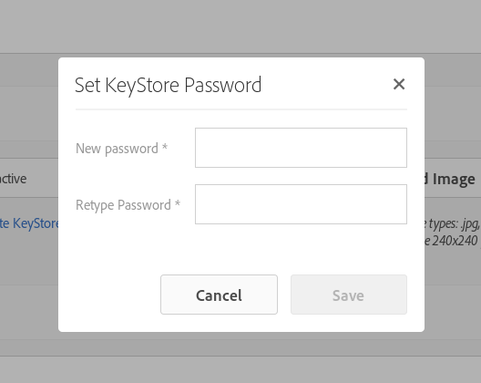
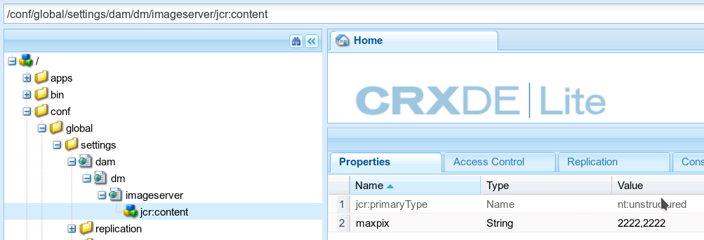

# Konfigurera Dynamic Media - hybridläge {#configuring-dynamic-media-hybrid-mode}

Dynamic Media-Hybrid måste vara aktiverat och konfigurerat för användning. Beroende på ditt sätt att arbeta har Dynamic Media flera [konfigurationer som stöds](#supported-dynamic-media-configurations).

>[!NOTE]
>
>Om du tänker konfigurera och köra Dynamic Media i Scene7 körningsläge, se [Konfigurera Dynamic Media - Scene7-läge](/help/assets/config-dms7.md).
>
>Om du tänker konfigurera och köra Dynamic Media i hybridkörningsläge följer du instruktionerna på den här sidan.

Läs mer om att arbeta med [video](/help/assets/video.md) i Dynamic Media.

>[!NOTE]
>
>Om du använder Adobe Experience Manager för olika miljöer, till exempel en för utveckling, staging och liveproduktion, konfigurerar du Dynamic Media-Cloud Services för varje miljö.

>[!NOTE]
>
>Om du har problem med din Dynamic Media-konfiguration kan du titta i loggfilerna som är specifika för Dynamic Media. Dessa filer installeras automatiskt när du aktiverar Dynamic Media:
>
>* `s7access.log`
>* `ImageServing.log`
>
>De beskrivs i [Övervaka och underhålla Experience Manager-instansen](/help/sites-deploying/monitoring-and-maintaining.md).

Hybridpublicering och -leverans är en av grundfunktionerna i Dynamic Media tillägg till Adobe Experience Manager. Med hybridpublicering kan ni leverera Dynamic Media-material, som bilder, uppsättningar och video, från molnet i stället för från Experience Manager publiceringsnoderna.

Annat innehåll, som Dynamic Media-visningsprogram, webbplatssidor och statiskt innehåll, fortsätter att hanteras från Experience Manager publiceringsnoderna.

Om du använder Dynamic Media måste du använda hybridleverans som leveransmekanism för allt Dynamic Media-innehåll.

## Hybrid publiceringsarkitektur för videor {#hybrid-publishing-architecture-for-videos}


## Hybrid-publiceringsarkitektur för bilder {#hybrid-publishing-architecture-for-images}


## Dynamic Media-konfigurationer som stöds {#supported-dynamic-media-configurations}

Konfigurationsåtgärderna som följer refererar till följande termer:

| **Term** | **Dynamic Media Enabled** | **Beskrivning** |
|---|---|---|
| Experience Manager Author node | Vit bock i en grön cirkel | Författarnoden som du distribuerar till On-Premise eller via Managed Services. |
| Experience Manager Publish-nod | Vitt &quot;X&quot; i en röd kvadrat. | Den publiceringsnod som du distribuerar till On-Premise eller via Managed Services. |
| Image Service Publish-nod | Vit bock i en grön cirkel. | Publiceringsnoden som du kör på datacenter som hanteras av Adobe. Hänvisar till bildtjänstens URL. |

Du kan välja att implementera Dynamic Media endast för bildåtergivning, endast för video eller både för bildåtergivning och video. Anvisningar om hur du konfigurerar Dynamic Media för ditt specifika scenario finns i följande tabell.

<table>
 <tbody>
  <tr>
   <td><strong>Scenario</strong></td>
   <td ><strong>Så här fungerar det</strong></td>
   <td><strong>Konfigurationssteg</strong></td>
  </tr>
  <tr>
   <td>Leverera ENDAST bilder i produktion</td>
   <td>Bilderna levereras via servrar i Adobe globala datacenter och cachas sedan av ett CDN för skalbara prestanda och global räckvidd.</td>
   <td>
    <ol>
     <li>På Experience Manager <strong>författare</strong> nod, <a href="#enabling-dynamic-media">aktivera Dynamic Media</a>.</li>
     <li>Konfigurera bildbehandling i <a href="#configuring-dynamic-media-cloud-services">Dynamic Media-Cloud Services</a>.</li>
     <li><a href="#configuring-image-replication">Konfigurera bildreplikering</a>.</li>
     <li><a href="#replicating-catalog-settings">Replikera kataloginställningar</a>.</li>
     <li><a href="#replicating-viewer-presets">Replikera visningsförinställningar</a>.</li>
     <li><a href="#using-default-asset-filters-for-replication">Använd standardfiltren för replikering</a>.</li>
     <li><a href="#configuring-dynamic-media-image-server-settings">Konfigurera inställningar för Dynamic Media Image Server</a>.</li>
     <li><a href="#delivering-assets">Leverera resurser</a>.</li>
    </ol> </td>
  </tr>
  <tr>
   <td>Leverera ENDAST bilder i förproduktion (Dev, QE, Stage o.s.v.)</td>
   <td>Bilderna levereras via Experience Manager-publiceringsnoden. I det här scenariot, eftersom trafiken är minimal, finns det inget behov av att leverera bilder till Adobe datacenter. Och det möjliggör säker förhandsgranskning av materialet innan det lanseras.</td>
   <td>
    <ol>
     <li>På Experience Manager <strong>författare</strong> nod, <a href="#enabling-dynamic-media">aktivera Dynamic Media</a>.</li>
     <li>På Experience Manager <strong>publicera</strong> nod, <a href="#enabling-dynamic-media">aktivera Dynamic Media</a>.</li>
     <li><a href="#replicating-viewer-presets">Replikera visningsförinställningar</a>.</li>
     <li>Konfigurera <a href="#setting-up-asset-filters-for-imaging-in-non-production-deployments">resursfilter för icke-produktionsbilder</a>.</li>
     <li><a href="#configuring-dynamic-media-image-server-settings">Konfigurera inställningarna för Dynamic Media Image Server.</a></li>
     <li><a href="#delivering-assets">Leverera resurser.</a></li>
    </ol> </td>
  </tr>
  <tr>
   <td>Leverera ENDAST video i alla miljöer (Production, Dev, QE, Stage o.s.v.)</td>
   <td>Videor levereras och cachas av ett CDN för skalbara prestanda och global räckvidd. Videominiatyrbilden (miniatyrbilden av videon som visas innan uppspelningen startar) levereras av publiceringsinstansen i Experience Manager.</td>
   <td>
    <ol>
     <li>På Experience Manager <strong>författare</strong> nod, <a href="#enabling-dynamic-media">aktivera Dynamic Media</a>.</li>
     <li>På Experience Manager <strong>publicera</strong> nod, <a href="#enabling-dynamic-media">aktivera Dynamic Media</a> (publiceringsinstansen visar videobildrutan och tillhandahåller metadata för videouppspelning).</li>
     <li>Konfigurera video i <a href="#configuring-dynamic-media-cloud-services">Dynamic Media Cloud Services.</a></li>
     <li><a href="#replicating-viewer-presets">Replikera visningsförinställningar</a>.</li>
     <li>Konfigurera <a href="#setting-up-asset-filters-for-video-only-deployments">resursfilter för endast video</a>.</li>
     <li><a href="#delivering-assets">Leverera resurser.</a></li>
    </ol> </td>
  </tr>
  <tr>
   <td>Leverera både bilder och video i produktion</td>
   <td><p>Videor levereras och cachas av ett CDN för skalbara prestanda och global räckvidd. Bilder och filmminiatyrbilder levereras via servrar i Adobe globala datacenter och cachas sedan av ett CDN för skalbara prestanda och global räckvidd.</p> <p>Se föregående avsnitt för att ställa in bild eller video i förproduktion. </p> </td>
   <td>
    <ol>
     <li>På Experience Manager <strong>författare</strong> nod, <a href="#enabling-dynamic-media">aktivera Dynamic Media</a>.</li>
     <li>Konfigurera video i <a href="#configuring-dynamic-media-cloud-services">Dynamic Media Cloud Services.</a></li>
     <li>Konfigurera bildbehandling i <a href="#configuring-dynamic-media-cloud-services">Dynamic Media Cloud Services.</a></li>
     <li><a href="#configuring-image-replication">Konfigurera bildreplikering</a>.</li>
     <li><a href="#replicating-catalog-settings">Replikera kataloginställningar</a>.</li>
     <li><a href="#replicating-viewer-presets">Replikera visningsförinställningar</a>.</li>
     <li><a href="#using-default-asset-filters-for-replication">Använd standardresursfilter för replikering.</a></li>
     <li><a href="#configuring-dynamic-media-image-server-settings">Konfigurera inställningarna för Dynamic Media Image Server.</a></li>
     <li><a href="#delivering-assets">Leverera resurser.</a></li>
    </ol> </td>
  </tr>
 </tbody>
</table>

## Aktivera Dynamic Media {#enabling-dynamic-media}

[Dynamic Media](https://business.adobe.com/products/experience-manager/assets/dynamic-media.html) är inaktiverat som standard. Om du vill utnyttja Dynamic Media funktioner måste du aktivera Dynamic Media med `dynamicmedia` kör läge på samma sätt som du skulle `publish` körningsläge. Innan du aktiverar bör du kontrollera att [tekniska krav](/help/sites-deploying/technical-requirements.md#requirements-for-aem-dynamic-media-add-on).

>[!NOTE]
>
>Om du aktiverar Dynamic Media via körningsläget ersätts funktionerna i Experience Manager 6.1 och Experience Manager 6.0 där du aktiverade Dynamic Media genom att du ställer in `dynamicMediaEnabled` flagga till **[!UICONTROL true]**. Den här flaggan har ingen funktion i Experience Manager 6.2 och senare. Du behöver inte starta om snabbstarten för att aktivera Dynamic Media.

Genom att aktivera Dynamic Media är Dynamic Media-funktionerna tillgängliga i användargränssnittet och varje överförd bildresurs får en *cqdam.pyramid.tiff* återgivning som används för snabb leverans av dynamiska bildåtergivningar. Dessa PTIFF har betydande fördelar, till exempel:

* Möjlighet att hantera endast en enda primär källbild och generera oändliga renderingar direkt utan ytterligare lagringsutrymme.
* Möjlighet att använda interaktiv visualisering som zoomning, panorering och rotation.

Om du vill använda Dynamic Media Classic i Experience Manager ska du inte aktivera Dynamic Media såvida du inte använder en [specifikt scenario](/help/sites-administering/scene7.md#aem-scene-integration-versus-dynamic-media). Dynamic Media är inaktiverat om du inte aktiverar Dynamic Media i körningsläge.

Om du vill aktivera Dynamic Media måste du aktivera körningsläget för Dynamic Media antingen från kommandoraden eller från snabbstartfilens namn.

**Så här aktiverar du Dynamic Media:**

1. Gör följande på kommandoraden när du startar snabbstarten:

   * Lägg till `-r dynamicmedia` till slutet av kommandoraden när jar-filen startas.

   ```shellsession {.line-numbers}
   java -Xmx4096m -Doak.queryLimitInMemory=500000 -Doak.queryLimitReads=500000 -jar cq-quickstart-6.5.0.jar -r dynamicmedia
   ```

   Om du publicerar till s7delivery måste du även inkludera följande trustStore-argument:

   ```shellsession {.line-numbers}
   -Djavax.net.ssl.trustStore=<absoluteFilePath>/customerTrustStoreFileName>
   
    -Djavax.net.ssl.trustStorePassword=<passwordForTrustStoreFile>
   ```

1. Begäran `https://localhost:4502/is/image` och se till att Image Server körs nu.

   >[!NOTE]
   >
   >Om du vill felsöka problem med Dynamic Media kan du läsa följande loggar i `crx-quickstart/logs/` katalog:
   >
   >* ImageServer-&lt;portid>-&lt;yyyy>&lt;mm>&lt;dd>.log - ImageServer-loggen innehåller statistik och analysinformation som används för att analysera beteendet i den interna ImageServer-processen.

   Exempel på ett loggfilsnamn för en Image Server: `ImageServer-57346-2020-07-25.log`
   * s7access-&lt;yyyy>&lt;mm>&lt;dd>.log - s7access-loggen registrerar varje begäran som gjorts till Dynamic Media via `/is/image` och `/is/content`.

   Loggarna används bara när Dynamic Media är aktiverat. De ingår inte i **Ladda ned fullständig** paket som genereras från `system/console/status-Bundlelist` sida; när du ringer kundsupport om du har ett Dynamic Media-problem, bifoga båda dessa loggar till problemet.

### Om du har installerat Experience Manager till en annan port eller kontextsökväg ... {#if-you-installed-aem-to-a-different-port-or-context-path}

Om du distribuerar [Experience Manager till en programserver](/help/sites-deploying/application-server-install.md) och har Dynamic Media aktiverat måste du konfigurera **självdomän** i Externalizer. I annat fall fungerar inte generering av miniatyrbilder för resurser i Dynamic Media korrekt.

Om du kör snabbstart på en annan port eller kontextsökväg måste du dessutom ändra **självdomän**.

När Dynamic Media är aktiverat genereras de statiska miniatyråtergivningarna för bildresurser med Dynamic Media. För att miniatyrbildsgenerering ska fungera för Dynamic Media måste Experience Manager utföra en URL-begäran till sig själv och känna till både portnumret och kontextsökvägen.

I Experience Manager:

* The **självdomän** i [Externalizer](/help/sites-developing/externalizer.md) används för att hämta både portnummer och kontextsökväg.
* Om nej **självdomän** har konfigurerats hämtas portnumret och kontextsökvägen från HTTP-tjänsten Jetty.

I en WAR-distribution för Experience Manager QuickStart går det inte att härleda portnumret och kontextsökvägen. Därför måste du konfigurera en **självdomän**. Se [Externalizer-dokumentation](/help/sites-developing/externalizer.md) om hur du konfigurerar **självdomän**.

>[!NOTE]
I en [Fristående Experience Manager QuickStart-driftsättning](/help/sites-deploying/deploy.md), a **självdomän** behöver vanligtvis inte konfigureras eftersom portnumret och kontextsökvägen kan konfigureras automatiskt. Om alla nätverksgränssnitt är inaktiverade måste du konfigurera **självdomän**.

## Inaktivera Dynamic Media  {#disabling-dynamic-media}

Dynamic Media är inte aktiverat som standard. Om du tidigare har aktiverat Dynamic Media kan du stänga av det senare.

Om du vill inaktivera Dynamic Media efter att du har aktiverat det tar du bort `-r dynamicmedia` flagga för körningsläge.

**Så här inaktiverar du Dynamic Media:**

1. När du startar snabbstarten på kommandoraden kan du göra något av följande:

   * Lägg inte till `-r dynamicmedia` till kommandoraden när jar-filen startas.

   ```shellsession {.line-numbers}
   java -Xmx4096m -Doak.queryLimitInMemory=500000 -Doak.queryLimitReads=500000 -jar cq-quickstart-6.5.0.jar
   ```

1. Begäran `https://localhost:4502/is/image`. Du får ett meddelande om att Dynamic Media är inaktiverat.

   >[!NOTE]
   När körningsläget för Dynamic Media har inaktiverats, det arbetsflödessteg som genererar `cqdam.pyramid.tiff` återgivning hoppas över automatiskt. Det inaktiverar även stöd för dynamisk återgivning och andra Dynamic Media-funktioner.
   Observera också att när Dynamic Media körningsläge är inaktiverat efter att du har konfigurerat Experience Manager-servern är alla resurser som har överförts i det körningsläget nu ogiltiga.

## (Valfritt) Migrera förinställningar och konfigurationer för Dynamic Media från 6.3 till 6.5 nolltid {#optional-migrating-dynamic-media-presets-and-configurations-from-to-zero-downtime}

Om du uppgraderar Experience Manager - Dynamic Media från 6.3 till 6.5 (som nu kan köras utan driftavbrott) måste du köra följande kommando. Kommandot migrerar alla dina förinställningar och konfigurationer från `/etc` till `/conf` i CRXDE Lite.

>[!NOTE]
Om du kör Experience Manager-instansen i kompatibilitetsläge, d.v.s. har kompatibilitetspaketet installerat, behöver du inte köra dessa kommandon.

För alla uppgraderingar, antingen med eller utan kompatibilitetspaketet, kan du kopiera de förinställningar för visningsprogram som ursprungligen ingick i Dynamic Media genom att köra följande kommando för Linux®-kurva:

`curl -u admin:admin -X POST https://<server_address>:<server_port>/libs/settings/dam/dm/presets/viewer.pushviewerpresets.json`

Migrera anpassade förinställningar och konfigurationer för visningsprogram som du har skapat från `/etc` till `/conf`kör du följande Linux®-kommando:

`curl -u admin:admin -X POST https://<server_address>:<server_port>/libs/settings/dam/dm/presets.migratedmcontent.json`

## Konfigurera bildreplikering {#configuring-image-replication}

Dynamic Media bildleverans fungerar genom att publicera bildresurser, inklusive videominiatyrer, från Experience Manager Author och replikera dem till Adobe On-demand-replikeringstjänsten (URL:en för replikeringstjänsten). Resurserna levereras sedan via tjänsten för bildleverans på begäran (URL:en för bildtjänsten).

Gör följande:

1. [Konfigurera autentisering](#setting-up-authentication).
1. [Konfigurera replikeringsagenten](#configuring-the-replication-agent).

Replikeringsagenten publicerar Dynamic Media-resurser som bilder, videometadata och uppsättningar till bildtjänsten Adobe. Replikeringsagenten är inte aktiverad som standard.

När du har konfigurerat replikeringsagenten måste du [validera och testa att det har konfigurerats](#validating-the-replication-agent-for-dynamic-media). I det här avsnittet beskrivs dessa procedurer.

>[!NOTE]
Standardminnesgränsen för att skapa PTIFF är 3 GB för alla arbetsflöden. Du kan till exempel bearbeta en bild som kräver 3 GB minne medan andra arbetsflöden är pausade, eller så kan du bearbeta 10 bilder parallellt som kräver 300 MB minne vardera.
Minnesgränsen kan konfigureras och passar systemresursens tillgänglighet och den typ av bildinnehåll som bearbetas. Om du har många stora resurser och tillräckligt med minne i systemet kan du öka den här gränsen för att se till att bilderna bearbetas parallellt.
En bild som kräver mer än den maximala minnesgränsen avvisas.
Om du vill ändra minnesgränsen för att skapa PTIFF går du till **[!UICONTROL Tools]** > **[!UICONTROL Operations]** > **[!UICONTROL Web Console]** > **[!UICONTROL Adobe CQ Scene7 PTiffManager]** och ändra **[!UICONTROL maxMemory]** värde.

### Konfigurera autentisering {#setting-up-authentication}

Konfigurera replikeringsautentisering för författaren så att du kan replikera bilder till tjänsten för leverans av bilder från Dynamic Media. Du får först en KeyStore och sparar den sedan under **[!UICONTROL dynamic-media-replication]** användare och konfigurera det. Företagsadministratören fick ett välkomstmeddelande med KeyStore-filen och de nödvändiga autentiseringsuppgifterna under etableringsprocessen. Kontakta Adobe kundsupport om du inte har fått den här informationen.

**Så här konfigurerar du autentisering:**

1. Kontakta Adobe kundsupport för din KeyStore-fil och ditt lösenord om du inte redan har filen och lösenordet. Den här informationen är en nödvändig del av provisioneringen. Den kopplar nycklarna till ditt konto.

1. I Experience Manager väljer du Experience Manager logotypen för att komma åt den globala navigeringskonsolen och navigerar sedan till **[!UICONTROL Tools]** > **[!UICONTROL Security]** > **[!UICONTROL Users]**.

1. På sidan Användarhantering går du till **[!UICONTROL dynamic-media-replication]** väljer du att öppna.

   

1. På sidan Redigera användarinställningar för dynamisk mediareplikering väljer du **[!UICONTROL Keystore]** tabbtangenten och sedan **[!UICONTROL Create KeyStore]**.

   

1. Ange ett lösenord och bekräfta lösenordet i dialogrutan **[!UICONTROL Set KeyStore Access Password]** -dialogrutan.

   >[!NOTE]
   Kom ihåg lösenordet eftersom du måste ange det igen när du konfigurerar replikeringsagenten senare.

   

1. På **[!UICONTROL Edit User Settings For dynamic-media-replication]** sida, expandera **Lägg till privat nyckel från KeyStore-fil** och lägg till följande (se bilderna som följer):

   * I **[!UICONTROL New Alias]** anger du namnet på ett alias som du vill använda senare i replikeringskonfigurationen. Du kan till exempel använda `replication` som ett alias.
   * Välj **[!UICONTROL KeyStore File]**. Navigera till KeyStore-filen som du får från Adobe, markera den och markera sedan **[!UICONTROL Open]**.
   * I **[!UICONTROL KeyStore File Password]** anger du KeyStore-filens lösenord. Det här lösenordet är **not** det KeyStore-lösenord som du skapade i steg 5, men som är KeyStore-fillösenordet som Adobe tillhandahåller i det välkomstmeddelande som skickas till dig under etableringen. Kontakta Adobe kundsupport om du inte har fått något lösenord för KeyStore-filen.
   * I **[!UICONTROL Private Key Password]** anger du lösenordet för den privata nyckeln (kan vara samma lösenord för den privata nyckeln som angavs i föregående steg). Adobe anger lösenordet för den privata nyckeln i det välkomstmeddelande som skickas till dig under etableringen. Kontakta Adobe kundsupport om du inte har fått något lösenord för den privata nyckeln.
   * I **[!UICONTROL Private Key Alias]** anger du alias för den privata nyckeln. Till exempel, `*companyname*-alias`. Adobe tillhandahåller det privata nyckelaliaset i välkomstmeddelandet som skickas till dig under etableringen. Kontakta Adobe kundsupport om du inte har fått något alias för privat nyckel.

   

1. Välj **[!UICONTROL Save & Close]** om du vill spara ändringarna för den här användaren.

   Sedan måste du [konfigurera replikeringsagenten](#configuring-the-replication-agent).

### Konfigurera replikeringsagenten {#configuring-the-replication-agent}

1. I Experience Manager väljer du Experience Manager logotypen för att komma åt den globala navigeringskonsolen och navigerar sedan till **[!UICONTROL Tools]** > **[!UICONTROL Deployment]** > **[!UICONTROL Replication]** > **[!UICONTROL Agents on author]**.
1. På sidan Agents on author (Agenter på författare) väljer du **[!UICONTROL Dynamic Media Hybrid Image Replication (s7delivery)]**.
1. Välj **[!UICONTROL Edit]**.
1. Välj **[!UICONTROL Settings]** och sedan ange följande:

   * **[!UICONTROL Enabled]** - Markera den här kryssrutan om du vill aktivera replikeringsagenten.
   * **[!UICONTROL Region]** - Ange lämplig region: Nordamerika, Europa eller Asien
   * **[!UICONTROL Tenant ID]** - Det här värdet är namnet på det företag/den klient som publicerar till replikeringstjänsten. Det här värdet är det klient-ID som Adobe tillhandahåller i välkomstmeddelandet som skickas till dig under etableringen. Kontakta Adobe kundsupport om du inte har fått den här informationen.
   * **[!UICONTROL Key Store Alias]** - Det här värdet är samma som **Nytt alias** värdeuppsättning när nyckeln genereras i [Konfigurera autentisering](#setting-up-authentication); till exempel `replication`. (Se steg 7 i [Konfigurera autentisering](#setting-up-authentication).)
   * **[!UICONTROL Key Store Password]** - Det KeyStore-lösenord som skapades när du knackade på det **[!UICONTROL Create KeyStore]**. Adobe anger inte det här lösenordet. Se steg 5 i [Konfigurera autentisering](#setting-up-authentication).

   Följande bild visar replikeringsagenten med exempeldata:

   

1. Välj **[!UICONTROL OK]**.

### Verifiera replikeringsagenten för Dynamic Media {#validating-the-replication-agent-for-dynamic-media}

Så här validerar du replikeringsagenten för Dynamic Media:

Välj **[!UICONTROL Test Connection]**. Exempelutdata är följande:

```shell
11.03.2016 10:57:55 - Transferring content for ReplicationAction{type=TEST, path[0]='/content/dam', time=1457722675402, userId='admin', revision='null'}
11.03.2016 10:57:55 - * Auth User: replication-receiver
11.03.2016 10:57:55 - * HTTP Version: 1.1
11.03.2016 10:57:55 - * Using OAuth 2.0 Authorization Grants
11.03.2016 10:57:55 - * OAuth 2.0 User: dynamic-media-replication
11.03.2016 10:57:55 - * OAuth 2.0 Token: '*****' initialized
11.03.2016 10:57:55 - Publishing: POST[https://replicate-na.assetsadobe.com:8580/is-publish/publish-receiver?Cmd=Test&RootId=xfpuu-6613]
11.03.2016 10:57:55 - Publish response: OK[]
11.03.2016 10:57:55 - Transfer succeeded in 141 ms for ReplicationAction{type=TEST, path[0]='/content/dam', time=1457722675402, userId='admin', revision='null'}
-------------------------------------------------------------------------------------------------------------------------------
Replication test succeeded
```

>[!NOTE]
Du kan även kontrollera genom att göra något av följande:
* Kontrollera replikeringsloggarna för att se till att resursen är replikerad.
* Publicera en bild. Markera bilden och markera **[!UICONTROL Viewers]** i listrutan och välj sedan en visningsförinställning. Välj **[!UICONTROL URL]**. Verifiera att bilden visas genom att kopiera och klistra in URL-sökvägen i webbläsaren.
>


### Felsök autentisering {#troubleshooting-authentication}

När du konfigurerar autentisering finns det några problem som du kan stöta på när du skapar lösningar. Kontrollera att du har konfigurerat replikering innan du söker efter dessa problem.

#### Problem: HTTP-statuskod 401 med meddelande - Behörighet krävs {#problem-http-status-code-with-message-authorization-required}

Det här problemet kan bero på att det inte gick att konfigurera KeyStore för `dynamic-media-replication` användare.

```shell
Replication test to s7delivery:https://s7bern.macromedia.com:8580/is-publish/
17.06.2016 18:54:43 - Transferring content for ReplicationAction{type=TEST, path[0]='/content/dam', time=1466214883309, userId='admin', revision='null'}
17.06.2016 18:54:43 - * Auth User: replication-receiver
17.06.2016 18:54:43 - * HTTP Version: 1.1
17.06.2016 18:54:43 - * Using OAuth 2.0 Authorization Grants
17.06.2016 18:54:43 - * OAuth 2.0 User: dynamic-media-replication
17.06.2016 18:54:43 - No OAuth token available. OAuth not initialized
17.06.2016 18:54:43 - * Using Client Auth SSL alias - replication-alias *
17.06.2016 18:54:43 - Publishing: POST[https://<localhost>:8580/is-publish//publish-receiver?Cmd=Test&RootId=brough]
17.06.2016 18:54:43 - Transfer failed for ReplicationAction{type=TEST, path[0]='/content/dam', time=1466214883309, userId='admin', revision='null'}. java.io.IOException: Failed to execute request
'https://<localhost>:8580/is-publish//publish-receiver?Cmd=Test&RootId=brough':
 Server returned status code 401 with message: Authorization required.
17.06.2016 18:54:43 - Error while replicating: com.day.cq.replication.ReplicationException: Transfer failed for ReplicationAction{type=TEST, path[0]='/content/dam', time=1466214883309,
 userId='admin', revision='null'}. java.io.IOException: Failed to execute request
'https://<localhost>:8580/is-publish//publish-receiver?Cmd=Test&RootId=brough':
 Server returned status code 401 with message: Authorization required.
```

**Lösning:**
Kontrollera att `KeyStore` sparas i **dynamisk mediareplikering** användaren och har rätt lösenord.

#### Problem: Det gick inte att dekryptera nyckeln - det gick inte att dekryptera data {#problem-could-not-decrypt-key-could-not-decrypt-data}

```xml
Replication test to s7delivery:https://<localhost>:8580/is-publish/
17.06.2016 19:00:16 - Transferring content for ReplicationAction{type=TEST, path[0]='/content/dam', time=1466215216662, userId='admin', revision='null'}
17.06.2016 19:00:16 - * Auth User: replication-receiver
17.06.2016 19:00:16 - * HTTP Version: 1.1
17.06.2016 19:00:16 - * Using OAuth 2.0 Authorization Grants
17.06.2016 19:00:16 - * OAuth 2.0 User: dynamic-media-replication
17.06.2016 19:00:16 - No OAuth token available. OAuth not initialized
17.06.2016 19:00:16 - * Using Client Auth SSL alias - replication-alias *
17.06.2016 19:00:16 - Transfer failed for ReplicationAction{type=TEST, path[0]='/content/dam', time=1466215216662, userId='admin', revision='null'}. java.lang.SecurityException: java.security.UnrecoverableKeyException: Could not decrypt key: Could not decrypt data.
```

**Lösning:**
Kontrollera lösenordet. Lösenordet som har sparats i replikeringsagenten är inte samma lösenord som användes för att skapa nyckelbehållaren.

#### Problem: InvalidAlgorithmParameterException {#problem-invalidalgorithmparameterexception}

Det här problemet orsakas av ett konfigurationsfel i Experience Manager Author-instansen. Java™-processen på författaren hämtar inte rätt `javax.net.ssl.trustStore`. Följande fel visas i replikeringsloggen:

```shell
14.04.2016 09:37:43 - Transfer failed for ReplicationAction{type=TEST, path[0]='/content/dam', time=1460651862089, userId='admin', revision='null'}. java.io.IOException: Failed to execute request 'https://<localhost>:8580/is-publish/publish-receiver?Cmd=Test&RootId=rbrough-osx2': java.lang.RuntimeException: Unexpected error: java.security.InvalidAlgorithmParameterException: the trustAnchors parameter must be non-empty
14.04.2016 09:37:43 - Error while replicating: com.day.cq.replication.ReplicationException: Transfer failed for ReplicationAction{type=TEST, path[0]='/content/dam', time=1460651862089, userId='admin', revision='null'}. java.io.IOException: Failed to execute request 'https://<localhost>:8580/is-publish/publish-receiver?Cmd=Test&RootId=rbrough-osx2': java.lang.RuntimeException: Unexpected error: java.security.InvalidAlgorithmParameterException: the trustAnchors parameter must be non-empty
```

Eller felloggen:

```shell
07.25.2019 12:00:59.893 *ERROR* [sling-threadpool-db2763bb-bc50-4bb5-bb64-10a09f432712-(apache-sling-job-thread-pool)-90-com_day_cq_replication_job_s7delivery(com/day/cq/replication/job/s7delivery)] com.day.cq.replication.Agent.s7delivery.queue Error during processing of replication.

java.io.IOException: Failed to execute request 'https://replicate-na.assetsadobe.com:8580/is-publish/publish-receiver?Cmd=Test&RootId=rbrough-osx': java.lang.RuntimeException: Unexpected error: java.security.InvalidAlgorithmParameterException: the trustAnchors parameter must be non-empty
        at com.scene7.is.catalog.service.publish.atomic.PublishingServiceHttp.executePost(PublishingServiceHttp.scala:195)
```

**Lösning:**
Kontrollera att Java™-processen på författaren till Experience Manager har egenskapen system `-Djavax.net.ssl.trustStore=` anges till ett giltigt förtroendearkiv.

#### Problem: KeyStore har inte konfigurerats eller är inte initierat {#problem-keystore-is-either-not-set-up-or-it-is-not-initialized}

Problemet beror troligen på en snabbkorrigering eller ett funktionspaket som skriver över noden dynamic-media-user eller keystore.

Exempel på replikeringslogg:

```shell
Replication test to s7delivery:https://replicate-na.assetsadobe.com/is-publish
02.08.2016 14:37:44 - Transferring content for ReplicationAction{type=TEST, path[0]='/content/dam', time=1470173864834, userId='admin', revision='null'}
02.08.2016 14:37:44 - * Auth User: replication-receiver
02.08.2016 14:37:44 - * HTTP Version: 1.1
02.08.2016 14:37:44 - * Using OAuth 2.0 Authorization Grants
02.08.2016 14:37:44 - * OAuth 2.0 User: dynamic-media-replication
02.08.2016 14:37:44 - Transfer failed for ReplicationAction{type=TEST, path[0]='/content/dam', time=1470173864834, userId='admin', revision='null'}. com.adobe.granite.keystore.KeyStoreNotInitialisedException: Uninitialised key store for user dynamic-media-replication
```

**Lösning:**

1. Gå till sidan Användarhantering:
   `localhost:4502/libs/granite/security/content/useradmin.html`
1. På sidan Användarhantering går du till `dynamic-media-replication` väljer du att öppna.
1. Välj **[!UICONTROL KeyStore]** -fliken. Om **[!UICONTROL Create KeyStore]** visas måste du göra om stegen under [Konfigurera autentisering](#setting-up-authentication) tidigare.
1. Om du var tvungen att göra om installationen av KeyStore måste du göra det [Konfigurera replikeringsagenten](/help/assets/config-dynamic.md#configuring-the-replication-agent) igen också.

   Konfigurera om s7delivery Replication Agent.
   `localhost:4502/etc/replication/agents.author/s7delivery.html`

1. Välj **[!UICONTROL Test Connection]** så att du kan verifiera att konfigurationen är giltig.

#### Problem: Publiceringsagenten använder SSL i stället för OAuth {#problem-publish-agent-is-using-ssl-instead-of-oauth}

Problemet beror troligen på en snabbkorrigering eller ett funktionspaket som inte installerades korrekt eller som skrev över inställningarna.

Exempel på replikeringslogg:

```shell
01.08.2016 18:42:59 - Transferring content for ReplicationAction{type=TEST, path[0]='/content/dam', time=1470073379634, userId='admin', revision='null'}
01.08.2016 18:42:59 - * Auth User: replication-receiver
01.08.2016 18:42:59 - * HTTP Version: 1.1
01.08.2016 18:42:59 - * Using Client Auth SSL alias - replication-receiver *
01.08.2016 18:42:59 - Publishing: POST[https://replicate-eu.assetsadobe2.com:443/is-publish/publish-receiver?Cmd=Test&RootId=altayerstaging]
01.08.2016 18:42:59 - Transfer failed for ReplicationAction{type=TEST, path[0]='/content/dam', time=1470073379634, userId='admin', revision='null'}. java.io.IOException: Failed to execute request 'https://replicate-eu.assetsadobe2.com:443/is-publish/publish-receiver?Cmd=Test&RootId=rbroughstaging': Server returned status code 401 with message: Authorization required.
01.08.2016 18:42:59 - Error while replicating: com.day.cq.replication.ReplicationException: Transfer failed for ReplicationAction{type=TEST, path[0]='/content/dam', time=1470073379634, userId='admin', revision='null'}. java.io.IOException: Failed to execute request 'https://replicate-eu.assetsadobe2.com:443/is-publish/publish-receiver?Cmd=Test&RootId=rbroughstaging': Server returned status code 401 with message: Authorization required.
```

**Lösning:**

1. I Experience Manager går du till **[!UICONTROL Tools]** > **[!UICONTROL General]** > **[!UICONTROL CRXDE Lite]**.

   `localhost:4502/crx/de/index.jsp`

1. Navigera till s7delivery Replication Agent-noden.
   `localhost:4502/crx/de/index.jsp#/etc/replication/agents.author/s7delivery/jcr:content`

1. Lägg till den här inställningen i replikeringsagenten (Boolean med värdet inställt på **[!UICONTROL True]**):

   `enableOauth=true`

1. I närheten av sidans övre vänstra hörn väljer du **[!UICONTROL Save All]**.

### Testa konfigurationen {#testing-your-configuration}

Adobe rekommenderar att du utför ett test från början till slut av konfigurationen.

Kontrollera att du redan har gjort följande innan du påbörjar testet:

* Lagt till bildförinställningar.
* Konfigurera **[!UICONTROL Dynamic Media Configuration (Pre 6.3)]** under Cloud Services. URL till bildtjänsten krävs för det här testet

**Så här testar du konfigurationen:**

1. Överför en bildresurs. (Navigera i Resurser till **[!UICONTROL Create]** > **[!UICONTROL Files]** och markera filen.)
1. Vänta tills arbetsflödet är klart.
1. Publicera bildresursen. (Markera resursen och välj **[!UICONTROL Quick Publish]**.)
1. Navigera till återgivningarna för bilden genom att öppna bilden och trycka på **[!UICONTROL Renditions]**.

   

1. Välj en dynamisk återgivning.
1. Om du vill hämta URL:en för den här resursen väljer du **[!UICONTROL URL]**.
1. Navigera till den valda URL:en och kontrollera om bilden fungerar som förväntat.

Ett annat sätt att testa att dina resurser har levererats är att lägga till req=exists till din URL.

## Konfigurera Dynamic Media-Cloud Services {#configuring-dynamic-media-cloud-services}

Dynamic Media-Cloud Servicen stöder hybridpublicering och leverans av bilder, video, videoanalyser och videokodning, bland annat.

Som en del av konfigurationen måste du ange ett registrerings-ID, en URL för videotjänst, en URL för bildtjänst, en URL för replikeringstjänsten och ställa in autentisering. Den här informationen har skickats till dig via e-post som en del av kontoetableringsprocessen. Om du inte har fått den här informationen kontaktar du Adobe Experience Manager Administrator eller Adobe Customer Support för att få informationen.

>[!NOTE]
Innan du konfigurerar Dynamic Media-Cloud Services bör du kontrollera att publiceringsinstansen är konfigurerad. Du måste också ha konfigurerat replikeringen innan du konfigurerar Dynamic Media-Cloud Services.

**Så här konfigurerar du Dynamic Media-Cloud Services:**

1. I Experience Manager väljer du Experience Manager logotypen för att komma åt den globala navigeringskonsolen och navigerar sedan till **[!UICONTROL Tools]** > **[!UICONTROL Cloud Services]** > **[!UICONTROL Dynamic Media Configuration (Pre-6.3)]**.
1. På sidan Dynamic Media Configuration Browser väljer du **[!UICONTROL global]** väljer **[!UICONTROL Create]**.
1. I **[!UICONTROL Create Dynamic Media Configuration]** i fältet Titel skriver du en titel.
1. Om du konfigurerar Dynamic Media för video,

   * I **[!UICONTROL Registration ID]** anger du ditt registrerings-ID.
   * I **[!UICONTROL Video Service URL]** anger du webbadressen för videotjänsten för Dynamic Media Gateway.

1. Om du konfigurerar Dynamic Media för bildbehandling finns följande i **[!UICONTROL Image Service URL]** anger du bildtjänstens URL för Dynamic Media Gateway.
1. Välj **[!UICONTROL Save]** för att gå tillbaka till Dynamic Media Configuration Browser.
1. Om du vill komma åt den globala navigeringskonsolen väljer du Experience Manager-logotypen.

## Konfigurera videorapportering {#configuring-video-reporting}

Du kan konfigurera videorapportering för flera installationer av Experience Manager med Dynamic Media Hybrid.

**När ska du använda:** När du konfigurerar Dynamic Media Configuration (Pre 6.3) startas flera funktioner, bland annat videorapportering. Konfigurationen skapar en rapportserie i ett regionalt Analytics-företag. Om du konfigurerar flera författarnoder skapar du en separat rapportserie för var och en av dem. Därför är rapportering av data inkonsekvent mellan anläggningar. Om varje Author-nod refererar till samma Hybrid Publish-server, ändrar den senaste Author-installationen målrapportsviten för alla videorapporter. Det här problemet överbelastar analyssystemet med för många rapportsviter.

**Kom igång:** Konfigurera videorapportering genom att utföra följande tre uppgifter.

1. Skapa ett förinställt paket för videoanalys när du har konfigurerat Dynamic Media Configuration (Pre 6.3) på den första Author-noden. Den här initiala aktiviteten är viktig eftersom den tillåter en ny konfiguration att fortsätta använda samma rapportserie.
1. Installera förinställningspaketet för Video Analytics i alla ***new*** Författarnod ***före*** konfigurerar du Dynamic Media Configuration (Pre 6.3).
1. Verifiera och felsök paketinstallationen.

### Skapa ett förinställt paket för videoanalys efter att du har konfigurerat den första redigeringsnoden {#creating-a-video-analytics-preset-package-after-configuring-the-first-author-node}

När du är klar med den här uppgiften har du en paketfil som innehåller förinställningarna för videoanalys. Dessa förinställningar innehåller en rapportserie, spårningsservern, spårningsnamnutrymmet och Experience Cloud organisations-ID, om sådana finns.

1. Om du inte redan har gjort det konfigurerar du Dynamic Media Configuration (Pre 6.3).
1. (Valfritt) Visa och kopiera Report Suite-ID:t (du måste ha tillgång till JCR:et). Även om det inte krävs något ID för Report Suite gör det valideringen enklare.
1. Skapa ett paket med Pakethanteraren.
1. Redigera paketet för att inkludera ett filter.

   I Experience Manager: `/conf/global/settings/dam/dm/presets/analytics/jcr:content/userdata`

1. Bygg paketet.
1. Hämta eller dela förinställningspaketet för Video Analytics så att det kan delas med efterföljande nya redigeringsnoder.

### Installera förinställningspaketet för videoanalys innan du konfigurerar fler författarnoder {#installing-the-video-analytics-preset-package-before-you-configure-additional-author-nodes}

Se till att du slutför den här uppgiften ***före*** konfigurerar du Dynamic Media Configuration (Pre 6.3). Om du inte gör det skapas en annan oanvänd rapportserie. Dessutom är datainsamlingen inte optimerad även om videorapporteringen fortfarande fungerar som den ska.

Kontrollera att förinställningspaketet för Video Analytics från den första författarnoden är tillgängligt på den nya författarnoden.

1. Överför förinställningspaketet för videoanalys som du skapade tidigare till Package Manager.
1. Installera förinställningspaketet för Video Analytics.
1. Konfigurera Dynamic Media (före 6.3).

### Verifiera och felsöka paketinstallationen {#verifying-and-debugging-the-package-installation}

1. Gör något av följande för att verifiera och, om det behövs, felsöka paketinstallationen:

   * **Kontrollera förinställningen för videoanalys med JCR**
Om du vill kontrollera förinställningen för videoanalys med JCR-funktionen måste du ha tillgång till CRXDE Lite.

      Experience Manager - I CRXDE Lite går du till `/conf/global/settings/dam/dm/presets/analytics/jcr:content/userdata`

      Som i `https://localhost:4502/crx/de/index.jsp#/conf/global/settings/dam/dm/presets/analytics/jcr%3Acontent/userdata`

      Om du inte har tillgång till CRXDE Lite på författarnoden kan du kontrollera förinställningen via publiceringsservern.

   * **Kontrollera förinställningen för videoanalys via bildservern**

      Du kan validera Video Analytics-förinställningen direkt genom att göra en Image Server req=userdata-förfrågan.
Om du till exempel vill se Analytics-förinställningen på författarnoden kan du göra följande begäran:

      `https://localhost:4502/is/image/conf/global/settings/dam/dm/presets/analytics?req=userdata`

      Om du vill validera förinställningen på publiceringsservrar kan du göra en liknande direktförfrågan till publiceringsservern. Svaren är desamma på författar- och publiceringsnoderna. Svaret ser ut ungefär så här:

      ```
      marketingCloudOrgId=0FC4E86B573F99CC7F000101
       reportSuite=aemaem6397618-2018-05-23
       trackingNamespace=aemvideodal
       trackingServer=aemvideodal.d2.sc.omtrdc.net
      ```

   * **Kontrollera förinställningen för videoanalys med videorapporteringsverktyget i Experience Manager**
Navigera till **[!UICONTROL Tools]** > **[!UICONTROL Assets]** > **[!UICONTROL Video Reporting]**

      `https://localhost:4502/mnt/overlay/dam/gui/content/s7dam/videoreports/videoreport.html`

      Om följande felmeddelande visas är rapportsviten tillgänglig, men inte ifylld. Felet är korrekt - och önskat - i en ny installation innan systemet samlar in data.
   

   Om du vill generera rapportdata överför och publicerar du en video. Använd **[!UICONTROL Copy URL]** och kör videon minst en gång.

   Det kan ta upp till 12 timmar innan rapportdata fylls i från Video Viewer-användningen.

   Om ett fel uppstår och rapportsviten inte är korrekt inställd visas följande varning.

   

   Det här felet visas också om videorapporteringen körs innan du konfigurerar Dynamic Media Configuration (Pre 6.3)-tjänster.

### Felsöka konfigurationen för videorapportering {#troubleshooting-the-video-reporting-configuration}

* Under installationen kan anslutningar till API-servern för Analytics göra timeout. Installationen försöker ansluta igen 20 gånger, men den misslyckas fortfarande. När detta inträffar registreras flera fel i loggfilen. Sök efter `SiteCatalystReportService`.
* Om Analytics Preset-paketet inte installeras först kan en ny rapportserie skapas.
* Om du uppgraderar från Experience Manager 6.3 till Experience Manager 6.4 eller Experience Manager 6.4.1 och sedan konfigurerar Dynamic Media Configuration (Pre 6.3) skapas fortfarande en rapportserie. Detta problem är känt och behandlas som åtgärdat för Experience Manager 6.4.2.

### Om förinställningen Videoanalys {#about-the-video-analytics-preset}

Förinställningen Video Analytics (Videoanalys), som ibland helt enkelt kallas analysförinställning, lagras bredvid visningsförinställningarna i Dynamic Media. Det är i princip detsamma som en visningsprogramförinställning, men med information som används för att konfigurera AppMeasurement- och Video Heartbeat-rapporter.

Förinställningens egenskaper är följande:

* `reportSuite`
* `trackingServer`
* `trackingNamespace`
* `marketingCloudOrgId` (finns inte i äldre versioner av Experience Manager)

Experience Manager 6.4 och senare versioner sparar den här förinställningen på `/conf/global/settings/dam/dm/presets/analytics/jcr:content/userdata`

## Replikera kataloginställningar {#replicating-catalog-settings}

Publicera dina egna standardkataloginställningar som en del av konfigurationsprocessen via JCR. Så här replikerar du kataloginställningar:

1. Kör följande i ett terminalfönster:

   `curl -u admin:admin localhost:4502/libs/settings/dam/dm/presets/viewer.pushviewerpresets`

1. I Experience Manager navigerar du till följande plats i CRXDE Lite (kräver administratörsbehörighet):

   `https://<*server*>:<*port*>/crx/de/index.jsp#/conf/global/settings/dam/dm/imageserver/`

1. Välj **[!UICONTROL Replication]** -fliken.
1. Välj **[!UICONTROL Replicate]**.

## Replikera visningsförinställningar {#replicating-viewer-presets}

Att leverera *en resurs med en visningsförinställning måste du replikera/publicera* visningsförinställningen. (Alla visningsförinställningar måste aktiveras *och* replikeras för att hämta URL-adressen eller inbäddningskoden för en resurs.
Se [Publicera förinställningar för visningsprogram](/help/assets/managing-viewer-presets.md#publishing-viewer-presets) för mer information.

>[!NOTE]
Som standard visas olika återgivningar när du väljer **[!UICONTROL Renditions]** och olika förinställningar för visningsprogram när du väljer **[!UICONTROL Viewers]** i resursens detaljvy. Du kan öka eller minska antalet som visas. Se [Öka antalet bildförinställningar som visas](/help/assets/managing-image-presets.md#increasing-or-decreasing-the-number-of-image-presets-that-display) eller [Öka antalet visningsförinställningar som visas](/help/assets/managing-viewer-presets.md#increasing-the-number-of-viewer-presets-that-display).

## Filtrera resurser för replikering {#filtering-assets-for-replication}

I distributioner som inte är från Dynamic Media replikerar du *alla* resurser (både bilder och video) från Experience Manager-redigeringsmiljön till Experience Manager-publiceringsnoden. Det här arbetsflödet är nödvändigt eftersom publiceringsservrarna i Experience Manager också levererar resurserna.

I Dynamic Media-distributioner finns det dock inget behov av att replikera samma resurser till publiceringsnoderna i Experience Manager eftersom resurserna levereras via molnet. Ett sådant&quot;hybridpubliceringsarbetsflöde&quot; undviker extra lagringskostnader och längre bearbetningstider för att replikera resurser. Annat innehåll, som Dynamic Media-visningsprogram, webbplatssidor och statiskt innehåll, fortsätter att hanteras från Experience Manager publiceringsnoderna.

Förutom att replikera resurserna replikeras även följande icke-resurser:

* Dynamic Media Delivery configuration: `/conf/global/settings/dam/dm/imageserver/jcr:content`
* Bildförinställningar: `/conf/global/settings/dam/dm/presets/macros`
* Förinställningar för visningsprogram: `/conf/global/settings/dam/dm/presets/viewer`

Med filtren kan du *exclude* resurser från att replikeras till publiceringsnoden Experience Manager.

### Använd standardfiltren för replikering {#using-default-asset-filters-for-replication}

Om du använder Dynamic Media för (1) bildbehandling *eller* (2) Bild och video, så kan du använda standardfiltren som finns i Adobe. Följande filter är aktiva som standard:

<table>
 <tbody>
  <tr>
   <td> </td>
   <td><strong>Filter</strong></td>
   <td><strong>Mime-typ</strong></td>
   <td><strong>Återgivningar</strong></td>
  </tr>
  <tr>
   <td>Dynamic Media Image Delivery</td>
   <td><p>filterbilder</p> <p>filteruppsättningar</p> <p> </p> </td>
   <td><p>Börjar med <strong>bild/</strong></p> <p>Innehåller <strong>program/</strong> och slutar med <strong>set</strong>.</p> </td>
   <td>De färdiga filterbilderna (gäller för enstaka bildresurser, inklusive interaktiva bilder) och "filteruppsättningar" (gäller Spin Sets, Image Sets, Mixed Media Sets och Carousel Sets) kommer att
    <ul>
     <li>Inkludera PTIFF-bilder och metadata för replikering (alla återgivningar som börjar med <strong>cqdam</strong>).</li>
     <li>Uteslut den ursprungliga bilden och statiska bildåtergivningar från replikering.</li>
    </ul> </td>
  </tr>
  <tr>
   <td>Dynamic Media Video Delivery</td>
   <td>filter-video</td>
   <td>Börjar med <strong>video/</strong></td>
   <td>"filter-video" som är klar att användas:
    <ul>
     <li>Inkludera proxyvideorenderingar, videominiatyr/filmminiatyrbild, metadata (både vid överordnad video och videorenderingar) för replikering (alla renderingar som börjar med <strong>cqdam</strong>).</li>
     <li>Undanta återgivningar av originalvideo och statiska miniatyrer från replikering.<br /> <br /> <strong>Obs!</strong> Proxyvideorenderingarna innehåller inga binärfiler, utan är bara nodegenskaper. Det påverkar således inte utgivarens databasstorlek.</li>
    </ul> </td>
  </tr>
  <tr>
   <td>Integrering med Dynamic Media Classic (Scene7)</td>
   <td><p>filterbilder</p> <p>filteruppsättningar</p> <p>filter-video</p> </td>
   <td><p>Börjar med <strong>bild/</strong></p> <p>Innehåller <strong>program/</strong> och slutar med <strong>set</strong>.</p> <p>Börjar med <strong>video/</strong></p> </td>
   <td><p>Du konfigurerar transport-URI:n så att den pekar på Experience Manager-publiceringsservern i stället för Adobe Dynamic Media Cloud-replikeringstjänstens URL. Om du konfigurerar det här filtret kan Dynamic Media Classic leverera resurser i stället för publiceringsinstansen Experience Manager.</p> <p>De färdiga filterbilderna, filteruppsättningarna och filtervideon kommer att:</p>
    <ul>
     <li>Inkludera PTIFF-bild, proxyvideorenderingar och metadata för replikering. Men eftersom de inte finns i JCR-rapporterna för dem som kör Experience Manager gör Dynamic Media Classic-integreringen ingenting alls.</li>
     <li>Undvik replikering av originalbilden, statiska bildåtergivningar, originalvideo och statiska miniatyråtergivningar. Istället levererar Dynamic Media Classic bild- och videomaterial.</li>
    </ul> </td>
  </tr>
 </tbody>
</table>

>[!NOTE]
Filter gäller för MIME-typer och kan inte vara sökvägsspecifika.

### Ställ in resursfilter för distributioner med enbart video {#setting-up-asset-filters-for-video-only-deployments}

Om du använder Dynamic Media för endast video följer du de här stegen för att konfigurera resursfilter för replikering:

1. I Experience Manager väljer du Experience Manager logotypen för att komma åt den globala navigeringskonsolen och navigerar sedan till **[!UICONTROL Tools]** > **[!UICONTROL Deployment]** > **[!UICONTROL Replication]** > **[!UICONTROL Agents on author]**.
1. På sidan Agents on author (Agenter på författare) väljer du **[!UICONTROL Default Agent (publish)]**.
1. Välj **[!UICONTROL Edit]**.
1. I **[!UICONTROL Agent Settings]** i **[!UICONTROL Settings]** flik, kontrollera **[!UICONTROL Enabled]** för att aktivera agenten.
1. Välj **[!UICONTROL OK]**.
1. I Experience Manager går du till **[!UICONTROL Tools]** > **[!UICONTROL General]** > **[!UICONTROL CRXDE Lite]**.
1. I det vänstra mappträdet navigerar du till `/etc/replication/agents.author/dynamic_media_replication/jcr:content/damRenditionFilters`
1. Sök **[!UICONTROL filter-video]**, högerklicka på den och välj **[!UICONTROL Copy]**.
1. I det vänstra mappträdet navigerar du till `/etc/replication/agents.author/publish`
1. Sök `jcr:content`, högerklicka på den och välj **[!UICONTROL Paste]**.

Med de här stegen konfigureras publiceringsinstansen i Experience Manager så att videobilden och de videometadata som krävs för uppspelning levereras av Dynamic Media-Cloud Servicen. Filtret exkluderar även återgivningar av originalvideo och statiska miniatyrer som inte behövs i publiceringsinstansen från replikering.

### Ställ in resursfilter för avbildning i icke-produktionsdistributioner {#setting-up-asset-filters-for-imaging-in-non-production-deployments}

Om du använder Dynamic Media för bildåtergivning i icke-produktionsdistributioner följer du de här stegen för att ställa in resursfilter för replikering:

1. I Experience Manager väljer du Experience Manager logotypen för att komma åt den globala navigeringskonsolen och navigerar sedan till **[!UICONTROL Tools]** > **[!UICONTROL Deployment]** > **[!UICONTROL Replication]** > **[!UICONTROL Agents on author]**.
1. På sidan Agents on author (Agenter på författare) väljer du **[!UICONTROL Default Agent (publish)]**.
1. Välj **[!UICONTROL Edit]**.
1. I **[!UICONTROL Agent Settings]** i **[!UICONTROL Settings]** flik, kontrollera **[!UICONTROL Enabled]** för att aktivera agenten.
1. Välj **[!UICONTROL OK]**.
1. I Experience Manager går du till **[!UICONTROL Tools]** > **[!UICONTROL General]** > **[!UICONTROL CRXDE Lite]**.
1. I det vänstra mappträdet navigerar du till `/etc/replication/agents.author/dynamic_media_replication/jcr:content/damRenditionFilters`

   

1. Sök **[!UICONTROL filter-images]**, högerklicka på den och välj **[!UICONTROL Copy]**.
1. I det vänstra mappträdet navigerar du till `/etc/replication/agents.author/publish`
1. Sök `jcr:content`, högerklicka på den och gå sedan till **[!UICONTROL Create]** > **[!UICONTROL Create Node]**. Ange namnet `damRenditionFilters` av typen `nt:unstructured`.
1. Sök `damRenditionFilters`, högerklicka på den och välj **[!UICONTROL Paste]**.

Med de här stegen konfigureras publiceringsinstansen i Experience Manager så att bilderna levereras till din icke-produktionsmiljö. Filtret exkluderar också den ursprungliga bilden och statiska återgivningar som inte behövs i publiceringsinstansen från replikeringen.

>[!NOTE]
Om det finns många olika filter i en författare måste varje agent ha tilldelats en annan användare. Koden granite använder en-filter-per-användarmodell. Ha alltid olika användare för varje filterinställning.
Använder du mer än ett filter på en server? Ett filter för replikering som ska publiceras och ett andra filter för s7delivery. I så fall måste du se till att dessa två filter har olika **userId** som tilldelats dem i `jcr:content` nod. Se bilden som följer:


### Anpassa resursfilter för replikering (valfritt) {#customizing-asset-filters-for-replication}

1. I Experience Manager väljer du Experience Manager logotypen för att komma åt den globala navigeringskonsolen och navigerar sedan till **[!UICONTROL Tools]** > **[!UICONTROL General]** > **[!UICONTROL CRXDE Lite]**.
1. I det vänstra mappträdet navigerar du till `/etc/replication/agents.author/dynamic_media_replication/jcr:content/damRenditionFilters` för att granska filtren.

   

1. Du definierar Mime-typen för filtret genom att leta reda på Mime-typen enligt följande:

   Expandera i den vänstra listen `content > dam > <locate_your_asset> >  jcr:content > metadata` och sedan i tabellen letar du reda på `dc:format`.

   Följande bild är ett exempel på en resurs sökväg till `dc:format`.

   

   Observera att `dc:format` för tillgången `Fiji Red.jpg` är `image/jpeg`.

   Om du vill att det här filtret ska gälla för alla bilder, oavsett format, anger du värdet till `image/*` där `*` är ett reguljärt uttryck som används på alla bilder i alla format.

   Om du bara vill att filtret ska gälla för bilder av typen JPEG anger du värdet `image/jpeg`.

1. Definiera vilka renderingar du vill inkludera eller exkludera från replikering.

   Följande tecken kan användas för att filtrera replikering:

   | Tecken som ska användas | Så här filtrerar du resurser för replikering |
   | --- | --- |
   | `*` | Jokertecken |
   | `+` | Innehåller resurser för replikering |
   | `-` | Exkluderar resurser från replikering |

   Navigera till `content/dam/<locate your asset>/jcr:content/renditions`.

   Följande grafik är ett exempel på en resurs återgivningar.

   

   Om du använder exemplet ovan och bara vill replikera PTIFF (Pyramid TIFF) skriver du `+cqdam,*` som innehåller alla återgivningar som börjar med `cqdam`. I exemplet är den återgivningen `cqdam.pyramid.tiff`.

   Om du bara vill replikera originalet skriver du `+original`.

## Konfigurera inställningar för Dynamic Media Image Server {#configuring-dynamic-media-image-server-settings}

När du konfigurerar Dynamic Media Image Server måste du redigera Adobe CQ Scene7 ImageServer-paketet och Adobe CQ Scene7 PlatformServer-paketet.

>[!NOTE]
Dynamic Media fungerar som det ska [efter att det har aktiverats](#enabling-dynamic-media). Du kan dock välja att finjustera installationen genom att konfigurera Dynamic Media Image Server så att den uppfyller vissa specifikationer eller krav.

**Förutsättning** - *Före* Om du konfigurerar Dynamic Media Image Server kontrollerar du att din virtuella dator med Windows® innehåller en installation av Microsoft® Visual C++-biblioteken. Biblioteken krävs för att köra Dynamic Media Image Server. Du kan [ladda ned Microsoft® Visual C++ 2010 Redistributable Package (x64) här](https://www.microsoft.com/en-us/download/details.aspx?id=26999).

Så här konfigurerar du inställningarna för Dynamic Media Image Server:

1. I det övre vänstra hörnet av Experience Manager väljer du **[!UICONTROL Adobe Experience Manager]** för att komma åt den globala navigeringskonsolen och sedan navigera till **[!UICONTROL Tools]** > **[!UICONTROL Operations]** > **[!UICONTROL Web Console]**.
1. Gå till konfigurationssidan för Adobe Experience Manager Web Console **[!UICONTROL OSGi]** > **[!UICONTROL Configuration]** för att lista alla paket som för närvarande körs i Experience Manager.

   Dynamic Media Delivery Servers finns under följande namn i listan:

   * `Adobe CQ Scene7 ImageServer`
   * `Adobe CQ Scene7 PlatformServer`

1. I listan med paket till höger om Adobe CQ Scene7 ImageServer väljer du **[!UICONTROL Edit]** ikon.
1. Ange följande konfigurationsvärden i dialogrutan Adobe CQ Scene7 ImageServer:

   >[!NOTE]
   Normalt behöver du inte ändra standardvärdena. Om du ändrar standardvärdena måste du starta om paketet för att ändringarna ska börja gälla.

   | Egenskap | Standardvärde | Beskrivning |
   | --- | --- | --- |
   | `TcpPort.name` | *`empty`* | Portnummer som ska användas för kommunikation med ImageServer-processen. Som standard identifieras en ledig port automatiskt. |
   | `AllowRemoteAccess.name` | *`empty`* | Tillåt eller neka fjärråtkomst till ImageServer-processen. Om false lyssnar bildservern bara på localhost.<br> Standardinställningar för externalisering som pekar på den lokala värden måste ange den faktiska domänen eller IP-adressen för den specifika virtuella datorinstansen. Orsaken är att den lokala värden pekar på den virtuella datorns överordnade system.<br>Domäner eller IP-adresser för den virtuella datorn måste ha en värdfilspost så att den kan matcha sig själv. |
   | `MaxRenderRgnPixels` | 16 MP | Maximal storlek i megapixlar som renderas. |
   | `MaxMessageSize` | 16 MB | Största meddelandestorlek i megabyte som levereras. |
   | `RandomAccessUrlTimeout` | 20 | Timeout-värde för hur lång tid i sekunder som Image Server väntar på att JCR ska svara på en begäran om intervallstyrning. |
   | `WorkerThreads` | 10 | Antal arbetstrådar. |

1. Välj **[!UICONTROL Save]**.
1. I listan med paket till höger om Adobe CQ Scene7 PlatformServer väljer du **[!UICONTROL Edit]** ikon.
1. I dialogrutan Adobe CQ Scene7 PlatformServer anger du följande standardvärdealternativ:

   >[!NOTE]
   Dynamic Media Image Server använder sin egen diskcache för att cachelagra svar. Experience Manager HTTP-cache och Dispatcher kan inte användas för att cachelagra svar från Dynamic Media Image Server.

   | Egenskap | Standardvärde | Beskrivning |
   |---|---|---|
   | Cachelagring aktiverad | Markerad | Om svarscachen är aktiverad |
   | Cache-rötter | cache | En eller flera sökvägar till svarscachemappar. Relativa sökvägar matchas mot den interna s7imaging-paketmappen. |
   | Maximal storlek för cache | 200000000 | Maximal storlek för svarscache i byte. |
   | Maximalt antal cacheposter | 100000 | Maximalt antal poster som tillåts i cachen. |

### Standardinställningar för manifest {#default-manifest-settings}

Med standardmanifestet kan du konfigurera standardinställningarna som används för att generera Dynamic Media Delivery-svar. Du kan finjustera kvaliteten (JPEG-kvalitet, upplösning, omsamplingsläge), cachning (förfallodatum) och förhindra återgivning av bilder som är för stora (standardvärde, standardvärde för miniatyrbild, maxpix).

Platsen för standardmanifestkonfigurationen hämtas från **[!UICONTROL Catalog root]** standardvärde för **[!UICONTROL Adobe CQ Scene7 PlatformServer]** paket. Som standard finns det här värdet på följande sökväg i **[!UICONTROL Tools]** > **[!UICONTROL General]** > **[!UICONTROL CRXDE Lite]**

`/conf/global/settings/dam/dm/imageserver/`



Du kan ändra egenskapernas värden enligt beskrivningen i tabellen nedan genom att ange nya värden.

När du är klar med ändringen av standardmanifestet väljer du **[!UICONTROL Save All]**.

Se till att du väljer **[!UICONTROL Access Control]** (till höger om fliken Egenskaper), och sedan anger du behörigheten för åtkomstkontroll till `jcr:read` för alla och användare av dynamisk mediareplikering.


Manifestinställningar och deras standardvärden:

| Egenskap | Standardvärde | Beskrivning |
| --- | --- | --- |
| `bkgcolor` | `FFFFFF` | Standardbakgrundsfärg. RGB som används för att fylla i områden i en svarsbild som inte innehåller verkliga bilddata. Se även [BkgColor](https://experienceleague.adobe.com/docs/dynamic-media-developer-resources/image-serving-api/image-serving-api/attributes/r-bkgcolor.html#image-serving-api) i Image Serving API. |
| `defaultpix` | `300,300` | Standardvisningsstorlek. Servern begränsar svarsbilder till att inte vara större än den här bredden och höjden om begäran inte uttryckligen anger visningsstorleken med wid=, hei= eller scl=.<br>Anges som två heltal, 0 eller större, avgränsade med kommatecken. Bredd och höjd i pixlar. Antingen eller båda värdena kan anges till 0 för att behålla dem obegränsade. Gäller inte kapslade/inbäddade begäranden.<br>Se även [DefaultPix](https://experienceleague.adobe.com/docs/dynamic-media-developer-resources/image-serving-api/image-serving-api/attributes/r-defaultpix.html#image-serving-api) i Image Serving API.<br>Vanligtvis använder du en visningsförinställning eller bildförinställning för att leverera resursen. StandardPix gäller bara för en resurs som inte använder en visningsförinställning eller bildförinställning. |
| `defaultthumbpix` | `100,100` | Standardstorlek för miniatyrbild. Används i stället för attribut::DefaultPix för miniatyrbildsbegäranden (`req=tmb`).<br>Servern begränsar svarsbilder till att inte vara större än denna bredd och höjd. Den här åtgärden är true om en miniatyrbegäran (`req=tmb`) anger inte storleken explicit och anger inte visningsstorleken explicit med `wid=`, `hei=`, eller `scl=`.<br>Anges som två heltal, 0 eller större, avgränsade med kommatecken. Bredd och höjd i pixlar. Antingen eller båda värdena kan anges till 0 för att behålla dem obegränsade.<br>Gäller inte kapslade/inbäddade begäranden.<br>Se även [DefaultThumbPix](https://experienceleague.adobe.com/docs/dynamic-media-developer-resources/image-serving-api/image-serving-api/attributes/r-defaultthumbpix.html#image-serving-api) i Image Serving API. |
| `expiration` | `36000000` | Klientens standardtid för cache till livstid. Anger ett standardintervall för förfallodatum om en viss katalogpost inte innehåller en giltig katalog::Förfallovärde.<br>Reellt tal, 0 eller högre. Antal millisekunder till förfallodatum sedan svarsdata genererades. Ange 0 om du alltid vill att svarsbilden ska upphöra att gälla omedelbart, vilket i praktiken inaktiverar klientcache-lagring. Som standard är det här värdet inställt på 10 timmar, vilket innebär att om en ny bild publiceras tar det 10 timmar för den gamla bilden att lämna användarens cache. Kontakta kundsupport om du behöver rensa cacheminnet tidigare.<br>Se även [Förfaller](https://experienceleague.adobe.com/docs/dynamic-media-developer-resources/image-serving-api/image-serving-api/attributes/r-expiration.html) i Image Serving API. |
| `jpegquality` | `80` | Standardkodningsattribut för JPEG. Anger standardattributen för svarsbilder i JPEG.<br>Heltal och flagga, avgränsade med kommatecken. Det första värdet ligger inom intervallet 1..100 och definierar kvaliteten. Det andra värdet kan vara 0 för normalt beteende eller 1 för att inaktivera nedsampling av kromaticitet i RGB som används av JPEG-kodare.<br>Se även [JpegQuality](https://experienceleague.adobe.com/docs/dynamic-media-developer-resources/image-serving-api/image-serving-api/attributes/r-jpegquality.html#image-serving-api) i Image Serving API. |
| `maxpix` | `2000,2000` | Storleksgräns för svarsbild. Maximal bredd och höjd för svarsbilden som returneras till klienten.<br>Servern returnerar ett fel om en begäran orsakar en svarsbild vars bredd eller höjd är större än attributet::MaxPix.<br>Se även [MaxPix](https://experienceleague.adobe.com/docs/dynamic-media-developer-resources/image-serving-api/image-serving-api/attributes/r-maxpix.html#image-serving-api) i Image Serving API. |
| `resmode` | `SHARP2` | Standardläge för omsampling. Anger de standardattribut för omsampling och interpolation som ska användas för skalning av bilddata.<br>Används när `resMode=` har inte angetts i en begäran.<br>Tillåtna värden är `BILIN`, `BICUB`, eller `SHARP2`.<br>Enum. Ange 2 för `bilin`, 3 för `bicub`eller 4 för `sharp2` interpolationsläge. Använd `sharp2` för bästa resultat.<br>Se även [ResMode](https://experienceleague.adobe.com/docs/dynamic-media-developer-resources/image-serving-api/image-serving-api/attributes/r-is-cat-resmode.html#image-serving-api) i Image Serving API. |
| `resolution` | `72` | Standardobjektsupplösning. Anger en standardobjektupplösning om en viss katalogpost inte innehåller ett giltigt katalogvärde::Upplösning.<br>Reellt tal, större än 0. Uttrycks vanligtvis som pixlar per tum, men kan även finnas i andra enheter, till exempel pixlar per meter.<br>Se även [Upplösning](https://experienceleague.adobe.com/docs/dynamic-media-developer-resources/image-serving-api/image-serving-api/attributes/r-resolution.html#image-serving-api) i Image Serving API. |
| `thumbnailtime` | `1%,11%,21%,31%,41%,51%,61%,71%,81%,91%` | Dessa värden representerar en ögonblicksbild av videouppspelningstiden och skickas till [encoding.com](https://www.encoding.com/). Se [Om videominiatyr](/help/assets/video.md#about-video-thumbnails-in-dynamic-media-hybrid-mode) för mer information. |

## Konfigurera Dynamic Media färghantering {#configuring-dynamic-media-color-management}

Med Dynamic Media färghantering kan du färgkorrigera resurser för förhandsgranskning.

Med färgkorrigering behåller inkapslade resurser sin färgmodell (RGB, CMYK, Grå) och inbäddade färgprofil i den genererade pyramidåtergivningen i TIFF. När du begär en dynamisk återgivning korrigeras bildfärgen till målfärgrymden. Du konfigurerar utdatafärgprofilen i Dynamic Media publiceringsinställningar i JCR.

Adobe färghantering använder ICC-profiler (International Color Consortium), ett format som definieras av ICC.

Du kan konfigurera Dynamic Media färghantering och konfigurera bildförinställningar med CMYK-, RGB- eller gråskaleutdata. Se [Konfigurera bildförinställningar](/help/assets/managing-image-presets.md).

Exempel på avancerad användning kan använda manuell konfiguration `icc=` modifierare för att explicit välja en utdatafärgprofil:

* `icc` - [https://experienceleague.adobe.com/docs/dynamic-media-developer-resources/image-serving-api/image-serving-api/http-protocol-reference/command-reference/r-icc.html](https://experienceleague.adobe.com/docs/dynamic-media-developer-resources/image-serving-api/image-serving-api/http-protocol-reference/command-reference/r-icc.html)

* `iccEmbed` - [https://experienceleague.adobe.com/docs/dynamic-media-developer-resources/image-serving-api/image-serving-api/http-protocol-reference/command-reference/r-iccembed.html](https://experienceleague.adobe.com/docs/dynamic-media-developer-resources/image-serving-api/image-serving-api/http-protocol-reference/command-reference/r-iccembed.html)

>[!NOTE]
Standarduppsättningen med Adobe färgprofiler är bara tillgänglig om du har [Feature Pack 12445 från Software Distribution](https://experience.adobe.com/#/downloads/content/software-distribution/en/aem.html?package=/content/software-distribution/en/details.html/content/dam/aem/public/adobe/packages/cq630/featurepack/cq-6.3.0-featurepack-12445) installerade. Alla funktionspaket och servicepaket finns på [Programvarudistribution](https://experience.adobe.com/#/downloads/content/software-distribution/en/aem.html). I Feature Pack 12445 finns Adobe färgprofiler.


### Installerar funktionspaket 12445 {#installing-feature-pack}

Installera funktionspaket 12445 om du vill använda Dynamic Media färghanteringsfunktioner.

**Så här installerar du funktionspaket 12445:**

1. Navigera till [Programvarudistribution](https://experience.adobe.com/#/downloads/content/software-distribution/en/aem.html) och ladda ned antingen `cq-6.3.0-featurepack-12445`.

   Se [Arbeta med paket](/help/sites-administering/package-manager.md) för mer information om hur du använder paket i [!DNL Adobe Experience Manager].

1. Installera funktionspaketet.

### Konfigurera standardfärgprofiler {#configuring-the-default-color-profiles}

När du har installerat funktionspaketet konfigurerar du lämpliga standardfärgprofiler så att färgkorrigering aktiveras när du begär RGB eller CMYK-bilddata.

**Så här konfigurerar du standardfärgprofiler:**

1. I **[!UICONTROL Tools]** > **[!UICONTROL General]** > **[!UICONTROL CRXDE Lite]**, navigera till `/conf/global/settings/dam/dm/imageserver/jcr:content` som innehåller standardprofilerna för Adobe Color.

   

1. Lägga till en färgkorrigeringsegenskap genom att rulla längst ned i **[!UICONTROL Properties]** -fliken. Ange egenskapsnamnet, typen och värdet manuellt, vilket beskrivs i följande tabeller. När du har angett värdena väljer du **[!UICONTROL Add]** och sedan **[!UICONTROL Save All]** för att spara dina värden.

   Färgkorrigeringsegenskaperna beskrivs i **Egenskaper för färgkorrigering** tabell. Värden som du kan tilldela färgredigeringsegenskaper finns i **Färgprofil** tabell.

   I **[!UICONTROL Name]**, lägga till `iccprofilecmyk`, markera **[!UICONTROL Type]** `String`och lägga till `WebCoated` som **[!UICONTROL Value]**. Välj sedan **[!UICONTROL Add]** och sedan **[!UICONTROL Save All]** för att spara dina värden.

   

   **Egenskapstabell för färgkorrigering**

<table>
 <tbody>
  <tr>
   <td><strong>Egenskap</strong></td>
   <td><strong>Typ</strong></td>
   <td><strong>Standard</strong></td>
   <td><strong>Beskrivning</strong></td>
  </tr>
  <tr>
   <td><a href="https://experienceleague.adobe.com/docs/dynamic-media-developer-resources/image-serving-api/image-serving-api/attributes/r-iccprofilergb.html">iccprofilergb</a></td>
   <td>Sträng</td>
   <td>&lt;empty&gt;</td>
   <td>Namn på standardfärgprofilen för RGB.</td>
  </tr>
  <tr>
   <td><a href="https://experienceleague.adobe.com/docs/dynamic-media-developer-resources/image-serving-api/image-serving-api/attributes/r-iccprofilecmyk.html">iccprofilecmyk</a></td>
   <td>Sträng</td>
   <td>&lt;empty&gt;</td>
   <td>Namn på CMYK-standardfärgprofilen.</td>
  </tr>
  <tr>
   <td><a href="https://experienceleague.adobe.com/docs/dynamic-media-developer-resources/image-serving-api/image-serving-api/attributes/r-iccprofilegray.html">iccprofilegray</a></td>
   <td>Sträng</td>
   <td>&lt;empty&gt;</td>
   <td>Namnet på standardfärgprofilen för grått.</td>
  </tr>
  <tr>
   <td><a href="https://experienceleague.adobe.com/docs/dynamic-media-developer-resources/image-serving-api/image-serving-api/attributes/r-iccprofilesrcrgb.html">iccprofilerrgb</a></td>
   <td>Sträng</td>
   <td>&lt;empty&gt;</td>
   <td>Namn på den standardfärgprofil för RGB som används för RGB-bilder som inte har en inbäddad färgprofil</td>
  </tr>
  <tr>
   <td><a href="https://experienceleague.adobe.com/docs/dynamic-media-developer-resources/image-serving-api/image-serving-api/attributes/r-iccprofilesrccmyk.html">iccprofilesrccmyk</a></td>
   <td>Sträng</td>
   <td>&lt;empty&gt;</td>
   <td>Namnet på den CMYK-standardfärgprofil som används för CMYK-bilder som inte har någon inbäddad färgprofil.</td>
  </tr>
  <tr>
   <td><a href="https://experienceleague.adobe.com/docs/dynamic-media-developer-resources/image-serving-api/image-serving-api/attributes/r-iccprofilesrcgray.html">iccprofilercgray</a></td>
   <td>Sträng</td>
   <td>&lt;empty&gt;</td>
   <td>Namnet på den grå standardfärgprofil som används för CMYK-bilder som inte har någon inbäddad färgprofil.</td>
  </tr>
  <tr>
   <td><a href="https://experienceleague.adobe.com/docs/dynamic-media-developer-resources/image-serving-api/image-serving-api/attributes/r-iccblackpointcompensation.html">iccBlackPointCompensation</a></td>
   <td>Boolesk</td>
   <td>True</td>
   <td>Anger om svartpunktskompensation utförs under färgkorrigering. Adobe rekommenderar att den här inställningen är aktiverad.</td>
  </tr>
  <tr>
   <td><a href="https://experienceleague.adobe.com/docs/dynamic-media-developer-resources/image-serving-api/image-serving-api/attributes/r-iccdither.html">iccdither</a></td>
   <td>Boolesk</td>
   <td>Falskt</td>
   <td>Anger om gitter ska användas vid färgkorrigering.</td>
  </tr>
  <tr>
   <td><a href="https://experienceleague.adobe.com/docs/dynamic-media-developer-resources/image-serving-api/image-serving-api/attributes/r-iccrenderintent.html">iccrenderintent</a></td>
   <td>Sträng</td>
   <td>relativ</td>
   <td><p>Anger återgivningsmetod. Godtagbara värden är: <strong>perceptuell, relativ, mättnad, absolut. </strong><i></i>Adobe rekommenderar <strong>relativ </strong><i></i>som standard.</p> </td>
  </tr>
 </tbody>
</table>

>[!NOTE]
Egenskapsnamnen är skiftlägeskänsliga och måste innehålla gemener.

**Färgprofilstabell**

Följande färgprofiler är installerade:

<table>
 <tbody>
  <tr>
   <th><p>Namn</p> </th>
   <th><p>Färgmodell</p> </th>
   <th><p>Beskrivning</p> </th>
  </tr>
  <tr>
   <td>Adobe RGB</td>
   <td>RGB</td>
   <td>Adobe RGB (1998)</td>
  </tr>
  <tr>
   <td>AppleRGB</td>
   <td>RGB</td>
   <td>Apple RGB</td>
  </tr>
  <tr>
   <td>CIERGB</td>
   <td>RGB</td>
   <td>CIE RGB</td>
  </tr>
  <tr>
   <td>CoatedFogra27</td>
   <td>CMYK</td>
   <td>Coated FOGRA27 (ISO 12647-2:2004)</td>
  </tr>
  <tr>
   <td>CoatedFogra39</td>
   <td>CMYK</td>
   <td>Coated FOGRA39 (ISO 12647-2:2004)</td>
  </tr>
  <tr>
   <td>CoatedGraCol</td>
   <td>CMYK</td>
   <td>Coated GRACoL 2006 (ISO 12647-2:2004)</td>
  </tr>
  <tr>
   <td>ColorMatchRGB</td>
   <td>RGB</td>
   <td>ColorMatch RGB</td>
  </tr>
  <tr>
   <td>EuropeISOCoated</td>
   <td>CMYK</td>
   <td>Europe ISO Coated FOGRA27</td>
  </tr>
  <tr>
   <td>EuroscaleCoated</td>
   <td>CMYK</td>
   <td>Euroscale Coated v2</td>
  </tr>
  <tr>
   <td>EuroscaleUncoated</td>
   <td>CMYK</td>
   <td>Euroscale Uncoated v2</td>
  </tr>
  <tr>
   <td>JapanColorCoated</td>
   <td>CMYK</td>
   <td>Japan Color 2001 Coated</td>
  </tr>
  <tr>
   <td>JapanColorNewspaper</td>
   <td>CMYK</td>
   <td>Japan Color 2002 Newspaper</td>
  </tr>
  <tr>
   <td>JapanColorUncoated</td>
   <td>CMYK</td>
   <td>Japan Color 2001 Uncoated</td>
  </tr>
  <tr>
   <td>JapanColorWebCoated</td>
   <td>CMYK</td>
   <td>Japan Color 2003 Web Coated</td>
  </tr>
  <tr>
   <td>JapanWebCoated</td>
   <td>CMYK</td>
   <td>Japan Web Coated (Ad)</td>
  </tr>
  <tr>
   <td>NewsprintSNAP2007</td>
   <td>CMYK</td>
   <td>US Newsprint (SNAP 2007)</td>
  </tr>
  <tr>
   <td>NTSC</td>
   <td>RGB</td>
   <td>NTSC (1953)</td>
  </tr>
  <tr>
   <td>PAL</td>
   <td>RGB</td>
   <td>PAL/SECAM</td>
  </tr>
  <tr>
   <td>ProPhoto</td>
   <td>RGB</td>
   <td>ProPhoto RGB</td>
  </tr>
  <tr>
   <td>PS4Default</td>
   <td>CMYK</td>
   <td>Photoshop 4 - standard-CMYK</td>
  </tr>
  <tr>
   <td>PS5Default</td>
   <td>CMYK</td>
   <td>Photoshop 5 - standard-CMYK</td>
  </tr>
  <tr>
   <td>SheetfedCoated</td>
   <td>CMYK</td>
   <td>U.S. Sheetfed Coated v2</td>
  </tr>
  <tr>
   <td>SheetfedUncoated</td>
   <td>CMYK</td>
   <td>U.S. Sheetfed Uncoated v2</td>
  </tr>
  <tr>
   <td>SMPTE</td>
   <td>RGB</td>
   <td>SMPTE-C</td>
  </tr>
  <tr>
   <td>sRGB</td>
   <td>RGB</td>
   <td>sRGB IEC61966-2.1</td>
  </tr>
  <tr>
   <td>UncoatedFogra29</td>
   <td>CMYK</td>
   <td>Obestruket FOGRA29 (ISO 12647-2:2004)</td>
  </tr>
  <tr>
   <td>WebCoated</td>
   <td>CMYK</td>
   <td>U.S. Web Coated (SWOP) v2</td>
  </tr>
  <tr>
   <td>WebCoatedFogra28</td>
   <td>CMYK</td>
   <td>Web Coated FOGRA28 (ISO 12647-2:2004)</td>
  </tr>
  <tr>
   <td>WebCoatedGrade3</td>
   <td>CMYK</td>
   <td>Web Coated SWOP 2006 Grade 3 Paper</td>
  </tr>
  <tr>
   <td>WebCoatedGrade5</td>
   <td>CMYK</td>
   <td>Web Coated SWOP 2006 Grade 5 Paper</td>
  </tr>
  <tr>
   <td>WebUncoated</td>
   <td>CMYK</td>
   <td>U.S. Web Uncoated v2</td>
  </tr>
  <tr>
   <td>WideGamutRGB</td>
   <td>RGB</td>
   <td>Bred färgomfång RGB</td>
  </tr>
 </tbody>
</table>

1. Välj **[!UICONTROL Save All]**.

Du kan till exempel ställa in **[!UICONTROL iccprofilergb]** på `sRGB` och **[!UICONTROL iccprofilecmyk]** på **[!UICONTROL WebCoated]**.

Om du gör det gör du så här:

* Aktiverar färgkorrigering för RGB och CMYK-bilder.
* RGB-bilder som inte har någon färgprofil antas finnas i *sRGB* färgrymd.
* CMYK-bilder som inte har någon färgprofil antas finnas i *WebCoated* färgrymd.
* Dynamiska återgivningar som returnerar utdata från RGB returnerar den i färgrymden *sRGB *.
* Dynamiska återgivningar som returnerar CMYK-utdata och returnerar dem i *WebCoated* färgrymd.

## Leverera resurser {#delivering-assets}

När du har slutfört alla uppgifter ovan hämtas aktiverade Dynamic Media-resurser från bild- eller videotjänsten. I Experience Manager visas den här förmågan i en **[!UICONTROL Copy Image URL]**, **[!UICONTROL Copy Viewer URL]**, **[!UICONTROL Embed Viewer Code]** och i WCM.

Se [Leverera Dynamic Media Assets](/help/assets/delivering-dynamic-media-assets.md).

<table>
 <tbody>
  <tr>
   <td><strong>När du ...</strong></td>
   <td><strong>Resultat</strong></td>
  </tr>
  <tr>
   <td>Kopiera en bild-URL</td>
   <td><p>I dialogrutan Kopiera URL visas en URL som liknar följande (URL är endast avsedd som exempel):</p> <p><code>https://IMAGESERVICEPUBLISHNODE/is/image/content/dam/path/to/Image.jpg?$preset$</code></p> <p>Plats <code>IMAGESERVICEPUBLISHNODE</code> refererar till bildtjänstens URL.</p> <p>Se även <a href="/help/assets/delivering-dynamic-media-assets.md">Leverera Dynamic Media Assets</a>.</p> </td>
  </tr>
  <tr>
   <td>Kopiera en visningsprogramURL</td>
   <td><p>I dialogrutan Kopiera URL visas en URL som liknar följande (URL är endast avsedd som exempel):</p> <p><code>https://PUBLISHNODE/etc/dam/viewers/s7viewers/html5/BasicZoomViewer.html?asset=/content/dam/path/to/Image.jpg&amp;config=/conf/global/settings/dam/dm/presets/viewer/Zoom_dark&amp;serverUrl=https://IMAGESERVICEPUBLISHNODE/is/image/&amp;contentRoot=%2F</code></p> <p>Plats <code>PUBLISHNODE</code> refererar till den vanliga publiceringsnoden i Experience Manager och <code>IMAGESERVICEPUBLISHNODE</code> refererar till bildtjänstens URL.</p> <p>Se även <a href="/help/assets/delivering-dynamic-media-assets.md">Leverera Dynamic Media Assets</a>.</p> </td>
  </tr>
  <tr>
   <td>Kopiera inbäddningskod för ett visningsprogram</td>
   <td><p>I dialogrutan Kopiera inbäddningskod visas ett kodfragment som liknar följande (kodexemplet är endast avsett som exempel):</p> <p><code class="code">&lt;style type="text/css"&gt;
       #s7basiczoom_div.s7basiczoomviewer{
       width:100%;
       height:auto;
       }
       &lt;/style&gt;
       &lt;script
       type="text/javascript" src="https://PUBLISHNODE/etc/dam/viewers/s7viewers/html5/js/BasicZoomViewer.js"&gt;&lt;/script&gt;
       &lt;div id="s7basiczoom_div"&gt;&lt;/div&gt;
       &lt;script type="text/javascript"&gt;
       var s7basiczoomviewer = new s7viewers.BasicZoomViewer({
       "containerId" : "s7basiczoom_div",
       "params" : {
       "serverurl" : "https://IMAGESERVICEPUBLISHNODE/is/image/",
       "contenturl" : "https://PUBLISHNODE/",
       "config" : "/conf/global/settings/dam/dm/presets/viewer/Zoom_dark",
       "asset" : "/content/dam/path/to/Image.jpg" }
       }).init();
       &lt;/script&gt;</code></p> <p>Plats <code>PUBLISHNODE</code> refererar till den vanliga publiceringsnoden i Experience Manager och <code>IMAGESERVICEPUBLISHNODE</code> refererar till bildtjänstens URL.</p> <p>Se även <a href="/help/assets/delivering-dynamic-media-assets.md">Leverera Dynamic Media Assets</a>.</p> </td>
  </tr>
 </tbody>
</table>

### WCM Dynamic Media och Interactive Media Components {#wcm-dynamic-media-and-interactive-media-components}

WCM-sidor som refererar till komponenterna Dynamic Media och Interactive Media refererar till leveranstjänsten.
