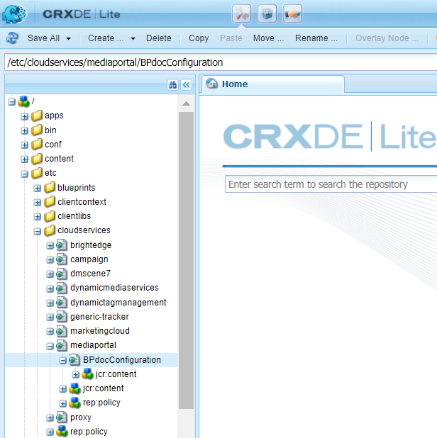

# Konfigurera AEM Assets med varumärkesportalen {#configure-integration-65}

Adobe Experience Manager (AEM) Assets konfigureras med Brand Portal via Adobe Developer Console, som anskaffar en IMS-token för auktorisering av din varumärksportal.

>[!NOTE]
>
>Konfigurering av AEM Assets med varumärkesportalen via Adobe Developer Console stöds på AEM 6.5.4.0 och senare.
>
>Tidigare konfigurerades varumärkesportalen i Classic UI via äldre OAuth Gateway, som använder JWT-tokenutbyte för att erhålla en IMS Access-token för auktorisering.
>
>Konfiguration via äldre OAuth stöds inte längre från 6 april 2020 och har ändrats till att konfigureras via Adobe Developer Console.

>[!TIP]
>
>***Endast för befintliga kunder***
>
>Vi rekommenderar att du fortsätter använda den befintliga äldre OAuth Gateway-konfigurationen. Om du får problem med äldre OAuth Gateway-konfiguration tar du bort den befintliga konfigurationen och skapar en ny konfiguration via Adobe Developer Console.

I den här hjälpen beskrivs följande två användningsområden:
* [Ny konfiguration](#configure-new-integration-65): Om du är en ny Brand Portal-användare och vill konfigurera AEM Assets författarinstans med Brand Portal kan du skapa en ny konfiguration på Adobe Developer Console.
* [Uppgraderingskonfiguration](#upgrade-integration-65): Om du är en befintlig Brand Portal-användare med din AEM Assets-författarinstans konfigurerad med Brand Portal på äldre OAuth Gateway rekommenderar vi att du tar bort de befintliga konfigurationerna och skapar en ny konfiguration på Adobe Developer Console.

Informationen baseras på antagandet att alla som läser den här hjälpen känner till följande tekniker:

* Installera, konfigurera och administrera Adobe Experience Manager- och AEM-paket.

* Använda operativsystemen Linux och Microsoft Windows.

## Förutsättningar {#prerequisites}

Du behöver följande för att konfigurera AEM Assets med varumärkesportalen:

* En AEM Assets-författarinstans som är igång och körs med senaste Service Pack.
* Varumärkesportalens klientorganisations-URL.
* En användare med systemadministratörsbehörighet på IMS-organisationen för varumärkesportalens klient.

[Hämta och installera AEM 6.5](#aemquickstart)

[Hämta och installera det senaste AEM Service Pack](#servicepack)

### Hämta och installera AEM 6.5 {#aemquickstart}

Vi rekommenderar att du har AEM 6.5 för att skapa en AEM-författarinstans. Om du inte har AEM installerat och körs hämtar du det från följande platser:

* Om du redan är AEM-kund hämtar du AEM 6.5 från [Adobes licenswebbplats](http://licensing.adobe.com).

* Om du är Adobe-partner kan du beställa AEM 6.5 via [Adobe Partner Training Program](https://adobe.allegiancetech.com/cgi-bin/qwebcorporate.dll?idx=82357Q) .

När du har laddat ned AEM finns instruktioner om hur du konfigurerar en AEM-författarinstans i [Distribuera och underhålla](https://helpx.adobe.com/experience-manager/6-5/sites/deploying/using/deploy.html#defaultlocalinstall).

### Hämta och installera AEM Senaste Service Pack {#servicepack}

Detaljerade instruktioner finns i

* [Versionsinformation om AEM 6.5 Service Pack](https://helpx.adobe.com/experience-manager/6-5/release-notes/sp-release-notes.html)

**Kontakta kundtjänst** om du inte hittar det senaste AEM-paketet eller Service Pack.

## Skapa en konfiguration {#configure-new-integration-65}

Konfigurationen av AEM Assets med varumärkesportalen kräver konfigurationer både i AEM Assets, författarinstansen av och i Adobe Developer Console.

1. Skapa ett IMS-konto och generera ett offentligt certifikat (offentlig nyckel) i författarinstansen av AEM Assets.

1. Skapa ett projekt för din varumärksportal (organisation) i Adobe Developer Console.

1. Under projektet konfigurerar du ett API med den offentliga nyckeln för att skapa en JWT-anslutning (Service Account).

1. Hämta tjänstkontots autentiseringsuppgifter och information om JWT-nyttolast.

1. Konfigurera IMS-kontot med hjälp av tjänstkontots autentiseringsuppgifter och JWT-nyttolast i författarinstansen av AEM Assets.

1. Konfigurera molntjänsten Brand Portal med IMS-kontot och slutpunkten för varumärkesportalen (organisations-URL) i författarinstansen av AEM Assets.

1. Testa konfigurationen genom att publicera en resurs från AEM Assets författarinstans på varumärkesportalen.

>[!NOTE]
>
>En innehavare av en varumärksportal får endast konfigureras med en instans av AEM Assets författare.
>
>Konfigurera inte en innehavare av en varumärksportal med flera instanser av AEM Assets-författare.

Utför följande steg i den listade sekvensen om du konfigurerar AEM Assets med varumärkesportalen för första gången:
1. [Hämta ett offentligt certifikat](#public-certificate)
1. [Skapa JWT-anslutning (Service Account)](#createnewintegration)
1. [Konfigurera IMS-konto](#create-ims-account-configuration)
1. [Konfigurera molntjänsten](#configure-the-cloud-service)
1. [Testa konfigurationen](#test-integration)

### Skapa IMS-konfigurationen {#create-ims-configuration}

IMS-konfigurationen autentiserar varumärkesportalens klient med författarinstansen för AEM Assets.

IMS-konfigurationen har två steg:

* [Hämta ett offentligt certifikat](#public-certificate)
* [Konfigurera IMS-konto](#create-ims-account-configuration)

### Hämta ett offentligt certifikat {#public-certificate}

Med ett offentligt certifikat kan du autentisera din profil på Adobe Developer Console.

1. Logga in på AEM Assets författarinstans. Standardwebbadressen är
   `http:// localhost:4502/aem/start.html`
1. From the **Tools**  panel, navigate to **[!UICONTROL Security]** > **[!UICONTROL Adobe IMS Configurations]**.

   

1. Klicka på på sidan Adobe IMS-konfigurationer **[!UICONTROL Create]**.

1. Du omdirigeras till **[!UICONTROL Adobe IMS Technical Account Configuration]** sidan. By default, the **Certificate** tab opens.

   Välj molnlösning **[!UICONTROL Adobe Brand Portal]**.

1. Markera kryssrutan **[!UICONTROL Create new certificate]** och ange ett **alias** för certifikatet. Aliaset används som namn på dialogrutan.

1. Klicka på **[!UICONTROL Create certificate]**. Klicka sedan på **[!UICONTROL OK]** i dialogrutan för att generera det offentliga certifikatet.

   

1. Click **[!UICONTROL Download Public Key]** and save the certificate (.crt) file on your machine.

   Certifikatfilen används i ytterligare steg för att konfigurera API:t för din innehavare av varumärkesportalen och generera autentiseringsuppgifter för tjänstkontot i Adobe Developer Console.

   

1. Klicka på **[!UICONTROL Next]**.

   På fliken **Konto** skapar du Adobe IMS-kontot, men för det behöver du inloggningsuppgifterna för tjänstkontot som genereras i Adobe Developer Console. Håll den här sidan öppen tills vidare.

   Öppna en ny flik och [skapa en JWT-anslutning i Adobe Developer Console](#createnewintegration) för att hämta autentiseringsuppgifter och JWT-nyttolast för konfigurering av IMS-kontot.

### Skapa JWT-anslutning (Service Account) {#createnewintegration}

I Adobe Developer Console konfigureras projekt och API:er på organisationsnivå (varumärksportal-klientnivå). När du konfigurerar ett API skapas en JWT-anslutning (Service Account) i Adobe Developer Console. Det finns två metoder för att konfigurera API, genom att generera ett nyckelpar (privata och offentliga nycklar) eller genom att överföra en offentlig nyckel. Om du vill konfigurera AEM Assets författarinstans med Brand Portal måste du generera ett offentligt certifikat (offentlig nyckel) i författarinstansen av AEM Assets och skapa autentiseringsuppgifter i Adobe Developer Console genom att överföra den offentliga nyckeln. Den här offentliga nyckeln används för att konfigurera API för den valda Brand Portal-organisationen och genererar autentiseringsuppgifter och JWT-nyttolast för tjänstkontot. Dessa autentiseringsuppgifter används vidare för att konfigurera IMS-kontot i författarinstansen av AEM Assets. När IMS-kontot har konfigurerats kan du konfigurera molntjänsten Brand Portal i AEM Assets författarinstansen.

Utför följande steg för att generera autentiseringsuppgifter för tjänstkontot och JWT-nyttolast:

1. Logga in på Adobe Developer Console med systemadministratörsbehörighet för IMS-organisationen (innehavaren av varumärkesportalen). Standardwebbadressen är

   [https://www.adobe.com/go/devs_console_ui](https://www.adobe.com/go/devs_console_ui)

   >[!NOTE]
   >
   >Se till att du har valt rätt IMS-organisation (innehavaren av varumärkesportalen) i listrutan (organisationslistan) i det övre högra hörnet.

1. Klicka på **[!UICONTROL Create new project]**. Ett tomt projekt skapas för din organisation.

   Klicka **[!UICONTROL Edit project]** för att uppdatera **[!UICONTROL Project Title]** och **[!UICONTROL Description]** klicka sedan på **[!UICONTROL Save]**.

   

1. Klicka på fliken Projektöversikt **[!UICONTROL Add API]**.

   

1. I fönstret Lägg till ett API väljer du **[!UICONTROL AEM Brand Portal]** och klickar **[!UICONTROL Next]**.

   Se till att du har tillgång till tjänsten AEM Brand Portal.

1. Klicka på i fönstret Konfigurera API **[!UICONTROL Upload your public key]**. Klicka sedan på **[!UICONTROL Select a File]** och överför det publika certifikatet (.crt-filen) som du har hämtat i avsnittet [Hämta publika certifikat](#public-certificate) .

   Klicka på **[!UICONTROL Next]**.

   

1. Verifiera det offentliga certifikatet och klicka på **[!UICONTROL Next]**.

1. Select the default product profile **[!UICONTROL Assets Brand Portal]** and click **[!UICONTROL Save configuration]**.

   

1. När API:t har konfigurerats omdirigeras du till API-översikten. Klicka på i den vänstra navigeringen under **[!UICONTROL Credentials]** på **[!UICONTROL Service Account (JWT)]**.

   >[!NOTE]
   >
   >Du kan visa autentiseringsuppgifterna och utföra andra åtgärder (generera JWT-tokens, kopiera autentiseringsuppgifter, hämta klienthemlighet o.s.v.) efter behov.

1. Kopiera från **[!UICONTROL Client Credentials]** fliken **[!UICONTROL client ID]**.

   Klicka på **[!UICONTROL Retrieve Client Secret]** och kopiera **[!UICONTROL client secret]**.

   

1. Navigate to the **[!UICONTROL Generate JWT]** tab and copy the **[!UICONTROL JWT Payload]**.

Nu kan du använda klient-ID (API-nyckel), klienthemlighet och JWT-nyttolast för att [konfigurera IMS-kontot](#create-ims-account-configuration) i AEM Assets molninstansen.

<!--
### Create Adobe I/O integration {#createnewintegration}

Adobe I/O integration generates API Key, Client Secret, and Payload (JWT) which is required in setting up the IMS Account configurations.

1. Login to Adobe I/O Console with system administrator privileges on the IMS organization of the Brand Portal tenant.

   Default URL: [https://console.adobe.io/](https://console.adobe.io/) 

1. Click **[!UICONTROL Create Integration]**.

1. Select **[!UICONTROL Access an API]**, and click **[!UICONTROL Continue]**.

   

1. Create a new integration page opens. 
   
   Select your organization from the drop-down list.

   In **[!UICONTROL Experience Cloud]**, Select **[!UICONTROL AEM Brand Portal]** and click **[!UICONTROL Continue]**. 

   If the Brand Portal option is disabled for you, ensure that you have selected correct organization from the drop-down box above the **[!UICONTROL Adobe Services]** option. If you do not know your organization, contact your administrator.

   

1. Specify a name and description for the integration. Click **[!UICONTROL Select a File from your computer]** and upload the `AEM-Adobe-IMS.crt` file downloaded in the [obtain public certificates](#public-certificate) section.

1. Select the profile of your organization. 

   Or, select the default profile **[!UICONTROL Assets Brand Portal]** and click **[!UICONTROL Create Integration]**. The integration is created.

1. Click **[!UICONTROL Continue to integration details]** to view the integration information. 

   Copy the **[!UICONTROL API Key]** 
   
   Click **[!UICONTROL Retrieve Client Secret]** and copy the Client Secret key.

   

1. Navigate to **[!UICONTROL JWT]** tab, and copy the **[!UICONTROL JWT payload]**.

   The API Key, Client Secret key, and JWT payload information will be used to create IMS account configuration.
-->

### Skapa en konfiguration för IMS-kontot {#create-ims-account-configuration}

Kontrollera att du har utfört följande steg:

* [Hämta ett offentligt certifikat](#public-certificate)
* [Skapa JWT-anslutning (Service Account)](#createnewintegration)

Utför följande steg för att konfigurera det IMS-konto som du har skapat i [erhålla ett offentligt certifikat](#public-certificate).

1. Öppna IMS-konfigurationen och gå till **[!UICONTROL Accounts]** fliken. Du höll sidan öppen medan du [hämtade ett offentligt certifikat](#public-certificate).

1. Ange en **[!UICONTROL Title]** för IMS-kontot.

   Ange URL:en [https://ims-na1.adobelogin.com/](https://ims-na1.adobelogin.com/) i **[!UICONTROL Authorization Server]**.

   Klistra in klient-ID i API-nyckel, klienthemlighet och JWT-nyttolast som du kopierade när du [skapade JWT-anslutningen](#createnewintegration).

   Klicka på **[!UICONTROL Create]**.

   IMS-kontot är konfigurerat.

   

1. Markera IMS-konfigurationen och klicka på **[!UICONTROL Check Health]**.

   Klicka **[!UICONTROL Check]** i dialogrutan. När konfigurationen är klar visas ett meddelande om att *token har hämtats*.

   

>[!CAUTION]
>
>Du får bara ha en IMS-konfiguration. Skapa inte flera IMS-konfigurationer.
>
>Kontrollera att IMS-konfigurationen klarar hälsokontrollen. Om konfigurationen inte godkänns i hälsokontrollen är den ogiltig. Du måste ta bort den och skapa en ny, giltig konfiguration.

### Konfigurera molntjänsten{#configure-the-cloud-service}

Så här skapar du molntjänsten Brand Portal:

1. Logga in på AEM Assets författarinstans.

1. From the **Tools**  panel, navigate to **[!UICONTROL Cloud Services]** > **[!UICONTROL AEM Brand Portal]**.

1. Klicka på **[!UICONTROL Create]** på sidan Varumärksportal-konfigurationer.

1. Ange en **[!UICONTROL Title]** för konfigurationen.

   Välj den IMS-konfiguration som du skapade när du [konfigurerade IMS-kontot](#create-ims-account-configuration).

   In the **[!UICONTROL Service URL]**, enter your Brand Portal tenant (organization) URL.

   

1. Klicka på **[!UICONTROL Save and Close]**. Molnkonfigurationen har skapats. Din AEM Assets-författarinstans har nu konfigurerats med innehavaren av varumärkesportalen.

### Testa konfigurationen {#test-integration}

Utför följande steg för att validera konfigurationen:

1. Logga in på din AEM Assets-molninstans.

1. From the **Tools**  panel, navigate to **[!UICONTROL Deployment]** > **[!UICONTROL Replication]**.

   

1. Klicka på på sidan Replikering **[!UICONTROL Agents on author]**.

   

1. Fyra replikeringsagenter skapas för varje klientorganisation.

   Leta reda på replikeringsagenterna för din varumärksportal-klient.

   Klicka på replikeringsagentens URL.

   

   >[!NOTE]
   >
   >Replikeringsagenterna arbetar parallellt och delar jobbdistributionen jämnt, vilket ökar publiceringshastigheten fyra gånger den ursprungliga hastigheten. När molntjänsten har konfigurerats krävs ingen ytterligare konfiguration för att aktivera de replikeringsagenter som aktiveras som standard för att aktivera parallell publicering av flera resurser.

1. Kontrollera anslutningen mellan AEM Assets och varumärkesportalen genom att klicka på **[!UICONTROL Test Connection]**.

   

   Ett meddelande visas längst ned på sidan om att testpaketet har levererats.

   

1. Verifiera testresultaten för alla fyra replikeringsagenterna en i en.

   >[!NOTE]
   >
   >Inaktivera inte någon av replikeringsagenterna. Det kan leda till att replikeringen av vissa resurser misslyckas.

Din AEM Assets-författarinstans har konfigurerats med varumärkesportalen. Nu kan du:

* [Publicera resurser från AEM Assets till varumärkesportalen](../assets/brand-portal-publish-assets.md)
* [Publicera mappar från AEM Assets till varumärkesportalen](../assets/brand-portal-publish-folder.md)
* [Publicera samlingar från AEM Assets till varumärkesportalen](../assets/brand-portal-publish-collection.md)
* [Konfigurera Resurshantering](https://docs.adobe.com/content/help/en/experience-manager-brand-portal/using/asset-sourcing-in-brand-portal/brand-portal-asset-sourcing.html) så att användarna på varumärkesportalen kan bidra och publicera resurser på AEM Assets.

## Uppgraderingskonfiguration {#upgrade-integration-65}

Utför följande steg i den listade sekvensen för att uppgradera befintliga konfigurationer:
1. [Verifiera jobb som körs](#verify-jobs)
1. [Ta bort befintliga konfigurationer](#delete-existing-configuration)
1. [Skapa en konfiguration](#configure-new-integration-65)

### Verifiera jobb som körs {#verify-jobs}

Kontrollera att inget publiceringsjobb körs på AEM Assets författarinstans innan du gör några ändringar. Därför kan du verifiera alla fyra replikeringsagenterna och se till att köerna är tomma.

1. Logga in på AEM Assets författarinstans.

1. From the **Tools**  panel, navigate to **[!UICONTROL Deployment]** > **[!UICONTROL Deployment Replication]**.

1. Klicka på på sidan Replikering **[!UICONTROL Agents on author]**.

   

1. Leta reda på replikeringsagenterna för din varumärksportal-klient.

   Kontrollera att **kön är inaktiv** för alla replikeringsagenter. Inget publiceringsjobb är aktivt.

   

### Ta bort befintliga konfigurationer {#delete-existing-configuration}

Du måste köra följande checklista när du tar bort befintliga konfigurationer.
* Ta bort alla fyra replikeringsagenter
* Ta bort molntjänst
* Ta bort MAC-användare

1. Logga in på författarinstansen av AEM Assets och öppna CRX Lite som administratör. Standardwebbadressen är

   `http:// localhost:4502/crx/de/index.jsp`

1. Navigera till `/etc/replications/agents.author` och ta bort alla fyra replikeringsagenterna för din varumärksportal-klient.

   

1. Navigera till `/etc/cloudservices/mediaportal` och ta bort **Cloud Servicens konfiguration**.

   

1. Navigera till `/home/users/mac` och ta bort **MAC-användaren** för din varumärksportal.

   

Nu kan du [skapa konfiguration](#configure-new-integration-65) via Adobe Developer Console på din AEM 6.5-författarinstans.

<!--
   Comment Type: draft

   <li> </li>
   -->

<!--
   Comment Type: draft

   <li>Step text</li>
   -->

