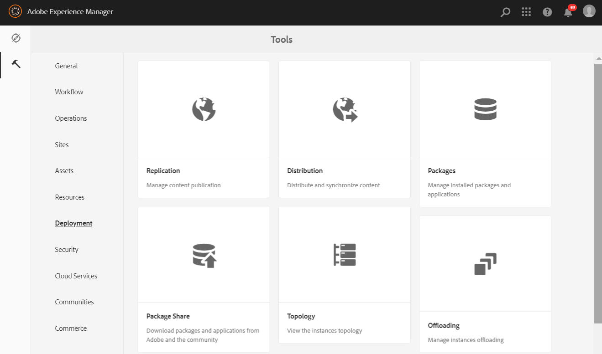

# Konfigurera AEM Assets med varumärkesportalen {#configure-integration-65}

Adobe Experience Manager (AEM) Assets konfigureras med varumärkesportalen via Adobe I/O, som hämtar en IMS-token för auktorisering av varumärkesportalens klient.

>[!NOTE]
>
>Konfigurering av AEM Assets med varumärkesportalen via Adobe I/O stöds i AEM 6.5.4.0 och senare.
>
>Tidigare konfigurerades varumärkesportalen i Classic UI via äldre OAuth Gateway, som använder JWT-tokenutbyte för att erhålla en IMS Access-token för auktorisering.
>
>Konfiguration via äldre OAuth stöds inte längre från 6 april 2020 och har ändrats till att konfigureras via Adobe I/O.

>[!TIP]
>
>***Endast för befintliga kunder***
>
>Vi rekommenderar att du fortsätter använda den befintliga äldre OAuth Gateway-konfigurationen. Om du får problem med äldre OAuth Gateway-konfiguration tar du bort den befintliga konfigurationen och skapar en ny konfiguration via Adobe I/O.

I den här hjälpen beskrivs följande två användningsområden:
* [Ny konfiguration](#configure-new-integration-65): Om du är en ny Brand Portal-användare och vill konfigurera AEM Assets-författarinstansen med Brand Portal kan du skapa en ny konfiguration på Adobe I/O.
* [Uppgraderingskonfiguration](#upgrade-integration-65): Om du är en befintlig Brand Portal-användare med en AEM Assets-författarinstans konfigurerad med Brand Portal i äldre OAuth Gateway rekommenderar vi att du tar bort de befintliga konfigurationerna och skapar en ny konfiguration på Adobe I/O.

Informationen baseras på antagandet att alla som läser den här hjälpen känner till följande tekniker:

* Installera, konfigurera och administrera Adobe Experience Manager- och AEM-paket

* Använda Linux och Microsoft Windows

## Förutsättningar {#prerequisites}

Du behöver följande för att konfigurera AEM Assets med varumärkesportalen:

* En AEM Assets-författarinstans som är igång och körs med senaste Service Pack.
* Varumärkesportalens klientorganisations-URL.
* En användare med systemadministratörsbehörighet på IMS-organisationen för varumärkesportalens klient.

[Hämta och installera AEM 6.5](#aemquickstart)

[Hämta och installera det senaste AEM Service Pack](#servicepack)

### Hämta och installera AEM 6.5 {#aemquickstart}

Vi rekommenderar att du har AEM 6.5 för att skapa en AEM-författarinstans. Om du inte har AEM installerat och körs hämtar du det från följande platser:

* Om du redan är AEM-kund hämtar du AEM 6.5 från [Adobes licenswebbplats](http://licensing.adobe.com).

* Om du är Adobe-partner kan du beställa AEM 6.5 via [Adobe Partner Training Program](https://adobe.allegiancetech.com/cgi-bin/qwebcorporate.dll?idx=82357Q) .

När du har laddat ned AEM finns instruktioner om hur du konfigurerar en AEM-författarinstans i [Distribuera och underhålla](https://helpx.adobe.com/experience-manager/6-5/sites/deploying/using/deploy.html#defaultlocalinstall).

### Hämta och installera AEM Senaste Service Pack {#servicepack}

Detaljerade instruktioner finns i

* [Versionsinformation om AEM 6.5 Service Pack](https://helpx.adobe.com/experience-manager/6-5/release-notes/sp-release-notes.html)

**Kontakta kundtjänst** om du inte hittar det senaste AEM-paketet eller Service Pack.

## Skapa en konfiguration {#configure-new-integration-65}

Utför följande steg i den listade sekvensen om du konfigurerar AEM Resurser med varumärkesportalen för första gången:
1. [Hämta ett offentligt certifikat](#public-certificate)
1. [Skapa en Adobe I/O-integrering](#createnewintegration)
1. [Skapa en konfiguration för IMS-kontot](#create-ims-account-configuration)
1. [Konfigurera molntjänsten](#configure-the-cloud-service)
1. [Testa konfigurationen](#test-integration)

### Skapa IMS-konfigurationen {#create-ims-configuration}

IMS-konfigurationen autentiserar varumärkesportalens klient med författarinstansen för AEM Assets.

IMS-konfigurationen har två steg:

* [Hämta ett offentligt certifikat](#public-certificate)
* [Skapa en konfiguration för IMS-kontot](#create-ims-account-configuration)

### Hämta ett offentligt certifikat {#public-certificate}

Med ett offentligt certifikat kan du autentisera din profil på Adobe I/O.

1. Logga in på din AEM Assets-författarinstansStandard-URL: http:// localhost:4502/aem/start.html
1. Gå till **[!UICONTROL Security]** >> **[!UICONTROL Adobe IMS Configurations]** från panelen **Tools** .

   

1. Sidan Adobe IMS-konfigurationer öppnas.

   Klicka på **[!UICONTROL Create]**.

   Sidan **[!UICONTROL Adobe IMS Technical Account Configuration]** öppnas.

1. Fliken **Certifikat** öppnas som standard.

   Välj **[!UICONTROL Adobe Brand Portal]** i **Molnlösning**,

1. Markera kryssrutan **[!UICONTROL Create new certificate]** och ange ett **alias** för certifikatet. Aliaset används som namn på dialogrutan.

1. Klicka på **[!UICONTROL Create certificate]**. En dialogruta visas. Klicka på **[!UICONTROL OK]** för att generera det offentliga certifikatet.

   

1. Klicka på **[!UICONTROL Download Public Key]** och spara certifikatfilen *AEM-Adobe-IMS.crt* på datorn. Certifikatfilen används för att [skapa Adobe I/O-integreringen](#createnewintegration).

   

1. Klicka på **[!UICONTROL Next]**.

   Du skapar Adobe IMS-kontot på fliken **Konto**, men för det behöver du integreringsinformationen. Håll den här sidan öppen tills vidare.

   Öppna en ny flik och [skapa Adobe I/O-integreringen](#createnewintegration) för att få tillgång till integreringsinformationen för IMS-kontokonfigurationerna.

### Skapa en Adobe I/O-integrering{#createnewintegration}

Adobe I/O-integreringen genererar en API-nyckel, en klienthemlighet och en nyttolast (JWT), som krävs för att konfigurera IMS-kontokonfigurationer.

1. Logga in på konsolen Adobe I/O med systemadministratörsbehörighet på IMS-organisationen för varumärkesportalens klient.

   Standard-URL: [https://console.adobe.io/](https://console.adobe.io/)

1. Klicka på **[!UICONTROL Create Integration]**.

1. Markera **[!UICONTROL Access an API]** och klicka på **[!UICONTROL Continue]**.

   

1. Sidan Skapa en ny integrering öppnas.

   Välj din organisation i listrutan.

   Välj **[!UICONTROL AEM Brand Portal]** och klicka på **[!UICONTROL Continue]** i **[!UICONTROL Experience Cloud]**.

   Kontrollera att du har valt rätt organisation i listrutan ovanför alternativet **[!UICONTROL Adobe Services]** om alternativet Varumärkesportal är inaktiverat. Kontakta administratören om du inte känner till din organisation.

   

1. Ange ett namn och en beskrivning för integrationen. Klicka på **[!UICONTROL Select a File from your computer]** och överför filen `AEM-Adobe-IMS.crt` som laddades ner under [Hämta ett offentligt certifikat](#public-certificate) .

1. Välj organisationens profil.

   Du kan också markera standardprofilen **[!UICONTROL Assets Brand Portal]** och klicka på **[!UICONTROL Create Integration]**. Integreringen skapas.

1. Klicka på **[!UICONTROL Continue to integration details]** för att visa integreringsinformationen.

   Kopiera **[!UICONTROL API Key]**

   Klicka på **[!UICONTROL Retrieve Client Secret]** och kopiera nyckeln för klienthemligheten.

   

1. Gå till fliken **[!UICONTROL JWT]** och kopiera **[!UICONTROL JWT payload]**.

   API-nyckeln, nyckeln för klienthemligheten och informationen för JWT-nyttolasten används för att skapa en IMS-kontokonfiguration.

### Skapa en konfiguration för IMS-kontot {#create-ims-account-configuration}

Kontrollera att du har utfört följande steg:

* [Hämta ett offentligt certifikat](#public-certificate)
* [Skapa en Adobe I/O-integrering](#createnewintegration)

**Så här skapar du en IMS-kontokonfiguration:**

1. Öppna sidan IMS-konfiguration och fliken **[!UICONTROL Accounts]**. Du lämnade den här sidan öppen i slutet av avsnittet [Hämta ett offentligt certifikat ](#public-certificate).

1. Ange en **[!UICONTROL Title]** för IMS-kontot.

   Ange URL:en [https://ims-na1.adobelogin.com/](https://ims-na1.adobelogin.com/) i **[!UICONTROL Authorization Server]**.

   Klistra in API-nyckeln, klienthemligheten och JWT-nyttolasten som du kopierade i slutet av [Skapa en Adobe I/O-integrering](#createnewintegration).

   Klicka på **[!UICONTROL Create]**.

   Integreringen skapas.

   

1. Markera IMS-konfigurationen och klicka på **[!UICONTROL Check Health]**. En dialogruta visas.

   Klicka på **[!UICONTROL Check]**. Meddelandet *Token har hämtats* visas när en anslutning har skapats.

   

>[!CAUTION]
>
>Du får bara ha en IMS-konfiguration. Skapa inte flera IMS-konfigurationer.
>
>Kontrollera att IMS-konfigurationen klarar hälsokontrollen. Om konfigurationen inte godkänns i hälsokontrollen är den ogiltig. Du måste ta bort den och skapa en ny, giltig konfiguration.

### Konfigurera molntjänsten{#configure-the-cloud-service}

Gör så här för att skapa molntjänstkonfigurationen för varumärkesportalen:

1. Logga in på din AEM Assets-författarinstans

   Standard-URL: http:// localhost:4502/aem/start.html
1. Gå till **[!UICONTROL Cloud Services >> AEM Brand Portal]** från panelen **Tools** .

   Sidan Konfigurationer för varumärkesportalen öppnas.

1. Klicka på **[!UICONTROL Create]**.

1. Ange en **[!UICONTROL Title]** för konfigurationen.

   Välj den IMS-konfiguration som du har skapat i steget [Skapa en konfiguration för IMS-kontot](#create-ims-account-configuration).

   Ange varumärkesportalens klientorganisations-URL i **[!UICONTROL Service URL]**.

   

1. Klicka på **[!UICONTROL Save and Close]**. Molnkonfigurationen har skapats. Din instans av AEM Assets-författaren är nu integrerad med innehavaren av varumärkesportalen.

### Testa konfigurationen {#test-integration}

1. Logga in på din AEM Assets-författarinstans

   Standard-URL: http:// localhost:4502/aem/start.html

1. Gå till **[!UICONTROL Deployment >> Replication]** från panelen **Tools** .

   

1. Replikeringssidan öppnas.

   Klicka på **[!UICONTROL Agents on author]**.

   

1. Fyra replikeringsagenter skapas för varje klientorganisation.

   Leta reda på replikeringsagenterna för din varumärksportal-klient.

   Klicka på replikeringsagentens URL.

   

   >[!NOTE]
   >
   >Replikeringsagenterna arbetar parallellt och delar jobbdistributionen jämnt, vilket ökar publiceringshastigheten fyra gånger den ursprungliga hastigheten. När molntjänsten har konfigurerats krävs ingen ytterligare konfiguration för att aktivera de replikeringsagenter som aktiveras som standard för att aktivera parallell publicering av flera resurser.

   >[!NOTE]
   >
   >Undvik att inaktivera någon av replikeringsagenterna eftersom det kan göra att replikeringen av vissa resurser misslyckas.

1. To verify the connection between AEM Assets author and Brand Portal, click **[!UICONTROL Test Connection]**.

   

1. Titta på testresultatens nedre del för att kontrollera att replikeringen lyckades.

   

   >[!NOTE]
   >
   >Replikeringsagenterna arbetar parallellt och delar jobbdistributionen jämnt, vilket ökar publiceringshastigheten fyra gånger den ursprungliga hastigheten. När molntjänsten har konfigurerats krävs ingen ytterligare konfiguration för att aktivera de replikeringsagenter som aktiveras som standard för att aktivera parallell publicering av flera resurser.

1. Verifiera testresultaten för alla fyra replikeringsagenterna en i en.

   >[!NOTE]
   >
   >Undvik att inaktivera någon av replikeringsagenterna eftersom det kan göra att replikeringen av vissa resurser misslyckas.

Varumärksportal har konfigurerats med din AEM Assets-författarinstans. Du kan nu:

* [Publicera resurser från AEM Assets till varumärkesportalen](../assets/brand-portal-publish-assets.md)
* [Publicera mappar från AEM Assets till varumärkesportalen](../assets/brand-portal-publish-folder.md)
* [Publicera samlingar från AEM Assets till varumärkesportalen](../assets/brand-portal-publish-collection.md)
* [Konfigurera Resurshantering](https://docs.adobe.com/content/help/en/experience-manager-brand-portal/using/asset-sourcing-in-brand-portal/brand-portal-asset-sourcing.html) så att användarna på varumärkesportalen kan bidra och publicera resurser till AEM Assets.

## Uppgraderingskonfiguration {#upgrade-integration-65}

Utför följande steg i den listade sekvensen för att uppgradera befintliga konfigurationer:
1. [Verifiera jobb som körs](#verify-jobs)
1. [Ta bort befintliga konfigurationer](#delete-existing-configuration)
1. [Skapa en konfiguration](#configure-new-integration-65)

### Verifiera jobb som körs {#verify-jobs}

Kontrollera att inget publiceringsjobb körs på AEM Assets-författarinstansen innan du gör några ändringar. För detta kan du verifiera alla fyra replikeringsagenterna och se till att kön är idealisk/tom.

1. Logga in på din AEM Assets-författarinstans

   Standard-URL: http:// localhost:4502/aem/start.html

1. Gå till **[!UICONTROL Deployment >> Replication]** från panelen **Tools** .

1. Replikeringssidan öppnas.

   Klicka på **[!UICONTROL Agents on author]**.

   

1. Leta reda på replikeringsagenterna för din varumärksportal-klient.

   Kontrollera att **kön är inaktiv** för alla replikeringsagenter. Inget publiceringsjobb är aktivt.

   

### Ta bort befintliga konfigurationer {#delete-existing-configuration}

Du måste köra följande checklista när du tar bort befintliga konfigurationer.
* Ta bort alla fyra replikeringsagenter
* Ta bort molntjänst
* Ta bort MAC-användare

1. Logga in på din AEM Assets-författarinstans och öppna CRX Lite som administratör.

   Standard-URL: http:// localhost:4502/crx/de/index.jsp

1. Navigera till `/etc/replications/agents.author` och ta bort alla fyra replikeringsagenterna för din varumärksportal-klient.

   

1. Navigera till `/etc/cloudservices/mediaportal` och ta bort **molntjänstkonfigurationen**.

   

1. Navigera till `/home/users/mac` och ta bort **MAC-användaren** för din varumärksportal.

   

Nu kan du [skapa konfiguration](#configure-new-integration-65) på din AEM 6.5-författarinstans på Adobe I/O.

<!--
   Comment Type: draft

   <li> </li>
   -->

<!--
   Comment Type: draft

   <li>Step text</li>
   -->

När replikeringen är klar kan du publicera resurser, mappar och samlingar på varumärkesportalen. Mer information finns i:

* [Publicera resurser på varumärkesportalen](/help/assets/brand-portal-publish-assets.md)
* [Publicera mappar på varumärkesportalen](/help/assets/brand-portal-publish-folder.md)
* [Publicera samlingar på varumärkesportalen](/help/assets/brand-portal-publish-collection.md)
