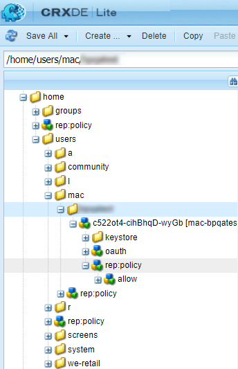

# Konfigurera AEM Assets med Brand Portal {#configure-integration-65}

| Version | Artikellänk |
| -------- | ---------------------------- |
| AEM as a Cloud Service | [Klicka här](https://experienceleague.adobe.com/docs/experience-manager-cloud-service/content/assets/brand-portal/configure-aem-assets-with-brand-portal.html?lang=en) |
| AEM 6.5 | Den här artikeln |

Med Adobe Experience Manager Assets Brand Portal kan ni publicera godkända varumärkesresurser från Adobe Experience Manager Assets till Brand Portal och distribuera dem till Brand Portal-användarna.

AEM Assets konfigureras med Brand Portal via Adobe Developer Console, som köper en kontotoken för Adobe Identity Management Services (IMS) för auktorisering av Brand Portal-klienten.

>[!NOTE]
>
>Det finns stöd för att konfigurera AEM Assets med Brand Portal via Adobe Developer Console i AEM 6.5.4.0 och senare.
>
>Tidigare konfigurerades Brand Portal via äldre OAuth Gateway, som använder JSON Web Token-utbyte för att erhålla en IMS Access-token för auktorisering.
>
>Konfiguration via äldre OAuth Gateway stöds inte längre från 6 april 2020 och har ändrats till Adobe Developer Console.

>[!TIP]
>
>***Endast för befintliga kunder***
>
>Adobe rekommenderar att du fortsätter att använda den befintliga gamla OAuth Gateway-konfigurationen. Om du får problem med äldre OAuth Gateway-konfiguration tar du bort den befintliga konfigurationen och skapar en konfiguration med Adobe Developer Console.

I den här hjälpen beskrivs följande två användningsfall:

* [Ny konfiguration](#configure-new-integration-65): Om du är en ny Brand Portal-användare och vill konfigurera din AEM Assets Author-instans med Brand Portal kan du skapa en konfiguration med hjälp av Adobe Developer Console.
* [Uppgradering, konfiguration](#upgrade-integration-65): Om du är en befintlig Brand Portal-användare som har en konfiguration på en äldre OAuth Gateway tar du bort den befintliga konfigurationen och skapar en konfiguration med Adobe Developer Console.

Informationen baseras på antagandet att alla som läser den här hjälpen känner till följande tekniker:

* Installera, konfigurera och administrera Adobe Experience Manager- och AEM.

* Använda Linux® och Microsoft® Windows.

## Förutsättningar {#prerequisites}

Du behöver följande för att konfigurera AEM Assets med varumärkesportalen:

* En instans av AEM Assets Author som körs med senaste Service Pack
* En Brand Portal tenant-URL
* En användare med systemadministratörsbehörighet för IMS-organisationen för Brand Portal-klienten

[Hämta och installera AEM 6.5](#aemquickstart)

[Hämta och installera det senaste AEM Service Pack](#servicepack)

### Hämta och installera AEM 6.5 {#aemquickstart}

Vi rekommenderar att AEM 6.5 konfigurerar en AEM Author-instans. Om du inte har AEM igång kan du hämta det från följande platser:

* Om du redan AEM kan du ladda ned AEM 6.5 från [Adobe licenswebbplats](https://licensing.adobe.com).

* Om du är Adobe-partner använder du [Adobe Partner Training Program](https://adobe.allegiancetech.com/cgi-bin/qwebcorporate.dll?idx=82357Q) att begära AEM 6.5.

När du har laddat ned AEM finns instruktioner om hur du konfigurerar en AEM Author-instans i [driftsätta och underhålla](https://experienceleague.adobe.com/docs/experience-manager-65/deploying/deploying/deploy.html#default-local-install).

### Hämta och installera AEM senaste Service Pack {#servicepack}

Detaljerade instruktioner finns i den aktuella [AEM 6.5 Service Pack versionsinformation](https://experienceleague.adobe.com/docs/experience-manager-65/release-notes/release-notes.html).

**Kontakta Adobe kundsupport** om du inte kan hitta det senaste AEM eller Service Pack.

## Skapa konfiguration {#configure-new-integration-65}

Konfigurationen av AEM Assets med Brand Portal kräver konfigurationer i både AEM Assets Author-instansen och Adobe Developer Console.

1. Skapa ett IMS-konto i AEM Assets och generera ett offentligt certifikat (offentlig nyckel).
1. Skapa ett projekt för din Brand Portal-klient (organisation) i Adobe Developer Console.
1. Under projektet konfigurerar du ett API med den offentliga nyckeln för att skapa en JWT-anslutning (Service Account).
1. Hämta tjänstkontots autentiseringsuppgifter och information om JWT-nyttolast.
1. I AEM Assets konfigurerar du IMS-kontot med tjänstkontots autentiseringsuppgifter och JWT-nyttolast.
1. I AEM Assets konfigurerar du Brand Portal molntjänst med hjälp av IMS-kontot och Brand Portal slutpunkt (organisations-URL).
1. Testa konfigurationen genom att publicera en resurs från AEM Assets till Brand Portal.

>[!NOTE]
>
>En AEM Assets Author-instans får endast konfigureras med en Brand Portal-klient.

Utför följande steg i den listade sekvensen om du konfigurerar AEM Assets med Brand Portal för första gången:

1. [Hämta ett offentligt certifikat](#public-certificate)
1. [Skapa JWT-anslutning (Service Account)](#createnewintegration)
1. [Konfigurera ett IMS-konto](#create-ims-account-configuration)
1. [Konfigurera molntjänst](#configure-the-cloud-service)
1. [Testa konfiguration](#test-integration)

### Skapa IMS-konfiguration {#create-ims-configuration}

IMS-konfigurationen autentiserar din AEM Assets Author-instans med Brand Portal-klienten.

IMS-konfigurationen har två steg:

* [Hämta ett offentligt certifikat](#public-certificate)
* [Konfigurera ett IMS-konto](#create-ims-account-configuration)

### Hämta offentligt certifikat {#public-certificate}

Den offentliga nyckeln (certifikatet) autentiserar din profil på Adobe Developer Console.

1. Logga in på din AEM Assets Author-instans. Standardwebbadressen är `http://localhost:4502/aem/start.html`.

1. Från **verktyg**  navigera till **[!UICONTROL Security]** > **[!UICONTROL Adobe IMS Configurations]**.

1. På sidan Adobe IMS Configurations klickar du på **[!UICONTROL Create]**. Den dirigeras om till **[!UICONTROL Adobe IMS Technical Account Configuration]** sida. Som standard är **Certifikat** -fliken öppnas.

1. Välj **[!UICONTROL Adobe Brand Portal]** i **[!UICONTROL Cloud Solution]** listruta.

1. Välj **[!UICONTROL Create new certificate]** kryssruta och ange en **alias** för den offentliga nyckeln. Aliaset används som namn på den offentliga nyckeln.

1. Klicka på **[!UICONTROL Create certificate]**. Klicka sedan på **[!UICONTROL OK]** för att generera den offentliga nyckeln.

   

1. Klicka på **[!UICONTROL Download Public Key]** och spara filen med den offentliga nyckeln (.crt) på datorn.

   Den offentliga nyckeln används senare för att konfigurera API:t för din Brand Portal-klient och generera autentiseringsuppgifter för tjänstkontot i Adobe Developer Console.

   

1. Klicka på **[!UICONTROL Next]**.

   I **Konto** skapas ett Adobe IMS-konto som kräver inloggningsuppgifterna för tjänstkontot som genereras i Adobe Developer Console. Håll den här sidan öppen tills vidare.

   Öppna en ny flik och [skapa en JWT-anslutning (Service Account) i Adobe Developer Console](#createnewintegration) så att du kan hämta autentiseringsuppgifter och JWT-nyttolast för att konfigurera IMS-kontot.

### Skapa tjänstkontoanslutningen (JWT) {#createnewintegration}

I Adobe Developer Console konfigureras projekt och API:er på Brand Portal klientnivå (organisationsnivå). När du konfigurerar ett API skapas en JWT-anslutning (Service Account). Det finns två metoder för att konfigurera API:t, genom att generera ett nyckelpar (privata och offentliga nycklar) eller genom att överföra en offentlig nyckel. Om du vill konfigurera AEM Assets med Brand Portal måste du skapa en offentlig nyckel (certifikat) i AEM Assets och skapa autentiseringsuppgifter i Adobe Developer Console genom att överföra den offentliga nyckeln. Dessa autentiseringsuppgifter krävs för att konfigurera IMS-kontot i AEM Assets. När IMS-kontot har konfigurerats kan du konfigurera Brand Portal molntjänst i AEM Assets.

Så här skapar du tjänstkontots autentiseringsuppgifter och JWT-nyttolast:

1. Logga in på Adobe Developer Console med systemadministratörsbehörighet för IMS-organisationen (Brand Portal tenant). Standardwebbadressen är [https://www.adobe.com/go/devs_console_ui](https://www.adobe.com/go/devs_console_ui).

   >[!NOTE]
   >
   >Kontrollera att du har valt rätt IMS-organisation (Brand Portal-klientorganisation) i listrutan (organisation) i det övre högra hörnet.

1. Klicka på **[!UICONTROL Create new project]**. Ett tomt projekt med ett systemgenererat namn skapas för din organisation.

   Klicka **[!UICONTROL Edit project]** så att du kan uppdatera **[!UICONTROL Project Title]** och **[!UICONTROL Description]** och klicka **[!UICONTROL Save]**.

1. I **[!UICONTROL Project overview]** flik, klicka **[!UICONTROL Add API]**.

1. I **[!UICONTROL Add an API window]**, markera **[!UICONTROL AEM Brand Portal]** och klicka **[!UICONTROL Next]**.

   Kontrollera att du har tillgång till tjänsten AEM Brand Portal.

1. I **[!UICONTROL Configure API]** fönster, klicka **[!UICONTROL Upload your public key]**. Klicka sedan på **[!UICONTROL Select a File]** och ladda upp den publika nyckeln (.crt-filen) som du har laddat ned i [hämta offentligt certifikat](#public-certificate) -avsnitt.

   Klicka på **[!UICONTROL Next]**.

   

1. Verifiera den offentliga nyckeln och klicka på **[!UICONTROL Next]**.

1. Välj **[!UICONTROL Assets Brand Portal]** som standardproduktprofil och klicka på **[!UICONTROL Save configured API]**.

   <!-- 
   In Brand Portal, a default profile is created for each organization. The Product Profiles are created in admin console for assigning users to groups (based on the roles and permissions). For configuration with Brand Portal, the OAuth token is created at organization level. Therefore, you must configure the default Product Profile for your organization. 
   -->

   

1. När API:t har konfigurerats omdirigeras du till API-översikten. Från vänster navigering under **[!UICONTROL Credentials]** klickar du på **[!UICONTROL Service Account (JWT)]** alternativ.

   >[!NOTE]
   >
   >Du kan visa autentiseringsuppgifterna och utföra åtgärder som att generera JWT-tokens, kopiera autentiseringsuppgifter och hämta klienthemlighet.

1. Från **[!UICONTROL Client Credentials]** -fliken, kopiera **[!UICONTROL client ID]**.

   Klicka **[!UICONTROL Retrieve Client Secret]** och kopiera **[!UICONTROL client secret]**.

   

1. Navigera till **[!UICONTROL Generate JWT]** och kopiera **[!UICONTROL JWT Payload]** information.

Du kan nu använda klient-ID (API-nyckel), klienthemlighet och JWT-nyttolast för att [konfigurera IMS-kontot](#create-ims-account-configuration) i AEM Assets.

<!--
### Create Adobe I/O integration {#createnewintegration}

Adobe I/O integration generates API Key, Client Secret, and Payload (JWT) which is required in setting up the IMS Account configurations.

1. Login to Adobe I/O Console with system administrator privileges on the IMS organization of the Brand Portal tenant.

   Default URL: [https://console.adobe.io/](https://console.adobe.io/) 

1. Click **[!UICONTROL Create Integration]**.

1. Select **[!UICONTROL Access an API]**, and click **[!UICONTROL Continue]**.

   

1. Create a new integration page opens. 
   
   Select your organization from the drop-down list.

   In **[!UICONTROL Experience Cloud]**, Select **[!UICONTROL AEM Brand Portal]** and click **[!UICONTROL Continue]**. 

   If the Brand Portal option is disabled for you, ensure that you have selected correct organization from the drop-down box above the **[!UICONTROL Adobe Services]** option. If you do not know your organization, contact your administrator.

   

1. Specify a name and description for the integration. Click **[!UICONTROL Select a File from your computer]** and upload the `AEM-Adobe-IMS.crt` file downloaded in the [obtain public certificates](#public-certificate) section.

1. Select the profile of your organization. 

   Or, select the default profile **[!UICONTROL Assets Brand Portal]** and click **[!UICONTROL Create Integration]**. The integration is created.

1. Click **[!UICONTROL Continue to integration details]** to view the integration information. 

   Copy the **[!UICONTROL API Key]** 
   
   Click **[!UICONTROL Retrieve Client Secret]** and copy the Client Secret key.

   

1. Navigate to **[!UICONTROL JWT]** tab, and copy the **[!UICONTROL JWT payload]**.

   The API Key, Client Secret key, and JWT payload information that is used to create IMS account configuration.
-->

### Konfigurera IMS-kontot {#create-ims-account-configuration}

Kontrollera att du redan har utfört följande steg:

* [Hämta ett offentligt certifikat](#public-certificate)
* [Skapa JWT-anslutning (Service Account)](#createnewintegration)

Så här konfigurerar du IMS-kontot:

1. Öppna IMS-konfigurationen och gå till **[!UICONTROL Account]** -fliken. Du höll sidan öppen medan [erhålla det offentliga certifikatet](#public-certificate).

1. Ange en **[!UICONTROL Title]** för IMS-kontot.

   I **[!UICONTROL Authorization Server]** anger du URL-adressen: [https://ims-na1.adobelogin.com/](https://ims-na1.adobelogin.com/).

   Ange klient-ID i **[!UICONTROL API key]** fält, **[!UICONTROL Client Secret]** och **[!UICONTROL Payload]** (JWT-nyttolast) som du har kopierat när [skapar tjänstkontoanslutningen (JWT)](#createnewintegration).

   Klicka på **[!UICONTROL Create]**.

   IMS-kontot är konfigurerat.

   

1. Välj IMS-kontokonfigurationen och klicka på **[!UICONTROL Check Health]**.

   Klicka **[!UICONTROL Check]** i dialogrutan. När konfigurationen är klar visas ett meddelande om att *Token har hämtats*.

   

>[!CAUTION]
>
>Du får bara ha en IMS-konfiguration.
>
>Kontrollera att IMS-konfigurationen klarar hälsokontrollen. Om konfigurationen inte godkänns i hälsokontrollen är den ogiltig. Ta bort den och skapa en annan giltig konfiguration.

### Konfigurera molntjänsten i Brand Portal {#configure-the-cloud-service}

1. Logga in på din AEM Assets Author-instans.

1. Från **verktyg**  navigera till **[!UICONTROL Cloud Services]** > **[!UICONTROL AEM Brand Portal]**.

1. På sidan Brand Portal Configurations klickar du på **[!UICONTROL Create]**.

1. Ange en **[!UICONTROL Title]** för konfigurationen.

   Välj den IMS-konfiguration som du har skapat när [konfigurera IMS-kontot](#create-ims-account-configuration).

   I **[!UICONTROL Service URL]** anger du din Brand Portal tenant-URL (organisation).

   

1. Klicka på **[!UICONTROL Save & Close]**. Molnkonfigurationen skapas.

   Din AEM Assets Author-instans har nu konfigurerats med Brand Portal-klienten.

### Testa och validera konfigurationen {#test-integration}

1. Logga in på din AEM Assets-molninstans.

1. Från **verktyg**  navigera till **[!UICONTROL Deployment]** > **[!UICONTROL Replication]**.

   

1. Klicka på **[!UICONTROL Agents on Author]**.

   

   Du kan se de fyra replikeringsagenterna som har skapats för din Brand Portal-klient.

   Leta reda på replikeringsagenterna för din Brand Portal-klient och klicka på replikeringsagentens URL.

   

   >[!NOTE]
   >
   >Replikeringsagenterna arbetar parallellt och delar jobbdistributionen på samma sätt, så att publiceringshastigheten ökar med fyra gånger den ursprungliga hastigheten. När molntjänsten har konfigurerats krävs ingen ytterligare konfiguration för att aktivera de replikeringsagenter som aktiveras som standard för att aktivera parallell publicering av flera resurser.

1. Kontrollera anslutningen mellan AEM Assets och Brand Portal genom att klicka på **[!UICONTROL Test Connection]** -ikon.

   

   Ett meddelande visas om att *testpaketet har levererats*.

   

1. Verifiera testresultaten för alla fyra replikeringsagenterna.

   >[!NOTE]
   >
   >Undvik att inaktivera någon av replikeringsagenterna eftersom det kan göra att replikeringen av resurserna (som körs i kö) misslyckas.
   >
   >Se till att alla fyra replikeringsagenterna är konfigurerade för att undvika timeout-fel. Se [felsöka problem vid parallell publicering till Brand Portal](https://experienceleague.adobe.com/docs/experience-manager-brand-portal/using/publish/troubleshoot-parallel-publishing.html#connection-timeout).
   >
   >Ändra inte några autogenererade inställningar.

Du kan nu:

* [Publicera material från AEM Assets till Brand Portal](../assets/brand-portal-publish-assets.md)
* [Publicera material från Brand Portal till AEM Assets](https://experienceleague.adobe.com/docs/experience-manager-brand-portal/using/asset-sourcing-in-brand-portal/brand-portal-asset-sourcing.html) - Resurshantering i Brand Portal
* [Publicera mappar från AEM Assets till Brand Portal](../assets/brand-portal-publish-folder.md)
* [Publicera samlingar från AEM Assets till varumärkesportalen](../assets/brand-portal-publish-collection.md)
* [Publicera förinställningar, scheman och fasetter på varumärkesportalen](https://experienceleague.adobe.com/docs/experience-manager-brand-portal/using/publish/publish-schema-search-facets-presets.html)
* [Publicera taggar på varumärkesportalen](https://experienceleague.adobe.com/docs/experience-manager-brand-portal/using/publish/brand-portal-publish-tags.html)

Se [Brand Portal-dokumentation](https://experienceleague.adobe.com/docs/experience-manager-brand-portal/using/home.html) för mer information.

## Uppgradering, konfiguration {#upgrade-integration-65}

Om du vill uppgradera dina befintliga konfigurationer till Adobe Developer Console gör du följande i den angivna sekvensen:

1. [Verifiera jobb som körs](#verify-jobs)
1. [Ta bort befintliga konfigurationer](#delete-existing-configuration)
1. [Skapa konfiguration](#configure-new-integration-65)

### Verifiera jobb som körs {#verify-jobs}

Kontrollera att inget publiceringsjobb körs på din AEM Assets Author-instans innan du gör några redigeringar. För det kan du kontrollera status för aktiva jobb på alla fyra replikeringsagenterna och se till att köerna är inaktiva.

1. Logga in på din AEM Assets Author-instans.

1. Från **verktyg**  navigera till **[!UICONTROL Deployment]** > **[!UICONTROL Deployment Replication]**.

1. Klicka på **[!UICONTROL Agents on Author]**.

   

1. Leta reda på replikeringsagenterna för din Brand Portal-klient.

   Se till att **Kön är inaktiv** för alla replikeringsagenter och inget publiceringsjobb är aktivt.

   

### Ta bort befintliga konfigurationer {#delete-existing-configuration}

Kör följande checklista när du tar bort befintliga konfigurationer:

* Ta bort alla fyra replikeringsagenter
* Ta bort Brand Portal molntjänst
* Ta bort Mac-användare

1. Logga in på din AEM Assets Author-instans och öppna CRX Lite som administratör. Standardwebbadressen är `http://localhost:4502/crx/de/index.jsp`.

1. Navigera till `/etc/replications/agents.author` och ta bort alla fyra replikeringsagenterna för din Brand Portal-klient.

   

1. Navigera till `/etc/cloudservices/mediaportal` och ta bort Brand Portal molntjänstkonfiguration.

   

1. Navigera till `/home/users/mac` och ta bort **Mac** av er Brand Portal-klient.

   

Nu kan du [skapa en konfiguration](#configure-new-integration-65) genom Adobe Developer Console på AEM 6.5 Author.

<!--
   Comment Type: draft

   <li> </li>
   -->

<!--
   Comment Type: draft

   <li>Step text</li>
   -->
