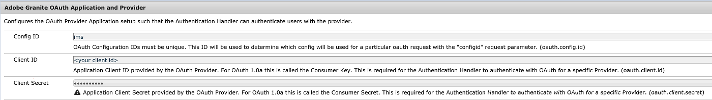

# Konfigurera Experience Manager Assets för Adobe Asset Link {#adobe-asset-link}

[Adobe Asset Link (AAL)](https://www.adobe.com/creativecloud/business/enterprise/adobe-asset-link.html) effektiviserar samarbetet mellan kreatörer och marknadsförare när det gäller att skapa innehåll. Den kopplar samman Adobe Experience Manager Assets med Creative Cloud datorprogram Adobe InDesign, Adobe Photoshop och Adobe Illustrator. På Adobe Asset Link-panelen kan kreativa användare komma åt och ändra innehåll som lagras i AEM Assets utan att lämna de kreativa program de är mest bekanta med.

Implementera följande uppgifter om du vill konfigurera Experience Manager Assets att användas med Asset Link. Använd administratörskontot för Experience Manager för att göra konfigurationen:

1. Installera paketen efter behov. Information finns i [krav](#prerequisites).

1. Konfigurera Experience Manager antingen [manuellt](#manual-configuration) eller använda [package](#configure-using-package).

1. Om du vill mappa användare med Creative Cloud-licens till användare med Experience Manager hanterar du [åtkomstkontroll](#user-access).

1. Skapa [anpassat frågeindex](#create-custom-index), konfigurera [FPO-återgivningar](/help/assets/configure-fpo-renditions.md) för InDesign, konfigurera [Integrering med Adobe Stock](/help/assets/aem-assets-adobe-stock.md)och konfigurera [visuell eller liknande sökning](https://experienceleague.adobe.com/docs/experience-manager-65/assets/using/search-assets.html#configvisualsearch).

## Förutsättningar och stöd för olika funktioner {#prerequisites}

Kontrollera att du har installerat rätt Service Pack och paket efter behov. Se följande krav för respektive Experience Manager-version och för specifika funktioner.

| Resurskapacitet | Experience Manager version och supportkrav |
|--- |--- |
| Resurslänk fungerar som standard | Experience Manager 6.5 och 6.5.2 eller senare.   Experience Manager 6.4.4 och 6.4.6 eller senare.   Adobe rekommenderar att du installerar de senaste [Experience Manager Service Pack (SP)](https://experienceleague.adobe.com/docs/experience-manager-release-information/aem-release-updates/aem-releases-updates.html) innan du använder AAL. |
| Resurslänk fungerar efter installation av ett paket | För Experience Manager 6.4.0 - 6.4.3 måste du installera [adobe-asset-link-support](https://experience.adobe.com/#/downloads/content/software-distribution/en/aem.html?package=/content/software-distribution/en/details.html/content/dam/aem/public/adobe/packages/cq640/featurepack/adobe-asset-link-support) paket. |
| Integrering med Adobe Stock | Experience Manager 6.4.2 eller senare |
| Visuell eller liknande sökning | Experience Manager 6.5.0 eller senare |

## Konfigurera Experience Manager med konfigurationspaketet {#configure-using-package}

Adobe rekommenderar att du installerar [adobe-asset-link-config](https://experience.adobe.com/#/downloads/content/software-distribution/en/aem.html?package=/content/software-distribution/en/details.html/content/dam/aem/public/adobe/packages/cq640/product/assets/adobe-asset-link-config) konfigurationspaket för att automatisera de flesta konfigurationsuppgifter, följt av några manuella åtgärder. Du kan också [konfigurera manuellt](#manual-configuration).

>[!CAUTION]
>
>Om din Experience Manager-instans är konfigurerad för användarinloggning med Adobe IMS-konton ska du inte använda konfigurationspaketet. Istället [konfigurera manuellt](#manual-configuration) din Experience Manager-instans.

1. Öppna Package Manager via webbgränssnittet i Experience Manager **[!UICONTROL Tools]** > **[!UICONTROL Deployment]** > **[!UICONTROL Package Share]**. Installera `adobe-asset-link-config` paket.

1. Öppna **[!UICONTROL Tools]** > **[!UICONTROL Operations]** > **[!UICONTROL Web Console]**. Sök **[!UICONTROL Adobe Granite OAuth IMS Provider]** och klicka för att redigera den.

   Ange följande egenskaper och spara ändringarna.

   * [!UICONTROL Group Mappings]: Lämna tomt om du inte vill. Mer information finns i [Gruppmappning](#group-mapping).
   * [!UICONTROL Organization]: Ange det organisations-ID som du använder i Adobe Admin Console. Mer information om organisations-ID:n finns i [Skapa användargrupp](https://helpx.adobe.com/enterprise/using/create-aal-user-group.html).

1. Sök **[!UICONTROL Adobe Granite Bearer Authentication Handler]** och klicka för att redigera den.

   Lägg till **[!UICONTROL InDesignAem2]** Klient-ID till **[!UICONTROL Allowed OAuth client ids]** konfigurationsegenskap.

## Konfigurera Experience Manager manuellt {#manual-configuration}

Konfigurera Experience Manager manuellt om du väljer att inte använda ett konfigurationspaket eller om din distribution i Experience Manager är konfigurerad för användarinloggning med Adobe IMS-konton.

Så här konfigurerar du Experience Manager manuellt:

1. Åtkomst till konfigurationshanteraren **[!UICONTROL Tools]** > **[!UICONTROL Operations]** > **[!UICONTROL Web Console]**. Välj **[!UICONTROL OSGi]** > **[!UICONTROL Configuration]** på menyn längst upp.

1. Leta reda på **[!UICONTROL Adobe Granite OAuth IMS Provider]** och klicka för att redigera den.

   Ange följande konfiguration och klicka på **[!UICONTROL Save]**.

   * [!UICONTROL Authorization Endpoint]: ` https://ims-na1.adobelogin.com/ims/authorize/v1`
   * [!UICONTROL Token Endpoint]: ` https://ims-na1.adobelogin.com/ims/token/v1`
   * [!UICONTROL Profile Endpoint]: ` https://ims-na1.adobelogin.com/ims/profile/v1`
   * [!UICONTROL Validation URL]: ` https://ims-na1.adobelogin.com/ims/validate_token/v1`
   * [!UICONTROL Organization]: Ange till organisations-ID i [Adobe Admin Console](https://adminconsole.adobe.com/).
   * [!UICONTROL Group Mappings]: Lämna tomt om du inte har ett specialfall. Mer information finns i [Gruppmappning](#group-mapping).

1. Sök **[!UICONTROL Adobe Granite Bearer Authentication Handler]** och klicka för att redigera den.

   Lägg till följande klient-ID i **[!UICONTROL Allowed OAuth client ids]** konfigurationsegenskap: `InDesignAem2, cc-europa-desktop_0_1, cc-europa-desktop_1_0, cc-europa-desktop_2_0, cc-europa-desktop_3_0, cc-europa-desktop_4_0, cc-europa-desktop_5_0, cc-europa-desktop_6_0, cc-europa-desktop_7_0, cc-europa-desktop_8_0, cc-europa-desktop_9_0, and cc-europa-desktop_10_0`.

   Lägga till `Client ID`, klicka `+`. Klicka **[!UICONTROL Save]** efter att alla ID har lagts till.

1. I **[!UICONTROL Adobe Granite OAuth Application and Provider]** konfiguration, inspektera befintlig **[!UICONTROL Adobe Granite OAuth Authentication Handler]** -instanser. Om du hittar en instans med `Config ID` värde för `ims`använder du den för instruktionerna i den här proceduren. I annat fall klickar du på `+` för att skapa en konfigurationsinstans. Ange följande egenskapsvärden och klicka på **[!UICONTROL Save]**.

   * [!UICONTROL Client ID]: Ändra inte
   * [!UICONTROL Client Secret]: Ändra inte
   * [!UICONTROL Config ID]: ` ims`
   * [!UICONTROL Scope]: `AdobeID, OpenID, read_organizations` (andra värden kan också finnas i konfigurationen)
   * [!UICONTROL Provider ID]: ` ims`
   * [!UICONTROL Create users]: ` Checked`
   * [!UICONTROL User ID Property]: `Email` för den nya konfigurationen. Annars ändras inte.

1. Leta reda på **[!UICONTROL Apache Jackrabbit Oak Default Sync Handler]** med **[!UICONTROL Sync Handler Name]** `ims` och klicka för att redigera den.

   Ange följande konfigurationsegenskaper och klicka på **[!UICONTROL Save]**.

   * [!UICONTROL User Expiration Time and User Membership Expiration]: Tid i minuter efter &#39;m&#39; utan utrymme. Till exempel: `15m` i 15 minuter. Mer information finns i [Gruppmappning](#group-mapping).
   * [!UICONTROL User auto membership]: Ändra inte
   * [!UICONTROL User Dynamic Membership]: ` Deslect`

1. Leta reda på **[!UICONTROL Adobe Granite OAuth Authentication Handler]** och klicka för att redigera den. Klicka utan att göra några ändringar **[!UICONTROL Save]**.

1. Om du vill justera den relativa prioriteten för hanteraren för innehavarautentisering går du till CRXDE `/apps/system/config`. Sök `com.adobe.granite.auth.oauth.impl.BearerAuthenticationHandler.config` och öppna konfigurationen. Lägg till i slutet `service.ranking=I"-10"`. Spara ändringarna.

   >[!NOTE]
   >
   >Varje begäran som autentiseras med en innehavartoken medför att tre anrop till Adobe IMS, användarsynkronisering och skapandet av en inloggningstoken görs i Experience Manager. För att komma över detta tar Adobe Asset Link emot inloggningstoken som returnerades från Experience Manager och skickar den med efterföljande förfrågningar. För att den här processen ska fungera måste den relativa prioriteten för hanteraren för innehavarautentisering justeras.

1. (Valfritt) Om Experience Manager-användarna har versaler eller blandat namn på domäner i sina e-post-ID:n väljer du **[!UICONTROL Change Locking User to Lower Case]** in **[!UICONTROL Adobe Granite ACP Platform Configs]** i Experience Manager Web Console.

## Ytterligare konfiguration efter migrering till affärsprofiler {#configure-migration-activity}

Adobe Asset Link-användare kan ansluta till Experience Manager för att tillåta IMS-inloggning från huvudorganisationen för Creative Cloud for Enterprise (CCE). Experience Manager använder klient-ID:n för att identifiera den tillåtna IMS-organisationen. Efter migrering till affärsprofiler måste du konfigurera klient-ID och hemlig nyckel för IMS-organisationen i Experience Manager för Bearer Authentication Handler. Mer information om affärsprofiler finns i [introducerar Adobe-profiler](https://helpx.adobe.com/enterprise/kb/introducing-adobe-profiles.html).

Ytterligare konfiguration krävs bara om du använder olika Adobe IMS-organisationer för Experience Manager och Creative Cloud för Enterprise (CCE) och en domänförtroenderelation upprättas mellan dessa två organisationer.

>[!NOTE]
>
>* Korrigeringen för företagsprofiler finns i Experience Manager 6.5.11.0.
>* Den befintliga konfigurationen fortsätter att fungera om du använder samma Adobe IMS-organisation som Experience Manager och CCE.

**Förutsättningar**

1. En Experience Manager-instans som är igång och som har Bearer Authentication konfigurerats för AAL.
1. Installera följande paket (Service Pack 11) på Experience Manager 6.5-instansen.

   [Ladda ned Experience Manager 6.5.11.0](https://experience.adobe.com/#/downloads/content/software-distribution/en/aem.html?package=/content/software-distribution/en/details.html/content/dam/aem/public/adobe/packages/cq650/servicepack/aem-service-pkg-6.5.11.zip)

1. Kontakt [!UICONTROL Customer Support] för att hämta klient-ID och hemlig nyckel för Bearer Authentication av din IMS-organisation.

Följande ytterligare konfigurationer krävs efter migrering till affärsprofiler:

1. I **[!UICONTROL Adobe Granite OAuth IMS Configuration Provider]** (`com.adobe.granite.auth.ims.impl.ImsConfigProviderImpl`), ange:

   * OAuth Configuration ID (`oauth.configmanager.ims.configid`): `ims` (Verifiera en gång, du kanske redan har det konfigurerat)

   * IMS-ägarentitet (`ims.owningEntity`): ID för IMS-organisation

   

1. Öppna **[!UICONTROL Bearer Authentication Handler]** konfigurera och lägga till klient-ID som hämtas från [!UICONTROL Customer Support] till listan över **[!UICONTROL Allowed OAuth client ids]**.

   

1. Öppna **[!UICONTROL Adobe Granite OAuth Application and Provider]** konfigurera och lägga till **[!UICONTROL Client ID]** och **[!UICONTROL Client Secret]** (Hemlig nyckel) från kundsupport.

   Se till att **[!UICONTROL Config ID]** fält (`oauth.config.id`) innehåller samma värde som anges i **[!UICONTROL OAuth configuration ID]** fält (`oauth.configmanager.ims.configid`) ovan.

   

1. Öppna **[!UICONTROL Adobe Granite IMS Cluster Exchange Token Preprocessor]** konfigurera och ange den till `enable`.

## Hantera användaråtkomstkontroll {#user-access}

I det här avsnittet beskrivs hur du hanterar användare och deras åtkomst till Experience Manager-databasen.

### Gruppmappning {#group-mapping}

Gruppmappning avgör hur grupper i Experience Manager motsvarar grupper i Adobe IMS. Det spelar en viktig roll när det gäller hur användare av Adobe Asset Link får åtkomst till Experience Manager Assets.

När det används med Adobe Asset Link delegerar Experience Manager användarhanteringsfunktioner till Adobe IMS. Användare och grupper som motsvarar användare och grupper i Adobe IMS skapas automatiskt. Dessutom synkroniseras användare, grupper och gruppmedlemskap i Experience Manager så att de matchar dem i Adobe IMS.

Tänk dig till exempel ett scenario där Adobe Asset Link-användare är medlemmar i Adobe IMS-gruppen assetlink-users. I det här fallet skapas en synkroniserad grupp med namnet assetlink-users i Experience Manager när en användare från den Adobe IMS-gruppen ansluter till Adobe Asset Link för första gången. Varje ny användare i Adobe IMS-gruppen läggs till i motsvarande grupp i Experience Manager när de ansluter till Experience Manager via Adobe Asset Link för första gången.

Grupper i Experience Manager som motsvarar och synkroniseras med grupper i Adobe IMS kan beviljas åtkomst direkt eller genom att de blir medlemmar i en annan grupp. Här är ett exempel på hur behörigheter kan hanteras.

Följande regler gäller för gruppmappningar i Experience Manager:

* Se till att **[!UICONTROL Group Mappings]** egenskap i **[!UICONTROL Adobe Granite OAuth IMS Provider]** konfigurationen är tom.
* Medlemskap i användargruppen Adobe Asset Link utvärderas när användaren autentiseras och tidsperioden i **[!UICONTROL User Expiration Time]** egenskap i **[!UICONTROL Apache Jackrabbit Oak Default Sync Handler]** konfigurationen har gått ut. För närvarande kan användare läggas till och tas bort från grupper i Experience Manager för att synkronisera med det som finns i Adobe IMS.
* Undvik gruppnamnskonflikter. Se till att namnen som används för grupper som skapats i Adobe IMS (för att hantera användare) skiljer sig från systemgruppsnamnen i Experience Manager.

   Kontrollera till exempel att de inte är desamma som `dam-users` gruppen och de grupper som skapats av Experience Manager-administratören.

   En Adobe IMS-grupp vars namn står i konflikt med namnet på en Experience Manager-systemgrupp eller grupp som skapats manuellt används inte för att styra användarbehörigheter.
* Om en Adobe IMS-användare ansluter till en Experience Manager-instans där användarens namn står i konflikt med en tidigare skapad Experience Manager-användare, får Adobe IMS-användaren ett annat namn med siffror som gör den unik.

**Konfigurera förstagångskontroll för åtkomst**

Användare som ansluter via Adobe Asset Link kan bara visa och interagera med resurser efter att de har fått nödvändig behörighet. The [Gruppmappning](#group-mapping) avsnittet ovan beskriver hur användargrupper skapas i Experience Manager, som motsvarar och synkroniseras med användargrupper i din organisation inom Adobe IMS. Vi rekommenderar att Experience Manager-administratörerna använder dessa grupper för att hantera åtkomstkontroll för användare av Adobe Asset Link.

För varje Experience Manager-grupp som synkroniseras med en Adobe IMS-grupp (som används för att hantera åtkomstkontroll):

1. Se till att gruppen har en medlem som kan användas för en första anslutning från Adobe Asset Link.
1. Använd den användaren för att logga in på Adobe Asset Link och ansluta till Experience Manager. Den här anslutningen förväntas misslyckas.
1. I Experience Manager letar du reda på den grupp som motsvarar gruppen i Adobe IMS och ger den den åtkomstkontroll som du behöver. Den nya gruppen blir till exempel medlem i gruppen dam-users.
1. Stäng Adobe Asset Link och starta om Creative Cloud.
1. Om du vill verifiera att användaren har rätt åtkomst öppnar du Adobe Asset Link igen.

När dessa steg har utförts kan andra användare i samma grupp ansluta till Experience Manager med Adobe Asset Link i sitt första försök. De får automatiskt samma behörigheter som de andra användarna i gruppen.

## Hantera Experience Manager-användare för Adobe Asset Link {#manage-users}

Adobe Asset Link-användare kan ansluta till Experience Manager när de är inloggade i Creative Cloud. Denna autentisering använder Adobe IMS-teknik och skapar användarinformation i Experience Manager, om den inte finns. Det är vanligt att Experience Manager företagskunder hanterar sina användare med en extern identitetsleverantör som är integrerad med Experience Manager. Identitetsleverantörer inkluderar Adobe IMS och andra produkter som använder SAML- och LDAP-protokoll. Du kan också skapa och hantera användare lokalt i Experience Manager.

Användare som ansluter till Experience Manager från Adobe Asset Link har ingen konflikt med befintlig användarinformation som lagrats i Experience Manager från tidigare direktinloggning, om:

* Alla användarnamn som används för direkt inloggning i Experience Manager skiljer sig från användarnamn som används i Adobe IMS för Creative Cloud-inloggning.
* Adobe IMS används som identitetsleverantör för direkt inloggning i Experience Manager.
* Användare ansluter till Experience Manager från Adobe Asset Link före direkt inloggning från Experience Manager med samma konto.

Å andra sidan måste användarinformationen som skapas som ett resultat av direkt inloggning från Experience Manager uppdateras för att fungera med Adobe Asset Link i följande scenarier:

* Samma användarnamn, t.ex. användarens e-postadress, används för båda - kontot i Creative Cloud som använder Adobe IMS, och kontot i en annan extern identitetsleverantör än Adobe IMS.
* Samma användarnamn används för båda - kontot i Creative Cloud och ett lokalt Experience Manager-konto.
* Creative Cloud-konton i Adobe IMS är Federated ID:n, som hanteras av samma externa identitetsleverantör som är integrerad med Experience Manager för direkt inloggning.

De användare som skapas med dessa scenarier har ingen egenskap som krävs för användare, som synkroniseras med Adobe IMS.

Så här uppdaterar du användare i Experience Manager så att de kan arbeta med Adobe Asset Link:

1. Gå till webbkonsolen Experience Manager **[!UICONTROL Apache Jackrabbit Oak External PrincipalConfiguration]** och klicka för att redigera den. Avmarkera **[!UICONTROL External Identity Protection]** och klicka **[!UICONTROL Save]**.
1. Om du vill komma åt användarhanteringsgränssnittet i Experience Manager går du till **[!UICONTROL Tools]** > **[!UICONTROL Security]** > **[!UICONTROL Users]**. Markera den användare som du vill uppdatera och notera sedan slutet på webbläsarens URL-sökväg för den användaren, med början `/home/users`. Du kan också söka efter användarnamnet i CRXDE. Exempel på användarsökväg: `/home/users/x/xTac082TDh-guJzzG7WM`.
1. I CRXDE navigerar du till användarsökvägen, markerar användarnoden och visar nodens egenskaper genom att välja **[!UICONTROL Properties]** i området längst ned i mitten. Den här noden har en `jcr:primaryType` egenskapsvärde för `rep:User`.
1. Längst ned på **[!UICONTROL Properties]** tabbområde, ange `Name` värde för `rep:externalId`, `Type` värde för `String`och en `Value` värde för `rep:authorizableId`;`ims`, där `rep:authorizableId` är värdet för `rep:authorizableId` -egenskap för noden. (Ett semikolon används utan blanksteg för att separera `rep:authorizableId` värde från `ims`.)
1. Klicka på **[!UICONTROL Add]** till höger om ditt nya inlägg och klicka sedan på **[!UICONTROL Save All]**.
1. Upprepa steg 2 till 5 för alla andra användare som du vill uppgradera för att arbeta med Adobe Asset Link.
1. Gå till webbkonsolen Experience Manager **[!UICONTROL Apache Jackrabbit Oak External PrincipalConfiguration]** och klicka för att redigera den. Avmarkera **[!UICONTROL External Identity Protection]** och klicka **[!UICONTROL Save]**.

>[!NOTE]
>
>Om tjänsterna inte återställs på några minuter startar du om Experience Manager för att tillåta lyckade autentiseringar.

Efter den här ändringen kan en uppdaterad Experience Manager-användare ansluta till Adobe Asset Link och fortsätta att använda den metod för direktinloggning till Experience Manager som användes före uppdateringen. När autentiseringen med Adobe IMS är klar synkroniseras informationen om användarprofilen i Experience Manager med användarprofilen i Adobe IMS.

Det finns en metod som gör att flera Experience Manager-användare kan migreras satsvis för att de ska kunna arbeta med Adobe Asset Link. Kontakta Adobe Care för mer information och hjälp med att aktivera det här alternativet.

Som ett alternativ till stegen kan en användare av Adobe Asset Link under vissa omständigheter få snabb åtkomst till Experience Manager. I sådana fall hittas och raderas den befintliga användarinformationen med Experience Manager User Management eller Experience Manager CRXDE innan den kopplas till Adobe Asset Link. Ny användarinformation skapas i Experience Manager efter anslutningen. Använd bara den här metoden om du är säker på att det inte finns några viktiga data som läggs till som underordnad till användarnoden. Sådana extra data är alla noder som är underordnade användarnoden förutom `tokens`, `preferences`, `profile`, `profiles`, `profiles/public`och `rep:policy/*` noder.

## Starta arbetsflödet automatiskt för att bearbeta resurser på villkor {#auto-start-workflow}

I Experience Manager 6.4 och Experience Manager 6.5 kan administratörer konfigurera arbetsflöden så att resurser automatiskt körs och bearbetas baserat på fördefinierade villkor.

Konfigurationen är användbar för företagsanvändare och marknadsförare, till exempel för att skapa ett anpassat arbetsflöde i några specifika mappar. Anta att alla resurser från en reklambyrås foton kan vara vattenstämplade eller att alla resurser som överförts av en frilansare kan bearbetas för att skapa specifika renderingar.

Mer information och konfigurationsinformation för Experience Manager finns i [automatisk körning av arbetsflöde för resurser](https://experienceleague.adobe.com/docs/experience-manager-65/assets/using/assets-workflow.html#auto-execute-workflow-on-some-assets).

## Skapa ett anpassat index i Experience Manager 6.4.x-versioner {#create-custom-index}

Experience Manager innehåller index som används för frågor. Skapa följande anpassade index för den angivna versionen. Experience Manager 6.5.0 innehåller detta index som standard. Adobe Asset Link kräver det här indexet för att avgöra vilka resurser en användare har checkat ut.

1. I CRXDE, leta upp `/oak:index` nod. Skapa en nod med namnet `cqDrivelock` och ange `Type` till `oak:QueryIndexDefinition`.

1. Lägg till följande egenskaper i den nya noden och spara ändringarna:

   * `Name: type; Type: string; Value: property`

   * `Name: propertyNames; Type: Name[] (click the "Multi" button); Value: cq:drivelock`

## Konfigurera visuell sökning eller likhetssökning {#configure-visual-similarity-search}

Med funktionen för visuell sökning kan du söka efter visuellt liknande resurser i AEM Assets-databasen med hjälp av panelen Länk till Adobe. Funktionen är tillgänglig i version 6.5.0 eller senare och endast indexerade resurser söks igenom. Mer information finns i [konfigurera visuell sökning](https://experienceleague.adobe.com/docs/experience-manager-65/assets/using/search-assets.html#configvisualsearch).

## Generera renderingar endast för placering för Adobe InDesign {#fpo-renditions}

Experience Manager tillhandahåller renderingar som endast används för placering (FPO). Dessa FPO-återgivningar har en liten filstorlek men har samma proportioner. Om det inte finns någon FPO-återgivning tillgänglig för en resurs använder Adobe InDesign den ursprungliga resursen i stället. Denna reservfunktion säkerställer att det kreativa arbetsflödet fortsätter utan avbrott. Mer information finns i [generera FPO-återgivningar](/help/assets/configure-fpo-renditions.md).

## Integrera med Adobe Stock {#adobe-stock-integration}

Organisationer integrerar sina Adobe Stock-konton med Experience Manager Assets. Det hjälper marknadsförarna att göra licensierade högkvalitativa, royaltyfria foton, vektorer, illustrationer, videor, mallar och 3D-resurser tillgängliga för sina kreativa projekt och marknadsföringsprojekt. Kreatörer kan använda dessa resurser med hjälp av panelen Resurslänk.

Information om hur du integrerar med Adobe Stock finns i [Adobe Stock-resurser i Experience Manager Assets](/help/assets/aem-assets-adobe-stock.md). Experience Manager 6.4.2 eller senare krävs för integrering med Adobe Stock.

## Felsöka problem relaterade till Experience Manager {#troubleshoot}

Om du får problem när du konfigurerar eller använder Adobe Asset Link kan du försöka med följande:

* Se till att driftsättningen uppfyller kraven. Kontrollera i synnerhet att rätt funktionspaket eller funktionspaket är installerade.
* Kontakta din organisations partner eller systemintegratör.
* Om dina Creative Cloud-användare inte kan verifiera de utcheckade resurserna ska du kontrollera om de har placerat domännamnen i e-post-ID:n. Information om hur du åtgärdar finns i [manuell konfiguration](#manual-configuration).
* Mer information finns på [felsöka resurslänk](https://helpx.adobe.com/enterprise/kb/asset-link-troubleshooting.html).

>[!MORELIKETHIS]
>
>* [Om Adobe Asset Link](https://helpx.adobe.com/enterprise/using/adobe-asset-link.html)
>* [Använd Asset Link i Creative Cloud-datorprogrammet och hantera resurser](https://helpx.adobe.com/se/enterprise/using/manage-assets-using-adobe-asset-link.html)
>* [Konfigurera Adobe Experience Manager Assets as a Cloud Service](https://helpx.adobe.com/enterprise/using/configure-aem-assets-for-asset-link.html).

