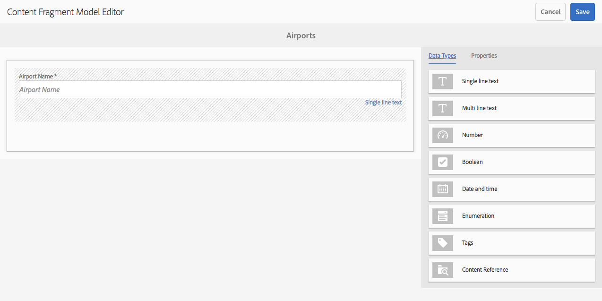

# Modeller för innehållsfragment{#content-fragment-models}

Modeller för innehållsfragment definierar innehållsstrukturen för dina [innehållsfragment](/help/assets/content-fragments.md).

## Aktivera modeller för innehållsfragment {#enable-content-fragment-models}

>[!CAUTION]
>
>Om du inte aktiverar **Content Fragment Models** kommer alternativet **Create** inte att vara tillgängligt när du skapar nya modeller.

Om du vill aktivera innehållsfragmentmodeller måste du:

* Aktivera användning av innehållsfragmentmodeller i konfigurationshanteraren
* Använda konfigurationen i resursmappen

### Aktivera modeller för innehållsfragment i Configuration Manager {#enable-content-fragment-models-in-configuration-manager}

Om du vill [skapa en ny modell](#creating-a-content-fragment-model) för innehållsfragment **måste** du först aktivera dem med Configuration Manager:

1. Navigera till **Verktyg**, **Allmänt** och öppna sedan **Konfigurationsläsaren**.
1. Välj lämplig plats för webbplatsen.
1. Använd **Skapa** för att öppna dialogrutan där du:

   1. Ange en **titel**.
   1. Markera **Content Fragment Models** för att aktivera användningen.
   

1. Välj **Skapa** för att spara definitionen.

### Använd konfigurationen i resursmappen {#apply-the-configuration-to-your-assets-folder}

När konfigurationen **global** är aktiverad för innehållsfragmentmodeller kan alla modeller som användarna skapar användas i alla resursmappar.

Om du vill använda andra konfigurationer (d.v.s. exkludera globala) med en jämförbar resursmapp måste du definiera anslutningen. Detta görs med **Configuration** på fliken **Cloud Services** i **Mappegenskaper** för rätt mapp.

## Skapa en innehållsfragmentmodell {#creating-a-content-fragment-model}

1. Navigera till **Verktyg**, **Resurser** och öppna sedan **Content Fragment Models**.
1. Navigera till den mapp som passar din [konfiguration](#enable-content-fragment-models).
1. Använd **Skapa** för att öppna guiden.

   >[!CAUTION]
   >
   >Om [användningen av innehållsfragmentmodeller inte har aktiverats](#enable-content-fragment-models)är alternativet **Skapa** inte tillgängligt.

1. Ange **modelltitel**. Du kan också lägga till en **beskrivning** om det behövs.

   

1. Använd **Skapa** för att spara den tomma modellen. Ett meddelande visar att åtgärden lyckades, du kan välja **Öppna** för att redigera modellen direkt eller **Klar** för att återgå till konsolen.

## Definiera innehållsfragmentmodellen {#defining-your-content-fragment-model}

Modellen för innehållsfragment definierar effektivt strukturen för de resulterande innehållsfragmenten. Med modellredigeraren kan du lägga till och konfigurera obligatoriska fält:

>[!CAUTION]
>
>Om du redigerar en befintlig innehållsfragmentmodell kan det påverka beroende fragment.

1. Navigera till **Verktyg**, **Resurser** och öppna sedan **Content Fragment Models**.

1. Navigera till mappen som innehåller innehållsfragmentmodellen.
1. Öppna den modell som krävs för **redigering**; använd snabbåtgärden eller välj modell och sedan åtgärden från verktygsfältet.

   När du har öppnat modellredigeraren visas följande:

   * vänster: fält har redan definierats
   * höger: **Datatyper** som är tillgängliga för att skapa fält (och **egenskaper** som kan användas när fält har skapats)
   >[!NOTE]
   >
   >När ett fält är **obligatoriskt** markeras den **etikett** som visas i den vänstra rutan med en asterix (*****).

   

1. **Lägga till ett fält**

   * Dra en obligatorisk datatyp till önskad plats för ett fält:
   

   * När ett fält har lagts till i modellen visar den högra panelen de **egenskaper** som kan definieras för den aktuella datatypen. Här definierar du vad som krävs för fältet. Exempel:
   

   >[!NOTE]
   För datatypen **Flerradstext** går det att definiera **standardtypen** som antingen:
   * **RTF-text**

   * **Markering**

   * **Oformaterad text**
   Om inget anges används standardvärdet **RTF** för det här fältet.
   Om du ändrar **standardtypen** i en innehållsfragmentmodell börjar det bara gälla för ett befintligt, relaterat innehållsfragment efter att fragmentet har öppnats i redigeraren och sparats.

1. **Ta bort ett fält**

   Markera det obligatoriska fältet och klicka/tryck sedan på papperskorgsikonen. Du ombeds bekräfta åtgärden.

   

1. När du har lagt till alla obligatoriska fält och definierat egenskaperna använder du **Spara** för att behålla definitionen. Exempel:

   

## Ta bort en innehållsfragmentmodell {#deleting-a-content-fragment-model}

>[!CAUTION]
Om du tar bort en innehållsfragmentmodell kan det påverka beroende fragment.

Så här tar du bort en innehållsfragmentmodell:

1. Navigera till **Verktyg**, **Resurser** och öppna sedan **Content Fragment Models**.

1. Navigera till mappen som innehåller innehållsfragmentmodellen.
1. Välj en modell, följt av **Ta bort** i verktygsfältet.

   >[!NOTE]
   Om det refereras till modellen visas en varning. Vidta lämpliga åtgärder.

## Publicera en innehållsfragmentmodell {#publishing-a-content-fragment-model}

Modeller för innehållsfragment måste publiceras när/innan beroende innehållsfragment publiceras.

Så här publicerar du en innehållsfragmentmodell:

1. Navigera till **Verktyg**, **Resurser** och öppna sedan **Content Fragment Models**.

1. Navigera till mappen som innehåller innehållsfragmentmodellen.
1. Välj en modell, följt av **Publicera** i verktygsfältet.

   >[!NOTE]
   Om du publicerar ett innehållsfragment för vilket modellen ännu inte har publicerats, visas detta i en urvalslista och modellen publiceras med fragmentet.

