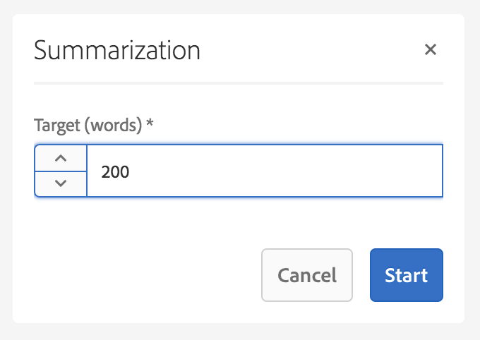

# Variationer - innehåll för redigeringsfragment{#variations-authoring-fragment-content}

[Variationer](/help/assets/content-fragments.md#constituent-parts-of-a-content-fragment) är en viktig egenskap i innehållsfragment, eftersom de gör att du kan skapa och redigera kopior av huvudinnehållet för användning i specifika kanaler och/eller scenarier.

På fliken **Variationer** kan du:

* [Ange innehållet](#authoring-your-content) för fragmentet
* [Skapa och hantera variationer](#managing-variations) av **mallinnehållet**

Utför en rad andra åtgärder beroende på vilken datatyp som redigeras. till exempel:

* [Infoga visuella resurser i fragmentet](#inserting-assets-into-your-fragment) (bilder)
* Välj mellan [RTF](#rich-text), [Oformaterad text](#plain-text) och [Markering](#markdown) för redigering

* [Överför innehåll](#uploading-content)

* [Visa nyckelstatistik](#viewing-key-statistics) (om flerradig text)
* [Sammanfatta text](#summarizing-text)

* [Synkronisera varianter med mallinnehåll](#synchronizing-with-master)

>[!CAUTION]
>
>När ett fragment har publicerats och/eller refererats visar AEM en varning när en författare öppnar fragmentet för redigering igen. Detta är för att varna för att ändringar i avsnittet även påverkar de refererade sidorna.

## Redigera ditt innehåll {#authoring-your-content}

När du öppnar ditt innehållsfragment för redigering öppnas fliken **Variationer** som standard. Här kan du skapa innehållet, för mallsidor eller andra varianter som du har. Du kan:

* gör redigeringar direkt på fliken **Variationer**
* öppna [helskärmsredigeraren](#full-screen-editor) för att:

   * välj [Format](#formats)
   * se fler redigeringsalternativ (för [RTF](#rich-text) -format)

   * få tillgång till ett antal [åtgärder](#actions)

Exempel:

* Redigera ett enkelt fragment

   Ett enkelt fragment består av ett textfält med flera rader (visuella resurser kan läggas till i helskärmsredigeraren).

   

* Redigera ett fragment med strukturerat innehåll

   Ett strukturerat fragment innehåller olika fält, av olika datatyper, som har definierats i innehållsmodellen. För flerradiga fält är [helskärmsredigeraren](#full-screen-editor) tillgänglig.

   

### Helskärmsredigerare {#full-screen-editor}

När du redigerar ett textfält med flera rader kan du öppna fullskärmsredigeraren:

Helskärmsredigeraren ger dig följande:

* Åtkomst till olika [åtgärder](#actions)
* Beroende på [format](#formats)kan ytterligare formateringsalternativ användas ([RTF](#rich-text))

### Åtgärder {#actions}

Följande åtgärder är också tillgängliga (för alla [format](#formats)) när helskärmsredigeraren (d.v.s. flerradig text) är öppen:

* Välj [format](#formats) ([RTF](#rich-text), [Oformaterad text,](#plain-text) [Markering](#markdown))

* [Visa textstatistik](#viewing-key-statistics)

* [Överför innehåll](#uploading-content)
* [Synkronisera med mallsida](#synchronizing-with-master) (när du redigerar en variant)
* [Sammanfatta text](#summarizing-text)
* [Anteckna](/help/assets/content-fragments-variations.md#annotating-a-content-fragment) texten

* [Infoga visuella resurser i fragmentet](#inserting-assets-into-your-fragment) (bilder)

### Format {#formats}

Vilka alternativ du kan använda för att redigera text med flera rader beror på vilket format du har valt:

* [RTF-text](#rich-text)
* [Oformaterad text](#plain-text)
* [Markering](#markdown)

Formatet kan väljas när helskärmsredigeraren används.

### RTF-text {#rich-text}

Med textredigering kan du formatera:

* Fet
* Kursiv
* Understrykning
* Justering: vänster, mitten, höger
* Punktlista
* Numrerad lista
* Indrag: öka, minska
* Skapa/bryt hyperlänkar
* Öppna helskärmsredigeraren, där följande formateringsalternativ är tillgängliga:

   * Klistra in text/text från Word
   * Infoga en tabell
   * Styckeformat: Stycke, Rubrik 1/2/3
   * [Infoga visuella resurser](#inserting-assets-into-your-fragment)
   * Sök
   * Sök/ersätt
   * Stavningskontroll
   * [Anteckningar](/help/assets/content-fragments-variations.md#annotating-a-content-fragment)

Du kan även komma åt [funktionsmakrona](#actions) från helskärmsredigeraren.

### Oformaterad text {#plain-text}

Med oformaterad text kan du snabbt lägga in innehåll utan formaterings- eller markeringsinformation. Du kan även öppna helskärmsredigeraren för ytterligare [åtgärder](#actions).

>[!CAUTION]
>
>Om du väljer **Oformaterad text** kan du förlora formatering, markeringar och/eller resurser som du har infogat i **RTF** eller **Markering**.

### Markering {#markdown}

>[!NOTE]
>
>Mer information finns i dokumentationen för [Markdown](/help/assets/content-fragments-markdown.md) .

På så sätt kan du formatera texten med hjälp av markeringar. Du kan definiera:

* Rubriker
* Stycken och radbrytningar
* Länkar
* Bilder
* Blockcitat
* Listor
* Betoning
* Kodblock
* Backslash Escapes

Du kan även öppna helskärmsredigeraren för ytterligare [åtgärder](#actions).

>[!CAUTION]
>
>Om du växlar mellan **RTF** och **Markdown** kan du få oväntade effekter med Blockcitattecken och Kodblock, eftersom dessa två format kan ha skillnader i hur de hanteras.

### Visa nyckelstatistik {#viewing-key-statistics}

När helskärmsredigeraren är öppen visas ett intervall med information om texten i **textstatistiken** . Exempel:

### Överför innehåll {#uploading-content}

För att underlätta redigeringen av innehållsfragment kan du överföra text, förberedd i en extern redigerare och lägga till den direkt i fragmentet.

### Sammanfatta text {#summarizing-text}

Att sammanfatta text är utformat för att hjälpa användare att minska längden på texten till ett fördefinierat antal ord, samtidigt som man behåller huvudpunkterna och den övergripande innebörden.

>[!NOTE]
>
>På en mer teknisk nivå behåller systemet meningarna som det klassificerar som att ge den *bästa andelen informationstäthet och unika egenskaper* enligt specifika algoritmer.

>[!CAUTION]
>
>Innehållsfragmentet måste ha en giltig språkmapp (ISO-kod) som överordnad. används för att fastställa vilken språkmodell som ska användas.
>
>Till exempel `en/` som i följande sökväg:
>
>`/content/dam/my-brand/en/path-down/my-content-fragment`

>[!CAUTION]
>
>Engelska finns i körklart skick.
>
>Andra språk är tillgängliga som språkmodellpaket från paketresurs:
>
>* [Franska (fr)](https://www.adobeaemcloud.com/content/marketplace/marketplaceProxy.html?packagePath=/content/companies/public/adobe/packages/cq630/product/smartcontent-model-fr)
>* [German (de)](https://www.adobeaemcloud.com/content/marketplace/marketplaceProxy.html?packagePath=/content/companies/public/adobe/packages/cq630/product/smartcontent-model-de)
>* [Italienska (it)](https://www.adobeaemcloud.com/content/marketplace/marketplaceProxy.html?packagePath=/content/companies/public/adobe/packages/cq630/product/smartcontent-model-it)
>* [Spanska (es)](https://www.adobeaemcloud.com/content/marketplace/marketplaceProxy.html?packagePath=/content/companies/public/adobe/packages/cq630/product/smartcontent-model-es)
>

1. Välj **mallsida** eller önskad variant.
1. Öppna fullskärmsredigeraren.

1. Välj **Sammanfatta text** i verktygsfältet.

   

1. Ange målantalet ord och välj **Start**:
1. Den ursprungliga texten visas sida vid sida med den föreslagna sammanfattningen:

   * Alla meningar som ska tas bort markeras med rött, med genomstrykning.
   * Klicka på en markerad mening om du vill behålla den i det sammanfattande innehållet.
   * Klicka på en mening som inte är markerad för att ta bort den.
   

1. Markera **Sammanfattning** för att bekräfta ändringarna.

### Anteckna ett innehållsfragment {#annotating-a-content-fragment}

Så här kommenterar du ett fragment:

1. Välj **mallsida** eller önskad variant.
1. Öppna fullskärmsredigeraren.
1. Markera text. Ikonen **Anteckning** blir tillgänglig.

   

1. En dialogruta öppnas. Här kan du ange din anteckning.

1. Stäng helskärmsredigeraren och **spara** fragmentet.

### Visa, redigera, ta bort anteckningar {#viewing-editing-deleting-annotations}

Anteckningar:

* Indikeras av markeringen på texten, både i helskärmsläge och i normalt läge i redigeraren. Du kan sedan visa, redigera och/eller ta bort all information i en anteckning genom att klicka på den markerade texten, som öppnar dialogrutan igen.

   >[!NOTE]
   >
   >En nedrullningsbar väljare tillhandahålls om flera anteckningar har tillämpats på ett textstycke.

* När du tar bort hela texten som kommentaren användes på tas även anteckningen bort.

* Kan listas och tas bort genom att välja fliken **Anteckningar** i fragmentredigeraren.

   

* Kan visas och tas bort i [tidslinjen](/help/assets/content-fragments-managing.md#timeline-for-content-fragments) för det markerade fragmentet.

### Infoga resurser i fragment {#inserting-assets-into-your-fragment}

Om du vill skapa innehållsfragment enklare kan du lägga till [resurser](/help/assets/managing-assets-touch-ui.md) (bilder) direkt i fragmentet.

De läggs till i fragmentets styckesekvens utan formatering. formatering kan göras när [fragmentet används/refereras på en sida](/help/sites-authoring/content-fragments.md).

>[!CAUTION]
>
>Dessa resurser kan inte flyttas eller tas bort på en referenssida. Detta måste göras i fragmentredigeraren.
>
>Formatering av resursen (t.ex. storlek) måste dock göras i [sidredigeraren](/help/sites-authoring/content-fragments.md). Representationen av resursen i fragmentredigeraren är endast till för att skapa innehållsflödet.

>[!NOTE]
>
>Det finns olika metoder för att lägga till [bilder](/help/assets/content-fragments.md#fragments-with-visual-assets) till fragmentet och/eller sidan.

1. Placera markören på den plats där du vill lägga till bilden.
1. Använd ikonen **Infoga resurs** för att öppna sökdialogrutan.

   

1. I dialogrutan kan du antingen:

   * navigera till den nödvändiga resursen i DAM
   * söka efter resursen i DAM
   Välj önskad resurs genom att klicka på miniatyrbilden.

1. Använd **Välj** för att lägga till resursen i innehållsfragmentets styckesystem på den aktuella platsen.

   >[!CAUTION]
   >
   >Om du efter att ha lagt till en resurs ändrar formatet till:
   >
   >* **Oformaterad text**: resursen kommer att förloras helt från fragmentet.
   >* **Markering**: resursen visas inte, men finns fortfarande kvar när du återgår till **RTF**.

## Hantera variationer {#managing-variations}

### Skapa en variant {#creating-a-variation}

Med variationer kan du ta **mallinnehållet** och ändra det efter syfte (om det behövs).

Så här skapar du en ny variant:

1. Öppna fragmentet och se till att sidopanelen är synlig.
1. Välj **Variationer** i ikonfältet på sidpanelen.
1. Välj **Skapa variation**.
1. En dialogruta öppnas där du anger **titel** och **beskrivning** för den nya varianten.
1. Välj **Lägg till**; fragmentmallsidan **** kopieras till den nya varianten som nu är öppen för [redigering](#editing-a-variation).

   >[!NOTE]
   >
   >När du skapar en ny variant är det alltid **mallsida** som kopieras, inte varianten som är öppen.

### Redigera en variant {#editing-a-variation}

Du kan ändra variantinnehållet efter antingen:

* [Skapa din variation](#creating-a-variation).
* Öppna ett befintligt fragment och välj sedan önskad variation på sidopanelen.

### Byta namn på en variant {#renaming-a-variation}

Så här byter du namn på en befintlig variant:

1. Öppna fragmentet och välj **Variationer** på sidpanelen.
1. Välj önskad variant.
1. Välj **Byt namn** i listrutan **Åtgärder** .

1. Ange den nya **titeln** och/eller **beskrivningen** i dialogrutan som visas.

1. Bekräfta åtgärden **Byt namn** .

>[!NOTE]
>
>Detta påverkar bara **varianttiteln**.

### Ta bort en variant {#deleting-a-variation}

Så här tar du bort en befintlig variant:

1. Öppna fragmentet och välj **Variationer** på sidpanelen.
1. Välj önskad variant.
1. Välj **Ta bort** i listrutan **Åtgärder** .

1. Bekräfta åtgärden **Ta bort** i dialogrutan.

>[!NOTE]
>
>Du kan inte ta bort **mallsida**.

### Synkroniserar med mallsida {#synchronizing-with-master}

**Mallen** är en integrerad del av ett innehållsfragment och innehåller per definition huvudkopian av innehållet, medan varianterna innehåller de individuella uppdaterade och anpassade versionerna av det innehållet. När mallsidan uppdateras är det möjligt att dessa ändringar också är relevanta för variationerna och därför måste spridas till dem.

När du redigerar en variant har du tillgång till åtgärden för att synkronisera det aktuella elementet i variationen med mallsidan. På så sätt kan du automatiskt kopiera ändringar som gjorts i mallsidan till den önskade varianten.

>[!CAUTION]
>
>Synkronisering är bara tillgängligt för att kopiera ändringar *från **mallsida**till varianten*.
>
>Endast det aktuella elementet i variationen synkroniseras.
>
>Synkronisering fungerar bara på datatypen **Flerradig text** .
>
>Du kan inte överföra ändringar *från en variant till **mallsida ***.

1. Öppna ditt innehållsfragment i fragmentredigeraren. Kontrollera att **mallsidan** har redigerats.
1. Välj en specifik variant och sedan lämplig synkroniseringsåtgärd från antingen:

   * listrutan **Åtgärder** - **Synkronisera aktuellt element med mallsida**

   * verktygsfältet i fullskärmsredigeraren - **Synkronisera med mallsida**

1. Mallen och variationen visas sida vid sida:

   * grönt anger innehåll som lagts till (i varianten)
   * rött anger att innehållet har tagits bort (från varianten)
   

1. Välj **Synkronisera**. Variationen uppdateras och visas.

