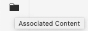
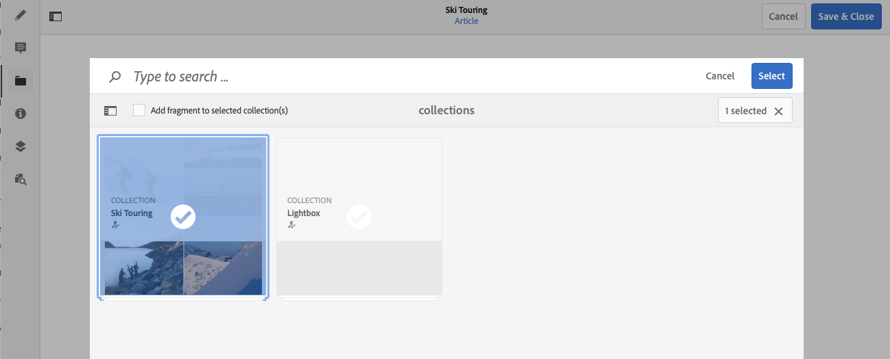

# Associerat innehåll{#associated-content}

Funktionen AEM associerat innehåll ger anslutningen så att resurser (valfritt) kan användas med fragmentet när det läggs till på en innehållssida. Detta ger flexibilitet för leverans av headless-innehåll genom att [tillhandahålla ett intervall med resurser som du kan komma åt när du använder innehållsfragmentet på en sida](/help/sites-authoring/content-fragments.md#using-associated-content), samtidigt som det minskar den tid som krävs för att söka efter rätt resurs. Allt associerat innehåll kan konfigureras med redigeraren för innehållsfragment.

## Lägga till associerat innehåll {#adding-associated-content}

>[!NOTE]
>
>Det finns olika metoder för att lägga till [visuella resurser (till exempel bilder)](/help/assets/content-fragments/content-fragments.md#fragments-with-visual-assets) till avsnittet och/eller sidan.

För att kunna skapa associationen måste du först [lägga till dina medieresurser i en samling](/help/assets/manage-collections.md). När det är klart kan du:

1. Öppna fragmentet och välj **Associerat innehåll** på sidopanelen.

   

1. Beroende på om några samlingar redan har associerats eller inte väljer du antingen:

   * **Associera innehåll** - detta blir den första associerade samlingen
   * **Associera samling** - associerade samlingar som redan har konfigurerats

1. Välj önskad samling.

   Du kan också lägga till själva fragmentet i den valda samlingen. Detta hjälper till att spåra.

   

1. Bekräfta (med **Markera**). Samlingen listas som associerad.

   

## Redigera associerat innehåll {#editing-associated-content}

När du har kopplat en samling kan du:

* **Ta bort** associationen.
* **Lägg till Assets** i samlingen.
* Välj en resurs för ytterligare åtgärder.
* Redigera resursen.
