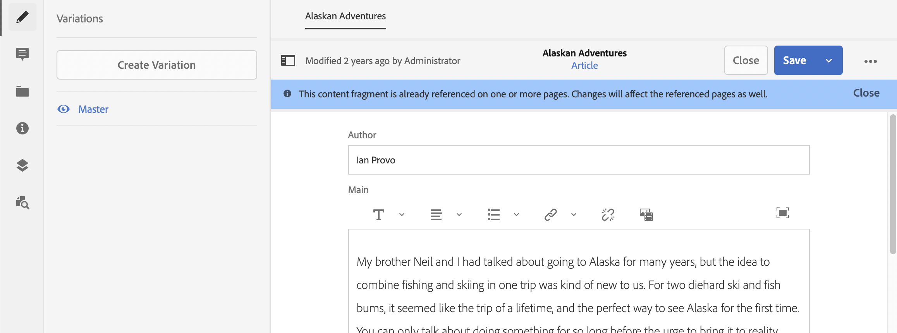
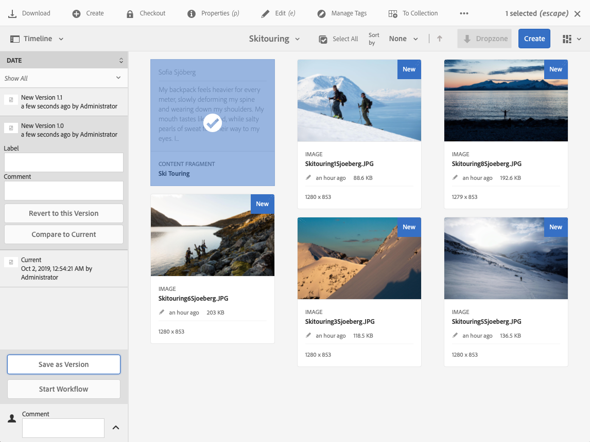

# Hantera innehållsfragment {#managing-content-fragments}

Lär dig hur du använder Resurskonsolen för att hantera AEM innehållsfragment, som utgör grunden för ditt headless-innehåll.

När du har definierat dina [modeller för innehållsfragment](#creating-a-content-model) kan du använda dessa för att [skapa dina innehållsfragment](#creating-a-content-fragment).

[Innehållsfragmentredigeraren](#opening-the-fragment-editor) innehåller olika [lägen](#modes-in-the-content-fragment-editor) som gör att du kan:

* [Redigera ](#editing-the-content-of-your-fragment) innehållet och  [hantera variationer](#creating-and-managing-variations-within-your-fragment)
* [Anteckna ditt fragment](/help/assets/content-fragments/content-fragments-variations.md#annotating-a-content-fragment)
* [Associera innehåll med fragment](#associating-content-with-your-fragment)
* [Konfigurera metadata](#viewing-and-editing-the-metadata-properties-of-your-fragment)
* [Visa strukturträdet](/help/assets/content-fragments/content-fragments-structure-tree.md)
* [Förhandsgranska JSON-representationen](/help/assets/content-fragments/content-fragments-json-preview.md)

>[!NOTE]
>
>Innehållsfragment kan användas:
>
>* vid framtagning av sidor, se [Sidredigering med innehållsfragment](/help/sites-authoring/content-fragments.md).
>* for [Headless Content Delivery using Content Fragments with GraphQL](/help/assets/content-fragments/content-fragments-graphql.md).

>[!NOTE]
>
>Innehållsfragment lagras som **Resurser**, så hanteras primärt från konsolen **Resurser**.

## Skapa innehållsfragment {#creating-content-fragments}

### Skapa en innehållsmodell {#creating-a-content-model}

[Modellskanning ](/help/assets/content-fragments/content-fragments-models.md) av innehållsfragment kan aktiveras och skapas innan innehållsfragment med strukturerat innehåll skapas.

### Skapa ett innehållsfragment {#creating-a-content-fragment}

Metoden för att skapa ett innehållsfragment är:

1. Navigera till mappen **Resurser** där du vill skapa fragmentet.
1. Välj **Skapa** och sedan **Innehållsfragment** för att öppna guiden.
1. I det första steget i guiden måste du ange grunden för det nya fragmentet.

   * [Modell](/help/assets/content-fragments/content-fragments-models.md)  - använd för att skapa ett fragment som kräver strukturerat innehåll. till exempel  **** Adventuremodel

      * Alla tillgängliga modeller visas.

   Efter markeringen använder du **Nästa** för att fortsätta.

   

1. Ange följande i steget **Egenskaper**:

   * **Grundläggande**

      * **Titel**

         Fragmenttiteln.

         Obligatorisk.

      * **Beskrivning**

      * **Taggar**
   * **Avancerat**

      * **Namn**

         Namnet; används för att skapa URL:en.

         Obligatoriskt. hämtas automatiskt från titeln, men kan uppdateras.

1. Välj **Skapa** för att slutföra åtgärden och **Öppna** sedan fragmentet för redigering eller gå tillbaka till konsolen med **Klar**.

   >[!NOTE]
   >I **listläge** för konsolen kan du uppdatera **Visa inställningar** för att aktivera kolumnen **Content Fragment Model**.

## Åtgärder för ett innehållsfragment i resurskonsolen {#actions-for-a-content-fragment-assets-console}

I konsolen **Resurser** finns en rad åtgärder tillgängliga för dina innehållsfragment, antingen:

* Från verktygsfältet; när du har valt fragmentet är alla lämpliga åtgärder tillgängliga.
* Som [snabbåtgärder](/help/sites-authoring/basic-handling.md#quick-actions); en delmängd av åtgärder som är tillgängliga för de enskilda fragmentkorten.

Markera fragmentet för att visa verktygsfältet med tillämpliga åtgärder:

* **Hämta**

   * Spara fragmentet som en ZIP-fil; du kan definiera om element, variationer och metadata ska inkluderas.

* **Skapa**
* **Utcheckning**
* **Egenskaper**

   * Gör att du kan visa och/eller redigera fragmentets metadata.

* **Redigera**

   * Gör att du kan [öppna fragmentet för redigering av innehåll](/help/assets/content-fragments/content-fragments-variations.md) tillsammans med dess element, variationer, tillhörande innehåll och metadata.

* **Hantera taggar**
* **Till samling**
* **Kopiera**  (och  **klistra in**)
* **Flytta**
* **Snabbpublicering**
* **Hantera publikation**
* **Ta bort**

>[!NOTE]
>
>Många av dessa är [standardåtgärder för Assets](/help/assets/manage-assets.md) och/eller [AEM skrivbordsappen](https://helpx.adobe.com/experience-manager/desktop-app/aem-desktop-app.html).

## Öppna fragmentredigeraren {#opening-the-fragment-editor}

Så här öppnar du fragmentet för redigering:

>[!CAUTION]
>
>Om du vill redigera ett innehållsfragment behöver du [de behörigheter som krävs](/help/sites-developing/customizing-content-fragments.md#asset-permissions). Kontakta systemadministratören om du har problem.

>[!CAUTION]
>
>Om du vill redigera ett innehållsfragment måste du ha rätt behörighet. Kontakta systemadministratören om du har problem.

1. Använd konsolen **Resurser** för att navigera till platsen för ditt innehållsfragment.
1. Öppna fragmentet för redigering, antingen genom att:

   * Klicka/tryck på fragment- eller fragment-länken (detta beror på konsolvyn).
   * Markera fragmentet och **Redigera** i verktygsfältet.

1. Fragmentredigeraren öppnas. Gör önskade ändringar:

   

1. När du har gjort ändringar använder du **Spara och stäng**.

<!-- 
1. After making changes, use **Save**, **Save & close** or **Close** as required.

   >[!NOTE]
   >
   >**Save & close** is available via the **Save** dropdown.

   >[!NOTE]
   >
   >Both **Save & Close** and **Close** will exit the editor - see [Save, Close and Versions](#save-close-and-versions) for full information on how the various options operate for content fragments.
-->

## Lägen och åtgärder i Content Fragment Editor {#modes-actions-content-fragment-editor}

Det finns olika lägen och åtgärder tillgängliga från Content Fragment Editor.

### Lägen i Content Fragment Editor {#modes-in-the-content-fragment-editor}

Navigera genom de olika lägena med ikonerna på sidopanelen:

* Variationer: [Redigera innehållet](#editing-the-content-of-your-fragment) och [Hantera dina variationer](#creating-and-managing-variations-within-your-fragment)

* [Anteckningar](/help/assets/content-fragments/content-fragments-variations.md#annotating-a-content-fragment)
* [Associerat innehåll](#associating-content-with-your-fragment)
* [Metadata](#viewing-and-editing-the-metadata-properties-of-your-fragment)
* [Strukturträd](/help/assets/content-fragments/content-fragments-structure-tree.md)
* [Förhandsgranska](/help/assets/content-fragments/content-fragments-json-preview.md)

### Åtgärder i verktygsfältet i redigeraren för innehållsfragment {#toolbar-actions-in-the-content-fragment-editor}

Vissa funktioner i det övre verktygsfältet finns i flera lägen:

<!-- screenshot changed from original text see commented out below -->

* Ett meddelande visas när fragmentet redan refereras på en innehållssida. Du kan **stänga** meddelandet.

* Sidpanelen kan döljas/visas med ikonen **Växla sidpanel**.

* Under fragmentnamnet kan du se namnet på den [modell för innehållsfragment](/help/assets/content-fragments/content-fragments-models.md) som används för att skapa det aktuella fragmentet:

   * Namnet är också en länk som öppnar modellredigeraren.

* Se fragmentets status. information om när den skapades, ändrades eller publicerades.

* **Spara och stäng**

<!--
Some features in the top toolbar are available from multiple modes:

* A message will be shown when the fragment is already referenced on a content page. You can **Close** the message.

* The side panel can be hidden/shown using the **Toggle Side Panel** icon.

* Underneath the fragment name you can see the name of the [Content Fragment Model](/help/assets/content-fragments/content-fragments-models.md) used for creating the current fragment:

  * The name is also a link that will open the model editor.

* See the status of the fragment; for example, information about when it was created, modified or published. The status is also color-coded:

  * **New**: grey
  * **Draft**: blue
  * **Published**: green
  * **Modified**: orange
  * **Deactivated**: red

* **Save** provides access to the **Save & close** option.
  
* The three dots (**...**) drop-down provides access to additional actions:
  * **Update page references**
    * This updates any page references. 
  * **[Quick publish](#publishing-and-referencing-a-fragment)**
  * **[Manage Publication](#publishing-and-referencing-a-fragment)**
-->

<!--
This updates any page references and ensures that the Dispatcher is flushed as required. -->

<!--
## Save, Close and Versions {#save-close-and-versions}

>[!NOTE]
>
>Versions can also be [created, compared and reverted from the Timeline](/help/assets/content-fragments/content-fragments-managing.md#timeline-for-content-fragments).

The editor has various options:

* **Save** and **Save & close**

  * **Save** will save the latest changes and remain in the editor.
  * **Save & close** will save the latest changes and exit the editor.

  >[!CAUTION]
  >
  >To edit a content fragment you need [the appropriate permissions](/help/sites-developing/customizing-content-fragments.md#asset-permissions). Please contact your system administrator if you are experiencing issues. 

  >[!NOTE]
  >
  >It is possible to remain in the editor, making a series of changes, before saving.

  >[!CAUTION]
  >
  >In addition to simply saving your changes, the actions also update any references and ensures that the Dispatcher is flushed as required. These changes can take time to process. Due to this, there can be a performance impact on a large/complex/heavily-loaded system.
  >
  >Please bear this in mind when using **Save & close** and then quickly re-entering the fragment editor to make and save further changes.

* **Close**

  Will exit the editor without saving the latest changes (i.e made since the last **Save**).

While editing your content fragment AEM automatically creates versions to ensure that prior content can be restored if you cancel your changes (using **Close** without saving):

1. When a content fragment is opened for editing AEM checks for the existence of the cookie-based token that indicates whether an *editing session* exists:

   1. If the token is found, the fragment is considered to be part of the existing editing session.
   2. If the token is *not* available and the user starts editing content, a version is created and a token for this new editing session is sent to the client, where it is saved in a cookie.

2. While there is an *active* editing session, the content being edited is automatically saved every 600 seconds (default).

   >[!NOTE]
   >
   >The auto save interval is configurable using the `/conf` mechanism.
   >
   >Default value, see:
   >&nbsp;&nbsp;`/libs/settings/dam/cfm/jcr:content/autoSaveInterval`

3. If the user cancels the edit, the version created at the start of the editing session is restored and the token is removed to end the editing session.
4. If the user selects to **Save** the edits, the updated elements/variations are persisted and the token is removed to end the editing session.
-->

## Redigera innehållet i fragmentet {#editing-the-content-of-your-fragment}

När du har öppnat fragmentet kan du använda fliken [Variationer](/help/assets/content-fragments/content-fragments-variations.md) för att skapa innehållet.

## Skapa och hantera variationer i fragment {#creating-and-managing-variations-within-your-fragment}

När du har skapat det Överordnad innehållet kan du skapa och hantera [Variationer](/help/assets/content-fragments/content-fragments-variations.md) av det innehållet.

## Koppla innehåll till fragment {#associating-content-with-your-fragment}

Du kan även [associera innehåll](/help/assets/content-fragments/content-fragments-assoc-content.md) med ett fragment. Detta ger en anslutning så att resurser (t.ex. bilder) kan användas (valfritt) med fragmentet när det läggs till på en innehållssida.

## Visa och redigera metadata (egenskaper) för fragmentet {#viewing-and-editing-the-metadata-properties-of-your-fragment}

Du kan visa och redigera egenskaperna för ett fragment på fliken [Metadata](/help/assets/content-fragments/content-fragments-metadata.md).

## Tidslinje för innehållsfragment {#timeline-for-content-fragments}

Förutom standardalternativen innehåller [Tidslinjen](/help/assets/manage-assets.md#timeline) både information och åtgärder som är specifika för innehållsfragment:

* Visa information om versioner, kommentarer och anteckningar
* Åtgärder för versioner

   * **[Återgå till den här versionen](#reverting-to-a-version)**  (välj ett befintligt fragment, sedan en specifik version)

   * **[Jämför med aktuell](#comparing-fragment-versions)**  (välj ett befintligt fragment och sedan en specifik version)

   * Lägg till en **etikett** och/eller **Kommentar** (välj ett befintligt fragment och sedan en specifik version)

   * **Spara som version**  (markera ett befintligt fragment och sedan uppilen längst ned på tidslinjen)

* Åtgärder för anteckningar

   * **Ta bort**

>[!NOTE]
>
>Kommentarerna är:
>
>* Standardfunktionalitet för alla resurser
>* Skapat i tidslinjen
>* Relaterat till fragmentresursen

>
>Anteckningar (för innehållsfragment) är:
>
>* Anges i fragmentredigeraren
>* Specifik för ett markerat textsegment i fragmentet

>

Till exempel:

## Jämföra fragmentversioner {#comparing-fragment-versions}

Åtgärden **Jämför med aktuell** är tillgänglig från [tidslinjen](/help/assets/content-fragments/content-fragments-managing.md#timeline-for-content-fragments) när du har valt en specifik version.

Detta öppnas:

* **Aktuell** (senaste) version (vänster)

* den valda versionen **v&lt;*x.y*>** (höger)

De visas sida vid sida, där:

* Eventuella skillnader markeras

   * Borttagen text - röd
   * Infogad text - grön
   * Ersatt text - blå

* Med helskärmsikonen kan du öppna båda versionerna separat; växla sedan tillbaka till den parallella vyn
* Du kan **återställa** till den specifika versionen
* **** Donewill return you to the console

>[!NOTE]
>
>Du kan inte redigera fragmentinnehållet när du jämför fragment.

## Återställa till en version  {#reverting-to-a-version}

Du kan återgå till en viss version av fragmentet:

* Direkt från [tidslinjen](/help/assets/content-fragments/content-fragments-managing.md#timeline-for-content-fragments).

   Välj önskad version och sedan åtgärden **Återställ till denna version**.

* När du jämför en version med den aktuella versionen](/help/assets/content-fragments/content-fragments-managing.md#comparing-fragment-versions) kan du **återställa** till den valda versionen.[

## Publicera och referera till ett fragment {#publishing-and-referencing-a-fragment}

>[!CAUTION]
>
>Om fragmentet är baserat på en modell bör du kontrollera att [modellen har publicerats](/help/assets/content-fragments/content-fragments-models.md#publishing-a-content-fragment-model).
>
>Om du publicerar ett innehållsfragment för vilket modellen ännu inte har publicerats, visas detta i en urvalslista och modellen publiceras med fragmentet.

Innehållsfragment måste publiceras för användning i publiceringsmiljön. De kan publiceras:

* Efter skapande; med [åtgärder som är tillgängliga i resurskonsolen](#actions-for-a-content-fragment-assets-console).
* Från [redigeraren för innehållsfragment](#toolbar-actions-in-the-content-fragment-editor).
* När du [publicerar en sida som använder fragmentet](/help/sites-authoring/content-fragments.md#publishing); fragmentet kommer att listas i sidreferenserna.

>[!CAUTION]
>
>När ett fragment har publicerats och/eller refererats visar AEM en varning när en författare öppnar fragmentet för redigering igen. Detta är för att varna för att ändringar i avsnittet även påverkar de refererade sidorna.

## Ta bort ett fragment {#deleting-a-fragment}

Så här tar du bort ett fragment:

1. I konsolen **Resurser** navigerar du till platsen för innehållsfragmentet.
2. Markera fragmentet.

   >[!NOTE]
   >
   >Åtgärden **Ta bort** är inte tillgänglig som en snabbåtgärd.

3. Välj **Ta bort** från verktygsfältet.
4. Bekräfta åtgärden **Ta bort**.

   >[!CAUTION]
   >
   >Om fragmentet redan finns på en sida visas ett varningsmeddelande och du måste bekräfta att du vill fortsätta med **Tvinga borttagning**. Fragmentet, tillsammans med dess innehållskomponentfragment, tas bort från alla innehållssidor.
