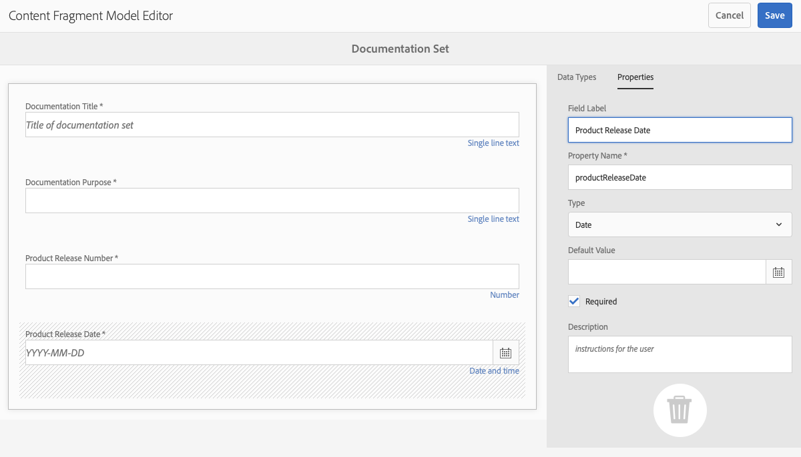

# Modeller för innehållsfragment {#content-fragment-models}

Content Fragment Models i AEM definierar innehållsstrukturen för dina [innehållsfragment, &#x200B;](/help/assets/content-fragments/content-fragments.md) som en grund för ditt headless-innehåll.

Om du vill använda modeller för innehållsfragment kan du:

1. [Aktivera funktionen Content Fragment Model för instansen](/help/assets/content-fragments/content-fragments-configuration-browser.md).
1. [Skapa](#creating-a-content-fragment-model) och [konfigurera](#defining-your-content-fragment-model), dina modeller för innehållsfragment.
1. [Aktivera Content Fragment Models](#enabling-disabling-a-content-fragment-model) för användning när du skapar innehållsfragment.
1. [Tillåt dina modeller för innehållsfragment i de nödvändiga Assets-mapparna](#allowing-content-fragment-models-assets-folder) genom att konfigurera **Profiler**.

>[!NOTE]
>
>Observera [Bästa praxis](/help/assets/content-fragments/content-fragments.md#best-practices) när du arbetar med modeller för innehållsfragment och innehållsfragment.

## Skapa en innehållsfragmentmodell {#creating-a-content-fragment-model}

1. Navigera till **Verktyg**, **Assets** och öppna sedan **Content Fragment Models**.
1. Navigera till den mapp som passar din [konfiguration](/help/assets/content-fragments/content-fragments-configuration-browser.md).
1. Använd **Skapa** för att öppna guiden.

   >[!CAUTION]
   >
   >Om [användningen av innehållsfragmentmodeller inte har aktiverats](/help/assets/content-fragments/content-fragments-configuration-browser.md) är alternativet **Skapa** inte tillgängligt.

1. Ange **modelltitel**. Du kan också lägga till **taggar**, en **beskrivning** och välja **Aktivera modell** för att [aktivera modellen](#enabling-disabling-a-content-fragment-model) om det behövs.

   

1. Använd **Skapa** för att spara den tomma modellen. Ett meddelande anger att åtgärden lyckades. Du kan välja **Öppna** om du vill redigera modellen omedelbart eller **Klar** om du vill återgå till konsolen.

## Definiera innehållsfragmentmodellen {#defining-your-content-fragment-model}

Modellen för innehållsfragment definierar effektivt strukturen för de resulterande innehållsfragmenten med en markering av **[datatyper](#data-types)**. Med modellredigeraren kan du lägga till instanser av datatyperna och sedan konfigurera dem för att skapa de obligatoriska fälten:

>[!CAUTION]
>
>Om du redigerar en befintlig innehållsfragmentmodell kan det påverka beroende fragment.

1. Navigera till **Verktyg**, **Assets** och öppna sedan **Content Fragment Models**.

1. Navigera till mappen som innehåller innehållsfragmentmodellen.

1. Öppna den modell som krävs för **Redigera**. Använd snabbåtgärden eller markera modellen och sedan åtgärden från verktygsfältet.

   När du har öppnat modellredigeraren visas följande:

   * vänster: fält har redan definierats
   * höger: **Datatyper** som är tillgängliga för att skapa fält (och **egenskaper** som kan användas när fälten har skapats)

   >[!NOTE]
   >
   >När ett fält är **Obligatoriskt** markeras **Label** som anges i den vänstra rutan med ett asterix (**&#42;**).

   

1. **Lägga till ett fält**

   * Dra en obligatorisk datatyp till önskad plats för ett fält:

     

   * När ett fält har lagts till i modellen visar den högra panelen de **egenskaper** som kan definieras för den aktuella datatypen. Här definierar du vad som krävs för fältet.

      * Många egenskaper är självförklarande. Mer information finns i [Egenskaper](#properties).
      * Om du skriver en **fältetikett** slutförs **egenskapsnamnet** automatiskt, om det är tomt, och kan uppdateras manuellt efteråt.

        >[!CAUTION]
        >
        >När egenskapen **Egenskapsnamn** uppdateras manuellt för en datatyp får namn bara innehålla A-Z, a-z, 0-9 och understrecket&quot;_&quot; som specialtecken.
        >
        >Om modeller som skapats i tidigare versioner av AEM innehåller ogiltiga tecken tar du bort eller uppdaterar dessa tecken.

     Till exempel:

     

1. **Ta bort ett fält**

   Markera önskat fält och klicka sedan på papperskorgsikonen. Du ombeds bekräfta åtgärden.

   

1. Lägg till alla obligatoriska fält och definiera de relaterade egenskaperna efter behov. Till exempel:

   

1. Välj **Spara** om du vill behålla definitionen.

## Datatyper {#data-types}

Det finns ett urval datatyper som du kan använda för att definiera din modell:

* **Enkelradig text**
   * Lägg till ett eller flera fält med en enda textrad. Den maximala längden kan definieras
* **Flerradstext**
   * Ett textområde som kan vara RTF, Oformaterad text eller Markering
* **Number**
   * Lägg till ett eller flera numeriska fält
* **Boolean**
   * Lägg till en boolesk kryssruta
* **Datum och tid**
   * Lägg till ett datum och/eller en tid
* **Uppräkning**
   * Lägga till en uppsättning kryssrutor, alternativknappar eller nedrullningsbara fält
* **Taggar**
   * Tillåter fragmentförfattare att komma åt och markera taggområden
* **Innehållsreferens**
   * Refererar till annat innehåll, oavsett typ; kan användas för att [skapa kapslat innehåll](#using-references-to-form-nested-content)
   * Om en bild refereras kan du välja att visa en miniatyrbild
* **Fragmentreferens**
   * Refererar till andra innehållsfragment; kan användas för att [skapa kapslat innehåll](#using-references-to-form-nested-content)
   * Datatypen kan konfigureras så att fragmentförfattare kan:
      * Redigera det refererade fragmentet direkt.
      * Skapa ett innehållsfragment baserat på lämplig modell
* **JSON-objekt**
   * Gör att innehållsfragmentets författare kan ange JSON-syntax i motsvarande element i ett fragment.
      * För att AEM ska kunna lagra direkt JSON som du har kopierat och klistrat in från en annan tjänst.
      * JSON skickas och skrivs ut som JSON i GraphQL.
      * Innehåller JSON-syntaxmarkering, automatisk komplettering och felmarkering i innehållsfragmentredigeraren.
* **Platshållare för flik**
   * Tillåter att flikar kan användas när innehållet i innehållsfragmentet redigeras.
Detta visas som en avgränsare i modellredigeraren, som avgränsar avsnitt i listan med innehållsdatatyper. Varje instans representerar början på en ny flik.
I fragmentredigeraren visas varje instans som en flik.

     >[!NOTE]
     >
     >Den här datatypen används endast för formatering, den ignoreras av AEM GraphQL-schemat.

## Egenskaper {#properties}

Många egenskaper är självförklarande, för vissa egenskaper finns ytterligare information nedan:


* **Egenskapsnamn**

  När den här egenskapen uppdateras manuellt för en datatyp måste namnen **måste** innehålla *endast* A-Z, a-z, 0-9 och understrecket&quot;_&quot; som ett specialtecken.

  >[!CAUTION]
  >
  >Om modeller som skapats i tidigare versioner av AEM innehåller ogiltiga tecken tar du bort eller uppdaterar dessa tecken.

* **Återge som**
De olika alternativen för att realisera/återge fältet i ett fragment. Detta gör ofta att du kan definiera om författaren ska se en enda instans av fältet eller om han eller hon ska kunna skapa flera instanser.

* **Fältetikett**
Om du anger en **fältetikett** genereras automatiskt ett **egenskapsnamn** som sedan kan uppdateras manuellt om det behövs.

* **Validering**
Grundläggande validering är tillgängligt av mekanismer som egenskapen **Required** . Vissa datatyper har ytterligare valideringsfält. Mer information finns i [Validering](#validation).

* För datatypen **Flerradig text** går det att definiera **standardtypen** som endera:

   * **RTF**
   * **Markdown**
   * **Oformaterad text**

  Om inget anges används standardvärdet **RTF** för det här fältet.

  Om du ändrar **standardtypen** i en innehållsfragmentmodell börjar det bara gälla för ett befintligt, relaterat innehållsfragment efter att fragmentet har öppnats i redigeraren och sparats.

* **Unik**
Innehållet (för det specifika fältet) måste vara unikt för alla innehållsfragment som skapas från den aktuella modellen.

  Detta används för att säkerställa att innehållsförfattare inte kan upprepa innehåll som redan har lagts till i ett annat fragment av samma modell.

  Ett **enkelradigt textfält** med namnet `Country` i innehållsfragmentmodellen kan till exempel inte ha värdet `Japan` i två beroende innehållsfragment. En varning skickas när ett försök görs att utföra den andra instansen.

  >[!NOTE]
  >
  >Unikitet säkerställs per språkrot.

  >[!NOTE]
  >
  >Variationer kan ha samma *unika*-värde som varianter av samma fragment, men inte samma värde som används i andra variationer av fragment.

* Mer information om den specifika datatypen och dess egenskaper finns i **[Innehållsreferens](#content-reference)**.

* Mer information om den specifika datatypen och dess egenskaper finns i **[Fragmentreferens (kapslade fragment)](#fragment-reference-nested-fragments)**.

<!--
* **Translatable**
  Checking the **Translatable** checkbox on a field in the Content Fragment Model editor does the following:

  * Ensures that the field's property name is added to the translation configuration, context `/content/dam/<sites-configuration>`, if not already present. 
  * For GraphQL: sets a `<translatable>` property on the Content Fragment field to `yes`, to allow GraphQL query filter for JSON output with only translatable content.
-->

## Validering {#validation}

Olika datatyper kan nu definiera valideringskrav för när innehåll anges i det resulterande fragmentet:

* **Enkelradig text**
   * Jämför med ett fördefinierat regex.
* **Number**
   * Sök efter specifika värden.
* **Innehållsreferens**
   * Testa om det finns specifika typer av innehåll.
   * Det går endast att referera till resurser med en angiven filstorlek eller mindre.
   * Det går endast att referera till bilder inom ett fördefinierat intervall med bredd och/eller höjd (i pixlar).
* **Fragmentreferens**
   * Testa om det finns en specifik innehållsfragmentmodell.

## Använda referenser till kapslat innehåll {#using-references-to-form-nested-content}

Innehållsfragment kan skapa kapslat innehåll med någon av följande datatyper:

* **[Innehållsreferens](#content-reference)**
   * Ger en enkel referens till annat innehåll, av alla typer.
   * Den kan konfigureras för en eller flera referenser (i det resulterande fragmentet).

* **[Fragmentreferens](#fragment-reference-nested-fragments)** (kapslade fragment)
   * Refererar till andra fragment, beroende på vilka specifika modeller som anges.
   * Gör att du kan ta med/hämta strukturerade data.

     >[!NOTE]
     >
     >Den här metoden är särskilt intressant med [Headless Content Delivery som använder Content Fragments med GraphQL](/help/assets/content-fragments/content-fragments-graphql.md).
   * Den kan konfigureras för en eller flera referenser (i det resulterande fragmentet).

>[!NOTE]
>
>AEM har ett upprepningsskydd för:
>
>* Innehållsreferenser
>  Detta förhindrar att användaren lägger till en referens till det aktuella fragmentet. Detta kan leda till en tom dialogruta för fragmentreferensväljaren.
>
>* Fragmentreferenser i GraphQL
>  Om du skapar en djup fråga som returnerar flera innehållsfragment som refereras av varandra, returneras null vid den första förekomsten.

### Innehållsreferens {#content-reference}

Med Innehållsreferens kan du återge innehåll från en annan källa, t.ex. en bild eller ett innehållsfragment.

Förutom standardegenskaper kan du ange:

* **Rotsökvägen** för refererat innehåll
* De innehållstyper som kan refereras
* Begränsningar för filstorlekar
* Om en bild refereras:
   * Visa miniatyrbild
   * Bildbegränsningar för höjd och bredd


### Fragmentreferens (kapslade fragment) {#fragment-reference-nested-fragments}

Fragmentreferensen refererar till ett eller flera innehållsfragment. Den här funktionen är av särskilt intresse när du hämtar innehåll som ska användas i appen, eftersom du kan hämta strukturerade data med flera lager.

Till exempel:

* En modell som definierar detaljer för en medarbetare. Dessa omfattar:
   * En referens till modellen som definierar arbetsgivaren (företaget)

```xml
type EmployeeModel {
    name: String
    firstName: String
    company: CompanyModel
}

type CompanyModel {
    name: String
    street: String
    city: String
}
```

>[!NOTE]
>
>Detta är särskilt intressant med [Headless Content Delivery som använder Content Fragments med GraphQL](/help/assets/content-fragments/content-fragments-graphql.md).

Förutom standardegenskaper kan du definiera:

* **Återge som**:

   * **multifield** - fragmentförfattaren kan skapa flera, enskilda referenser

   * **fragmentreferens** - tillåter fragmentförfattaren att välja en enskild referens till ett fragment

* **Modelltyp**
Du kan välja flera modeller. När du redigerar innehållsfragmentet måste alla refererade fragment ha skapats med dessa modeller.

* **Rotsökväg**
Detta anger en rotsökväg för alla fragment som refereras.

* **Tillåt att fragment skapas**

  Detta gör att fragmentförfattaren kan skapa ett fragment baserat på lämplig modell.

   * **fragmentreferenssammansatt** - tillåter fragmentförfattaren att skapa en sammansatt bild genom att markera flera fragment

  

>[!NOTE]
>
>Det finns en mekanism för upprepningsskydd. Användaren kan inte välja det aktuella innehållsfragmentet i fragmentreferensen. Detta kan leda till en tom dialogruta för fragmentreferensväljaren.
>
>Det finns också ett upprepningsskydd för fragmentreferenser i GraphQL. Om du skapar en djup fråga i två innehållsfragment som refererar till varandra returneras null.

## Aktivera eller inaktivera en innehållsfragmentmodell {#enabling-disabling-a-content-fragment-model}

Om du vill ha fullständig kontroll över användningen av dina modeller för innehållsfragment har de en status som du kan ange.

### Aktivera en innehållsfragmentmodell {#enabling-a-content-fragment-model}

När en modell har skapats måste den aktiveras så att:

* Det kan markeras när du skapar ett innehållsfragment.
* Den kan refereras inifrån en innehållsfragmentmodell.
* Det är tillgängligt för GraphQL, så schemat genereras.

Så här aktiverar du en modell som har flaggats som antingen:

* **Utkast** : mew (aldrig aktiverat).
* **Inaktiverad** : har inaktiverats.

Du kan använda alternativet **Aktivera** från antingen:

* Det övre verktygsfältet när den obligatoriska modellen är markerad.
* Motsvarande snabbåtgärd (mouse-over the required Model).


### Inaktivera en innehållsfragmentmodell {#disabling-a-content-fragment-model}

En modell kan också inaktiveras så att:

* Modellen är inte längre tillgänglig som grund för att skapa *nya* innehållsfragment.
* Men:
   * GraphQL-schemat fortsätter att genereras och är fortfarande frågningsbart (för att inte påverka JSON-API:t).
   * Alla innehållsfragment som är baserade på modellen kan fortfarande efterfrågas och returneras från GraphQL slutpunkt.
* Det går inte att referera till modellen längre, men befintliga referenser behålls orörda och kan fortfarande läsas och returneras från GraphQL-slutpunkten.

Om du vill inaktivera en modell som är flaggad som **Aktiverad** använder du alternativet **Inaktivera** från antingen:

* Det övre verktygsfältet när den obligatoriska modellen är markerad.
* Motsvarande snabbåtgärd (mouse-over the required Model).


## Tillåt modeller för innehållsfragment i din Assets-mapp {#allowing-content-fragment-models-assets-folder}

Om du vill implementera innehållsstyrning kan du konfigurera **profiler** i en Assets-mapp för att styra vilka innehållsfragmentmodeller som tillåts för att skapa fragment i den mappen.

>[!NOTE]
>
>Mekanismen liknar [tillåter sidmallar](/help/sites-authoring/templates.md#allowing-a-template-author) för en sida och dess underordnade sidor i avancerade egenskaper för en sida.

Så här konfigurerar du **principer** för **Tillåtna modeller för innehållsfragment**:

1. Navigera och öppna **Egenskaper** för den Assets-mapp som krävs.

1. Öppna fliken **Profiler** där du kan konfigurera:

   * **Ärvd från`<folder>`**

     Principer ärvs automatiskt när underordnade mappar skapas. Principen kan konfigureras om (och arvet brytas) om undermappar måste tillåta modeller som skiljer sig från den överordnade mappen.

   * **Tillåtna modeller för innehållsfragment via sökväg**

     Flera modeller kan tillåtas.

   * **Tillåtna modeller för innehållsfragment efter tagg**

     Flera modeller kan tillåtas.

   

1. **Spara** eventuella ändringar.

De Content Fragment-modeller som tillåts för en mapp löses enligt följande:

* **Profiler** för **Tillåtna modeller för innehållsfragment**.
* Om den är tom kan du försöka identifiera principen med arvsreglerna.
* Om arvskedjan inte ger något resultat ska du titta på konfigurationen **Cloud Services** för den mappen (även först direkt och sedan via arv).
* Om inget av ovanstående ger några resultat finns det inga tillåtna modeller för den mappen.

## Ta bort en innehållsfragmentmodell {#deleting-a-content-fragment-model}

>[!CAUTION]
>
>Om du tar bort en innehållsfragmentmodell kan det påverka beroende fragment.

Så här tar du bort en innehållsfragmentmodell:

1. Navigera till **Verktyg**, **Assets** och öppna sedan **Content Fragment Models**.

1. Navigera till mappen som innehåller innehållsfragmentmodellen.
1. Markera din modell, följt av **Ta bort** från verktygsfältet.

   >[!NOTE]
   >
   >Om modellen refereras visas en varning. Vidta lämpliga åtgärder.

## Publicera en innehållsfragmentmodell {#publishing-a-content-fragment-model}

Modeller för innehållsfragment måste publiceras när/innan beroende innehållsfragment publiceras.

Så här publicerar du en innehållsfragmentmodell:

1. Navigera till **Verktyg**, **Assets** och öppna sedan **Content Fragment Models**.

1. Navigera till mappen som innehåller innehållsfragmentmodellen.
1. Välj en modell, följt av **Publicera** i verktygsfältet.
Publiceringsstatusen anges i konsolen.

   >[!NOTE]
   >
   >Om du publicerar ett innehållsfragment för vilket modellen ännu inte har publicerats, visas detta i en urvalslista och modellen publiceras med fragmentet.

## Avpublicera en innehållsfragmentmodell {#unpublishing-a-content-fragment-model}

Modeller för innehållsfragment kan avpubliceras om de inte refereras av några fragment.

Så här avpublicerar du en innehållsfragmentmodell:

1. Navigera till **Verktyg**, **Assets** och öppna sedan **Content Fragment Models**.

1. Navigera till mappen som innehåller innehållsfragmentmodellen.
1. Välj en modell, följt av **Avpublicera** i verktygsfältet.
Publiceringsstatusen anges i konsolen.

## Content Fragment Model - egenskaper {#content-fragment-model-properties}

Du kan redigera **egenskaperna** för en innehållsfragmentmodell:

* **Grundläggande**
   * **Modelltitel**
   * **Taggar**
   * **Beskrivning**
   * **Överför bild**
