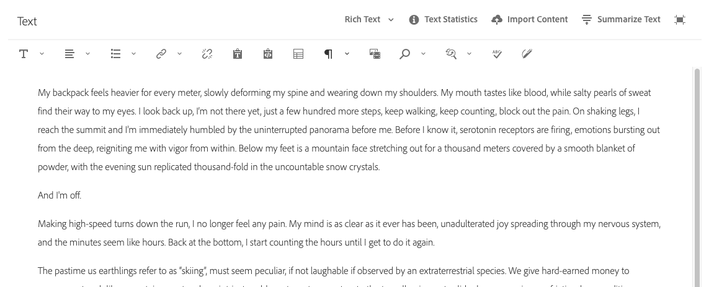
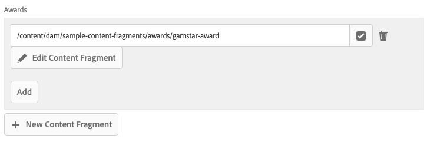
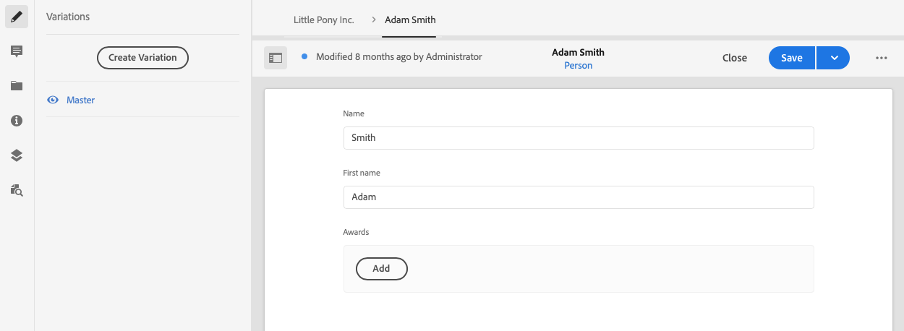
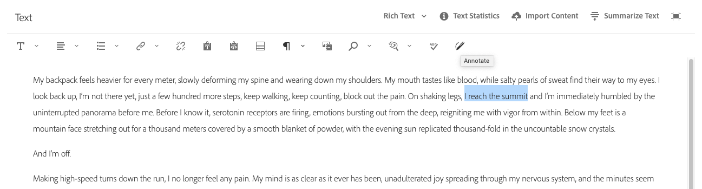

# Variationer - innehåll för redigeringsfragment{#variations-authoring-fragment-content}

[Variationer](/help/assets/content-fragments/content-fragments.md#constituent-parts-of-a-content-fragment) är en viktig funktion för att AEM innehållsfragment, eftersom du kan skapa och redigera kopior av huvudinnehållet för användning i vissa kanaler och/eller scenarier, vilket gör headless-innehållsleverans ännu mer flexibel.

På fliken **Variationer** kan du göra följande:

* [Ange innehållet](#authoring-your-content) för ditt fragment,
* [Skapa och hantera variationer](#managing-variations) av **mallinnehållet**,

Utför en mängd andra åtgärder beroende på vilken datatyp som redigeras, till exempel:

* [Infoga visuella resurser i fragmentet](#inserting-assets-into-your-fragment) (bilder)

* Välj mellan [RTF](#rich-text), [Oformaterad text](#plain-text) och [Markering](#markdown) för redigering

* [Överför innehåll](#uploading-content)

* [Visa nyckelstatistik](#viewing-key-statistics) (om flerradig text)

* [Sammanfatta text](#summarizing-text)

* [Synkronisera varianter med mallinnehåll](#synchronizing-with-master)

>[!CAUTION]
>
>När ett fragment har publicerats och/eller refererats visar AEM en varning när en författare öppnar fragmentet för redigering igen. Detta för att varna för att ändringar i fragmentet även påverkar de refererade sidorna.

## Redigera ditt innehåll {#authoring-your-content}

När du öppnar ditt innehållsfragment för redigering öppnas fliken **Variationer** som standard. Här kan du skapa innehållet, för mallsidor eller andra varianter som du har. Det strukturerade fragmentet innehåller olika fält med olika datatyper som har definierats i innehållsmodellen.

Till exempel:

Du kan:

* Redigera ditt innehåll direkt på fliken **Variationer**. Varje datatyp innehåller olika redigeringsalternativ, till exempel:

   * för **flerradiga textfält** kan du även öppna [helskärmsredigeraren](#full-screen-editor) för att:

      * välj [Format](#formats)
      * se fler redigeringsalternativ (för formatet [RTF](#rich-text))
      * få åtkomst till ett intervall med [åtgärder](#actions)

   * För **fragmentreferensfält** kan alternativet [Redigera innehållsfragment](#fragment-references-edit-content-fragment) vara tillgängligt, beroende på modelldefinitionen.

* Tilldela **taggar** till den aktuella varianten. Du kan lägga till, uppdatera och ta bort taggarna

   * [Taggar](/help/sites-authoring/tags.md) är kraftfulla när du organiserar dina fragment eftersom de kan användas för innehållsklassificering och taxonomi. Taggar kan användas för att söka efter innehåll (efter taggar) och tillämpa gruppåtgärder.

      * Sökningar efter en tagg returnerar fragmentet, med taggvariationen markerad.
      * Variationstaggar kan också användas för att gruppera variationer för en viss CDN-profil (Content Delivery Network) (för CDN-cache) i stället för att använda variantnamnet.

     Du kan till exempel tagga relevanta fragment som&quot;Julstart&quot; så att du bara kan bläddra bland dem som en delmängd, eller kopiera dem för användning med en annan framtida start i en ny mapp.

  >[!NOTE]
  >
  >**Taggar** kan också läggas till (i varianten **Master**) som en del av [Metadata](/help/assets/content-fragments/content-fragments-metadata.md)

* [Skapa och hantera varianter](#managing-variations) av **mallinnehållet**.

### Helskärmsredigerare {#full-screen-editor}

När du redigerar ett textfält med flera rader kan du öppna redigeraren i helskärmsläge. Klicka i själva texten och välj sedan följande åtgärdsikon:

Då öppnas textredigeraren i helskärmsläge:

Textredigeraren i helskärmsläge innehåller följande:

* Åtkomst till olika [åtgärder](#actions)
* Beroende på [format](#formats) kan ytterligare formateringsalternativ användas ([RTF](#rich-text))

### Åtgärder {#actions}

Följande åtgärder är också tillgängliga (för alla [format](#formats)) när helskärmsredigeraren (d.v.s. flerradig text) är öppen:

* Välj [format](#formats) ([RTF](#rich-text), [Oformaterad text,](#plain-text) [Markdown](#markdown))

* [Överför innehåll](#uploading-content)

* [Visa textstatistik](#viewing-key-statistics)

* [Synkronisera med mallsida](#synchronizing-with-master) (när du redigerar en variant)

* [Sammanfatta text](#summarizing-text)

### Format {#formats}

Vilka alternativ du kan använda för att redigera text med flera rader beror på vilket format du har valt:

* [RTF](#rich-text)
* [Oformaterad text](#plain-text)
* [Markering](#markdown)

Formatet kan väljas när helskärmsredigeraren används.

### RTF {#rich-text}

Med textredigering kan du formatera:

* Fet
* Kursiv
* Understruken
* Justering: vänster, mitten, höger
* Punktlista
* Numrerad lista
* Indrag: öka, minska
* Skapa/bryt hyperlänkar
* Klistra in text/text från Word
* Infoga en tabell
* Styckeformat: Stycke, Rubrik 1/2/3
* [Infoga resurs](#inserting-assets-into-your-fragment)
* Öppna helskärmsredigeraren, där följande formateringsalternativ är tillgängliga:
   * Sök
   * Sök/ersätt
   * Stavningskontroll
   * [Anteckningar](/help/assets/content-fragments/content-fragments-variations.md#annotating-a-content-fragment)
* [Infoga innehållsfragment](#inserting-content-fragment-into-your-fragment); tillgängligt när fältet **Flera rader** har konfigurerats med **Tillåt fragmentreferens**.

[åtgärderna](#actions) är även tillgängliga från helskärmsredigeraren.

### Oformaterad text {#plain-text}

Med oformaterad text kan du snabbt lägga in innehåll utan formaterings- eller markeringsinformation. Du kan även öppna helskärmsredigeraren för ytterligare [åtgärder](#actions).

>[!CAUTION]
>
>Om du väljer **Oformaterad text** kan du förlora all formatering, markering och/eller alla resurser som du har infogat i antingen **RTF** eller **Markdown**.

### Markering {#markdown}

>[!NOTE]
>
>Mer information finns i dokumentationen för [Markdown](/help/assets/content-fragments/content-fragments-markdown.md).

På så sätt kan du formatera texten med hjälp av markeringar. Du kan definiera:

* Rubriker
* Stycken och radbrytningar
* Länkar
* Bilder
* Blockcitat
* Listor
* Betoning
* Kodblock
* Backslash Escapes

Du kan även öppna helskärmsredigeraren för ytterligare [åtgärder](#actions).

>[!CAUTION]
>
>Om du växlar mellan **RTF** och **Markdown-kod** kan du få oväntade effekter med Blockcitattecken och Kodblock, eftersom dessa båda format kan hanteras på olika sätt.

### Fragmentreferenser {#fragment-references}

Om innehållsfragmentmodellen innehåller fragmentreferenser kan fragmentförfattarna ha ytterligare alternativ:

* [Redigera innehållsfragment](#fragment-references-edit-content-fragment)
* [Nytt innehållsfragment](#fragment-references-new-content-fragment)

#### Redigera innehållsfragment {#fragment-references-edit-content-fragment}

Alternativet **Redigera innehållsfragment** öppnar det fragmentet på en ny fönsterflik.

<!--
The option **Edit Content Fragment** opens that fragment in a new editor tab (within the same browser tab).

Selecting the original tab again (for example, **Little Pony Inc.**), will close this secondary tab (in this case, **Adam Smith**).

-->

#### Nytt innehållsfragment {#fragment-references-new-content-fragment}

Med alternativet **Nytt innehållsfragment** kan du skapa ett fragment. För att uppnå detta öppnas en variant av guiden Skapa innehållsfragment i redigeraren.

Du kan sedan skapa ett fragment genom att:

1. Navigera till och markera önskad mapp.
1. Markerar **Nästa**.
1. Ange egenskaper, till exempel **Titel**.
1. Markerar **Skapa**.
1. Äntligen:
   1. **Klar** returnerar (till det ursprungliga fragmentet) och refererar till det nya fragmentet.
   1. **Öppna** refererar till det nya fragmentet och öppnar det nya fragmentet för redigering på en ny flik i webbläsaren.

### Visa nyckelstatistik {#viewing-key-statistics}

När helskärmsredigeraren är öppen visar åtgärden **Textstatistik** en rad information om texten.

Till exempel:

### Överför innehåll {#uploading-content}

Om du vill förenkla redigeringen av innehållsfragment kan du överföra text, som har förberetts i en extern redigerare och lägga till den direkt i fragmentet.

### Sammanfatta text {#summarizing-text}

Att sammanfatta text är utformat för att hjälpa användare att minska längden på texten till ett fördefinierat antal ord, samtidigt som man behåller huvudpunkterna och den övergripande innebörden.

>[!NOTE]
>
>På en mer teknisk nivå behåller systemet meningarna som det klassificerar som om de ger det *bästa förhållandet mellan informationstäthet och unikhet* enligt specifika algoritmer.

>[!CAUTION]
>
>Innehållsfragmentet måste ha en giltig språkmapp (ISO-kod) som överordnad. Detta används för att avgöra vilken språkmodell som ska användas.
>
>Till exempel `en/` som i följande sökväg:
>
>  `/content/dam/my-brand/en/path-down/my-content-fragment`

>[!CAUTION]
>
>Engelska finns i körklart skick.
>
>Andra språk är tillgängliga som språkmodellpaket från paketresurs:
>
>* [Franska (fr)](https://experience.adobe.com/#/downloads/content/software-distribution/en/aem.html?package=/content/software-distribution/en/details.html/content/dam/aem/public/adobe/packages/cq630/product/smartcontent-model-fr)
>* [Tyska (de)](https://experience.adobe.com/#/downloads/content/software-distribution/en/aem.html?package=/content/software-distribution/en/details.html/content/dam/aem/public/adobe/packages/cq630/product/smartcontent-model-de)
>* [Italienska (it)](https://experience.adobe.com/#/downloads/content/software-distribution/en/aem.html?package=/content/software-distribution/en/details.html/content/dam/aem/public/adobe/packages/cq630/product/smartcontent-model-it)
>* [Spanska (es)](https://experience.adobe.com/#/downloads/content/software-distribution/en/aem.html?package=/content/software-distribution/en/details.html/content/dam/aem/public/adobe/packages/cq630/product/smartcontent-model-es)
>

1. Välj **mallsida** eller önskad variant.
1. Öppna fullskärmsredigeraren.

1. Välj **Sammanfatta text** i verktygsfältet.

   

1. Ange målantalet ord och välj **Start**:
1. Den ursprungliga texten visas sida vid sida med den föreslagna sammanfattningen:

   * Alla meningar som ska tas bort markeras med rött, med genomstrykning.
   * Klicka på en markerad mening om du vill behålla den i det sammanfattande innehållet.
   * Klicka på en mening som inte är markerad om du vill ta bort den.

1. Markera **Sammanfatta** för att bekräfta ändringarna.

1. Den ursprungliga texten visas sida vid sida med den föreslagna sammanfattningen:

   * Alla meningar som ska tas bort markeras med rött, med genomstrykning.
   * Klicka på en markerad mening om du vill behålla den i det sammanfattande innehållet.
   * Klicka på en mening som inte är markerad om du vill ta bort den.
   * Sammanfattningsstatistiken visas: **Faktiskt** och **Mål**-
   * Du kan **förhandsgranska** ändringarna.

   

### Anteckna ett innehållsfragment {#annotating-a-content-fragment}

Så här kommenterar du ett fragment:

1. Välj **mallsida** eller önskad variant.

1. Öppna fullskärmsredigeraren.

1. Ikonen **Anteckning** är tillgänglig i det övre verktygsfältet. Du kan markera text om det behövs.

   

1. En dialogruta öppnas. Här kan du ange din anteckning.

   

1. Välj **Använd** i dialogrutan.

   

   Om anteckningen tillämpades på den markerade texten förblir den texten markerad.

   

1. Stäng helskärmsredigeraren, anteckningarna är fortfarande markerade. Om du väljer det här alternativet öppnas en dialogruta så att du kan redigera anteckningen ytterligare.

1. Välj **Spara**.

1. Stäng helskärmsredigeraren, anteckningarna är fortfarande markerade. Om du väljer det här alternativet öppnas en dialogruta så att du kan redigera anteckningen ytterligare.

   

### Visa, redigera, ta bort anteckningar {#viewing-editing-deleting-annotations}

Anteckningar:

* Indikeras av markeringen på texten, både i helskärmsläge och i normalt läge i redigeraren. Du kan sedan visa, redigera och/eller ta bort all information i en anteckning genom att klicka på den markerade texten, som öppnar dialogrutan igen.

  >[!NOTE]
  >
  >En nedrullningsbar väljare tillhandahålls om flera anteckningar har tillämpats på ett textstycke.

* När du tar bort hela texten som kommentaren användes på tas även anteckningen bort.

* Kan listas och tas bort genom att välja fliken **Anteckningar** i fragmentredigeraren.

  

* Kan visas och tas bort på [tidslinjen](/help/assets/content-fragments/content-fragments-managing.md#timeline-for-content-fragments) för det valda fragmentet.

### Infoga Assets i fragment {#inserting-assets-into-your-fragment}

Om du vill skapa innehållsfragment enklare kan du lägga till [Assets](/help/assets/manage-assets.md) (bilder) direkt i fragmentet.

De läggs till i fragmentets styckesekvens utan formatering. Formatering kan göras när [fragmentet används/refereras på en sida](/help/sites-authoring/content-fragments.md).

>[!CAUTION]
>
>Dessa resurser kan inte flyttas eller tas bort på en referenssida. Detta måste göras i fragmentredigeraren.
>
>Formatering av resursen (till exempel storlek) måste dock göras i [sidredigeraren](/help/sites-authoring/content-fragments.md). Representationen av resursen i fragmentredigeraren är endast avsedd för redigering av innehållsflödet.

>[!NOTE]
>
>Det finns olika metoder för att lägga till [bilder](/help/assets/content-fragments/content-fragments.md#fragments-with-visual-assets) i fragmentet och/eller på sidan.

1. Placera markören på den plats där du vill lägga till bilden.
1. Använd ikonen **Infoga resurs** för att öppna sökdialogrutan.

   

1. I dialogrutan kan du antingen:

   * navigera till den nödvändiga resursen i DAM
   * söka efter resursen i DAM

   Välj önskad resurs genom att klicka på miniatyrbilden.

1. Använd **Välj** för att lägga till resursen i innehållsfragmentets styckesystem på den aktuella platsen.

   >[!CAUTION]
   >
   >Om du ändrar formatet efter att du har lagt till som resurs i:
   >
   >* **Oformaterad text**: resursen förloras från fragmentet.
   >* **Markering**: Resursen är inte synlig, men är fortfarande här när du återgår till **RTF**.

### Infoga ett innehållsfragment i fragmentet {#inserting-content-fragment-into-your-fragment}

Om du vill skapa innehållsfragment enklare kan du även lägga till ytterligare ett innehållsfragment i fragmentet.

De läggs till som en referens på din aktuella plats i fragmentet.

>[!NOTE]
>
>Det här alternativet är tillgängligt när **Flerradstext** har konfigurerats med **Tillåt fragmentreferens**.

>[!CAUTION]
>
>Dessa resurser kan inte flyttas eller tas bort på en referenssida. Detta måste göras i fragmentredigeraren.
>
>Formatering av resursen (till exempel storlek) måste dock göras i [sidredigeraren](/help/sites-authoring/content-fragments.md). Representationen av resursen i fragmentredigeraren är endast avsedd för redigering av innehållsflödet.

>[!NOTE]
>
>Det finns olika metoder för att lägga till [bilder](/help/assets/content-fragments/content-fragments.md#fragments-with-visual-assets) i fragmentet och/eller på sidan.

1. Placera markören på den plats där du vill lägga till fragmentet.
1. Använd ikonen **Infoga innehållsfragment** för att öppna sökdialogrutan.

   

1. I dialogrutan kan du antingen:

   * navigera till det önskade fragmentet i Assets-mappen
   * sök efter fragmentet

   När fragmentet är placerat markerar du det genom att klicka på miniatyrbilden.

1. Använd **Välj** om du vill lägga till en referens till det markerade innehållsfragmentet i det aktuella innehållsfragmentet (på den aktuella platsen).

   >[!CAUTION]
   >
   >Om du ändrar formatet, efter att ha lagt till en referens till ett annat fragment, till:
   >
   >* **Oformaterad text**: referensen förloras från fragmentet.
   >* **Markering**: referensen återstår.

## Hantera variationer {#managing-variations}

### Skapa en variant {#creating-a-variation}

Med variationer kan du ta **mallinnehållet** och ändra det efter syfte (om det behövs).

Så här skapar du en variant:

1. Öppna fragmentet och se till att sidopanelen är synlig.
1. Välj **Variationer** i ikonfältet på sidpanelen.
1. Välj **Skapa variant**.
1. En dialogruta öppnas. Ange **Rubrik** och **Beskrivning** för den nya varianten.
1. Välj **Lägg till**. Fragmentet **Mallen** kopieras till den nya varianten som nu är öppen för [redigering](#editing-a-variation).

   >[!NOTE]
   >
   >När du skapar en variant är det alltid **mallsidan** som kopieras, inte variationen som är öppen.

   >[!NOTE]
   >
   >När du skapar en variant kopieras alla **taggar** som för närvarande är tilldelade **mallvarianten** till den nya varianten.

### Redigera en variant {#editing-a-variation}

Ändra variantinnehållet efter antingen:

* [Skapar din variation](#creating-a-variation).
* Öppna ett befintligt fragment och välj sedan önskad variation på sidopanelen.

### Byta namn på en variant {#renaming-a-variation}

Så här byter du namn på en befintlig variant:

1. Öppna fragmentet och välj **Variationer** på sidpanelen.
1. Välj önskad variant.
1. Välj **Byt namn** i listrutan **Åtgärder**.

1. Ange den nya **titeln** och/eller **beskrivningen** i dialogrutan som visas.

1. Bekräfta åtgärden **Byt namn**.

>[!NOTE]
>
>Detta påverkar bara variationen **Rubrik**.

### Ta bort en variant {#deleting-a-variation}

Så här tar du bort en befintlig variant:

1. Öppna fragmentet och välj **Variationer** på sidpanelen.
1. Välj önskad variant.
1. Välj **Ta bort** i listrutan **Åtgärder**.

1. Bekräfta åtgärden **Ta bort** i dialogrutan.

>[!NOTE]
>
>Du kan inte ta bort **mallsida**.

### Synkroniserar med mallsida {#synchronizing-with-master}

**Master** är en del av ett innehållsfragment och innehåller per definition huvudkopian av innehållet, medan varianterna innehåller de individuella uppdaterade och anpassade versionerna av det innehållet. När mallsidan uppdateras är det möjligt att dessa ändringar också är relevanta för variationerna och därför måste spridas till dem.

När du redigerar en variant har du tillgång till åtgärden för att synkronisera det aktuella elementet i variationen med mallsidan. På så sätt kan du automatiskt kopiera ändringar som gjorts i mallsidan till önskad variant.

>[!CAUTION]
>
>Synkronisering är bara tillgängligt för att kopiera ändringar *från **mastern**&#x200B;till varianten*.
>
>Endast varianternas aktuella element synkroniseras.
>
>Synkronisering fungerar bara för datatypen **Flerradstext**.
>
>Du kan inte överföra ändringar *från en variant till **mastern***.

<!-- needs new screenshot for synchronize effect -->

1. Öppna ditt innehållsfragment i fragmentredigeraren. Kontrollera att **mallsidan** har redigerats.

1. Välj en specifik variant och sedan lämplig synkroniseringsåtgärd från antingen:

   * den nedrullningsbara menyn **Åtgärder** - **Synkronisera aktuellt element med mallsida**

     

   * verktygsfältet i fullskärmsredigeraren - **Synkronisera med mallsida**

     

1. Mallen och variationen visas sida vid sida:

   * grönt anger att innehåll har lagts till (i varianten)
   * rött anger att innehållet har tagits bort (från varianten)
   * blå anger ersatt text

   

1. Välj **Synkronisera**. Variationen uppdateras och visas.
