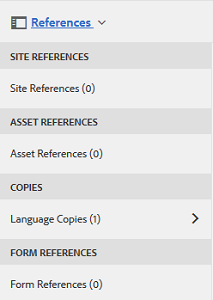
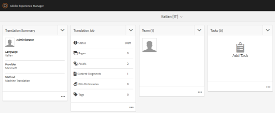
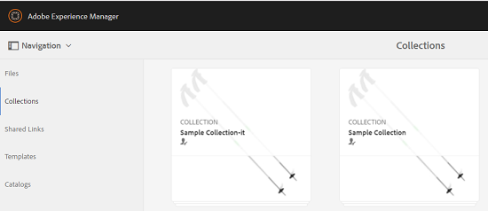

# Skapa översättningsprojekt för innehållsfragment {#creating-translation-projects-for-content-fragments}

Förutom resurser har Adobe Experience Manager (AEM) Assets stöd för språkkopieringsarbetsflöden för [innehållsfragment](content-fragments.md) (inklusive varianter). Ingen ytterligare optimering krävs för att köra språkkopieringsarbetsflöden på innehållsfragment. I varje arbetsflöde skickas hela innehållsfragmentet för översättning.

De typer av arbetsflöden som du kan köra på innehållsfragment liknar exakt de arbetsflödestyper som du kör för resurser. Alternativen som är tillgängliga för varje arbetsflödestyp matchar alternativen som är tillgängliga under motsvarande arbetsflödestyper för resurser.

Du kan köra följande typer av arbetsflöden för språkkopiering på innehållsfragment:

**Skapa och översätta**

I det här arbetsflödet kopieras innehållsfragment som ska översättas till språkroten för det språk som du vill översätta till. Beroende på vilka alternativ du väljer skapas dessutom ett översättningsprojekt för innehållsfragmenten i projektkonsolen. Beroende på inställningarna kan översättningsprojektet startas manuellt eller köras automatiskt så fort översättningsprojektet skapas.

**Uppdatera språkkopior**

När källinnehållets fragment uppdateras eller ändras kräver motsvarande språk-/språkspecifika innehållsfragment omöversättning. Arbetsflödet för att uppdatera språkkopior översätter ytterligare en grupp innehållsfragment och inkluderar det i en språkkopia för en viss språkinställning. I det här fallet läggs de översatta innehållsfragmenten till i målmappen som redan innehåller tidigare översatta innehållsfragment.

## Skapa och översätta arbetsflöde {#create-and-translate-workflow}

Arbetsflödet Skapa och översätt innehåller följande alternativ. Procedurstegen som är kopplade till varje alternativ liknar dem som är kopplade till motsvarande alternativ för tillgångar.

* Skapa endast struktur: Anvisningar om procedurer finns i [Skapa struktur endast för resurser](translation-projects.md#create-structure-only).
* Skapa ett nytt översättningsprojekt: Anvisningar om procedurer finns i [Skapa ett nytt översättningsprojekt för resurser](translation-projects.md#create-a-new-translation-project).
* Lägg till i befintligt översättningsprojekt: Anvisningar om procedurer finns i [Lägga till resurser](translation-projects.md#add-to-existing-translation-project)i ett befintligt översättningsprojekt.

## Uppdatera arbetsflödet för språkkopior {#update-language-copies-workflow}

Arbetsflödet för att uppdatera språkkopior innehåller följande alternativ. Procedurstegen som är kopplade till varje alternativ liknar dem som är kopplade till motsvarande alternativ för tillgångar.

* Skapa ett nytt översättningsprojekt: Anvisningar om procedurer finns i [Skapa ett nytt översättningsprojekt för resurser](translation-projects.md#create-a-new-translation-project) (uppdatera arbetsflöde).
* Lägg till i befintligt översättningsprojekt: Anvisningar om procedurer finns i [Lägg till i befintligt översättningsprojekt för resurser](translation-projects.md#add-to-existing-translation-project) (uppdatera arbetsflöde).

Du kan också skapa tillfälliga språkkopior för fragment som liknar det sätt på vilket du skapar tillfälliga kopior för resurser. Mer information finns i [Skapa tillfälliga språkkopior för resurser](translation-projects.md#creating-temporary-language-copies).

## Översätta blandade mediefragment {#translating-mixed-media-fragments}

Med AEM kan du översätta innehållsfragment som innehåller olika typer av medieresurser och samlingar. Om du översätter ett innehållsfragment som innehåller textbundna resurser lagras de översatta kopiorna av dessa resurser under målspråkets rot.

Om innehållsfragmentet innehåller en samling, översätts resurserna i samlingen tillsammans med innehållsfragmentet. De översatta kopiorna av resurserna lagras i rätt målspråksrot på en plats som matchar den fysiska platsen för källresurserna under källspråkets rot.

Om du vill kunna översätta innehållsfragment som innehåller blandade media måste du först redigera standardöversättningsramverket för att aktivera översättning av textbundna resurser och samlingar som är kopplade till innehållsfragment.

1. Klicka på/tryck på AEM-logotypen och gå till **[!UICONTROL Verktyg > Distribution > Cloud-tjänster]**.
1. Leta upp **[!UICONTROL Översättningsintegrering]** under **[!UICONTROL Adobe Marketing Cloud]** och klicka/tryck på **[!UICONTROL Visa konfigurationer]**.

   

1. Klicka/tryck på **[!UICONTROL Standardkonfiguration (konfiguration för översättningsintegrering)]** i listan över tillgängliga konfigurationer för att öppna sidan **[!UICONTROL Standardkonfiguration]** .

   

1. Klicka på **[!UICONTROL Redigera]** i verktygsfältet för att visa dialogrutan **[!UICONTROL Översättningskonfiguration]** .

   

1. Navigera till fliken **[!UICONTROL Resurser]** och välj **[!UICONTROL Infogade medieresurser och Associerade samlingar]** i listan **[!UICONTROL Översätt resurser]** för innehållsfragment. Klicka/tryck på **[!UICONTROL OK]** för att spara ändringarna.

   

1. Öppna ett innehållsfragment i den engelska rotmappen.

   

1. Klicka/tryck på ikonen **[!UICONTROL Infoga resurs]** .

   

1. Infoga en resurs i innehållsfragmentet.

   

1. Klicka på/tryck på ikonen **[!UICONTROL Associera innehåll]** .

   

1. Klicka/tryck på **[!UICONTROL Associera innehåll]**.

   

1. Markera en samling och ta med den i innehållsfragmentet. Klicka/tryck på **[!UICONTROL Spara]**.

   

1. Markera innehållsfragmentet och klicka/tryck på ikonen **[!UICONTROL GlobalNav]** .
1. Välj **[!UICONTROL Referenser]** på menyn för att visa rutan **[!UICONTROL Referenser]** .

   

1. Klicka/tryck på **[!UICONTROL Språkkopior]** under **[!UICONTROL Kopior]** för att visa språkkopiorna.

   

1. Klicka/tryck på **[!UICONTROL Skapa och översätt]** längst ned på panelen för att visa dialogrutan **[!UICONTROL Skapa och översätt]** .

   

1. Välj målspråk i listan **[!UICONTROL Målspråk]** .

   

1. Välj översättningsprojekttyp i **[!UICONTROL projektlistan]** .

   

1. Ange projektets namn i rutan **[!UICONTROL Projektnamn]** och klicka/tryck sedan på **Skapa**.

   

1. Navigera till **[!UICONTROL projektkonsolen]** och öppna projektmappen för översättningsprojektet som du skapade.

   

1. Klicka/tryck på projektpanelen för att öppna sidan med projektinformation.

   

1. Kontrollera antalet resurser som ska översättas i rutan Översättningsjobb.
1. Starta översättningsjobbet från **[!UICONTROL översättningsjobbpanelen]** .

   

1. Klicka på ellipserna längst ned i rutan Översättningsjobb för att visa översättningsjobbets status.

   

1. Klicka på/tryck på innehållsfragmentet för att kontrollera sökvägen för de översatta associerade resurserna.

   

1. Granska språkkopian för samlingen i konsolen Samlingar.

   

   Observera att endast innehållet i samlingen översätts. Själva samlingen är inte översatt.

1. Navigera till sökvägen för den översatta associerade resursen. Observera att den översatta resursen lagras under målspråkets rot.

   

1. Navigera till resurserna i samlingen som är översatta med innehållsfragmentet. Observera att de översatta kopiorna av resurserna lagras i rätt målspråksrot.

   

   >[!NOTE]
   >
   >Procedurerna för att lägga till ett innehållsfragment i ett befintligt projekt eller för att utföra uppdateringsarbetsflöden liknar motsvarande procedurer för resurser. Vägledning om dessa förfaranden finns i de förfaranden som beskrivs för tillgångar.

