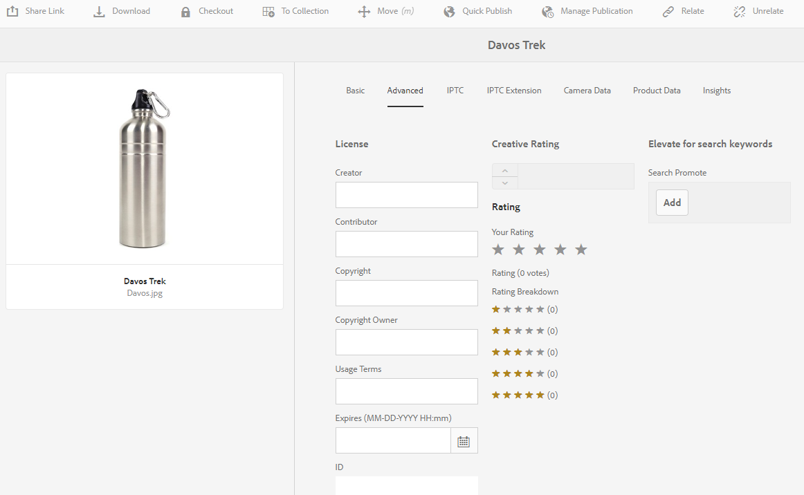

# Digital Rights Management for assets {#digital-rights-management-in-assets}

Digitala resurser är ofta kopplade till en licens som anger användningsvillkoren och hur länge de ska användas. Eftersom [!DNL Adobe Experience Manager Assets] är helt integrerat med [!DNL Experience Manager] plattformen kan du effektivt hantera information om när mediefiler förfaller och resurstillstånd. Du kan även associera licensinformation med resurser.

## Resursens förfallodatum {#asset-expiration}

Att mediefiler förfaller är ett effektivt sätt att tillämpa licenskrav för mediefiler. Det säkerställer att den publicerade resursen inte publiceras när den upphör att gälla, vilket förhindrar eventuella brott mot licensen. En användare utan administratörsbehörighet kan inte redigera, kopiera, flytta, publicera och hämta en utgången resurs.

Du kan visa förfallostatusen för en resurs i [!DNL Assets] konsolen i både kort- och listvyn.

*Bild: I kortvyn anger en flagga på kortet att resursen har gått ut.*

*Bild: I listvyn visas[!UICONTROL Status]bannern i[!UICONTROL Expired]kolumnen.*

Du kan visa förfallostatusen för en resurs i den vänstra [!UICONTROL Timeline] listen.

>[!NOTE]
>
>Utgångsdatumet för en resurs visas olika för användare i olika tidszoner.

Du kan även visa förfallostatusen för resurser på **[!UICONTROL References]** spåret. Den hanterar förfallostatus och relationer mellan sammansatta resurser och refererade delresurser, samlingar och projekt.

1. Navigera till resursen som du vill visa referenser till webbsidor och sammansatta resurser för.
1. Markera resursen och [!DNL Experience Manager] logotypen.

1. Välj **[!UICONTROL References]** på menyn.

   

   För förfallna mediefiler visas förfallostatusen **[!UICONTROL Asset is Expired]** högst upp på referenslinjen.

   

   Om resursen har upphört att gälla visas statusen på referenslinjen **[!UICONTROL Asset has Expired Sub-Assets]**.

   

### Sök efter utgångna resurser {#search-expired-assets}

Du kan söka efter utgångna resurser, inklusive underresurser som gått ut, på sökpanelen.

1. I [!DNL Assets] konsolen klickar du på **[!UICONTROL Search]** i verktygsfältet för att visa rutan Omnissearch.

1. Tryck på returtangenten när markören är i rutan Sök för att visa sidan Sökresultat.

   

1. Klicka på [!DNL Experience Manager] logotypen för att visa sökpanelen.

   

1. Click the **[!UICONTROL Expiry Status]** option to expand it.

   

1. Välj **[!UICONTROL Expired]**. De förfallna resurserna visas i sökresultaten.

   

När du väljer **[!UICONTROL Expired]** [!DNL Assets] alternativet visas bara de resurser och underresurser som har upphört att gälla och som sammansatta resurser refererar till. De sammansatta resurserna som refererar till utgångna delresurser visas inte omedelbart efter att delresurserna har upphört att gälla. I stället visas de när [!DNL Experience Manager] upptäcker att de refererar till utgångna delresurser nästa gång som schemaläggaren körs.

Om du ändrar förfallodatumet för en publicerad resurs till ett datum som är tidigare än den aktuella schemaläggningscykeln, identifierar schemat fortfarande den här resursen som en utgången resurs nästa gång den körs och visar dess status i enlighet med detta.

Om ett fel eller fel dessutom förhindrar att schemaläggaren upptäcker förfallna resurser i den aktuella cykeln, undersöker schemaläggaren om dessa resurser i nästa cykel och identifierar deras förfallna status.

To enable the [!DNL Assets] console to display the referencing compound assets along with the expired subassets, configure an **Adobe CQ DAM Expiry Notification** workflow in [!DNL Experience Manager] Configuration Manager.

1. Öppna [!DNL Experience Manager] Configuration Manager.
1. Choose **[!UICONTROL Adobe CQ DAM Expiry Notification]**. Som standard **[!UICONTROL Time based Scheduler]** markeras, vilket innebär att ett jobb schemaläggs för att kontrollera om en resurs har upphört att gälla eller inte. När jobbet har slutförts visas resurser som har upphört att gälla och refererade resurser som utgångna i sökresultaten.

   

1. Om du vill köra jobbet regelbundet avmarkerar du fältet **[!UICONTROL Time Based Scheduler Rule]** och ändrar tiden i sekunder i fältet **[!UICONTROL Periodic Scheduler]**. Exempeluttrycket ”0 0 0 &amp;ast; &amp;ast; ?” utlöser till exempel jobbet kl. 00.
1. Välj **[!UICONTROL send email]** att ta emot e-postmeddelanden när en mediefil förfaller.

   >[!NOTE]
   >
   >Det är bara den som har skapat mediefilen (den person som överför en viss mediefil till [!DNL Assets]) som får ett e-postmeddelande när mediefilen förfaller. Mer information om hur du konfigurerar e-postmeddelanden finns i [Konfigurera e-postmeddelanden](/help/sites-administering/notification.md) på den övergripande [!DNL Experience Manager] nivån.

1. I **[!UICONTROL Prior notification in seconds]** fältet anger du tiden i sekunder innan en resurs förfaller när du vill få ett meddelande om förfallotiden. Om du är administratör eller den som har skapat resursen får du ett meddelande innan resursen upphör att gälla om att resursen håller på att gå ut efter den angivna tiden.

   När resursen har gått ut får du ett meddelande som bekräftar att den har gått ut. Dessutom inaktiveras utgångna resurser.

1. Klicka på **[!UICONTROL Save]**.

## Tillgångstillstånd {#asset-states}

Konsolen kan [!DNL Assets] visa olika lägen för resurser. Beroende på det aktuella tillståndet för en viss resurs visas en etikett som beskriver dess tillstånd, till exempel Utgången, Publicerad, Godkänd, Avvisad och så vidare, i kortvyn.

1. Välj en resurs i [!DNL Assets] användargränssnittet.

   

1. Klicka **[!UICONTROL Publish]** i verktygsfältet. Om du inte ser **Publicera** i verktygsfältet klickar du **[!UICONTROL More]** i verktygsfältet och letar upp **[!UICONTROL Publish]** alternativet.

   

1. Välj **[!UICONTROL Publish]** på menyn och stäng sedan bekräftelsedialogrutan.
1. Avsluta markeringsläget. Publiceringsstatusen för resursen visas längst ned på miniatyrbilden av resursen i kortvyn. I listvyn visar kolumnen Publicerad den tidpunkt då resursen publicerades.

   

1. I [!DNL Assets] gränssnittet markerar du en resurs och klickar på **[!UICONTROL Properties]** för att visa sidan med resursinformation.

   

1. Ange ett förfallodatum för resursen från **[!UICONTROL Expires]** fältet på fliken Avancerat.

   

   *Bild:[!UICONTROL Advanced]på[!UICONTROL Properties]tillgångssidan för att ange förfallodatum för tillgång.*

1. Klicka **[!UICONTROL Save]** och sedan på **[!UICONTROL Close]** för att visa resurskonsolen.
1. Publiceringsstatusen för resursen anger att den har upphört att gälla längst ned på miniatyrbilden av resursen i kortvyn. I listvyn visas resursens status som **[!UICONTROL Expired]**.

   

1. I [!DNL Assets] konsolen väljer du en mapp och skapar en granskningsåtgärd för mappen.
1. Granska och godkänn/avvisa resurserna i granskningsaktiviteten och klicka på **[!UICONTROL Complete]**.
1. Navigera till mappen som du skapade granskningsaktiviteten för. Statusen för de mediefiler som du har godkänt/avvisat visas längst ned i kortvyn. I listvyn visas status för godkännande och förfallodatum i lämpliga kolumner.

   

1. Om du vill söka efter resurser baserat på deras status, klickar du **[!UICONTROL Search]** för att visa omsökningsfältet.

   

1. Tryck på Retur och klicka **[!UICONTROL GlobalNav]** för att visa sökpanelen.
1. In the search panel, click **[!UICONTROL Publish Status]** and select **[!UICONTROL Published]** to search for published assets in [!DNL Assets].

   

1. Click **[!UICONTROL Approval Status]** and click the appropriate option to search for approved or rejected assets.

   

1. Om du vill söka efter resurser baserat på deras förfallostatus markerar du **[!UICONTROL Expiry Status]** på sökpanelen och väljer lämpligt alternativ.

   

1. Du kan också söka efter resurser baserat på en kombination av statusvärden under olika sökfaktorer. Du kan till exempel söka efter publicerade resurser som har godkänts i en granskningsåtgärd och ännu inte har förfallit genom att välja lämpliga alternativ i sökfunktionerna.

   

## Digital Rights Management i [!DNL Assets] {#digital-rights-management-in-assets-1}

Den här funktionen tvingar till godkännande av licensavtalet innan du kan hämta en licensierad mediefil från [!DNL Adobe Experience Manager Assets].

Om du väljer en skyddad resurs och klickar på **[!UICONTROL Download]** den omdirigeras du till en licenssida för att godkänna licensavtalet. Om du inte godkänner licensavtalet är alternativet inte tillgängligt **[!UICONTROL Download]** .

Om markeringen innehåller flera skyddade resurser markerar du en resurs i taget, godkänner licensavtalet och fortsätter att hämta resursen.

En tillgång anses vara skyddad om något av dessa villkor är uppfyllt:

* Metadataegenskapen för resursen `xmpRights:WebStatement` pekar på sökvägen till sidan som innehåller licensavtalet för resursen.
* Värdet för resursens metadataegenskap `adobe_dam:restrictions` är en rå HTML-kod som anger licensavtalet.

>[!NOTE]
>
>Platsen `/etc/dam/drm/licenses` som användes för att lagra licenser i tidigare versioner av [!DNL Experience Manager] är föråldrad.
>
>Om du skapar eller ändrar licenssidor, eller importerar dem från tidigare [!DNL Experience Manager] versioner, rekommenderar Adobe att du lagrar dem under `/apps/settings/dam/drm/licenses` eller `/conf/&ast;/settings/dam/drm/licenses`.

### Hämta DRM-skyddade resurser {#downloading-drm-assets}

1. I kortvyn väljer du de resurser du vill hämta och klickar på **[!UICONTROL Download]**.
1. På sidan **[!UICONTROL Copyright Management]** väljer du den resurs du vill hämta i listan.
1. Välj i [!UICONTROL License] rutan **[!UICONTROL Agree]**. En bock visas bredvid resursen. Klicka på **[!UICONTROL Download]** alternativet.

   >[!NOTE]
   >
   >The **[!UICONTROL Download]** option is enabled only when you choose to agree to the license agreement for a protected asset. However, if your selection comprises both protected and unprotected assets, only the protected assets are listed in the pane and the **[!UICONTROL Download]** option is enabled to download the unprotected assets. Om du vill acceptera licensavtal för flera skyddade resurser samtidigt markerar du resurserna i listan och väljer sedan **[!UICONTROL Agree]**.

   

1. I dialogrutan klickar du för **[!UICONTROL Download]** att hämta resursen eller dess återgivningar.
