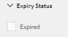

# Digital Rights Management for digital assets {#digital-rights-management-in-assets}

Digitala resurser är ofta kopplade till en licens, som anger användningsvillkoren och hur länge de ska användas. Eftersom Adobe Experience Manager Assets (AEM) är helt integrerat med AEM-plattformen kan ni effektivt hantera information om när mediefiler förfaller och resursstatus. Du kan även associera licensinformation med resurser.

## Resursens förfallodatum {#asset-expiration}

Att mediefiler förfaller är ett effektivt sätt att genomdriva licenskrav för mediefiler. Det säkerställer att den publicerade resursen inte publiceras när den upphör att gälla, vilket förhindrar eventuella brott mot licensen. En användare utan administratörsbehörighet kan inte redigera, kopiera, flytta, publicera och hämta en utgången resurs.

Du kan visa förfallostatusen för en resurs i resurskonsolen i både kort- och listvyn.

*Bild: I kortvyn anger en flagga på kortet att resursen har gått ut.*

**Listvy**

*Bild: I listvyn visar kolumnen[!UICONTROL Status]bannern[!UICONTROL Förfallen].*

 Du kan visa förfallostatusen för en resurs på tidslinjen. Markera resursen och välj Tidslinje på menyn GlobalNav.

 Du kan även visa förfallostatusen för resurser på **[!UICONTROL referenslisten]** . Den hanterar förfallostatus och relationer mellan sammansatta resurser och refererade delresurser, samlingar och projekt.

1. Navigera till resursen som du vill visa referenser till webbsidor och sammansatta resurser för.
1. Markera resursen och Experience Manager-logotypen.

1. Välj **[!UICONTROL Referenser]** på menyn.

   

   För förfallna mediefiler visas **[!UICONTROL mediefilens förfallostatus längst upp på referenslinjen]** .

   

   Om resursen har upphört att gälla visas statusen **[!UICONTROL Tillgång har förfallna delresurser]** i referensfältet.

   

### Sök efter utgångna resurser {#search-expired-assets}

Du kan söka efter utgångna resurser, inklusive underresurser som gått ut, på sökpanelen.

1. I resurskonsolen klickar du på **[!UICONTROL Sök]** i verktygsfältet för att visa rutan Sök.

1. Tryck på returtangenten när markören är i rutan Sök för att visa sidan Sökresultat.

   

1. Klicka på Experience Manager-logotypen för att visa sökpanelen.

   

1. Klicka/tryck på alternativet **[!UICONTROL Förfallostatus]** för att expandera det.

   

1. Välj **[!UICONTROL Förfallen]**. De förfallna resurserna visas i sökresultaten.

   

När du väljer alternativet **Utgånget** visas bara de förfallna resurserna och delresurserna som sammansatta resurser refererar till i resurskonsolen. De sammansatta resurserna som refererar till utgångna delresurser visas inte omedelbart efter att delresurserna har upphört att gälla. I stället visas de när AEM Resurser har identifierat att de refererar till utgångna delresurser nästa gång som schemaläggaren körs.

Om du ändrar förfallodatumet för en publicerad resurs till ett datum som är tidigare än den aktuella schemaläggningscykeln, identifierar schemat fortfarande den här resursen som en utgången resurs nästa gång den körs och visar dess status i enlighet med detta.

Om ett fel eller fel dessutom förhindrar att schemaläggaren upptäcker förfallna resurser i den aktuella cykeln, undersöker schemaläggaren om dessa resurser i nästa cykel och identifierar deras förfallna status.

Om du vill att resurskonsolen ska kunna visa de sammansatta resurserna tillsammans med de delresurser som har gått ut, konfigurerar du ett arbetsflöde för **Adobe CQ DAM-meddelande** om förfallodatum i AEM Configuration Manager.

1. Öppna AEM Configuration Manager.
1. Välj **[!UICONTROL Adobe CQ DAM Expiry Notification]**. Som standard är **[!UICONTROL Tidsbaserad schemaläggare]** markerad, vilket schemalägger ett jobb att vid en viss tidpunkt kontrollera om en resurs har upphört att gälla eller inte. När jobbet har slutförts visas resurser som har upphört att gälla och refererade resurser som utgångna i sökresultaten.

   

1. Om du vill köra jobbet regelbundet avmarkerar du fältet **[!UICONTROL Tidsbaserad schemaläggarregel]** och ändrar tiden i sekunder i fältet **[!UICONTROL Periodisk schemaläggare]** . Exempeluttrycket &#39;0 0 0 &amp;ast; &amp;ast; ? utlöser jobbet vid 00 timmar.
1. Välj **[!UICONTROL Skicka e-post]** om du vill få e-post när en mediefil förfaller.

   >[!NOTE]
   >
   >Det är bara den som har skapat mediefilen (den person som överför en viss mediefil till AEM Resurser) som får ett e-postmeddelande när mediefilen upphör att gälla. Mer information om hur du konfigurerar e-postmeddelanden finns i [Konfigurera e-postmeddelanden](/help/sites-administering/notification.md) på den övergripande AEM-nivån.

1. I fältet **[!UICONTROL Förhandsmeddelande i sekunder]** anger du tiden i sekunder innan en resurs förfaller när du vill få ett meddelande om förfallotiden. Om du är administratör eller den som har skapat resursen får du ett meddelande innan resursen upphör att gälla om att resursen håller på att gå ut efter den angivna tiden.

   När resursen har gått ut får du ett meddelande som bekräftar att den har gått ut. Dessutom inaktiveras utgångna resurser.

1. Click **[!UICONTROL Save]**.

## Tillgångstillstånd {#asset-states}

Resurskonsolen för Adobe Experience Manager-resurser (AEM) kan visa olika lägen för resurser. Beroende på det aktuella tillståndet för en viss resurs visas en etikett som beskriver dess tillstånd, till exempel Utgången, Publicerad, Godkänd, Avvisad och så vidare, i kortvyn.

1. Välj en resurs i användargränssnittet Resurser.

   

1. Tryck på **[!UICONTROL Publicera]** i verktygsfältet. Om du inte ser **Publicera** i verktygsfältet trycker du på **[!UICONTROL Mer]** i verktygsfältet och letar upp alternativet **[!UICONTROL Publicera]** .

   

1. Välj **[!UICONTROL Publicera]** på menyn och stäng sedan bekräftelsedialogrutan.
1. Avsluta markeringsläget. Publiceringsstatusen för resursen visas längst ned på miniatyrbilden av resursen i kortvyn. I listvyn visar kolumnen Publicerad den tidpunkt då resursen publicerades.

   

1. I resursgränssnittet markerar du en resurs och trycker på **[!UICONTROL Egenskaper]** för att visa sidan med resursinformation.

   

1. På fliken Avancerat anger du ett förfallodatum för resursen i fältet **[!UICONTROL Förfaller]** under.

   

1. Klicka på **[!UICONTROL Spara]** och sedan på **[!UICONTROL Stäng]** för att visa resurskonsolen.
1. Publiceringsstatusen för resursen anger att den har upphört att gälla längst ned på miniatyrbilden av resursen i kortvyn. I listvyn visas resursens status som **[!UICONTROL Förfallen]**.

   

1. I resurskonsolen väljer du en mapp och skapar en granskningsåtgärd för mappen.
1. Granska och godkänn/avvisa resurserna i granskningsaktiviteten och klicka på **[!UICONTROL Slutför]**.
1. Navigera till mappen som du skapade granskningsaktiviteten för. Statusen för de mediefiler som du har godkänt/avvisat visas längst ned i kortvyn. I listvyn visas status för godkännande och förfallodatum i lämpliga kolumner.

   

1. Om du vill söka efter resurser baserat på deras status trycker du på **[!UICONTROL Sök]** för att visa omsökningsfältet.

   

1. Tryck på retur och tryck sedan på **[!UICONTROL GlobalNav]** för att visa sökpanelen.
1. På sökpanelen trycker/klickar du på **[!UICONTROL Publiceringsstatus]** och väljer **[!UICONTROL Publicerad]** för att söka efter publicerade resurser i AEM Resurser.

   

1. Tryck/klicka på **[!UICONTROL Godkännandestatus]** och klicka på lämpligt alternativ för att söka efter godkända eller avvisade resurser.

   

1. Om du vill söka efter resurser baserat på deras förfallostatus väljer du **[!UICONTROL Förfallostatus]** på sökpanelen och väljer lämpligt alternativ.

   

1. Du kan också söka efter resurser baserat på en kombination av statusvärden under olika sökfaktorer. Du kan till exempel söka efter publicerade resurser som har godkänts i en granskningsåtgärd och ännu inte har förfallit genom att välja lämpliga alternativ i sökfunktionerna.

   

## Digital Rights Management in Assets {#digital-rights-management-in-assets-1}

Den här funktionen tvingar dig att godkänna licensavtalet innan du kan hämta en licensierad mediefil från Adobe Experience Manager (AEM) Assets.

Om du väljer en skyddad resurs och trycker på **[!UICONTROL Hämta]** omdirigeras du till en licenssida där du godkänner licensavtalet. Om du inte godkänner licensavtalet inaktiveras knappen **[!UICONTROL Hämta]** .

Om markeringen innehåller flera skyddade resurser markerar du en resurs i taget, godkänner licensavtalet och fortsätter att hämta resursen.

En tillgång anses vara skyddad om något av dessa villkor är uppfyllt:

* Metadataegenskapen för resursen `xmpRights:WebStatement` pekar på sökvägen till CQ-sidan som innehåller licensavtalet för resursen.
* Värdet för resursens metadataegenskap `adobe_dam:restrictions` är en rå HTML-kod som anger licensavtalet.

>[!NOTE]
>
>Platsen `/etc/dam/drm/licenses` som användes för att lagra licenser i tidigare versioner av AEM är föråldrad.
>
>Om du skapar eller ändrar licenssidor, eller importerar dem från tidigare AEM-versioner, rekommenderar Adobe att du lagrar dem under `/apps/settings/dam/drm/licenses` eller `/conf/&ast;/settings/dam/drm/licenses`.

### Hämta DRM-skyddade resurser {#downloading-drm-assets}

1. I kortvyn väljer du de resurser du vill hämta och klickar på **[!UICONTROL Hämta]**.
1. På sidan **[!UICONTROL Copyrighthantering]** väljer du den resurs du vill hämta i listan.
1. Välj **[!UICONTROL Godkänn]** i licensfönstret. En bock visas bredvid den mediefil som du godkänner licensavtalet för. Tryck/klicka på knappen **[!UICONTROL Hämta]** .

   >[!NOTE]
   >
   >Knappen **[!UICONTROL Hämta]** är bara aktiverad när du väljer att godkänna licensavtalet för en skyddad resurs. Om urvalet omfattar både skyddade och oskyddade resurser visas bara de skyddade resurserna i den vänstra rutan och knappen **[!UICONTROL Hämta]** aktiveras för att hämta de oskyddade resurserna. Om du vill acceptera licensavtal för flera skyddade tillgångar samtidigt markerar du resurserna i listan och väljer sedan **[!UICONTROL Godkänn]**.

   

1. I dialogrutan trycker/klickar du på **[!UICONTROL Hämta]** för att hämta resursen eller dess återgivningar.
