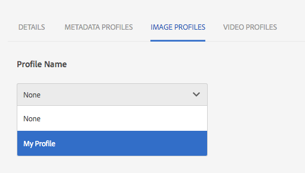
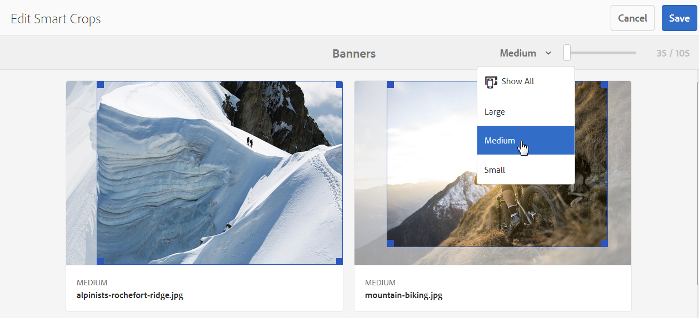

# Dynamiska mediebildprofiler {#image-profiles}

När du överför bilder kan du beskära bilden automatiskt vid överföring genom att tillämpa en bildprofil på mappen.

>[!IMPORTANT]
>
>* Smart beskärning är bara tillgängligt i läget Dynamic Media - Scene7.
>* Bildprofiler gäller inte för PDF-, GIF- eller INDD-filer (Adobe InDesign).

## Beskärningsalternativ {#crop-options}

När du implementerar Smart Crop på bilder rekommenderar Adobe följande bästa praxis och tillämpar följande gräns:

| Begränsningstyp | Bästa praxis | Begränsning har införts |
| --- | --- | --- |
| Antal smarta beskärningar per bild | 5 | 100 |

Se även [Dynamiska mediebegränsningar](/help/assets/limitations.md).

<!-- CQDOC-16069 for paragraph directly below -->

Koordinaterna för smart beskärning är proportionella. För de olika inställningarna för smart beskärning i en bildprofil skickas samma proportioner till Dynamic Media om proportionerna är desamma för de tillagda dimensionerna i bildprofilen. Adobe rekommenderar att du använder samma beskärningsområde. Om du gör det ser du till att de olika måtten som används i bildprofilen inte påverkas.

Varje generering av Smart Crop som du skapar kräver extra bearbetning. Om du till exempel lägger till mer än fem proportioner för smart beskärning kan det leda till en långsam intag av resurser. Det medför också ökad belastning på systemen. Eftersom du kan använda SmartCrop på mappnivå rekommenderar Adobe att du bara använder det på mapparna ** där det behövs.

**Riktlinjer för att definiera smart beskärning i en bildprofil**
Adobe rekommenderar följande riktlinjer och tips för att behålla kontrollen över användningen av Smart Crop och för att optimera bearbetningstiden och lagringen av beskärningar:

* Bildresurser som ska ha en smart beskärning måste vara minst 50 x 50 pixlar eller större.
* Helst bör du ha 10-15 smarta beskärningar per bild som optimerar för skärmproportioner och bearbetningstid.
* Namnge smarta beskärningar baserat på beskärningsdimensioner, inte på slutanvändning. På så sätt kan du optimera för dubbletter där en enda dimension används på flera sidor.
* Skapa sidvisa/resurstypsvisa bildprofiler för specifika mappar och undermappar i stället för en gemensam smart beskärningsprofil som tillämpas på alla mappar eller alla resurser.
* En bildprofil som du använder för undermappar åsidosätter en bildprofil som används för mappen.
* En bildprofil som innehåller duplicerade smarta beskärningsdimensioner tillåts inte.
* Det är inte tillåtet att duplicera namngivna bildprofiler med smarta beskärningsalternativ.

Du kan välja mellan två bildbeskärningsalternativ: Pixelbeskärning eller Smart beskärning. Du kan också välja att automatisera skapandet av färg- och bildfärgrutor.

>[!IMPORTANT]
>
>* Adobe rekommenderar att du granskar alla genererade beskärningar och färgrutor för att se till att de är lämpliga och relevanta för ert varumärke och era värden.
>* CMYK-bildformatet stöds inte med smart beskärning.

| Alternativ | När ska du använda | Beskrivning |
| --- | --- | --- |
| Pixelbeskärning | Beskär bilder i grupp endast baserat på dimensioner. | Om du vill använda det här alternativet väljer du **[!UICONTROL Pixel Crop]** i listrutan Beskärningsalternativ.  Om du vill beskära från sidorna av en bild anger du antalet pixlar som ska beskäras från valfri sida eller från varje sida av bilden. Hur mycket av bilden som beskärs beror på bildfilens ppi-inställning (pixlar per tum).  En bildprofils pixelbeskärning återges på följande sätt:  ・ är Överkant, Underkant, Vänster och Höger.  ・ uppe till vänster räknas som `0,0` och pixelbeskärningen beräknas därifrån.  ・ startpunkt för beskärning: Vänster är X och Överkant är Y  ・ Vågrät beräkning: vågrät pixeldimension för originalbilden minus Vänster och sedan minus Höger.  ・ Lodrät beräkning: lodrät pixelhöjd minus Överkant och sedan minus Underkant.  Anta till exempel att du har en bild på 4 000 x 3 000 pixlar. Använd värden: Top=250, Bottom=500, Left=300, Right=700.  Från övre vänstra (300,250) beskär med fyllningsutrymmet (4000-300-700, 3000-250-500 eller 3000,2250). |
| Smart beskärning | Massbeskär bilder baserat på deras visuella fokalpunkt. | Smart Crop använder intelligensen i Adobe Sensei för att snabbt automatisera beskärningen av bilder i bulk. Smart Crop identifierar och beskär automatiskt fokalpunkten i alla bilder för att fånga den avsedda intressepunkten, oavsett skärmstorlek.
 
Om du vill använda Smart beskärning väljer du **[!UICONTROL Smart Crop]** i listrutan Beskärningsalternativ och aktiverar sedan funktionen till höger om Responsiv bildbeskärning.
 
Standardbrytpunktsstorlekarna för stora, Medium och små täcker i allmänhet alla de storlekar som de flesta bilder används för mobila enheter och surfplattor, datorer och banners. Om du vill kan du redigera standardnamnen Stora, Medium och Små.
 
Om du vill lägga till fler brytpunkter väljer du **[!UICONTROL Add Crop]** för att ta bort en beskärning och väljer ikonen Skräpburk. |
| Färg och bildfärgruta | Med Massor genereras en färgruta för varje bild. | **Obs!**: Smarta färgrutor stöds inte i Dynamic Media Classic.  Hitta och generera högkvalitativa färgrutor automatiskt från produktbilder som visar färg eller struktur.  Om du vill använda färg- och bildfärgruta väljer du **[!UICONTROL Smart Crop]** i listrutan Beskärningsalternativ. Aktivera sedan funktionen till höger om Färg och Bildfärgruta. Ange ett pixelvärde i textrutorna för bredd och höjd.  Alla bildbeskärningar är tillgängliga från renderingslisten, men färgrutor används bara via funktionen Kopiera URL. Använd en egen visningskomponent för att återge färgrutan på webbplatsen. (Undantaget till den här regeln är Carousel banners. Dynamic Media är visningskomponenten för den färgruta som används i karusellbanderoller.)  **Använda färgrutor för bilder**  URL:en för färgrutor för bilder är enkel. Det är:  `/is/image/company/&lt;asset_name&gt;:Swatch` där `:Swatch` läggs till i resursbegäran.  **Använda färgrutor**  Om du vill använda färgrutor gör du en `req=userdata`-förfrågan med följande: `/is/image/&lt;company_name&gt;/&lt;swatch_asset_name&gt;:Swatch?req=userdata`  Följande är till exempel en färgruteresurs i Dynamic Media Classic: `https://my.company.com:8080/is/image/DemoCo/Sleek:Swatch` och här är färgruteresursens motsvarande `req=userdata` URL: `https://my.company.com:8080/is/image/DemoCo/Sleek:Swatch?req=userdata`  Svaret `req=userdata` är följande: `SmartCropDef=Swatch SmartCropHeight=200.0` `SmartCropRect=0.421671,0.389815,0.0848564,0.0592593,200,200` `SmartCropType=Swatch` `SmartCropWidth=200.0` `SmartSwatchColor=0xA56DB2`  Du kan även begära ett `req=userdata`-svar i antingen XML- eller JSON-format, som i följande: respektive URL-exempel: `https://my.company.com:8080/is/image/DemoCo/Sleek:Swatch?req=userdata,json` `https://my.company.com:8080/is/image/DemoCo/Sleek:Swatch?req=userdata,xml`  **Obs!** Skapa en egen WCM-komponent för att begära en färgruta och tolka attributet `SmartSwatchColor` , som representeras av ett 24-bitars hexadecimalt RGB-värde.  Se även [`userdata` i referenshandboken för visningsprogram](https://experienceleague.adobe.com/sv/docs/dynamic-media-developer-resources/image-serving-api/image-serving-api/http-protocol-reference/command-reference/req/r-userdata). |

## Oskarp mask {#unsharp-mask}

Använd **[!UICONTROL Unsharp mask]** för att finjustera en skärpefiltereffekt på den slutliga nedsamplade bilden. Du kan styra effektens intensitet, radie (mätt i pixlar) och ett tröskelvärde för kontrast som ignoreras. Den här effekten använder samma alternativ som Adobe Photoshop *Oskarp mask*-filter.

>[!NOTE]
>
>Den oskarpa masken används bara för nedskalade återgivningar i PTIFF (pyramidformade gånger) som nedsamplas till mer än 50 %. Det innebär att de största återgivningarna i mönstret inte påverkas av den oskarpa masken, medan mindre återgivningar som miniatyrbilder ändras (och den oskarpa masken visas).

I **[!UICONTROL Unsharp Mask]** har du följande filtreringsalternativ:

| Alternativ | Beskrivning |
| --- | --- |
| Belopp | Styr mängden kontrast som används på kantpixlar. Standardvärdet är 1,75. För högupplösta bilder kan du öka den till upp till 5. Tänk på Mängd som ett mått på filterintensiteten. Intervallet är 0-5. |
| Radie | Anger antalet pixlar runt kantpixlarna som påverkar skärpan. För högupplösta bilder anger du 1 till 2. Med ett lågt värde ökas skärpan endast för kantpixlarna. Med ett högt värde ökas skärpan för ett bredare intervall av pixlar. Vilket värde som är korrekt beror på bildens storlek. Standardvärdet är 0,2. Intervallet är 0-250. |
| Tröskelvärde | Anger det kontrastintervall som ska ignoreras när det oskarpa maskfiltret används. Med andra ord, det här alternativet avgör hur olika de pixlar som ska göras skarpare måste vara från det omgivande området innan de betraktas som kantpixlar och blir skarpare. Experimentera med värden mellan 0 och 255 för att undvika brus. |

Skärpa beskrivs i [Skärpa bilder](/help/assets/assets/sharpening_images.pdf).

## Skapa dynamiska mediebildprofiler {#creating-image-profiles}

Mer information om hur du definierar avancerade bearbetningsparametrar för andra resurstyper finns i [Konfigurera resursbearbetning](config-dms7.md#configuring-asset-processing).

Se [Profiler för bearbetning av metadata, bilder och videoklipp](processing-profiles.md).

Se även [Bästa metoder för att ordna din digitala Assets för att använda Bearbeta profiler](/help/assets/organize-assets.md).

**Så här skapar du dynamiska medieavbildningsprofiler:**

1. Välj Adobe Experience Manager logotyp och gå till **[!UICONTROL Tools]** > **[!UICONTROL Assets]** > **[!UICONTROL Image Profiles]**.
1. Välj **[!UICONTROL Create]** så att du kan lägga till en bildprofil.
1. Ange ett profilnamn och värden för oskarp mask, beskärning eller färgruta, eller båda.

   Använd ett profilnamn som är specifikt för dess avsedda syfte. Om du till exempel vill skapa en profil som bara genererar färgrutor, d.v.s. smart beskärning är inaktiverat (inaktiverat) och Färg och Bildruta är aktiverat (aktiverat), använder du profilnamnet&quot;Smarta färgrutor&quot;.

   Se även [Alternativ för smart beskärning och smarta färgrutor](#crop-options) och [Oskarp mask](#unsharp-mask).

   

1. Välj **[!UICONTROL Save]**. Den nya profilen visas i listan med tillgängliga profiler.

## Redigera eller ta bort dynamiska mediebildprofiler {#editing-or-deleting-image-profiles}

1. Välj Experience Manager logotyp och gå till **[!UICONTROL Tools]** > **[!UICONTROL Assets]** > **[!UICONTROL Image Profiles]**.
1. Markera den bildprofil som du vill redigera eller ta bort. Om du vill redigera den väljer du **[!UICONTROL Edit Image Profile]**. Om du vill ta bort den väljer du **[!UICONTROL Delete Image Profile]**.

   

1. Spara ändringarna om du redigerar dem. Bekräfta att du vill ta bort profilen om du tar bort den.

## Använd en dynamisk mediebildprofil för mappar {#applying-an-image-profile-to-folders}

När du tilldelar en bildprofil till en mapp ärver alla undermappar automatiskt profilen från den överordnade mappen. Det här arbetsflödet innebär att du bara kan tilldela en bildprofil till en mapp. Fundera därför noga över mappstrukturen för var du överför, lagrar, använder och arkiverar resurser.

Om du tilldelade en annan bildprofil till en mapp åsidosätter den nya profilen den tidigare profilen. De tidigare befintliga mappresurserna ändras inte. Den nya profilen används för resurser som läggs till i mappen senare.

Mappar som har tilldelats en profil visas i användargränssnittet med profilnamnet som visas på kortet.

<!-- When you add smart crop to an existing Image Profile, you need to re-trigger the [DAM Update Asset workflow](assets-workflow.md) if you want to generate crops for existing assets in your asset repository. -->

Du kan tillämpa bildprofiler på specifika mappar eller globalt på alla resurser.

Du kan bearbeta resurser i en mapp som redan har en befintlig bildprofil som du senare ändrade. Se [Bearbeta resurser i en mapp igen när du har redigerat dess bearbetningsprofil](processing-profiles.md#reprocessing-assets).

### Använd dynamiska mediebildprofiler på specifika mappar {#applying-image-profiles-to-specific-folders}

Du kan tillämpa en bildprofil på en mapp från menyn **[!UICONTROL Tools]** eller från **[!UICONTROL Properties]** om du är i mappen. I det här avsnittet beskrivs hur du tillämpar bildprofiler på mappar på båda sätten.

För mappar som redan har tilldelats en profil visas profilens namn direkt under mappnamnet.

Du kan bearbeta resurser i en mapp som redan har en befintlig videoprofil som du senare ändrade. Se [Bearbeta resurser i en mapp igen när du har redigerat dess bearbetningsprofil](processing-profiles.md#reprocessing-assets).

#### Använd dynamiska mediebildprofiler på mappar från användargränssnittet för profiler {#applying-image-profiles-to-folders-from-profiles-user-interface}

1. Välj Experience Manager logotyp och gå till **[!UICONTROL Tools]** > **[!UICONTROL Assets]** > **[!UICONTROL Image Profiles]**.
1. Välj den bildprofil som du vill använda för en eller flera mappar.

   

1. Markera **[!UICONTROL Apply Processing Profile to Folders]** och markera den eller de mappar som du vill använda för att ta emot de nyligen överförda resurserna och välj **[!UICONTROL Apply]**. För mappar som redan har tilldelats en profil visas profilens namn direkt under mappnamnet.

#### Använd dynamiska mediebildprofiler på mappar från Egenskaper {#applying-image-profiles-to-folders-from-properties}

1. Välj Experience League logotyp och gå till **[!UICONTROL Assets]**. Navigera sedan till den överordnade mappen för den mapp som du vill tillämpa en bildprofil på.
1. Markera kryssmarkeringen i mappen för att markera den och välj sedan **[!UICONTROL Properties]**.
1. Välj fliken **[!UICONTROL Image Profiles]**. Välj profilen i listrutan **[!UICONTROL Profile Name]** och välj sedan **[!UICONTROL Save & Close]**. För mappar som redan har tilldelats en profil visas profilens namn direkt under mappnamnet.

   

### Använd en dynamisk mediebildprofil globalt {#applying-an-image-profile-globally}

Förutom att tillämpa en profil på en mapp kan du även tillämpa en profil globalt så att allt innehåll som överförs till Experience Manager-resurser i en mapp har den valda profilen.

Du kan bearbeta resurser i en mapp som redan har en befintlig videoprofil som du senare ändrade. Se [Återbearbeta resurser i en mapp när du har redigerat dess bearbetningsprofil](processing-profiles.md#reprocessing-assets).

**Så här använder du en dynamisk mediabildprofil globalt:**

1. Gör något av följande:

   * Navigera till `https://&lt;AEM server&gt;/mnt/overlay/dam/gui/content/assets/foldersharewizard.html/content/dam` och använd rätt profil och välj **[!UICONTROL Save]**.

     

   * Navigera till CRXDE Lite till följande nod: `/content/dam/jcr:content`.

     Lägg till egenskapen `imageProfile:/conf/global/settings/dam/adminui-extension/imageprofile/<name of image profile>` och välj **[!UICONTROL Save All]**.

     

## Redigera smart beskärning eller smarta färgrutor för en enskild bild {#editing-the-smart-crop-or-smart-swatch-of-a-single-image}

>[!IMPORTANT]
>
>* Smart beskärning är bara tillgängligt i läget Dynamic Media - Scene7.

Du kan justera eller ändra storlek på bildens smarta beskärningsfönster manuellt för att ytterligare förfina fokalpunkten.

När du har redigerat en smart beskärning och sparat sprids ändringen överallt där du använder beskärningen för de specifika bilderna.

Kör om smart beskärning för att generera ytterligare beskärningar om det behövs.

Se även [Redigera den smarta beskärningen eller den smarta färgrutan för flera bilder](#editing-the-smart-crop-or-smart-swatch-of-multiple-images).

**Så här redigerar du den smarta beskärningen eller den smarta färgrutan för en enskild bild:**

1. Markera Experience Manager-logotypen och navigera till **[!UICONTROL Assets]**, och sedan till den mapp där en smart beskärning eller en smart färgrutebildprofil används.
1. Markera mappen så att du kan öppna dess innehåll.
1. Markera den bild vars smarta beskärning eller smarta färgruta du vill justera.
1. Välj **[!UICONTROL Smart Crop]** i verktygsfältet.

   >[!TIP]
   >
   >Använd snabbtangenten `s` för att redigera smarta beskärningar eller smarta färgrutor.

1. Gör något av följande:

   * I närheten av det övre högra hörnet av sidan drar du skjutreglaget åt vänster eller höger för att öka respektive minska visningen av bilden.
   * Dra i ett hörnhandtag på bilden för att justera storleken på det visningsbara området för beskärningen eller färgrutan.
   * Dra rutan/färgrutan till en ny plats på bilden. Du kan bara redigera färgrutor. Färgrutor är statiska.
   * Markera **[!UICONTROL Revert]** ovanför bilden om du vill ångra alla redigeringar och återställa den ursprungliga beskärningen eller färgrutan.

1. I närheten av sidans övre högra hörn väljer du **[!UICONTROL Save]** och sedan **[!UICONTROL Close]** för att gå tillbaka till resursmappen.

## Redigera smart beskärning eller smart färgruta för flera bilder {#editing-the-smart-crop-or-smart-swatch-of-multiple-images}

>[!IMPORTANT]
>
>* Smart beskärning är bara tillgängligt i läget Dynamic Media - Scene7.

När du har tillämpat en bildprofil - som innehåller smart beskärning - på en mapp tillämpas en beskärning på alla bilder i den mappen. Om du vill kan du *manuellt* justera eller ändra storlek på det smarta beskärningsfönstret i flera bilder för att ytterligare förfina fokalpunkten.

När du har redigerat en smart beskärning och sparat sprids ändringen överallt där du använder beskärningen för de specifika bilderna.

Kör om smart beskärning för att generera ytterligare beskärningar om det behövs.

**Så här redigerar du den smarta beskärningen eller den smarta färgrutan för flera bilder:**

1. Markera Experience Manager-logotypen och navigera till **[!UICONTROL Assets]**, och sedan till en mapp där en smart beskärningsbildprofil eller en smart färgrutebildprofil används.
1. I mappen väljer du ikonen **[!UICONTROL More Actions]** (..) och sedan **[!UICONTROL Smart Crop]**.

1. Gör något av följande på sidan **[!UICONTROL Edit Smart Crops]**:

   * Justera visningsstorleken för bilder på sidan.

     Dra skjutreglaget åt vänster eller höger till höger om listrutan för brytpunktsnamn om du vill ändra storleken på den visningsbara bilden.

     

   * Filtrera listan med visningsbara bilder baserat på brytpunktsnamn. I exemplet nedan filtreras bilderna efter brytpunktsnamnet&quot;Medium&quot;.

     I den nedrullningsbara listan i det övre högra hörnet av sidan väljer du ett brytpunktsnamn som du vill filtrera efter vilka bilder du ser. (Se bilden ovan.)

     

   * Ändra storlek på den smarta beskärningsrutan. Gör något av följande:

      * Om bilden har en smart beskärning eller endast en smart färgruta drar du i hörnhandtaget för beskärningsrutan för att justera storleken på beskärningsområdets visningsbara område.
      * Om bilden har både en smart beskärning och en smart färgruta drar du i hörnhandtaget för beskärningsrutan för att justera storleken på beskärningens visningsbara område. Du kan också markera den smarta färgrutan under bilden (färgrutorna är statiska) och sedan dra i hörnhandtaget för beskärningsrutan för att justera storleken på den visningsbara ytan för färgrutan.

     

   * Flytta den smarta beskärningsrutan. Gör något av följande:

      * Om bilden har en smart beskärning eller endast en smart färgruta drar du beskärningsrutan till en ny plats på bilden.
      * Om bilden har både en smart beskärning och en smart färgruta drar du den smarta beskärningsrutan till en ny plats på bilden. Du kan också markera den smarta färgrutan under bilden (färgrutorna är statiska) och sedan dra den smarta färgrutans beskärningsruta till en ny plats.

     

   * Ångra alla redigeringar och återställ den ursprungliga smarta beskärningen eller den smarta färgrutan (gäller endast den aktuella redigeringssessionen).

     Välj **[!UICONTROL Revert]** ovanför bilden.

     

1. I närheten av sidans övre högra hörn väljer du **[!UICONTROL Save]** och sedan **[!UICONTROL Close]** för att gå tillbaka till resursmappen.

## Ta bort en dynamisk mediebildprofil från mappar {#removing-an-image-profile-from-folders}

När du tar bort en bildprofil från en mapp ärver alla undermappar automatiskt borttagningen av profilen från den överordnade mappen. All bearbetning av filer som har inträffat i mapparna förblir dock oförändrad.

Du kan ta bort en bildprofil från en mapp från menyn **[!UICONTROL Tools]** eller från **[!UICONTROL Properties]** om du är i mappen. I det här avsnittet beskrivs hur du tar bort bildprofiler från mappar på båda sätten.

### Ta bort dynamiska mediebildprofiler från mappar via profilanvändargränssnittet {#removing-image-profiles-from-folders-via-profiles-user-interface}

1. Välj Experience Manager logotyp och gå till **[!UICONTROL Tools]** > **[!UICONTROL Assets]** > **[!UICONTROL Image Profiles]**.
1. Markera den bildprofil som du vill ta bort från en eller flera mappar.
1. Markera **[!UICONTROL Remove Processing Profile from Folders]** och markera den eller de mappar som du vill använda för att ta bort profilen från och välj **[!UICONTROL Remove]**.

   Du kan bekräfta att bildprofilen inte längre används för en mapp eftersom namnet inte längre visas under mappnamnet.

### Ta bort dynamiska mediebildprofiler från mappar via Egenskaper {#removing-image-profiles-from-folders-via-properties}

1. Markera Experience Manager-logotypen, navigera till **[!UICONTROL Assets]** och sedan till den mapp som du vill ta bort en bildprofil från.
1. Markera kryssmarkeringen för att markera mappen i mappen och välj sedan **[!UICONTROL Properties]**.
1. Välj fliken **[!UICONTROL Image Profiles]**.
1. I listrutan **[!UICONTROL Profile Name]** väljer du **[!UICONTROL None]** och sedan **[!UICONTROL Save & Close]**.

   För mappar som redan har tilldelats en profil visas profilens namn direkt under mappnamnet.
