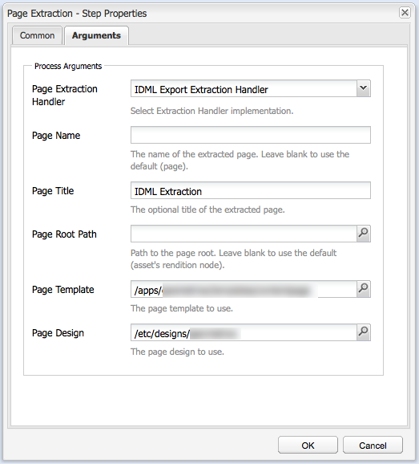

# Integrera [!DNL Adobe Experience Manager Assets] med [!DNL Adobe InDesign Server] {#integrating-aem-assets-with-indesign-server}

[!DNL Adobe Experience Manager Assets] använder:

* En proxy som distribuerar inläsningen av vissa bearbetningsuppgifter. En proxy är en [!DNL Experience Manager] instans som kommunicerar med en proxyarbetare för att utföra en viss uppgift och andra [!DNL Experience Manager] instanser för att leverera resultaten.
* En proxyarbetare som definierar och hanterar en viss uppgift.
Dessa kan omfatta en mängd olika arbetsuppgifter. till exempel använda en [!DNL InDesign Server] för att bearbeta filer.

Om du vill överföra filer till [!DNL Experience Manager Assets] den som du har skapat med [!DNL Adobe InDesign] en proxy används de. Detta använder en proxyarbetare för att kommunicera med [!DNL Adobe InDesign Server], där [skript](https://www.adobe.com/devnet/indesign/documentation.html#idscripting) körs för att extrahera metadata och generera olika återgivningar för [!DNL Experience Manager Assets]. Proxyarbetaren möjliggör tvåvägskommunikation mellan [!DNL InDesign Server] och [!DNL Experience Manager] instansen/instanserna i en molnkonfiguration.

>[!NOTE]
>
>[!DNL Adobe InDesign] erbjuds som två separata erbjudanden. [Adobe InDesign](https://www.adobe.com/products/indesign.html) -datorprogram som används för att utforma sidlayouter för tryck och digital distribution. [Med Adobe InDesign Server](https://www.adobe.com/products/indesignserver.html) kan ni programmässigt skapa automatiserade dokument baserat på det ni skapat med [!DNL InDesign]. Den fungerar som en tjänst som erbjuder ett gränssnitt till sin [ExtendScript](https://www.adobe.com/devnet/scripting.html) -motor. Skripten är skrivna i [!DNL ExtendScript], vilket liknar [!DNL JavaScript]. Mer information om [!DNL InDesign] skript finns i [https://www.adobe.com/devnet/indesign/documentation.html#idscripting](https://www.adobe.com/devnet/indesign/documentation.html#idscripting).

## Hur extraheringen fungerar {#how-the-extraction-works}

De [!DNL Adobe InDesign Server] kan integreras med [!DNL Experience Manager Assets] så att INDD-filer som skapas med [!DNL InDesign] kan överföras, återgivningar genereras, alla media som extraheras (till exempel video) och lagras som resurser:

>[!NOTE]
>
>Tidigare versioner av [!DNL Experience Manager] kunde extrahera XMP och miniatyrbilden, nu kan alla media extraheras.

1. Överför INDD-filen till [!DNL Experience Manager Assets].
1. Ett ramverk skickar kommandoskript till [!DNL InDesign Server] via SOAP (Simple Object Access Protocol).
Detta kommandoskript kommer att:

   * Hämta INDD-filen.
   * Kör [!DNL InDesign Server] kommandon:

      * Strukturen, texten och eventuella mediefiler extraheras.
      * PDF- och JPG-renderingar genereras.
      * HTML- och IDML-renderingar genereras.
   * Lägg tillbaka de resulterande filerna i [!DNL Experience Manager Assets].
   >[!NOTE]
   >
   >IDML är ett XML-baserat format som återger allt innehåll i [!DNL InDesign] filen. Den lagras som ett komprimerat paket med [ZIP](https://www.techterms.com/definition/zip) -komprimering. Mer information finns i [InDesign Interchange Formats INX och IDML](http://www.peachpit.com/articles/article.aspx?p=1381880&amp;seqNum=8).

   >[!CAUTION]
   >
   >Om filen inte [!DNL InDesign Server] är installerad eller inte konfigurerad kan du ändå överföra en INDD-fil till [!DNL Experience Manager]. De återgivningar som genereras är dock begränsade till PNG och JPEG. Du kommer inte att kunna generera HTML-, IDML- eller sidåtergivningar.

1. Efter extraheringen och renderingen:

   * Strukturen replikeras till en `cq:Page` (typ av återgivning).
   * Den extraherade texten och filerna lagras i [!DNL Experience Manager Assets].
   * Alla återgivningar lagras i [!DNL Experience Manager Assets], i själva resursen.

## Integrera [!DNL InDesign Server] med AEM {#integrating-the-indesign-server-with-aem}

Om du vill integrera [!DNL InDesign Server] för användning med [!DNL Experience Manager Assets] och efter att du har konfigurerat din proxy måste du:

1. [Installera InDesign Server](#installing-the-indesign-server).
1. Om det behövs [konfigurerar du Experience Manager Assets-arbetsflödet](#configuring-the-aem-assets-workflow).
Detta är bara nödvändigt om standardvärdena inte passar för din instans.
1. Konfigurera en [proxyarbetare för InDesign Server](#configuring-the-proxy-worker-for-indesign-server).

### Installera [!DNL InDesign Server] {#installing-the-indesign-server}

Så här installerar och startar du programmet [!DNL InDesign Server] för användning med [!DNL Experience Manager]:

1. Hämta och installera [!DNL InDesign Server].

1. Om det behövs kan du anpassa konfigurationen för din [!DNL InDesign Server] instans.

1. Starta servern från kommandoraden:

   `<*ids-installation-dir*>/InDesignServer.com -port 8080`

   Detta startar servern med SOAP-pluginprogrammet som lyssnar på port 8080. Alla loggmeddelanden och utdata skrivs direkt till kommandofönstret.

   >[!NOTE]
   >
   >Om du vill spara utdatameddelandena i en fil använder du omdirigering; under Windows:
   >`<ids-installation-dir>/InDesignServer.com -port 8080 > ~/temp/INDD-logfile.txt 2>&1`

### Konfigurera [!DNL Experience Manager Assets] arbetsflödet {#configuring-the-aem-assets-workflow}

[!DNL Experience Manager Assets] har ett förkonfigurerat arbetsflöde **[!UICONTROL DAM Update Asset]** som innehåller flera processsteg särskilt för [!DNL InDesign]:

* [Medieextrahering](#media-extraction)
* [Sidextrahering](#page-extraction)

Det här arbetsflödet är konfigurerat med standardvärden som kan anpassas för dina inställningar för de olika författarinstanserna (det här är ett standardarbetsflöde, så mer information finns under [Redigera ett arbetsflöde](/help/sites-developing/workflows-models.md#configuring-a-workflow-step)). Om du använder standardvärdena (inklusive SOAP-porten) behövs ingen konfiguration.

Efter konfigurationen utlöses arbetsflödet när [!DNL InDesign] filer överförs till [!DNL Experience Manager Assets] (med någon av de vanliga metoderna) för att bearbeta resursen och förbereda de olika återgivningarna. Testa konfigurationen genom att ladda upp en INDD-fil till [!DNL Experience Manager Assets] för att bekräfta att du ser de olika renderingar som har skapats av IDS under `<*your_asset*>.indd/Renditions`

#### Medieextrahering {#media-extraction}

Det här steget styr extraheringen av media från INDD-filen.

Om du vill anpassa kan du redigera **[!UICONTROL Arguments]** fliken i **[!UICONTROL Media Extraction]** steget.

Medieextraheringsargument och skriptsökvägar

* **ExtendScript library**: Detta är ett enkelt http get/post-metodbibliotek som krävs av de andra skripten.

* **Utöka skript**: Här kan du ange olika skriptkombinationer. Om du vill att dina egna skript ska köras på [!DNL InDesign Server]filen sparar du skripten på `/apps/settings/dam/indesign/scripts`.

Mer information om InDesign-skript finns i [dokumentationen för InDesign-utvecklare](https://www.adobe.com/devnet/indesign/documentation.html#idscripting)

>[!CAUTION]
>
>Ändra inte ExtendScript-biblioteket. Det här biblioteket innehåller de HTTP-funktioner som krävs för att kommunicera med Sling. Den här inställningen anger vilket bibliotek som ska skickas till [!DNL InDesign Server] användaren för användning där.

Skriptet som körs av arbetsflödessteget för medieextrahering genererar en miniatyrrendering i JPG-format. `ThumbnailExport.jsx` Den här återgivningen används i arbetsflödet Bearbeta miniatyrbilder för att generera de statiska återgivningar som krävs av [!DNL Experience Manager].

Du kan konfigurera arbetsflödessteget Bearbeta miniatyrbilder för att generera statiska återgivningar i olika storlekar. Se till att du inte tar bort standardinställningarna eftersom de krävs av [!DNL Experience Manager Assets] gränssnittet. Arbetsflödessteget Ta bort återgivning av bildförhandsvisning tar bort återgivningen av JPG-miniatyrer eftersom den inte längre behövs.

#### Sidextrahering {#page-extraction}

Då skapas en [!DNL Experience Manager] sida av de extraherade elementen. En extraheringshanterare används för att extrahera data från en återgivning (för närvarande HTML eller IDML). Dessa data används sedan för att skapa en sida med PageBuilder.

To customize, you can edit the **[!UICONTROL Arguments]** tab of the **[!UICONTROL Page Extraction]** step.

* **Extraheringshanterare** för sida: Välj den hanterare som du vill använda i popup-listan. En extraheringshanterare fungerar på en viss återgivning, som väljs av en relaterad `RenditionPicker` (se API:t för `ExtractionHandler`).
In a standard [!DNL Experience Manager] installation the following is available:
   * Extraheringshandtag för IDML-export: Används för den `IDML` återgivning som genereras i MediaExtract-steget.

* **Sidnamn**: Ange det namn som du vill tilldela den resulterande sidan. Om det lämnas tomt är namnet&quot;page&quot; (eller ett derivat om&quot;page&quot; redan finns).

* **Sidrubrik**: Ange den titel som du vill tilldela den resulterande sidan.

* **Sidrotsökväg**: Sökvägen till rotplatsen för den resulterande sidan. Om den lämnas tom används den nod som innehåller resursens återgivningar.

* **Sidmall**: Den mall som ska användas när den resulterande sidan genereras.

* **Siddesign**: Den siddesign som ska användas när den resulterande sidan genereras.

### Konfigurera proxyarbetaren för [!DNL InDesign Server] {#configuring-the-proxy-worker-for-indesign-server}

>[!NOTE]
>
>Arbetaren finns på proxyinstansen.

1. Expandera **[!UICONTROL Cloud Services Configurations]** i den vänstra rutan i verktygskonsolen. Expandera sedan **[!UICONTROL Cloud Proxy Configuration]**.

1. Dubbelklicka på **[!UICONTROL IDS worker]** för att öppna för konfiguration.

1. Klicka **[!UICONTROL Edit]** för att öppna konfigurationsdialogrutan och definiera de nödvändiga inställningarna:

   

   * **IDS-pool** SOAP-slutpunkter som ska användas för kommunikation med [!DNL InDesign Server]. Du kan lägga till, ta bort och beställa objekt.

1. Spara genom att klicka på OK.

### Konfigurera Dag CQ Link Externalizer {#configuring-day-cq-link-externalizer}

Om [!DNL InDesign Server] och [!DNL Experience Manager] körs på olika värdar eller något eller båda programmen inte körs på standardportar, konfigurerar du [!UICONTROL Day CQ Link Externalizer] att ange värdnamnet, porten och innehållssökvägen för [!DNL InDesign Server].

1. Gå till webbkonsolen på `https://[aem_server]:[port]/system/console/configMgr`.
1. Leta reda på konfigurationen **[!UICONTROL Day CQ Link Externalizer]** och öppna den genom **[!UICONTROL Edit]** att trycka.
1. Ange värdnamnet och kontextsökvägen för [!DNL Indesign Server] och klicka på **Spara**.

   

### Aktivera parallell jobbbearbetning för [!DNL InDesign Server] {#enabling-parallel-job-processing-for-indesign-server-s}

Nu kan du aktivera parallell jobbbearbetning för IDS. Ange det maximala antalet parallella jobb (`x`) som kan [!DNL InDesign Server] bearbetas:

* På en enda multiprocessordator är det maximala antalet parallella jobb (`x`) som en [!DNL InDesign Server] kan bearbeta ett mindre än antalet processorer som kör IDS.
* När du kör IDS på flera datorer måste du räkna antalet tillgängliga processorer (t.ex. på alla datorer) och sedan subtrahera det totala antalet datorer.

Så här konfigurerar du antalet parallella IDS-jobb:

1. Öppna fliken **[!UICONTROL Configurations]** i Felix Console; till exempel: `https://[aem_server]:[port]/system/console/configMgr`.

1. Välj IDS-bearbetningskön under `Apache Sling Job Queue Configuration`.

1. Uppsättning:

   * **Typ** - `Parallel`
   * **Maximalt antal parallella jobb** - `<*x*>` (enligt beräkning ovan)

1. Spara dessa ändringar.
1. Om du vill aktivera stöd för flera sessioner för Adobe CS6 och senare markerar du `enable.multisession.name` kryssrutan under `com.day.cq.dam.ids.impl.IDSJobProcessor.name` konfiguration.
1. Skapa en [pool med `x` IDS-arbetare genom att lägga till SOAP-slutpunkter i IDS Worker-konfigurationen](#configuring-the-proxy-worker-for-indesign-server).

   Om flera datorer körs [!DNL InDesign Server]lägger du till SOAP-slutpunkter (antal processorer per dator -1) för varje dator.

   >[!NOTE]
   >
   >Du kan välja att aktivera svartlistning av IDS-arbetare när du arbetar med en grupp arbetare.
   >
   >
   >Om du vill göra det aktiverar du kryssrutan under **[!UICONTROL enable.retry.name]** `com.day.cq.dam.ids.impl.IDSJobProcessor.name` konfigurationen, som aktiverar omprövningar av IDS-jobb.
   >
   >
   >Under `com.day.cq.dam.ids.impl.IDSPoolImpl.name` konfigurationen anger du också ett positivt värde för `max.errors.to.blacklist` parameter som avgör antalet jobbomprövningar innan du tar bort ett ID från jobbhanterarlistan.
   >
   >
   >Som standard valideras IDS-arbetaren efter den konfigurerbara tiden (retry.interval.to.whitelist.name) i minuter. Om arbetaren hittas online tas den bort från svartlistan.

## Aktivera stöd för [!DNL InDesign Server] 10.0 eller senare {#enabling-support-for-indesign-server-or-later}

För [!DNL InDesign Server] 10.0 eller senare utför du följande steg för att aktivera stöd för flera sessioner.

1. Öppna Configuration Manager från din [!DNL Experience Manager Assets] instans `https://[aem_server]:[port]/system/console/configMgr`.
1. Redigera konfigurationen `com.day.cq.dam.ids.impl.IDSJobProcessor.name`.
1. Markera **[!UICONTROL ids.cc.enable]** alternativet och klicka på **[!UICONTROL Save]**.

>[!NOTE]
>
>För [!DNL InDesign Server] integrering med [!DNL Experience Manager Assets]måste du använda en flerkärnig processor eftersom den sessionsstödfunktion som krävs för integreringen inte stöds av enskilda kärnsystem.

## Konfigurera [!DNL Experience Manager] autentiseringsuppgifter {#configure-aem-credentials}

Du kan ändra administratörens standardautentiseringsuppgifter (användarnamn och lösenord) för att komma åt [!DNL InDesign Server] från din [!DNL Experience Manager] instans utan att integreringen med [!DNL InDesign Server]avbryts.

1. Gå till `/etc/cloudservices/proxy.html`.
1. Ange det nya användarnamnet och lösenordet i dialogrutan.
1. Spara inloggningsuppgifterna.

>[!MORELIKETHIS]
>
>* [Om Adobe InDesign Server](https://www.adobe.com/products/indesignserver/faq.html)

