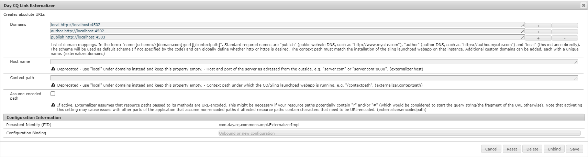

# Integrera [!DNL Adobe Experience Manager Assets] med [!DNL Adobe InDesign Server] {#integrating-aem-assets-with-indesign-server}

[!DNL Adobe Experience Manager Assets] använder:

* En proxy som distribuerar inläsningen av vissa bearbetningsuppgifter. En proxy är en [!DNL Experience Manager]-instans som kommunicerar med en proxyarbetare för att slutföra en viss uppgift och andra [!DNL Experience Manager]-instanser för att leverera resultaten.
* En proxyarbetare som definierar och hanterar en viss uppgift.
Dessa kan omfatta en mängd olika uppgifter, till exempel att använda en [!DNL InDesign Server] för att bearbeta filer.

Om du vill överföra filer till [!DNL Experience Manager Assets] som du har skapat med [!DNL Adobe InDesign] används en proxy. Detta använder en proxyarbetare för att kommunicera med [!DNL Adobe InDesign Server], där skript körs för att extrahera metadata och generera olika återgivningar för [!DNL Experience Manager Assets]. Proxyarbetaren aktiverar tvåvägskommunikation mellan [!DNL InDesign Server] och [!DNL Experience Manager]-instanserna i en molnkonfiguration.

>[!NOTE]
>
>[!DNL Adobe InDesign] erbjuds som två separata erbjudanden. [Adobe InDesign](https://www.adobe.com/products/indesign.html) som används för att utforma sidlayouter för tryck och digital distribution. Med [Adobe InDesign Server](https://www.adobe.com/products/indesignserver.html) kan du skapa automatiserade dokument med programkod baserat på vad du har skapat med [!DNL InDesign]. Den fungerar som en tjänst som erbjuder ett gränssnitt till sin ExtendScript-motor. Skripten skrivs i [!DNL ExtendScript], vilket liknar [!DNL JavaScript].

## Hur extraheringen fungerar {#how-the-extraction-works}

[!DNL Adobe InDesign Server] kan integreras med [!DNL Experience Manager Assets] så att INDD-filer som skapats med [!DNL InDesign] kan överföras, återgivningar genereras, alla media extraheras (till exempel video) och lagras som resurser:

>[!NOTE]
>
>Tidigare versioner av [!DNL Experience Manager] kunde extrahera XMP och miniatyrbilden, nu kan alla media extraheras.

1. Överför din INDD-fil till [!DNL Experience Manager Assets].
1. Ett ramverk skickar kommandoskript till [!DNL InDesign Server] via SOAP (Simple Object Access Protocol).
Detta kommandoskript kommer att:

   * Hämta INDD-filen.
   * Kör [!DNL InDesign Server]-kommandon:

      * Strukturen, texten och eventuella mediefiler extraheras.
      * PDF- och JPG-renderingar genereras.
      * HTML- och IDML-renderingar genereras.

   * Lägg tillbaka de resulterande filerna på [!DNL Experience Manager Assets].

   >[!NOTE]
   >
   >IDML är ett XML-baserat format som återger allt innehåll i filen [!DNL InDesign]. Den lagras som ett komprimerat paket med [ZIP](https://techterms.com/definition/zip) -komprimering. Mer information finns i [InDesign Interchange Formats INX och IDML](https://www.peachpit.com/promotions/adobe-creative-cloud-2024-release-books-ebooks-and-142536).

   >[!CAUTION]
   >
   >Om [!DNL InDesign Server] inte är installerad eller inte konfigurerad kan du ändå överföra en INDD-fil till [!DNL Experience Manager]. De återgivningar som skapas är dock begränsade till PNG och JPEG. Du kommer inte att kunna generera HTML, `.idml` eller sidåtergivningarna.

1. Efter extraheringen och renderingen:

   * Strukturen replikeras till en `cq:Page` (typ av återgivning).
   * Den extraherade texten och filerna lagras i [!DNL Experience Manager Assets].
   * Alla återgivningar lagras i [!DNL Experience Manager Assets], i själva resursen.

## Integrera [!DNL InDesign Server] med Experience Manager {#integrating-the-indesign-server-with-aem}

Om du vill integrera [!DNL InDesign Server] för användning med [!DNL Experience Manager Assets] och efter att du har konfigurerat din proxy måste du:

1. [Installera InDesign Server](#installing-the-indesign-server).
1. [Konfigurera Experience Manager Assets Workflow](#configuring-the-aem-assets-workflow) om det behövs.
Detta är bara nödvändigt om standardvärdena inte passar för din instans.
1. Konfigurera en [proxyarbetare för InDesign Server](#configuring-the-proxy-worker-for-indesign-server).

### Installera [!DNL InDesign Server] {#installing-the-indesign-server}

Så här installerar och startar du [!DNL InDesign Server] för användning med [!DNL Experience Manager]:

1. Hämta och installera [!DNL InDesign Server].

1. Om det behövs kan du anpassa konfigurationen för [!DNL InDesign Server]-instansen.

1. Starta servern från kommandoraden:

   `<*ids-installation-dir*>/InDesignServer.com -port 8080`

   Detta startar servern med SOAP plugin-program som lyssnar på port 8080. Alla loggmeddelanden och utdata skrivs direkt till kommandofönstret.

   >[!NOTE]
   >
   >Om du vill spara utdatameddelandena i en fil använder du omdirigering, till exempel under Windows:
   >`<ids-installation-dir>/InDesignServer.com -port 8080 > ~/temp/INDD-logfile.txt 2>&1`

### Konfigurera arbetsflödet [!DNL Experience Manager Assets] {#configuring-the-aem-assets-workflow}

[!DNL Experience Manager Assets] har ett förkonfigurerat arbetsflöde **[!UICONTROL DAM Update Asset]**, som har flera processsteg specifikt för [!DNL InDesign]:

* [Medieextrahering](#media-extraction)
* [Sidextrahering](#page-extraction)

Det här arbetsflödet är konfigurerat med standardvärden som kan anpassas för konfigurationen för de olika författarinstanserna (det här är ett standardarbetsflöde, så mer information finns under [Redigera ett arbetsflöde](/help/sites-developing/workflows-models.md#configuring-a-workflow-step)). Om du använder standardvärdena (inklusive SOAP-porten) behövs ingen konfiguration.

Efter konfigurationen aktiveras arbetsflödet för att bearbeta resursen och förbereda de olika återgivningarna när [!DNL InDesign] filer överförs till [!DNL Experience Manager Assets] (med någon av de vanliga metoderna). Testa konfigurationen genom att överföra en INDD-fil till [!DNL Experience Manager Assets] för att bekräfta att du ser de olika renderingar som skapas av IDS under `<*your_asset*>.indd/Renditions`

#### Medieextrahering {#media-extraction}

Det här steget styr extraheringen av media från INDD-filen.

Om du vill anpassa kan du redigera fliken **[!UICONTROL Arguments]** i steget **[!UICONTROL Media Extraction]**.

Medieextraheringsargument och skriptsökvägar

* **ExtendScript-bibliotek**: Det här är ett enkelt http get/post-metodbibliotek som krävs av de andra skripten.

* **Utöka skript**: Du kan ange olika skriptkombinationer här. Om du vill att dina egna skript ska köras på [!DNL InDesign Server] sparar du skripten på `/apps/settings/dam/indesign/scripts`.

<!-- TBD: Hiding this link since ADC is not available anymore. 
For information about [!DNL Adobe InDesign] scripts, see [InDesign developer documentation](https://www.adobe.com/devnet/indesign/documentation.html#idscripting).
-->

>[!CAUTION]
>
>Ändra inte ExtendScript-biblioteket. Det här biblioteket innehåller de HTTP-funktioner som krävs för att kommunicera med Sling. Den här inställningen anger vilket bibliotek som ska skickas till [!DNL InDesign Server] för användning där.

Skriptet `ThumbnailExport.jsx` som körs i arbetsflödessteget Medieextrahering genererar en miniatyrrendering i JPG-format. Den här återgivningen används i arbetsflödet Bearbeta miniatyrbilder för att generera statiska återgivningar som krävs av [!DNL Experience Manager].

Du kan konfigurera arbetsflödessteget Bearbeta miniatyrbilder för att generera statiska återgivningar i olika storlekar. Se till att du inte tar bort standardinställningarna eftersom de krävs av gränssnittet [!DNL Experience Manager Assets]. Arbetsflödet för att ta bort återgivning för förhandsvisning av bilder tar slutligen bort återgivningen av JPG-miniatyrer eftersom den inte längre behövs.

#### Sidextrahering {#page-extraction}

Detta skapar en [!DNL Experience Manager]-sida av de extraherade elementen. En extraheringshanterare används för att extrahera data från en återgivning (för närvarande HTML eller IDML). Dessa data används sedan för att skapa en sida med Page Builder.

Om du vill anpassa kan du redigera fliken **[!UICONTROL Arguments]** i steget **[!UICONTROL Page Extraction]**.

* **Sidextraheringshanterare**: Välj den hanterare som du vill använda i popup-listan. En extraheringshanterare fungerar på en viss återgivning, som väljs av en relaterad `RenditionPicker` (se `ExtractionHandler` API). Följande är tillgängliga i en standardinstallation av [!DNL Experience Manager]:
   * Extraheringshandtag för IDML-export: Fungerar på återgivningen `IDML` som genererades i steget MediaExtract.

* **Sidnamn**: Ange det namn som du vill tilldela till den resulterande sidan. Om det lämnas tomt är namnet&quot;page&quot; (eller ett derivat om&quot;page&quot; redan finns).

* **Sidrubrik**: Ange den rubrik som du vill tilldela den resulterande sidan.

* **Sidrotsökväg**: Sökvägen till rotplatsen för den resulterande sidan. Om den lämnas tom används den nod som innehåller resursens återgivningar.

* **Sidmall**: Den mall som ska användas när den resulterande sidan genereras.

* **Siddesign**: Den siddesign som ska användas när den resulterande sidan genereras.

### Konfigurera proxyarbetaren för [!DNL InDesign Server] {#configuring-the-proxy-worker-for-indesign-server}

>[!NOTE]
>
>Arbetaren finns på proxyinstansen.

1. Expandera **[!UICONTROL Cloud Services Configurations]** i den vänstra rutan i verktygskonsolen. Expandera sedan **[!UICONTROL Cloud Proxy Configuration]**.

1. Dubbelklicka på **[!UICONTROL IDS worker]** för att öppna den för konfiguration.

1. Klicka på **[!UICONTROL Edit]** för att öppna konfigurationsdialogrutan och definiera de nödvändiga inställningarna:

   

   * **IDS-pool**
De SOAP-slutpunkter som används för att kommunicera med [!DNL InDesign Server] . Du kan lägga till, ta bort och beställa objekt.

1. Spara genom att klicka på OK.

### Konfigurera Dag CQ Link Externalizer {#configuring-day-cq-link-externalizer}

Om [!DNL InDesign Server] och [!DNL Experience Manager] finns på olika värdar eller om ett eller båda programmen inte fungerar på standardportar konfigurerar du [!UICONTROL Day CQ Link Externalizer] för att ange värdnamn, port och innehållssökväg för [!DNL InDesign Server].

1. Gå till webbkonsolen på `https://[aem_server]:[port]/system/console/configMgr`.
1. Leta reda på konfigurationen **[!UICONTROL Day CQ Link Externalizer]**. Klicka på **[!UICONTROL Edit]** för att öppna.
1. Med inställningarna för länkutjämnaren kan du skapa absoluta URL:er för distributionen [!DNL Experience Manager] och för [!DNL InDesign Server]. Använd fältet **[!UICONTROL Domains]** för att ange värdnamnet för [!DNL Adobe InDesign Server]. Klicka på **Spara**.

   Använd `localhost` som värdnamn för den lokala (författare) instansen och värdnamn eller IP-adress för publiceringsinstansen i absoluta URL:er enligt följande bild.

   

### Aktivera parallell jobbbearbetning för [!DNL InDesign Server] {#enabling-parallel-job-processing-for-indesign-server}

Nu kan du aktivera parallell jobbbearbetning för IDS. Fastställ det maximala antalet parallella jobb (`x`) som kan bearbetas av [!DNL InDesign Server]:

* På en enda multiprocessordator är det maximala antalet parallella jobb (`x`) som en [!DNL InDesign Server] kan bearbeta ett mindre än antalet processorer som kör IDS.
* När du kör IDS på flera datorer måste du räkna antalet tillgängliga processorer (det vill säga på alla datorer) och sedan subtrahera det totala antalet datorer.

Så här konfigurerar du antalet parallella IDS-jobb:

1. Öppna fliken **[!UICONTROL Configurations]** i Felix Console, till exempel: `https://[aem_server]:[port]/system/console/configMgr`.

1. Välj IDS-bearbetningskön under `Apache Sling Job Queue Configuration`.

1. Uppsättning:

   * **Typ** - `Parallel`
   * **Maximalt antal parallella jobb** - `<*x*>` (enligt beräkning ovan)

1. Spara dessa ändringar.
1. Om du vill aktivera stöd för flera sessioner för Adobe CS6 och senare markerar du kryssrutan `enable.multisession.name` under konfigurationen `com.day.cq.dam.ids.impl.IDSJobProcessor.name`.
1. Skapa en [pool med `x` IDS-arbetare genom att lägga till SOAP-slutpunkter i IDS Worker-konfigurationen](#configuring-the-proxy-worker-for-indesign-server).

   Om det finns flera datorer som kör [!DNL InDesign Server] lägger du till SOAP-slutpunkter (antal processorer per dator -1) för varje dator.

<!-- 
TBD: Make updates to configurations for allow and block list after product updates are done.
-->

>[!NOTE]
>
>När du arbetar med en grupp arbetare kan du aktivera ett blockeringslista av IDS-arbetare.
>
>Om du vill göra det aktiverar du kryssrutan **[!UICONTROL enable.retry.name]** under konfigurationen `com.day.cq.dam.ids.impl.IDSJobProcessor.name`, som aktiverar omprövningar av IDS-jobb.
>
>Under konfigurationen `com.day.cq.dam.ids.impl.IDSPoolImpl.name` anger du också ett positivt värde för parametern `max.errors.to.blacklist` som avgör antalet jobbomprövningar innan du tar bort en ID från jobbarbetslistan.
>
>Som standard valideras IDS-arbetaren efter den konfigurerbara tiden (`retry.interval.to.whitelist.name`) i minuter. Om arbetaren hittas online tas den bort från blockeringslista.

## Aktivera stöd för [!DNL InDesign Server] 10.0 eller senare {#enabling-support-for-indesign-server-or-later}

För [!DNL InDesign Server] 10.0 eller senare utför du följande steg för att aktivera stöd för flera sessioner.

1. Öppna Configuration Manager från din [!DNL Experience Manager Assets]-instans `https://[aem_server]:[port]/system/console/configMgr`.
1. Redigera konfigurationen `com.day.cq.dam.ids.impl.IDSJobProcessor.name`.
1. Välj alternativet **[!UICONTROL ids.cc.enable]** och klicka på **[!UICONTROL Save]**.

>[!NOTE]
>
>För [!DNL InDesign Server]-integrering med [!DNL Experience Manager Assets] använder du en flerkärnig processor eftersom den sessionsstödfunktion som krävs för integreringen inte stöds på enkärniga system.

## Konfigurera autentiseringsuppgifter för [!DNL Experience Manager] {#configure-aem-credentials}

Du kan ändra administratörens standardautentiseringsuppgifter (användarnamn och lösenord) för att komma åt [!DNL InDesign Server] från din [!DNL Experience Manager]-distribution utan att integreringen med [!DNL InDesign Server] avbryts.

1. Gå till `/etc/cloudservices/proxy.html`.
1. Ange det nya användarnamnet och lösenordet i dialogrutan.
1. Spara inloggningsuppgifterna.

>[!MORELIKETHIS]
>
>* [Om Adobe InDesign Server](https://www.adobe.com/products/indesignserver/faq.html)
