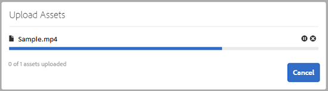
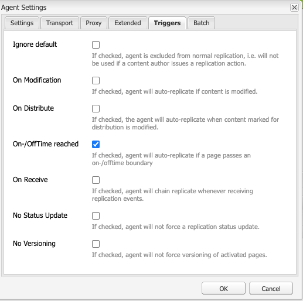

# Hantera era digitala resurser {#manage-digital-assets}

| Version | Artikellänk |
| -------- | ---------------------------- |
| AEM as a Cloud Service | [Klicka här](https://experienceleague.adobe.com/docs/experience-manager-cloud-service/content/assets/manage/manage-digital-assets.html?lang=en) |
| AEM 6.5 | Den här artikeln |

I [!DNL Adobe Experience Manager Assets] kan du göra mer än att lagra och styra dina resurser. [!DNL Experience Manager] erbjuder tillgångshanteringsfunktioner i enterpriseklass. Du kan redigera och dela resurser, köra avancerade sökningar och skapa flera renderingar av dussintals filformat som stöds. Du kan också hantera versioner och digitala rättigheter, automatisera bearbetningen av resurser, hantera och styra metadata, samarbeta med anteckningar och mycket annat.

I den här artikeln beskrivs grundläggande resurshanteringsåtgärder som att skapa eller överföra, metadatauppdateringar, kopiera, flytta och ta bort, publicera, avpublicera och söka resurser. Mer information om användargränssnittet finns i [komma igång med användargränssnittet för resurser](/help/sites-authoring/basic-handling.md). Mer information om hur du hanterar innehållsfragment finns i [Hantera innehållsfragment](/help/assets/content-fragments/content-fragments-managing.md) resurser.

## Skapa mappar {#creating-folders}

När du organiserar en samling resurser, till exempel alla `Nature`-bilder, kan du skapa mappar som håller ihop dem. Du kan använda mappar för att kategorisera och ordna dina resurser. [!DNL Experience Manager Assets] kräver inte att du ordnar resurser i mappar för att fungera bättre.

>[!NOTE]
>
>* Delning av en [!DNL Assets]-mapp av typen `sling:OrderedFolder` stöds inte vid delning till Experience Cloud. Om du vill dela en mapp ska du inte välja [!UICONTROL Ordered] när du skapar en mapp.
>* [!DNL Experience Manager] tillåter inte att du använder ordet `subassets` som namn på en mapp. Det är ett nyckelord som är reserverat för en nod som innehåller delresurser för sammansatta resurser.

1. Navigera till den plats i mappen med digitala resurser där du vill skapa en mapp. Klicka på **[!UICONTROL Create]** på menyn. Välj **[!UICONTROL New Folder]**.
1. Ange ett mappnamn i fältet **[!UICONTROL Title]**. Som standard använder DAM den titel som du angav som mappnamn. När mappen har skapats kan du åsidosätta standardmappen och ange ett annat mappnamn.
1. Klicka på **[!UICONTROL Create]**. Mappen visas i mappen med digitala resurser.

Följande (blankstegsavgränsad lista med) tecken stöds inte:

* Namnet på en resursfil får inte innehålla något av följande tecken: `* / : [ \\ ] | # % { } ? &`
* Namnet på en resursmapp får inte innehålla något av följande tecken: `* / : [ \\ ] | # % { } ? \" . ^ ; + & \t`

Inkludera inte specialtecken i filnamnstilläggen för resurser.

## Överför resurser {#uploading-assets}

<!-- TBD the following:
Move this section into a new article. CQDOC-14874 ticket is created for this.
In this complete article, replace emphasis with UICONTROL where appropriate.
-->

Du kan överföra olika typer av resurser (inklusive bilder, PDF-filer, RAW-filer och så vidare) från den lokala mappen eller en nätverksenhet till [!DNL Experience Manager Assets].

>[!NOTE]
>
>I Dynamic Media - Scene7-läge är standardfilstorleken för överföring av resurser 2 GB eller mindre. Om du vill konfigurera överföring av resurser som är större än 2 GB upp till 15 GB läser du [ (Valfritt) Konfigurera Dynamic Media - Scene7-läge för överföring av resurser som är större än 2 GB](/help/assets/config-dms7.md#optional-config-dms7-assets-larger-than-2gb).

>[!IMPORTANT]
>
>Assets som du överför till Experience Manager och som har ett filnamn som är längre än 100 tecken får ett kortare namn när de används i Dynamic Media.
>
>De första 100 tecknen i filnamnet används som de är. Alla återstående tecken ersätts med en alfanumerisk sträng. Den här namnbytesmetoden ger ett unikt namn när resursen används i Dynamic Media. Den är också avsedd att rymma den maximala längden för filnamn i Dynamic Media.

Du kan välja att överföra resurser till mappar med eller utan en bearbetningsprofil tilldelad dem.

För mappar som har en tilldelad bearbetningsprofil visas profilnamnet på miniatyrbilden i kortvyn. I listvyn visas profilnamnet i kolumnen **Bearbetar profil**. Se [Bearbetar profiler](/help/assets/processing-profiles.md).

Innan du överför en resurs måste du kontrollera att den har ett [format](/help/assets/assets-formats.md) som [!DNL Experience Manager Assets] stöder.

1. Navigera till den plats där du vill lägga till digitala resurser i användargränssnittet [!DNL Assets].
1. Gör något av följande om du vill överföra resurserna:

   * Klicka på **[!UICONTROL Create]** i verktygsfältet. Klicka sedan på **[!UICONTROL Files]** på menyn. Du kan byta namn på filen i den dialogruta som visas om det behövs.
   * I en webbläsare som stöder HTML5 drar du resurserna direkt i användargränssnittet för [!DNL Assets]. Dialogrutan för att byta namn på filen visas inte.

   

   Om du vill markera flera filer väljer du tangenten `Ctrl` eller `Command` och markerar resurserna i dialogrutan för filväljaren. När du använder en iPad kan du bara markera en fil i taget.

   Du kan pausa överföringen av stora resurser (större än 500 MB) och återuppta den senare från samma sida. Klicka på **[!UICONTROL Pause]** bredvid förloppsindikatorn som visas när en överföring startar.

   

Den storlek över vilken en tillgång betraktas som en stor tillgång kan konfigureras. Du kan till exempel konfigurera systemet så att resurser över 1 000 MB (i stället för 500 MB) betraktas som stora resurser. I det här fallet visas **[!UICONTROL Pause]** i förloppsindikatorn när resurser som är större än 1 000 MB överförs.

Alternativet [!UICONTROL Pause] visas inte om en fil som är större än 1 000 MB överförs med en fil som är mindre än 1 000 MB. Om du avbryter filöverföringen på mindre än 1 000 MB visas alternativet **[!UICONTROL Pause]**.

Om du vill ändra storleksgränsen konfigurerar du egenskapen `chunkUploadMinFileSize` för noden `fileupload` i CRX-databasen som finns på `/apps/dam/gui/content/assets/jcr:content/actions/secondary/create/items/fileupload`.

När du klickar på **[!UICONTROL Pause]** växlar den till alternativet **[!UICONTROL Play]**. Klicka på **[!UICONTROL Play]** om du vill återuppta överföringen.

Om du vill avbryta en pågående överföring klickar du på Stäng (`X`) bredvid förloppsindikatorn. När du avbryter överföringen tar [!DNL Assets] bort den delvis överförda delen av resursen.

Möjligheten att återuppta överföring är särskilt användbar i scenarier med låg bandbredd och nätverksfel, där det tar lång tid att överföra stora resurser. Du kan pausa överföringen och fortsätta senare när situationen förbättras. När du återupptar startar överföringen från den punkt där du pausade den.

Under överföringsåtgärden sparar [!DNL Experience Manager] de delar av resursen som överförs som datablock i CRX-databasen. När överföringen är klar konsoliderar [!DNL Experience Manager] dessa segment till ett enda datablock.

Om du vill konfigurera rensningsaktiviteten för de oavslutade segmentöverföringsjobben går du till `https://[aem_server]:[port]/system/console/configMgr/org.apache.sling.servlets.post.impl.helper.ChunkCleanUpTask`.

>[!CAUTION]
>
>Segmentöverföring utlöses när standardvärdet är 500 MB och segmentstorleken är 50 MB. Om du redigerar [Apache Jackrabbit Oak TokenConfiguration](https://experienceleague.adobe.com/docs/experience-cloud-kcs/kbarticles/KA-16464.html) och anger `timeout configuration` till mindre än den tid det tar för en resurs att överföra, kommer du att få en timeout för sessionen när överföringen av resursen pågår. Ändra därför `chunkUploadMinFileSize` och `chunksize` så att varje segmentbegäran uppdaterar sessionen.
>
>Med tanke på tidsgräns, fördröjning, bandbredd och förväntade samtidiga överföringar för autentiseringsuppgifter, är det högsta värdet som gör att du kan säkerställa att följande väljs:
>
>* För att säkerställa att segmentöverföring är aktiverad för filer med storlekar som kan orsaka att autentiseringsuppgifterna förfaller när överföringen pågår.
>
>* För att säkerställa att varje segment avslutas innan autentiseringsuppgifterna upphör att gälla.

Om du överför en resurs med samma namn som en resurs som redan är tillgänglig på den plats där du överför resursen visas en varningsdialogruta.

Du kan välja att ersätta en befintlig resurs, skapa en annan version eller behålla båda genom att byta namn på den nya resursen som överförs. Om du ersätter en befintlig resurs tas metadata för resursen och eventuella tidigare ändringar (till exempel anteckningar eller beskärningar) som du har gjort för den befintliga resursen bort. Om du väljer att behålla båda resurserna får den nya resursen ett nytt namn med numret `1` efter namnet.


>[!NOTE]
>
>När du väljer **[!UICONTROL Replace]** i dialogrutan [!UICONTROL Name Conflict] genereras resurs-ID om för den nya resursen. Detta ID skiljer sig från ID:t för föregående resurs.
>
>Om Assets Insights är aktiverat för att spåra visningar eller klickningar med [!DNL Adobe Analytics], blir det återskapade resurs-ID:t ogiltigt för de data som hämtats för resursen på [!DNL Analytics].

Om resursen som du överför finns i [!DNL Assets] visas en varning i dialogrutan **[!UICONTROL Duplicates Detected]** om att du försöker överföra en dubblettresurs. Dialogrutan visas bara om kontrollsummevärdet `SHA 1` för den befintliga resursens binära värde matchar kontrollsummevärdet för resursen som du överför. I det här fallet spelar resursernas namn ingen roll.

>[!NOTE]
>
>Dialogrutan [!UICONTROL Duplicates Detected] visas bara när funktionen för dubblettidentifiering är aktiverad. Information om hur du aktiverar funktionen för dubblettidentifiering finns i [Aktivera dubblettidentifiering](/help/assets/duplicate-detection.md).


Om du vill behålla den duplicerade resursen i [!DNL Assets] klickar du på **[!UICONTROL Keep]**. Klicka på **[!UICONTROL Delete]** om du vill ta bort den duplicerade resursen som du överförde.

[!DNL Experience Manager Assets] förhindrar att du överför resurser med förbjudna tecken i filnamn. Om du försöker överföra en resurs med ett filnamn som innehåller ett eller flera otillåtna tecken, visar [!DNL Assets] ett varningsmeddelande och stoppar överföringen tills du tar bort dessa tecken eller överför med ett tillåtet namn.

I dialogrutan [!UICONTROL Upload Assets] kan du ange långa namn för de filer som du överför, så att den passar organisationens specifika namnkonventioner.

Följande (blankstegsavgränsad lista med) tecken stöds emellertid inte:

* filnamnet för resursen får inte innehålla `* / : [ \\ ] | # % { } ? &`
* Resursmappens namn får inte innehålla `* / : [ \\ ] | # % { } ? \" . ^ ; + & \t`

Inkludera inte specialtecken i filnamnstilläggen för resurser.


Dessutom visar användargränssnittet [!DNL Assets] den senaste resursen som du överför eller den mapp som du skapade först.

Om du avbryter överföringen innan filerna har överförts, avbryter [!DNL Assets] överföringen av den aktuella filen och uppdaterar innehållet. Filer som redan har överförts tas dock inte bort.

I dialogrutan för överföringsförlopp i [!DNL Assets] visas antalet överförda filer och de filer som inte kunde överföras.

### Serieuppladdningar {#serialuploads}

När du överför flera resurser i grupp förbrukas betydande I/O-resurser, vilket kan påverka prestandan för din [!DNL Assets]-distribution negativt. Om du har en långsam internetanslutning ökar tiden det tar att överföra drastiskt på grund av att disk-I/O-inläsningen har ökat. Din webbläsare kan dessutom införa ytterligare begränsningar för antalet POSTER som [!DNL Assets] kan hantera för samtidiga överföringar av resurser. Därför misslyckas överföringen eller avslutas i förtid. Det innebär att [!DNL Experience Manager Assets] kanske saknar vissa filer när en grupp filer importeras eller helt inte kan importera någon fil.

För att lösa den här situationen importerar [!DNL Assets] en resurs i taget (seriell överföring) under en massöverföring, i stället för att alla resurser hämtas samtidigt.

Seriell överföring av resurser är aktiverat som standard. Om du vill inaktivera funktionen och tillåta samtidig överföring ska du täcka över noden `fileupload` i Crx-de och ange värdet för egenskapen `parallelUploads` till `true`.

### Överför resurser med FTP {#uploading-assets-using-ftp}

Dynamic Media möjliggör batchöverföring av resurser via FTP-server. Om du tänker överföra stora resurser (>1 GB) eller överföra hela mappar och undermappar bör du använda FTP. Du kan till och med konfigurera FTP-överföring så att den sker regelbundet enligt schema.

>[!NOTE]
>
>I Dynamic Media - Scene7-läge är standardfilstorleken för överföring av resurser 2 GB eller mindre. Om du vill konfigurera överföring av resurser som är större än 2 GB upp till 15 GB läser du [ (Valfritt) Konfigurera Dynamic Media - Scene7-läge för överföring av resurser som är större än 2 GB](/help/assets/config-dms7.md#optional-config-dms7-assets-larger-than-2gb).

>[!NOTE]
>
>Om du vill överföra resurser via FTP i Dynamic Media - Scene7-läge installerar du Feature Pack 18912 på [!DNL Experience Manager]-författarinstanserna. Kontakta [Adobe kundsupport](https://experienceleague.adobe.com/?support-solution=General#support) för att få tillgång till FP-18912 och slutföra konfigurationen av ditt FTP-konto. Mer information finns i [Installera funktionspaket 18912 för migrering av gruppresurser](/help/assets/bulk-ingest-migrate.md).
>
>Om du använder FTP för att överföra resurser ignoreras de överföringsinställningar som anges i [!DNL Experience Manager]. I stället används filbearbetningsregler, som de definieras i Dynamic Media Classic.

**Så här överför du resurser med FTP**

1. Logga in på FTP-servern med det FTP-användarnamn och lösenord som du fick från e-postmeddelandet om etablering. Överför filer eller mappar till FTP-servern i FTP-klienten.

1. Öppna [Dynamic Media Classic-datorprogrammet](https://experienceleague.adobe.com/docs/dynamic-media-classic/using/intro/dynamic-media-classic-desktop-app.html#system-requirements-dmc-app) och logga sedan in på ditt konto.

   Dina autentiseringsuppgifter och din inloggning tillhandahölls av Adobe vid tidpunkten för etableringen. Om du inte har den här informationen kan du kontakta Adobe kundsupport.

1. Klicka på **[!UICONTROL Upload]** i det globala navigeringsfältet.
1. Klicka på fliken **[!UICONTROL Via FTP]** på sidan Överför, i det övre vänstra hörnet.
1. Till vänster på sidan väljer du en FTP-mapp att överföra filer från. Välj en målmapp till höger på sidan.
1. Klicka på **[!UICONTROL Job Options]** i sidans nedre högra hörn och ange sedan önskade alternativ baserat på resurserna i den mapp du valde.

   Se [Alternativ för överföring av jobb](#upload-job-options).

   >[!NOTE]
   >
   >När du överför resurser via FTP får de överföringsjobbalternativ som du anger i Dynamic Media Classic (S7) företräde framför resurshanteringsparametrar som anges i [!DNL Experience Manager].

1. Klicka på **[!UICONTROL Save]** längst ned till höger i dialogrutan Alternativ för överföringsjobb.
1. Klicka på **[!UICONTROL Submit Upload]** längst ned till höger på sidan Överför.

   Om du vill visa överföringsförloppet klickar du på **[!UICONTROL Jobs]** i det globala navigeringsfältet. På sidan Jobb visas överföringsförloppet. Du kan fortsätta arbeta i [!DNL Experience Manager] och när som helst återgå till jobbsidan i Dynamic Media Classic för att granska ett pågående jobb.
Om du vill avbryta ett pågående överföringsjobb klickar du på **[!UICONTROL Cancel]** bredvid Varaktighet.

#### Alternativ för överföringsjobb {#upload-job-options}

| Överföringsalternativ | Delalternativ | Beskrivning |
|---|---|---|
| Jobbnamn | | Standardnamnet som är förifyllt i textfältet innehåller den användardefinierade delen av namnet och datum- och tidsstämpeln. Du kan använda standardnamnet eller ange ett namn på ditt eget skapande för det här överföringsjobbet. <br>Jobbet och andra överförings- och publiceringsjobb registreras på sidan Jobs, där du kan kontrollera jobbens status. |
| Publish efter överföring | | Publicerar automatiskt de resurser som du överför. |
| Skriv över i valfri mapp, samma basresursnamn oavsett tillägg | | Välj det här alternativet om du vill att de filer du överför ska ersätta befintliga filer med samma namn. Namnet på det här alternativet kan vara annorlunda, beroende på inställningarna i **[!UICONTROL Application Setup]** > **[!UICONTROL General Settings]** > **[!UICONTROL Upload to Application]** > **[!UICONTROL Overwrite Images]**. |
| Ta bort komprimering av ZIP- eller Tjära-filer vid överföring | | |
| Jobbalternativ | | Klicka på **[!UICONTROL Job Options]** så att du kan öppna dialogrutan [!UICONTROL Upload Job Options] och välja alternativ som påverkar hela överföringsjobbet. De här alternativen är desamma för alla filtyper.<br>Du kan välja standardalternativ för att överföra filer från sidan Allmänna inställningar i programmet. Om du vill öppna den här sidan väljer du **[!UICONTROL Setup]** > **[!UICONTROL Application Setup]**. Välj alternativet **[!UICONTROL Default Upload Options]** för att öppna dialogrutan [!UICONTROL Upload Job Options]. |
| | När | Välj En gång eller Återkommande. Om du vill ställa in ett återkommande jobb väljer du alternativet Upprepa - varje dag, Varje vecka, Varje månad eller Anpassa - för att ange när du vill att FTP-överföringsjobbet ska återkomma. Ange sedan schemaläggningsalternativen efter behov. |
| | Inkludera undermappar | Överför alla undermappar i mappen som du vill överföra. Namnen på mappen och dess undermappar som du överför anges automatiskt i [!DNL Experience Manager Assets]. |
| | Beskärningsalternativ | Om du vill beskära manuellt från sidorna av en bild väljer du Beskär-menyn och sedan Manuell. Ange sedan antalet pixlar att beskära från en sida eller från varje sida av bilden. Hur mycket av bilden som beskärs beror på bildfilens ppi-inställning (pixlar per tum). Om bilden till exempel visar 150 ppi och du anger 75 i textrutorna Överkant, Höger, Underkant och Vänster beskärs en halv tum från varje sida.<br> Om du vill beskära pixlar med tomt utrymme automatiskt från en bild öppnar du menyn Beskär, väljer Manuell och anger pixelmått i fälten Överkant, Höger, Underkant och Vänster för att beskära från sidorna. Du kan också välja Trimma på menyn Beskär och välja följande alternativ:<br> **Trimma bort baserat på** <ul><li>**Färg** - Välj alternativet Färg. Välj sedan menyn Hörn och välj hörnet på bilden med den färg som bäst motsvarar den tomrumsfärg som du vill beskära.</li><li>**Genomskinlighet** - Välj alternativet Genomskinlighet.<br> **Tolerans** - Dra i skjutreglaget för att ange en tolerans mellan 0 och 1. Om du vill trimma baserat på färg anger du 0 för att beskära pixlar bara om de exakt matchar den färg du valde i hörnet av bilden. Nummer som ligger närmare 1 ger större färgskillnader.<br>Om du vill trimma baserat på genomskinlighet anger du 0 så att pixlarna bara beskärs om de är genomskinliga. Siffror närmare 1 ger större genomskinlighet.</li></ul><br>Dessa beskärningsalternativ är icke-förstörande. |
| | Alternativ för färgprofil | Välj en färgkonvertering när du skapar optimerade filer som används för leverans:<ul><li>Standardfärgbevaring: Bevarar källbildens färger när bilderna innehåller färgrymdsinformation. Det finns ingen färgkonvertering. Nästan alla bilder idag har rätt färgprofil inbäddad. Om en CMYK-källbild inte innehåller någon inbäddad färgprofil konverteras färgerna till sRGB-färgrymden (standard röd grön). sRGB är den rekommenderade färgrymden för visning av bilder på webbsidor.</li><li>Behåll ursprunglig färgmodell: Behåller originalfärgerna utan någon färgkonvertering vid punkten. För bilder utan inbäddad färgprofil görs färgkonverteringen med de standardfärgprofiler som är konfigurerade i Publish-inställningarna. Färgprofilerna kanske inte justeras mot färgen i de filer som skapas med det här alternativet. Därför bör du använda alternativet Standardfärgbevaring.</li><li>Anpassad från > Till <br> Öppnar menyer så att du kan välja färgmodellen Konvertera från och Konvertera till. Det här avancerade alternativet åsidosätter eventuell färginformation som är inbäddad i källfilen. Välj det här alternativet när alla bilder som du skickar in innehåller felaktiga eller saknade färgprofildata.</li></ul> |
| | Bildredigeringsalternativ | Du kan bevara urklippsmaskerna i bilder och välja en färgprofil.<br> Se [Ange alternativ för bildredigering vid överföring](#setting-image-editing-options-at-upload). |
| | PostScript-alternativ | Du kan rastrera PostScript®, beskära filer, behålla genomskinliga bakgrunder, välja en upplösning och välja en färgrymd.<br> Se [Ange överföringsalternativ för PostScript och Illustrator](#setting-postscript-and-illustrator-upload-options). |
| | Photoshop-alternativ | Du kan skapa mallar från Adobe® Photoshop®-filer, behålla lager, ange hur lager ska namnges, extrahera text och ange hur bilder ska förankras i mallar.<br>-mallar stöds inte i [!DNL Experience Manager].<br> Se [Ange överföringsalternativ för Photoshop](#setting-photoshop-upload-options). |
| | Alternativ för PDF | Du kan rastrera filerna, extrahera sökord och länkar, automatiskt generera en e-katalog, ange upplösningen och välja en färgrymd.<br>eCatalogs stöds inte i [!DNL Experience Manager]. <br> Se [Ange överföringsalternativ för PDF](#setting-pdf-upload-options).<br>**Obs!**: Det högsta antalet sidor för en PDF som ska användas för extrahering är 5 000 för nya överföringar. Denna gräns ändras till 100 sidor (för alla PDF) den 31 december 2022. Se även [Dynamic Media-begränsningar](/help/assets/limitations.md). |
| | Illustrator-alternativ | Du kan rastrera Adobe Illustrator®-filer, behålla genomskinliga bakgrunder, välja en upplösning och välja en färgrymd.<br> Se [Ange överföringsalternativ för PostScript och Illustrator](#setting-postscript-and-illustrator-upload-options). |
| | EVideoalternativ | Du kan omkoda en videofil genom att välja en videoförinställning.<br> Se [Ange överföringsalternativ för e-video](#setting-evideo-upload-options). |
| | Förinställningar för gruppuppsättning | Om du vill skapa en bilduppsättning, eller en snurra uppsättning, från de överförda filerna klickar du på kolumnen Aktiv för den förinställning som du vill använda. Du kan markera flera förinställningar. Du skapar förinställningarna på sidan Programinställningar/Gruppinställningar i Dynamic Media Classic.<br> Mer information om hur du skapar förinställningar för gruppuppsättningar finns i [Konfigurera förinställningar för gruppuppsättningar för att automatiskt generera bilduppsättningar och snurruppsättningar](config-dms7.md#creating-batch-set-presets-to-auto-generate-image-sets-and-spin-sets).<br> Se [Ange förinställningar för gruppuppsättning vid överföring](#setting-batch-set-presets-at-upload). |

#### Ange alternativ för bildredigering vid överföring {#setting-image-editing-options-at-upload}

När du överför bildfiler, inklusive AI-, EPS- och PSD-filer, kan du utföra följande redigeringsåtgärder i dialogrutan [!UICONTROL Upload Job Options]:

* Beskär tomt utrymme från bildens kant (se beskrivningen i tabellen ovan).
* Beskär manuellt från bildsidorna (se beskrivningen i tabellen ovan).
* Välj en färgprofil (se alternativbeskrivningen i tabellen ovan).
* Skapa en mask från en urklippsbana.
* Öka skärpan i bilder med oskarpa maskningsalternativ
* Blockera bakgrund

<!--
| Option | Sub-option | Description |
|---|---|---|
| Create Mask From Clipping Path | | Create a mask for the image based on its clipping path information. This option applies to images created with image-editing applications in which a clipping path was created. |
| Unsharp Masking | | Lets you fine-tune a sharpening filter effect on the final downsampled image, controlling the intensity of the effect, the radius of the effect (as measured in pixels), and a threshold of contrast that is ignored.<br> This effect uses the same options as Photoshop's Unsharp Mask filter. Contrary to what the name suggests, Unsharp Mask is a sharpening filter. Under Unsharp Masking, set the options you want. Setting options are described in the following: |
| | Amount | Controls the amount of contrast that is applied to edge pixels.<br> Think of it as the intensity of the effect. The main difference between the amount values of Unsharp Mask in Dynamic Media and the amount values in Adobe Photoshop, is that Photoshop has an amount range of 1% to 500%. Whereas, in Dynamic Media, the value range is 0.0 to 5.0. A value of 5.0 is the rough equivalent of 500% in Photoshop; a value of 0.9 is the equivalent of 90%, and so on. |
| | Radius | Controls the radius of the effect. The value range is 0-250.<br> The effect is run on all pixels in an image and radiates out from all pixels in all directions. The radius is measured in pixels. For example, to get a similar sharpening effect for a 2000 x 2000 pixel image and 500 x 500 pixel image, you would set a radius of two pixels on the 2000 x 2000 pixel image and a radius value of one pixel on the 500 x 500 pixel image. A larger value is used for an image that has more pixels. |
| | Threshold | Threshold is a range of contrast that is ignored when the Unsharp Mask filter is applied. It is important so that no "noise" is introduced to an image when this filter is used. The value range is 0-255, which is the number of brightness steps in a grayscale image. 0=black, 128=50% gray and 255=white.<br> For example, a threshold value of 12 ignores slight variations is skin tone brightness to avoid adding noise, but still add edge contrast to areas such as where eyelashes meet skin.<br> For example, if you have a photo of someone's face, the Unsharp Mask affects the parts of the image, such as where eyelashes and skin meet to create an obvious area of contrast, and the smooth skin itself. Even the smoothest skin exhibits subtle changes in brightness values. If you do not use a threshold value, the filter accentuates these subtle changes in skin pixels. In turn, a noisy and undesirable effect is created while contrast on the eyelashes is increased, enhancing sharpness.<br> To avoid this issue, a threshold value is introduced that tells the filter to ignore pixels that do not change contrast dramatically, like smooth skin.<br> In the zipper graphic shown earlier, notice the texture next to the zippers. Image noise is exhibited because the threshold values were too low to suppress the noise. |
| | Monochrome | Select to unsharp-mask image brightness (intensity).<br> Deselect to unsharp-mask each color component separately. |
| Knockout Background | | Automatically removes the background of an image when you upload it. This technique is useful to draw attention to a particular object and make it stand out from a busy background. Select to enable or "turn on" the Knockout Background feature and the following sub-options: |
| | Corner | Required.<br> The corner of the image that is used to define the background color to knockout.<br> You can choose from **Upper Left**, **Bottom Left**, **Upper Right**, or **Bottom Right**. |
| | Fill Method | Required.<br> Controls pixel transparency from the Corner location that you set.<br> You can choose from the following fill methods: <ul><li>**Flood Fill** - turns all pixels transparent that match the Corner that you have specified and are connected to it.</li><li>**Match Pixel** - turns all matching pixels transparent, regardless of their location on the image.</li></ul> |
| | Tolerance | Optional.<br> Controls the allowable amount of variation in pixel color matching based on the Corner location that you set.<br> Use a value of 0.0 to match pixel colors exactly or, use a value of 1.0 to allow for the greatest variation. |
-->

#### Ange överföringsalternativ för PostScript och Illustrator {#setting-postscript-and-illustrator-upload-options}

När du överför PostScript- (EPS) eller Illustrator-bildfiler (AI) kan du formatera dem på olika sätt. Du kan rastrera filerna, behålla den genomskinliga bakgrunden, välja en upplösning och välja en färgrymd. Det finns alternativ för att formatera PostScript- och Illustrator-filer i dialogrutan [!UICONTROL Upload Job Options] under [!UICONTROL PostScript Options] och [!UICONTROL Illustrator Options].

| Alternativ | Delalternativ | Beskrivning |
|---|---|---|
| Bearbetar | | Välj **[!UICONTROL Rasterize]** om du vill konvertera vektorgrafik i filen till bitmappsformat. |
| Bevara genomskinlig bakgrund i återgiven bild | | Bevara filens genomskinlighet i bakgrunden. |
| Upplösning | | Anger upplösningsinställningen. Den här inställningen avgör hur många pixlar som visas per tum i filen. |
| Färgrymd | | Välj menyn Färgrymd och välj bland följande alternativ för färgrymd: |
| | Identifiera automatiskt | Bevarar filens färgrymd. |
| | Tvinga som RGB | Konverterar till färgmodellen RGB. |
| | Tvinga som CMYK | Konverterar till CMYK-färgmodellen. |
| | Tvinga som gråskala | Konverterar till gråskalefärgrymden. |

#### Ange överföringsalternativ för Photoshop {#setting-photoshop-upload-options}

Photoshop Document-filer (PSD) används oftast för att skapa bildmallar. När du överför en PSD-fil kan du skapa en bildmall automatiskt från filen (välj alternativet [!UICONTROL Create Template] på skärmen Överför).

Dynamic Media skapar flera bilder från en PSD-fil med lager om du använder filen för att skapa en mall. En bild skapas för varje lager.

Använd [!UICONTROL Crop Options] och [!UICONTROL Color Profile Options], som beskrivs ovan, med Photoshop överföringsalternativ.

>[!NOTE]
>
>Mallar stöds inte i [!DNL Experience Manager].

| Alternativ | Delalternativ | Beskrivning |
|---|---|---|
| Behåll lager | | Rippar lagren i PSD, om det finns några, till enskilda resurser. Resurslagren är fortfarande kopplade till PSD. Du kan visa dem genom att öppna filen PSD i detaljvyn och välja lagerpanelen. |
| Skapa mall | | Skapar en mall från lagren i filen PSD. |
| Extrahera text | | Extraherar texten så att användare kan söka efter text i ett visningsprogram. |
| Utöka lager till bakgrundsstorlek | | Utökar storleken på överlappade bildlager till storleken på bakgrundslagret. |
| Namnge lager | | Lager i filen PSD överförs som separata bilder. |
| | Lagernamn | Namnger bilderna efter deras lagernamn i filen PSD. Ett lager med namnet Price Tag i den ursprungliga PSD-filen blir till exempel en bild med namnet Price Tag. Om lagernamnen i filen PSD är Photoshop standardlagernamn (Bakgrund, Lager 1, Lager 2 och så vidare) får bilderna namn efter sina lagernummer i filen PSD. De namnges inte efter sina standardlagernamn. |
| | Photoshop och lagernummer | Namnger bilderna efter deras lagernummer i filen PSD och ignorerar de ursprungliga lagernamnen. Bilderna namnges med Photoshop-filnamnet och ett nummer på lagret som läggs till. Det andra lagret i en fil som heter Spring Ad.psd får till exempel namnet Spring Ad_2 även om det har ett icke-standardnamn i Photoshop. |
| | Photoshop- och lagernamn | Namnger bilderna efter PSD-filen följt av lagernamnet eller lagernumret. Lagernumret används om lagernamnen i filen PSD är Photoshop standardlagernamn. Ett lager med namnet Price Tag i en PSD-fil med namnet SpringAd får till exempel namnet Spring Ad_Price Tag. Ett lager med standardnamnet Lager2 kallas Spring Ad_2. |
| Ankarpunkt | | Ange hur bilder ska förankras i mallar som genereras från lagerkompositionen som skapas från filen PSD. Som standard är ankarpunkten i mitten. Med en central ankarpunkt kan ersättningsbilder bäst fylla samma område, oavsett ersättningsbildens proportioner. Bilder med en annan aspekt som ersätter den här bilden upptar i själva verket samma utrymme när de refererar till mallen och använder parameterersättning. Ändra till en annan inställning om ditt program kräver att ersättningsbilderna fyller ut det tilldelade utrymmet i mallen. |

#### Ange överföringsalternativ för PDF {#setting-pdf-upload-options}

När du överför en PDF-fil kan du formatera den på olika sätt. Du beskär sidorna, extraherar sökord, anger pixlar per tum och väljer en färgrymd. PDF-filer innehåller ofta en ytmarginal, skärmärken, passmärken och andra skrivarmärken. Du kan beskära dessa märken från sidorna när du överför en PDF-fil.

Det högsta antalet sidor för en PDF som ska övervägas för extrahering är 5000 för nya överföringar. Denna gräns ändras till 100 sidor (för alla PDF) den 31 december 2022. Se även [Dynamic Media-begränsningar](/help/assets/limitations.md).

>[!NOTE]
>
>eCatalogs stöds inte i [!DNL Experience Manager].

Välj bland följande alternativ:

| Alternativ | Delalternativ | Beskrivning |
|---|---|---|
| Bearbetar | Rastrera | (Standard) Rippar sidorna i filen PDF och konverterar vektorgrafik till bitmappsbilder. Välj det här alternativet om du vill skapa en e-katalog. |
| Extract | Sök efter ord | Extraherar ord från PDF-filen så att filen kan genomsökas efter nyckelord i en eCatalog Viewer. |
| | Länkar | Extraherar länkar från PDF-filerna och konverterar dem till Image Maps som används i en eCatalog Viewer. |
| Skapa eCatalog automatiskt från PDF med flera sidor | | Skapar automatiskt en e-katalog från PDF-filen. eCatalog namnges efter den överförda PDF-filen. (Det här alternativet är bara tillgängligt om du rastrerar PDF-filen när du överför den.) |
| Upplösning | | Anger upplösningsinställningen. Den här inställningen avgör hur många pixlar som visas per tum i filen PDF. Standardvärdet är 150. |
| Färgrymd | | Välj menyn Färgrymd och välj en färgrymd för filen PDF. De flesta PDF-filer har både RGB och CMYK-färgbilder. Färgrymden RGB är att föredra när du vill visa bilden online. |
| | Identifiera automatiskt | Bevarar färgrymden för PDF-filen. |
| | Tvinga som RGB | Konverterar till färgmodellen RGB. |
| | Tvinga som CMYK | Konverterar till CMYK-färgmodellen. |
| | Tvinga som gråskala | Konverterar till gråskalefärgrymden. |

#### Ange överföringsalternativ för eVideo {#setting-evideo-upload-options}

Om du vill omkoda en videofil väljer du bland olika förinställningar för video.

| Alternativ | Delalternativ | Beskrivning |
|---|---|---|
| Adaptiv video | | En enda förinställning för kodning som fungerar med alla proportioner för att skapa videor som ska skickas till mobilen, surfplattan och datorn. Överförda källvideor som är kodade med den här förinställningen har en fast höjd. Bredden skalas dock automatiskt så att videons proportioner bevaras. <br>Det bästa sättet är att använda adaptiv videokodning. |
| Förinställningar för enskild kodning | Sortera kodningsförinställningar | Välj **[!UICONTROL Name]** eller **[!UICONTROL Size]** om du vill sortera kodningsförinställningarna som listas under Skrivbord, Mobil och Surfplatta efter namn eller upplösningsstorlek. |
| | Skrivbord | Skapa en MP4-fil för att leverera strömmande eller progressiv video till stationära datorer. Välj en eller flera proportioner med den upplösningsstorlek och måldatahastighet som du vill ha. |
| | Mobil | Skapa en MP4-fil för användning i mobila enheter från iPhone eller Android™. Välj en eller flera proportioner med den upplösningsstorlek och måldatahastighet som du vill ha. |
| | Tablet | Skapa en MP4-fil för användning på iPad- eller Android™-surfplattor. Välj en eller flera proportioner med den upplösningsstorlek och måldatahastighet som du vill ha. |

#### Ange förinställningar för gruppuppsättning vid överföring {#setting-batch-set-presets-at-upload}

Om du automatiskt vill skapa en bilduppsättning eller en snurruppsättning från överförda bilder klickar du på kolumnen Aktiv för den förinställning som du vill använda. Du kan markera flera förinställningar.

Mer information om hur du skapar förinställningar för gruppuppsättningar finns i [Konfigurera förinställningar för gruppuppsättningar för automatisk generering av bilduppsättningar och snurruppsättningar](/help/assets/config-dms7.md#creating-batch-set-presets-to-auto-generate-image-sets-and-spin-sets) .

### Strömmade överföringar {#streamed-uploads}

Om du överför många resurser till Adobe Experience Manager ökar I/O-begäranden till servern drastiskt, vilket minskar överföringseffektiviteten och kan till och med leda till att en del överföringsåtgärder tar slut. [!DNL Experience Manager Assets] har stöd för direktuppspelad överföring av resurser. Direktuppspelad överföring minskar I/O-disken under överföringen genom att resurslagring undviks i en tillfällig mapp på servern innan den kopieras till databasen. I stället överförs data direkt till databasen. På så sätt minskas tiden det tar att överföra stora resurser och möjligheten till timeout. Direktuppspelad överföring är aktiverad som standard i [!DNL Assets].

>[!NOTE]
>
>Direktuppspelning är inaktiverat för Adobe Experience Manager som körs på JEE-server med en servlet-api-version som är lägre än 3.1.

### Extrahera ZIP-arkiv som innehåller resurser {#extractzip}

Du kan överföra ZIP-arkiv precis som andra resurser som stöds. Samma filnamnsregler gäller för ZIP-filer. Med [!DNL Experience Manager] kan du extrahera ett ZIP-arkiv till en DAM-plats. Om arkivfilerna inte innehåller ZIP som tillägg aktiverar du identifiering av filtyp med hjälp av innehåll.

Välj ett ZIP-arkiv åt gången, klicka på **[!UICONTROL Extract Archive]** och välj en målmapp. Välj ett alternativ som du vill hantera eventuella konflikter. Om resurserna i ZIP-filen finns i målmappen kan du välja något av följande alternativ: hoppa över extrahering, ersätta befintliga filer, behålla båda resurserna genom att byta namn eller skapa en version.

När extraheringen är klar meddelar [!DNL Experience Manager] dig i meddelandefältet. När [!DNL Experience Manager] extraherar ZIP-filen kan du gå tillbaka till ditt arbete utan att avbryta extraheringen.


Vissa begränsningar för funktionen är:

* Om det finns en mapp med samma namn på målet extraheras resurserna från ZIP-filen i den befintliga mappen.
* Om du avbryter extraheringen tas de redan extraherade resurserna inte bort.
* Du kan inte markera två ZIP-filer samtidigt och extrahera dem. Du kan bara extrahera ett ZIP-arkiv åt gången.
* När du överför ett ZIP-arkiv och dialogrutan för överföring visar ett 500-serverfel, försöker du igen efter att du har installerat [det senaste Service Pack](/help/release-notes/release-notes.md).

## Förhandsgranska resurser {#previewing-assets}

Följ de här stegen för att förhandsgranska en resurs.

1. Navigera från användargränssnittet [!DNL Assets] till platsen för resursen som du vill förhandsgranska.
1. Klicka på önskad resurs så att du kan öppna den.

1. I förhandsgranskningsläget är zoomalternativ tillgängliga för [bildtyper som stöds](/help/assets/assets-formats.md#supported-raster-image-formats) (med interaktiv redigering).

   Om du vill zooma in på en resurs klickar du på `+` (eller på förstoringsglaset på resursen). Om du vill zooma ut klickar du på `-`. När du zoomar in kan du titta närmare på alla delar av bilden genom att panorera. Med den återställda zoompilen återgår du till den ursprungliga vyn. Om du vill återställa vyn till den ursprungliga storleken klickar du på **[!UICONTROL Reset]** .

**Förhandsgranska resurser endast med tangentbordstangenter**

Så här förhandsgranskar du en resurs med tangentbordet:

1. I användargränssnittet för [!DNL Assets] navigerar du till önskad resurs med `Tab` och piltangenterna.

1. Tryck på `Enter` så att du kan öppna den. Du kan zooma in resurser i förhandsvisningsläget.

1. Så här zoomar du in i resursen:
   1. Använd tangenten `Tab` för att flytta fokus till inzoomningsalternativet.
   1. Använd tangenten `Enter` för att zooma in i bilden.

   Om du vill zooma ut använder du tangenten `Tab` för att placera fokus på utzoomningsalternativet och trycka på `Enter`.

1. Använd `Shift` + `Tab` för att flytta tillbaka fokus på bilden.

1. Använd piltangenterna för att flytta runt den zoomade bilden.

>[!MORELIKETHIS]
>
>* [Förhandsgranska Dynamic Media Assets](/help/assets/previewing-assets.md).
>* [Visa delresurser](managing-linked-subassets.md#viewing-subassets).

## Redigera egenskaper och metadata {#editing-properties}

1. Navigera till platsen för resursen vars metadata du vill redigera.

1. Markera resursen och välj sedan **[!UICONTROL Properties]** i verktygsfältet så att du kan visa resursens egenskaper. Du kan också välja snabbåtgärden **[!UICONTROL Properties]** på resurskortet.

   

1. Redigera metadataegenskaperna på olika flikar på sidan [!UICONTROL Properties]. Redigera till exempel titeln och beskrivningen under fliken **[!UICONTROL Basic]**.

   >[!NOTE]
   >
   >Layouten för sidan [!UICONTROL Properties] och de metadataegenskaper som är tillgängliga beror på det underliggande metadataschemat. Mer information om hur du ändrar layouten för sidan [!UICONTROL Properties] finns i [Metadatascheman](/help/assets/metadata-schemas.md).

1. Om du vill schemalägga ett visst datum/tid för att aktivera resursen använder du datumväljaren bredvid fältet **[!UICONTROL On Time]**.

   

   *Figur: Använd datumväljaren för att schemalägga resursaktivering.*

1. Markera alternativet **[!UICONTROL On/Off Time Reached]** om du vill uppdatera utlösarna för replikeringsagenten i metadataegenskaperna.
   

1. Om du vill inaktivera resursen efter en viss tid väljer du datum/tid för inaktiveringen i datumväljaren bredvid fältet **[!UICONTROL Off Time]**. Inaktiveringsdatumet ska vara senare än aktiveringsdatumet för en tillgång. Efter [!UICONTROL Off Time] är en resurs och dess återgivningar inte tillgängliga via webbgränssnittet [!DNL Assets] eller via HTTP-API:t.

1. Markera en eller flera taggar i fältet **[!UICONTROL Tags]**. Om du vill lägga till en anpassad tagg skriver du namnet på taggen i rutan och väljer `Enter`. Den nya taggen sparas i [!DNL Experience Manager]. [!DNL YouTube] kräver taggar för att publicera. Se [publicera videor på YouTube](video.md#publishing-videos-to-youtube).

   >[!NOTE]
   >
   >Om du vill skapa taggar måste du ha skrivbehörighet på `/content/cq:tags/default` i CRX-databasen.

1. Om du vill ge resursen en gradering klickar du på fliken **[!UICONTROL Advanced]** och sedan på stjärnan vid rätt position för att tilldela den önskade graderingen.

   

   Det omdöme som du tilldelar resursen visas under **[!UICONTROL Your Ratings]**. Det genomsnittliga omdöme som resursen fick från användare som värderade resursen visas under **[!UICONTROL Rating]**. Dessutom visas uppdelningen av de omdömen som bidrar till det genomsnittliga omdömet under **[!UICONTROL Rating Breakdown]**. Du kan söka efter resurser baserat på genomsnittliga poäng.

1. Om du vill visa användningsstatistik för resursen klickar du på fliken **[!UICONTROL Insights]**.

   Användningsstatistik omfattar följande:

   * Antal gånger som resursen visats eller hämtats
   * Kanaler/enheter som resursen användes via
   * Kreativa lösningar där resursen nyligen användes

   Mer information finns i [Assets Insights](/help/assets/asset-insights.md).

1. Klicka på **[!UICONTROL Save & Close]**.
1. Navigera till användargränssnittet för [!DNL Assets]. De redigerade metadataegenskaperna, inklusive titel, beskrivning, omdömen och så vidare, visas på resurskortet i kortvyn och under relevanta kolumner i listvyn.

## Kopiera resurser {#copying-assets}

När du kopierar en resurs eller en mapp kopieras hela resursen eller mappen tillsammans med dess innehållsstruktur. En kopierad resurs eller en mapp dupliceras på målplatsen. Resursen på källplatsen ändras inte.

Några attribut som är unika för en viss kopia av en tillgång överförs inte. Några exempel är:

* Tillgångs-ID, datum och tid när de skapades samt versioner och versionshistorik. Vissa av dessa egenskaper indikeras av egenskaperna `jcr:uuid`, `jcr:created` och `cq:name`.

* Skapandetid och refererade sökvägar är unika för varje resurs och för varje återgivning.

Övriga egenskaper och metadatainformation bevaras. Ingen del av kopian skapas när en resurs kopieras.

1. I [!DNL Assets]-gränssnittet väljer du en eller flera resurser och klickar på **[!UICONTROL Copy]** i verktygsfältet. Du kan också välja alternativet **[!UICONTROL Copy]**  från resurskortet.

   >[!NOTE]
   >
   >Om du använder snabbåtgärden [!UICONTROL Copy] kan du bara kopiera en resurs åt gången.

1. Navigera till den plats där du vill kopiera resurserna.

   >[!NOTE]
   >
   >Om du kopierar en resurs på samma plats, genererar [!DNL Experience Manager] automatiskt en variant av namnet. Om du till exempel kopierar en resurs med namnet `Square`, genererar [!DNL Experience Manager] automatiskt titeln för kopian som `Square1`.

1. Klicka på alternativet **[!UICONTROL Paste]**  i verktygsfältet. Assets kopieras sedan till den här platsen.

   >[!NOTE]
   >
   >Alternativet **[!UICONTROL Paste]** är tillgängligt i verktygsfältet tills inklistringsåtgärden har slutförts.

## Flytta och byta namn på resurser {#moving-or-renaming-assets}

När du flyttar resurser (eller mappar) till en annan plats dupliceras inte resurserna (eller mapparna) till skillnad från när du kopierar resursen. Resurserna (eller mapparna) placeras på målplatsen och tas bort från källplatsen. Du kan också byta namn på resursen när du flyttar den till den nya platsen.
Om du flyttar en publicerad resurs till en annan plats kan du publicera om resursen. Som standard avpubliceras en flyttningsåtgärd för en publicerad resurs automatiskt. En flyttad resurs publiceras om om författaren väljer alternativet [!UICONTROL Republish] när resursen flyttas.


Så här flyttar du resurser eller mappar:

1. Navigera till platsen för resursen som du vill flytta.

1. Markera resursen och klicka på alternativet **[!UICONTROL Move]** i verktygsfältet.
   

1. Gör något av följande i guiden [!UICONTROL Move Assets]:

   * Ange namnet på resursen när den har flyttats. Klicka sedan på **[!UICONTROL Next]** för att fortsätta.

   * Klicka på **[!UICONTROL Cancel]** för att stoppa processen.

   >[!NOTE]
   >
   >* Du kan ange samma namn för resursen om det inte finns någon resurs med det namnet på den nya platsen. Du bör emellertid använda ett annat namn om du flyttar resursen till en plats där det finns en resurs med samma namn. Om du använder samma namn genereras automatiskt en variant av namnet. Om resursen till exempel har namnet Fyrkant, genereras namnet Fyrkant1 för kopian.
   >* När namnet ändras tillåts inte tomt utrymme i filnamnet.

1. Gör något av följande i dialogrutan **[!UICONTROL Select Destination]**:

   * Navigera till den nya platsen för resurserna och klicka sedan på **[!UICONTROL Next]** för att fortsätta.

   * Klicka på **[!UICONTROL Back]** för att återgå till skärmen **[!UICONTROL Rename]**.

1. Om de resurser som flyttas har referenssidor, resurser eller samlingar visas fliken **[!UICONTROL Adjust References]** bredvid fliken **[!UICONTROL Select Destination]**.

   Gör något av följande på skärmen **[!UICONTROL Adjust References]**:

   * Ange de referenser som ska justeras baserat på den nya informationen och klicka sedan på **[!UICONTROL Move]** för att fortsätta.

   * Välj/avmarkera referenser till resurserna i kolumnen **[!UICONTROL Adjust]**.
   * Klicka på **[!UICONTROL Back]** för att återgå till skärmen **[!UICONTROL Select Destination]**.

   * Klicka på **[!UICONTROL Cancel]** för att stoppa flyttåtgärden.

   Om du inte uppdaterar referenser fortsätter de att peka på resursens tidigare sökväg. Om du justerar referenserna uppdateras de till den nya resurssökvägen.

### Flytta resurser med dra-åtgärden {#move-using-drag}

Du kan flytta resurser (eller mappar) till en mapp på samma nivå genom att dra dem till målplatsen, i stället för att använda alternativet [!UICONTROL Move] i användargränssnittet. Den här åtgärden är dock bara möjlig i listvyn.

Om du flyttar resurser genom att dra dem öppnas inte guiden [!UICONTROL Move Asset], så du kan inte ändra namn på resurserna när du flyttar dem. Dessutom publiceras redan publicerade resurser på nytt när de flyttas genom att användaren drar dem, utan att användaren behöver godkänna publiceringen på nytt.


## Hantera återgivningar {#managing-renditions}

1. Du kan lägga till eller ta bort återgivningar för en resurs, förutom originalet. Navigera till platsen för resursen som du vill lägga till eller ta bort återgivningar för.

1. Klicka på resursen så att sidan öppnas.
1. I Experience Manager-gränssnittet väljer du **[!UICONTROL Renditions]** i listan.
1. Visa listan över återgivningar som genererats för resursen på panelen **[!UICONTROL Renditions]**.

   

   >[!NOTE]
   >
   >Som standard visar [!DNL Assets] inte den ursprungliga återgivningen av resursen i förhandsgranskningsläget. Om du är administratör kan du använda övertäckningar för att konfigurera [!DNL Assets] så att ursprungliga återgivningar visas i förhandsgranskningsläget.

1. Välj en återgivning om du vill visa eller ta bort återgivningen.

   **Ta bort en återgivning**

   Välj en återgivning på panelen **[!UICONTROL Renditions]** och klicka sedan på alternativet **[!UICONTROL Delete Rendition]**  i verktygsfältet. Det går inte att ta bort återgivningar gruppvis när resursbearbetningen är slutförd. För enskilda resurser kan du ta bort återgivningar manuellt från användargränssnittet. För flera resurser kan du anpassa Experience Manager för att ta bort antingen specifika återgivningar eller ta bort resurserna och överföra de borttagna resurserna igen.

   **Överför en ny återgivning**

   Navigera till sidan med resursinformation för resursen och klicka på alternativet **[!UICONTROL Add Rendition]**  i verktygsfältet för att överföra en ny återgivning för resursen.

   >[!NOTE]
   >
   >Om du väljer en återgivning på panelen **[!UICONTROL Renditions]** ändras sammanhanget för verktygsfältet och endast de åtgärder som är relevanta visas. Alternativ, t.ex. alternativet [!UICONTROL Upload Rendition], visas inte. Om du vill visa de här alternativen i verktygsfältet går du till informationssidan för resursen.

   Du kan konfigurera dimensionerna för den återgivning som du vill ska visas på informationssidan för en bild- eller videoresurs. Baserat på de dimensioner du anger visar [!DNL Assets] återgivningen med de exakta eller närmaste dimensionerna.

   Om du vill konfigurera återgivningsdimensionerna för en bild på resursdetaljnivån överlagrar du noden `renditionpicker` (`libs/dam/gui/content/assets/assetpage/jcr:content/body/content/content/items/assetdetail/items/col1/items/assetview/renditionpicker`) och konfigurera värdet för breddegenskapen (width). Konfigurera egenskapen **[!UICONTROL size (Long) in KB]** i stället för bredden så att du kan anpassa återgivningen på resursdetaljsidan baserat på bildstorleken. För storleksbaserad anpassning prioriterar egenskapen `preferOriginal` originalet om storleken på den matchade återgivningen är större än originalet.

   På samma sätt kan du anpassa anteckningssidans bild genom att täcka över `libs/dam/gui/content/assets/annotate/jcr:content/body/content/content/items/content/renditionpicker`.

   

   Om du vill konfigurera återgivningsdimensioner för en videoresurs går du till noden `videopicker` i CRX-databasen på platsen `/libs/dam/gui/content/assets/assetpage/jcr:content/body/content/content/items/assetdetail/items/col1/items/assetview/videopicker`, lägger över noden och redigerar sedan lämplig egenskap.

   >[!NOTE]
   >
   >Videoanteckningar stöds bara i webbläsare med HTML5-kompatibla videoformat. Beroende på webbläsaren stöds dessutom olika videoformat. Men MXF-videoformatet stöds ännu inte med videoanteckningar.

Mer information om hur du genererar och visar delresurser finns i [Hantera delresurser](managing-linked-subassets.md#generate-subassets).

## Ta bort resurser {#deleting-assets}

Om du vill ta bort resurser måste användaren ha borttagningsbehörighet för `dam/asset`. Om du bara har ändringsbehörighet kan du bara redigera metadata för resursen och lägga till anteckningar till resursen. Du kan dock inte ta bort resursen eller dess metadata.

Om du vill lösa eller ta bort inkommande referenser från andra sidor uppdaterar du de relevanta referenserna innan du tar bort en resurs. Om du inte vill att användare ska kunna ta bort refererade resurser och lämna brutna länkar inaktiverar du alternativet för att framtvinga borttagning med en övertäckning.

Så här tar du bort en resurs eller en mapp som innehåller en resurs:

1. Navigera till platsen för resursen eller mappen som du vill ta bort.

1. Markera resursen eller mappen och klicka på **[!UICONTROL Delete]**  i verktygsfältet.

   När du har bekräftat borttagningen:

   * Om resursen inte har några referenser tas resursen bort.

   * Om resursen har referenser visas ett felmeddelande om att **en eller flera resurser refereras till**. Du kan välja **[!UICONTROL Force Delete]** eller **[!UICONTROL Cancel]**.

   >[!NOTE]
   >
   >* Om du vill lösa eller ta bort inkommande referenser från andra sidor uppdaterar du de relevanta referenserna innan du tar bort en resurs. Du kan även inaktivera alternativet för framtvingad borttagning med en övertäckning, så att användare inte kan ta bort refererade resurser och lämna brutna länkar.
   >* Det går att ta bort en *mapp* som innehåller utcheckade resursfiler. Innan du tar bort en mapp kontrollerar du att inga digitala resurser är utcheckade av användarna.

>[!NOTE]
>
>Om du tar bort en mapp med metoden ovan från användargränssnittet tas även de associerade användargrupperna bort.
>
>Befintliga redundanta, oanvända och autogenererade användargrupper kan rensas bort från databasen med metoden `clean` i JMX i författarinstansen (`https://[server]:[port]/system/console/jmx/com.day.cq.dam.core.impl.team%3Atype%3DClean+redundant+groups+for+Assets`).

## Hämta resurser {#downloading-assets}

Se [Hämta resurser från Experience Manager](/help/assets/download-assets-from-aem.md).

## Publish eller avpublicera resurser {#publish-assets}

När du har överfört, bearbetat eller redigerat dina resurser på [!DNL Experience Manager]-författaren publicerar du resursen till publiceringsservern. Publicering gör materialet tillgängligt för allmänheten. Funktionen för avpublicering tog bort resursen från publiceringsservern men inte från redigeringsservern.

Mer information om [!DNL Dynamic Media] finns i [Publicera [!DNL Dynamic Media] resurser](/help/assets/publishing-dynamicmedia-assets.md).

1. Navigera till platsen för resursen eller resursmappen som du vill publicera eller som du vill ta bort från publiceringsmiljön (avpublicera).

1. Markera resursen eller mappen som du vill avpublicera och klicka på alternativet **[!UICONTROL Manage Publication]**  i verktygsfältet. Du kan även publicera snabbt genom att välja alternativet **[!UICONTROL Quick Publish]** i verktygsfältet. Om mappen som du vill publicera innehåller en tom mapp publiceras inte den tomma mappen.

1. Välj alternativet **[!UICONTROL Publish]** eller **[!UICONTROL Unpublish]** efter behov.

   
   *Bild: Publish, avpubliceringsalternativ och schemaläggningsalternativ.*

1. Välj **[!UICONTROL Now]** om du vill agera på resursen direkt eller välj **[!UICONTROL Later]** om du vill schemalägga åtgärden. Välj ett datum och en tid om du väljer alternativet **[!UICONTROL Later]**. Klicka på **[!UICONTROL Next]**.

1. Om en resurs refererar till andra resurser vid publicering visas dess referenser i guiden. Endast de referenser som inte har publicerats eller ändrats sedan den senaste publiceringen visas. Välj de referenser som du vill publicera.

1. Om en resurs refererar till andra resurser vid avpublicering väljer du de referenser som du vill avpublicera. Klicka på **[!UICONTROL Unpublish]**. Klicka på **[!UICONTROL Cancel]** i bekräftelsedialogrutan för att stoppa åtgärden eller klicka på **[!UICONTROL Unpublish]** för att bekräfta att resurserna ska avpubliceras vid det angivna datumet.

Förstå följande begränsningar och tips för publicering eller avpublicering av resurser och mappar:

* Alternativet [!UICONTROL Manage Publication] är bara tillgängligt för användarkonton som har replikeringsbehörigheter.
* När du avpublicerar en komplex resurs avpublicerar du bara resursen. Undvik att avpublicera referenserna eftersom andra publicerade resurser kan referera till dem.
* Tomma mappar publiceras inte.
* Om du publicerar en resurs som bearbetas publiceras bara det ursprungliga innehållet. Återgivningarna saknas. Antingen väntar du tills bearbetningen är klar och publicerar eller publicerar om resursen när bearbetningen är klar.

## Stängd användargrupp {#closed-user-group}

En stängd användargrupp (CUG) används för att begränsa åtkomst till specifika resursmappar som publiceras från [!DNL Experience Manager]. Om du skapar en CUG-fil för en mapp är åtkomsten till mappen (inklusive mappresurser och undermappar) begränsad till endast tilldelade medlemmar eller grupper. För att få åtkomst till mappen måste de logga in med sina inloggningsuppgifter.

CUG är ett extra sätt att begränsa åtkomsten till dina resurser. Du kan också konfigurera en inloggningssida för mappen.

1. Välj en mapp i gränssnittet [!DNL Assets] och klicka på alternativet [!UICONTROL Properties] i verktygsfältet så att du kan visa egenskapssidan.
1. Lägg till medlemmar eller grupper under **[!UICONTROL Closed User Group]** på fliken **[!UICONTROL Permissions]**.

   

1. Om du vill visa en inloggningsskärm när användare öppnar mappen väljer du alternativet **[!UICONTROL Enable]**. Välj sedan sökvägen till en inloggningssida i [!DNL Experience Manager] och spara ändringarna.

   

   >[!NOTE]
   >
   >Om du inte anger sökvägen till en inloggningssida visar [!DNL Experience Manager] standardinloggningssidan i publiceringsinstansen.

1. Publish mappen och försök sedan komma åt den från publiceringsinstansen. En inloggningsskärm visas.
1. Om du är CUG-medlem anger du dina säkerhetsuppgifter. Mappen visas när [!DNL Experience Manager] har autentiserat dig.

## Sök resurser {#assetsearch}

Att söka efter resurser är centralt för användningen av ett digitalt resurshanteringssystem. Den här funktionaliteten är viktig för kreatörerna, för effektiv hantering av resurser av företagsanvändare och marknadsförare eller för administration av DAM-administratörer.

Mer information om enkla, avancerade och anpassade sökningar för att identifiera och använda de lämpligaste resurserna finns i [söka efter resurser i Experience Manager](search-assets.md).

## Snabbåtgärder {#quick-actions}

Snabbåtgärdsikoner är tillgängliga för en enskild resurs i taget. Beroende på vilken enhet du använder utför du följande åtgärder för att visa snabbåtgärdsikonerna:

* Pekskärmar: Tryck och håll. På en iPad kan du till exempel markera och hålla kvar en resurs så att snabbåtgärderna visas.
* Ej pekskärmar: pekare. På en stationär enhet visas t.ex. snabbåtgärdsfältet om du håller pekaren över miniatyrbilden för resursen.

### Navigera och markera resurser {#navigating-and-selecting-assets}

Du kan visa, navigera genom och välja resurser med någon av de tillgängliga vyerna (kort, kolumn och lista) med alternativet **[!UICONTROL Select]**.

I listvyn och kolumnvyn visas alternativet **[!UICONTROL Select]** när du håller pekaren över miniatyrbilden för resursen.

I kortvyn visas alternativet **[!UICONTROL Select]** som en snabbåtgärd.

När du bläddrar i en mapp eller en samling i användargränssnittet [!DNL Assets] i en webbläsare kan du välja alla visade eller inlästa resurser med alternativet [!UICONTROL Select All] i det övre högra hörnet. Till att börja med läses endast 100 resurser in i kortvyn och 200 läses in i listvyn. Fler resurser läses in i vyn när du bläddrar på sökresultatsidan. Alternativet [!UICONTROL Select All] väljer bara de inlästa resurserna.

Mer information finns i [visa och välja resurser](/help/sites-authoring/basic-handling.md#viewing-and-selecting-resources).

## Redigera bilder {#editing-images}

Med redigeringsverktygen i gränssnittet [!DNL Assets] kan du utföra små redigeringsjobb på bildresurser. Du kan beskära, rotera, vända och utföra andra redigeringsjobb på bilder. Du kan också lägga till bildscheman till resurser.

>[!NOTE]
>
>För vissa komponenter finns det ytterligare alternativ i helskärmsläget.

1. Gör något av följande om du vill öppna en resurs i redigeringsläge:

   * Markera resursen och klicka sedan på **[!UICONTROL Edit]** i verktygsfältet.
   * Klicka på alternativet **[!UICONTROL Edit]** som visas på en resurs i kortvyn.
   * Klicka på **[!UICONTROL Edit]** i verktygsfältet .

1. Beskär bilden genom att klicka på **[!UICONTROL Crop]** .

1. Välj önskat alternativ i listan. Beskärningsområdet visas på bilden baserat på det alternativ du väljer. Med alternativet **Frihand** kan du beskära bilden utan proportionsbegränsningar.

1. Markera området som ska beskäras och ändra storlek på det eller flytta det på bilden.

1. Använd alternativen i verktygsfältet **[!UICONTROL Undo]**  och **[!UICONTROL Redo]**  för att återgå till den obeskurna bilden eller behålla den beskurna bilden.
1. Klicka på lämpligt **[!UICONTROL Rotate]**-alternativ för att rotera bilden medsols eller motsols.

   

1. Klicka på lämpliga **[!UICONTROL Flip]**-alternativ om du vill vända bilden vågrätt  eller lodrätt .

1. Slutför bildredigeringen genom att klicka på **[!UICONTROL Finish]** . När du klickar på **Slutför** startas även omgenereringen av återgivningar.

>[!NOTE]
>
>Bildredigering stöds för filformaten BMP, GIF, PNG och JPEG.

Du kan också lägga till bildscheman med bildredigeraren. Mer information finns i [Lägga till bildscheman](/help/assets/image-maps.md).

>[!NOTE]
>
>Om du vill redigera en TXT-fil anger du **Day CQ Link Externalizer** i Configuration Manager.

## Tidslinje {#timeline}

På tidslinjen kan du visa olika händelser för ett markerat objekt, t.ex. aktiva arbetsflöden för en resurs, kommentarer/anteckningar, aktivitetsloggar och versioner.


*Figur: Sortera tidslinjeposter för en resurs.*

>[!NOTE]
>
>I [Samlingskonsolen](/help/assets/manage-collections.md#navigating-the-collections-console) innehåller listan **[!UICONTROL Show All]** alternativ som endast kan användas för att visa kommentarer och arbetsflöden. Dessutom visas tidslinjen bara för samlingar på den översta nivån som visas i konsolen. Den visas inte om du navigerar i någon av samlingarna.

>[!NOTE]
>
>Tidslinjen innehåller flera [alternativ som är specifika för innehållsfragment](/help/assets/content-fragments/content-fragments-managing.md#timeline-for-content-fragments).

## Anteckna resurser {#annotating}

Anteckningar är kommentarer eller förklarande kommentarer som läggs till i bilder eller videoklipp. Anteckningar ger marknadsförarna möjlighet att samarbeta och lämna feedback om resurser.

Videoanteckningar stöds bara i webbläsare med HTML5-kompatibla videoformat. Videoformat som [!DNL Assets] stöder beror på webbläsaren. Men MXF-videoformatet stöds ännu inte med videoanteckningar.

>[!NOTE]
>
>För innehållsfragment skapas [anteckningar i fragmentredigeraren](/help/assets/content-fragments/content-fragments-variations.md#annotating-a-content-fragment).

1. Navigera till platsen för resursen som du vill lägga till anteckningar i.
1. Klicka på alternativet **[!UICONTROL Annotate]** från något av följande:

   * [Snabbåtgärder](/help/assets/manage-assets.md#quick-actions)
   * Från verktygsfältet när du har valt resursen eller navigerat till resurssidan.

1. Lägg till en kommentar i rutan **[!UICONTROL Comment]** längst ned på tidslinjen. Du kan också markera ett område i bilden och lägga till en anteckning i dialogrutan **[!UICONTROL Add Annotation]**.

1. Om du vill meddela en användare om en anteckning anger du användarens e-postadress och lägger till kommentaren. Om du till exempel vill meddela Aaron MacDonald om en anteckning anger du @aa. Tips för alla matchande användare visas i en lista. Välj Arons e-postadress i listan så att du kan tagga personen med kommentaren. På samma sätt kan du tagga fler användare var som helst i anteckningen eller före eller efter den.

   

   >[!NOTE]
   >
   >För användare som inte är administratörer visas förslagen bara om användaren har läsbehörighet i sökvägen `/home` i CRXDE.

1. När du har lagt till anteckningen klickar du på **[!UICONTROL Add]** för att spara den. Ett meddelande om anteckningen skickas till Aaron.

   >[!NOTE]
   >
   >Du kan lägga till flera anteckningar innan du sparar dem.

1. Klicka på **[!UICONTROL Close]** om du vill avsluta anteckningsläget.
1. Om du vill visa meddelandet loggar du in på [!DNL Assets] med Aaron MacDonalds inloggningsuppgifter och klickar på alternativet **[!UICONTROL Notifications]** för att visa meddelandet.

   >[!NOTE]
   >
   >Anteckningar kan också läggas till i videomaterialet. När du kommenterar videoklipp pausas spelaren så att du kan anteckna i en bildruta. Mer information finns i [hantera videomaterial](/help/assets/managing-video-assets.md). MXF-videoformatet stöds ännu inte med videoanteckningar.

1. Om du vill välja en annan färg så att du kan skilja mellan användarna klickar du på alternativet Profil och sedan på **[!UICONTROL My Preferences]**.

   

   Ange önskad färg i rutan **[!UICONTROL Annotation Color]** och klicka sedan på **[!UICONTROL Accept]**.

   

>[!NOTE]
>
>Du kan också lägga till anteckningar i en samling. Men om en samling innehåller underordnade samlingar kan du bara lägga till anteckningar/kommentarer i den överordnade samlingen. Alternativet Anteckning är inte tillgängligt för underordnade samlingar.

### Visa sparade anteckningar {#viewing-saved-annotations}

Du kan bara visa en anteckning åt gången.

>[!NOTE]
>
>Om du markerar flera anteckningar visas den senaste anteckningen i användargränssnittet.
>
>Flerval stöds bara för utskrift av kommenterade objekt som PDF.

**Så här visar du sparade anteckningar för en resurs:**

1. Gå till resursens plats och öppna resurssidan.

1. Välj **[!UICONTROL Timeline]** i gränssnittet Experience Manager.
1. I listan **[!UICONTROL Show All]** på tidslinjen väljer du **[!UICONTROL Comments]** för att filtrera resultatet baserat på kommentarer.

   Klicka på en kommentar på panelen **[!UICONTROL Timeline]** om du vill visa motsvarande anteckning på bilden.

   

   Klicka på **[!UICONTROL Delete]** om du vill ta bort en viss kommentar.

### Skriv ut anteckningar {#printing-annotations}

Om en resurs har anteckningar eller har genomgått ett granskningsarbetsflöde kan du skriva ut resursen tillsammans med anteckningar och granskningsstatus som en PDF-fil för offlinegranskning.

Du kan också välja att bara skriva ut anteckningarna eller granskningsstatusen.

>[!NOTE]
>
>Du kan markera flera anteckningar när du skriver ut den kommenterade resursen som PDF.

Om du vill skriva ut anteckningarna och granskningsstatusen klickar du på **[!UICONTROL Print]** och följer instruktionerna i guiden. Alternativet **[!UICONTROL Print]** visas bara i verktygsfältet när resursen har tilldelats minst en antecknings- eller granskningsstatus.

1. Öppna förhandsgranskningssidan för en resurs i gränssnittet [!DNL Assets].
1. Gör något av följande:

   * Om du vill skriva ut alla anteckningar och granskningsstatus hoppar du över steg 3 och går direkt till steg 4.
   * Om du vill skriva ut specifika anteckningar och granskningsstatus öppnar du [tidslinjen](/help/assets/manage-assets.md#timeline) och går sedan till steg 3.

1. Om du vill skriva ut särskilda anteckningar väljer du anteckningarna på tidslinjen.

   

   Om du bara vill skriva ut granskningsstatusen markerar du den på tidslinjen.

1. Klicka på **[!UICONTROL Print]** i verktygsfältet.

1. I dialogrutan Skriv ut väljer du den position du vill att anteckningarna/granskningsstatusen ska visas på PDF. Om du till exempel vill att anteckningarna/statusen ska skrivas ut längst upp till höger på sidan som innehåller den utskrivna bilden använder du inställningen **Övre vänstra**. Det är markerat som standard.

   Du kan välja andra inställningar beroende på var du vill att anteckningarna/statusen ska visas i den utskrivna PDF-filen. Om du vill att anteckningarna/statusen ska visas på en sida som är skild från den utskrivna resursen väljer du **[!UICONTROL Next Page]**.

1. Klicka på **[!UICONTROL Print]**. Beroende på vilket alternativ du väljer i steg 2 visar den genererade PDF-filen anteckningarna/statusen vid den angivna positionen. Om du till exempel väljer att skriva ut både anteckningar och granskningsstatus med inställningen **Överst till vänster** liknar genererade utdata den PDF-fil som återges här.

   

1. Hämta  eller  i PDF med alternativen längst upp till höger.

   >[!NOTE]
   >
   >Om resursen har delresurser kan du skriva ut alla delresurser tillsammans med deras specifika sidvisa anteckningar.

   Om du vill redigera utseendet på den återgivna PDF-filen, till exempel teckensnittsfärg, storlek och format, öppnar du **[!UICONTROL Annotation PDF configuration]** i Configuration Manager och ändrar önskade alternativ. Om du till exempel vill ändra visningsfärgen för den godkända statusen ändrar du färgkoden i motsvarande fält. Mer information om hur du ändrar teckenfärg i anteckningar finns i [Anteckning](/help/assets/manage-assets.md#annotating).

   

   Återgå till den återgivna PDF-filen och uppdatera den. Det uppdaterade PDF återspeglar de ändringar du gjorde.

Om en resurs innehåller anteckningar på främmande språk (särskilt icke-latinska språk) måste du först konfigurera tjänsten CQ-DAM-Handler-Gibson Font Manager på [!DNL Experience Manager]-servern så att den kan skriva ut anteckningarna. När du konfigurerar Font Manager-tjänsten CQ-DAM-Handler-Gibson anger du sökvägen till teckensnitten för de önskade språken.

1. Öppna konfigurationssidan för tjänsten CQ-DAM-Handler-Gibson Font Manager från URL:en `https://[aem_server]:[port]/system/console/configMgr/com.day.cq.dam.handler.gibson.fontmanager.impl.FontManagerServiceImpl`.
1. Gör något av följande om du vill konfigurera tjänsten CQ-DAM-Handler-Gibson Font Manager:

   * I katalogalternativet Systemteckensnitt anger du den fullständiga sökvägen till teckensnittskatalogen på datorn. Om du till exempel är en Mac-användare kan du ange sökvägen som */Library/Fonts* i katalogalternativet Systemteckensnitt. [!DNL Experience Manager] hämtar teckensnitten från den här katalogen.
   * Skapa en katalog med namnet `fonts` i mappen `crx-quickstart`. Font Manager-tjänsten CQ-DAM-Handler-Gibson hämtar teckensnitten automatiskt på platsen `crx-quickstart/fonts`. Du kan åsidosätta den här standardsökvägen inifrån katalogalternativet Adobe Server Fonts.

   * Skapa en mapp för teckensnitt i datorn och lagra önskade teckensnitt i mappen. Ange sedan den fullständiga sökvägen till mappen i katalogalternativet Kundteckensnitt.

1. Gå till konfigurationen för Annotation PDF från URL:en `https://[aem_server]:[4502]/system/console/configMgr/com.day.cq.dam.core.impl.annotation.pdf.AnnotationPdfConfig`.
1. Konfigurera Annotation PDF med rätt uppsättning teckensnittsfamiljer enligt följande:

   * Inkludera strängen `<font_family_name_of_custom_font, sans-serif>` i alternativet för teckensnittsfamilj. Om du till exempel vill skriva ut anteckningar i CJK (kinesiska, japanska och koreanska), inkluderar du strängen `Arial Unicode MS, Noto Sans, Noto Sans CJK JP, sans-serif` i alternativet för teckensnittsfamilj. Om du vill skriva ut anteckningar på hindi hämtar du rätt teckensnitt och konfigurerar teckensnittsfamiljen som Arial® Unicode MS®, Noto Sans, Noto Sans CJK JP, Noto Sans Devanagari, sans-serif.

1. Starta om distributionen av [!DNL Experience Manager].

Här är ett exempel på hur du kan konfigurera [!DNL Experience Manager] att skriva ut anteckningar i CJK (kinesiska, japanska och koreanska):

1. Hämta Google Noto CJK-teckensnitt från följande länkar och lagra dem i den teckensnittskatalog som konfigurerats i teckensnittshanterartjänsten.

   * Alla i ett Super CJK-teckensnitt: [https://fonts.google.com/noto/use](https://fonts.google.com/noto/use)
   * Noto Sans (för europeiska språk): [https://fonts.google.com/noto](https://fonts.google.com/noto)
   * Inga teckensnitt för ett språk du väljer: [https://fonts.google.com/noto](https://fonts.google.com/noto)

1. Konfigurera filen annotation PDF genom att ange parametern font-family till `Arial Unicode MS, Noto Sans, Noto Sans CJK JP, sans-serif`. Den här konfigurationen är tillgänglig som standard och fungerar för alla europeiska språk och CJK-språk.
1. Om det språk du väljer skiljer sig från de språk som nämns i steg 2 lägger du till en lämplig (kommaseparerad) post i standardteckensnittsfamiljen.

## Skapa, hantera, förhandsgranska och återställa resursversioner {#asset-versioning}

Versionshantering skapar en ögonblicksbild av digitala resurser vid en viss tidpunkt. Versionshantering hjälper dig att återställa resurser till ett tidigare läge senare. Om du till exempel vill ångra en ändring som du har gjort i en resurs återställer du den oredigerade versionen av resursen. I [!DNL Experience Manager] kan du skapa en version, visa den aktuella revisionen, visa skillnader sida vid sida mellan två versioner av bilder och återställa en resurs till den tidigare versionen.

Du kan skapa versioner i [!DNL Experience Manager] i följande scenarier:

* Överför en resurs med samma filnamn som finns på samma plats. Det kan vara en ny tillgång eller en modifierad version av samma resurs.
* Redigera en bild i [!DNL Experience Manager] och spara ändringarna.
* Redigera metadata för en resurs.
* Använd datorprogrammet [!DNL Experience Manager] för att checka ut en befintlig resurs, redigera den och [överföra dina ändringar](https://experienceleague.adobe.com/docs/experience-manager-desktop-app/using/using.html#edit-assets-upload-updated-assets).

Du kan även aktivera automatisk versionshantering via ett arbetsflöde. När du skapar en version för en resurs sparas metadata och återgivningar tillsammans med versionen. Återgivningar är renderingsalternativ för samma bilder, till exempel en PNG-återgivning av en överförd JPEG-fil.

1. Navigera till platsen för resursen som du vill skapa en version för och klicka på den för att öppna förhandsgranskningen. Öppna menyn i sidans övre vänstra hörn och välj **[!UICONTROL Timeline]**.

    på den vänstra navigeringsmenyn.

   *Figur: Öppna menyn i det övre vänstra området på sidan och välj [!UICONTROL Timeline] alternativ.*

1. Så här skapar du en version av resursen:

   * Klicka på **[!UICONTROL Actions]** längst ned.
   * Klicka på **[!UICONTROL Save as Version]** så att du kan skapa en version för resursen. Du kan även lägga till en etikett och en kommentar.
   * Klicka på **[!UICONTROL Create]** om du vill skapa en version.

     

     *Figur: Skapa en version av en resurs från det [!UICONTROL Timeline] vänstra sidofältet.*

1. Så här visar du en version av en resurs:

   * Klicka på **[!UICONTROL Show All]** i [!UICONTROL Timeline].
   * Klicka på **[!UICONTROL Versions]**. Alla versioner som skapas för en resurs visas i den vänstra sidofältet.

   * Välj en specifik version av resursen och klicka på **[!UICONTROL Preview Version]**.

1. Så här återställer du till en äldre version av resursen: Efter återställning visas den här versionen i [!DNL Assets]-gränssnittet och är tillgänglig för användning.

   * Klicka på en version av resursen. Du kan också lägga till en etikett och en kommentar.
   * Klicka på **[!UICONTROL Revert to this Version]**.

     

     *Figur: Välj en version och återgå till den. Den blir den aktuella versionen som sedan är tillgänglig för DAM-användarna.*

1. Så här jämför du två versioner av en bild:
   * Klicka på den version som ska jämföras med den aktuella versionen.
   * Dra skjutreglaget åt vänster om du vill lägga den här versionen ovanpå den aktuella versionen och jämföra.

   

   *Bild: Använd skjutreglaget för att enkelt jämföra de valda versionerna av en resurs med den aktuella versionen.*

### Starta ett arbetsflöde för en resurs {#starting-a-workflow-on-an-asset}

Information om hur du använder ett arbetsflöde för att bearbeta en resurs finns i [Starta arbetsflöde för en resurs](/help/assets/assets-workflow.md#apply-a-workflow-to-an-asset).

## Samlingar {#collections}

En samling är en ordnad uppsättning med resurser. Använd samlingar för att dela relaterade resurser mellan användare eller för att gruppera liknande resurser så att de blir enkla att hitta.

* En samling kan innehålla resurser från olika platser eftersom de bara innehåller referenser till dessa resurser. Varje samling bevarar materialens referensintegritet.
* Du kan dela samlingar med flera användare med olika behörighetsnivåer, inklusive redigering, visning och så vidare.

Mer information om samlingshantering finns i [Hantera digitala resurssamlingar](/help/assets/manage-collections.md).

## Dölj utgångna resurser när du visar resurser i skrivbordsappen eller Adobe Asset Link {#hide-expired-assets-via-acp-api}

Datorprogrammet [!DNL Experience Manager] ger åtkomst till DAM-databasen från Windows eller Mac. Adobe Asset Link ger åtkomst till resurser från de [!DNL Creative Cloud]-skrivbordsprogram som stöds.

När du bläddrar bland resurser i användargränssnittet för [!DNL Experience Manager] visas inte de utgångna resurserna. Administratörer kan göra följande konfiguration för att förhindra att resurser som har gått ut visas, söks och hämtas när de bläddrar bland resurser från skrivbordsappen och Asset Link. Konfigurationen fungerar för alla användare, oavsett administratörsbehörighet.

Kör följande CURL-kommando. Kontrollera läsåtkomst på `/conf/global/settings/dam/acpapi/` för de användare som har åtkomst till resurser. Användare som ingår i gruppen `dam-user` har behörigheten som standard.

```curl
curl -v -u admin:admin --location --request POST 'http://localhost:4502/conf/global/settings/dam/acpapi/configuration/_jcr_content' \
--header 'Content-Type: application/x-www-form-urlencoded' \
--data-urlencode 'jcr:title=acpapiconfig' \
--data-urlencode 'hideExpiredAssets=true' \
--data-urlencode 'hideExpiredAssets@TypeHint=Boolean' \
--data-urlencode 'jcr:primaryType=nt:unstructured' \
--data-urlencode '../../jcr:primaryType=sling:Folder'
```

Om du vill ha mer information kan du läsa om hur du [bläddrar bland DAM-resurser med skrivbordsappen](https://experienceleague.adobe.com/docs/experience-manager-desktop-app/using/using.html#browse-search-preview-assets) och [hur du använder Adobe Asset Link](https://helpx.adobe.com/se/enterprise/using/manage-assets-using-adobe-asset-link.html).
