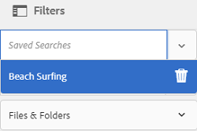

# Hantera samlingar {#managing-collections}

En samling är en uppsättning resurser i [!DNL Adobe Experience Manager Assets]. Använd samlingar för att dela resurser mellan användare. Uppsättningen kan vara en statisk samling eller en dynamisk samling som baseras på sökresultat.

Till skillnad från mappar kan en samling innehålla resurser från olika platser. Du kan dela samlingar med olika användare som har olika behörighetsnivåer, t.ex. visning, redigering och så vidare.

Du kan dela flera samlingar med en användare. Varje samling innehåller referenser till resurser. Resursernas referensintegritet bevaras i alla samlingar.

Samlingar är av följande typer, baserat på det sätt som de samlar resurser på:

* En samling som innehåller en statisk referenslista med resurser, mappar och andra samlingar.

* En smart samling som dynamiskt inkluderar resurser baserat på sökvillkor.

## Åtkomst till samlingskonsolen {#navigating-the-collections-console}

Öppna **[!UICONTROL Collections]** i gränssnittet [!DNL Experience Manager] genom att gå till **[!UICONTROL Assets]** > **[!UICONTROL Collections]**.

## Skapa en samling {#creating-a-collection}

Du kan skapa en samling antingen med [statiska referenser](#creating-a-collection-with-static-references) eller baserat på ett [sökkriteriebaserat filter](#creating-a-smart-collection). Du kan också skapa en samling från en ljuslåda.

### Skapa en samling med statiska referenser {#creating-a-collection-with-static-references}

Du kan skapa en samling med statiska referenser, t.ex. en samling med referenser till resurser, mappar, samlingar, snurrsuppsättningar och bilduppsättningar.

1. Navigera till **[!UICONTROL Collections]**-konsolen.
1. Klicka på **[!UICONTROL Create]** i verktygsfältet.
1. På sidan **[!UICONTROL Create Collection]** anger du en rubrik och en valfri beskrivning för samlingen.
1. Lägg till medlemmar i samlingen och tilldela lämpliga behörigheter. Du kan också välja **[!UICONTROL Public Collection]** om du vill tillåta alla användare att komma åt samlingen.

   >[!NOTE]
   >
   >Om du vill att medlemmarna ska kunna dela samlingar med andra användare anger du `dam-users`-gruppens läsbehörighet på sökvägen `home/users`. Ge användarna på `/content/dam/collections` plats behörighet att tillåta användarna att visa samlingar i popup-listor. Du kan också göra användaren till en del av `dam-users`-gruppen.

1. (Valfritt) Lägg till en miniatyrbild för samlingen.
1. Klicka på **[!UICONTROL Create]** och sedan på **[!UICONTROL OK]** för att stänga dialogrutan. En samling med den angivna titeln och de angivna egenskaperna öppnas i konsolen Samlingar.

   >[!NOTE]
   >
   >[!DNL Experience Manager Assets] I kan du skapa granskningsåtgärder för en samling på samma sätt som du skapar granskningsåtgärder för en resursmapp.

   Om du vill lägga till resurser i samlingen går du till [!DNL Assets]-användargränssnittet. Mer information finns i [Lägga till resurser i en samling](#adding-assets-to-a-collection).

### Skapa samlingar med dropzone {#create-collections-using-dropzone}

Du kan dra resurser från [!DNL Assets]-användargränssnittet till en samling. Du kan också skapa en kopia av en samling och dra resurserna dit.

1. I [!DNL Assets]-användargränssnittet väljer du de resurser som du vill lägga till i en samling.
1. Dra resurserna till zonen **[!UICONTROL Drop in Collection]**. Du kan också klicka på **[!UICONTROL To Collection]** i verktygsfältet.

   

1. Klicka på **[!UICONTROL Create Collection]** i verktygsfältet på sidan **[!UICONTROL Add To Collection]**.

   Om du vill lägga till resurserna i en befintlig samling markerar du den på sidan och klickar på **[!UICONTROL Add]**. Som standard väljs den senast uppdaterade samlingen.

1. Ange ett namn för samlingen i dialogrutan **[!UICONTROL Create New Collection]**. Om du vill att samlingen ska vara tillgänglig för alla användare väljer du **[!UICONTROL Public Collection]**.
1. Klicka på **[!UICONTROL Continue]** för att skapa samlingen.

### Skapa en smart samling {#creating-a-smart-collection}

En smart samling använder ett sökvillkor för att dynamiskt fylla i resurser. Du kan skapa en smart samling med enbart filer och inte med mappar eller filer och mappar.

Så här skapar du en smart samling:

1. Navigera till användargränssnittet för [!DNL Assets] och klicka på Sök.

1. Skriv sökordet i rutan Sök och tryck på `Enter`. Öppna filterpanelen och använd ett sökfilter.

1. Välj **[!UICONTROL Files]** i listan **[!UICONTROL Files & Folders]**.

   

1. Klicka på **[!UICONTROL Save Smart Collection]**.

1. Ange ett namn för samlingen. Välj **[!UICONTROL Public]** om du vill lägga till DAM-användargruppen med visningsrollen i den smarta samlingen.

   

   >[!NOTE]
   >
   >Om du väljer **[!UICONTROL Public]** blir den smarta samlingen tillgänglig för alla med ägarrollen när du har skapat den. Om du avmarkerar alternativet **[!UICONTROL Public]** är DAM-användargruppen inte längre kopplad till den smarta samlingen.

1. Klicka på **[!UICONTROL Save]** för att skapa den smarta samlingen och stäng sedan meddelanderutan för att slutföra processen.

   Den nya smarta samlingen läggs också till i listan **[!UICONTROL Saved Searches]**.

   

   Etiketten för alternativet **[!UICONTROL Create Smart Selection]** ändras till **[!UICONTROL Edit Smart Selection]**. Om du vill redigera inställningarna för den smarta samlingen väljer du **[!UICONTROL Files]** i listan **[!UICONTROL Files & Folders]**. Klicka på alternativet **[!UICONTROL Edit Smart Selection]** .

## Lägga till resurser i en samling {#adding-assets-to-a-collection}

Du kan lägga till resurser i en samling som innehåller en lista med refererade resurser eller mappar. Smarta samlingar använder en sökfråga för att fylla i resurser. Statiska referenser till resurser och mappar kan därför inte användas för dem.

1. I [!DNL A]användargränssnittet för resurser markerar du resursen och klickar på **[!UICONTROL To Collection]**  i verktygsfältet.
Du kan också dra resursen till **[!UICONTROL Drop in Collection]**-området i gränssnittet. Lägg till resurserna när regionens etikett ändras till **[!UICONTROL Drop to Add]**.

1. På sidan **[!UICONTROL Add To Collection]** väljer du den samling som du vill lägga till resursen i.

1. Klicka på **[!UICONTROL Add]** och stäng sedan bekräftelsemeddelandet. Resursen läggs till i samlingen.

## Redigera en smart samling {#editing-a-smart-collection}

Smarta samlingar skapas genom att en sökning sparas så att du kan ändra deras innehåll genom att ändra sökparametrarna för den sparade sökningen [.](#saved-searches)

1. I [!DNL Assets]-användargränssnittet klickar du på sökalternativet  i verktygsfältet.
1. Tryck på returtangenten när markören är i Omnissearch-rutan.
1. Öppna panelen Filter i gränssnittet [!DNL Experience Manager].
1. Välj den smarta samling du vill ändra i listan **[!UICONTROL Saved Searches]**. På sökpanelen visas de filter som har konfigurerats för den sparade sökningen.

   

1. Välj **[!UICONTROL Files]** i listan **[!UICONTROL Files & Folders]**.
1. Ändra ett eller flera filter efter behov. Klicka på **[!UICONTROL Edit Smart Collection]**.

   Du kan också redigera namnet på den smarta samlingen.

   

1. Klicka på **[!UICONTROL Save]**. Dialogrutan **[!UICONTROL Edit Smart Collection]** visas.
1. Klicka på **[!UICONTROL Overwrite]** om du vill ersätta den ursprungliga smarta samlingen med den redigerade samlingen. Du kan också välja **[!UICONTROL Save As]** om du vill spara den redigerade samlingen separat.
1. Klicka på **[!UICONTROL Save]** i bekräftelsedialogrutan för att slutföra processen.

## Visa och redigera samlingsmetadata {#view-edit-collection-metadata}

Samlingsmetadata omfattar data om samlingen, inklusive taggar som läggs till.

1. Välj en samling i [!UICONTROL Collections]-konsolen och klicka på **[!UICONTROL Properties]** i verktygsfältet.
1. På sidan **[!UICONTROL Collection Metadata]** visar du samlingens metadata från flikarna **[!UICONTROL Basic]** och **[!UICONTROL Advanced]**.
1. Ändra metadata efter behov. Spara ändringarna genom att klicka på **[!UICONTROL Save & Close]** i verktygsfältet.

## Redigera metadata för flera samlingar i grupp {#editing-collection-metadata-in-bulk}

Du kan redigera metadata för flera samlingar samtidigt. Med den här funktionen kan du snabbt replikera vanliga metadata i flera samlingar.

1. Välj två eller flera samlingar i konsolen Samlingar.
1. Klicka på **[!UICONTROL Properties]** i verktygsfältet.
1. På sidan **[!UICONTROL Collection Metadata]** redigerar du metadata på flikarna **[!UICONTROL Basic]** och **[!UICONTROL Advanced]** efter behov.
1. Om du vill visa metadataegenskaperna för en viss samling avmarkerar du de återstående samlingarna i samlingslistan. Metadataredigeringsfälten fylls i med metadata för den aktuella samlingen.

   >[!NOTE]
   >
   >* På sidan [!UICONTROL Properties] kan du ta bort samlingar från listan med samlingar genom att avmarkera dem. I samlingslistan är alla samlingar markerade som standard. [!DNL Experience Manager] uppdaterar inte metadata för de samlingar som du tar bort.
   >* Överst i listan markerar du kryssrutan nära **[!UICONTROL Title]** för att växla mellan att markera samlingarna och rensa listan.

1. Klicka på **[!UICONTROL Save & Close]** i verktygsfältet och stäng sedan bekräftelsedialogrutan.
1. Om du vill lägga till nya metadata till de befintliga metadata väljer du **[!UICONTROL Append mode]**. Om du inte markerar det här alternativet ersätter de nya metadata de data som finns i fälten. Klicka på **[!UICONTROL Submit]**.

   >[!NOTE]
   >
   >De metadata som du lägger till för de valda samlingarna skriver över tidigare metadata för dessa samlingar. Använd [!UICONTROL Append mode] för att lägga till nya värden till befintliga metadata i fälten som kan innehålla flera värden. Enkelvärdesfält skrivs alltid över. Alla taggar som du lägger till i fältet [!UICONTROL Tags] läggs till i den befintliga listan med taggar i metadata.

Om du vill anpassa sidan med metadata [!UICONTROL Properties], inklusive lägga till, ändra eller ta bort metadataegenskaper, använder du schemaredigeraren.

>[!TIP]
>
>Massredigeringsmetoden fungerar för resurser som är tillgängliga i en samling. För resurser som är tillgängliga mellan mappar eller matchar ett gemensamt villkor är det möjligt att [uppdatera metadata satsvis efter sökning](/help/assets/search-assets.md#metadataupdates).

## Sök i samlingar {#searching-collections}

Du kan söka efter samlingar från samlingskonsolen. När du söker med nyckelord i sökrutan söker [!DNL Assets] efter samlingsnamn, metadata och de taggar som har lagts till i samlingarna.

Om du söker efter samlingar från den översta nivån returneras bara enskilda samlingar i sökresultaten. [!DNL Assets] eller mappar i samlingarna exkluderas. I alla andra fall (till exempel i en enskild samling eller i en mapphierarki) returneras alla relevanta resurser, mappar och samlingar.

## Sök i samlingar {#searching-within-collections}

Öppna en samling genom att klicka på den i konsolen Samlingar.

I en samling är [!DNL Experience Manager]-sökningen begränsad till resurser (och deras taggar och metadata) i samlingen som du visar. När du söker i en mapp returneras alla matchande resurser och underordnade mappar i den aktuella mappen. När du söker i en samling returneras endast matchande resurser, mappar och andra samlingar som är direktmedlemmar i samlingen.

## Redigera samlingsinställningar {#editing-collection-settings}

Du kan redigera samlingsinställningar, till exempel rubrik och beskrivning, eller lägga till medlemmar i en samling.

1. Markera en samling och klicka på **[!UICONTROL Settings]** i verktygsfältet. Du kan också använda snabbåtgärden **[!UICONTROL Settings]** från samlingsminiatyrbilden.
1. Ändra inställningarna för samlingen på sidan **[!UICONTROL Collection Settings]**. Du kan till exempel ändra samlingens rubrik, beskrivningar, medlemmar och behörigheter enligt beskrivningen i [Lägga till samlingar](#creating-a-collection).

1. Spara ändringarna genom att klicka på **[!UICONTROL Save]**.

## Ta bort en samling {#deleting-a-collection}

1. Välj en eller flera samlingar i konsolen Samlingar och klicka på Ta bort i verktygsfältet.

1. Klicka på **[!UICONTROL Delete]** i dialogrutan för att bekräfta borttagningsåtgärden.

   >[!NOTE]
   >
   >Du kan också ta bort smarta samlingar genom att [ta bort sparade sökningar](#saved-searches).

## Hämta en samling {#downloading-a-collection}

När du hämtar en samling hämtas hela resurshierarkin i samlingen, inklusive mappar och underordnade samlingar.

1. Välj en eller flera samlingar som du vill hämta från samlingskonsolen.
1. Klicka på **[!UICONTROL Download]** i verktygsfältet.
1. I dialogrutan **[!UICONTROL Download]** klickar du på **[!UICONTROL Download]**. Om du vill hämta återgivningarna av resurserna i samlingen väljer du **[!UICONTROL Renditions]**. Välj alternativet **[!UICONTROL Email]** om du vill skicka ett e-postmeddelande till samlingens ägare.

   När du väljer en samling som ska hämtas hämtas hela mapphierarkin under samlingen. Om du vill inkludera varje samling som du hämtar (inklusive resurser i underordnade samlingar som är kapslade under den överordnade samlingen) i en enskild mapp väljer du **[!UICONTROL Create separate folder for each asset]**.

## Skapa kapslade samlingar {#creating-nested-collections}

Du kan lägga till en samling i en annan samling och på så sätt skapa en kapslad samling.

1. Välj önskad samling eller grupp med samlingar i konsolen Samlingar och klicka på **[!UICONTROL To Collection]** i verktygsfältet.

1. På sidan **[!UICONTROL Add To Collection]** väljer du den samling som du vill lägga till samlingen i.

   >[!NOTE]
   >
   >Den senast uppdaterade samlingen väljs som standard på sidan **[!UICONTROL Add To Collection]**.

1. Klicka på **[!UICONTROL Add]**. Ett meddelande bekräftar att samlingen har lagts till i målsamlingen på sidan **[!UICONTROL Select Destination]**. Stäng meddelandet för att slutföra processen.

>[!NOTE]
>
>Smarta samlingar kan inte kapslas. Smarta samlingar kan alltså inte innehålla andra samlingar.

## Sparade sökningar {#saved-searches}

I [!DNL Assets]-användargränssnittet kan du söka efter eller filtrera resurser baserat på vissa regler, sökvillkor eller anpassade sökfaktorer. Om du sparar dem som **[!UICONTROL Saved Searches]** kan du komma åt dem senare från listan **[!UICONTROL Saved Searches]** på panelen Filter. När du skapar en sparad sökning skapas även en smart samling.

Sparade sökningar skapas när du skapar en smart samling. Smarta samlingar läggs automatiskt till i listan **[!UICONTROL Saved Searches]**. [!UICONTROL Saved Searches]-frågan för samlingen sparas i egenskapen `dam:query` i CRXDE på den relativa platsen `/content/dam/collections/`. Det finns inga begränsningar för de sökningar som du kan spara och för de sparade sökningarna som visas i listan.

>[!NOTE]
>
>Du kan dela smarta samlingar på samma sätt som du delar statiska samlingar.

Att redigera sparade sökningar är detsamma som att redigera smarta samlingar. Mer information finns i [redigera en smart samling](#editing-a-smart-collection).

Så här tar du bort sparade sökningar:

1. I [!DNL Assets]-användargränssnittet klickar du på sök .
1. Tryck på returtangenten när markören är i omsökningsfältet.
1. Öppna panelen Filter i gränssnittet [!DNL Experience Manager].
1. I listan **[!UICONTROL Saved Searches]** klickar du på **[!UICONTROL Delete]** bredvid den smarta samling som du vill ta bort.

   

1. Klicka på **[!UICONTROL Delete]** i dialogrutan för att ta bort den sparade sökningen.

## Kör ett arbetsflöde i en samling {#running-a-workflow-on-a-collection}

Du kan köra ett arbetsflöde för resurserna i en samling. Om samlingen innehåller kapslade samlingar körs arbetsflödet även på resurserna i de kapslade samlingarna. Om samlingen och den kapslade samlingen innehåller duplicerade resurser körs arbetsflödet bara en gång för sådana resurser.

1. Öppna **[!UICONTROL Assets]** > **[!UICONTROL Collections]**. Om du vill köra ett arbetsflöde på en viss samling markerar du den.
1. Öppna **[!UICONTROL Timeline]**-skenan. Klicka på  och klicka på **[!UICONTROL Start Workflow]**.
1. I avsnittet **[!UICONTROL Start Workflow]** väljer du en arbetsflödesmodell i listan. Välj till exempel modellen **[!UICONTROL DAM Update Asset]**.
1. Ange en rubrik för arbetsflödet och klicka på **[!UICONTROL Start]**.
1. Klicka på **[!UICONTROL Proceed]** i dialogrutan. Arbetsflödet bearbetar alla resurser i den valda samlingen.

>[!MORELIKETHIS]
>
>* [Konfigurera e-postmeddelanden för Experience Manager Assets](/help/sites-administering/notification.md#assetsconfig)
>* [Skapa en granskningsuppgift för samlingar](bulk-approval.md)

