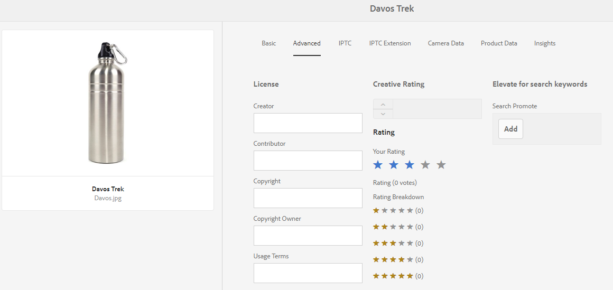
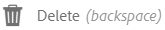
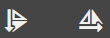
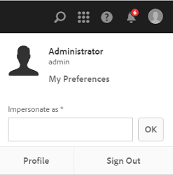

# Hantera era digitala resurser {#managing-assets-with-the-touch-optimized-ui}

I den här artikeln beskrivs hur du hanterar och redigerar resurser i Adobe Experience Manager (AEM) Assets. Information om hur du kommer igång med användargränssnittet och layouten finns i [Grundläggande hantering av Touch-gränssnittet](/help/sites-authoring/basic-handling.md). Mer information om hur du hanterar innehållsfragment finns i [Hantera resurser för innehållsfragment](content-fragments-managing.md) .

## Skapa mappar {#creating-folders}

När du organiserar en samling resurser, till exempel alla `Nature` bilder, kan du skapa mappar som håller ihop dem. Du kan använda mappar för att kategorisera och ordna dina resurser. AEM Resurser kräver inte att du ordnar resurser i mappar för att de ska fungera bättre.

>[!NOTE]
>
>* Delning av en resursmapp av den typen `sling:OrderedFolder`stöds inte när den delas till Marketing Cloud. Om du vill dela en mapp ska du inte välja [!UICONTROL Ordnad] när du skapar en mapp.
>* Det går inte att använda `subassets` ordet som namn på en mapp i Experience Manager. Det är ett nyckelord som är reserverat för nod som innehåller delresurser för sammansatta resurser.

1. Navigera till den plats i mappen med digitala resurser där du vill skapa en ny mapp. Klicka på **[!UICONTROL Skapa]** på menyn. Välj **[!UICONTROL Ny mapp]**.
1. Ange ett mappnamn i fältet **[!UICONTROL Titel]** . Som standard använder DAM den titel som du angav som mappnamn. När mappen har skapats kan du åsidosätta standardmappen och ange ett annat mappnamn.
1. Klicka på **[!UICONTROL Skapa]**. Mappen visas i mappen med digitala resurser.

Följande (blankstegsavgränsad lista med) tecken stöds inte:

* Namnet på en resursfil får inte innehålla något av följande tecken: `* / : [ \\ ] | # % { } ? &`
* Namnet på en resursmapp får inte innehålla något av följande tecken: `* / : [ \\ ] | # % { } ? \" . ^ ; + & \t`

## Överför resurser {#uploading-assets}

<!-- TBD the following:
Move this section into a new article. CQDOC-14874 ticket is created for this.
In this complete article, replace emphasis with UICONTROL where appropriate.
-->

Du kan överföra olika typer av resurser (inklusive bilder, PDF-filer, RAW-filer och så vidare) från den lokala mappen eller en nätverksenhet till AEM Resurser.

>[!NOTE]
>
>I läget Dynamic Media - Scene7 kan du bara överföra resurser vars filstorlek är 2 GB eller mindre.

Du kan välja att överföra resurser till mappar med eller utan en bearbetningsprofil tilldelad dem.

För mappar som har en tilldelad bearbetningsprofil visas profilnamnet på miniatyrbilden i kortvyn. I listvyn visas profilnamnet i kolumnen **Bearbeta profil** . Se [Bearbeta profiler](/help/assets/processing-profiles.md).

Innan du överför en resurs måste du kontrollera att den har ett [format](/help/assets/assets-formats.md) som AEM Assets stöder.

1. I Assets-användargränssnittet navigerar du till den plats där du vill lägga till digitala resurser.
1. Gör något av följande om du vill överföra resurserna:

   * Tryck på ikonen **[!UICONTROL Skapa]** i verktygsfältet. Tryck sedan på **[!UICONTROL Filer]** på menyn. Du kan byta namn på filen i den dialogruta som visas om det behövs.
   * I en webbläsare som har stöd för HTML5 drar du resurserna direkt till användargränssnittet Resurser. Dialogrutan för att byta namn på filen visas inte.
   

   Om du vill markera flera filer trycker du på Ctrl- eller Kommando-tangenten och markerar resurserna i dialogrutan för filväljaren. När du använder en iPad kan du bara markera en fil i taget.

   Du kan pausa överföringen av stora resurser (större än 500 MB) och återuppta den senare från samma sida. Tryck på **[!UICONTROL pausikonen]** bredvid förloppsindikatorn som visas när en överföring startar.

   

   Den storlek över vilken en tillgång betraktas som en stor tillgång kan konfigureras. Du kan till exempel konfigurera systemet så att resurser över 1 000 MB (i stället för 500 MB) betraktas som stora resurser. I det här fallet visas **[!UICONTROL Pausa]** i förloppsindikatorn när resurser som är större än 1 000 MB överförs.

   Pausknappen visas inte om en fil som är större än 1 000 MB överförs med en fil som är mindre än 1 000 MB. Om du avbryter filöverföringen på mindre än 1 000 MB visas knappen **[!UICONTROL Paus]** .

   Om du vill ändra storleksgränsen konfigurerar du `chunkUploadMinFileSize` egenskapen för `fileupload`noden i CRX-databasen.

   När du klickar på **[!UICONTROL pausikonen]** växlar den till en **[!UICONTROL uppspelningsikon]** . Om du vill återuppta överföringen klickar du på **[!UICONTROL uppspelningsikonen]** .

   

   Om du vill avbryta en pågående överföring klickar du på Stäng (`X`) bredvid förloppsindikatorn. När du avbryter överföringen tas den delvis överförda delen av resursen bort.

   Möjligheten att återuppta överföring är särskilt användbar i scenarier med låg bandbredd och nätverksfel, där det tar lång tid att överföra stora resurser. Du kan pausa överföringen och fortsätta senare när situationen förbättras. När du återupptar startar överföringen från den punkt där du pausade den.

   Under överföringen sparar AEM de delar av resursen som överförs som datablock i CRX-databasen. När överföringen är klar konsoliderar AEM dessa segment till ett enda datablock.

   Om du vill konfigurera rensningsaktiviteten för de oavslutade segmentöverföringsjobben går du till `https://[aem_server]:[port]/system/console/configMgr/org.apache.sling.servlets.post.impl.helper.ChunkCleanUpTask`.

   Om du överför en resurs med samma namn som en resurs som redan finns på den plats där du överför resursen visas en varningsdialogruta.

   Du kan välja att ersätta en befintlig resurs, skapa en annan version eller behålla båda genom att byta namn på den nya resursen som överförs. Om du ersätter en befintlig resurs tas metadata för resursen och eventuella tidigare ändringar (till exempel anteckningar eller beskärningar) som du har gjort i den befintliga resursen bort. Om du väljer att behålla båda resurserna får den nya resursen ett nytt namn med ett nummer `1` efter resursens namn.

   

   >[!NOTE]
   >
   >När du väljer **[!UICONTROL Ersätt]** i dialogrutan [!UICONTROL Namnkonflikt] , genereras resurs-ID om för den nya resursen. Detta ID skiljer sig från ID:t för föregående resurs.
   >
   >Om tillgångsinsikter är aktiverat för att spåra visningar/klickningar med Adobe Analytics blir det återskapade resurs-ID:t ogiltigt för de data som samlats in för resursen i Analytics.

   Om resursen som du överför finns i AEM Resurser visas en varning i dialogrutan **[!UICONTROL Duplicerar upptäckt]** om att du försöker överföra en dubblettresurs. Dialogrutan visas bara om kontrollsummevärdet för den befintliga resursens binärfil matchar kontrollsummevärdet för den resurs du överför. `SHA 1` I det här fallet spelar resursernas namn ingen roll.

   >[!NOTE]
   >
   >Dialogrutan [!UICONTROL Dubbletter identifierade] visas bara när funktionen för dubblettidentifiering är aktiverad. Information om hur du aktiverar funktionen för dubblettidentifiering finns i [Aktivera dubblettidentifiering](/help/assets/duplicate-detection.md).

   

   Om du vill behålla den duplicerade resursen i AEM Resurser trycker/klickar du på **[!UICONTROL Behåll]**. Om du vill ta bort den duplicerade resursen som du överförde trycker/klickar du på **[!UICONTROL Ta bort]**.

   AEM Resurser förhindrar att du överför resurser med förbjudna tecken i filnamn. Om du försöker överföra en resurs med ett filnamn som innehåller ett eller flera otillåtna tecken visas ett varningsmeddelande i AEM Resurser och överföringen stoppas tills du tar bort dessa tecken eller överför med ett tillåtet namn.

   I dialogrutan [!UICONTROL Överför resurser] kan du ange långa namn för de filer som du överför, så att den passar organisationens specifika namnkonventioner.

   Följande (blankstegsavgränsad lista med) tecken stöds emellertid inte:

   * resursens filnamn får inte innehålla `* / : [ \\ ] | # % { } ? &`
   * resursmappens namn får inte innehålla `* / : [ \\ ] | # % { } ? \" . ^ ; + & \t`
   

   Dessutom visas den senaste resursen som du överför eller den mapp som du skapade först i användargränssnittet för Resurser.

   Om du avbryter överföringen innan filerna har överförts slutar AEM Resurser att överföra den aktuella filen och uppdaterar innehållet. Filer som redan har överförts tas dock inte bort.

   I dialogrutan för överföring i AEM Resurser visas antalet överförda filer och de filer som inte kunde överföras.

### Serieuppladdningar {#serialuploads}

Vid överföring av flera resurser i grupp förbrukas betydande I/O-resurser, vilket kan påverka prestandan negativt för din AEM Assets-instans. Om du har en långsam internetanslutning ökar tiden det tar att överföra drastiskt på grund av att disk-I/O-inläsningen har ökat. Din webbläsare kan dessutom införa ytterligare begränsningar för antalet POST-begäranden som AEM Assets kan hantera för samtidiga överföringar av resurser. Därför misslyckas överföringen eller avslutas i förtid. Med andra ord kan AEM-resurser sakna vissa filer när en grupp filer importeras eller helt och hållet inte kan importera någon fil.

För att komma till rätta med denna situation importerar AEM Assets en resurs i taget (seriell överföring) under en gruppöverföring, i stället för att alla resurser hämtas samtidigt.

Seriell överföring av resurser är aktiverat som standard. Om du vill inaktivera funktionen och tillåta samtidig överföring ska du täcka över `fileupload` noden i Crx-de och ange värdet för `parallelUploads` egenskapen till `true`.

### Överför resurser med FTP {#uploading-assets-using-ftp}

Med Dynamic Media kan du batchöverföra resurser via FTP-servern. Om du tänker överföra stora resurser (> 1 GB) eller överföra hela mappar och undermappar bör du använda FTP. Du kan till och med konfigurera FTP-överföring så att den sker regelbundet.

>[!NOTE]
>
>I läget Dynamic Media - Scene7 kan du bara överföra resurser vars filstorlek är 2 GB eller mindre.

>[!NOTE]
>
>Om du vill överföra resurser via FTP i läget Dynamic Media - Scene7 installerar du Feature Pack 18912 på AEM-författarinstanserna. Kontakta [Adobes kundtjänst](https://helpx.adobe.com/contact/enterprise-support.ec.html) för att få tillgång till FP-18912 och slutföra konfigurationen av ditt FTP-konto. Mer information finns i [Installera funktionspaket 18912 för migrering](/help/assets/bulk-ingest-migrate.md)av gruppresurser.
>
>Om du använder FTP för att överföra resurser ignoreras de överföringsinställningar som anges i AEM. I stället används filbearbetningsregler, enligt definition i Dynamic Media Classic,.

**Så här överför du resurser med FTP**

1. Logga in på FTP-servern med det FTP-användarnamn och lösenord som du fick från e-postmeddelandet om etablering. Överför filer eller mappar till FTP-servern i FTP-klienten.
1. [Logga in på Dynamic Media Classic](https://www.adobe.com/marketing-cloud/experience-manager/scene7-login.html) med hjälp av autentiseringsuppgifter från e-postmeddelandet om etablering. Tryck på **[!UICONTROL Överför]** i det globala navigeringsfältet.

1. Tryck på fliken **[!UICONTROL Via FTP]** på sidan Överför i det övre vänstra hörnet.
1. Välj en FTP-mapp att överföra filer från till vänster på sidan. till höger på sidan väljer du en målmapp.
1. Klicka på **[!UICONTROL Jobbalternativ]** i sidans nedre högra hörn och ange önskade alternativ baserat på resurserna i den mapp du valde.

   Se [Överför jobbalternativ](#upload-job-options).

   >[!NOTE]
   >
   >När du överför resurser via FTP får de överföringsjobbalternativ som du anger i Dynamic Media Classic (S7) företräde framför resurshanteringsparametrar som angetts i AEM.

1. Tryck på **[!UICONTROL Spara]** i det nedre högra hörnet av dialogrutan Alternativ för överföringsjobb.
1. Tryck på **[!UICONTROL Skicka överföring]** i det nedre högra hörnet på sidan Överför.

   Om du vill visa överföringsförloppet trycker du på **[!UICONTROL Jobb]**i det globala navigeringsfältet. På sidan Jobb visas överföringsförloppet. Du kan fortsätta arbeta i AEM och när som helst återgå till jobbsidan i Dynamic Media Classic för att granska ett pågående jobb.
Om du vill avbryta ett pågående överföringsjobb trycker du på **[!UICONTROL Avbryt]** bredvid Varaktighet.

#### Alternativ för överföringsjobb {#upload-job-options}

| Överföringsalternativ | Delalternativ | Beskrivning |
|---|---|---|
| Jobbnamn |  | Standardnamnet som är förifyllt i textfältet innehåller den användardefinierade delen av namnet och datum- och tidsstämpeln. Du kan använda standardnamnet eller ange ett namn på ditt eget skapande för det här överföringsjobbet.  Jobbet och andra överförings- och publiceringsjobb registreras på sidan Jobs, där du kan kontrollera jobbens status. |
| Publicera efter överföring |  | Publicerar automatiskt de resurser som du överför. |
| Skriv över i valfri mapp, samma basresursnamn oavsett tillägg |  | Välj det här alternativet om du vill att de filer du överför ska ersätta befintliga filer med samma namn. Namnet på det här alternativet kan vara annorlunda beroende på inställningarna i **[!UICONTROL Programinställningar]** > **[!UICONTROL Allmänna inställningar]** > **[!UICONTROL Överför till program]** > **[!UICONTROL Skriv över bilder]**. |
| Ta bort komprimering av ZIP- eller Tjära-filer vid överföring |  |  |
| Jobbalternativ |  | Tryck/klicka på **[!UICONTROL jobbalternativ]** för att öppna dialogrutan [!UICONTROL Överför jobbalternativ] och välj alternativ som påverkar hela överföringsjobbet. De här alternativen är desamma för alla filtyper. Du kan välja standardalternativ för att överföra filer från sidan Allmänna inställningar i programmet. Öppna den här sidan genom att välja **[!UICONTROL Konfigurera]** > **[!UICONTROL Programinställningar]**. Tryck på knappen **[!UICONTROL Standardalternativ]** för överföring för att öppna dialogrutan [!UICONTROL Alternativ] för överföringsjobb. |
|  | När | Välj En gång eller Återkommande. Om du vill ställa in ett återkommande jobb väljer du alternativet Upprepa - varje dag, Varje vecka, Varje månad eller Anpassa - för att ange när du vill att FTP-överföringsjobbet ska återkomma. Ange sedan schemaläggningsalternativen efter behov. |
|  | Inkludera undermappar | Överför alla undermappar i mappen som du vill överföra. Namnen på mappen och dess undermappar som du överför anges automatiskt i AEM Resurser. |
|  | Beskärningsalternativ | Om du vill beskära manuellt från sidorna av en bild väljer du Beskär-menyn och sedan Manuell. Ange sedan antalet pixlar att beskära från en sida eller från varje sida av bilden. Hur mycket av bilden som beskärs beror på bildfilens ppi-inställning (pixlar per tum). Om bilden till exempel visar 150 ppi och du anger 75 i textrutorna Överkant, Höger, Underkant och Vänster beskärs en halv tum från varje sida.  Om du vill beskära pixlar med tomt utrymme automatiskt från en bild öppnar du menyn Beskär, väljer Manuell och anger pixelmått i fälten Överkant, Höger, Underkant och Vänster för att beskära från sidorna. Du kan också välja Trimma på menyn Beskär och välja följande alternativ:  **Trimma bort baserat på** <ul><li>**Färg** - Välj alternativet Färg. Välj sedan menyn Hörn och välj hörnet på bilden med den färg som bäst motsvarar den tomrumsfärg som du vill beskära.</li><li>**Genomskinlighet** - Välj alternativet Genomskinlighet.  **Tolerans** - Dra i skjutreglaget för att ange en tolerans mellan 0 och 1. Om du vill trimma baserat på färg anger du 0 för att beskära pixlar endast om de exakt matchar den färg du valde i hörnet av bilden. Nummer som ligger närmare 1 ger större färgskillnader. Om du vill trimma baserat på genomskinlighet anger du 0 så att pixlarna bara beskärs om de är genomskinliga. Siffror närmare 1 ger större genomskinlighet.</li></ul> Observera att dessa beskärningsalternativ är icke-förstörande. |
|  | Alternativ för färgprofil | Välj en färgkonvertering när du skapar optimerade filer som används för leverans:<ul><li>Standardfärgbevaring: Behåller källbildens färger när bilderna innehåller färgrymdsinformation. det inte finns någon färgkonvertering. Nästan alla bilder idag har rätt färgprofil inbäddad. Om en CMYK-källbild inte innehåller någon inbäddad färgprofil konverteras färgerna till sRGB-färgrymden (standard röd grön). sRGB är den rekommenderade färgrymden för visning av bilder på webbsidor.</li><li>Behåll ursprunglig färgrymd: Bevarar de ursprungliga färgerna utan någon färgkonvertering vid punkten. För bilder utan inbäddad färgprofil görs färgkonverteringen med de standardfärgprofiler som konfigurerats i publiceringsinställningarna. Färgprofilerna kanske inte justeras mot färgen i de filer som skapas med det här alternativet. Därför bör du använda alternativet Standardfärgbevaring.</li><li>Anpassad från > Till  öppnar menyer så att du kan välja färgmodellen Konvertera från och Konvertera till. Det här avancerade alternativet åsidosätter eventuell färginformation som är inbäddad i källfilen. Välj det här alternativet när alla bilder som du skickar in innehåller felaktiga eller saknade färgprofildata.</li></ul> |
|  | Bildredigeringsalternativ | Du kan bevara urklippsmaskerna i bilder och välja en färgprofil.  Se [Ange bildredigeringsalternativ vid överföring](#setting-image-editing-options-at-upload). |
|  | PostScript-alternativ | Du kan rastrera PostScript®-filer, beskära filer, behålla genomskinliga bakgrunder, välja en upplösning och välja en färgrymd.  Se [Ange överföringsalternativ](#setting-postscript-and-illustrator-upload-options)för PostScript och Illustrator. |
|  | Photoshop-alternativ | Du kan skapa mallar från Adobe® Photoshop®-filer, behålla lager, ange hur lager ska namnges, extrahera text och ange hur bilder ska förankras i mallar.  Observera att mallar inte stöds i AEM.  Se [Ange överföringsalternativ](#setting-photoshop-upload-options)för Photoshop. |
|  | PDF-alternativ | Du kan rastrera filerna, extrahera sökord och länkar, automatiskt generera en e-katalog, ange upplösningen och välja en färgrymd.  Observera att e-kataloger inte stöds i AEM.   Se [Ange överföringsalternativ](#setting-pdf-upload-options)för PDF. |
|  | Illustrator-alternativ | Du kan rastrera Adobe Illustrator®-filer, behålla genomskinliga bakgrunder, välja en upplösning och välja en färgrymd.  Se [Ange överföringsalternativ](#setting-postscript-and-illustrator-upload-options)för PostScript och Illustrator. |
|  | EVideoalternativ | Du kan omkoda en videofil genom att välja en videoförinställning.  Se [Ange alternativ](#setting-evideo-upload-options)för eVideo-överföring. |
|  | Förinställningar för gruppuppsättning | Om du vill skapa en bilduppsättning, eller en snurra uppsättning, från de överförda filerna klickar du på kolumnen Aktiv för den förinställning som du vill använda. Du kan markera flera förinställningar. Du skapar förinställningarna på sidan Programinställningar/Gruppinställningar i Dynamic Media Classic.  Mer information om hur du skapar förinställningar för gruppuppsättningar finns i [Konfigurera förinställningar för gruppuppsättningar för att automatiskt generera bilduppsättningar och](config-dms7.md#creating-batch-set-presets-to-auto-generate-image-sets-and-spin-sets) snurruppsättningar.  Se [Ställa in förinställningar för gruppuppsättning vid överföring](#setting-batch-set-presets-at-upload). |

#### Ange bildredigeringsalternativ vid överföring {#setting-image-editing-options-at-upload}

När du överför bildfiler, inklusive AI-, EPS- och PSD-filer, kan du utföra följande redigeringsåtgärder i dialogrutan [!UICONTROL Överför jobbalternativ] :

* Beskär tomt utrymme från bildens kant (se beskrivningen i tabellen ovan).
* Beskär manuellt från bildsidorna (se beskrivningen i tabellen ovan).
* Välj en färgprofil (se alternativbeskrivningen i tabellen ovan).
* Skapa en mask från en urklippsbana.
* Öka skärpan i bilder med oskarpa maskningsalternativ
* Blockera bakgrund

<!--
| Option | Sub-option | Description |
|---|---|---|
| Create Mask From Clipping Path | | Create a mask for the image based on its clipping path information. This option applies to images created with image-editing applications in which a clipping path was created. |
| Unsharp Masking | | Lets you fine-tune a sharpening filter effect on the final downsampled image, controlling the intensity of the effect, the radius of the effect (as measured in pixels), and a threshold of contrast that is ignored.  This effect uses the same options as Photoshop’s Unsharp Mask filter. Contrary to what the name suggests, Unsharp Mask is a sharpening filter. Under Unsharp Masking, set the options you want. Setting options are described in the following: |
| | Amount | Controls the amount of contrast that is applied to edge pixels.  Think of it as the intensity of the effect. The main difference between the amount values of Unsharp Mask in Dynamic Media and the amount values in Adobe Photoshop, is that Photoshop has an amount range of 1% to 500%. Whereas, in Dynamic Media, the value range is 0.0 to 5.0. A value of 5.0 is the rough equivalent of 500% in Photoshop; a value of 0.9 is the equivalent of 90%, and so on. |
| | Radius | Controls the radius of the effect. The value range is 0-250.  The effect is run on all pixels in an image and radiates out from all pixels in all directions. The radius is measured in pixels. For example, to get a similar sharpening effect for a 2000 x 2000 pixel image and 500 x 500 pixel image, you would set a radius of two pixels on the 2000 x 2000 pixel image and a radius value of one pixel on the 500 x 500 pixel image. A larger value is used for an image that has more pixels. |
| | Threshold | Threshold is a range of contrast that is ignored when the Unsharp Mask filter is applied. It is important so that no "noise" is introduced to an image when this filter is used. The value range is 0-255, which is the number of brightness steps in a grayscale image. 0=black, 128=50% gray and 255=white.  For example, a threshold value of 12 ignores slight variations is skin tone brightness to avoid adding noise, but still add edge contrast to areas such as where eyelashes meet skin.  For example, if you have a photo of someone’s face, the Unsharp Mask affects the parts of the image, such as where eyelashes and skin meet to create an obvious area of contrast, and the smooth skin itself. Even the smoothest skin exhibits subtle changes in brightness values. If you do not use a threshold value, the filter accentuates these subtle changes in skin pixels. In turn, a noisy and undesirable effect is created while contrast on the eyelashes is increased, enhancing sharpness.  To avoid this issue, a threshold value is introduced that tells the filter to ignore pixels that do not change contrast dramatically, like smooth skin.  In the zipper graphic shown earlier, notice the texture next to the zippers. Image noise is exhibited because the threshold values were too low to suppress the noise. |
| | Monochrome | Select to unsharp-mask image brightness (intensity).  Deselect to unsharp-mask each color component separately. |
| Knockout Background | | Automatically removes the background of an image when you upload it. This technique is useful to draw attention to a particular object and make it stand out from a busy background. Select to enable or “turn on” the Knockout Background feature and the following sub-options: |
| | Corner | Required.  The corner of the image that is used to define the background color to knockout.  You can choose from **Upper Left**, **Bottom Left**, **Upper Right**, or **Bottom Right**. |
| | Fill Method | Required.  Controls pixel transparency from the Corner location that you set.  You can choose from the following fill methods: <ul><li>**Flood Fill** - turns all pixels transparent that match the Corner that you have specified and are connected to it.</li><li>**Match Pixel** - turns all matching pixels transparent, regardless of their location on the image.</li></ul> |
| | Tolerance | Optional.  Controls the allowable amount of variation in pixel color matching based on the Corner location that you set.  Use a value of 0.0 to match pixel colors exactly or, use a value of 1.0 to allow for the greatest variation. |
-->

#### Ange överföringsalternativ för PostScript och Illustrator {#setting-postscript-and-illustrator-upload-options}

När du överför PostScript- (EPS) eller Illustrator-bildfiler (AI) kan du formatera dem på olika sätt. Du kan rastrera filerna, behålla den genomskinliga bakgrunden, välja en upplösning och välja en färgrymd. Alternativ för formatering av PostScript- och Illustrator-filer finns i dialogrutan [!UICONTROL Överför jobbalternativ] under [!UICONTROL PostScript-alternativ] och [!UICONTROL Illustrator-alternativ].

| Alternativ | Delalternativ | Beskrivning |
|---|---|---|
| Bearbetar |  | Välj **[!UICONTROL Rastrera]** om du vill konvertera vektorgrafik i filen till bitmappsformat. |
| Bevara genomskinlig bakgrund i återgiven bild |  | Bevara filens genomskinlighet i bakgrunden. |
| Upplösning |  | Anger upplösningsinställningen. Den här inställningen avgör hur många pixlar som visas per tum i filen. |
| Färgrymd |  | Välj menyn Färgrymd och välj bland följande alternativ för färgrymd: |
|  | Identifiera automatiskt | Bevarar filens färgrymd. |
|  | Tvinga som RGB | Konverterar till RGB-färgmodellen. |
|  | Tvinga som CMYK | Konverterar till CMYK-färgmodellen. |
|  | Tvinga som gråskala | Konverterar till gråskalefärgrymden. |

#### Ange överföringsalternativ för Photoshop {#setting-photoshop-upload-options}

Photoshop-dokumentfiler (PSD) används oftast för att skapa bildmallar. När du överför en PSD-fil kan du skapa en bildmall automatiskt från filen (välj alternativet [!UICONTROL Skapa mall] på överföringsskärmen).

Dynamic Media skapar flera bilder från en PSD-fil med lager om du använder filen för att skapa en mall; skapas en bild för varje lager.

Använd alternativen för [!UICONTROL beskärningsalternativ] och [!UICONTROL Färgprofil]som beskrivs ovan tillsammans med överföringsalternativen för Photoshop.

>[!NOTE]
>
>Mallar stöds inte i AEM.

| Alternativ | Delalternativ | Beskrivning |
|---|---|---|
| Behåll lager |  | Rippar lagren i PSD-filen, om det finns några, till enskilda resurser. Resurslagren förblir kopplade till PSD-filen. Du kan visa dem genom att öppna PSD-filen i detaljvyn och välja lagerpanelen. |
| Skapa mall |  | Skapar en mall från lagren i PSD-filen. |
| Extrahera text |  | Extraherar texten så att användare kan söka efter text i ett visningsprogram. |
| Utöka lager till bakgrundsstorlek |  | Utökar storleken på överlappade bildlager till storleken på bakgrundslagret. |
| Namnge lager |  | Lager i PSD-filen överförs som separata bilder. |
|  | Lagernamn | Namnger bilderna efter deras lagernamn i PSD-filen. Ett lager med namnet Price Tag i den ursprungliga PSD-filen blir till exempel en bild med namnet Price Tag. Om lagernamnen i PSD-filen är standardlagernamn för Photoshop (Bakgrund, Lager 1, Lager 2 och så vidare) får bilderna namn efter sina lagernummer i PSD-filen, inte efter deras standardlagernamn. |
|  | Photoshop och lagernummer | Namnger bilderna efter deras lagernummer i PSD-filen och ignorerar de ursprungliga lagernamnen. Bilder namnges med Photoshops filnamn och ett nummer på lagret som läggs till. Det andra lagret i en fil som heter Spring Ad.psd får till exempel namnet Spring Ad_2 även om det har ett icke-standardnamn i Photoshop. |
|  | Photoshop och lagernamn | Namnger bilderna efter PSD-filen följt av lagernamnet eller lagernumret. Lagernumret används om lagernamnen i PSD-filen är standardlagernamn i Photoshop. Ett lager med namnet Price Tag i en PSD-fil med namnet SpringAd får till exempel namnet Spring Ad_Price Tag. Ett lager med standardnamnet Lager2 kallas Spring Ad_2. |
| Fästpunkt |  | Ange hur bilder ska förankras i mallar som genereras från lagerkompositionen som skapas från PSD-filen. Som standard är ankarpunkten i mitten. Med en central ankarpunkt kan ersättningsbilder bäst fylla samma område, oavsett ersättningsbildens proportioner. Bilder med en annan aspekt som ersätter den här bilden upptar i själva verket samma utrymme när de refererar till mallen och använder parameterersättning. Ändra till en annan inställning om ditt program kräver att ersättningsbilderna fyller ut det tilldelade utrymmet i mallen. |

#### Ange överföringsalternativ för PDF {#setting-pdf-upload-options}

När du överför en PDF-fil kan du formatera den på olika sätt. Du beskär sidorna, extraherar sökord, anger en pixel per tum-upplösning och väljer en färgrymd. PDF-filer innehåller ofta en ytmarginal, skärmärken, passmärken och andra skrivarmärken. Du kan beskära dessa märken från sidorna när du överför en PDF-fil.

>[!NOTE]
>
>eCatalogs stöds inte i AEM.

Välj bland följande alternativ:

| Alternativ | Delalternativ | Beskrivning |
|---|---|---|
| Bearbetar | Rastrera | (Standard) Rippar ned sidorna i PDF-filen och konverterar vektorgrafik till bitmappsbilder. Välj det här alternativet om du vill skapa en e-katalog. |
| Extract | Sök efter ord | Extraherar ord från PDF-filen så att filen kan genomsökas efter nyckelord i en eCatalog Viewer. |
|  | Länkar | Extraherar länkar från PDF-filerna och konverterar dem till bildscheman som används i en eCatalog Viewer. |
| Generera eCatalog automatiskt från PDF med flera sidor |  | Skapar automatiskt en e-katalog från PDF-filen. eCatalog namnges efter den PDF-fil du överförde. (Det här alternativet är bara tillgängligt om du rastrerar PDF-filen när du överför den.) |
| Upplösning |  | Anger upplösningsinställningen. Den här inställningen avgör hur många pixlar som visas per tum i PDF-filen. Standardvärdet är 150. |
| Färgrymd |  | Välj menyn Färgrymd och välj en färgrymd för PDF-filen. De flesta PDF-filer har både RGB- och CMYK-färgbilder. RGB-färgmodellen är att föredra när du vill visa bilden online. |
|  | Identifiera automatiskt | Behåller PDF-filens färgrymd. |
|  | Tvinga som RGB | Konverterar till RGB-färgmodellen. |
|  | Tvinga som CMYK | Konverterar till CMYK-färgmodellen. |
|  | Tvinga som gråskala | Konverterar till gråskalefärgrymden. |

#### Ange överföringsalternativ för eVideo {#setting-evideo-upload-options}

Om du vill omkoda en videofil väljer du bland en mängd olika förinställningar för video.

| Alternativ | Delalternativ | Beskrivning |
|---|---|---|
| Adaptiv video |  | En enda förinställning för kodning som fungerar med alla proportioner för att skapa videor som ska skickas till mobilen, surfplattan och datorn. Överförda källvideor som är kodade med den här förinställningen har en fast höjd. Bredden skalas dock automatiskt så att videons proportioner bevaras.  Det bästa sättet är att använda adaptiv videokodning. |
| Förinställningar för enskild kodning | Sortera kodningsförinställningar | Välj Namn eller Storlek om du vill sortera kodningsförinställningarna under Skrivbord, Mobil och Surfplatta efter namn eller upplösningsstorlek. |
|  | Skrivbord | Skapa en MP4-fil för att leverera en direktuppspelad eller progressiv videoupplevelse till stationära datorer. Välj en eller flera proportioner med önskad upplösningsstorlek och måldatahastighet. |
|  | Mobil | Skapa en MP4-fil för leverans på iPhone- eller Android-mobilenheter. Välj en eller flera proportioner med önskad upplösning och datahastighet. |
|  | Tablet | Skapa en MP4-fil för leverans på iPad- eller Android-surfplattor. Välj en eller flera proportioner med önskad upplösning och datahastighet. |

#### Ange förinställningar för gruppuppsättning vid överföring {#setting-batch-set-presets-at-upload}

Om du automatiskt vill skapa en bilduppsättning eller en snurruppsättning från överförda bilder klickar du på kolumnen Aktiv för den förinställning som du vill använda. Du kan markera flera förinställningar.

Mer information om hur du skapar förinställningar för gruppuppsättningar finns i [Konfigurera förinställningar för gruppuppsättningar för att automatiskt generera bilduppsättningar och](/help/assets/config-dms7.md#creating-batch-set-presets-to-auto-generate-image-sets-and-spin-sets) snurruppsättningar.

### Strömmade överföringar {#streamed-uploads}

Om du överför många resurser till AEM ökar I/O-begäranden till servern drastiskt, vilket minskar överföringseffektiviteten och kan till och med leda till att en del överföringsåtgärder tar slut. AEM Assets stöder direktuppspelad överföring av resurser. Direktuppspelad överföring minskar I/O-disken under överföringen genom att resurslagring undviks i en tillfällig mapp på servern innan den kopieras till databasen. I stället överförs data direkt till databasen. På så sätt minskas tiden det tar att överföra stora resurser och möjligheten till timeout. Direktuppspelad överföring är aktiverat som standard i AEM Resurser.

>[!NOTE]
>
>Direktuppspelning är inaktiverat för AEM som körs på JEE-server med en servlet-api-version som är lägre än 3.1.

### Extrahera ZIP-arkiv som innehåller resurser {#extractzip}

Du kan överföra ZIP-arkiv precis som andra resurser som stöds. Samma filnamnsregler gäller för ZIP-filer. Med AEM kan du extrahera ett ZIP-arkiv till en DAM-plats. Om arkivfilerna inte innehåller ZIP som tillägg aktiverar du identifiering av filtyp med hjälp av innehåll.

Välj ett ZIP-arkiv i taget, klicka på **[!UICONTROL Extrahera arkiv]** och välj en målmapp. Välj ett alternativ för att hantera eventuella konflikter. Om resurserna i ZIP-filen redan finns i målmappen kan du välja något av följande alternativ: hoppa över extrahering, ersätta befintliga filer, behålla båda resurserna genom att byta namn eller skapa en ny version.

När extraheringen är klar meddelar AEM dig i meddelandefältet. Medan AEM extraherar ZIP kan du gå tillbaka till arbetet utan att avbryta extraheringen.

Vissa begränsningar för funktionen är:

* Om det finns en mapp med samma namn på målet extraheras resurserna från ZIP-filen i den befintliga mappen.
* Om du avbryter extraheringen tas de redan extraherade resurserna inte bort.
* Du kan inte markera två ZIP-filer samtidigt och extrahera dem. Du kan bara extrahera ett ZIP-arkiv åt gången.
* När du överför ett ZIP-arkiv och dialogrutan för överföring visar ett 500-serverfel, kan du försöka igen när du har installerat det senaste Service Pack-meddelandet.

## Förhandsgranska resurser {#previewing-assets}

Följ de här stegen för att förhandsgranska en resurs.

1. Navigera från användargränssnittet Resurser till platsen för den resurs som du vill förhandsgranska.
1. Tryck på önskad resurs för att öppna den.

1. I förhandsgranskningsläget är zoomalternativ tillgängliga för bildtyper [som](/help/assets/assets-formats.md#supported-raster-image-formats) stöds (med interaktiv redigering).

   Om du vill zooma in på en resurs trycker/klickar du `+` (eller trycker/klickar på förstoringsglaset på resursen). Om du vill zooma ut trycker/klickar du `-`. När du zoomar in kan du titta närmare på alla delar av bilden genom att panorera. Med den återställda zoompilen återgår du till den ursprungliga vyn.

   

   Tryck på **[!UICONTROL Återställ]** om du vill återställa vyn till den ursprungliga storleken.

   

**Förhandsgranska resurser endast med tangentbordstangenter**

Så här förhandsgranskar du en resurs med tangentbordet:

1. I Assets-användargränssnittet navigerar du till platsen för resursen som du vill förhandsgranska med hjälp av `Tab` piltangenterna och.

1. Öppna önskad resurs.

   I förhandsgranskningsläget är alternativen för zoomning och återställning tillgängliga för bildtyper [som](/help/assets/assets-formats.md#supported-raster-image-formats) stöds (med interaktiv redigering).
1. Så här zoomar du in i resursen:
   1. Använd `Tab` tangenten för att flytta fokus till inzoomningsikonen.
   1. Använd `Enter` tangenten för att zooma in i bilden.
   Om du vill zooma ut använder du `Tab` tangenten för att flytta fokus till utzoomningsikonen och trycker på `Enter`.

1. Använd `Shift` + `Tab` -tangenterna för att flytta tillbaka fokus på bilden.

1. Använd piltangenterna för att flytta runt den zoomade bilden.

Se även [Förhandsgranska dynamiska medieresurser.](/help/assets/previewing-assets.md)

## Redigera egenskaper och metadata {#editing-properties}

1. Navigera till platsen för resursen vars metadata du vill redigera.

1. Markera resursen och visa resursegenskaperna genom att trycka/klicka på **[!UICONTROL Egenskaper]** i verktygsfältet. Du kan också välja snabbåtgärden **[!UICONTROL Egenskaper]** på resurskortet.

   

1. Redigera metadataegenskaperna under olika flikar på sidan [!UICONTROL Egenskaper] . Du kan till exempel redigera titeln, beskrivningen och så vidare på fliken **[!UICONTROL Grundläggande]** .

   >[!NOTE]
   >
   >Layouten på sidan [!UICONTROL Egenskaper] och de metadataegenskaper som är tillgängliga beror på det underliggande metadataschemat. Mer information om hur du ändrar layouten på sidan [!UICONTROL Egenskaper] finns i [Metadatamcheman](/help/assets/metadata-schemas.md).

1. To schedule a particular date/time for the activation of the asset, use the date picker beside the **[!UICONTROL On Time]** field.

   

1. Om du vill inaktivera tillgången efter en viss tid väljer du datum/tid för inaktiveringen i datumväljaren bredvid fältet **[!UICONTROL Av tid]** . Inaktiveringsdatumet ska vara senare än aktiveringsdatumet för en tillgång. Efter [!UICONTROL Av-tid]är en resurs och dess återgivningar inte tillgängliga vare sig via webbgränssnittet Resurser eller via HTTP-API:t.

   

1. Markera en eller flera taggar i fältet **[!UICONTROL Taggar]** . Om du vill lägga till en egen tagg skriver du namnet på taggen i rutan och trycker på Retur. Den nya taggen sparas i AEM. YouTube kräver taggar för att publicera. Se [Publicera videor på YouTube](video.md#publishing-videos-to-youtube).

   >[!NOTE]
   >
   >Om du vill skapa taggar måste du ha skrivbehörighet i CRX-databasen `/content/cq:tags/default` .

1. To provide a rating to the asset, tap/click the **[!UICONTROL Advanced]** tab and then tap/click the star at the appropriate position to assign the desired rating.

   

   Värderingspoängen som du tilldelar resursen visas under **[!UICONTROL Dina graderingar]**. Det genomsnittliga omdöme som resursen fick från användare som värderade resursen visas under **[!UICONTROL Värdering]**. Dessutom visas uppdelningen av de omdömen som bidrar till det genomsnittliga omdömet under **[!UICONTROL Värderingsfördelning]**. Du kan söka efter resurser baserat på genomsnittliga poäng.

1. Om du vill visa användningsstatistik för resursen klickar du på/trycker på fliken **[!UICONTROL Insikter]** .

   Användningsstatistik omfattar följande:

   * Antal gånger som resursen visats eller hämtats
   * Kanaler/enheter som resursen användes via
   * Kreativa lösningar där resursen nyligen användes
   Mer information finns i [Resursinsikter](/help/assets/touch-ui-asset-insights.md).

1. Tryck/klicka på **[!UICONTROL Spara och stäng]**.
1. Navigera till användargränssnittet Resurser. De redigerade metadataegenskaperna, inklusive titel, beskrivning, omdömen och så vidare, visas på tillgångskortet i kortvyn och under relevanta kolumner i listvyn.

## Kopiera resurser {#copying-assets}

När du kopierar en resurs eller en mapp kopieras hela resursen eller mappen tillsammans med dess innehållsstruktur. En kopierad resurs eller en mapp dupliceras på målplatsen. Resursen på källplatsen ändras inte.

Några attribut som är unika för en viss kopia av en tillgång överförs inte. Några exempel är:

* Tillgångs-ID, datum och tid när de skapades samt versioner och versionshistorik. Vissa av dessa egenskaper indikeras av egenskaperna `jcr:uuid`, `jcr:created`och `cq:name`.

* Skapandetid och refererade sökvägar är unika för varje resurs och för varje återgivning.

Övriga egenskaper och metadatainformation behålls. Ingen del av kopian skapas när en resurs kopieras.

1. Välj en eller flera resurser i resursgränssnittet och tryck/klicka sedan på ikonen **[!UICONTROL Kopiera]** i verktygsfältet. Du kan också välja snabbåtgärden **[!UICONTROL Kopiera]** från resurskortet.
   

   >[!NOTE]
   >
   >Om du använder snabbåtgärden [!UICONTROL Kopiera] kan du bara kopiera en resurs åt gången.

1. Navigera till den plats där du vill kopiera resurserna.

   >[!NOTE]
   >
   >Om du kopierar en resurs på samma plats, genererar AEM automatiskt en variant av namnet. Om du till exempel kopierar en resurs med namnet `Square`genererar AEM automatiskt titeln för kopian som `Square1`.

1. Klicka på/tryck på ikonen **[!UICONTROL Klistra in]** resurs i verktygsfältet.

   Assets kopieras sedan till den här platsen.

   >[!NOTE]
   >
   >Ikonen **[!UICONTROL Klistra in]** är tillgänglig i verktygsfältet tills inklistringen är klar.

### Flytta eller byta namn på resurser {#moving-or-renaming-assets}

1. Navigera till platsen för resursen som du vill flytta.

1. Markera resursen och tryck/klicka på ikonen **[!UICONTROL Flytta]** i verktygsfältet.
   

1. Gör något av följande i guiden Flytta resurser:

   * Ange namnet på resursen när den har flyttats. Tryck/klicka sedan på **[!UICONTROL Nästa]** för att fortsätta.

   * Tryck/klicka på **[!UICONTROL Avbryt]** för att avbryta processen.
   >[!NOTE]
   >
   >* Du kan ange samma namn för resursen om det inte finns någon resurs med det namnet på den nya platsen. Du bör emellertid använda ett annat namn om du flyttar resursen till en plats där det finns en resurs med samma namn. Om du använder samma namn genereras automatiskt en variant av namnet. Om resursen till exempel har namnet Fyrkant, genereras namnet Fyrkant1 för kopian.
   >* När namnet ändras tillåts inte tomt utrymme i filnamnet.

1. Gör något av följande i dialogrutan **[!UICONTROL Välj mål]** :

   * Navigera till den nya platsen för resurserna och fortsätt sedan genom att trycka/klicka på **[!UICONTROL Nästa]** .

   * Tryck/klicka på **[!UICONTROL Bakåt]** för att gå tillbaka till skärmen **[!UICONTROL Byt namn]** .

1. Om de resurser som flyttas har referenssidor, resurser eller samlingar visas fliken **[!UICONTROL Justera referenser]** bredvid fliken **[!UICONTROL Välj mål]** .

   Gör något av följande på skärmen **[!UICONTROL Justera referenser]** :

   * Ange vilka referenser som ska justeras baserat på de nya detaljerna och tryck/klicka sedan på **[!UICONTROL Flytta]** för att fortsätta.

   * Markera/avmarkera referenser till resurserna i kolumnen **[!UICONTROL Justera]** .
   * Tryck/klicka på **[!UICONTROL Bakåt]** för att gå tillbaka till skärmen **[!UICONTROL Välj mål]** .

   * Tryck/klicka på **[!UICONTROL Avbryt]** om du vill avbryta flyttningen.
   Om du inte uppdaterar referenser fortsätter de att peka på resursens tidigare sökväg. Om du justerar referenserna uppdateras de till den nya resurssökvägen.

## Hantera återgivningar {#managing-renditions}

1. Du kan lägga till eller ta bort återgivningar för en resurs, förutom originalet. Navigera till platsen för resursen som du vill lägga till eller ta bort återgivningar för.

1. Tryck/klicka på resursen för att öppna sidan för resursen.

   

1. Tryck/klicka på ikonen GlobalNav och välj **[!UICONTROL Återgivningar]** i listan.

   

1. På panelen **[!UICONTROL Återgivningar]** visas en lista över återgivningar som genererats för resursen.

   

   >[!NOTE]
   >
   >Som standard visas inte den ursprungliga återgivningen av resursen i förhandsgranskningsläget i AEM Resurser. Om du är administratör kan du använda övertäckningar för att konfigurera AEM Resurser så att de ursprungliga återgivningarna visas i förhandsgranskningsläget.

1. Välj en återgivning om du vill visa eller ta bort återgivningen.

   **Ta bort en återgivning**

   Välj en återgivning på panelen **[!UICONTROL Återgivningar]** och tryck/klicka sedan på ikonen **[!UICONTROL Ta bort återgivning]** i verktygsfältet.

   

   **Överför en ny återgivning**

   Navigate to the asset details page for the asset, and tap/click the **[!UICONTROL Add Rendition]** icon in the toolbar to upload a new rendition for the asset.

   

   >[!NOTE]
   >
   >If you select a rendition from the **[!UICONTROL Renditions]** panel, the toolbar changes context and displays only those actions that are relevant to the rendition. Alternativ som ikonen Överför återgivning visas inte. Om du vill visa de här alternativen i verktygsfältet går du till informationssidan för resursen.

   Du kan konfigurera dimensionerna för den återgivning som du vill ska visas på informationssidan för en bild- eller videoresurs. Baserat på de dimensioner du anger visar AEM Resurser återgivningen med de exakta eller närmaste dimensionerna.

   Om du vill konfigurera återgivningsdimensionerna för en bild på resursdetaljnivån överlagrar du noden `renditionpicker` (`libs/dam/gui/content/assets/assetpage/jcr:content/body/content/content/items/assetdetail/items/col1/items/assetview/renditionpicker`) och konfigurera värdet för breddegenskapen (width). Configure the property **[!UICONTROL size (Long) in KB]** in place of width to customize rendition on asset detail page based on image size. För storleksbaserad anpassning prioriterar egenskapen `preferOriginal` originalet om storleken på den matchade återgivningen är större än originalet.

   På samma sätt kan du anpassa anteckningssidans bild genom att lägga över `libs/dam/gui/content/assets/annotate/jcr:content/body/content/content/items/content/renditionpicker`.

   

   Om du vill konfigurera återgivningsdimensioner för en videoresurs navigerar du till `videopicker` noden i CRX-databasen på platsen `/libs/dam/gui/content/assets/assetpage/jcr:content/body/content/content/items/assetdetail/items/col1/items/assetview/videopicker`, täcker över noden och redigerar sedan lämplig egenskap.

   >[!NOTE]
   >
   >Videoanteckningar stöds bara i webbläsare med HTML5-kompatibla videoformat. Beroende på webbläsaren stöds dessutom olika videoformat.

Mer information om att generera och visa delresurser finns i [Hantera delresurser](managing-linked-subassets.md#generate-subassets).

## Ta bort resurser {#deleting-assets}

Om du vill lösa eller ta bort inkommande referenser från andra sidor uppdaterar du de relevanta referenserna innan du tar bort en resurs.

Du kan även inaktivera Tvinga borttagningsknappen med hjälp av en övertäckning, så att användare inte kan ta bort refererade resurser och lämna brutna länkar.

1. Navigera till platsen för de resurser som du vill ta bort.

1. Markera resursen och tryck/klicka på ikonen **[!UICONTROL Ta bort]** i verktygsfältet.

   

1. I bekräftelsedialogrutan klickar du på:

   * **[!UICONTROL Avbryt]** om du vill avbryta åtgärden
   * **[!UICONTROL Ta bort]** för att bekräfta åtgärden:

      * Om resursen inte har några referenser tas resursen bort.
      * Om resursen har referenser visas ett felmeddelande om att det finns referenser till **en eller flera resurser.** Du kan välja **[!UICONTROL Tvinga borttagning]** eller **[!UICONTROL Avbryt]**.
   >[!NOTE]
   >
   >Användaren måste ha borttagningsbehörighet för att kunna ta bort resurser `dam/asset`. Om du bara har ändringsbehörighet kan du bara redigera metadata för resursen och lägga till anteckningar till resursen. Du kan dock inte ta bort resursen eller dess metadata.

   >[!NOTE]
   >
   >Om du vill lösa eller ta bort inkommande referenser från andra sidor uppdaterar du de relevanta referenserna innan du tar bort en resurs. Du kan även inaktivera Tvinga borttagningsknappen med hjälp av en övertäckning, så att användare inte kan ta bort refererade resurser och lämna brutna länkar.

## Hämta resurser {#downloading-assets}

See [Download assets from AEM](/help/assets/download-assets-from-aem.md).

## Publicera resurser {#publishing-assets}

>[!NOTE]
>
>Mer information om Dynamic Media finns i [Publicera dynamiska medieresurser.](/help/assets/publishing-dynamicmedia-assets.md)

1. Navigera till platsen för resursen/mappen som du vill publicera

1. Either select the **[!UICONTROL Publish]** quick action from the asset card, or select the asset and tap/click the **[!UICONTROL Quick Publish]** icon from the toolbar.
1. Om resursen refererar till andra resurser visas dess referenser i guiden. Endast referenser som antingen är opublicerade eller ändrade sedan de senast publicerades/avpublicerades visas. Välj de referenser som du vill publicera.

   >[!NOTE]
   >
   >Tomma mappar som är en del av en mapp som du har publicerat publiceras inte.

1. Tryck/klicka på **[!UICONTROL Publicera]** för att bekräfta aktiveringen för resurserna.

>[!CAUTION]
>
>Om du publicerar ett material som bearbetas publiceras bara det ursprungliga innehållet. Återgivningarna saknas. Antingen väntar du på att bearbetningen ska slutföras och publicerar eller publicerar om resursen när bearbetningen är klar.

## Avpublicera resurser {#unpublishing-assets}

1. Navigera till platsen för resursmappen/resursmappen som du vill ta bort från publiceringsmiljön (avpublicera).

1. Markera den resurs/mapp som ska avpubliceras och tryck/klicka på ikonen **[!UICONTROL Hantera publikation]** i verktygsfältet.

   

1. Välj åtgärden **[!UICONTROL Avpublicera]** i listan.

   

1. Om du vill avpublicera resursen senare väljer du **[!UICONTROL Avpublicera senare]** och väljer sedan ett datum för att avpublicera resursen.
1. Schemalägg ett datum då resursen inte ska vara tillgänglig från publiceringsmiljön.
1. Om resursen refererar till andra resurser väljer du de referenser du vill avpublicera. Tryck/klicka på **[!UICONTROL Avpublicera]**.
1. I bekräftelsedialogrutan: tryck/klicka:

   * **[!UICONTROL Avbryt]** om du vill avbryta åtgärden
   * **[!UICONTROL Avpublicera]** för att bekräfta att resurserna är opublicerade (inte längre tillgängliga i publiceringsmiljön) vid det angivna datumet.
   >[!NOTE]
   >
   >När du avpublicerar en komplex resurs avpublicerar du bara resursen. Undvik att avpublicera referenserna eftersom andra publicerade resurser kan referera till dem.

## Stängd användargrupp {#closed-user-group}

En stängd användargrupp (CUG) används för att begränsa åtkomsten till specifika resursmappar som publiceras från AEM. Om du skapar en CUG-fil för en mapp är åtkomsten till mappen (inklusive mappresurser och undermappar) begränsad till endast tilldelade medlemmar eller grupper. För att få åtkomst till mappen måste de logga in med sina inloggningsuppgifter.

CUG är ett extra sätt att begränsa åtkomsten till dina resurser. Du kan också konfigurera en inloggningssida för mappen.

1. Välj en mapp i resursgränssnittet och visa egenskapssidan genom att trycka/klicka på egenskapsikonen i verktygsfältet.
1. På fliken **[!UICONTROL Behörigheter]** lägger du till medlemmar eller grupper under **[!UICONTROL Stängd användargrupp]**.

   

1. Om du vill visa en inloggningsskärm när användare öppnar mappen väljer du alternativet **[!UICONTROL Aktivera]** . Välj sedan sökvägen till en inloggningssida i AEM och spara ändringarna.

   

   >[!NOTE]
   >
   >Om du inte anger sökvägen till en inloggningssida visar AEM standardinloggningssidan i publiceringsinstansen.

1. Publicera mappen och försök sedan komma åt den från publiceringsinstansen. En inloggningsskärm visas.
1. Om du är CUG-medlem anger du dina säkerhetsuppgifter. Mappen visas när du har autentiserats av AEM.

## Söka efter material {#assetsearch}

Att söka resurser är centralt för användningen av ett digitalt resurshanteringssystem - oavsett om det är avsett för kreativa användare, för robust hantering av resurser av företagsanvändare och marknadsförare eller för administration av DAM-administratörer.

Mer information om enkla, avancerade och anpassade sökningar för att identifiera och använda de lämpligaste resurserna finns i [Sök efter resurser i AEM](search-assets.md).

## Snabbåtgärder {#quick-actions}

Snabbåtgärdsikoner är tillgängliga för en enskild resurs i taget. Beroende på vilken enhet du använder utför du följande åtgärder för att visa snabbåtgärdsikonerna:

* Pekskärmar: Peka och håll. På en iPad kan du till exempel trycka och hålla ned en resurs så att snabbåtgärderna visas.
* Ej pekskärmar: Hovringspekare. På en stationär enhet visas t.ex. snabbåtgärdsfältet om du håller pekaren över miniatyrbilden för resursen.

### Navigera och markera resurser {#navigating-and-selecting-assets}

Du kan visa, navigera genom och välja resurser med någon av de tillgängliga vyerna (kort, kolumn och lista) med alternativet **[!UICONTROL Välj]** .

I listvyn och kolumnvyn visas alternativet **[!UICONTROL Välj]** när du håller pekaren över miniatyrbilden för resursen.

I kortvyn visas alternativet **[!UICONTROL Välj]** som en snabbåtgärd.

När du bläddrar i en mapp eller en samling i Assets-användargränssnittet i en webbläsare kan du välja alla visade eller inlästa resurser med alternativet [!UICONTROL Markera alla] i det övre högra hörnet. Om du inte bläddrar nedan läses endast 100 resurser in i kortvyn och 200 läses in i listvyn. Om du väljer alternativet Alla markeras endast dessa resurser.

Mer information finns i [Visa och välja resurser](/help/sites-authoring/basic-handling.md#viewing-and-selecting-resources).

## Redigera bilder {#editing-images}

Med redigeringsverktygen i AEM Resurser-gränssnittet kan du utföra små redigeringsjobb på bildresurser. Du kan beskära, rotera, vända och utföra andra redigeringsjobb på bilder. Du kan också lägga till bildscheman till resurser.

>[!NOTE]
>
>För vissa komponenter finns det ytterligare alternativ i helskärmsläget.

1. Gör något av följande om du vill öppna en resurs i redigeringsläge:

   * Markera resursen och klicka/tryck sedan på ikonen **[!UICONTROL Redigera]** i verktygsfältet.
   * Tryck/klicka på ikonen **[!UICONTROL Redigera]** som visas på en resurs i kortvyn.
   * Tryck/klicka på ikonen **[!UICONTROL Redigera]** i verktygsfältet på resurssidan.
   

1. Om du vill beskära bilden trycker/klickar du på ikonen **Beskär** .

   

1. Välj önskat alternativ i listan. Beskärningsområdet visas på bilden baserat på det alternativ du väljer. Med alternativet **Frihand** kan du beskära bilden utan proportionsbegränsningar.

   

1. Markera området som ska beskäras och ändra storlek på det eller flytta det på bilden.
1. Använd ikonen **Slutför** (det övre högra hörnet) för att beskära bilden. När du klickar på ikonen **Slutför** aktiveras även en omgenerering av återgivningarna.

   

1. Använd ikonerna **Ångra** och **Gör om** i det övre högra hörnet om du vill återgå till den obeskurna bilden eller behålla den beskurna bilden.

   

1. Tryck/klicka på lämplig roteringsikon för att rotera bilden medsols eller motsols.

   

1. Tryck/klicka på motsvarande flip-ikon för att vända bilden vågrätt eller lodrätt.

   

1. Tryck/klicka på ikonen **Slutför** för att spara ändringarna.

   

>[!NOTE]
>
>Bildredigering stöds för filformaten BMP, GIF, PNG och JPEG.

Du kan också lägga till bildscheman med bildredigeraren. Mer information finns i [Lägga till bildscheman](/help/assets/image-maps.md).

>[!NOTE]
>
>Om du vill redigera en TXT-fil anger du CQ Link Externalizer **Day** i Configuration Manager.

## Tidslinje {#timeline}

På tidslinjen kan du visa olika händelser för ett markerat objekt, t.ex. aktiva arbetsflöden för en resurs, kommentarer/anteckningar, aktivitetsloggar och versioner.

*Bild: Sortera tidslinjeposter för en resurs*

>[!NOTE]
>
>I konsolen Samlingar innehåller listan **[!UICONTROL Visa alla]** alternativ som du bara kan använda för att visa kommentarer och arbetsflöden. Dessutom visas tidslinjen bara för samlingar på den översta nivån som visas i konsolen. Den visas inte om du navigerar i någon av samlingarna.

>[!NOTE]
>
>Tidslinjen innehåller flera [alternativ som är specifika för innehållsfragment](/help/assets/content-fragments-managing.md#timeline-for-content-fragments).

## Anteckna resurser {#annotating}

Anteckningar är kommentarer eller förklarande kommentarer som läggs till i bilder eller videoklipp. Anteckningar ger marknadsförarna möjlighet att samarbeta och lämna feedback om resurser.

Videoanteckningar stöds bara i webbläsare med HTML5-kompatibla videoformat. Videoformat som AEM Assets stöder beror på webbläsaren.

>[!NOTE]
>
>För innehållsfragment skapas [anteckningar i fragmentredigeraren](/help/assets/content-fragments-variations.md#annotating-a-content-fragment).

1. Navigera till platsen för resursen som du vill lägga till anteckningar i.
1. Tryck/klicka på ikonen **[!UICONTROL Anteckna]** från något av följande:

   * [Snabbåtgärder](/help/assets/managing-assets-touch-ui.md#quick-actions)
   * Från verktygsfältet när du har valt resursen eller navigerat till resurssidan
   

1. Add a comment in the **[!UICONTROL Comment]** box at the bottom of the timeline. Alternatively, mark up an area on the image and add an annotation in the **[!UICONTROL Add Annotation]** dialog.

   

1. Om du vill meddela en användare om en anteckning anger du användarens e-postadress och lägger till kommentaren. Om du till exempel vill meddela Aaron MacDonald om en anteckning anger du @aa. Tips för alla matchande användare visas i en lista. Välj Aaron e-postadress i listan för att tagga henne med kommentaren. På samma sätt kan du tagga fler användare var som helst i anteckningen eller före eller efter den.

   >[!NOTE]
   >
   >För användare som inte är administratörer visas endast förslag om användaren har läsbehörighet på */hemma* i Crx-de.

   

1. När du har lagt till anteckningen klickar du på **[!UICONTROL Lägg till]** för att spara den. Ett meddelande om anteckningen skickas till Aaron.

   

   >[!NOTE]
   >
   >Du kan lägga till flera anteckningar innan du sparar dem.

1. Tryck/klicka på **[!UICONTROL Stäng]** för att avsluta anteckningsläget.
1. Om du vill visa meddelandet loggar du in på AEM Assets med Aaron MacDonald&#39;s credentials och klickar på **[!UICONTROL Notifications]** -ikonen för att visa meddelandet.

   >[!NOTE]
   >
   >Anteckningar kan också läggas till i videomaterialet. När du kommenterar videoklipp pausas spelaren så att du kan anteckna i en bildruta. Mer information finns i [Hantera videomaterial](/help/assets/managing-video-assets.md).

1. Om du vill välja en annan färg så att du kan skilja på användarna klickar/trycker du på profilikonen och klickar/trycker på **[!UICONTROL Mina inställningar]**.

   

   Specify the desired color in the **[!UICONTROL Annotation Color]** box and then click/tap **[!UICONTROL Accept]**.

   

>[!NOTE]
>
>Du kan också lägga till anteckningar i en samling. Men om en samling innehåller underordnade samlingar kan du bara lägga till anteckningar/kommentarer i den överordnade samlingen. Alternativet Anteckning är inte tillgängligt för underordnade samlingar.

### Visa sparade anteckningar {#viewing-saved-annotations}

1. Om du vill visa sparade anteckningar för en resurs går du till resursens plats och öppnar resurssidan för resursen.

1. Tryck/klicka på ikonen GlobalNav och välj **[!UICONTROL Tidslinje]** i listan.

   

1. From the **[!UICONTROL Show All]** list in the timeline, select **[!UICONTROL Comments]** to filter the results based on annotations.

   

   Tryck/klicka på en kommentar på panelen **[!UICONTROL Tidslinje]** för att visa motsvarande anteckning i bilden.

   

   Tryck/klicka på **[!UICONTROL Ta bort]** om du vill ta bort en viss kommentar.

### Skriv ut anteckningar {#printing-annotations}

Om en resurs har anteckningar eller har genomgått ett granskningsarbetsflöde kan du skriva ut resursen tillsammans med anteckningar och granskningsstatus som en PDF-fil för offlinegranskning.

Du kan också välja att bara skriva ut anteckningarna eller granskningsstatusen.

Om du vill skriva ut anteckningarna och granskningsstatusen trycker/klickar du på ikonen **[!UICONTROL Skriv ut]** och följer instruktionerna i guiden. Ikonen **[!UICONTROL Skriv ut]** visas bara i verktygsfältet när resursen har minst en antecknings- eller granskningsstatus tilldelad.

1. Öppna förhandsgranskningssidan för en resurs i resursgränssnittet.
1. Gör något av följande:

   * Om du vill skriva ut alla anteckningar och granskningsstatus hoppar du över steg 3 och går direkt till steg 4.
   * Om du vill skriva ut specifika anteckningar och granskningsstatus öppnar du [tidslinjen](/help/assets/managing-assets-touch-ui.md#timeline) och går sedan till steg 3.

1. Om du vill skriva ut särskilda anteckningar väljer du anteckningarna på tidslinjen.

   

   Om du bara vill skriva ut granskningsstatusen markerar du den på tidslinjen.

   

1. Tap/click the **[!UICONTROL Print]** icon from the toolbar.

   

1. I dialogrutan Skriv ut väljer du den position du vill att anteckningarna/granskningsstatusen ska visas i PDF-filen. Om du till exempel vill att anteckningarna/statusen ska skrivas ut längst upp till höger på sidan som innehåller den utskrivna bilden använder du inställningen **Uppifrån vänster** . Det är markerat som standard.

   

   Du kan välja andra inställningar beroende på var du vill att anteckningarna/statusen ska visas i den utskrivna PDF-filen. If you want the annotations/status to appear in a page that is separate from the printed asset, choose **[!UICONTROL Next Page]**.

   >[!NOTE]
   >
   >Långa anteckningar kanske inte återges korrekt i PDF-filen. För optimal återgivning rekommenderar Adobe att du begränsar anteckningarna till 50 ord.

1. Tryck/klicka på **[!UICONTROL Skriv ut]**. Beroende på vilket alternativ du väljer i steg 2 visar den genererade PDF-filen anteckningarna/statusen vid den angivna positionen. Om du till exempel väljer att skriva ut både anteckningar och granskningsstatus med inställningen **Överst till vänster** liknar genererade utdata den PDF-fil som återges här.

   

1. Hämta eller skriv ut PDF-filen med alternativen längst upp till höger.

   

   >[!NOTE]
   >
   >Om resursen har delresurser kan du skriva ut alla delresurser tillsammans med deras specifika sidvisa anteckningar.

   Om du vill ändra utseendet på den återgivna PDF-filen, t.ex. teckensnittsfärg, storlek och format, bakgrundsfärg för kommentarer och statusvärden, öppnar du PDF-konfigurationen **[!UICONTROL för]** anteckningar i Configuration Manager och ändrar önskade alternativ. Om du till exempel vill ändra visningsfärgen för den godkända statusen ändrar du färgkoden i motsvarande fält. Mer information om hur du ändrar teckenfärg i anteckningar finns i [Anteckningar](/help/assets/managing-assets-touch-ui.md#annotating).

   

   Återgå till den återgivna PDF-filen och uppdatera den. Den uppdaterade PDF-filen återspeglar de ändringar du har gjort.

Om en resurs innehåller anteckningar på främmande språk (särskilt icke-latinska språk) måste du först konfigurera tjänsten CQ-DAM-Handler-Gibson Font Manager på AEM-servern så att den kan skriva ut anteckningarna. När du konfigurerar Font Manager-tjänsten CQ-DAM-Handler-Gibson anger du sökvägen till teckensnitten för de önskade språken.

1. Öppna konfigurationssidan för CQ-DAM-Handler-Gibson Font Manager Service från URL:en `https://[aem_server]:[port]/system/console/configMgr/com.day.cq.dam.handler.gibson.fontmanager.impl.FontManagerServiceImpl`.
1. Gör något av följande om du vill konfigurera tjänsten CQ-DAM-Handler-Gibson Font Manager:

   * I katalogalternativet Systemteckensnitt anger du den fullständiga sökvägen till teckensnittskatalogen på datorn. Om du till exempel är Mac-användare kan du ange sökvägen som */Bibliotek/Teckensnitt* i katalogalternativet Systemteckensnitt. AEM hämtar teckensnitten från den här katalogen.
   * Skapa en katalog med namnet `fonts` inuti ``crx-quickstart`` mappen. Font Manager-tjänsten CQ-DAM-Handler-Gibson hämtar teckensnitten automatiskt på platsen `crx-quickstart/fonts`. Du kan åsidosätta den här standardsökvägen inifrån katalogalternativet Adobe Server Fonts.

   * Skapa en ny mapp för teckensnitt i datorn och lagra önskade teckensnitt i mappen. Ange sedan den fullständiga sökvägen till mappen i katalogalternativet Kundteckensnitt.

1. Öppna PDF-konfigurationen för anteckningen från URL:en `https://[aem_server]:[4502]/system/console/configMgr/com.day.cq.dam.core.impl.annotation.pdf.AnnotationPdfConfig`.
1. Konfigurera Antecknings-PDF:en med rätt uppsättning teckensnittsfamiljer enligt följande:

   * Inkludera strängen `<font_family_name_of_custom_font, sans-serif>` i alternativet för teckensnittsfamilj. Om du till exempel vill skriva ut anteckningar i CJK (kinesiska, japanska och koreanska), inkluderar du strängen `Arial Unicode MS, Noto Sans, Noto Sans CJK JP, sans-serif` i alternativet för teckensnittsfamilj. Om du vill skriva ut anteckningar på hindi hämtar du lämpligt teckensnitt och konfigurerar teckensnittsfamiljen som Arial Unicode MS, Noto Sans, Noto Sans CJK JP, Noto Sans Devanagari, sans-serif.

1. Starta om AEM-instansen.

Här är ett exempel på hur du kan konfigurera AEM för att skriva ut anteckningar i CJK (kinesiska, japanska och koreanska):

1. Hämta Google Noto CJK-teckensnitt från följande länkar och lagra dem i den teckensnittskatalog som konfigurerats i teckensnittshanterartjänsten.

   * Allt i ett Super CJK-teckensnitt: [https://www.google.com/get/noto/help/cjk/](https://www.google.com/get/noto/help/cjk/)
   * Noto Sans (för europeiska språk): [https://www.google.com/get/noto/](https://www.google.com/get/noto/)
   * Teckensnitt för valfritt språk: [https://www.google.com/get/noto/](https://www.google.com/get/noto/)

1. Konfigurera PDF-filen med anteckningen genom att ange parametern font-family till `Arial Unicode MS, Noto Sans, Noto Sans CJK JP, sans-serif`. Den här konfigurationen är tillgänglig som standard och fungerar för alla europeiska språk och CJK-språk.
1. Om det språk du väljer skiljer sig från de språk som nämns i steg 2 lägger du till en lämplig (kommaseparerad) post i standardteckensnittsfamiljen.

## Resursversioner {#asset-versioning}

Versionshantering skapar en ögonblicksbild av digitala resurser vid en viss tidpunkt. Versionshantering hjälper till att återställa resurser till ett tidigare läge vid ett senare tillfälle. Om du till exempel vill ångra en ändring som du har gjort i en resurs återställer du den oredigerade versionen av resursen.

Här följer exempel där du skapar versioner:

* Du ändrar en bild i ett annat program och överför den till AEM Resurser. En version av bilden skapas så att originalbilden inte skrivs över.
* Du redigerar metadata för en resurs.
* Du använder AEM-datorprogrammet för att checka ut en befintlig resurs och spara ändringarna. En ny version skapas varje gång resursen sparas.

Du kan även aktivera automatisk versionshantering via ett arbetsflöde. När du skapar en version för en resurs sparas metadata och återgivningar tillsammans med versionen. Återgivningar är renderingsalternativ för samma bilder, till exempel en PNG-återgivning av en överförd JPEG-fil.

Versionsfunktionen gör följande:

* Skapa en version av en resurs.
* Visa aktuell revision för en tillgång.
* Återställ resursen till en tidigare version.

1. Navigera till platsen för resursen som du vill skapa en version för och öppna resursens sida genom att trycka/klicka på den.

1. Tryck/klicka på ikonen GlobalNav och välj **[!UICONTROL Tidslinje]** på menyn.

   

1. Tryck/klicka på ikonen **[!UICONTROL Åtgärder]** (pil) längst ned för att visa tillgängliga åtgärder som du kan utföra på resursen.

   

1. Tryck/klicka på **[!UICONTROL Spara som version]** för att skapa en version för resursen.

   

1. Lägg till en etikett och kommentar och klicka sedan på **[!UICONTROL Skapa]** för att skapa en version. Du kan också trycka/klicka på **Avbryt** för att avsluta åtgärden.

   

1. To view the new version, open the **[!UICONTROL Show All]** list in the timeline from the asset details page or the Assets UI, and choose **[!UICONTROL Versions]**. Alla versioner som skapas för en resurs visas på fliken Tidslinje. You can filter the list to show Versions, by clicking the drop arrow and selecting **[!UICONTROL Versions]** from the list.

   

1. Välj en specifik version för resursen om du vill förhandsgranska den eller aktivera den för visning i resursgränssnittet.

   

   >[!NOTE]
   >
   >Du kan också välja resursen i [listvyn](/help/sites-authoring/basic-handling.md#viewing-and-selecting-resources) eller i [kolumnvyn](/help/sites-authoring/basic-handling.md#viewing-and-selecting-resources).

1. Lägg till en etikett och kommentar för versionen som ska återställas till den aktuella versionen i resursgränssnittet.

   

1. To generate a preview for the version, tap/click **[!UICONTROL Preview Version]**.
1. Om du vill visa den här versionen i resursgränssnittet väljer du **[!UICONTROL Återställ till den här versionen]**.
1. Om du vill jämföra två versioner går du till resursens tillgångssida och trycker/klickar på den version som ska jämföras med den aktuella versionen.

   

1. Välj den version du vill jämföra på tidslinjen och dra reglaget åt vänster för att lägga den här versionen ovanpå den aktuella versionen och jämföra.

   

### Starta ett arbetsflöde för en resurs {#starting-a-workflow-on-an-asset}

1. Navigera till platsen för resursen som du vill starta ett arbetsflöde för och tryck/klicka på resursen för att öppna resurssidan.
1. Tryck på ikonen GlobalNav och välj sedan **[!UICONTROL Tidslinje]** på menyn för att visa tidslinjen.

   

1. Tryck på ikonen **[!UICONTROL Åtgärder]** (pil) längst ned för att öppna listan med tillgängliga åtgärder för resursen.

   

1. Tryck på **[!UICONTROL Starta arbetsflöde]** i listan.

   

1. In the **[!UICONTROL Start Workflow]** dialog, select a workflow model from the list.

   

1. (Valfritt) Ange en rubrik för arbetsflödet som kan användas som referens för arbetsflödesinstansen.

   

1. Tryck på **[!UICONTROL Start]** och sedan på **[!UICONTROL Fortsätt]** i dialogrutan för att bekräfta. Varje steg i arbetsflödet visas på tidslinjen som en händelse.

   

## Samlingar {#collections}

En samling är en ordnad uppsättning med resurser. Använd samlingar för att dela relaterade resurser mellan användare eller för att gruppera liknande resurser så att de blir enkla att hitta.

* En samling kan innehålla resurser från olika platser eftersom de bara innehåller referenser till dessa resurser. Varje samling bevarar materialens referensintegritet.
* Du kan dela samlingar med flera användare med olika behörighetsnivåer, inklusive redigering, visning och så vidare.

Mer information om samlingshantering finns i [Hantera samlingar](/help/assets/managing-collections-touch-ui.md) .
