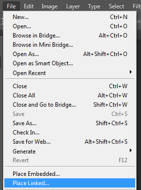

# Hantera sammansatta och flersidiga resurser {#managing-compound-assets}

[!DNL Adobe Experience Manager Assets] kan identifiera om en överförd fil innehåller referenser till resurser som redan finns i databasen. Den här funktionen är endast tillgänglig för filformat som stöds. Om den överförda resursen innehåller referenser till [!DNL Experience Manager] resurser skapas en dubbelriktad länk mellan den överförda och refererade resursen.

Att referera till resurser i [!DNL Adobe Creative Cloud] program ger inte bara ökad redundans, utan även bättre samarbete och ökad produktivitet.

[!DNL Experience Manager Assets] har stöd för dubbelriktade referenser. Du kan hitta refererade resurser på sidan med tillgångsinformation i den överförda filen. Dessutom kan du visa de refererande filerna på sidan med resursinformation för den refererade resursen.

Referenser tolkas utifrån sökväg, dokument-ID och instans-ID för de refererade resurserna.

## Lägg till digitala resurser som referenser i [!DNL Adobe Illustrator] {#refai}

Du kan referera till befintliga digitala resurser inifrån en [!DNL Adobe Illustrator] fil.

1. Hämta de digitala resurserna på det lokala filsystemet med hjälp av [Experience Manager-datorprogrammet](https://docs.adobe.com/content/help/en/experience-manager-desktop-app/using/using.html). Navigera till filsystemplatsen för resursen som du vill referera till.
1. Dra resursen från den lokala mappen till [!DNL Illustrator] filen.

1. Spara [!DNL Illustrator] filen på den monterade enheten eller [överför](/help/assets/managing-assets-touch-ui.md#uploading-assets) den till [!DNL Experience Manager] databasen.

1. När arbetsflödet är klart går du till sidan med resursinformation för resursen. Referenserna till befintliga digitala resurser listas under **[!UICONTROL Dependencies]** i **[!UICONTROL References]** kolumnen.

   

1. De refererade resurserna som visas under **[!UICONTROL Dependencies]** kan också refereras till av andra filer än den aktuella. Om du vill visa en lista med refererande filer för en resurs klickar du på resursen i **[!UICONTROL Dependencies]** listan under.

   

1. Klicka på **[!UICONTROL View Properties]** i verktygsfältet. På [!UICONTROL Properties] sidan visas listan med filer som refererar till den aktuella resursen under **[!UICONTROL References]** kolumnen på **[!UICONTROL Basic]** fliken.

   

   *Bild: Resursreferenser i tillgångsinformation.*

## Lägg till digitala resurser som referenser i [!DNL Adobe InDesign] {#add-aem-assets-as-references-in-adobe-indesign}

Om du vill referera till digitala resurser från en [!DNL InDesign] fil drar du resurserna till [!DNL InDesign] filen eller exporterar [!DNL InDesign] filen som ett ZIP-arkiv.

Refererade resurser finns redan i [!DNL Experience Manager Assets]. Du kan extrahera delresurser genom att [konfigurera InDesign Server](indesign.md). Inbäddade resurser i en [!DNL InDesign] fil extraheras som delresurser.

>[!NOTE]
>
>Om bilden [!DNL InDesign Server] [!DNL InDesign] är en proxy bäddas förhandsvisningen in i filernas XMP-metadata. I det här fallet krävs inte extrahering av miniatyrer uttryckligen. Om [!DNL InDesign Server] filen inte är proxiderad måste miniatyrbilder extraheras explicit för [!DNL InDesign] filer.

### Skapa referenser genom att dra resurser {#create-references-by-dragging-aem-assets}

Den här proceduren liknar hur du [lägger till digitala resurser som referenser i Adobe Illustrator](#refai).

### Skapa referenser till resurser genom att exportera en ZIP-fil {#create-references-to-aem-assets-by-exporting-a-zip-file}

1. Utför stegen i [Skapa arbetsflödesmodeller](/help/sites-developing/workflows-models.md) för att skapa ett nytt arbetsflöde.
1. Använd funktionen Packa i för [!DNL Adobe InDesign] att exportera dokumentet. [!DNL Adobe InDesign] kan exportera ett dokument och de länkade resurserna som ett paket. I det här fallet innehåller den exporterade mappen en länkmapp som innehåller underresurser i [!DNL InDesign] filen.
1. Skapa en ZIP-fil och överför den till [!DNL Experience Manager] databasen.
1. Starta `Unarchiver` arbetsflödet.
1. När arbetsflödet är klart refereras referenserna i mappen Länkar automatiskt till underresurser. Om du vill visa en lista med refererade resurser går du till sidan med tillgångsinformation för [!DNL InDesign] resursen och stänger [Rail](/help/sites-authoring/basic-handling.md#rail-selector).

## Lägg till digitala resurser som referenser i [!DNL Adobe Photoshop] {#refps}

1. Använd [!DNL Experience Manager] skrivbordsappen för att komma åt [!DNL Experience Manager Assets]. Hämta och visa resurserna i det lokala filsystemet. Använd funktionerna [!UICONTROL Place Linked] i [!DNL Adobe Photoshop]. Se [placera resurser i skrivbordsappen](https://docs.adobe.com/content/help/en/experience-manager-desktop-app/using/using.html#place-assets-in-native-documents).

   

1. Spara som [!DNL Photoshop] fil till den monterade enheten eller [överför](/help/assets/managing-assets-touch-ui.md#uploading-assets) till [!DNL Experience Manager] databasen.
1. När arbetsflödet är klart visas referenserna till befintliga [!DNL Experience Manager] resurser på sidan med resursinformation.

   Om du vill visa de refererade resurserna stänger du [Rail](/help/sites-authoring/basic-handling.md#rail-selector) på sidan med tillgångsinformation.

1. De refererade resurserna innehåller även en lista med resurser som de refereras till från. Om du vill visa en lista med refererade resurser går du till sidan med tillgångsinformation och stänger [Rail](/help/sites-authoring/basic-handling.md#rail-selector).

>[!NOTE]
>
>Resurserna i sammansatta resurser kan också refereras baserat på deras dokument-ID och instans-ID. Den här funktionaliteten finns endast för [!DNL Adobe Illustrator] och [!DNL Adobe Photoshop] versioner. För andra görs en referens på grundval av den relativa sökvägen för länkade tillgångar i den huvudsakliga sammansatta tillgången, som i tidigare versioner av [!DNL Experience Manager].

## Skapa delresurser {#generate-subassets}

För resurser som stöds i flersidiga format - PDF-filer, AI-filer [!DNL Microsoft PowerPoint] , [!DNL Apple Keynote] filer och [!DNL Adobe InDesign] filer - [!DNL Experience Manager] kan du generera delresurser som motsvarar varje enskild sida i den ursprungliga resursen. Dessa delresurser är länkade till den *överordnade* resursen och underlättar flersidesvisning. I alla andra syften behandlas deltillgångarna som normala tillgångar i [!DNL Experience Manager].

Generering av delresurser är inaktiverat som standard. Så här aktiverar du generering av delresurser:

1. Logga in [!DNL Experience Manager] som administratör. Öppna **[!UICONTROL Tools > Workflow > Models]**.
1. Select **[!UICONTROL DAM Update Asset]** workflow and click **[!UICONTROL Edit]**.
1. Klicka **[!UICONTROL Toggle Side Panel]** och leta upp **[!UICONTROL Create Sub Asset]** steget. Lägg till steget i arbetsflödet. Klicka på **[!UICONTROL Sync]**.

Gör något av följande om du vill generera delresurserna:

* Nya resurser: Arbetsflödet [!UICONTROL DAM Update Assets] körs på alla nya resurser som överförs till [!DNL Experience Manager]. Delresurser genereras automatiskt för nya flersidiga resurser.
* Befintliga flersidiga resurser: Kör arbetsflödet manuellt [!UICONTROL DAM Update Assets] på något av följande sätt:

   * Markera en resurs och klicka på [!UICONTROL Timeline] för att öppna den vänstra panelen. Du kan också använda kortkommandot `alt + 3`. Klicka [!UICONTROL Start Workflow], markera [!UICONTROL DAM Update Asset], klicka [!UICONTROL Start]och klicka [!UICONTROL Proceed].
   * Select an asset and click [!UICONTROL Create > Workflow] from the toolbar. I popup-dialogrutan väljer du [!UICONTROL DAM Update Asset] arbetsflöde, klickar [!UICONTROL Start]och klickar på [!UICONTROL Proceed].

Kör arbetsflödet särskilt för Microsoft Word-dokument **[!UICONTROL DAM Parse Word Documents]** . Det genererar en `cq:Page` komponent från innehållet i Microsoft Word-dokumentet. De bilder som extraheras från dokumentet refereras från `cq:Page` komponenten. Dessa bilder extraheras även om generering av delresurser är inaktiverat.

## Visa delresurser {#viewing-subassets}

Delresurserna visas bara om delresurserna genereras och är tillgängliga för den valda flersidiga resursen. Om du vill visa de genererade delresurserna öppnar du flersidesresursen. Klicka på  och klicka på **[!UICONTROL Subassets]** i listan. När du väljer **[!UICONTROL Subassets]** från listan. Du kan också använda kortkommandot `alt + 5`.

## Visa sidor i en flersidig fil {#view-pages-of-a-multi-page-file}

Du kan visa en flersidig fil, till exempel PDF-, INDD-, PPT-, PPTX- och AI-filer, med hjälp av funktionen för sidvisning i [!DNL Experience Manager Assets]. Öppna en flersidig resurs och klicka **[!UICONTROL View Pages]** i det övre vänstra hörnet på sidan. Sidvisningsprogrammet som öppnas visar sidorna för resursen och kontrollerna för att bläddra igenom och zooma varje sida.

Du kan till [!DNL InDesign]exempel extrahera sidor med [!DNL InDesign Server]. Om förhandsvisningarna av sidorna sparas när [!DNL InDesign] filen skapas [!DNL InDesign Server] behövs inte för sidextraheringen.

Följande alternativ är tillgängliga i verktygsfältet, i den vänstra listen och i kontrollerna i sidvisningsprogrammet:

* **[!UICONTROL Desktop Actions]** för att öppna eller visa en viss underresurs med [!DNL Experience Manager] skrivbordsappen. Se hur du [konfigurerar skrivbordsåtgärder](https://docs.adobe.com/content/help/en/experience-manager-desktop-app/using/using.html#desktopactions-v2) om du använder [!DNL Experience Manager] datorprogrammet.

* **[!UICONTROL Properties]** öppnar sidan [!UICONTROL Properties] för den specifika underresursen.

* **[!UICONTROL Annotate]** kan du göra anteckningar i den specifika underresursen. De anteckningar du använder på separata underresurser samlas in och visas tillsammans när den överordnade resursen öppnas för visning.

* **[!UICONTROL Page Overview]** visar alla delresurser samtidigt.

* **[!UICONTROL Timeline]** efter att du klickat på  visas filens aktivitetsström.

## God praxis och begränsning {#best-practice-limitation-tips}

* Generering av delresurser kan vara mycket resurskrävande för alla Experience Manager-distributioner. Om du genererar delresurser när komplexa resurser överförs lägger du till steget i arbetsflödet DAM-uppdatering av resurser. Om du genererar delresurser on demand skapar du ett separat arbetsflöde för att generera delresurser. Med ett dedikerat arbetsflöde kan du hoppa över de andra stegen i arbetsflödet för DAM-uppdatering av resurser och spara beräkningsresurser.

>[!MORELIKETHIS]
>
>* [Använd datorprogrammet Adobe Experience Manager](https://docs.adobe.com/content/help/en/experience-manager-desktop-app/using/using.html)
>* [Konfigurera skrivbordsåtgärder i Adobe Experience Manager](https://docs.adobe.com/content/help/en/experience-manager-desktop-app/using/using.html#desktopactions-v2)
>* [Skapa länkade smarta objekt i Adobe Photoshop](https://helpx.adobe.com/photoshop/using/create-smart-objects.html#create-linked-smart-objects)
>* [Montera bilder i Adobe InDesign](https://helpx.adobe.com/indesign/using/placing-graphics.html)

