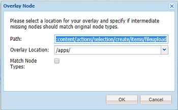

# Hantera videoresurser {#manage-video-assets}

Videoformatet är en viktig del av ett företags digitala resurser. [!DNL Adobe Experience Manager] erbjuder mogna erbjudanden och funktioner för att hantera hela livscykeln för videomaterialet när de har skapats.

Lär dig hur du hanterar och redigerar videoresurserna i [!DNL Adobe Experience Manager Assets]. Om du har licens att använda [!DNL Dynamic Media]läser du videodokumentationen [för](/help/assets/video.md)Dynamic Media.

## Överföra och förhandsgranska videomaterial {#upload-and-preview-video-assets}

[!DNL Adobe Experience Manager Assets] skapar förhandsvisningar för videoresurser med filnamnstillägget MP4. Om resursens format inte är MP4 installerar du FFmpeg-paketet för att generera en förhandsvisning. FFmpeg skapar videoåtergivningar av typen OGG och MP4. Du kan förhandsgranska återgivningarna i användargränssnittet Resurser.

1. Navigera till den plats där du vill lägga till digitala resurser i mappen eller undermapparna Digital Assets.
1. Om du vill överföra resursen klickar du **[!UICONTROL Create]** i verktygsfältet och väljer sedan **[!UICONTROL Files]**. Du kan också släppa det direkt i resursområdet. Mer information om överföring finns i [Överför resurser](managing-assets-touch-ui.md#uploading-assets) .
1. Om du vill förhandsgranska en video i kortvyn klickar du på alternativet **[!UICONTROL Play]** för  uppspelning i videoresursen. Du kan bara pausa eller spela upp video i kortvyn. Alternativen [!UICONTROL Play] och [!UICONTROL Pause] är inte tillgängliga i listvyn.

1. Om du vill förhandsgranska videon på sidan med resursinformation klickar du **[!UICONTROL Edit]** på kortet. Videon spelas upp i webbläsarens inbyggda videospelare. Du kan spela upp, pausa, styra volymen och zooma videon till helskärm.

   

## Konfiguration för att överföra resurser som är större än 2 GB {#configuration-to-upload-assets-that-are-larger-than-gb}

Som standard [!DNL Assets] kan du inte överföra resurser som är större än 2 GB på grund av en filstorleksgräns. Du kan dock skriva över den här gränsen genom att gå till CRXDE Lite och skapa en nod under `/apps` katalogen. Noden måste ha samma nodnamn, katalogstruktur och jämförbara nodegenskaper i ordningen.

Förutom [!DNL Assets] konfiguration kan du ändra följande konfigurationer för att överföra stora resurser:

* Öka tokens förfallotid. Se [!UICONTROL Adobe Granite CSRF Servlet] i webbkonsolen på `https://[aem_server]:[port]/system/console/configMgr`. Mer information finns i [CSRF-skydd](/help/sites-developing/csrf-protection.md).
* Öka `receiveTimeout` i Dispatcher-konfigurationen. Mer information finns i [Experience Manager Dispatcher-konfiguration](https://docs.adobe.com/content/help/en/experience-manager-dispatcher/using/configuring/dispatcher-configuration.html#renders-options).

>[!NOTE]
>
>Det [!DNL Experience Manager] klassiska användargränssnittet har ingen storleksbegränsning på 2 GB. Slutgiltigt arbetsflöde för stor video stöds inte heller helt.

Utför följande steg i `/apps` katalogen för att konfigurera en större filstorleksgräns.

1. Klicka [!DNL Experience Manager]på **[!UICONTROL Tools]** > **[!UICONTROL General]** > **[!UICONTROL CRXDE Lite]**.
1. Gå till CRXDE Lite `/libs/dam/gui/content/assets/jcr:content/actions/secondary/create/items/fileupload`. Om du vill visa katalogfönstret klickar du på `>>`.
1. From the toolbar, click the **[!UICONTROL Overlay Node]**. Du kan också välja **[!UICONTROL Overlay Node]** på snabbmenyn.
1. I dialogrutan **[!UICONTROL Overlay Node]** klickar du på **[!UICONTROL OK]**.

   

1. Uppdatera webbläsaren. Överläggsnoden `/jcr_root/apps/dam/gui/content/assets/jcr:content/actions/secondary/create/items/fileupload` är markerad.
1. Ange ett värde i byte på fliken **[!UICONTROL Properties]** för att öka storleksgränsen till önskad storlek. Om du till exempel vill öka storleksgränsen till 30 GB anger du `{sizeLimit : "32212254720"}` ett värde.

1. Klicka på **[!UICONTROL Save All]** i verktygsfältet.
1. Klicka [!DNL Experience Manager]på **[!UICONTROL Tools]** > **[!UICONTROL Operations]** > **[!UICONTROL Web Console]**.
1. På [!DNL Adobe Experience Manager] sidan, under kolumnen Namn i tabellen, letar du reda på och klickar på [!UICONTROL Web Console Bundles] **[!UICONTROL Adobe Granite Workflow External Process Job Handler]**.
1. På [!UICONTROL Adobe Granite Workflow External Process Job Handler] sidan anger du sekunder för både **[!UICONTROL Default Timeout]** och **[!UICONTROL Max Timeout]** fält till `18000` (fem timmar). Klicka på **[!UICONTROL Save]**.
1. Klicka [!DNL Experience Manager]på **[!UICONTROL Tools]** > **[!UICONTROL Workflow]** > **[!UICONTROL Models]**.
1. På sidan Arbetsflödesmodeller väljer du **[!UICONTROL Dynamic Media Encode Video]** och klickar sedan på **[!UICONTROL Edit]**.
1. Dubbelklicka på **[!UICONTROL Dynamic Media Video Service Process]** komponenten på arbetsflödessidan.
1. I dialogrutan [!UICONTROL Step Properties], på fliken **[!UICONTROL Common]**, expanderar du **Avancerade inställningar**.
1. In the **[!UICONTROL Timeout]** field, specify a value of `18000`, then click **[!UICONTROL OK]** to return to the **[!UICONTROL Dynamic Media Encode Video]** workflow page.
1. Långt upp på sidan, under sidrubriken på [!UICONTROL Dynamic Media Encode Video] sidan, klickar du på **[!UICONTROL Save]**.

## Publicera videomaterial {#publish-video-assets}

Efter publiceringen kan du inkludera videomaterialet på en webbsida som en URL eller bädda in resurserna direkt. Mer information finns i [Publicera dynamiska medieresurser](/help/assets/publishing-dynamicmedia-assets.md).

## Kommentera videomaterial {#annotate-video-assets}

1. I resurskonsolen klickar du [!UICONTROL Edit] på resurskortet för att visa sidan med resursinformation.
1. Om du vill spela upp videon klickar du på [!UICONTROL Preview].
1. Klicka på **[!UICONTROL Annotate]** knappen om du vill kommentera videon. En anteckning läggs till vid en viss tidpunkt (bildruta) i videon. När du gör anteckningar kan du rita på arbetsytan och ta med en kommentar med ritningen. Kommentarerna sparas automatiskt.

   

   Om du vill avsluta anteckningsguiden klickar du på **[!UICONTROL Close]**.

1. Gå till en viss punkt i videon, ange tiden i sekunder i **textfältet** och klicka på **Hoppa**. Om du till exempel vill hoppa över de första 10 sekunderna av videon anger du 20 i textfältet.

   

1. Klicka på en anteckning om du vill visa den i tidslinjen. Om du vill ta bort anteckningen från tidslinjen klickar du på **[!UICONTROL Delete]**.

   

>[!MORELIKETHIS]
>
>* [Hantera digitala resurser i Experience Manager Assets](/help/assets/managing-assets-touch-ui.md)
>* [Hantera samlingar i Experience Manager Assets](/help/assets/managing-collections-touch-ui.md)

