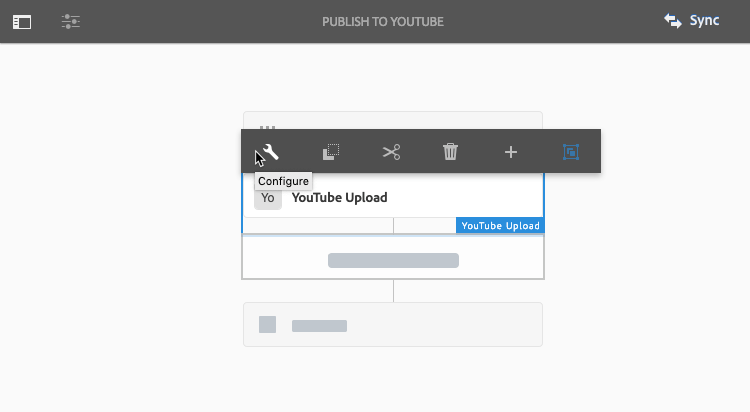

# Hantera videomaterial {#manage-video-assets}

| Version | Artikellänk |
| -------- | ---------------------------- |
| AEM as a Cloud Service | [Klicka här](https://experienceleague.adobe.com/docs/experience-manager-cloud-service/content/assets/manage/manage-video-assets.html?lang=en) |
| AEM 6.5 | Den här artikeln |

Videoformatet är en viktig del av ett företags digitala resurser. [!DNL Adobe Experience Manager] erbjuder mogna erbjudanden och funktioner för att hantera hela livscykeln för videomaterialet när de har skapats.

Lär dig hantera och redigera videomaterialet i [!DNL Adobe Experience Manager Assets]. Videokodning och omkodning, till exempel FFmpeg-omkodning, är möjlig med [!DNL Dynamic Media] integrering.

## Överföra och förhandsgranska videomaterial {#upload-and-preview-video-assets}

[!DNL Adobe Experience Manager Assets] skapar förhandsvisningar för videoresurser med filnamnstillägget MP4. Om resursens format inte är MP4 installerar du FFmpeg-paketet för att generera en förhandsvisning. FFmpeg skapar videoåtergivningar av typen OGG och MP4. Du kan förhandsgranska återgivningarna i dialogrutan [!DNL Assets] användargränssnitt.

1. Navigera till den plats där du vill lägga till digitala resurser i mappen eller undermapparna för digitala resurser.
1. Om du vill överföra resursen klickar du på **[!UICONTROL Create]** i verktygsfältet och välj **[!UICONTROL Files]**. Du kan också dra en fil till användargränssnittet. Se [överföra resurser](manage-assets.md#uploading-assets) för mer information.
1. Om du vill förhandsgranska en video i kortvyn klickar du på **[!UICONTROL Play]**  på videoresursen. Du kan bara pausa eller spela upp video i kortvyn. The [!UICONTROL Play] och [!UICONTROL Pause] alternativen är inte tillgängliga i listvyn.

1. Om du vill förhandsgranska videon på sidan med resursinformation klickar du på **[!UICONTROL Edit]** på kortet. Videon spelas upp i webbläsarens inbyggda videospelare. Du kan spela upp, pausa, styra volymen och zooma videon till helskärm.

   

## Konfiguration för att överföra resurser som är större än 2 GB {#configuration-to-upload-assets-that-are-larger-than-gb}

Som standard [!DNL Assets] gör att du inte kan överföra resurser som är större än 2 GB på grund av en filstorleksgräns. Du kan dock skriva över den här gränsen genom att gå till CRXDE Lite och skapa en nod under `/apps` katalog. Noden måste ha samma nodnamn, katalogstruktur och jämförbara nodegenskaper i ordningen.

Förutom [!DNL Assets] ska du ändra följande konfigurationer för att överföra stora resurser:

* Öka tokens förfallotid. Se [!UICONTROL Adobe Granite CSRF Servlet] i webbkonsolen på `https://[aem_server]:[port]/system/console/configMgr`. Mer information finns i [CSRF-skydd](/help/sites-developing/csrf-protection.md).
* Öka `receiveTimeout` i Dispatcher-konfiguration. Mer information finns i [Experience Manager Dispatcher-konfiguration](https://experienceleague.adobe.com/docs/experience-manager-dispatcher/using/configuring/dispatcher-configuration.html#renders-options).

>[!NOTE]
>
>The [!DNL Experience Manager] Klassiskt användargränssnitt har ingen begränsning för filstorlek på 2 GB. Slutgiltigt arbetsflöde för stor video stöds inte heller helt.

Om du vill konfigurera en större filstorleksgräns utför du följande steg i `/apps` katalog.

1. I [!DNL Experience Manager], klicka **[!UICONTROL Tools]** > **[!UICONTROL General]** > **[!UICONTROL CRXDE Lite]**.
1. I CRXDE Lite går du till `/libs/dam/gui/content/assets/jcr:content/actions/secondary/create/items/fileupload`. Om du vill visa katalogfönstret klickar du på `>>`.
1. Klicka på **[!UICONTROL Overlay Node]**. Du kan också välja **[!UICONTROL Overlay Node]** på snabbmenyn.
1. I dialogrutan **[!UICONTROL Overlay Node]** klickar du på **[!UICONTROL OK]**.

   

1. Uppdatera webbläsaren. Överläggsnoden `/apps/dam/gui/content/assets/jcr:content/actions/secondary/create/items/fileupload` är markerat.
1. I **[!UICONTROL Properties]** anger du ett värde i byte för att öka storleksgränsen till önskad storlek. Om du till exempel vill öka storleksgränsen till 30 GB anger du `32212254720` värde.

1. Klicka på **[!UICONTROL Save All]** i verktygsfältet.
1. I [!DNL Experience Manager], klicka **[!UICONTROL Tools]** > **[!UICONTROL Operations]** > **[!UICONTROL Web Console]**.
1. På [!DNL Adobe Experience Manager] [!UICONTROL Web Console Bundles] under kolumnen Namn i tabellen letar du upp och klickar på **[!UICONTROL Adobe Granite Workflow External Process Job Handler]**.
1. På [!UICONTROL Adobe Granite Workflow External Process Job Handler] sida, ange sekunder för båda **[!UICONTROL Default Timeout]** och **[!UICONTROL Max Timeout]** fält till `18000` (fem timmar). Klicka på **[!UICONTROL Save]**.
1. I [!DNL Experience Manager], klicka **[!UICONTROL Tools]** > **[!UICONTROL Workflow]** > **[!UICONTROL Models]**.
1. Välj på sidan Arbetsflödesmodeller **[!UICONTROL Dynamic Media Encode Video]** och sedan klicka **[!UICONTROL Edit]**.
1. Dubbelklicka på arbetsflödessidan **[!UICONTROL Dynamic Media Video Service Process]** -komponenten.
1. I dialogrutan [!UICONTROL Step Properties], på fliken **[!UICONTROL Common]**, expanderar du **Avancerade inställningar**.
1. I **[!UICONTROL Timeout]** fält, ange värdet för `18000`och sedan klicka **[!UICONTROL OK]** för att gå tillbaka till **[!UICONTROL Dynamic Media Encode Video]** arbetsflödessida.
1. Nära sidans överkant, nedanför [!UICONTROL Dynamic Media Encode Video] sidrubrik, klicka **[!UICONTROL Save]**.

## Publicera videomaterial {#publish-video-assets}

Efter publiceringen kan du inkludera videomaterialet på en webbsida som en URL eller bädda in resurserna direkt. Mer information finns i [publicera Dynamic Media-resurser](/help/assets/publishing-dynamicmedia-assets.md).

## Publicera videor på YouTube {#publishing-videos-to-youtube}

Du kan publicera Experience Manager-videoresurser direkt i en YouTube-kanal som du tidigare har skapat.

Om du vill publicera videomaterial till YouTube skapar du Experience Manager Assets med taggar. Du kopplar dessa taggar till en YouTube-kanal. Om videoresursens tagg matchar taggen för en YouTube-kanal publiceras videon till YouTube. Publicera till YouTube sker tillsammans med en normal publicering av videon så länge en associerad tagg används.

YouTube gör sin egen kodning. Det innebär att den ursprungliga videofilen som överfördes till Experience Manager publiceras till YouTube i stället för den videoåtergivning som Dynamic Media kodning har skapat. Även om det inte krävs för att bearbeta videofilmer med Dynamic Media förväntas de göra det om en visningsförinställning behövs för uppspelning.

När du åsidosätter videobearbetningsprofilen och publicerar direkt till YouTube innebär det helt enkelt att videomaterialet i Experience Manager Asset inte får någon miniatyrbild som kan visas. Det betyder också att om du springer in `dynamicmedia` eller `dynamicmedia_scene7` körningslägen, videofilmer som inte är kodade fungerar inte med någon av Dynamic Media resurstyper.

När du publicerar videomaterial till YouTube-servrar utför du följande uppgifter för att säkerställa säker server-till-server-autentisering med YouTube:

1. [Konfigurera inställningar för Google Cloud](#configuring-google-cloud-settings)
1. [Create a YouTube channel](#creating-a-youtube-channel)
1. [Lägga till taggar för publicering](#adding-tags-for-publishing)
1. [Aktivera YouTube Publish Replication Agent](#enabling-the-youtube-publish-replication-agent)
1. [Konfigurera YouTube i Experience Manager](#setting-up-youtube-in-aem)
1. [(Valfritt) Automatisera inställningen av YouTube standardegenskaper för överförda videofilmer](#optional-automating-the-setting-of-default-youtube-properties-for-your-uploaded-videos)
1. [Publicera videor i din YouTube-kanal](#publishing-videos-to-your-youtube-channel)
1. [(Valfritt) Verifiera den publicerade videon på YouTube](/help/assets/video.md#optional-verifying-the-published-video-on-youtube)
1. [Länka YouTube URL:er till ditt webbprogram](#linking-youtube-urls-to-your-web-application)

Du kan också [avpublicera videoklipp för att ta bort dem från YouTube](#unpublishing-videos-to-remove-them-from-youtube).

### Konfigurera inställningar för Google Cloud {#configuring-google-cloud-settings}

Du behöver ett Google-konto för att kunna publicera till YouTube. Om du har ett GMAIL-konto har du redan ett Google-konto. Om du inte har något Google-konto kan du enkelt skapa ett. Du behöver kontot eftersom du behöver inloggningsuppgifter för att publicera videoresurser på YouTube. Om du redan har skapat ett konto hoppar du över den här uppgiften och fortsätter direkt till [Create a YouTube channel](#creating-a-youtube-channel).

Kontot som används med Google Cloud och Google-kontot som används för YouTube behöver inte vara samma.

Google ändrar regelbundet användargränssnittet. Stegen för att publicera videofilmer till YouTube kan därför variera något från vad som beskrivs nedan. Denna caveat gäller även YouTube när du försöker kontrollera om videoklipp har överförts till det.

>[!NOTE]
>
>Följande steg var korrekta när detta skrevs. Google uppdaterar dock regelbundet sina webbplatser utan föregående meddelande. De här stegen kan därför vara något annorlunda.

Så här konfigurerar du inställningarna för Google Cloud:

1. Skapa ett Google-konto.

   Om du redan har ett Google-konto går du vidare till nästa steg.

1. Gå till [https://cloud.google.com/](https://cloud.google.com/).
1. På Google Cloud-sidan uppe till höger klickar du på **[!UICONTROL Console]**.

   Vid behov, **[!UICONTROL Sign in]** med ditt Google-konto för att se **[!UICONTROL Console]** alternativ.

1. På sidan Kontrollpanel, till höger om **[!UICONTROL Google Cloud Platform]** klickar du på listrutan Projekt för att öppna dialogrutan Välj ett projekt.
1. I dialogrutan Välj projekt väljer du **[!UICONTROL New Project]**.

   

1. Skriv namnet på det nya projektet i fältet Projektnamn i dialogrutan Nytt projekt.

   Ditt projekt-ID baseras på ditt projektnamn. Välj därför projektnamnet noggrant. Det går inte att ändra det efter att det har skapats. Du måste även ange samma projekt-ID igen när du konfigurerar YouTube i Experience Manager senare. Överväg att skriva ned det.

1. Klicka på **[!UICONTROL Create]**.

1. Gör något av följande:

   * På ditt projekts Dashboard väljer du Komma igång-kort **[!UICONTROL Explore and enable APIs]**.
   * I Dashboard för projektet väljer du **[!UICONTROL Go to APIs overview]**.

   

1. I början av sidan API:er och tjänster väljer du **[!UICONTROL Enable APIs and Services]**.
1. På API-bibliotekssidan, till vänster, under **[!UICONTROL Category]**, markera **[!UICONTROL YouTube]**. Till höger på sidan väljer du **[!UICONTROL YouTube Data API]**.
1. På sidan YouTube Data API v3 väljer du **[!UICONTROL Enable]**.

   

1. Om du vill använda API:t måste du ha autentiseringsuppgifter. Klicka vid behov på **[!UICONTROL Create Credentials]**.

   

1. På **[!UICONTROL Add credentials to your project]** sida, steg 1, gör följande:

   * I listrutan **[!UICONTROL Which API are you using?]** väljer du **[!UICONTROL YouTube Data API v3]**.

   * Från **[!UICONTROL Where are you calling the API from?]** nedrullningsbar lista, välja **[!UICONTROL Web Server (for example, node.js, Tomcat)]**

   * I listrutan **[!UICONTROL What data are you accessing?]** väljer du **[!UICONTROL User data]**.

   

1. Välj **[!UICONTROL What credentials do I need?]**
1. I steg 2 på sidan **[!UICONTROL Add credentials to your project]** anger du ett unikt namn i fältet Namn under rubriken **[!UICONTROL Create an OAuth 2.0 client ID]**. Du kan också använda standardnamnet som anges av Google.
1. Under **[!UICONTROL Authorized JavaScript origins]** i textfältet anger du följande sökväg och ersätter din egen domän och portnummer i sökvägen. Tryck sedan på **[!UICONTROL Enter]** så här lägger du till sökvägen i listan:

   `https://<servername.domain>:<port_number>`

   Exempel: `https://1a2b3c.mycompany.com:4321`

   **Anteckning**: Ovanstående exempel är endast avsett som exempel.

   

1. Under **[!UICONTROL Authorized redirect URIs]** i textfältet anger du följande sökväg och ersätter din egen domän och portnummer i sökvägen. Tryck sedan på **[!UICONTROL Enter]** så här lägger du till sökvägen i listan:

   `https://<servername.domain>:<port_number>/etc/cloudservices/youtube.youtubecredentialcallback.json`

   Exempel: `https://1a2b3c.mycompany.com:4321/etc/cloudservices/youtube.youtubecredentialcallback.json`

   **Anteckning**: Ovanstående exempel är endast avsett som exempel.

1. Klicka på **[!UICONTROL Create OAuth client ID]**.
1. På sidan **[!UICONTROL Add credentials to your project]**, steg 3, under rubriken **[!UICONTROL Set up the OAuth 2.0 consent screen]**, väljer du den Gmail-e-postadress som du för närvarande använder.

   

1. Under **[!UICONTROL Product name shown to users]** i textfältet anger du det du vill visa på godkännandeskärmen.

   Medgivandeskärmen visas för Experience Manager-administratören när de autentiserar sig för YouTube. Experience Manager kontaktar YouTube för tillstånd.

1. Klicka på **[!UICONTROL Continue]**.
1. På sidan Add credentials to your project (Lägg till inloggningsuppgifter), steg 4, under **[!UICONTROL Download credentials]** rubrik, markera **[!UICONTROL Download]**.

   

1. Spara `client_id.json` -fil.

   Du behöver den här hämtade JSON-filen när du konfigurerar YouTube i Adobe Experience Manager senare.

1. Klicka på **[!UICONTROL Done]**.

   Logga ut från ditt Google-konto. Skapa nu en YouTube-kanal.

### Create a YouTube channel {#creating-a-youtube-channel}

Du måste ha en eller flera kanaler för att kunna publicera videofilmer på YouTube. Om du redan har skapat en YouTube-kanal kan du hoppa över den här uppgiften och gå till [Lägga till taggar för publicering](/help/assets/video.md#adding-tags-for-publishing).

>[!WARNING]
>
>Kontrollera att du redan har konfigurerat en eller flera kanaler i YouTube *före* du lägger till kanaler under YouTube-inställningar i Experience Manager (se [Konfigurera YouTube i Experience Manager](#setting-up-youtube-in-aem) nedan). Om du inte konfigurerar en eller flera kanaler får du ingen varning om att det inte finns några kanaler. Google-autentisering sker dock fortfarande när du lägger till en kanal, men det finns inget alternativ för att välja vilken kanal videon skickas till.

**Skapa en YouTube-kanal:**

1. Gå till [https://www.youtube.com](https://www.youtube.com/) och logga in med dina Google-kontouppgifter.
1. Klicka på din profilbild i det övre högra hörnet på YouTube-sidan (kan också visas som en bokstav i en enfärgad cirkel) och klicka sedan på **[!UICONTROL YouTube settings]** (rund kugghjulsikon).
1. Klicka på på sidan Översikt under rubriken Ytterligare funktioner **[!UICONTROL See all my channels or create a channel]**.
1. På sidan Kanaler klickar du på **[!UICONTROL Create a new channel]**.
1. På sidan Varumärkeskonto anger du ett företagsnamn eller ett annat kanalnamn som du väljer var du vill publicera videoresurserna. Klicka sedan på **[!UICONTROL Create]**.

   Kom ihåg namnet som du anger här eftersom du måste ange det igen när du konfigurerar YouTube i Experience Manager.

1. (Valfritt) Lägg till fler kanaler om det behövs.

   Nu kan du lägga till taggar för publicering.

### Lägga till taggar för publicering {#adding-tags-for-publishing}

Om du vill publicera till dina videofilmer på YouTube associerar Experience Manager taggar till en eller flera YouTube-kanaler. Information om hur du lägger till taggar för publicering finns i [Administrera taggar](/help/sites-administering/tags.md).

Om du tänker använda standardtaggarna i Experience Manager kan du hoppa över den här uppgiften och gå till [Aktivera YouTube Publish-replikeringsagenten](#enabling-the-youtube-publish-replication-agent).

### Aktivera YouTube Publish-replikeringsagenten {#enabling-the-youtube-publish-replication-agent}

När du har aktiverat YouTube Publish-replikeringsagenten och vill testa anslutningen till Google Cloud-kontot väljer du **[!UICONTROL Test Connection]**. Anslutningsresultaten visas på en flik i webbläsaren. Om du har lagt till YouTube-kanaler visas en lista över dem som en del av testet.

1. Klicka på logotypen Experience Manager i det övre vänstra hörnet av Experience Manager och klicka sedan i det vänstra hörnet på **[!UICONTROL Tools]** > **[!UICONTROL Deployment]** > **[!UICONTROL Replication]** > **[!UICONTROL Agents on Author]**.
1. Klicka på Agents of Author **[!UICONTROL YouTube Publish]**.
1. Klicka på i verktygsfältet till höger om Inställningar **[!UICONTROL Edit]**.
1. Välj **[!UICONTROL Enabled]** så att du kan aktivera replikeringsagenten.
1. Klicka på **[!UICONTROL OK]**.

   Konfigurera nu YouTube i Experience Manager.

### Konfigurera YouTube i Experience Manager {#setting-up-youtube-in-aem}

Från och med Experience Manager 6.4 introducerades en ny pekgränssnittsmetod för att konfigurera YouTube-publicering i Experience Manager. Baserat på den installerade instansen av Experience Manager som du använder gör du något av följande:

* Information om hur du konfigurerar YouTube i Experience Manager före 6.4 finns i [Konfigurera YouTube i Experience Manager före 6.4](/help/assets/video.md#setting-up-youtube-in-aem-before).
* Information om hur du konfigurerar YouTube i Experience Manager 6.4 eller senare finns i [Konfigurera YouTube i Experience Manager 6.4 och senare](#setting-up-youtube-in-aem-and-later).

#### Konfigurera YouTube i Experience Manager 6.4 och senare {#setting-up-youtube-in-aem-and-later}

1. Se till att du loggar in på din instans av Dynamic Media som administratör.
1. I det övre vänstra hörnet väljer du logotypen för Experience Manager och sedan i den vänstra listen väljer du **[!UICONTROL Tools]**(hammarikon) > **[!UICONTROL Cloud Services]** > **[!UICONTROL YouTube Publishing Configuration]**.
1. Välj **[!UICONTROL global]** (markera det inte).

1. I det övre högra hörnet av den globala sidan väljer du **[!UICONTROL Create]**.
1. På sidan Skapa YouTube-konfiguration anger du Googles projekt-ID under Inställningar för Google Cloud-plattform i fältet **[!UICONTROL Application Name]**.

   Du angav projekt-ID:t när du konfigurerade Google Cloud-inställningarna tidigare.
Lämna sidan Skapa YouTube-konfiguration öppen. Om en stund kommer du tillbaka till den.

   

1. Öppna JSON-filen som du hämtade och sparade tidigare i uppgiften med en vanlig textredigerare [Konfigurera inställningar för Google Cloud](/help/assets/video.md#configuring-google-cloud-settings).
1. Markera och kopiera hela JSON-texten.
1. Återgå till dialogrutan YouTube-kontoinställningar Klistra in JSON-texten i fältet **[!UICONTROL JSON Config]**.
1. I sidans övre högra hörn väljer du **[!UICONTROL Save]**.

   Konfigurera nu YouTube-kanaler i Experience Manager.

1. Välj **[!UICONTROL Add Channel]**.
1. I fältet Kanalnamn anger du namnet på kanalen som du skapade i uppgiften **[!UICONTROL Adding one or more channels to YouTube]** tidigare.

   Om du vill kan du lägga till en beskrivning.

1. Välj **[!UICONTROL Add]**.
1. YouTube/Google-autentisering visas. Om du inte redan är inloggad på Google Cloud-kontot hoppar du över det här steget.

   * Ange det användarnamn och lösenord för Google som är kopplat till Google projekt-ID och JSON-texten ovan.
   * Beroende på hur många kanaler ditt konto har visas två eller flera objekt. Välj en kanal. Markera inte e-postadressen, den är inte en kanal.
   * På nästa sida väljer du **[!UICONTROL Accept]** för att ge åtkomst till den här kanalen.

1. Välj **[!UICONTROL Allow]**.

   Konfigurera taggar för publicering.

1. **[!UICONTROL Setting up tags for publishing]** - På sidan Cloud Service > YouTube väljer du pennikonen för att redigera listan med taggar som du vill använda.
1. Markera listruteikonen (cirkumflex upp och ned) så att du kan visa listan med tillgängliga taggar i Experience Manager.
1. Markera en eller flera taggar så att du kan lägga till dem.

   Om du vill ta bort en tagg som du har lagt till markerar du den och väljer **[!UICONTROL X]**.

1. När du är klar med att lägga till de taggar du vill ha väljer du **[!UICONTROL Save]**.

   Nu kan du publicera videor i din YouTube-kanal.

#### Konfigurera YouTube i Experience Manager före 6.4 {#setting-up-youtube-in-aem-before}

1. Se till att du loggar in på din instans av Dynamic Media som administratör.

1. I det övre vänstra hörnet väljer du logotypen för Experience Manager och sedan i den vänstra listen väljer du **[!UICONTROL Tools]** (hammarikon) > **[!UICONTROL Deployment]** > **[!UICONTROL Cloud Services]**.
1. Under rubriken Tredjepartstjänster under YouTube väljer du **[!UICONTROL Configure now]**.
1. I dialogrutan Skapa konfiguration anger du en rubrik (obligatoriskt) och ett namn (valfritt) i respektive fält.
1. Välj **[!UICONTROL Create]**.
1. I dialogrutan YouTube-kontoinställningar anger du Googles projekt-ID i fältet **[!UICONTROL Application Name]**.

   Du angav projekt-ID:t när du först angav [konfigurerade inställningar för Google Cloud](/help/assets/video.md#configuring-google-cloud-settings) tidigare.
Lämna dialogrutan YouTube Kontoinställning öppen. Du kommer att gå tillbaka till den om en stund.

1. Använd en vanlig textredigerare för att öppna JSON-filen som du hämtade och sparade tidigare i uppgiften Konfigurera inställningar för Google Cloud.
1. Markera och kopiera hela JSON-texten.
1. Återgå till dialogrutan YouTube-kontoinställningar Klistra in JSON-texten i fältet **[!UICONTROL JSON Config]**.
1. Välj **[!UICONTROL OK]**.

   Konfigurera nu YouTube-kanaler i Experience Manager.

1. Till höger om **[!UICONTROL Available Channels]**, markera **+** (plustecken).
1. I dialogrutan YouTube-kanalinställningar, i fältet Titel, anger du namnet på kanalen som du skapade i uppgiften **[!UICONTROL Adding one or more channels to YouTube]** tidigare.

   Om du vill kan du lägga till en beskrivning.

1. Välj **[!UICONTROL OK]**.
1. YouTube/Google-autentisering visas. Om du inte redan är inloggad på Google Cloud-kontot hoppar du över det här steget.

   * Ange det användarnamn och lösenord för Google som är kopplat till Google projekt-ID och JSON-texten ovan.
   * Beroende på hur många kanaler ditt konto har visas två eller flera objekt. Välj en kanal. Markera inte e-postadressen, den är inte en kanal.
   * På nästa sida väljer du **[!UICONTROL Accept]** för att ge åtkomst till den här kanalen.

1. Välj **[!UICONTROL Allow]**.

   Konfigurera taggar för publicering.

1. **[!UICONTROL Setting up tags for publishing]** - På sidan Cloud Service > YouTube väljer du pennikonen för att redigera listan med taggar som du vill använda.
1. Markera listruteikonen (cirkumflex upp och ned) så att du kan visa listan med tillgängliga taggar i Experience Manager.
1. Markera en eller flera taggar så att du kan lägga till dem.

   Om du vill ta bort en tagg som du har lagt till markerar du den och väljer **X**.

1. När du är klar med att lägga till de taggar du vill ha väljer du **[!UICONTROL OK]**.

   Nu kan du publicera videor i din YouTube-kanal.

### (Valfritt) Automatisera inställningen av YouTube standardegenskaper för överförda videofilmer {#optional-automating-the-setting-of-default-youtube-properties-for-your-uploaded-videos}

Du kan också automatisera inställningen av YouTube-egenskaper vid överföring av videofilmer genom att skapa en metadatabearbetningsprofil i Experience Manager.

Om du vill skapa en profil för metadatabearbetning kopierar du först värden från fälten **[!UICONTROL Field Label]**, **[!UICONTROL Map to property]** och **[!UICONTROL Choices]**, som alla finns i metadatascheman för video. Sedan skapar du en YouTube-metadatabearbetningsprofil för video genom att lägga till dessa värden.

Så här automatiserar du inställningen av YouTube standardegenskaper för överförda videofilmer:

1. I det övre vänstra hörnet väljer du logotypen för Experience Manager och klickar sedan på **[!UICONTROL Tools]** (hammarikon) > **[!UICONTROL Assets]** > **[!UICONTROL Metadata Schemas]**.
1. Klicka på **[!UICONTROL default]**. (Lägg inte till en bockmarkering i markeringsrutan till vänster om &quot;standard&quot;.)
1. På **[!UICONTROL default]** markerar du kryssrutan till vänster om **[!UICONTROL video]** väljer **[!UICONTROL Edit]**.
1. På sidan för redigering av metadataschema väljer du **[!UICONTROL Advanced]** -fliken.
1. Under rubriken YouTube-publicering klickar du på **[!UICONTROL YouTube Category]**.
1. Till höger på sidan, under **[!UICONTROL Settings]** gör du så här:

   * I **[!UICONTROL Map to property]** markerar och kopierar värdet i textfältet.
Klistra in det kopierade värdet i textredigeraren. Du kommer att behöva det här värdet senare när du skapar din metadatabearbetningsprofil. Låt textredigeraren vara öppen.

   * Under **[!UICONTROL Choices]**, markerar och kopierar det standardvärde som du vill använda (till exempel Folk &amp; bloggar eller Vetenskap och teknik).
Klistra in det kopierade värdet i textredigeraren. Du kommer att behöva det här värdet senare när du skapar din metadatabearbetningsprofil. Låt textredigeraren vara öppen.

1. Under rubriken YouTube Publishing väljer du **[!UICONTROL YouTube Privacy]**.
1. Till höger på sidan, under **[!UICONTROL Settings]** gör du så här:

   * I **[!UICONTROL Map to property]** markerar och kopierar värdet i textfältet.
Klistra in det kopierade värdet i textredigeraren. Du kommer att behöva det här värdet senare när du skapar din metadatabearbetningsprofil. Låt textredigeraren vara öppen.

   * Under **[!UICONTROL Choices]**markerar och kopierar standardvärdet som du vill använda. Observera att alternativen grupperas i par om två. Det undre fältet i paret är standardvärdet som du vill kopiera, till exempel public, unlisted eller private.
Klistra in det kopierade värdet i textredigeraren. Du kommer att behöva det här värdet senare när du skapar din metadatabearbetningsprofil. Låt textredigeraren vara öppen.

1. Klicka på i det övre högra hörnet på sidan för redigering av metadatamodeller **[!UICONTROL Cancel]**.
1. I det övre vänstra hörnet av Experience Manager väljer du logotypen för Experience Manager och klickar sedan i den vänstra listen **[!UICONTROL Tools]** (hammarikon) > **[!UICONTROL Assets]** > **[!UICONTROL Metadata Profiles]**.

1. Klicka på på sidan Metadataprofiler, i det övre högra hörnet av sidan **[!UICONTROL Create]**.
1. I dialogrutan Lägg till metadataprofil i textfältet **[!UICONTROL Profile title]** anger du namnet `YouTube Video` och sedan klickar du på **[!UICONTROL Create]**.
1. Klicka på knappen **[!UICONTROL Advance]** -fliken.
1. Lägg till de kopierade YouTube Publishing-värdena i profilen genom att göra följande:

   * Till höger på sidan klickar du på **[!UICONTROL Build Form]** -fliken.
   * (Valfritt) Dra komponenten med etiketten **[!UICONTROL Section Header]** till vänster och släpp det i formulärområdet.
   * (Valfritt) Klicka på **[!UICONTROL Field Label]** för att markera komponenten.
   * (Valfritt) Till höger på sidan, under fliken Inställningar, i textfältet Fältetikett, anger du `YouTube Publishing`.
   * Klicka på **[!UICONTROL Build Form]** och sedan dra komponenten med etiketten **[!UICONTROL Multi Value Text]** och släpp det nedanför **[!UICONTROL YouTube Publishing]** rubrik som du har skapat.

   * Klicka **[!UICONTROL Field Label]** så att komponenten är markerad.
   * Till höger på sidan, under fliken Inställningar, klistrar du in de YouTube Publishing-värden (Field Label-värde och Map to property-värde) som du kopierade tidigare i deras respektive fält i formuläret. Klistra in alternativvärdet i fältet Standardvärde.

1. Lägg till de kopierade sekretessvärdena för YouTube till profilen genom att göra följande:

   * Till höger på sidan klickar du på **[!UICONTROL Build Form]** -fliken.
   * (Valfritt) Dra komponenten med etiketten **[!UICONTROL Section Header]** till vänster och släpp det i formulärområdet.
   * (Valfritt) Klicka på **[!UICONTROL Field Label]** för att markera komponenten.
   * (Valfritt) Till höger på sidan, under fliken Inställningar, i textfältet Fältetikett, anger du `YouTube Privacy`.
   * Klicka på **[!UICONTROL Build Form]** och sedan dra komponenten med etiketten **[!UICONTROL Multi Value Text]** och släpp det nedanför **[!UICONTROL YouTube Privacy]** rubrik som du skapade.

   * Klicka **[!UICONTROL Field Label]** så att komponenten är markerad.
   * Till höger på sidan, under fliken Inställningar, klistrar du in de YouTube Publishing-värden (Field Label-värde och Map to property-värde) som du kopierade tidigare i deras respektive fält i formuläret. Klistra in alternativvärdet i fältet Standardvärde.

1. Klicka på **[!UICONTROL Save]** i det övre högra hörnet på sidan.
1. Använd metadataprofilen för YouTube Publishing på de mappar där du ska överföra videoklipp. Du måste ha angett både Metadataprofil och Videoprofil.

   Se [Metadataprofiler](/help/assets/metadata-config.md#metadata-profiles) och [Videoprofiler](/help/assets/video-profiles.md).

### Publicera videor i din YouTube-kanal {#publishing-videos-to-your-youtube-channel}

Nu kopplar du taggarna som du lade till tidigare till videoresurser. På så sätt kan Experience Manager veta vilka mediefiler som ska publiceras i din YouTube-kanal.

>[!NOTE]
>
>När du kör i Dynamic Media - Scene7-läge publiceras inte direkt till YouTube. När läget Dynamic Media - Scene7 är inställt finns det två publiceringsalternativ att välja mellan: **[!UICONTROL Immediately]** eller **[!UICONTROL Upon Activation]**.
>
>**[!UICONTROL Publish Immediately]** betyder att den överförda resursen - när den har synkroniserats med IPS - publiceras automatiskt till leveranssystemet. Det gäller Dynamic Media, men inte YouTube. Om du vill publicera till YouTube måste du publicera via Experience Manager Author.

>[!NOTE]
>
>Experience Manager använder **[!UICONTROL Publish to YouTube]** arbetsflöde, som gör att du kan övervaka förloppet och visa felinformation.
>
>Se [Övervaka videokodning och YouTube publiceringsförlopp](#monitoring-video-encoding-and-youtube-publishing-progress).
>
>Mer detaljerad förloppsinformation finns i YouTube-loggen som replikeras. Tänk dock på att en sådan övervakning kräver administratörsåtkomst.

**Så här publicerar du videor i din YouTube-kanal:**

1. I Experience Manager navigerar du till en videoresurs som du vill publicera i din YouTube-kanal.
1. Välj videoresurs (den adaptiva videouppsättningen).
1. I verktygsfältet klickar du på **[!UICONTROL Properties]**.
1. Klicka på under Metadata på fliken Grundläggande **[!UICONTROL Open Selection Dialog]** till höger om fältet Taggar.
1. På sidan Välj taggar navigerar du till de taggar du vill använda och markerar sedan en eller flera taggar.

   Kom ihåg att taggarna måste kopplas till YouTube-kanalen.

1. Klicka på längst upp till höger på sidan **[!UICONTROL Select]**.
1. Klicka på i det övre högra hörnet på egenskapssidan för videon **[!UICONTROL Save and Close]**.
1. I verktygsfältet klickar du på **[!UICONTROL Quick Publish]**.

   Se även [Använda Publication Management med Experience Manager Sites](https://experienceleague.adobe.com/docs/experience-manager-learn/sites/page-authoring/publication-management-feature-video-use.html).

   Du kan även verifiera den publicerade videon på din YouTube-kanal.

### (Valfritt) Verifiera den publicerade videon på YouTube {#optional-verifying-the-published-video-on-youtube}

Du kan också övervaka förloppet för din YouTube-publicering (eller avpublicering).

Se [Övervaka videokodning och YouTube publiceringsförlopp](#monitoring-video-encoding-and-youtube-publishing-progress).

Publiceringstiderna kan variera avsevärt beroende på olika faktorer, bland annat formatet för den primära källvideon, filstorleken och överföringstrafiken. Publiceringsprocessen kan ta från några minuter till flera timmar. Högre upplösningsformat återges dessutom mycket långsammare. 720p och 1080p tar till exempel längre tid att visa än 480p.

Efter åtta timmar om du fortfarande ser ett statusmeddelande som säger **[!UICONTROL Uploaded (processing, please wait)]** kan du försöka ta bort videon från Adobe webbplats och överföra den igen.

### Länka YouTube URL:er till ditt webbprogram {#linking-youtube-urls-to-your-web-application}

Du kan hämta en YouTube URL-sträng som genereras av Dynamic Media när du har publicerat videon. När du kopierar YouTube-URL:en markeras den i Urklipp så att du kan klistra in den på sidor på webbplatsen eller i programmet.

>[!NOTE]
>
>YouTube-URL:en kan inte kopieras förrän du har publicerat videoresursen till YouTube.

**Så här länkar du YouTube URL:er till ditt webbprogram:**

1. Navigera till *YouTube publicerad* videoresurs vars URL du vill kopiera och markera den.

   Kom ihåg att YouTube URL:er endast är tillgängliga för kopiering *efter* du har först *publicerad* videomaterialet till YouTube.

1. I verktygsfältet klickar du på **[!UICONTROL Properties]**.
1. Klicka på **[!UICONTROL Advanced]** -fliken.
1. Under rubriken YouTube Publishing (Publicering), i YouTube URL List, markerar och kopierar du URL-texten till webbläsaren för att förhandsgranska resursen eller lägga till den på webbinnehållssidan.

### Avpublicera videofilmer så att du kan ta bort dem från YouTube {#unpublishing-videos-to-remove-them-from-youtube}

När du avpublicerar en videoresurs i Experience Manager tas videon bort från YouTube.

>[!CAUTION]
>
>Om du tar bort en video direkt från YouTube är Experience Manager inte medveten om det och fortsätter att bete sig som om videon fortfarande publiceras till YouTube. Avpublicera alltid en videoresurs från YouTube via Experience Manager.

>[!NOTE]
>
>Experience Manager använder **[!UICONTROL Unpublish from YouTube]** arbetsflöde, som gör att du kan övervaka förloppet och visa felinformation.
>
>Se [Övervaka videokodning och YouTube publiceringsförlopp](#monitoring-video-encoding-and-youtube-publishing-progress).

**Så här avpublicerar du videoklipp för att ta bort dem från YouTube:**

1. Navigera till de videoresurser som du vill avpublicera från din YouTube-kanal.
1. Välj en eller flera publicerade videoresurser i ett resursurvalsläge.
1. I verktygsfältet klickar du på **[!UICONTROL Manage Publication]**. Välj ikonen med tre punkter (. . .) i verktygsfältet så **[!UICONTROL Manage Publication]** öppnas.
1. På sidan Hantera publikation väljer du **[!UICONTROL Unpublish]**.
1. I det övre högra hörnet på sidan väljer du **[!UICONTROL Next]**.
1. I det övre högra hörnet på sidan väljer du **[!UICONTROL Unpublish]**.

## Övervaka videokodning och YouTube publiceringsförlopp {#monitoring-video-encoding-and-youtube-publishing-progress}

När du överför en ny video till en mapp där videokodning används, eller publicerar videon på YouTube, kan du övervaka hur videokodningen/YouTube-publiceringen fortskrider. Det faktiska publiceringsförloppet för YouTube är endast tillgängligt via loggarna. Misslyckandet eller framgången listas dock på ytterligare sätt som beskrivs i följande procedur. Dessutom får du e-postmeddelanden när en YouTube-publiceringsarbetsgång eller videokodning har slutförts eller avbrutits.

### Övervaka förlopp {#monitoring-progress}

1. Visa kodningsförloppet för video i resursmappen:

   * I kortvyn visas videokodningsförloppet för resursen i procent. Om ett fel uppstår visas även den här informationen på resursen.

   

   * I listvyn visas förloppet för videokodning i **[!UICONTROL Processing Status]** kolumn. Om ett fel uppstår visas det här meddelandet i samma kolumn.

   

   Den här kolumnen visas inte som standard. Om du vill aktivera kolumnen väljer du **[!UICONTROL View Settings]** från listrutan Vyer och lägg till **[!UICONTROL Processing Status]** kolumn och klicka **[!UICONTROL Update]**.

   

1. Visa förloppet i tillgångsinformationen. När du klickar på en resurs öppnar du den nedrullningsbara menyn och väljer **[!UICONTROL Timeline]**. Om du vill begränsa det till arbetsflödesaktiviteter som kodning eller YouTube-publicering väljer du **[!UICONTROL Workflows]**.

   

   All arbetsflödesinformation, till exempel kodning, visas på tidslinjen. För YouTube-publicering innehåller tidslinjen för arbetsflödet även namnet på YouTube-kanalen och YouTube video-URL:en. Dessutom visas felmeddelanden på tidslinjen i arbetsflödet när publiceringen är klar.

   >[!NOTE]
   >
   >Det kan ta lång tid innan felmeddelanden/felmeddelanden slutligen registreras på grund av flera arbetsflödeskonfigurationer på **[!UICONTROL retries]**, **[!UICONTROL retry delay]** och **[!UICONTROL timeout]** från [https://localhost:4502/system/console/configMgr](https://localhost:4502/system/console/configMgr), till exempel:
   >
   >* Konfiguration av Apache Sling-jobbkö
   >* Adobe Granite Workflow External Process Job Handler
   >* Timeoutkö för Granite-arbetsflöde
   >
   >Du kan justera **[!UICONTROL retries]**, **[!UICONTROL retry delay]** och **[!UICONTROL timeout]** egenskaper i dessa konfigurationer.

1. Information om pågående arbetsflöden finns i Arbetsflödesinstanser som är tillgängliga i **[!UICONTROL Tools]** > **[!UICONTROL Workflow]** > **[!UICONTROL Instances]**.

   >[!NOTE]
   >
   >Du behöver administratörsbehörighet för att få åtkomst till **[!UICONTROL Tools]** -menyn.

   

   Markera instansen och markera **[!UICONTROL Open History]**.

   

   I området Arbetsflödesinstanser kan du även göra uppehåll i, avsluta eller byta namn på arbetsflöden. Se [Administrera arbetsflöden](/help/sites-administering/workflows-administering.md) för mer information.

1. Information om misslyckade jobb finns i Arbetsflödesfel i **[!UICONTROL Tools]** > **[!UICONTROL Workflow]** > **[!UICONTROL Failures]**. I listan **[!UICONTROL Workflow Failure]** visas alla misslyckade arbetsflödesaktiviteter.

   >[!NOTE]
   >
   >Du behöver administratörsbehörighet för att få åtkomst till **[!UICONTROL Tools]** -menyn.

   

   >[!NOTE]
   >
   >Det kan ta lång tid innan felmeddelandet slutligen spelas in på grund av flera arbetsflödeskonfigurationer på **[!UICONTROL retries]**, **[!UICONTROL retry delay]** och **[!UICONTROL timeout]** från [https://localhost:4502/system/console/configMgr](https://localhost:4502/system/console/configMgr), till exempel:
   >
   >* Konfiguration av Apache Sling-jobbkö
   >* Adobe Granite Workflow External Process Job Handler
   >* Timeoutkö för Granite-arbetsflöde
   >
   >Du kan justera **[!UICONTROL retries]**, **[!UICONTROL retry delay]** och **[!UICONTROL timeout]** egenskaper i dessa konfigurationer.

1. Information om slutförda arbetsflöden finns i Arbetsflödesarkiv som är tillgängligt från **[!UICONTROL Tools]** > **[!UICONTROL Workflow]** > **[!UICONTROL Archive]**. **[!UICONTROL Workflow Archive]** visar alla slutförda arbetsflödesaktiviteter.

   >[!NOTE]
   >
   >Du behöver administratörsbehörighet för att få åtkomst till **[!UICONTROL Tools]** -menyn.

   

1. Du får e-postmeddelanden om avbrutna eller misslyckade arbetsflödesjobb. Dessa e-postmeddelanden kan konfigureras av en administratör. Se [Konfigurera e-postmeddelanden](#configuring-e-mail-notifications).

#### Konfigurera e-postmeddelanden {#configuring-e-mail-notifications}

>[!NOTE]
>
>Du behöver administratörsbehörighet för att få åtkomst till **[!UICONTROL Tools]** -menyn.

Hur du konfigurerar meddelanden beror på om du vill ha meddelanden för kodningsjobb eller YouTube publiceringsjobb:

* För kodningsjobb kan du komma åt konfigurationssidan för alla e-postmeddelanden för arbetsflödet i Experience Manager på **[!UICONTROL Tools]** > **[!UICONTROL Operations]** > **[!UICONTROL Web Console]** och genom att söka efter **[!UICONTROL Day CQ Workflow Email Notification Service]**. Se [Konfigurera e-postmeddelanden i Experience Manager](/help/sites-administering/notification.md). Du kan markera eller avmarkera kryssrutorna för **[!UICONTROL Notify on Abort]** eller **[!UICONTROL Notify on Complete]** i enlighet med detta.

* Gör följande för publiceringsjobb i YouTube:

1. I Experience Manager väljer du **[!UICONTROL Tools]** > **[!UICONTROL Workflow]** > **[!UICONTROL Models]**.
1. Välj på sidan Arbetsflödesmodeller **[!UICONTROL Publish to YouTube]** väljer **[!UICONTROL Edit]** i verktygsfältet.
1. I det övre högra hörnet av arbetsflödessidan Publicera till YouTube väljer du **[!UICONTROL Edit]**.
1. Håll muspekaren över YouTube Upload-komponenten och välj sedan en gång för att visa det textbundna verktygsfältet.

   

1. I det textbundna verktygsfältet väljer du ikonen Konfiguration (skiftnyckel). Klicka på **[!UICONTROL Arguments]** -fliken.

   

1. I dialogrutan YouTube Upload Process - Step Properties väljer du **[!UICONTROL Arguments]** -fliken.

   

1. Du kan markera eller avmarkera följande kryssrutor:

   * Publicera start
   * Publiceringsfel
   * Slutförd publicering - innehåller information om kanaler och URL:er

   Om du avmarkerar en kryssruta innebär det att du inte får det angivna e-postmeddelandet från YouTube Publish-arbetsflödet.

   >[!NOTE]
   >
   >Dessa e-postmeddelanden är specifika för YouTube och är utöver de allmänna e-postmeddelandena för arbetsflöden. Du kan därför få två uppsättningar e-postmeddelanden - det allmänna meddelandet i **[!UICONTROL Day CQ Workflow Email Notification Service]** och en specifik för YouTube beroende på dina konfigurationsinställningar.

1. När du är klar väljer du **[!UICONTROL Done]** ikon (bock).
1. På arbetsflödessidan Publicera till YouTube, i det övre högra hörnet, väljer du **[!UICONTROL Sync]**.

## Kommentera videomaterial {#annotate-video-assets}

1. Från [!DNL Assets] konsol, välj **[!UICONTROL Edit]** på tillgångskortet för att visa sidan med tillgångsinformation.
1. Om du vill spela upp videon klickar du på **[!UICONTROL Preview]**.
1. Om du vill kommentera videon klickar du på **[!UICONTROL Annotate]**. En anteckning läggs till vid en viss tidpunkt (bildruta) i videon. När du gör anteckningar kan du rita på arbetsytan och ta med en kommentar med ritningen. Kommentarerna sparas automatiskt. Om du vill avsluta anteckningsguiden klickar du på **[!UICONTROL Close]**.

   

1. Gå till en viss punkt i videon, ange tiden i sekunder i **textfältet** och klicka på **Hoppa**. Om du till exempel vill hoppa över de första 20 sekunderna av videon anger du 20 i textfältet.

   

1. Klicka på en anteckning om du vill visa den i tidslinjen. Om du vill ta bort anteckningen från tidslinjen klickar du på **[!UICONTROL Delete]**.

   

>[!MORELIKETHIS]
>
>* [Hantera digitalt material i Experience Manager Assets](/help/assets/manage-assets.md)
>* [Hantera samlingar i Experience Manager Assets](/help/assets/manage-collections.md)
>* [Dynamic Media videodokumentation](/help/assets/video.md).
