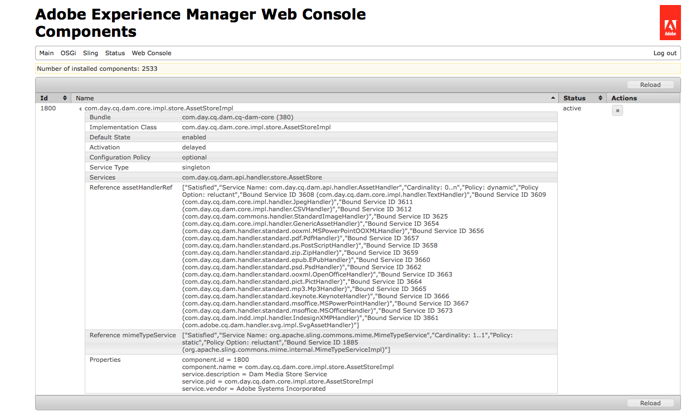

# Bearbeta resurser med mediehanterare och arbetsflöden {#processing-assets-using-media-handlers-and-workflows}

[!DNL Adobe Experience Manager Assets] innehåller en uppsättning standardarbetsflöden och mediehanterare för att bearbeta resurser. I ett arbetsflöde definieras de uppgifter som ska köras på resurserna och sedan delegeras de specifika uppgifterna till mediehanterarna, till exempel generering av miniatyrbilder eller extrahering av metadata.

Ett arbetsflöde kan konfigureras så att det körs automatiskt när en resurs av en viss MIME-typ överförs. Bearbetningsstegen definieras som en serie [!DNL Assets] mediehanterare. [!DNL Experience Manager] innehåller vissa [inbyggda hanterare,](#default-media-handlers) och ytterligare kan antingen [anpassas](#creating-a-new-media-handler) eller definieras genom att delegera processen till ett [kommandoradsverktyg](#command-line-based-media-handler).

Mediehanterare är tjänster i [!DNL Assets] som utför specifika åtgärder för resurser. När till exempel en MP3-ljudfil överförs till [!DNL Experience Manager]utlöses en MP3-hanterare som extraherar metadata och skapar en miniatyrbild. Mediehanterare används vanligtvis i kombination med arbetsflöden. De vanligaste MIME-typerna stöds i [!DNL Experience Manager]. Specifika uppgifter kan utföras på resurser genom att antingen utöka/skapa arbetsflöden, utöka/skapa mediehanterare eller inaktivera/aktivera mediehanterare.

>[!NOTE]
>
>På sidan Format [som stöds av](assets-formats.md) Assets finns en beskrivning av alla format som stöds av [!DNL Assets] samt funktioner som stöds för varje format.

## Standardmediehanterare {#default-media-handlers}

Följande mediehanterare är tillgängliga i [!DNL Assets] och hanterar de vanligaste MIME-typerna:

<!-- TBD: Java versions shouldn't be set to 1.5. Must be updated.
-->

| Hanterarnamn | Tjänstnamn (i systemkonsolen) | MIME-typer som stöds |
|--------------|--------------------------------------|----------------------|
| [!UICONTROL TextHandler] | `com.day.cq.dam.core.impl.handler.TextHandler` | text/plain |
| [!UICONTROL PdfHandler] | `com.day.cq.dam.handler.standard.pdf.PdfHandler` | <ul><li>application/pdf</li><li>program/illustrator</li></ul> |
| [!UICONTROL JpegHandler] | `com.day.cq.dam.core.impl.handler.JpegHandler` | image/jpeg |
| [!UICONTROL Mp3Handler] | `com.day.cq.dam.handler.standard.mp3.Mp3Handler` | audio/mpeg |
| [!UICONTROL ZipHandler] | `com.day.cq.dam.handler.standard.zip.ZipHandler` | <ul><li>application/java-archive </li><li> application/zip</li></ul> |
| [!UICONTROL PictHandler] | `com.day.cq.dam.handler.standard.pict.PictHandler` | bild/pict |
| [!UICONTROL StandardImageHandler] | `com.day.cq.dam.core.impl.handler.StandardImageHandler` | <ul><li>image/gif </li><li> bild/png </li> <li>application/photoshop </li> <li>image/jpeg </li><li> bild/tiff </li> <li>image/x-ms-bmp </li><li> image/bmp</li></ul> |
| [!UICONTROL MSOfficeHandler] | `com.day.cq.dam.handler.standard.msoffice.MSOfficeHandler` | application/msword |
| [!UICONTROL MSPowerPointHandler] | `com.day.cq.dam.handler.standard.msoffice.MSPowerPointHandler` | application/vnd.ms |
| [!UICONTROL OpenOfficeHandler] | `com.day.cq.dam.handler.standard.ooxml.OpenOfficeHandler` | <ul><li>application/vnd.openxmlformats.wordbehandlingml.document</li><li> application/vnd.openxmlformats-officedocument.spreadsheet.etml.sheet</li><li> application/vnd.openxmlformats.presentationml.presentation</li></ul> |
| [!UICONTROL EPubHandler] | `com.day.cq.dam.handler.standard.epub.EPubHandler` | application/epub+zip |
| [!UICONTROL GenericAssetHandler] | `com.day.cq.dam.core.impl.handler.GenericAssetHandler` | tillbaka om ingen annan hanterare hittades för att extrahera data från en resurs |

Alla hanterare utför följande uppgifter:

* extrahera alla tillgängliga metadata från resursen.
* skapa en miniatyrbild av en resurs.

Så här visar du de aktiva mediehanterarna:

1. Navigera till i webbläsaren `http://localhost:4502/system/console/components`.
1. Klicka på `com.day.cq.dam.core.impl.store.AssetStoreImpl`.
1. En lista med alla aktiva mediehanterare visas. Till exempel:



## Använda mediehanterare i arbetsflöden för att utföra åtgärder på resurser {#using-media-handlers-in-workflows-to-perform-tasks-on-assets}

Mediehanterare är tjänster som vanligtvis används i kombination med arbetsflöden.

[!DNL Experience Manager] har vissa standardarbetsflöden för att bearbeta resurser. Om du vill visa dem öppnar du arbetsflödeskonsolen och klickar på **[!UICONTROL Models]** fliken: de arbetsflödestitlar som börjar med [!DNL Assets] är resursspecifika.

Befintliga arbetsflöden kan utökas och nya kan skapas för att bearbeta resurser enligt specifika krav.

I följande exempel visas hur du förbättrar arbetsflödet **[!UICONTROL AEM Assets Synchronization]** så att delresurser genereras för alla resurser utom PDF-dokument.

### Inaktivera eller aktivera en mediehanterare {#disabling-enabling-a-media-handler}

Mediehanterarna kan inaktiveras eller aktiveras via webbhanteringskonsolen för Apache Felix. När mediehanteraren är inaktiverad utförs inte dess uppgifter på resurserna.

Så här aktiverar/inaktiverar du en mediehanterare:

1. Navigera till i webbläsaren `https://<host>:<port>/system/console/components`.
1. Klicka **[!UICONTROL Disable]** bredvid namnet på mediehanteraren. Till exempel: `com.day.cq.dam.handler.standard.mp3.Mp3Handler`.
1. Uppdatera sidan: en ikon visas bredvid mediehanteraren som anger att den är inaktiverad.
1. Om du vill aktivera mediehanteraren klickar du **[!UICONTROL Enable]** bredvid namnet på mediehanteraren.

### Skapa en ny mediehanterare {#creating-a-new-media-handler}

Om du vill ha stöd för en ny medietyp eller utföra specifika åtgärder på en resurs måste du skapa en ny mediehanterare. I det här avsnittet beskrivs hur du fortsätter.

#### Viktiga klasser och gränssnitt {#important-classes-and-interfaces}

Det bästa sättet att starta en implementering är att ärva från en tillhandahållen abstrakt implementering som tar hand om de flesta saker och tillhandahåller ett rimligt standardbeteende: klassen `com.day.cq.dam.core.AbstractAssetHandler` .

Den här klassen tillhandahåller redan en abstrakt tjänstbeskrivning. Om du ärver från den här klassen och använder plugin-programmet maven-sling ska du se till att du anger ärvningsflaggan som `true`.

Implementera följande metoder:

* `extractMetadata()`: extraherar alla tillgängliga metadata.
* `getThumbnailImage()`: skapar en miniatyrbild av den överförda resursen.
* `getMimeTypes()`: returnerar resursens MIME-typer.

Här är en exempelmall:

```Java
package my.own.stuff; /** * @scr.component inherit="true" * @scr.service */ public class MyMediaHandler extends com.day.cq.dam.core.AbstractAssetHandler { // implement the relevant parts }
```

Gränssnittet och klasserna omfattar:

* `com.day.cq.dam.api.handler.AssetHandler` gränssnitt: Det här gränssnittet beskriver tjänsten som lägger till stöd för specifika MIME-typer. Om du lägger till en ny MIME-typ måste det här gränssnittet implementeras. Gränssnittet innehåller metoder för import och export av specifika dokument, för att skapa miniatyrbilder och extrahera metadata.
* `com.day.cq.dam.core.AbstractAssetHandler` klass: Den här klassen fungerar som bas för alla andra tillgångshanterarimplementeringar och tillhandahåller vanliga funktioner.
* Klassen `com.day.cq.dam.core.AbstractSubAssetHandler`:
   * Den här klassen fungerar som bas för alla andra implementeringar av tillgångshanterare och tillhandahåller vanliga funktioner plus vanliga funktioner för extrahering av undertillgångar.
   * Det bästa sättet att starta en implementering är att ärva från en tillhandahållen abstrakt implementering som tar hand om de flesta saker och tillhandahåller ett rimligt standardbeteende: klassen com.day.cq.dam.core.AbstractAssetHandler.
   * Den här klassen tillhandahåller redan en abstrakt tjänstbeskrivning. Om du ärver från den här klassen och använder maven-sling-plugin-programmet måste du ange att ärvningsflaggan ska vara true.

Följande metoder måste implementeras:

* `extractMetadata()`: den här metoden extraherar alla tillgängliga metadata.
* `getThumbnailImage()`: den här metoden skapar en miniatyrbild av den skickade resursen.
* `getMimeTypes()`: den här metoden returnerar resursens MIME-typ(er).

Här är en exempelmall:

package my.own.stuff; /&amp;ast;&amp;ast; &amp;ast; @scr.component inherit=&quot;true&quot; &amp;ast; @scr.service &amp;ast;/ public class MyMediaHandler utökar com.day.cq.dam.core.AbstractAssetHandler { // implementerar relevanta delar }

Gränssnittet och klasserna omfattar:

* `com.day.cq.dam.api.handler.AssetHandler` gränssnitt: Det här gränssnittet beskriver tjänsten som lägger till stöd för specifika MIME-typer. Om du lägger till en ny MIME-typ måste det här gränssnittet implementeras. Gränssnittet innehåller metoder för import och export av specifika dokument, för att skapa miniatyrbilder och extrahera metadata.
* `com.day.cq.dam.core.AbstractAssetHandler` klass: Den här klassen fungerar som bas för alla andra tillgångshanterarimplementeringar och tillhandahåller vanliga funktioner.
* `com.day.cq.dam.core.AbstractSubAssetHandler` klass: Den här klassen fungerar som bas för alla andra implementeringar av tillgångshanterare och tillhandahåller vanliga funktioner plus vanliga funktioner för subresursextrahering.

#### Exempel: skapa en specifik texthanterare {#example-create-a-specific-text-handler}

I det här avsnittet skapar du en specifik texthanterare som genererar miniatyrbilder med en vattenstämpel.

Gör så här:

Se [Utvecklingsverktyg](../sites-developing/dev-tools.md) för att installera och konfigurera Eclipse med ett [!DNL Maven] plugin-program och för att ställa in beroenden som behövs för [!DNL Maven] projektet.

När du har utfört följande procedur extraheras filens metadata när du överför en TXT-fil till [!DNL Experience Manager]och två miniatyrer med vattenstämpel genereras.

1. I Eclipse skapar du `myBundle`[!DNL Maven] projekt:

   1. Klicka på **[!UICONTROL File]** > **[!UICONTROL New]** > **[!UICONTROL Other]** i menyraden.
   1. Expandera [!DNL Maven] mappen i dialogrutan, markera [!DNL Maven] projekt och klicka på **[!UICONTROL Next]**.
   1. Markera kryssrutan Skapa ett enkelt projekt och rutan Använd standardplatser för arbetsyta och klicka sedan på **[!UICONTROL Next]**.
   1. Definiera ett [!DNL Maven] projekt:

      * Grupp-ID: `com.day.cq5.myhandler`.
      * Artefakt-ID: myBundle.
      * Namn: Mitt [!DNL Experience Manager] paket.
      * Beskrivning: Det här är mitt [!DNL Experience Manager] paket.
   1. Klicka på **[!UICONTROL Finish]**.


1. Ställ in kompilatorn på version 1.5: [!DNL Java]

   1. Högerklicka på `myBundle` projektet och välj [!UICONTROL Properties].
   1. Markera [!UICONTROL Java Compiler] och ange följande egenskaper till 1.5:

      * Kompilatorefterlevnadsnivå
      * Kompatibilitet med genererade .class-filer
      * Källkompatibilitet
   1. Klicka på **[!UICONTROL OK]**. In the dialog window, click **[!UICONTROL Yes]**.


1. Ersätt koden i `pom.xml` filen med följande kod:

   ```xml
   <project xmlns="https://maven.apache.org/POM/4.0.0" xmlns:xsi="https://www.w3.org/2001/XMLSchema-instance"
    xsi:schemaLocation="https://maven.apache.org/POM/4.0.0 https://maven.apache.org/maven-v4_0_0.xsd">
    <modelVersion>4.0.0</modelVersion>
    <!-- ====================================================================== -->
    <!-- P A R E N T P R O J E C T D E S C R I P T I O N -->
    <!-- ====================================================================== -->
    <parent>
     <groupId>com.day.cq.dam</groupId>
     <artifactId>dam</artifactId>
     <version>5.2.14</version>
     <relativePath>../parent</relativePath>
    </parent>
    <!-- ====================================================================== -->
    <!-- P R O J E C T D E S C R I P T I O N -->
    <!-- ====================================================================== -->
    <groupId>com.day.cq5.myhandler</groupId>
    <artifactId>myBundle</artifactId>
    <name>My CQ5 bundle</name>
    <version>0.0.1-SNAPSHOT</version>
    <description>This is my CQ5 bundle</description>
    <packaging>bundle</packaging>
    <!-- ====================================================================== -->
    <!-- B U I L D D E F I N I T I O N -->
    <!-- ====================================================================== -->
    <build>
     <plugins>
      <plugin>
       <groupId>org.apache.felix</groupId>
       <artifactId>maven-scr-plugin</artifactId>
      </plugin>
      <plugin>
       <groupId>org.apache.sling</groupId>
       <artifactId>maven-sling-plugin</artifactId>
       <configuration>
        <slingUrlSuffix>/libs/dam/install/</slingUrlSuffix>
       </configuration>
      </plugin>
      <plugin>
       <groupId>org.apache.felix</groupId>
       <artifactId>maven-bundle-plugin</artifactId>
       <extensions>true</extensions>
       <configuration>
        <instructions>
         <Bundle-Category>cq5</Bundle-Category>
         <Export-Package> com.day.cq5.myhandler </Export-Package>
        </instructions>
       </configuration>
      </plugin>
     </plugins>
    </build>
    <!-- ====================================================================== -->
    <!-- D E P E N D E N C I E S -->
    <!-- ====================================================================== -->
    <dependencies>
     <dependency>
      <groupId>com.day.cq.dam</groupId>
      <artifactId>cq-dam-api</artifactId>
      <version>5.2.10</version>
      <scope>provided</scope>
     </dependency>
     <dependency>
      <groupId>com.day.cq.dam</groupId>
      <artifactId>cq-dam-core</artifactId>
      <version>5.2.10</version>
      <scope>provided</scope>
     </dependency>
     <dependency>
      <groupId>com.day.cq</groupId>
      <artifactId>cq-commons</artifactId>
     </dependency>
     <dependency>
      <groupId>javax.jcr</groupId>
      <artifactId>jcr</artifactId>
     </dependency>
     <dependency>
      <groupId>org.apache.felix</groupId>
      <artifactId>org.osgi.compendium</artifactId>
     </dependency>
     <dependency>
      <groupId>org.slf4j</groupId>
      <artifactId>slf4j-api</artifactId>
     </dependency>
     <dependency>
      <groupId>commons-lang</groupId>
      <artifactId>commons-lang</artifactId>
     </dependency>
     <dependency>
      <groupId>commons-collections</groupId>
      <artifactId>commons-collections</artifactId>
     </dependency>
     <dependency>
      <groupId>commons-io</groupId>
      <artifactId>commons-io</artifactId>
     </dependency>
     <dependency>
      <groupId>com.day.commons</groupId>
      <artifactId>day-commons-gfx</artifactId>
     </dependency>
     <dependency>
      <groupId>com.day.commons</groupId>
      <artifactId>day-commons-text</artifactId>
     </dependency>
     <dependency>
      <groupId>com.day.cq.workflow</groupId>
      <artifactId>cq-workflow-api</artifactId>
     </dependency>
     <dependency>
      <groupId>com.day.cq.wcm</groupId>
      <artifactId>cq-wcm-foundation</artifactId>
      <version>5.2.22</version>
     </dependency>
    </dependencies>
   ```

1. Skapa paketet `com.day.cq5.myhandler` som innehåller [!DNL Java] klasserna under `myBundle/src/main/java`:

   1. Under myBundle högerklickar du `src/main/java`, väljer Ny och sedan Packa.
   1. Ge den ett namn `com.day.cq5.myhandler` och klicka på Slutför.

1. Skapa [!DNL Java] klassen `MyHandler`:

   1. I [!DNL Eclipse], under `myBundle/src/main/java`, högerklickar du på `com.day.cq5.myhandler` paketet. Välj [!UICONTROL New]sedan [!UICONTROL Class].
   1. I dialogrutan ger du klassen ett namn [!DNL Java] och klickar på `MyHandler` [!UICONTROL Finish]. [!DNL Eclipse] skapar och öppnar filen `MyHandler.java`.
   1. I `MyHandler.java` Ersätt den befintliga koden med följande och spara sedan ändringarna:

   ```java
   package com.day.cq5.myhandler;
   import java.awt.Color;
   import java.awt.Rectangle;
   import java.awt.image.BufferedImage;
   import java.io.IOException;
   import java.io.InputStream;
   import java.io.InputStreamReader;
   import javax.jcr.Node;
   import javax.jcr.RepositoryException;
   import javax.jcr.Session;
   import org.apache.commons.io.IOUtils;
   import org.slf4j.Logger;
   import org.slf4j.LoggerFactory;
   import com.day.cq.dam.api.metadata.ExtractedMetadata;
   import com.day.cq.dam.core.AbstractAssetHandler;
   import com.day.image.Font;
   import com.day.image.Layer;
   import com.day.cq.wcm.foundation.ImageHelper;
   
   /**
    * The <code>MyHandler</code> can extract text files
    * @scr.component inherit="true" immediate="true" metatype="false"
    * @scr.service
    *
    **/
   
   public class MyHandler extends AbstractAssetHandler {
    /** * Logger instance for this class. */
    private static final Logger log = LoggerFactory.getLogger(MyHandler.class);
    /** * Music icon margin */
    private static final int MARGIN = 10;
    /** * @see com.day.cq.dam.api.handler.AssetHandler#getMimeTypes() */
    public String[] getMimeTypes() {
     return new String[] {"text/plain"};
    }
   
    public ExtractedMetadata extractMetadata(Node asset) {
     ExtractedMetadata extractedMetadata = new ExtractedMetadata();
     InputStream data = getInputStream(asset);
     try {
      // read text data
      InputStreamReader reader = new InputStreamReader(data);
      char[] buffer = new char[4096];
      String text = "";
      while (reader.read(buffer) != -1) {
       text += new String(buffer);
      }
      reader.close();
      long wordCount = this.wordCount(text);
      extractedMetadata.setProperty("text", text);
      extractedMetadata.setMetaDataProperty("Word Count",wordCount);
      setMimetype(extractedMetadata, asset);
     } catch (Throwable t) {
      log.error("handling error: " + t.toString(), t);
     } finally {
      IOUtils.closeQuietly(data);
     }
     return extractedMetadata; }
    // ----------------------< helpers >----------------------------------------
    protected BufferedImage getThumbnailImage(Node node) {
     ExtractedMetadata metadata = extractMetadata(node);
     final String text = (String) metadata.getProperty("text");
     // create text layer
     final Layer layer = new Layer(500, 600, Color.WHITE);
     layer.setPaint(Color.black);
     Font font = new Font("Arial", 12);
     String displayText = this.getDisplayText(text, 600, 12);
     if(displayText!=null && displayText.length() > 0) {
      // commons-gfx Font class would throw IllegalArgumentException on empty or null text
      layer.drawText(10, 10, 500, 600, displayText, font, Font.ALIGN_LEFT, 0, 0);
     }
     // create watermark and merge with text layer
     Layer watermarkLayer;
     try {
      final Session session = node.getSession();
      watermarkLayer = ImageHelper.createLayer(session, "/content/dam/geometrixx/icons/certificate.png");
      watermarkLayer.setX(MARGIN);
      watermarkLayer.setY(MARGIN);
      layer.merge(watermarkLayer);
     } catch (RepositoryException e) {
      // TODO Auto-generated catch block
      e.printStackTrace();
     } catch (IOException e) {
      // TODO Auto-generated catch block
      e.printStackTrace(); }
     layer.crop(new Rectangle(510, 600));
     return layer.getImage(); }
    // ---------------< private >-----------------------------------------------
    /**
     * This method cuts lines if the text file is too long..
     * * @param text
     * * text to check
     * * @param height
     * * text box height (px)
     * * @param fontheight
     * * font height (px)
     * * @return the text which will fit into the box
     */
    private String getDisplayText(String text, int height, int fontheight) {
     String trimmedText = text.trim();
     int numOfLines = height / fontheight;
     String lines[] = trimmedText.split("\n");
     if (lines.length <= numOfLines) {
      return trimmedText;
     } else {
      String cuttetText = "";
      for (int i = 0; i < numOfLines; i++) {
       cuttetText += lines[i] + "\n";
      }
      return cuttetText;
     }
    }
    /**
     * * This method counts the number of words in a string
     * * @param text the String whose words would like to be counted
     * * @return the number of words in the string
     * */
    private long wordCount(String text) {
     // We need to keep track of the last character, if we have two whitespaces in a row we don't want to double count.
     // The starting of the document is always a whitespace.
     boolean prevWhiteSpace = true;
     boolean currentWhiteSpace = true;
     char c; long numwords = 0;
     int j = text.length();
     int i = 0;
     while (i < j) {
      c = text.charAt(i++);
      if (c == 0) { break; }
      currentWhiteSpace = Character.isWhitespace(c);
      if (currentWhiteSpace && !prevWhiteSpace) { numwords++; }
      prevWhiteSpace = currentWhiteSpace;
     }
     // If we do not end with a whitespace then we need to add one extra word.
     if (!currentWhiteSpace) { numwords++; }
     return numwords;
    }
   }
   ```

1. Kompilera [!DNL Java] klassen och skapa paketet:

   1. Högerklicka på `myBundle` projektet, välj **[!UICONTROL Run As]** och sedan **[!UICONTROL Maven Install]**.
   1. Paketet `myBundle-0.0.1-SNAPSHOT.jar` (som innehåller den kompilerade klassen) skapas under `myBundle/target`.

1. Skapa en ny nod under i CRX Explorer `/apps/myApp`. Namn = `install`, Typ = `nt:folder`.
1. Kopiera paketet `myBundle-0.0.1-SNAPSHOT.jar` och lagra det under `/apps/myApp/install` (till exempel med WebDAV). Den nya texthanteraren är nu aktiv i [!DNL Experience Manager].
1. Öppna [!UICONTROL Apache Felix Web Management Console]webbläsaren. Markera [!UICONTROL Components] fliken och inaktivera standardtexthanteraren `com.day.cq.dam.core.impl.handler.TextHandler`.

## Kommandoradsbaserad mediehanterare {#command-line-based-media-handler}

[!DNL Experience Manager] Med kan du köra valfritt kommandoradsverktyg i ett arbetsflöde för att konvertera resurser (till exempel [!DNL ImageMagick]) och lägga till den nya återgivningen i resursen. Du behöver bara installera kommandoradsverktyget på den disk som är värd för [!DNL Experience Manager] servern och lägga till och konfigurera ett processsteg i arbetsflödet. Den anropade processen, som kallas `CommandLineProcess`, gör det även möjligt att filtrera efter specifika MIME-typer och skapa flera miniatyrbilder baserat på den nya återgivningen.

Följande konverteringar kan köras och lagras automatiskt i [!DNL Assets]:

* EPS- och AI-omvandling med [ImageMagick](https://www.imagemagick.org/script/index.php) och [Ghostscript](https://www.ghostscript.com/).
* FLV-videotranskodning med [FFmpeg](https://ffmpeg.org/).
* MP3-kodning med [LAME](https://lame.sourceforge.io/).
* Ljudbearbetning med [SOX](https://sox.sourceforge.net/).

>[!NOTE]
>
>I andra system än Windows returnerar mpeg-verktyget ett fel när återgivningar genereras för en videoresurs som har ett enkelt citattecken (&#39;) i filnamnet. Om namnet på videofilen innehåller ett enkelt citattecken tar du bort det innan du överför det till [!DNL Experience Manager].

Processen `CommandLineProcess` utför följande åtgärder i den ordning de anges:

* Filtrerar filen enligt specifika MIME-typer, om det anges.
* Skapar en tillfällig katalog på den disk som är värd för [!DNL Experience Manager] servern.
* Direktuppspelar originalfilen till den tillfälliga katalogen.
* Kör det kommando som definieras av argumenten i steget. Kommandot körs i den tillfälliga katalogen med behörighet för den användare som kör [!DNL Experience Manager].
* Flyttar tillbaka resultatet till [!DNL Experience Manager] serverns återgivningsmapp.
* Tar bort den tillfälliga katalogen.
* Skapar miniatyrbilder baserade på dessa återgivningar, om de anges. Miniatyrbildernas antal och mått definieras av stegets argument.

### Ett exempel som använder [!DNL ImageMagick] {#an-example-using-imagemagick}

I följande exempel visas hur du ställer in kommandoradsprocesssteget så att varje gång en resurs med e-typen miMIME GIF eller TIFF läggs till `/content/dam` på [!DNL Experience Manager] servern skapas en bild med den ursprungliga bilden tillsammans med ytterligare tre miniatyrbilder (140x100, 48x48 och 10x250).

Använd [!DNL ImageMagick]för att göra detta. [!DNL ImageMagick] är ett kostnadsfritt kommandoradsprogram som används för att skapa, redigera och komponera bitmappsbilder.

Installera [!DNL ImageMagick] på disken som är värd för [!DNL Experience Manager] servern:

1. Installera [!DNL ImageMagick]: Se [dokumentationen](https://www.imagemagick.org/script/download.php)för ImageMagick.
1. Konfigurera verktyget så att du kan köra konverteringen på kommandoraden.
1. Om du vill se om verktyget är korrekt installerat kör du följande kommando `convert -h` på kommandoraden.

   En hjälpskärm med alla möjliga alternativ för konverteringsverktyget visas.

   >[!NOTE]
   >
   >I vissa versioner av Windows kan kommandot convert misslyckas eftersom det står i konflikt med det inbyggda konverteringsverktyget som är en del av [!DNL Windows] installationen. I det här fallet anger du den fullständiga sökvägen för den programvara som används för att konvertera bildfiler till miniatyrbilder. [!DNL ImageMagick] Till exempel, `"C:\Program Files\ImageMagick-6.8.9-Q16\convert.exe" -define jpeg:size=319x319 ${filename} -thumbnail 319x319 cq5dam.thumbnail.319.319.png`.

1. Om du vill se om verktyget fungerar som det ska lägger du till en JPG-bild i arbetskatalogen och kör kommandot convert `<image-name>.jpg -flip <image-name>-flipped.jpg` på kommandoraden. En speglad bild läggs till i katalogen. Then, add the command line process step to the **[!UICONTROL DAM Update Asset]** workflow.
1. Gå till **[!UICONTROL Workflow]** konsolen.
1. Redigera **[!UICONTROL Models]** modellen på **[!UICONTROL DAM Update Asset]** fliken.
1. Ändra [!UICONTROL Arguments] stegets **[!UICONTROL Web enabled rendition]** status till: `mime:image/gif,mime:image/tiff,tn:140:100,tn:48:48,tn:10:250,cmd:convert ${directory}/${filename} -flip ${directory}/${basename}.flipped.jpg`.
1. Spara arbetsflödet.

Om du vill testa det ändrade arbetsflödet lägger du till en resurs i `/content/dam`.

1. Hämta en TIFF-bild i filsystemet. Byt namn på filen till `myImage.tiff` och kopiera den till, `/content/dam`till exempel med hjälp av WebDAV.
1. Gå till **[!UICONTROL CQ5 DAM]** konsolen, till exempel `http://localhost:4502/libs/wcm/core/content/damadmin.html`.
1. Öppna resursen **[!UICONTROL myImage.tiff]** och kontrollera att den vända bilden och de tre miniatyrbilderna har skapats.

#### Konfigurera processteget CommandLineProcess {#configuring-the-commandlineprocess-process-step}

This section describes how to set the [!UICONTROL Process Arguments] of the [!UICONTROL CommandLineProcess].

Använd kommatecken för att avgränsa värdena för [!UICONTROL Process Arguments] tecknet och låt det inte börja med ett blanksteg.

| Argument-Format | Beskrivning |
|---|---|
| mime:&lt;mime-type> | Valfritt argument. Processen används om resursen har samma MIME-typ som argumentet. <br>Flera MIME-typer kan definieras. |
| tn:&lt;width>:&lt;height> | Valfritt argument. Processen skapar en miniatyrbild med de dimensioner som definieras i argumentet. <br>Flera miniatyrbilder kan definieras. |
| cmd: &lt;kommando> | Definierar det kommando som körs. Syntaxen beror på kommandoradsverktyget. Endast ett kommando kan definieras. <br>Följande variabler kan användas för att skapa kommandot:<br>`${filename}`: indatafilens namn, till exempel original.jpg <br> `${file}`: den fullständiga sökvägen till indatafilen, till exempel `/tmp/cqdam0816.tmp/original.jpg` <br> `${directory}`: indatafilens katalog, till exempel `/tmp/cqdam0816.tmp`<br>`${basename}`: namnet på indatafilen utan filnamnstillägg, till exempel original <br>`${extension}`: tillägg för indatafilen, till exempel JPG. |

Om [!DNL ImageMagick] till exempel är installerat på den disk som är värd för [!DNL Experience Manager] servern och du skapar ett processsteg med [!UICONTROL CommandLineProcess] implementering och följande värden som [!UICONTROL Process Arguments]:

`mime:image/gif,mime:image/tiff,tn:140:100,tn:48:48,tn:10:250,cmd:convert ${directory}/${filename} -flip ${directory}/${basename}.flipped.jpg`

När arbetsflödet körs gäller steget endast resurser som har `image/gif` eller `mime:image/tiff` som `mime-types`skapas en bild som vänds av originalet, konverteras till JPG och tre miniatyrbilder med följande dimensioner skapas: 140x100, 48x48 och 10x250.

Använd följande [!UICONTROL Process Arguments] för att skapa de tre standardminiatyrbilderna med [!DNL ImageMagick]:

`mime:image/tiff,mime:image/png,mime:image/bmp,mime:image/gif,mime:image/jpeg,cmd:convert ${filename} -define jpeg:size=319x319 -thumbnail "319x319>" -background transparent -gravity center -extent 319x319 -write png:cq5dam.thumbnail.319.319.png -thumbnail "140x100>" -background transparent -gravity center -extent 140x100 -write cq5dam.thumbnail.140.100.png -thumbnail "48x48>" -background transparent -gravity center -extent 48x48 cq5dam.thumbnail.48.48.png`

Använd följande [!UICONTROL Process Arguments] för att skapa den webbaktiverade återgivningen med [!DNL ImageMagick]:

`mime:image/tiff,mime:image/png,mime:image/bmp,mime:image/gif,mime:image/jpeg,cmd:convert ${filename} -define jpeg:size=1280x1280 -thumbnail "1280x1280>" cq5dam.web.1280.1280.jpeg`

>[!NOTE]
>
>Stegen gäller bara för resurser (noder av typen [!UICONTROL CommandLineProcess] `dam:Asset`) eller underordnade objekt till en resurs.

>[!MORELIKETHIS]
>
>* [Bearbeta resurser](assets-workflow.md)

