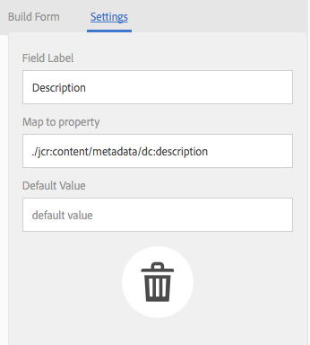

# Konfiguration och administration av metadatafunktioner i [!DNL Assets] {#config-metadata}

<!-- Scope of metadata articles:
* metadata.md: The scope of this article is basic metadata updates, changes, etc. operations that end-users can do.
* metadata-concepts.md: All conceptual information. Minor instructions are OK but it is an FYI article about support and standards.
* metadata-config.md: New article. Contains all configuration and administration how-to info related to metadata of assets.
-->

[!DNL Adobe Experience Manager Assets] sparar metadata för varje resurs. Det gör det enklare att kategorisera och ordna resurser och det hjälper personer som letar efter en viss resurs. Med möjligheten att behålla och hantera metadata med dina resurser kan du automatiskt ordna och bearbeta resurser baserat på deras metadata. [!DNL Adobe Experience Manager Assets] gör att administratörer kan konfigurera och anpassa metadatafunktioner för att ändra standarderbjudandet för Adobe.

## Redigera metadatamatchema {#metadata-schema}

Mer information finns i [Redigera schemaformulär](metadata-schemas.md#edit-metadata-schema-forms)för metadata.

## Registrera ett anpassat namnutrymme i [!DNL Experience Manager] {#registering-a-custom-namespace-within-aem}

Du kan lägga till egna namnutrymmen i [!DNL Experience Manager]. Precis som det finns fördefinierade namnutrymmen som `cq`, `jcr`och `sling`kan du ha ett namnutrymme för databasens metadata och XML-bearbetning.

1. Gå till administrationssidan för nodtypen `https://[aem_server]:[port]/crx/explorer/nodetypes/index.jsp`.
1. Du öppnar sidan för namnutrymmesadministration genom att klicka på **[!UICONTROL Namespaces]** överst på sidan.
1. Om du vill lägga till ett namnutrymme klickar du **[!UICONTROL New]** längst ned på sidan.
1. Ange ett anpassat namnutrymme i XML-namnutrymmeskonventionen. Ange ID:t i form av en URI och ett associerat prefix för ID:t. Klicka på **[!UICONTROL Save]**.

## Konfigurera gränser för massmetadatauppdatering {#bulk-metadata-update-limit}

För att förhindra en DOS-liknande situation (Denial of Service) begränsar [!DNL Enterprise Manager] antalet parametrar som stöds i en Sling-begäran. När du uppdaterar metadata för många resurser på en gång kan du nå gränsen och metadata uppdateras inte för fler resurser. Enterprise Manager genererar följande varning i loggarna:

`org.apache.sling.engine.impl.parameters.Util Too many name/value pairs, stopped processing after 10000 entries`

To change the limit, access **[!UICONTROL Tools]** > **[!UICONTROL Operations]** > **[!UICONTROL Web Console]** and change the value of **[!UICONTROL Maximum POST Parameters]** in **[!UICONTROL Apache Sling Request Parameter Handling]** OSGi configuration.

## Metadataprofiler {#metadata-profiles}

Med en metadataprofil kan du använda standardmetadata för resurser i en mapp. Skapa en metadataprofil och tillämpa den på en mapp. Alla resurser som du sedan överför till mappen ärver de standardmetadata som du konfigurerade i metadataprofilen.

### Lägg till en metadataprofil {#adding-a-metadata-profile}

1. Navigera till **[!UICONTROL Tools]** > **[!UICONTROL Assets]** > **[!UICONTROL Metadata Profiles]** och klicka **[!UICONTROL Create]**.
1. Ange till exempel en rubrik för profilen `Sample Metadata`och klicka på **[!UICONTROL Create]**. Metadataprofilens [!UICONTROL Edit Form] namn visas.

   

1. Klicka på en komponent och konfigurera dess egenskaper på **[!UICONTROL Settings]** fliken. Klicka till exempel på **[!UICONTROL Description]** komponenten och redigera dess egenskaper.

   

   Redigera följande egenskaper för **[!UICONTROL Description]** komponenten:

   * **[!UICONTROL Field Label]**: Visningsnamnet för metadataegenskapen. Det är bara till för användarreferensen.

   * **[!UICONTROL Map to Property]**: Värdet för den här egenskapen anger den relativa sökvägen eller namnet till resursnoden där den sparas i databasen. Värdet ska alltid börja med `./` eftersom det anger att sökvägen finns under objektets nod.

   

   The value you specify for **[!UICONTROL Map to property]** is stored as a property under the asset&#39;s metadata node. Om du till exempel anger `./jcr:content/metadata/dc:desc` som namn på **[!UICONTROL Map to property]** lagrar [!DNL Assets] värdet `dc:desc` på objektets metadatanod.

   * **[!UICONTROL Default Value]**: Använd den här egenskapen om du vill lägga till ett standardvärde för metadatakomponenten. Om du till exempel anger &quot;Min beskrivning&quot; tilldelas det här värdet till egenskapen `dc:desc` vid objektets metadatanod.

   

   >[!NOTE]
   >
   >Lägga till ett standardvärde i en ny metadataegenskap (som inte finns redan i . `/jcr:content/metadata` nod) visar inte egenskapen och dess värde på objektets egenskapssida som standard. Om du vill visa den nya egenskapen på resursens [!UICONTROL Properties] sida ändrar du motsvarande schemaformulär.

1. (Valfritt) Lägg till fler komponenter i Redigera formulär på fliken **[!UICONTROL Build Form]** och konfigurera deras egenskaper på fliken **[!UICONTROL Settings]**. Följande egenskaper är tillgängliga på fliken **[!UICONTROL Build Form]**:

| Komponent | Egenskaper |
| ----------------------------- | ----------------------------------------------------------------------- |
| [!UICONTROL Section Header] | Fältetikett,   beskrivning |
| [!UICONTROL Single Line Text] | Fältetikett,   Koppla till egenskap,   standardvärde |
| [!UICONTROL Multi Value Text] | Fältetikett,   Koppla till egenskap,   standardvärde |
| [!UICONTROL Number] | Fältetikett,   Koppla till egenskap,   standardvärde |
| [!UICONTROL Date] | Fältetikett,   Koppla till egenskap,   standardvärde |
| [!UICONTROL Standard Tags] | Fältetikett,   Koppla till egenskap,   Standardvärde,   Beskrivning |

1. Klicka på **[!UICONTROL Done]**. Metadataprofilen läggs till i listan med profiler på **[!UICONTROL Metadata Profiles]** sidan. 

   

### Kopiera en metadataprofil {#copying-a-metadata-profile}

1. Välj en metadataprofil på **[!UICONTROL Metadata Profiles]** sidan för att skapa en kopia av den.

   

1. Klicka på **[!UICONTROL Copy]** i verktygsfältet.
1. I **[!UICONTROL Copy Metadata Profile]** dialogrutan anger du en rubrik för den nya kopian av metadataprofilen.
1. Klicka på **[!UICONTROL Copy]**. Kopian av metadataprofilen visas i listan med profiler på sidan **[!UICONTROL Metadata Profiles]**.

   

### Ta bort en metadataprofil {#deleting-a-metadata-profile}

1. På **[!UICONTROL Metadata Profiles]** sidan väljer du en profil att ta bort.

1. Click **[!UICONTROL Delete Metadata Profiles]** in the toolbar.
1. Klicka på **[!UICONTROL Delete]** för att bekräfta borttagningen i dialogrutan. Metadataprofilen tas bort från listan.

<!-- TBD: Revisit to find out the correct config. and update these steps. When fixed, also o
These steps have been carried forward from old AEM versions. See https://helpx.adobe.com/experience-manager/6-2/assets/using/metadata-profiles.html#ApplyingaMetadataProfiletoFolders

### Configuration to apply a metadata profile globally {#apply-a-metadata-profile-globally}

In addition to applying a profile to a folder, you can also apply one globally so that any content uploaded into [!DNL Experience Manager] assets in any folder has the selected profile applied.

You can reprocess assets in a folder that already has an existing metadata profile that you later changed. See [Reprocessing assets in a folder after you have edited its processing profile](processing-profiles.md#reprocessing-assets).

To apply a metadata profile globally, follow these steps:

* Navigate to `https://[aem_server]:[port]/mnt/overlay/dam/gui/content/assets/foldersharewizard.html/content/dam` and apply the appropriate profile and click **[!UICONTROL Save]**.

  

* In CRXDE Lite, navigate to the following node: `/content/dam/jcr:content`. Add the property `metadataProfile:/etc/dam/metadata/dynamicmedia/<name of metadata profile>` and click **[!UICONTROL Save All]**.

  
-->

## Metadata-schema för en mapp {#folder-metadata-schema}

[!DNL Adobe Experience Manager Assets] Med kan du skapa metadatascheman för resursmappar, som definierar layouten och metadata som visas på mappegenskapssidor.

### Lägga till ett schemaformulär för mappmetadata {#add-a-folder-metadata-schema-form}

Använd schemaredigeraren för mappmetadata i Forms för att skapa och redigera metadatascheman för mappar.

1. In [!DNL Experience Manager] interface, go to **[!UICONTROL Tools]** > **[!UICONTROL Assets]** > **[!UICONTROL Folder Metadata Schemas]**.
1. På sidan [!UICONTROL Folder Metadata Schema Forms] klickar du på **[!UICONTROL Create]**.
1. Ange ett namn för formuläret och klicka på **[!UICONTROL Create]**. Det nya schemaformuläret visas på [!UICONTROL Schema Forms] sidan.

### Redigera schemaformulär för mappmetadata {#edit-folder-metadata-schema-forms}

Du kan redigera ett nyligen tillagt eller befintligt metadatchemaformulär, som innehåller följande:

* Tabbar
* Formulärobjekt på flikar.

Du kan mappa/konfigurera dessa formulärobjekt till ett fält i en metadatanod i CRX-databasen. Du kan lägga till nya flikar eller formulärobjekt i metadatchemaformuläret.

1. På Forms-sidan Schema väljer du det formulär som du skapade och väljer sedan **[!UICONTROL Edit]** alternativet i verktygsfältet.
1. Klicka på fliken för att lägga `+` till formuläret på sidan Schemaredigerare för mappmetadata. Om du vill byta namn på fliken klickar du på standardnamnet och anger det nya namnet under **[!UICONTROL Settings]**.

   

   Om du vill lägga till fler flikar klickar du på `+`. Klicka `X` på en flik för att ta bort den.

1. Lägg till en eller flera komponenter från **[!UICONTROL Build Form]** fliken på den aktiva fliken.

   

   Om du skapar flera flikar klickar du på en viss flik för att lägga till komponenter.

1. Om du vill konfigurera en komponent markerar du den och ändrar dess egenskaper på **[!UICONTROL Settings]** fliken.

   Om det behövs tar du bort en komponent från **[!UICONTROL Settings]** fliken.

   

1. Klicka **[!UICONTROL Save]** i verktygsfältet för att spara ändringarna.

#### Komponenter för att skapa formulär {#components-to-build-forms}

På **[!UICONTROL Build Form]** fliken visas formulärobjekt som du använder i schemaformuläret för mappmetadata. På fliken **[!UICONTROL Settings]** visas attributen för varje objekt som du väljer på **[!UICONTROL Build Form]** fliken. Här är en lista över tillgängliga formulärobjekt på **[!UICONTROL Build Form]** fliken:

| Komponentnamn | Beskrivning |
|---|---|
| [!UICONTROL Section Header] | Lägg till en avsnittsrubrik för en lista med gemensamma komponenter. |
| [!UICONTROL Single Line Text] | Lägg till en enkelradig textegenskap. Den lagras som en sträng. |
| [!UICONTROL Multi Value Text] | Lägg till en textegenskap med flera värden. Den lagras som en strängarray. |
| [!UICONTROL Number] | Lägg till en sifferkomponent. |
| [!UICONTROL Date] | Lägg till en datumkomponent. |
| [!UICONTROL Dropdown] | Lägg till en nedrullningsbar lista. |
| [!UICONTROL Standard Tags] | Lägg till en tagg. |
| [!UICONTROL Hidden Field] | Lägg till ett dolt fält. Den skickas som en POST-parameter när resursen sparas. |

#### Redigera formulärobjekt {#editing-form-items}

Om du vill redigera egenskaperna för formulärobjekt klickar du på komponenten och redigerar alla eller en delmängd av följande egenskaper på **[!UICONTROL Settings]** fliken.

**[!UICONTROL Field Label]**: Namnet på metadataegenskapen som visas på egenskapssidan för mappen.

**[!UICONTROL Map to Property]**: This property specifies the relative path of the folder node in the CRX database where it is saved. Det börjar med &quot;**./**&quot;, vilket anger att sökvägen finns under mappens nod.

Följande är giltiga värden för den här egenskapen:

* `./jcr:content/metadata/dc:title`: Lagrar värdet i mappens metadatanod som egenskap `dc:title`.

* `./jcr:created`: Visar JCR-egenskapen vid mappens nod. Om du konfigurerar de här egenskaperna i CRXDE rekommenderar Adobe att du markerar dem som Inaktivera redigering eftersom de är skyddade. Annars inträffar felet `Asset(s) failed to modify`&quot; när du sparar resursens egenskaper.

För att komponenten ska visas på rätt sätt i schemaformuläret för metadata ska du inte ta med något utrymme i egenskapssökvägen.

**[!UICONTROL JSON Path]**: Använd den för att ange sökvägen till JSON-filen där du anger nyckelvärdepar för alternativ.

**[!UICONTROL Placeholder]**: Använd den här egenskapen för att ange relevant platshållartext för metadataegenskapen.

**[!UICONTROL Choices]**: Använd den här egenskapen för att ange alternativ i en lista.

**[!UICONTROL Description]**: Använd den här egenskapen om du vill lägga till en kort beskrivning för metadatakomponenten.

**[!UICONTROL Class]**: Den objektklass som egenskapen är associerad med.

### Ta bort schemaformulär för mappmetadata {#delete-folder-metadata-schema-forms}

Du kan ta bort schemaformulär för mappmetadata från Forms-sidan för mappmetadataschema. Om du vill ta bort ett formulär markerar du det och klickar på borttagningsalternativet i verktygsfältet.

### Tilldela ett mappmetadatchema {#assign-a-folder-metadata-schema}

Du kan tilldela ett mappmetadatchema till en mapp från Forms-sidan för mappmetadataschema eller när du skapar en mapp.

Om du konfigurerar ett metadatamatchschema för en mapp lagras sökvägen till schemaformuläret i mappnodens `folderMetadataSchema` egenskap under `./jcr:content`.

#### Tilldela till ett schema från sidan Mappmetadatamatchema {#assign-to-a-schema-from-the-folder-metadata-schema-page}

1. In [!DNL Experience Manager] interface, go to **[!UICONTROL Tools]** > **[!UICONTROL Assets]** > **[!UICONTROL Folder Metadata Schemas]**.
1. På Forms-sidan för mappmetadataschema väljer du det schemaformulär som du vill tillämpa på en mapp.
1. Klicka på **[!UICONTROL Apply to Folder(s)]** i verktygsfältet.

1. Markera mappen som schemat ska tillämpas på och klicka sedan på **[!UICONTROL Apply]**. Om ett metadatamatchema redan används för mappen visas ett varningsmeddelande om att du håller på att skriva över det befintliga metadatamodemet. Klicka på **[!UICONTROL Overwrite]**.
1. Öppna metadataegenskaperna för den mapp som du tillämpade metadataschemat på.

   

   To view the folder metadata fields, click the **[!UICONTROL Folder Metadata]** tab.

   

#### Tilldela ett schema när du skapar en mapp {#assign-a-schema-when-creating-a-folder}

Du kan tilldela ett mappmetadatchema när du skapar en mapp. Om det finns minst ett mappmetadatchema i systemet visas en extra lista i **[!UICONTROL Create Folder]** dialogrutan. Du kan välja önskat schema. Som standard är inget schema valt.

1. I [!DNL Experience Manager Assets] användargränssnittet klickar du på **[!UICONTROL Create]** i verktygsfältet.
1. Ange en rubrik och ett namn för mappen.
1. Välj önskat schema i listan Mappmetadatamatchema. Klicka sedan på **[!UICONTROL Create]**.

   

1. Öppna metadataegenskaperna för den mapp som du tillämpade metadataschemat på.
1. To view the folder metadata fields, click the **[!UICONTROL Folder Metadata]** tab.

### Använd mappens metadatamatchema {#use-the-folder-metadata-schema}

Öppna egenskaperna för en mapp som har konfigurerats med ett schema för mappmetadata. A **[!UICONTROL Folder Metadata]** tab is displayed in the folder [!UICONTROL Properties] page. Om du vill visa formuläret för schemat med mappmetadata väljer du den här fliken.

Ange metadatavärden i de olika fälten och klicka **[!UICONTROL Save]** för att lagra värdena. De värden du anger lagras i mappnoden i CRX-databasen.

## Tips och begränsningar {#best-practices-limitations}

* Om du vill importera metadata för anpassade namnutrymmen måste du först registrera namnutrymmena.
* Egenskapsväljaren visar egenskaper som används i schemaredigerare och sökformulär. Egenskapsväljaren väljer inte metadataegenskaper för en resurs.
* Det kan finnas befintliga metadataprofiler sedan du uppgraderade till [!DNL Experience Manager] 6.5. Om du tillämpar en sådan profil i mappen [!UICONTROL Properties] på [!UICONTROL Metadata Profiles] fliken efter uppgraderingen visas inte metadatafälten. Om du däremot använder en ny metadataprofil visas formulärfälten, men de är inte tillgängliga som förväntat. Funktionsbortfall är inte kvar, men om du vill se (ej tillgängliga) formulärfält redigerar du och sparar de befintliga metadataprofilerna.

>[!MORELIKETHIS]
>
>* [Metadata-koncept och -förståelse](metadata-concepts.md).
>* [Redigera metadataegenskaper för flera samlingar](manage-collections.md#editing-collection-metadata-in-bulk).
>* [Import och export av metadata i Experience Manager Assets](https://experienceleague.adobe.com/docs/experience-manager-learn/assets/metadata/metadata-import-feature-video-use.html).
>* [Profiler för att bearbeta metadata, bilder och videoklipp](processing-profiles.md).
>* [De bästa sätten att ordna digitala resurser så att de kan använda bearbetningsprofiler](/help/assets/organize-assets.md).
>* [XMP tillbakaskrivning](/help/assets/xmp-writeback.md).

