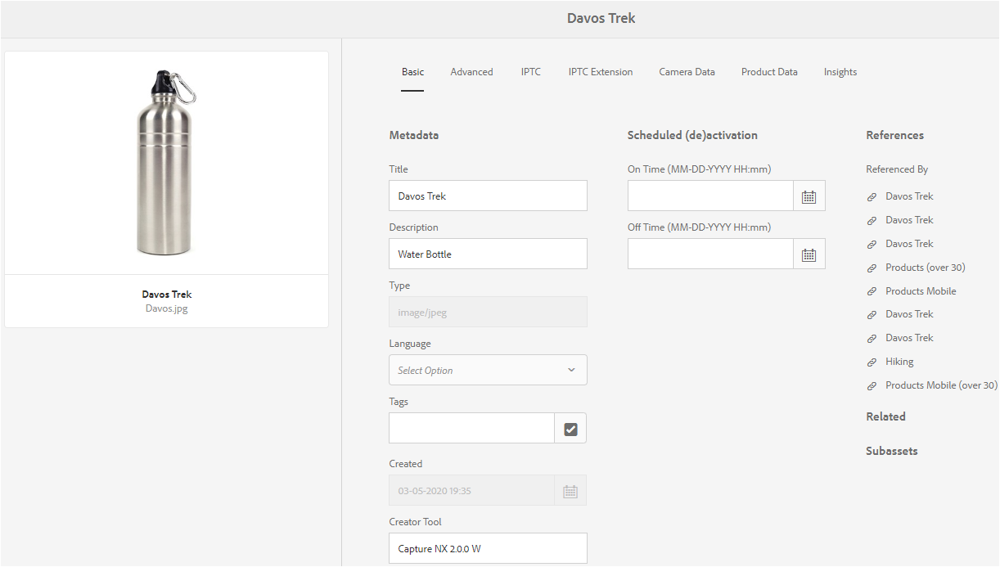
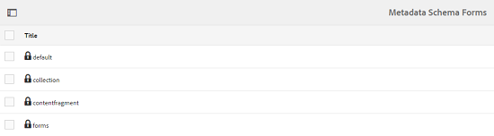

# Metadata-scheman {#metadata-schemas}

I Adobe Experience Manager Resurser (AEM) definieras layouten för egenskapssidan och de metadataegenskaper som visas för resurser som använder det aktuella schemat i ett metadataram. Metadataegenskaperna innehåller titel, beskrivning, MIME-typer, taggar och så vidare.

Du kan använda redigeraren Metadata Schema Forms om du vill ändra befintliga scheman eller lägga till anpassade metadatascheman.

1. Om du vill visa egenskapssidan för en resurs klickar eller trycker du på ikonen **[!UICONTROL Visa egenskaper]** från snabbåtgärder på resurspanelen i kortvyn.

   

   Du kan också markera resursen i användargränssnittet och sedan klicka på eller trycka på ikonen **[!UICONTROL Egenskaper]** i verktygsfältet.

   

1. Redigera olika metadataegenskaper under de olika flikarna. Du kan dock inte ändra resurstypen på egenskapssidan.

   

   Om du vill ändra MIME-typen för en resurs använder du ett anpassat metadatamatchschema eller ändrar ett befintligt formulär. Mer information finns i [Redigera metadata-schemaformulär](/help/assets/metadata-schemas.md#edit-metadata-schema-forms) . Om du ändrar metadataschemat för en viss MIME-typ ändras egenskapssidlayouten för resurser med den aktuella MIME-typen och alla resursundertyper. Om du till exempel ändrar ett jpeg-schema under `default/image` endast ändras metadatalayouten (resursegenskaper) för resurser med MIME-typ `image/jpeg`. Om du redigerar standardschemat ändrar du metadatalayouten för alla typer av resurser.

1. Om du vill visa en lista med formulär/mallar klickar du på AEM-logotypen och går sedan till **[!UICONTROL Verktyg]** > **[!UICONTROL Resurser]** > **[!UICONTROL Metadatascheman]**.

   

   AEM innehåller följande mallar:

   * **standard**: Basmetadataschemaformuläret för resurser.
   Följande underordnade formulär ärver egenskaperna för standardformuläret:
i. **bild**: Schemaformulär för resurser med MIME-typen &quot;image&quot;, till exempel `image/jpeg`, `image/png`osv.
&quot;Bildsformuläret har följande underordnade formulärmallar:a. **jpeg**: Schemaformulär för resurser med undertyp `jpeg`.
b. **tiff**: Schemaformulär för resurser med undertyp `tiff`.

   ii. **program**: Schemaformulär för resurser med MIME-typ, `application`till exempel `application/pdf`, `application/zip`och så vidare.
a. **pdf**: Schemaformulär för resurser med undertyp `pdf`.

   iii. **video**: Schemaformulär för resurser med MIME-typ `video`som `video/avi`, `video/mp4`osv.

   * **samling**: Schemaformulär för samlingar.
   * **** innehållfragment: Schemaformulär för innehållsfragment.
   * **formulär**: Det här schemaformuläret gäller [Adobe Experience Manager Forms](/help/forms/home.md).

>[!NOTE]
>
>Om du vill visa de underordnade formulären för ett schemaformulär klickar/trycker du på schemaformulärets namn.

## Lägg till ett metadatamatchformulär {#add-a-metadata-schema-form}

1. Om du vill lägga till en anpassad mall i listan klickar du på **[!UICONTROL Skapa]** i verktygsfältet.

   >[!NOTE]
   >
   >Oredigerade mallar har en låsikon framför sig. Om du anpassar någon av mallarna visas låsikonen innan mallen försvinner.

1. I dialogrutan anger du titeln på schemaformuläret och klickar sedan på **[!UICONTROL Skapa]** för att slutföra formulärskapandet.

   

## Redigera metadata-schemaformulär {#edit-metadata-schema-forms}

Du kan redigera ett nyligen tillagt eller befintligt metadatchemaformulär. Metadatchemaformuläret innehåller följande:

* Tabbar
* Formulärobjekt på flikar.

Du kan mappa/konfigurera dessa formulärobjekt till ett fält i en metadatanod i CRX-databasen.

Du kan lägga till nya flikar eller formulärobjekt i metadatchemaformuläret. Flikarna och formulärobjekten som härleds från det överordnade objektet är låsta. Du kan inte ändra dem på underordnad nivå.

1. Markera kryssrutan före ett formulär på sidan Schemaformulär och klicka sedan på ikonen Redigera i verktygsfältet.

   

1. Anpassa egenskapssidan för resursen genom att dra en eller flera komponenter från listan med komponenttyper på fliken **[!UICONTROL Skapa formulär]** till fliken **[!UICONTROL Grundläggande]** på sidan **[!UICONTROL Metadata Schema Editor]** .

   

1. Om du vill konfigurera en komponent markerar du den och ändrar dess egenskaper på fliken **Inställningar** .

### Komponenter på fliken Skapa formulär {#components-within-the-build-form-tab}

På fliken **[!UICONTROL Skapa formulär]** visas formulärobjekt som du använder i ditt schemaformulär. Fliken **[!UICONTROL Inställningar]** innehåller attributen för varje objekt som du väljer på fliken **[!UICONTROL Skapa formulär]** . I följande tabell visas de formulärobjekt som är tillgängliga på fliken **[!UICONTROL Skapa formulär]** :

| Komponentnamn | Beskrivning |
|---|---|
| [!UICONTROL Avsnittshuvud] | Lägg till en avsnittsrubrik för en lista med gemensamma komponenter. |
| [!UICONTROL Enkelradstext] | Lägg till en textegenskap för en rad. Den lagras som en sträng. |
| [!UICONTROL Flervärdestext] | Lägg till en textegenskap med flera värden. Den lagras som en strängarray. |
| [!UICONTROL Nummer] | Lägg till en sifferkomponent. |
| [!UICONTROL Date] | Lägg till en datumkomponent. |
| [!UICONTROL Listruta] | Lägg till en listruta. |
| [!UICONTROL Standardtaggar] | Lägg till en tagg. |
| [!UICONTROL Smarta taggar] | Förbättra sökfunktionerna genom att automatiskt lägga till metadatataggar. |
| [!UICONTROL Dolt fält] | Lägg till ett dolt fält. Den skickas som en POST-parameter när resursen sparas. |
| [!UICONTROL Resurs som refereras av] | Lägg till den här komponenten för att visa en lista över resurser som resursen refererar till. |
| [!UICONTROL Resursreferens] | Lägg till om du vill visa en lista med resurser som refererar till resursen. |
| [!UICONTROL Produktreferenser] | Lägg till om du vill visa listan över produkter som är länkade till resursen. |
| [!UICONTROL Tillgångsklassificering] | Lägg till för att visa alternativ för att klassificera resursen. |
| [!UICONTROL Sammanhangsberoende metadata] | Lägg till för att styra visningen av andra metadataflikar på egenskapssidan för resurser. |

#### Redigera metadatakomponenten {#edit-the-metadata-component}

Om du vill redigera egenskaperna för en metadatakomponent i formuläret klickar du på komponenten och redigerar alla eller en delmängd av följande egenskaper på fliken **[!UICONTROL Inställningar]** .

**Fältetikett**: Namnet på metadataegenskapen som visas på egenskapssidan för resursen.

**Mappa till egenskap**: This property specifies the relative path/name to the asset node where it is saved in the CRX database. Det börjar med `./` att ange att sökvägen finns under objektets nod.

Följande är giltiga värden för den här egenskapen:

Följande är giltiga värden för den här egenskapen:

* `./jcr:content/metadata/dc:title`: Lagrar värdet vid resursens metadatanod som egenskap `dc:title`.

* `./jcr:created`: Visar JCR-egenskapen vid objektets nod. Om du konfigurerar de här egenskaperna för att visa egenskaper rekommenderar vi att du markerar dem som Inaktivera redigering eftersom de är skyddade. I annat fall kunde inte [!UICONTROL resursen/resurserna ändra] resultaten när du sparade resursens egenskaper.

För att komponenten ska visas korrekt i metadataschemaformuläret bör egenskapssökvägen inte innehålla några blanksteg.

**Platshållare**: Använd den här egenskapen för att ange relevant platshållartext för metadataegenskapen.
**Obligatoriskt**: Använd den här egenskapen för att markera en metadataegenskap som obligatorisk på egenskapssidan.
**Inaktivera redigering**: Använd den här egenskapen för att göra en metadataegenskap icke-redigerbar på egenskapssidan.
**Visa tomt fält i skrivskyddat**: Markera den här egenskapen om du vill visa en metadataegenskap på egenskapssidan även om den inte har något värde. Om en metadataegenskap inte har något värde visas den inte som standard på egenskapssidan.
**Visa sorterad** lista: Använd den här egenskapen för att visa en ordnad lista med alternativ ****: Använd den här egenskapen för att ange alternativ i en lista **Beskrivning** : Använd den här egenskapen om du vill lägga till en kort beskrivning för metadatakomponenten.
**Klass**: Den objektklass som egenskapen är associerad med.
**Ta bort**: Klicka på den här ikonen om du vill ta bort en komponent från schemaformuläret.

>[!NOTE]
>
>Komponenten Dolt fält innehåller inte dessa attribut. I stället innehåller den egenskaper som till exempel attributnamn, värde, fältetikett och Beskrivning. Värdena för komponenten Dolt fält skickas som en POST-parameter när resursen sparas. Den sparas inte som metadata för resursen.

Om du väljer alternativet **[!UICONTROL Obligatorisk]** kan du söka efter resurser som saknar obligatoriska metadata. Expandera predikatet för **[!UICONTROL metadatavalidering]** på panelen **[!UICONTROL Filter]** och välj alternativet **[!UICONTROL Ogiltig]** . Sökresultaten visar resurser som saknar obligatoriska metadata som du har konfigurerat via schemaformuläret.

Om du lägger till komponenten Sammanhangsbaserade metadata på en flik i ett schemaformulär, visas komponenten som en lista på egenskapssidan med resurser som det aktuella schemat används på. Listan innehåller alla andra flikar förutom den flik som du tillämpade på komponenten Sammanhangsberoende metadata på. För närvarande innehåller den här funktionen grundläggande funktioner för att styra visningen av metadata baserat på sammanhanget.

Om du vill ta med en flik på egenskapssidan förutom fliken där komponenten Sammanhangsberoende metadata används, väljer du fliken i listan. Fliken läggs till på egenskapssidan.

### Ange egenskaper i JSON-filen {#specify-properties-in-json-file}

I stället för att ange egenskaper för alternativen på fliken **[!UICONTROL Inställningar]** kan du definiera alternativen i en JSON-fil genom att ange motsvarande nyckelvärdepar. Ange sökvägen till JSON-filen i fältet **[!UICONTROL JSON-sökväg]** .

#### Lägga till eller ta bort en flik i schemaformuläret {#adding-deleting-a-tab-in-the-schema-form}

Med schemaredigeraren kan du lägga till eller ta bort en flik. Standardschemaformuläret innehåller som standard flikarna **[!UICONTROL Grundläggande]**, **[!UICONTROL Avancerat]** , **[!UICONTROL IPTC]** och **[!UICONTROL IPTC-tillägg]** .

Klicka `+` för att lägga till en ny flik i ett schemaformulär. Som standard har den nya fliken namnet `Unnamed-1`. Du kan ändra namnet på fliken **[!UICONTROL Inställningar]** .

Klicka `X` för att ta bort en flik.

## Ta bort metadata-schemaformulär {#delete-metadata-schema-forms}

Med AEM kan du bara ta bort anpassade schemaformulär. Du kan inte ta bort standardschemaformulär/-mallar. Du kan dock ta bort anpassade ändringar i dessa formulär.

Om du vill ta bort ett formulär markerar du det och klickar på ikonen Ta bort.

<!-- -->
>[!NOTE]
>
>När du har tagit bort anpassade ändringar i ett standardformulär, visas låsikonen igen före den i gränssnittet för metadatamatchning för att ange att formuläret har återställts till standardläget.

>[!NOTE]
>
>Du kan inte ta bort metadatamatchschemaformulär i AEM Resurser.

## Schemaformulär för MIME-typer {#schema-forms-for-mime-types}

AEM Assets innehåller standardformulär för olika MIME-typer. Du kan dock lägga till anpassade formulär för resurser av olika MIME-typer.

### Lägg till nya formulär för MIME-typer {#add-new-forms-for-mime-types}

Skapa ett nytt formulär under lämplig formulärtyp. Om du till exempel vill lägga till en ny mall för undertypen **image/png** skapar du formuläret under bildformulären. Schemaformulärets rubrik är undertypsnamnet. I det här fallet är rubriken&quot;png.**&quot;**

#### Använd en befintlig schemamall för olika MIME-typer {#use-an-existing-schema-template-for-various-mime-types}

Du kan använda en befintlig mall för en annan MIME-typ. Använd till exempel `image/jpeg` formuläret för resurser av MIME-typ `image/png`.

I det här fallet skapar du en ny nod på `/etc/dam/metadataeditor/mimetypemappings` CRX-databasen. Ange ett namn för noden och definiera följande egenskaper:

| Namn | Beskrivning | Typ | Värde |
|---|---|---|---|
| `exposedmimetype` | Namnet på det befintliga formulär som ska mappas | `String` | `image/jpeg` |
| `mimetypes` | Lista över MIME-typer som använder formuläret som definierats i `exposedmimetype` attributet | `String` | `image/png` |

AEM Assets mappar följande MIME-typer och schemaformulär:

| Schemaformulär | MIME-typer |
|---|---|
| image/jpeg | image/pjpeg |
| bild/tiff | image/x-tiff |
| application/pdf | application/postscript |
| application/x-ImageSet | Multipart/Related. type=application/x-ImageSet |
| application/x-SpinSet | Multipart/Related. type=application/x-SpinSet |
| application/x-MixedMediaSet | Multipart/Related. type=application/x-MixedMediaSet |
| video/quicktime | video/x-quicktime |
| video/mpeg4 | video/mp4 |
| video/avi | video/avi, video/msvideo, video/x-msvideo |
| video/wmv | video/x-ms-wmv |
| video/flv | video/x-flv |

## Bevilja åtkomst till metadatamappningar {#grant-access-to-metadata-schemas}

Funktionen Metadata Schema är bara tillgänglig för administratörer. Administratörer kan dock ge åtkomst till icke-administratörer genom att ändra vissa behörigheter. Den som inte är administratör bör ha behörighet att skapa, ändra och ta bort i `/conf` mappen.

## Använd mappspecifika metadata {#apply-folder-specific-metadata}

Med AEM Resurser kan du definiera en variant av ett metadatamatchema och tillämpa det på en viss mapp.

Du kan t.ex. definiera en variant av standardmetadataschemat och använda det på en mapp. När du använder det ändrade schemat åsidosätter det det ursprungliga standardmetadatarammet som används för resurser i mappen.

Endast resurser som överförts till den mapp som det här schemat tillämpas på kommer att överensstämma med de ändrade metadata som definierats i variantmetadataschemat.

Resurser i andra mappar där det ursprungliga schemat används fortsätter att överensstämma med metadata som definierats i det ursprungliga schemat.

Metadataarv av resurser baseras på det schema som tillämpas på mappen på första nivån i hierarkin. Om en mapp inte innehåller undermappar ärver resurserna i mappen metadata från det schema som används i mappen.

Om mappen har en undermapp ärver resurserna i undermappen metadata från det schema som används på undermappsnivå om ett annat schema används på undermappsnivå. Om inget schema eller samma schema används på undermappsnivå ärver undermappsresurserna metadata från det schema som används på den överordnade mappnivån.

1. Klicka på AEM-logotypen och navigera sedan till **[!UICONTROL Verktyg]** > **[!UICONTROL Resurser]** > **[!UICONTROL Metadata Schemas]**. Sidan **[!UICONTROL Metadata Schema Forms]** visas.
1. Markera kryssrutan före ett formulär, till exempel standardformuläret för metadata, och klicka eller tryck på kopieringsikonen och spara det som ett anpassat formulär. Ange ett eget namn för formuläret, till exempel `my_default`. Du kan också skapa ett eget formulär.
   

1. Markera **[!UICONTROL formuläret på sidan]** Metadata Schema Forms `my_default` och klicka sedan på **[!UICONTROL Redigera]** .

   

1. Lägg till ett textfält i schemaformuläret på sidan **[!UICONTROL Metadata Schema Editor]** . Lägg till exempel till ett fält med etiketten **[!UICONTROL Kategori]**.

   

1. Click **[!UICONTROL Save]**. Det ändrade formuläret visas på sidan **[!UICONTROL Metadata Schema Forms]** .
1. Klicka/tryck på **[!UICONTROL Använd för mapp(ar)]** i verktygsfältet för att använda anpassade metadata för en mapp.

   

1. Välj den mapp som det ändrade schemat ska tillämpas på och klicka/tryck sedan på **[!UICONTROL Använd]**.

   

1. Om det andra metadataschemat används i mappen visas ett varningsmeddelande om att du håller på att skriva över det befintliga metadataschemat. Klicka på **Skriv över**.
1. Klicka på **OK** för att stänga meddelandet.
1. Navigera till mappen som du tillämpade det ändrade metadataschemat på.

## Definiera obligatoriska metadata {#define-mandatory-metadata}

Du kan definiera obligatoriska fält på mappnivå, vilket tillämpas på resurser som överförs till mappen. Om du överför resurser som saknar metadata för de obligatoriska fält som definierats tidigare visas en visuell indikation på saknade metadata för resurserna i kortvyn.

>[!NOTE]
>
>Ett metadatafält kan definieras som obligatoriskt baserat på värdet i ett annat fält. I vyn Kort visar AEM inte varningsmeddelandet om att metadata saknas för sådana obligatoriska metadatafält.

1. Klicka på AEM-logotypen och navigera sedan till **[!UICONTROL Verktyg]** > **[!UICONTROL Resurser]** > **[!UICONTROL Metadata Schemas]**. Sidan **[!UICONTROL Metadata Schema Forms]** visas.
1. Spara standardformuläret för metadata som ett anpassat formulär. Du kan till exempel spara den som `my_default`.

   

1. Redigera det anpassade formuläret. Lägg till ett obligatoriskt fält. Lägg till exempel till ett **[!UICONTROL kategorifält]** och gör fältet obligatoriskt.

   

1. Click **[!UICONTROL Save]**. Det ändrade formuläret visas på sidan **[!UICONTROL Metadata Schema Forms]** . Markera formuläret och klicka eller tryck sedan på **[!UICONTROL Använd i mapp(ar)]** i verktygsfältet för att använda anpassade metadata i en mapp.

   

1. Navigera till mappen och överför vissa resurser med saknade metadata för det obligatoriska fältet som du lade till i det anpassade formuläret. Ett meddelande om saknade metadata för det obligatoriska fältet visas i kortvyn för resursen.

   

1. (Valfritt) Åtkomst `https://[server]:[port]/system/console/components/`. Konfigurera och aktivera `com.day.cq.dam.core.impl.MissingMetadataNotificationJob` komponenter som är inaktiverade som standard. Ange en frekvens som AEM ska kontrollera om metadata för resurserna är giltiga.

   Den här konfigurationen lägger till en egenskap `hasValidMetadata` till `jcr:content` resurser. Med den här egenskapen kan AEM filtrera resultatet i en sökning.

   >[!NOTE]
   >
   >Om en resurs läggs till efter den schemalagda kontrollen flaggas inte resursen med `hasValidMetadata` förrän vid nästa schemalagda kontroll. Resurserna visas inte i mellanliggande sökresultat.

   >[!CAUTION]
   >
   >Valideringskontrollerna av metadata är resurskrävande och kan påverka systemets prestanda. Schemalägg kontrollerna därefter. Om servern inte kan hantera inläsningen provar du med att inaktivera det här jobbet.
