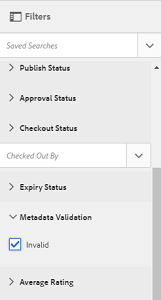

# Metadata schemas {#metadata-schemas}

Organisationer har en metadatamodell som förbättrar tillgångsidentifiering, användning, interoperabilitet och så vidare. Korrekt metadataanvändning är till stor hjälp för att underhålla metadatadrivna arbetsflöden och processer. Om du vill följa en metadatastrategi och standarder för hela organisationen kan du använda metadatamodeller som hjälper DAM-användare att anpassa sig. [!DNL Adobe Experience Manager] Med kan du enkelt och flexibelt skapa, underhålla och använda metadatamatchningar.

I [!DNL Adobe Experience Manager Assets]innehåller scheman specifika fält för specifik information som ska fyllas i. Den innehåller även layoutinformation för att visa metadatafält på ett användarvänligt sätt. Metadataegenskaperna innehåller titel, beskrivning, MIME-typer, taggar med mera. Du kan använda redigeraren för att ändra befintliga scheman eller lägga till anpassade metadatamatcheman [!UICONTROL Metadata Schema Forms] .

Så här visar och redigerar du egenskapssidan för en resurs:

1. Klicka på **[!UICONTROL View Properties]** alternativet i snabbåtgärderna på resurspanelen i kortvyn. Du kan också markera en resurs och sedan klicka på **[!UICONTROL Properties]** Visa  i verktygsfältet.

1. Du kan redigera de olika redigerbara metadataegenskaperna under de tillgängliga flikarna. Du kan dock inte ändra resursen [!UICONTROL Type] på egenskapsfliken [!UICONTROL Basic] .

   

*Bild: Fliken Grundläggande för resurs[!UICONTROL Properties].*

Om du vill ändra MIME-typen för en resurs använder du ett anpassat metadatamatchschema eller ändrar ett befintligt formulär. Mer information finns i [Redigera metadataschema-Forms](/help/assets/metadata-schemas.md#edit-metadata-schema-forms) . Om du ändrar metadatamatchemat för en MIME-typ ändras egenskapens sidlayout för resurserna och alla undertyper. Om du till exempel ändrar ett jpeg-schema under `default/image` endast ändras metadatalayouten (resursegenskaper) för resurser med MIME-typ `image/jpeg`. Om du redigerar standardschemat ändrar du metadatalayouten för alla typer av resurser.

## Metadata Schema-formulär {#default-metadata-schema-forms}

Om du vill visa en lista med formulär eller mallar går du till [!DNL Experience Manager] > **[!UICONTROL Tools]** > **[!UICONTROL Assets]** i **[!UICONTROL Metadata Schemas]** gränssnittet.

[!DNL Experience Manager] innehåller följande formulärmallar för metadatamatchning.

| Mallar |  | Beskrivning |
|---|---|---|
| [!UICONTROL default] |  | Basmetadataschemaformuläret för resurser. |
|  | Följande underordnade formulär ärver egenskaperna för [!UICONTROL default] formuläret: |  |
|  | <ul><li>[!UICONTROL dm_video]</li></ul> | Schemaformulär för Dynamic Media-videor. |
|  | <ul><li>[!UICONTROL image]</li></ul> | Schemaformulär för bilder med MIME-typen som `image/jpeg` och `image/png`.   Formuläret har [!UICONTROL image] följande underordnade formulärmallar: <ul><li> [!UICONTROL jpeg]: Schemaformulär för resurser med undertyp [!UICONTROL jpeg].</li> <li>[!UICONTROL tiff]: Schemaformulär för resurserna med undertypen TIFF.</li></ul> |
|  | <ul><li>[!UICONTROL application]</li></ul> | Schemaformulär för resurser med MIME-typ som `application/pdf` och `application/zip`.  [!UICONTROL pdf]: Schemaformulär för resurser med undertyp PDF. |
|  | <ul><li>[!UICONTROL video]</li></ul> | Schemaformulär för videomaterial med MIME-typ som `video/avi` och `video/mp4`. |
| [!UICONTROL collection] |  | Schemaformulär för samlingar. |
| [!UICONTROL contentfragment] |  | [Schemaformulär för innehållsfragment](/help/sites-developing/customizing-content-fragments.md). |
| [!UICONTROL forms] |  | Det här schemaformuläret gäller [Adobe Experience Manager Forms](/help/forms/home.md). |
| [!UICONTROL ugc_contentfragment] |  | Schemaformulär för användargenererade innehållskomponenter och resurser som är integrerade i Experience Manager från sociala medier. |

>[!NOTE]
>
>Om du vill visa de underordnade formulären för ett schemaformulär klickar du på schemaformulärets namn.

## Lägg till ett metadatamatchformulär {#add-a-metadata-schema-form}

Följ de här stegen för att lägga till ett metadataschemaformulär:

1. Om du vill lägga till en anpassad mall i listan klickar du på **[!UICONTROL Create]** i verktygsfältet.

   >[!NOTE]
   >
   >En låssymbol visas med de oredigerade mallarna. Om du anpassar en mall är den inte låst .

1. Ange schemaformulärets rubrik i dialogrutan och klicka **[!UICONTROL Create]** för att slutföra formulärskapandet.

## Redigera metadata-schemaformulär {#edit-metadata-schema-forms}

Du kan redigera ett nyligen tillagt eller befintligt metadatchemaformulär. Metadatchemaformuläret innehåller flikar och formulärobjekt på flikar. Du kan mappa/konfigurera dessa formulärobjekt till ett fält i en metadatanod i CRX-databasen. Du kan lägga till flikar eller formulärobjekt i metadatchemaformuläret. Flikarna och formulärobjekten som härleds från det överordnade objektet är låsta. Du kan inte ändra dem på underordnad nivå.

1. Markera ett formulär på [!UICONTROL Metadata Schema Forms] sidan och klicka **[!UICONTROL Edit]** i verktygsfältet.

1. Anpassa metadataformuläret på **[!UICONTROL Metadata Schema Form Editor]** sidan. Dra de nödvändiga komponenterna från **[!UICONTROL Build Form]** fliken till en av flikarna.

   

   *Bild: En[!UICONTROL Metadata Schema Form Editor]sida med tillgängliga flikar.*

1. Om du vill konfigurera en komponent markerar du den och ändrar dess egenskaper på **[!UICONTROL Settings]** fliken.

### Komponenter på [!UICONTROL Build Form] fliken {#components-within-the-build-form-tab}

På **[!UICONTROL Build Form]** fliken visas formulärobjekt som du använder i schemaformuläret. På fliken **[!UICONTROL Settings]** finns attributen för varje objekt som du markerar på **[!UICONTROL Build Form]** fliken. I följande tabell visas de formulärobjekt som är tillgängliga på **[!UICONTROL Build Form]** fliken:

| Komponentnamn | Beskrivning |
| -------------------------------- | ----------------------------------------------------------------------------------- |
| [!UICONTROL Section Header] | Lägg till en avsnittsrubrik för en lista med gemensamma komponenter. |
| [!UICONTROL Single Line Text] | Lägg till en textegenskap för en rad. Den lagras som en sträng. |
| [!UICONTROL Multi Value Text] | Lägg till en textegenskap med flera värden. Den lagras som en strängarray. |
| [!UICONTROL Number] | Lägg till en sifferkomponent. |
| [!UICONTROL Date] | Lägg till en datumkomponent. |
| [!UICONTROL Dropdown] | Lägg till en nedrullningsbar lista. |
| [!UICONTROL Standard Tags] | Lägg till en tagg. |
| [!UICONTROL Smart Tags] | Förbättra sökfunktionerna genom att automatiskt lägga till metadatataggar. |
| [!UICONTROL Hidden Field] | Lägg till ett dolt fält. Den skickas som en POST-parameter när resursen sparas. |
| [!UICONTROL Asset Referenced By] | Lägg till den här komponenten för att visa en lista över resurser som resursen refererar till. |
| [!UICONTROL Asset Referencing] | Lägg till om du vill visa en lista med resurser som refererar till resursen. |
| [!UICONTROL Products References] | Lägg till om du vill visa listan över produkter som är länkade till resursen. |
| [!UICONTROL Asset Rating] | Lägg till för att visa alternativ för att klassificera resursen. |
| [!UICONTROL Contextual Metadata] | Lägg till för att styra visningen av andra metadataflikar på egenskapssidan för resurser. |

#### Redigera metadatakomponenten {#edit-the-metadata-component}

Om du vill redigera egenskaperna för en metadatakomponent i formuläret klickar du på komponenten för att redigera alla eller en delmängd av följande egenskaper på **[!UICONTROL Settings]** fliken.

**Fältetikett**: Namnet på metadataegenskapen som visas på egenskapssidan för resursen.

**Mappa till egenskap**: This property specifies the relative path to or name of the asset node where it is saved in the CRX database. Den börjar med `./` att ange att sökvägen finns under resursens nod.

Följande är giltiga värden för den här egenskapen:

* `./jcr:content/metadata/dc:title`: Lagrar värdet vid resursens metadatanod som egenskapen `dc:title`.

* `./jcr:created`: Lagrar datum och tid för när en resurs skapades. Det är en skyddad egenskap. Om du konfigurerar dessa egenskaper bör du markera dem som Inaktivera redigering i Adobe.

För att komponenten ska visas korrekt i metadataschemaformuläret bör egenskapssökvägen inte innehålla några blanksteg.

* **Platshållare**: Använd den här egenskapen för att ange relevant platshållartext för metadataegenskapen.
* **Obligatoriskt**: Använd den här egenskapen för att markera en metadataegenskap som obligatorisk på egenskapssidan.
* **Inaktivera redigering**: Använd den här egenskapen om du inte vill tillåta ändringar i en egenskap på egenskapssidan.
* **Visa tomt fält i skrivskyddat**: Markera den här egenskapen om du vill visa en metadataegenskap på egenskapssidan även om den inte har något värde. Om en metadataegenskap inte har något värde visas den inte som standard på egenskapssidan.
* **Visa sorterad** lista: Använd den här egenskapen om du vill visa en ordnad lista med alternativ.
* **Alternativ**: Använd den här egenskapen för att ange alternativ i en lista.
* **Beskrivning** : Använd den här egenskapen om du vill lägga till en kort beskrivning för metadatakomponenten.
* **Klass**: Den objektklass som egenskapen är associerad med.
* **Ta bort**: Klicka [!UICONTROL Delete] för att ta bort en komponent från schemaformuläret.

>[!NOTE]
>
>Komponenten [!UICONTROL Hidden Field] innehåller inte dessa attribut. I stället innehåller den egenskaper som till exempel attributnamn, värde, fältetikett och Beskrivning. Värdena för komponenten Dolt fält skickas som en POST-parameter när resursen sparas. Den sparas inte som metadata för resursen.

Om du väljer alternativet **[!UICONTROL Required]** kan du söka efter resurser som saknar obligatoriska metadata. På panelen **[!UICONTROL Filters]** expanderar du predikatet **[!UICONTROL Metadata Validation]** och väljer alternativet **[!UICONTROL Invalid]**. Sökresultatet visar resurser som saknar obligatoriska metadata som du har konfigurerat via schemaformuläret.

Om du lägger till komponenten Sammanhangsbaserade metadata på en flik i ett schemaformulär, visas komponenten som en lista på egenskapssidan med resurser som det aktuella schemat används på. Listan innehåller alla andra flikar förutom den flik som du tillämpade på komponenten Sammanhangsberoende metadata på. För närvarande innehåller den här funktionen grundläggande funktioner för att styra visningen av metadata baserat på sammanhanget.

Om du vill visa en flik på egenskapssidan förutom fliken där komponenten Sammanhangsberoende metadata används, väljer du fliken i listan. Fliken läggs till på egenskapssidan.

*Bild: Sammanhangsbaserade metadata på egenskapssidan för resurser.*

### Ange egenskaper i JSON-filen {#specify-properties-in-json-file}

I stället för att ange egenskaper för alternativen på fliken **[!UICONTROL Settings]** kan du definiera alternativen i en JSON-fil genom att ange motsvarande nyckelvärdespar. Ange sökvägen till JSON-filen i fältet **[!UICONTROL JSON Path]**.

#### Lägga till eller ta bort en flik i schemaformuläret {#adding-deleting-a-tab-in-the-schema-form}

Med schemaredigeraren kan du lägga till eller ta bort en flik. The default schema form includes the **[!UICONTROL Basic]**, **[!UICONTROL Advanced]** , **[!UICONTROL IPTC]**, and **[!UICONTROL IPTC Extension]** tabs.

Klicka `+` för att lägga till en flik i ett schemaformulär. Som standard har den nya fliken namnet `Unnamed-1`. Du kan ändra namnet på **[!UICONTROL Settings]** fliken. Klicka `X` för att ta bort en flik.

## Överlappande metadata {#cascading-metadata}

När användare hämtar metadatainformation för en resurs anger de information som finns i de olika tillgängliga fälten. Du kan visa specifika metadatafält eller fältvärden som är beroende av vilka alternativ som är markerade i de andra fälten. En sådan villkorlig visning av metadata kallas överlappande metadata. Du kan med andra ord skapa ett beroende mellan ett visst metadatafält/värde och ett eller flera fält och/eller deras värden.

Använd metadatamodeller för att definiera regler för visning av överlappande metadata. Om ditt metadataram t.ex. innehåller ett fält av resurstyp kan du definiera en relevant uppsättning fält som ska visas baserat på vilken typ av resurs som användaren väljer.

>[!CAUTION]
>
>Överlappande metadata stöds inte för innehållsfragment.

Här följer några exempel där du kan definiera överlappande metadata:

* Där användarplats krävs, visa relevanta stadsnamn baserat på användarens val av land och delstat.
* Läs in relevanta varumärkesnamn i en lista baserat på användarens val av produktkategori.
* Växla synlighet för ett visst fält baserat på värdet som anges i ett annat fält. Visa t.ex. separata leveransadressfält om användaren vill att leveransen ska ske till en annan adress.
* Ange ett fält som obligatoriskt baserat på det värde som anges i ett annat fält.
* Ändra alternativen som visas för ett visst fält baserat på värdet som anges i ett annat fält.
* Ange standardvärdet för metadata i ett visst fält baserat på det värde som anges i ett annat fält.

### Konfigurera metadata i [!DNL Experience Manager] {#configure-cascading-metadata-in-aem}

Tänk dig ett scenario där du vill visa överlappande metadata baserat på den typ av resurs som är markerad. Några exempel

* För en video visar du tillämpliga fält som format, kodek, längd och så vidare.
* För Word- eller PDF-dokument visas fält, t.ex. sidantal, författare osv.

Oavsett vilken resurstyp du väljer visas copyrightinformationen som ett obligatoriskt fält.

1. In [!DNL Experience Manager] interface, go to **[!UICONTROL Tools]** > **[!UICONTROL Assets]** > **[!UICONTROL Metadata Schemas]**.
1. In the **[!UICONTROL Schema Forms]** page, select a schema form and then click **[!UICONTROL Edit]** from the toolbar to edit the schema.

   

1. (Valfritt) Skapa ett nytt fält som ska villkoraliseras i metadataramedigeraren. Ange ett namn och en egenskapssökväg på **[!UICONTROL Settings]** fliken.

   Om du vill skapa en ny flik klickar du på `+` för att lägga till en flik och lägger sedan till ett metadatafält.

   

1. Lägg till ett listrutefält för resurstypen. Ange ett namn och en egenskapssökväg på **[!UICONTROL Settings]** fliken. Lägg till en valfri beskrivning.

   

1. Nyckelvärdepar är de alternativ som ges till en formuläranvändare. Du kan ange nyckelvärdepar antingen manuellt eller från en JSON-fil.

   * Om du vill ange värdena manuellt markerar du **[!UICONTROL Add Manually]** och klickar på **[!UICONTROL Add Choice]** alternativet och anger text och värde. Ange till exempel resurstyperna Video, PDF, Word och Bild.

   * Om du vill hämta värden från en JSON-fil dynamiskt markerar du **[!UICONTROL Add Through JSON Path]** och anger sökvägen till JSON-filen. [!DNL Experience Manager] hämtar nyckelvärdepar i realtid när formuläret presenteras för användaren.

   Båda alternativen utesluter varandra. Du kan inte importera alternativen från en JSON-fil och redigera manuellt.

   

   >[!NOTE]
   >
   >När du lägger till en JSON-fil visas inte nyckelvärdepar i metadataschredigeraren, men de är tillgängliga i det publicerade formuläret.

   >[!NOTE]
   >
   >När du lägger till alternativ och klickar på listrutefältet förvrängs gränssnittet och alternativet för borttagning av alternativen slutar att fungera. Klicka inte på listrutan förrän du har sparat ändringarna. Om du råkar ut för det här problemet sparar du schemat och öppnar det igen för att fortsätta redigera.

1. (Valfritt) Lägg till de andra obligatoriska fälten. Exempel: format, kodek och längd för resurstypen video.

   Lägg på samma sätt till beroende fält för andra resurstyper. Du kan till exempel lägga till fältantal och författare för dokumentresurser som PDF- och Word-filer.

   

1. Om du vill skapa ett beroende mellan fältet för resurstyp och andra fält väljer du det beroende fältet och öppnar **[!UICONTROL Rules]** fliken.

   

1. Under **[!UICONTROL Requirement]** väljer du alternativet **[!UICONTROL Required, based on new rule]**.
1. Click **[!UICONTROL Add Rule]** and choose the **[!UICONTROL Asset Type]** field to create a dependency. Välj också det fältvärde som beroendet ska skapas utifrån. I det här fallet väljer du **[!UICONTROL Video]**. Click **[!UICONTROL Done]** to save the changes.

   

   >[!NOTE]
   >
   >Listruta med manuellt fördefinierade värden kan användas med regler. Listrutor med konfigurerad JSON-sökväg kan inte användas med regler som använder fördefinierade värden för att tillämpa villkor. Om värdena läses in från JSON vid körning går det inte att använda en fördefinierad regel.

1. Under **[!UICONTROL Visibility]** väljer du alternativet **[!UICONTROL Visible, based on new rule]**.

1. Click **[!UICONTROL Add Rule]** and choose the **[!UICONTROL Asset Type]** field to create a dependency. Välj också det fältvärde som beroendet ska skapas utifrån. I det här fallet väljer du **[!UICONTROL Video]**. Click **[!UICONTROL Done]** to save the changes.

   

   >[!NOTE]
   >
   >Om du klickar på ett tomt utrymme (eller någon annan plats än värdena) återställs värdena. Om det händer markerar du värdena igen.

   >[!NOTE]
   >
   >Du kan använda villkoren **[!UICONTROL Requirement]** och **[!UICONTROL Visibility]** oberoende av varandra.

1. Du kan också skapa ett beroende mellan värdet Video i fältet Resurstyp och andra fält, till exempel Kodek och Varaktighet.
1. Upprepa stegen för att skapa beroende mellan dokumentresurser (PDF och Word) i [!UICONTROL Asset Type] fältet och fält som [!UICONTROL Page Count] och [!UICONTROL Author].
1. Klicka på **[!UICONTROL Save]**. Använd metadatamatchemat på en mapp.

1. Navigera till mappen som du tillämpade metadatamodeller på och öppna egenskapssidan för en resurs. Beroende på vad du väljer i fältet Resurstyp visas relevanta överlappande metadatafält.

   

   *Bild: Överlappande metadata för en video.*

   

   *Bild: Överlappande metadata för ett dokument.*

## Ta bort metadata-schemaformulär {#delete-metadata-schema-forms}

[!DNL Experience Manager] I kan du bara ta bort anpassade schemaformulär. Du kan inte ta bort standardschemaformulär/-mallar. Du kan dock ta bort anpassade ändringar i dessa formulär.

Om du vill ta bort ett formulär markerar du det och klickar på Ta bort.

>[!NOTE]
>
>* När du har tagit bort anpassade ändringar i ett standardformulär visas det låsta  igen före formuläret. Det anger att formuläret återställs till standardläget.
>* Du kan inte ta bort standardmetadatamatchformulären i [!DNL Assets].

## Schemaformulär för MIME-typer {#schema-forms-for-mime-types}

[!DNL Experience Manager] innehåller standardformulär för olika MIME-typer. Du kan dock lägga till anpassade formulär för resurser av olika MIME-typer.

### Lägg till nya formulär för MIME-typer {#add-new-forms-for-mime-types}

Skapa ett formulär under lämplig formulärtyp. For example, to add a template for the `image/png` subtype, create the form under the &quot;image&quot; forms. Schemaformulärets titel är undertypsnamnet. In this case, the title is `png`.

#### Använd en befintlig schemamall för olika MIME-typer {#use-an-existing-schema-template-for-various-mime-types}

Du kan använda en befintlig mall för en annan MIME-typ. Använd till exempel `image/jpeg` formuläret för resurser av MIME-typ `image/png`.

I det här fallet skapar du en nod på `/etc/dam/metadataeditor/mimetypemappings` i CRX-databasen. Ange ett namn för noden och definiera följande egenskaper:

| Namn | Beskrivning | Typ | Värde |
|------|-------------|------|-------|
| `exposedmimetype` | Namnet på det befintliga formulär som ska mappas | `String` | `image/jpeg` |
| `mimetypes` | Lista över MIME-typer som använder formuläret som definierats i `exposedmimetype` attributet | `String` | `image/png` |

[!DNL Assets] mappar följande MIME-typer och schemaformulär:

| Schemaformulär | MIME-typer |
| --------------------------- | --------------------------------------------------- |
| image/jpeg | image/pjpeg |
| bild/tiff | image/x-tiff |
| application/pdf | application/postscript |
| application/x-ImageSet | Multipart/Related. type=application/x-ImageSet |
| application/x-SpinSet | Multipart/Related. type=application/x-SpinSet |
| application/x-MixedMediaSet | Multipart/Related. type=application/x-MixedMediaSet |
| video/quicktime | video/x-quicktime |
| video/mpeg4 | video/mp4 |
| video/avi | video/avi, video/msvideo, video/x-msvideo |
| video/wmv | video/x-ms-wmv |
| video/flv | video/x-flv |

## Bevilja åtkomst till metadatamappningar {#grant-access-to-metadata-schemas}

Funktionen Metadata Schema är bara tillgänglig för administratörer. Administratörer kan dock ge åtkomst till icke-administratörer genom att ändra vissa behörigheter. Ange att användare som inte är administratörer ska skapa, ändra och ta bort behörigheter för `/conf` mappen.

## Använd mappspecifika metadata {#apply-folder-specific-metadata}

[!DNL Assets] Med kan du definiera en variant av ett metadatamatchema och tillämpa det på en viss mapp.

Du kan t.ex. definiera en variant av standardmetadataschemat och använda det på en mapp. När du använder det ändrade schemat åsidosätter det det ursprungliga standardmetadatarammet som används för resurser i mappen.

Endast resurser som har överförts till den mapp som det här schemat används på följer de ändrade metadata som har definierats i variantmetadataschemat. [!DNL Assets] i andra mappar där det ursprungliga schemat används fortsätter att överensstämma med de metadata som definierats i det ursprungliga schemat.

Metadataarv av resurser baseras på det schema som tillämpas på mappen på första nivån i hierarkin. Om en mapp inte innehåller undermappar ärver resurserna i mappen metadata från det schema som används i mappen.

Du kan använda ett annat schema på undermappen. Resurserna i en undermapp ärver metadatamatchemat för den omedelbara undermappen. Om inget schema eller samma schema används på undermappsnivå ärver dess resurser schemat från den överordnade mappen.

1. Navigera [!DNL Experience Manager] till **[!UICONTROL Tools]** > **[!UICONTROL Assets]** > **[!UICONTROL Metadata Schemas]**. Sidan **[!UICONTROL Metadata Schema Forms]** visas.
1. Markera kryssrutan före ett formulär, till exempel standardformuläret för metadata, och klicka på **[!UICONTROL Copy]** och spara det som ett anpassat formulär. Ange ett eget namn för formuläret, till exempel `my_default`. Du kan också skapa ett eget formulär.

1. Markera **[!UICONTROL Metadata Schema Forms]** formuläret på `my_default` sidan och klicka sedan på **[!UICONTROL Edit]**.

1. Lägg till ett textfält i schemaformuläret på **[!UICONTROL Metadata Schema Editor]** sidan. Lägg till exempel till ett fält med etiketten **[!UICONTROL Category]**.

   

   *Bild: Textfält har lagts till i formulärredigeraren för metadata.*

1. Klicka på **[!UICONTROL Save]**. Det ändrade formuläret visas på **[!UICONTROL Metadata Schema Forms]** sidan.
1. Klicka **[!UICONTROL Apply to Folder(s)]** i verktygsfältet för att använda anpassade metadata i en mapp.

1. Markera mappen som det ändrade schemat ska tillämpas på och klicka sedan på **[!UICONTROL Apply]**.

   

1. Om det andra metadataschemat används i mappen visas ett varningsmeddelande om att du håller på att skriva över det befintliga metadataschemat. Klicka på **Skriv över**.
1. Klicka på **OK** för att stänga meddelandet.
1. Navigera till mappen som du tillämpade det ändrade metadataschemat på.

## Definiera obligatoriska metadata {#define-mandatory-metadata}

Du kan definiera obligatoriska fält på mappnivå, vilket tillämpas på resurser som överförs till mappen. Om du överför resurser som saknar metadata för de obligatoriska fält som definierats tidigare visas en visuell indikation på saknade metadata för resurserna i kortvyn.

>[!NOTE]
>
>Ett metadatafält kan definieras som obligatoriskt baserat på värdet i ett annat fält. I kortvyn visas [!DNL Experience Manager] inte varningsmeddelandet om saknade metadata för sådana obligatoriska metadatafält.

1. Navigera [!DNL Experience Manager] till **[!UICONTROL Tools]** > **[!UICONTROL Assets]** > **[!UICONTROL Metadata Schemas]**. Sidan **[!UICONTROL Metadata Schema Forms]** visas.
1. Spara standardformuläret för metadata som ett anpassat formulär. Du kan till exempel spara den som `my_default`.

1. Redigera det anpassade formuläret. Lägg till ett obligatoriskt fält. Lägg till exempel till ett **[!UICONTROL Category]** fält och gör fältet obligatoriskt.

   

   *Bild: Obligatoriskt fält i formulärredigeraren för metadata.*

1. Klicka på **[!UICONTROL Save]**. Det ändrade formuläret visas på **[!UICONTROL Metadata Schema Forms]** sidan. Markera formuläret och klicka sedan på **[!UICONTROL Apply to Folder(s)]** i verktygsfältet för att använda anpassade metadata i en mapp.

1. Navigera till mappen och överför vissa resurser med saknade metadata för det obligatoriska fältet som du lade till i det anpassade formuläret. Ett meddelande om saknade metadata för det obligatoriska fältet visas i resursens kortvy.

   

1. (Valfritt) Åtkomst `https://[aem_server]:[port]/system/console/components/`. Konfigurera och aktivera `com.day.cq.dam.core.impl.MissingMetadataNotificationJob` komponenter som är inaktiverade som standard. Ange en frekvens som ska användas för att [!DNL Experience Manager] kontrollera om metadata för resurserna är giltiga. Den här konfigurationen lägger till en egenskap `hasValidMetadata` till `jcr:content` resurser. [!DNL Experience Manager] använder den här egenskapen för att filtrera ogiltiga resurser i ett sökresultat. Om du lägger till en resurs efter en kontroll flaggas resursen inte med `hasValidMetadata` förrän vid nästa schemalagda kontroll. Resurserna visas därför inte i sökfiltren för ogiltiga metadata förrän efter nästa schemalagda kontroll.

   >[!CAUTION]
   >
   >Valideringskontrollerna av metadata är resurskrävande och kan påverka systemets prestanda. Schemalägg kontrollerna därefter. Om servern inte kan hantera inläsningen provar du med att inaktivera det här jobbet.

<!-- TBD: Add this method to find invalid metadata in the metadata.md article later when it is published as a top-level metadata article.
-->
