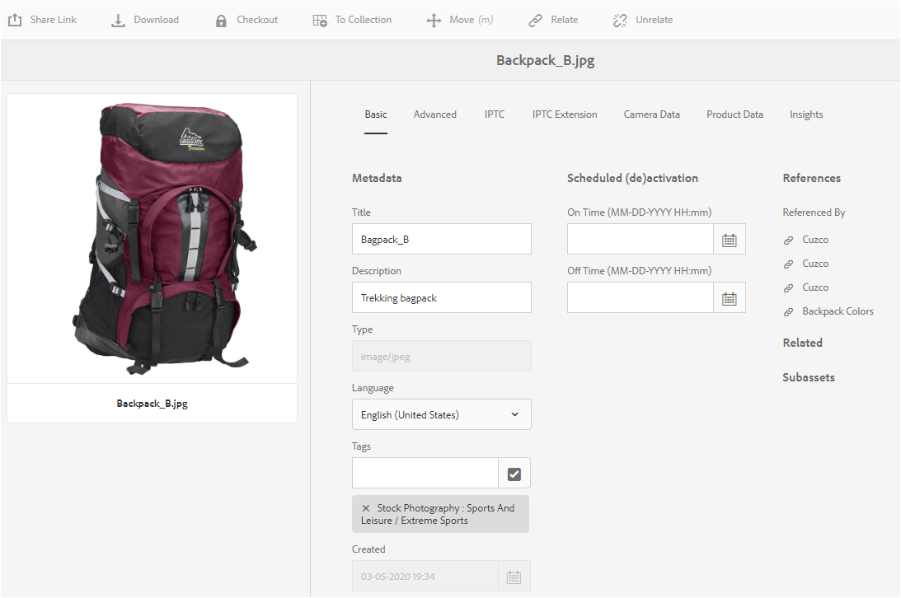

# Hantera metadata för dina digitala resurser {#managing-metadata-for-digital-assets}

<!-- Scope of metadata articles:
* metadata.md: The scope of this article is basic metadata updates, changes, etc. operations that end-users can do.
* metadata-concepts.md: All conceptual information. Minor instructions are OK but it is an FYI article about support and standards.
* metadata-config.md: New article. Contains all configuration and administration how-to info related to metadata of assets.
-->

[!DNL Adobe Experience Manager Assets] sparar metadata för varje resurs. Det gör det enklare att kategorisera och ordna resurser och det hjälper personer som letar efter en viss resurs. Tack vare möjligheten att extrahera metadata från filer som överförts till [!DNL Experience Manager Assets]kan metadatahanteringen integreras med det kreativa arbetsflödet. Med möjligheten att behålla och hantera metadata med dina resurser kan du automatiskt ordna och bearbeta resurser baserat på deras metadata.

## Metadata och dess ursprung {#how-to-edit-or-add-metadata}

Metadata är ytterligare information om resursen som kan sökas igenom. Den läggs till i resurser och bearbetas i [!DNL Experience Manager] den när du överför en resurs. Du kan redigera befintliga metadata och lägga till nya metadataegenskaper i befintliga fält. Organisationer behöver kontrollerade och tillförlitliga metadata-språk. Det går alltså [!DNL Experience Manager Assets] inte att lägga till nya metadataegenskaper på begäran. Endast administratörer och utvecklare kan lägga till nya egenskaper eller fält som innehåller metadata. Användarna kan fylla i befintliga fält med metadata.

Följande metoder kan användas för att lägga till metadata i digitala resurser:

* Till att börja med lägger de program som skapar resurser till metadata i det. Exempelvis lägger [Acrobat till metadata](https://helpx.adobe.com/acrobat/using/pdf-properties-metadata.html) i PDF-filer eller så lägger en kamera till några grundläggande metadata i fotona. När du genererar resurser kan du lägga till metadata i de ursprungliga programmen. Du kan till exempel [lägga till IPTC-metadata i Adobe Lightroom](https://helpx.adobe.com/lightroom-classic/help/metadata-basics-actions.html).

* Innan du överför en resurs till [!DNL Experience Manager]kan du redigera och ändra metadata med hjälp av antingen det ursprungliga programmet som användes för att skapa en resurs eller med något annat metadataredigeringsprogram. När du överför en resurs till Experience Manager bearbetas metadata. Se till exempel hur du [arbetar med metadata i [!DNL Adobe Bridge]](https://helpx.adobe.com/bridge/user-guide.html/bridge/using/metadata-adobe-bridge.ug.html) och se [taggpanelen för [!DNL Bridge CC]](https://exchange.adobe.com/creativecloud.details.20009.aem-tags-panel-for-bridge-cc.html) i [!DNL Adobe Exchange].

* I [!DNL Experience Manager Assets]kan du manuellt lägga till eller redigera metadata för resurser på [!UICONTROL Properties] sidan.

* Du kan använda funktionerna för [metadataprofiler](/help/assets/metadata-config.md#metadata-profiles) i [!DNL Experience Manager Assets] för att automatiskt lägga till metadata när resurser överförs till DAM.

## Lägg till eller redigera metadata i [!DNL Experience Manager Assets] {#add-edit-metadata}

Så här redigerar du metadata för en resurs i [!DNL Assets] användargränssnittet:

1. Gör något av följande:

   * I [!DNL Assets] gränssnittet markerar du resursen och klickar på **[!UICONTROL View Properties]** i verktygsfältet.
   * Välj snabbåtgärden från miniatyrbilden av resursen **[!UICONTROL View Properties]** .
   * På sidan Resurser klickar du på ikonen **[!UICONTROL View Properties]**  Resurser i verktygsfältet.

   Resurssidan visar alla metadata för resursen. Metadata extraheras när resursen överförs (hämtas) till [!DNL Experience Manager].

   

   *Bild: Redigera eller lägga till metadata på [!UICONTROL Properties] resurssidan.*

1. Make edits to the metadata under the various tabs, as required, and when completed, click **[!UICONTROL Save]** from the toolbar to save your changes. Click **[!UICONTROL Close]** to return to the [!DNL Assets] web interface.

   >[!NOTE]
   >
   >Om ett textfält är tomt finns det ingen befintlig metadatauppsättning. Du kan ange ett värde i fältet och spara det för att lägga till metadataegenskapen.

Alla ändringar av metadata för en resurs skrivs tillbaka till den ursprungliga binärfilen som en del av dess XMP data. Metadataåterskrivningsarbetsflödet lägger till metadata i den ursprungliga binärfilen. Ändringar som görs i befintliga egenskaper (till exempel `dc:title`) skrivs över och nya egenskaper (inklusive anpassade egenskaper som `cq:tags`) läggs till i schemat.

XMP stöds och är aktiverat för de plattformar och filformat som beskrivs i de [tekniska kraven.](/help/sites-deploying/technical-requirements.md)

## Redigera metadataegenskaper för flera resurser {#editing-metadata-properties-of-multiple-assets}

[!DNL Adobe Enterprise Manager Assets] Med kan du redigera metadata för flera resurser samtidigt så att du snabbt kan sprida vanliga metadataändringar till resurser i grupp. Du kan också redigera metadata för flera samlingar samtidigt. Använd egenskapssidan för att utföra metadataändringar på flera resurser eller samlingar:

* Ändra metadataegenskaper till ett gemensamt värde
* Lägga till eller ändra taggar

Om du vill anpassa sidan med metadataegenskaper, inklusive lägga till, ändra eller ta bort metadataegenskaper, använder du [schemaredigeraren](metadata-config.md#folder-metadata-schema).

>[!NOTE]
>
>Massredigeringsmetoderna fungerar för resurser som är tillgängliga i en mapp eller en samling. För resurser som är tillgängliga i olika mappar eller som matchar ett gemensamt villkor är det möjligt att [uppdatera metadata satsvis efter sökning](search-assets.md#metadataupdates).

1. Navigera till platsen för de resurser som du vill redigera i [!DNL Assets] användargränssnittet.
1. Markera de resurser som du vill redigera gemensamma egenskaper för.
1. Klicka i verktygsfältet **[!UICONTROL Properties]** för att öppna egenskapssidan för de valda resurserna.

   >[!NOTE]
   >
   >När du väljer flera resurser markeras det lägsta gemensamma överordnade formuläret för resurserna. Egenskapssidan visar alltså bara metadatafält som är gemensamma för egenskapssidorna för alla enskilda resurser.

1. Ändra metadataegenskaperna för markerade resurser på de olika flikarna.
1. Om du vill visa metadataredigeraren för en viss resurs avmarkerar du återstående resurser i listan. Metadataredigeringsfälten fylls i med metadata för den aktuella resursen.

   >[!NOTE]
   >
   >* På egenskapssidan kan du ta bort resurser från resurslistan genom att avmarkera dem. Resurslistan har alla resurser markerade som standard. Metadata för resurser som du tar bort från listan uppdateras inte.
   >* Högst upp i resurslistan markerar du kryssrutan nära **[!UICONTROL Title]** för att växla mellan att markera resurserna och rensa listan.

1. Om du vill välja ett annat metadataram för resurserna klickar du på **[!UICONTROL Settings]** verktygsfältet och väljer önskat schema.
1. Spara ändringarna.
1. Om du vill lägga till nya metadata till befintliga metadata i fält som innehåller flera värden väljer du **[!UICONTROL Append mode]**. Om du inte markerar det här alternativet ersätter de nya metadata de data som finns i fälten. Klicka på **[!UICONTROL Submit]**.

   >[!CAUTION]
   >
   >För fält med ett enda värde läggs de nya metadata inte till det befintliga värdet i fältet, även om du väljer **[!UICONTROL Append mode]**.

## Importera metadata {#import-metadata}

[!DNL Assets] I kan du importera resursmetadata gruppvis med hjälp av en CSV-fil. Du kan göra satsvisa uppdateringar för de nyligen överförda resurserna eller för befintliga resurser genom att importera en CSV-fil. Du kan också importera resursmetadata i grupp från tredjepartssystem i CSV-format.

Import av metadata är asynkron och påverkar inte systemets prestanda. Samtidig uppdatering av metadata för flera resurser kan vara resurskrävande på grund av XMP återskrivningsaktivitet om arbetsflödesflaggan är markerad. Planera en sådan import under begränsad serveranvändning så att prestanda för andra användare inte påverkas.

>[!NOTE]
>
>Om du vill importera metadata för anpassade namnutrymmen måste du först registrera namnutrymmena.

1. Navigera till [!DNL Assets] användargränssnittet och klicka **[!UICONTROL Create]** i verktygsfältet.
1. Välj **[!UICONTROL Metadata]** i menyn.
1. In the **[!UICONTROL Metadata Import]** page, click **[!UICONTROL Select File]**. Markera CSV-filen med metadata.
1. Ange följande parametrar. Se ett exempel på en CSV-fil på [metadata-import-sample-file.csv](assets/metadata-import-sample-file.csv).

   | Parametrar för metadataimport | Beskrivning |
   |:---|:---|
   | [!UICONTROL Batch Size] | Antal resurser i en grupp som metadata ska importeras för. Standardvärdet är 50. Maxvärdet är 100. |
   | [!UICONTROL Field Separator] | Standardvärdet är `,` (komma). Du kan ange andra tecken. |
   | [!UICONTROL Multi Value Delimiter] | Avgränsare för metadatavärden. Standardvärdet är `|`. |
   | [!UICONTROL Launch Workflows] | Falskt som standard. När det är inställt på `true` och standardinställningarna för startprogrammet används för [!UICONTROL DAM Metadata WriteBack] arbetsflödet (som skriver metadata till binära XMP). Om du aktiverar startarbetsflöden blir systemet långsammare. |
   | [!UICONTROL Asset Path Column Name] | Definierar kolumnnamnet för CSV-filen med resurser. |

1. Klicka på **[!UICONTROL Import]** i verktygsfältet. När metadata har importerats visas ett meddelande i [!UICONTROL Notification] inkorgen.

1. Om du vill verifiera korrekt import navigerar du till en tillgångs [!UICONTROL Properties] sida och kontrollerar värdena i fälten.

Om du vill lägga till datum och tidsstämpel när du importerar metadata använder du `YYYY-MM-DDThh:mm:ss.fff-00:00` format för datum och tid. Datum och tid avgränsas med `T`, `hh` är timmar i 24-timmarsformat, `fff` är nanosekunder och `-00:00` är tidszonsförskjutning. Exempel: `2020-03-26T11:26:00.000-07:00` är 26 mars 2020 kl. 11:26:00.000 PST.

>[!CAUTION]
>
>Om datumformatet inte matchar `YYYY-MM-DDThh:mm:ss.fff-00:00`ställs datumvärdena inte in. Datumformaten för den exporterade CSV-metadatafilen har formatet `YYYY-MM-DDThh:mm:ss-00:00`. Om du vill importera den konverterar du den till ett godkänt format genom att lägga till värdet för nanosekunder som anges av `fff`.

## Exportera metadata {#export-metadata}

Du kan exportera metadata för flera resurser i ett CSV-format. Metadata exporteras asynkront och påverkar inte systemets prestanda. Om du vill exportera metadata går du igenom egenskaperna för objektnoden [!DNL Experience Manager] `jcr:content/metadata` och dess underordnade noder och exporterar metadataegenskaperna i en CSV-fil.

Några exempel på användningsområden för att exportera flera metadata samtidigt är:

* Importera metadata i ett tredjepartssystem när du migrerar resurser.
* Dela metadata med ett större projektteam.
* Testa eller granska metadata för att se om de är kompatibla.
* Gör metadata externt och lokalisera dem separat.

1. Välj den resursmapp som innehåller resurser som du vill exportera metadata för. Välj **[!UICONTROL Export metadata]** i verktygsfältet.

1. In the [!UICONTROL Metadata Export] dialog, specify a name for the CSV file. Om du vill exportera metadata för resurser i undermappar väljer du **[!UICONTROL Include assets in subfolders]**.

   

1. Välj önskade alternativ. Ange ett filnamn och vid behov ett datum.

1. Ange i **[!UICONTROL Properties to be exported]** fältet om du vill exportera alla eller specifika egenskaper. Om du väljer Selektiva egenskaper som ska exporteras lägger du till de önskade egenskaperna.

1. Klicka på **[!UICONTROL Export]** i verktygsfältet. Ett meddelande bekräftar att metadata exporteras. Stäng meddelandet.

1. Öppna inkorgsmeddelandet för exportjobbet. Markera jobbet och klicka på **[!UICONTROL Open]** i verktygsfältet. To download the CSV file with the metadata, click **[!UICONTROL CSV Download]** from the toolbar. Klicka på **[!UICONTROL Close]**.

   

   *Bild: Dialogruta för att hämta CSV-filen som innehåller metadata som exporterats i grupp.*

## Redigera metadata för samlingar {#collections-metadata}

Mer information finns i [Visa och redigera samlingsmetadata](/help/assets/managing-collections-touch-ui.md#view-edit-collection-metadata) och [redigera metadata för flera samlingar samtidigt](/help/assets/managing-collections-touch-ui.md#editing-collection-metadata-in-bulk).

## Använda en metadataprofil för mappar {#applying-a-metadata-profile-to-folders}

<!-- TBD: Review this overview.
-->

När du tilldelar en metadataprofil till en mapp ärver alla undermappar automatiskt profilen från den överordnade mappen. Det innebär att du bara kan tilldela en metadataprofil till en mapp. Fundera därför noga över mappstrukturen för var du överför, lagrar, använder och arkiverar resurser.

Om du har tilldelat en annan metadataprofil till en mapp åsidosätter den nya profilen den tidigare profilen. De tidigare befintliga mappresurserna ändras inte. Den nya profilen används för resurser som läggs till i mappen senare.

Mappar som har tilldelats en profil visas i användargränssnittet med namnet på profilen som visas i kortnamnet.

Du kan tillämpa metadataprofiler på specifika mappar eller globalt på alla resurser.

Du kan bearbeta resurser i en mapp som redan har en befintlig metadataprofil som du senare ändrade. Se [Bearbeta resurser i en mapp när du har redigerat dess bearbetningsprofil](processing-profiles.md#reprocessing-assets).

Du kan använda en metadataprofil på en mapp från menyn **[!UICONTROL Tools]** eller, om du är i mappen, från **[!UICONTROL Properties]**. I det här avsnittet beskrivs hur du använder metadataprofiler på mappar på båda sätten.

För mappar som redan har tilldelats en profil visas profilens namn direkt under mappnamnet.

Du kan bearbeta resurser i en mapp som redan har en befintlig videoprofil som du senare ändrade. Se [Bearbeta resurser i en mapp när du har redigerat dess bearbetningsprofil](processing-profiles.md#reprocessing-assets).

### Använda metadataprofiler på mappar från [!UICONTROL Profiles] användargränssnittet {#applying-metadata-profiles-to-folders-from-profiles-user-interface}

Så här använder du metadataprofilen:

1. Click the [!DNL Experience Manager] logo and navigate to **[!UICONTROL Tools]** > **[!UICONTROL Assets]** > **[!UICONTROL Metadata Profiles]**.
1. Välj den metadataprofil som du vill använda för en eller flera mappar.
1. Click **[!UICONTROL Apply Metadata Profile to Folder(s)]** and select the folder or multiple folders you want use to receive the newly uploaded assets and click **[!UICONTROL Done]**. För mappar som redan har tilldelats en profil visas profilens namn direkt under mappnamnet.

### Använd metadataprofiler på mappar från [!UICONTROL Properties] {#applying-metadata-profiles-to-folders-from-properties}

1. Klicka på den vänstra listen **[!UICONTROL Assets]** och navigera sedan till mappen där du vill använda en metadataprofil.
1. Markera mappen genom att klicka på bockmarkeringen och klicka sedan på **[!UICONTROL Properties]**.

1. Select the **[!UICONTROL Metadata Profiles]** tab and select the profile from the popup menu and click **[!UICONTROL Save]**.

För mappar som redan har tilldelats en profil visas profilens namn direkt under mappnamnet.

<!-- TBD: Commenting as the topic in metadata-config.md is incomplete.

### Apply metadata profile globally {#metadata-profile-global}

For details, see [configuration to apply metadata profile globally](/help/assets/metadata-config.md#apply-a-metadata-profile-globally). -->

### Ta bort en metadataprofil från mappar {#removing-a-metadata-profile-from-folders}

När du tar bort en metadataprofil från en mapp ärver alla undermappar automatiskt borttagningen av profilen från den överordnade mappen. All bearbetning av filer som har inträffat i mapparna förblir dock oförändrad.

Du kan ta bort en metadataprofil från en mapp på **[!UICONTROL Tools]** menyn eller från **[!UICONTROL Properties]** mappen i mappen.

#### Ta bort metadataprofiler från mappar via användargränssnittet Profiler {#removing-metadata-profiles-from-folders-via-profiles-user-interface}

1. Click the [!DNL Experience Manager] logo and navigate to **[!UICONTROL Tools]** > **[!UICONTROL Assets]** > **[!UICONTROL Metadata Profiles]**.
1. Markera den metadataprofil som du vill ta bort från en eller flera mappar.
1. Click **[!UICONTROL Remove Metadata Profile from Folder(s)]** and select the folder or multiple folders you want use to remove a profile from and click **[!UICONTROL Done]**.

   Du kan bekräfta att metadataprofilen inte längre används för en mapp eftersom namnet inte längre visas under mappnamnet.

#### Ta bort metadataprofiler från mappar via Egenskaper {#removing-metadata-profiles-from-folders-via-properties}

1. Klicka på [!DNL Experience Manager] logotypen och navigera **[!UICONTROL Assets]** sedan till mappen som du vill ta bort en metadataprofil från.
1. Markera mappen genom att klicka på bockmarkeringen och klicka sedan på **[!UICONTROL Properties]**.
1. Välj fliken **[!UICONTROL Metadata Profiles]**, välj **[!UICONTROL None]** i listrutan och klicka på **[!UICONTROL Save]**. För mappar som redan har tilldelats en profil visas profilens namn direkt under mappnamnet.

## Tips och begränsningar {#best-practices-limitations}

* Metadatauppdateringarna via användargränssnittet ändrar metadataegenskaperna i `dc` namnutrymmet. Alla uppdateringar som görs via HTTP API ändrar metadataegenskaperna i `jcr` namnutrymmet. Se [hur du uppdaterar metadata med HTTP API](/help/assets/mac-api-assets.md#update-asset-metadata).

* CSV-filen för import av metadata för resurser har ett mycket specifikt format. För att spara arbete och tid och undvika oavsiktliga fel kan du börja skapa CSV-filen med formatet för en exporterad CSV-fil.

* När du importerar metadata med hjälp av en CSV-fil är datumformatet `YYYY-MM-DDThh:mm:ss.fff-00:00`obligatoriskt. Om något annat format används ställs datumvärdena inte in. Datumformaten för den exporterade CSV-metadatafilen har formatet `YYYY-MM-DDThh:mm:ss-00:00`. Om du vill importera den konverterar du den till ett godkänt format genom att lägga till värdet för nanosekunder som anges av `fff`.

>[!MORELIKETHIS]
>
>* [Metadata-koncept och -förståelse](metadata-concepts.md).
>* [Redigera metadataegenskaper för flera samlingar](managing-collections-touch-ui.md#editing-collection-metadata-in-bulk)
>* [Import och export av metadata i Experience Manager Assets](https://docs.adobe.com/content/help/en/experience-manager-learn/assets/metadata/metadata-import-feature-video-use.html)

<!-- TBD: Try filling the available information in these topics to the extent possible. As and when complete, publish the sections live.

## Where to find metadata of an asset or folder {#find-metadata}

What all methods to access asset Properties. More Details option in column view. Select asset and click Properties. Keyboard shortcut `p`. What else?

## Understand metadata handling in Experience Manager {#metadata-possibilities-with-aem}

Describe the journey of an assets' metadata. What all happens to metadata when an asset is added to Experience Manager.

## Add metadata to your digital assets {#add-metadata}

* To begin with, assets come with some metadata. The applications that create digital assets add some metadata to the assets created. Before uploading an asset to Experience Manager, you can edit and modify metadata using either the native application used to create an asset or using some other metadata editing application. When you upload an asset to Experience Manager, the metadata is processed.

* Link to PS, ID, AI, PDF, etc. metadata-related help articles.

* Link to XMP writeback.

* Manually add (or edit) metadata in AEM in Properties page.

* Metadata profiles

* Any workflows related to metadata?

* Advanced topic: Add, edit, modify, process and writeback metadata of subassets.

## Metadata of assets, folders, and collections {#metadata-of-assets-folders-collections}

Similarities and differences between metadata of asset and folder. 

Link to metadata handling of collections.

## Modify metadata of an asset, folder, or collection {#modify-metadata}

* While creating assets: Native application.

* Before ingesting assets: Metadata editors

* After ingesting assets: Properties of an asset, folder, collection, etc.

* Any supported programmatic method to bulk edit metadata directly in JCR?

## Modify metadata in bulk {#modify-metadata-in-bulk}

[!DNL Adobe Enterprise Manager Assets] lets you edit the metadata of multiple assets simultaneously so you can quickly propagate common metadata changes to assets in bulk. You can also edit the metadata for multiple collections in bulk.

Use the properties page to perform metadata changes on multiple assets or collections:

* Change metadata properties to a common value

* Add or modify tags

To customize the metadata properties page, including adding, modifying, deleting metadata properties, use the schema editor.

>[!NOTE]
>
>The bulk editing methods work for assets available in a folder or a collection. For the assets that are available across folders or match a common criteria, it is possible to [bulk update the metadata after searching](search-assets.md#metadataupdates).

1. In the [!DNL Assets] user interface, navigate to the location of the assets you want to edit.
1. Select the assets for which you want to edit common properties.
1. From the toolbar, click **[!UICONTROL Properties]** to open the properties page for the selected assets.

   >[!NOTE]
   >
   >When you select multiple assets, the lowest common parent form is selected for the assets. In other words, the properties page only displays metadata fields that are common across the properties pages of all the individual assets.

1. Modify the metadata properties for selected assets under the various tabs.
1. To view the metadata editor for a specific asset, deselect the remaining assets in the list. The metadata editor fields are populated with the metadata for the particular asset.

   >[!NOTE]
   >
   >* In the Properties page, you can remove assets from the asset list by deselecting them. The asset list has all the assets selected by default. The metadata for assets that you remove from the list is not updated.
   >
   >* At the top of assets list, select the check box near **[!UICONTROL Title]** to toggle between selecting the assets and clearing the list.

1. To select a different metadata schema for the assets, click **[!UICONTROL Settings]** from the toolbar, and select the desired schema.
1. Save the changes.
1. To append the new metadata with the existing metadata in fields that contain multiple values, select **[!UICONTROL Append mode]**. If you do not select this option, the new metadata replaces the existing metadata in the fields. click **[!UICONTROL Submit]**.

   >[!CAUTION]
   >
   >For single-value fields, the new metadata is not appended to the existing value in the field even if you select **[!UICONTROL Append mode]**.

-->
