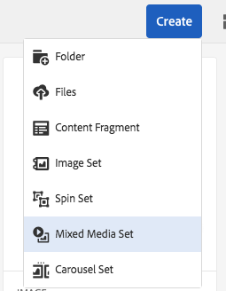

# Blandade medieuppsättningar{#mixed-media-sets}

Med blandade medieuppsättningar kan du kombinera bilder, bilduppsättningar, snurruppsättningar och videoklipp i en presentation.

Blandade medieuppsättningar definieras av en banderoll med ordet **[!UICONTROL MixedMediaSet]**. Om uppsättningen med blandade medier publiceras visas dessutom det publiceringsdatum som anges av ikonen **[!UICONTROL World]** på banderollen tillsammans med det senaste ändringsdatumet, som anges av ikonen **[!UICONTROL Pencil]**.

>[!NOTE]
>
>Mer information om Assets användargränssnitt finns i [Hantera resurser](/help/assets/manage-assets.md).

## Snabbstart: Blandade medieuppsättningar {#quick-start-mixed-media-sets}

Följ de här stegen för att komma igång snabbt med blandade medieuppsättningar:

1. [Överför dina resurser](#uploading-assets).

   Börja med att ladda upp bilder och videoklipp för uppsättningarna med blandade medier. Om det behövs kan du skapa [bilduppsättningar](/help/assets/image-sets.md) och [rotationsuppsättningar](/help/assets/spin-sets.md). Eftersom användarna kan zooma in på bilder i visningsprogrammet för den blandade medieuppsättningen bör du vara noggrann när du väljer bilder. Se till att bilderna har minst 2 000 pixlar i den största dimensionen.

   Se [Dynamic Media - Rasterbildformat som stöds](/help/assets/assets-formats.md#supported-raster-image-formats-dynamic-media) för en lista över format som stöds av blandade medieuppsättningar.

1. [Skapa blandade medieuppsättningar](#creating-mixed-media-sets).

   Om du vill skapa en uppsättning med blandade media väljer du **[!UICONTROL Create]** > **[!UICONTROL Mixed Media Set]** på Assets-sidan och ger uppsättningen ett namn, väljer resurserna och väljer den ordning bilderna ska visas.

   Se [Arbeta med väljare](/help/assets/working-with-selectors.md).

1. Ställ in [förinställningar för blandad Media Viewer](/help/assets/managing-viewer-presets.md) efter behov.

   Administratörer kan skapa eller ändra visningsförinställningar för blandade medieuppsättningar. Om du vill visa de blandade medierna med en visningsförinställning väljer du uppsättningen med blandade medier och väljer sedan **[!UICONTROL Viewers]** i listrutan till vänster.

   Mer information om hur du skapar eller redigerar förinställningar för visningsprogram finns i **[!UICONTROL Tools]** > **[!UICONTROL Assets]** > **[!UICONTROL Viewer Presets]**.

   Se [Lägg till och redigera visningsförinställningar](/help/assets/managing-viewer-presets.md).

1. [Förhandsgranska blandade medieuppsättningar](#previewing-mixed-media-sets).

   Markera den blandade medieuppsättningen och du kan förhandsgranska den. Markera miniatyrbildikonerna så att du kan undersöka den blandade medieuppsättningen i det valda visningsprogrammet. Du kan välja olika visningsprogram på menyn **[!UICONTROL Viewers]**, som finns i den vänstra listrutan.

1. [Publish blandade medieuppsättningar](#publishing-mixed-media-sets).

   När du publicerar en blandad medieuppsättning aktiveras URL-adressen och strängen Embed. Dessutom måste du [publicera visningsförinställningen](/help/assets/managing-viewer-presets.md#publishing-viewer-presets).

1. [Länka URL:er till webbprogrammet](/help/assets/linking-urls-to-yourwebapplication.md) eller [Bädda in video- eller bildvisningsprogrammet](/help/assets/embed-code.md).

   Adobe Experience Manager Assets skapar URL-anrop för blandade medieuppsättningar och aktiverar dem när du har publicerat de blandade medieuppsättningarna. Du kan kopiera dessa URL:er när du förhandsgranskar resurser. Du kan även bädda in dem på din webbplats.

   Välj den blandade medieuppsättningen och välj **[!UICONTROL Viewers]** i den vänstra listrutan.

   Se [Länka en uppsättning med blandade media till en webbsida](/help/assets/linking-urls-to-yourwebapplication.md) och [Bädda in video- eller bildvisningsprogrammet](/help/assets/embed-code.md).

Om det behövs kan du redigera [Blandade medieuppsättningar](#editing-mixed-media-sets). Dessutom kan du visa och ändra [egenskaper för den blandade medieuppsättningen](/help/assets/manage-assets.md#editing-properties).

>[!NOTE]
>
>Om du har problem med att skapa uppsättningar läser du [Felsöka Dynamic Media - Scene7-läge](/help/assets/troubleshoot-dms7.md).

## Ladda upp Assets {#uploading-assets}

Börja med att ladda upp bilder och videoklipp för uppsättningarna med blandade medier. Eftersom användarna kan zooma in på bilder i visningsprogrammet för den blandade medieuppsättningen bör du vara noggrann när du väljer bilder. Se till att bilderna har minst 2 000 pixlar i den största dimensionen.

Om du dessutom vill lägga till snurrsuppsättningar eller bilduppsättningar i den blandade medieuppsättningen skapar du också dessa uppsättningar.

Se [Dynamic Media - Rasterbildformat som stöds](/help/assets/assets-formats.md#supported-raster-image-formats-dynamic-media) för en lista över format som stöds av blandade medieuppsättningar.

## Skapa en blandad medieuppsättning {#creating-mixed-media-sets}

Du kan lägga till bilder, bilduppsättningar, snurruppsättningar och videoklipp i din uppsättning med blandade media. Se till att dina filer, bilduppsättningar och snurruppsättningar är klara att publiceras innan du lägger till dem i den blandade medieuppsättningen.

När du lägger till resurser i uppsättningen läggs de automatiskt till i alfanumerisk ordning. Du kan ändra ordning på eller sortera resurser manuellt när de har lagts till.

**Så här skapar du en blandad medieuppsättning:**

1. I Assets navigerar du till den plats där du vill skapa en blandad medieuppsättning, väljer **[!UICONTROL Create]** och väljer **[!UICONTROL Mixed Media Set]**. Du kan också skapa uppsättningen inifrån en mapp som innehåller resurserna. Redigeraren för uppsättningar med blandade medier visas.

   

1. Ange ett namn för den blandade medieuppsättningen i **[!UICONTROL Title]** i redigeraren för den blandade medieuppsättningen. Namnet visas i banderollen över den blandade medieuppsättningen. Du kan också ange en beskrivning.

   

   >[!NOTE]
   >
   >När du skapar den blandade medieuppsättningen kan du ändra miniatyrbilden för den blandade medieuppsättningen eller låta Experience Manager välja miniatyrbilden automatiskt baserat på resurserna i den blandade medieuppsättningen. Om du vill välja en miniatyrbild markerar du **[!UICONTROL Change thumbnail]** och väljer en bild (du kan navigera till andra mappar för att hitta bilder också). Om du har valt en miniatyrbild och sedan vill att Experience Manager ska generera en från den blandade medieuppsättningen väljer du **[!UICONTROL Switch to Automatic thumbnail]**.

1. Markera resursväljaren så att du kan välja resurser som du vill inkludera i den blandade medieuppsättningen. Markera dem och välj sedan **[!UICONTROL Select]**.

   Med resursväljaren kan du söka efter resurser genom att skriva ett nyckelord och trycka på **[!UICONTROL Return]**. Du kan också använda filter för att förfina sökresultatet. Du kan filtrera efter sökväg, samling, filtyp och tagg. Markera filtret och välj sedan ikonen **[!UICONTROL Filter]** i verktygsfältet. Ändra vyn genom att markera ikonen **[!UICONTROL View]** och markera **[!UICONTROL List View]**, **[!UICONTROL Column View]** eller **[!UICONTROL Card View]**.

   Se [Arbeta med väljare](/help/assets/working-with-selectors.md).

   

1. Ändra ordning på resurserna genom att dra dem uppåt eller nedåt i listan (måste markera ikonen **[!UICONTROL Reorder]**) efter behov.

   

   Om du vill lägga till miniatyrbilder markerar du ikonen **+** **[!UICONTROL thumbnail]** bredvid bilden och går till miniatyrbilden som du vill ha. När du har valt alla miniatyrbilder väljer du **[!UICONTROL Save]**.

   >[!NOTE]
   >
   >Om du vill lägga till resurser väljer du **[!UICONTROL Add Asset]**.

1. Om du vill ta bort en resurs markerar du motsvarande kryssruta och väljer **[!UICONTROL Delete Asset]**.
1. Om du vill använda en förinställning väljer du **[!UICONTROL Preset]** i det övre högra hörnet och väljer en förinställning som ska användas för resurserna.
1. Välj **[!UICONTROL Save]**. Den nya blandade medieuppsättningen visas i den mapp som du skapade den i.

## Redigera en blandad medieuppsättning {#editing-mixed-media-sets}

Du kan utföra olika redigeringsåtgärder för resurser i blandade medieuppsättningar direkt i användargränssnittet [på samma sätt som för andra resurser i Assets](/help/assets/manage-assets.md). Du kan även utföra följande åtgärder i Blandade medieuppsättningar:

* Lägg till resurser i den blandade medieuppsättningen.
* Ändra ordning på resurser i den blandade medieuppsättningen.
* Ta bort resurser i den blandade medieuppsättningen.
* Använd förinställningar för visningsprogram.
* Ändra standardminiatyrbilden.

**Så här redigerar du en blandad medieuppsättning:**

1. Gör något av följande:

   * Håll pekaren över en resurs i en blandad medieuppsättning och välj sedan **[!UICONTROL Edit]** (pennikon).
   * Håll pekaren över en resurs i en blandad medieuppsättning, välj **[!UICONTROL Select]** (bockmarkeringsikon) och välj sedan **[!UICONTROL Edit]** i verktygsfältet.

   * Välj en resurs i en blandad medieuppsättning och välj sedan **[!UICONTROL Edit]** (pennikon) i verktygsfältet.

1. Gör något av följande i redigeraren för den blandade medieuppsättningen:

   * Om du vill ändra ordning på resurser väljer du **[!UICONTROL Assets]** (bildikon) och drar en resurs till en ny plats i den vänstra panelen.
   * Om du vill lägga till resurser väljer du **[!UICONTROL Add Asset]** i verktygsfältet. Navigera till resurserna. För varje resurs som du vill lägga till håller du pekaren över resursens bild (inte resursens namn) och väljer sedan bockmarkeringsikonen. Välj **[!UICONTROL Select]** i det övre högra hörnet.

   * Om du vill ta bort en resurs väljer du **[!UICONTROL Assets]** (bildikon) i den vänstra panelen och markerar sedan resursen. Välj **[!UICONTROL Delete Asset]** i verktygsfältet.

   * Om du vill sortera resurser efter namn i stigande eller fallande ordning väljer du **[!UICONTROL Assets]** (bildikon) i den vänstra panelen. Till höger om rubriken **[!UICONTROL Assets]** väljer du upp- eller nedåtcirkonerna.

     >[!NOTE]
     >
     >* Om du vill ta bort en hel uppsättning med blandade media går du till visningsläget (till exempel **[!UICONTROL Card View]** eller **[!UICONTROL Column View]**) och går till den blandade medieuppsättningen. Håll markören över resursen och markera bockmarkeringsikonen så att du markerar den. Tryck på **[!UICONTROL Backspace]** på tangentbordet eller välj **[!UICONTROL More]** (tre punkter) i verktygsfältet och välj sedan **[!UICONTROL Delete]**.
     >
     >* Du kan redigera resurser i en uppsättning med blandade media genom att navigera till uppsättningen och klicka på **[!UICONTROL Set Members]** i den vänstra listen. Markera ikonen **[!UICONTROL Pencil]** för en enskild resurs så att du öppnar den i redigeringsfönstret.

1. Välj **[!UICONTROL Save]** när du är klar med redigeringen.

   >[!NOTE]
   >
   >* Om du vill redigera resurserna i en uppsättning med blandade media navigerar du till den blandade medieuppsättningen. Markera (markera inte) uppsättningen så att den öppnas på sidan Förhandsvisa Experience Manager. I den vänstra listen markerar du nedåtpilen för att öppna listrutan och väljer sedan **[!UICONTROL Set Members]**. Håll markören över en resurs på sidan Ange medlemmar och välj sedan **[!UICONTROL Edit]** (pennikon) för att öppna redigeringssidan.
   >
   >* Om du vill ta bort en hel uppsättning med blandade media - I valfritt visningsläge (som kortvyn eller kolumnvyn) går du till den blandade medieuppsättningen. Håll markören över uppsättningen och välj sedan **Markera** (bockmarkeringsikon). Tryck på **[!UICONTROL Backspace]** på tangentbordet eller välj **[!UICONTROL More]** (rad om tre punkter) och välj sedan **[!UICONTROL Delete]**.

## Förhandsgranska en uppsättning med blandade media {#previewing-mixed-media-sets}

Se [Förhandsgranska Assets](/help/assets/previewing-assets.md) för mer information om hur du förhandsvisar blandade medieuppsättningar.

## Publish a Mixed Media Set {#publishing-mixed-media-sets}

Mer information om hur du publicerar blandade medieuppsättningar finns i [Publish Assets](/help/assets/publishing-dynamicmedia-assets.md) .

>[!NOTE]
>
>Om den blandade medieuppsättningen inte hamnar helt i leveranstjänsten första gången du publicerar den publicerar du den blandade medieuppsättningen en andra gång.
