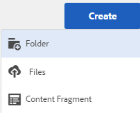

# Delning av privata mappar {#private-folder-sharing}

Du kan skapa en privat mapp i användargränssnittet för Adobe Experience Manager (AEM) Assets som är tillgängligt enbart för dig. Du kan dela den här privata mappen med andra användare och tilldela olika behörigheter till dem. Beroende på vilken behörighetsnivå du tilldelar kan användare utföra olika åtgärder i mappen, till exempel visa resurser i mappen eller redigera resurserna.

1. I resurskonsolen: tryck/klicka på **[!UICONTROL Skapa]** i verktygsfältet och välj sedan **[!UICONTROL Mapp]** på menyn.

   

1. I dialogrutan **[!UICONTROL Skapa mapp]** anger du en rubrik och ett namn (valfritt) för mappen och väljer **[!UICONTROL Privat]**.

   

1. Tryck/klicka på **[!UICONTROL Skapa]**. En privat mapp skapas i användargränssnittet.

   

1. Om du vill dela mappen med andra användare och tilldela behörigheter till dem markerar du mappen och klickar på/trycker på ikonen **[!UICONTROL Egenskaper]** i verktygsfältet.

   

   >[!NOTE]
   >
   >Mappen visas inte för andra användare förrän du delar den.

1. På sidan **[!UICONTROL Mappegenskaper]** väljer du en användare i listan **[!UICONTROL Lägg till användare]** , tilldelar en roll till användaren i den privata mappen och klickar på **[!UICONTROL Lägg till]**.

   

   >[!NOTE]
   >
   >Du kan tilldela olika roller, till exempel redigeraren, ägaren eller visningsprogrammet, till användaren som du delar mappen med. Om du tilldelar användaren en ägarroll har användaren redigeringsbehörighet för mappen. Dessutom kan användaren dela mappen med andra. Om du tilldelar en redigeringsroll kan användaren redigera resurserna i din privata mapp. Om du tilldelar en visningsprogramroll kan användaren bara visa resurserna i din privata mapp.

1. Click **[!UICONTROL Save]**. Beroende på vilken roll du tilldelar tilldelas användaren en uppsättning behörigheter i din privata mapp när användaren loggar in på AEM Resurser.
1. Klicka på **[!UICONTROL OK]** för att stänga bekräftelsemeddelandet.
1. Användaren som du delar mappen med får ett delningsmeddelande. Logga in på AEM Assets med användarens inloggningsuppgifter för att visa meddelandet.

   

1. Tryck/klicka på meddelandeikonen för att öppna listan med meddelanden.

   

1. Klicka på/tryck på posten för den privata mappen som delas av administratören för att öppna mappen.

>[!NOTE]
>
>Om du vill kunna skapa en privat mapp måste du ha behörigheten Läs och Redigera åtkomstkontrollista för den överordnade mappen som du vill skapa en privat mapp i. Om du inte är administratör aktiveras dessa behörigheter inte som standard för dig `/content/dam`. I så fall måste du först skaffa dessa behörigheter för ditt användar-ID/din grupp innan du försöker skapa privata mappar eller visa mappinställningar.
