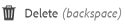

# Privat mapp i [!DNL Adobe Experience Manager Assets] {#private-folder}

| Version | Artikellänk |
| -------- | ---------------------------- |
| AEM as a Cloud Service | [Klicka här](https://experienceleague.adobe.com/docs/experience-manager-cloud-service/content/assets/manage/private-folder.html?lang=en) |
| AEM 6.5 | Den här artikeln |

Du kan skapa en privat mapp i [!DNL Adobe Experience Manager Assets] användargränssnitt som är tillgängligt enbart för dig. Du kan dela den här privata mappen med andra användare och tilldela andra användare olika behörigheter. Beroende på vilken behörighetsnivå du tilldelar kan användare utföra olika åtgärder i mappen, till exempel visa resurser i mappen eller redigera resurserna.

>[!NOTE]
>
>Den privata mappen har minst en medlem med ägarrollen.

## Skapa och dela privata mappar {#create-share-private-folder}

Så här skapar och delar du en privat mapp:

1. I [!DNL Assets] konsol, klicka **[!UICONTROL Create]** i verktygsfältet och välj **[!UICONTROL Folder]** på menyn.

   

1. I **[!UICONTROL Create Folder]** anger du en rubrik och ett namn (valfritt) för mappen och väljer **[!UICONTROL Private]** alternativ.

1. Klicka på **[!UICONTROL Create]**. En privat mapp skapas.

   

1. Om du vill dela mappen med andra användare och tilldela behörigheter till dem markerar du mappen och klickar på **[!UICONTROL Properties]** i verktygsfältet.

   

   >[!NOTE]
   >
   >Mappen visas inte för andra användare förrän du delar den.

1. I **[!UICONTROL Folder Properties]** väljer du en användare på sidan **[!UICONTROL Add User]** lista, tilldela en roll till användaren i din privata mapp och klicka på **[!UICONTROL Add]**.

   

   >[!NOTE]
   >
   >Du kan tilldela olika roller, till exempel `Editor`, `Owner`, eller `Viewer` till användaren som du delar mappen med. Om du tilldelar en `Owner` rollen för användaren har användaren `Editor` behörighet för mappen. Dessutom kan användaren dela mappen med andra. Om du tilldelar en `Editor` kan användaren redigera resurserna i din privata mapp. Om du tilldelar en visningsprogramroll kan användaren bara visa resurserna i din privata mapp.

   >[!NOTE]
   >
   >Den privata mappen har minst en medlem med `Owner` roll. Administratören kan därför inte ta bort alla ägarmedlemmar från en privat mapp. Om du vill ta bort befintliga ägare (och själva administratören) från den privata mappen måste administratören lägga till en annan användare som ägare.

1. Klicka på **[!UICONTROL Save]**. Beroende på vilken roll du tilldelar tilldelas användaren en uppsättning behörigheter i din privata mapp när användaren loggar in på [!DNL Assets].
1. Klicka **[!UICONTROL Ok]** för att stänga bekräftelsemeddelandet.
1. Användaren som du delar mappen med får ett delningsmeddelande. Logga in på [!DNL Assets] med inloggningsuppgifterna för användaren för att visa meddelandet.

   

1. Klicka [!UICONTROL Notifications] för att öppna en lista med meddelanden.

   

1. Klicka på posten för den privata mappen som delas av administratören för att öppna mappen.

>[!NOTE]
>
>Om du vill skapa en privat mapp måste du läsa och ändra [behörigheter för åtkomstkontroll](/help/sites-administering/security.md#permissions-in-aem) i den överordnade mapp som du vill skapa en privat mapp i. Om du inte är administratör är dessa behörigheter inte aktiverade för dig som standard `/content/dam`. I så fall måste du först skaffa dessa behörigheter för ditt användar-ID/din grupp innan du försöker skapa privata mappar.

## Borttagning av privata mappar {#delete-private-folder}

Du kan ta bort en mapp genom att markera mappen och välja [!UICONTROL Delete] på den översta menyn, eller genom att använda backstegstangenten på tangentbordet.

>[!CAUTION]
>
>Om du tar bort en privat mapp från CRXDE Lite lämnas överflödiga användargrupper kvar i databasen.

>[!NOTE]
>
>Om du tar bort en mapp med metoden ovan från användargränssnittet tas även de associerade användargrupperna bort.
>
>Befintliga redundanta, oanvända och automatiskt genererade användargrupper kan dock tas bort från databasen med `clean` i JMX i författarinstansen (`http://[server]:[port]/system/console/jmx/com.day.cq.dam.core.impl.team%3Atype%3DClean+redundant+groups+for+Assets`).
