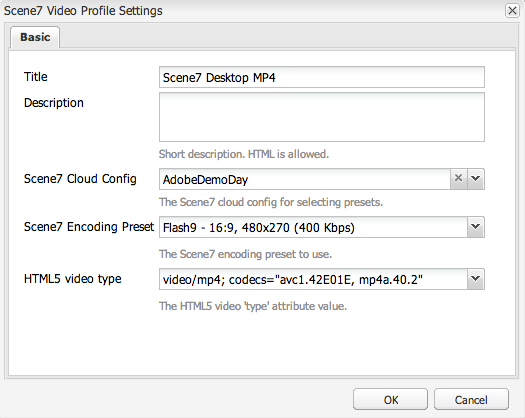

# Video {#video}

Med resurser kan du centralisera hanteringen av videoresurser så att du kan överföra videor direkt till Assets för automatisk kodning till Dynamic Media Classic (Scene7) och få tillgång till Dynamic Media Classic-videor direkt från Assets för sidredigering.

Med videointegrationen i Dynamic Media Classic kan du nå optimerad video på alla skärmar (automatisk enhets- och bandbreddsidentifiering).

* Scene7 Video **[!UICONTROL -komponenten]** utför automatiskt enhets- och bandbreddsidentifiering för att spela upp video i rätt format och med rätt kvalitet på datorer, surfplattor och mobiler.
* Resurser - Du kan inkludera adaptiva videouppsättningar i stället för bara enskilda videoresurser. En adaptiv videouppsättning är en behållare för alla videoåtergivningar som krävs för att spela upp video sömlöst på flera skärmar. En adaptiv videouppsättning grupperar versioner av samma video som är kodade med olika bithastigheter och format som 400 kbit/s, 800 kbit/s och 1 000 kbit/s. Du använder en adaptiv videouppsättning, tillsammans med S7-videokomponenten, för adaptiv videoströmning på flera skärmar, inklusive stationära datorer, iOS, Android, Blackberry och Windows mobila enheter. Mer information finns i [Scene7-dokumentationen om adaptiva videouppsättningar](https://help.adobe.com/en_US/scene7/using/WS53492AE1-6029-45d8-BF80-F4B5CF33EB08.html).

## Om FFMPEG och Dynamic Media Classic {#about-ffmpeg-and-scene}

Standardprocessen för videokodning bygger på den FFMPEG-baserade integrationen med videoprofiler. Därför innehåller det körklara arbetsflödet för DAM-inmatning följande två åtgärder:

* FFMPEG-miniatyrbilder
* FFMPEG-kodning

Tänk på att aktivering och konfigurering av den dynamiska Media Classic-integreringen inte automatiskt tar bort eller inaktiverar dessa två arbetsflödessteg från det körklara arbetsflödet för DAM-hämtning. Om du redan använder den FFMPEG-baserade videokodningen i AEM är det troligt att du har FFMPEG installerat i dina redigeringsmiljöer. I det här fallet kodas en ny video som hämtas med DAM två gånger: en gång från FFMPEG-kodaren och en gång från Dynamic Media Classic-integreringen.

Om du har konfigurerat och installerat den FFMPEG-baserade videokodningen i AEM rekommenderar Adobe att du tar bort de två arbetsflödena för FFMPEG från arbetsflödena för DAM-inhämtning.

## Format som stöds {#supported-formats}

Följande format stöds för komponenten Scene7 Video:

* F4V H.264
* MP4 H.264

## Bestäm var videon ska överföras {#deciding-where-to-upload-your-video}

Hur du avgör var du ska överföra dina videoresurser beror på följande:

* Behöver du ett arbetsflöde för videoresursen?
* Behöver du versionskontroll för videoresursen?

Om svaret är ja på någon av eller båda dessa frågor överför du videon direkt till Adobe DAM. Om svaret är nej på båda frågorna överför du videon direkt till Dynamic Media Classic. Arbetsflödet för varje scenario beskrivs i följande avsnitt.

### Om du överför videon direkt till Adobe DAM {#if-you-are-uploading-your-video-directly-to-adobe-dam}

Om du behöver ett arbetsflöde eller en versionshantering för dina resurser bör du först överföra dem till Adobe DAM. Här följer det rekommenderade arbetsflödet:

1. Ladda upp videomaterialet till Adobe DAM och koda och publicera automatiskt till Dynamic Media Classic.
1. I AEM får du tillgång till videomaterial i WCM på fliken **[!UICONTROL Filmer]** i Content Finder.
1. Skapa med **[!UICONTROL Scene7 Video]** eller **[!UICONTROL Foundation Video]** .

### Om du överför videon till Scene7 {#if-you-are-uploading-your-video-to-scene}

Om du inte behöver ett arbetsflöde eller en versionshantering för dina resurser bör du överföra dina resurser till Scene7. Här följer det rekommenderade arbetsflödet:

1. I Dynamic Media Classic [ställer du in en schemalagd FTP-överföring och -kodning till Scene7 (automatiskt system)](https://help.adobe.com/en_US/scene7/using/WS70B173EC-4CAD-4b4c-BF9C-43A11F3A5950.html).
1. I AEM får du tillgång till videomaterial i WCM på fliken **[!UICONTROL Scene7]** i Content Finder.
1. Skapa med komponenten **[!UICONTROL Scene7 Video]** .

## Konfigurera integrering med Scene7 Video {#configuring-integration-with-scene-video}

Så här konfigurerar du universella förinställningar:

1. Navigera till **[!UICONTROL Scene7]**-konfigurationen i **[!UICONTROL Cloud Services]** och klicka på **[!UICONTROL Redigera]**.
1. Välj fliken **[!UICONTROL Video]** .

   

   >[!NOTE]
   >
   >Fliken **[!UICONTROL Video]** visas inte om sidan inte har någon molnkonfiguration.

1. Välj den adaptiva videokodningsprofilen, en färdig videokodningsprofil eller en anpassad videokodningsprofil.

   >[!NOTE]
   >
   >Mer information om vad videoförinställningarna betyder finns i dokumentationen [för](https://help.adobe.com/en_US/scene7/using/WSE86ACF2B-BD50-4c48-A1D7-9CD4405B62D0.html)Dynamic Media Classic.
   >
   >Adobe rekommenderar att du antingen väljer båda adaptiva videouppsättningar när du konfigurerar de universella förinställningarna eller väljer alternativet **[!UICONTROL Adaptiv videokodning]** .

1. De valda kodningsprofilerna tillämpas automatiskt på alla videoklipp som överförs till CQ DAM-målmappen som du konfigurerar för den här Scene7-molnkonfigurationen. Du kan konfigurera flera Scene7-molnkonfigurationer med olika målmappar för att tillämpa olika kodningsprofiler efter behov.

## Uppdatera visningsprogram och kodningsförinställningar {#updating-viewer-and-encoding-presets}

Om du behöver uppdatera visningsprogrammet och kodningsförinställningarna för video i AEM eftersom förinställningarna har uppdaterats i Scene7 går du till Scene7-konfigurationen i molnkonfigurationen och klickar på **[!UICONTROL Uppdatera visningsprogrammet och kodningsförinställningarna]**.

## Överföra huvudvideon till Scene7 från Adobe DAM {#uploading-your-master-video}

1. Navigera till målmappen för CQ DAM där du har konfigurerat din molnkonfiguration med kodningsprofiler för Scene7.
1. Klicka på **[!UICONTROL Överför]** för att överföra huvudvideon. Videoöverföring och -kodning är klar när arbetsflödet för DAM Update Asset är klart och **[!UICONTROL Publicera till Scene7]** är markerat.

   >[!NOTE]
   >
   >Det kan ta en stund innan videominiatyrbilderna genereras.

   Om du drar DAM-huvudvideon till videokomponenten får du tillgång till *alla* Scene7-kodade proxyåtergivningar för leverans.

## Foundation Video Component vs Scene7 Video Component {#foundation-video-component-versus-scene-video-component}

När du använder AEM har du tillgång till både videokomponenten som finns i Sites och Scene7-videokomponenten. Dessa komponenter är inte utbytbara.

Scene7-videokomponenten fungerar bara för Scene7-videofilmer. Grundkomponenten fungerar med videor som lagras från AEM (med ffmpeg) och Scene7.

I följande matris förklaras när du bör använda vilken komponent:

>[!NOTE]
>
>Som standard använder S7-videokomponenten den universella videoprofilen. Du kan emellertid få den HTML5-baserade videospelaren att användas av AEM genom att göra något av följande i Scene7: kopiera inbäddningskoden för den färdiga HTML5-videospelaren och placera den på din AEM-sida.

## AEM Video Component {#aem-video-component}

Även om det rekommenderas att du använder Scene7-videokomponenten för att visa Scene7-videofilmer beskrivs det här avsnittet av tydlighetsskäl hur du använder Scene7-videofilmer med Foundation Video Component in AEM.

### AEM Video och Scene7 Video - jämförelse {#aem-video-and-scene-video-comparison}

I följande tabell visas en högnivåjämförelse av funktioner som stöds mellan videokomponenten i AEM Foundation och videokomponenten i Scene7:

|  | AEM Foundation Video | Scene7 Video |
|---|---|---|
| Metod | HTML5 first approach. Flash används bara för icke-HTML5-reservlösningar. | Flash på de flesta datorer. HTML5 används för mobiler och surfplattor. |
| Leverans | Progressiv | Adaptiv strömning |
| Spårning | Ja | Ja |
| Utbyggbarhet | Ja | Ja (med Scene7 Viewer SDK) |
| Mobilvideo | Ja | Ja |

### Konfigurera {#setting-up}

#### Skapa videoprofiler {#creating-video-profiles}

De olika videokodningarna skapas enligt de kodningsförinställningar för S7 som valts i molnkonfigurationen för S7. För att den grundläggande videokomponenten ska kunna använda dem måste en videoprofil skapas för varje vald S7-kodningsförinställning. Detta gör att videokomponenten kan välja DAM-återgivningar utifrån detta.

>[!NOTE]
>
>Nya videoprofiler och ändringar av dem måste aktiveras för publicering.

1. I AEM trycker du på **[!UICONTROL Tools > Configuration Console**.
1. Gå till **[!UICONTROL Verktyg > DAM > Videoprofiler]** i navigeringsträdet i **[!UICONTROL Configuration Console]** .
1. Skapa en ny S7-videoprofil. **[!UICONTROL I]** New.. väljer du **[!UICONTROL Skapa sida]** och sedan mallen Scene7-videoprofil. Ge den nya videoprofilsidan ett namn och klicka på **[!UICONTROL Skapa]**.

   

1. Redigera den nya videoprofilen. Välj molnkonfigurationen först. Välj sedan samma kodningsförinställning som du valde i molnkonfigurationen.

   

   | Egenskap | Beskrivning |
   |---|---|
   | Scene7 Cloud Config | Den molnkonfiguration som ska användas för kodningsförinställningarna. |
   | Scene7 Encoding Preset | Den kodningsförinställning som den här videoprofilen ska kopplas till. |
   | HTML5-videotyp | Med den här egenskapen kan du ange värdet för type-egenskapen i HTML5-videokällelementet. Den här informationen finns inte i S7-kodningsförinställningarna, men krävs för att videorna ska kunna återges korrekt med HTML5-videoelementet. En lista över vanliga format tillhandahålls, men kan skrivas över för andra format. |

   Upprepa det här steget för alla kodningsförinställningar som är markerade i molnkonfigurationen och som du vill använda i videokomponenten.

#### Konfigurera design {#configuring-design}

Komponenten **[!UICONTROL Foundation Video]** måste veta vilka videoprofiler som ska användas för att skapa listan över videokällor. Du måste öppna dialogrutan för videokomponentdesign och konfigurera komponentdesignen för de nya videoprofilerna.

>[!NOTE]
>
>Om du använder **[!UICONTROL Foundation Video]** -komponenten på en mobilsida kan du behöva upprepa de här stegen när du designar mobilsidan.

>[!NOTE]
>
>Ändringar i designen kräver att designen aktiveras för att börja gälla vid publiceringen.

1. Öppna dialogrutan **[!UICONTROL Foundation Video]** -komponentens design och växla till fliken **[!UICONTROL Profiler]** . Ta sedan bort färdiga profiler och lägg till de nya videoprofilerna för S7. Ordningen på profillistan i designdialogrutan definierar ordningen på videokällelementet vid återgivning.
1. För webbläsare som inte stöder HTML5 kan videokomponenten konfigurera ett Flash-återfall. Öppna dialogrutan för videokomponentdesign och gå till fliken **[!UICONTROL Flash]** . Konfigurera Flash Player-inställningarna och tilldela en reservprofil för Flash Player.

#### Checklista {#checklist}

1. Skapa en S7-molnkonfiguration. Kontrollera att förinställningarna för videokodning är angivna och att importeraren körs.
1. Skapa en S7-videoprofil för varje videokodningsförinställning som har valts i molnkonfigurationen.
1. Videoprofilerna måste aktiveras.
1. Konfigurera designen för **[!UICONTROL ljudvideokomponenten]** på sidan.
1. Aktivera designen när du är klar med designändringarna.

