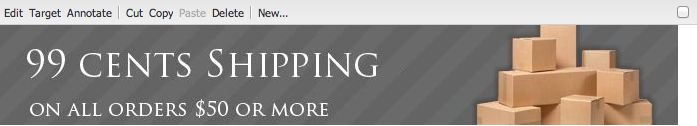

# Lägga till Dynamic Media Classic-funktioner på din sida {#adding-scene-features-to-your-page}

[Adobe Dynamic Media ](https://experienceleague.adobe.com/docs/dynamic-media-classic/using/home.html) Classic är en värdbaserad lösning för att hantera, förbättra, publicera och leverera multimediematerial för webben, mobiler, e-post och internetanslutna skärmar och för tryck.

Du kan visa Experience Manager-resurser som publicerats i Dynamic Media Classic i olika visningsprogram:

* Zoomning
* Utfällbar
* Video
* Bildmall
* Bild

Du kan publicera digitala resurser direkt från Experience Manager till Dynamic Media Classic och du kan publicera digitala resurser från Dynamic Media Classic till Experience Manager.

I det här dokumentet beskrivs hur du publicerar digitala resurser från Experience Manager till Dynamic Media Classic och omvänt. Visningsprogrammen beskrivs också i detalj. Information om hur du konfigurerar Experience Manager för Dynamic Media Classic finns i [Integrera Dynamic Media Classic med Experience Manager](/help/sites-administering/scene7.md).

Se även [Lägga till bildscheman](image-maps.md).

Mer information om hur du använder videokomponenter med Experience Manager finns i [Video](video.md).

>[!NOTE]
>
>Om resurserna i Dynamic Media Classic inte visas som de ska kontrollerar du att Dynamic Media är [inaktiverat](config-dynamic.md#disabling-dynamic-media) och uppdaterar sedan sidan.

## Publicera manuellt till Dynamic Media Classic från resurser {#manually-publishing-to-scene-from-assets}

Du kan publicera digitala resurser till Dynamic Media Classic på följande sätt:

* [I det klassiska användargränssnittet från Resurskonsolen](/help/sites-classic-ui-authoring/manage-assets-classic-s7.md#publishing-from-the-assets-console)
* [I det klassiska användargränssnittet för en resurs](/help/sites-classic-ui-authoring/manage-assets-classic-s7.md#publishing-from-an-asset)
* [I det klassiska användargränssnittet utanför CQ-målmappen](/help/sites-classic-ui-authoring/manage-assets-classic-s7.md#publishing-assets-from-outside-the-cq-target-folder)

>[!NOTE]
>
>Experience Manager publicerar till Dynamic Media Classic asynkront. När du har klickat på **[!UICONTROL Publish]** tar det flera sekunder för resursen att publicera till Dynamic Media Classic.

## Dynamic Media Classic-komponenter {#scene-components}

Följande Dynamic Media Classic-komponenter är tillgängliga i Experience Manager:

* Zoomning
* Utfällbar (zoom)
* Bildmall
* Bild
* Video

>[!NOTE]
>
>De här komponenterna är inte tillgängliga som standard och måste markeras i **[!UICONTROL Design]**-läge innan du använder dem.

När de har gjorts tillgängliga i **[!UICONTROL Design]**-läge kan du lägga till komponenterna på sidan precis som andra Experience Manager-komponenter. Resurser som ännu inte har publicerats till Dynamic Media Classic publiceras till Dynamic Media Classic om de ligger i en synkroniserad mapp, på en sida eller med en Dynamic Media Classic-molnkonfiguration.

>[!NOTE]
>
>Om du skapar och utvecklar anpassade visningsprogram och använder Content Finder måste du lägga till parametern `allowfullscreen` explicit.

### Meddelande om att Flash Viewer har upphört {#flash-viewers-end-of-life-notice}

Från och med den 31 januari 2017 upphörde Adobe Dynamic Media Classic med stödet för visningsprogramplattformen Flash.

<!-- For more information about this important change, see [Flash Viewer End-of-Life FAQs](https://docs.adobe.com/content/docs/en/aem/6-1/administer/integration/marketing-cloud/scene7/flash-eol.html). -->

### Lägga till en Dynamic Media Classic-komponent (Scene7) på en sida {#adding-a-scene-component-to-a-page}

Att lägga till en Dynamic Media Classic-komponent (Scene7) på en sida är detsamma som att lägga till en komponent på en sida. Dynamic Media Classic-komponenter beskrivs i detalj i följande avsnitt.

**Så här lägger du till en Dynamic Media Classic-komponent (Scene7) på en sida:**

1. Öppna den sida i Experience Manager där du vill lägga till komponenten **[!UICONTROL Dynamic Media Classic (Scene7)]**.

1. Om det inte finns några tillgängliga Dynamic Media Classic-komponenter klickar du på **[!UICONTROL Design]**-läget, trycker på en komponent med en blå kant, trycker på ikonen **[!UICONTROL Parent]** och sedan på ikonen **[!UICONTROL Configuration]**. I **[!UICONTROL Parsys (Design)]** markerar du alla Dynamic Media Classic-komponenter som du vill göra tillgängliga och klickar på **[!UICONTROL OK]**.

   

1. Klicka på **[!UICONTROL Edit]** så att du kan återgå till **[!UICONTROL Edit]**-läget.

1. Dra en komponent från Dynamic Media Classic-gruppen i sidosparken till sidan på önskad plats.

1. Klicka på ikonen **[!UICONTROL Configuration]** så att du kan öppna komponenten.

1. Redigera komponenten efter behov och klicka på **[!UICONTROL OK]** för att spara ändringarna.
1. Dra bilden eller videon från innehållsläsaren till den Dynamic Media Classic-komponent som du har lagt till på sidan.

   >[!NOTE]
   >
   >Om du bara vill trycka på användargränssnittet måste du dra och släppa bilden eller videon till den Dynamic Media Classic-komponent som du monterade på sidan. Det går inte att markera och redigera Dynamic Media Classic-komponenten och sedan välja resursen.

### Lägga till interaktiva tittarupplevelser på en responsiv webbplats {#adding-interactive-viewing-experiences-to-a-responsive-website}

Responsiv design för dina resurser innebär att dina resurser anpassas beroende på var de visas. Med responsiv design kan samma resurser visas effektivt på flera enheter.

Se även [Responsiv design för webbsidor](/help/sites-developing/responsive.md).

**Så här lägger du till en interaktiv tittarupplevelse på en responsiv webbplats:**

1. Logga in på Experience Manager och kontrollera att du har [konfigurerade Adobe Dynamic Media Classic-Cloud Services](/help/sites-administering/scene7.md#configuring-scene-integration) och att Dynamic Media Classic-komponenter är tillgängliga.

   >[!NOTE]
   >
   >Om Dynamic Media Classic-komponenter inte är tillgängliga måste du [aktivera dem i designläge](/help/sites-authoring/default-components-designmode.md).

1. På en webbplats där **[!UICONTROL Dynamic Media Classic]**-komponenterna är aktiverade drar du en **[!UICONTROL Image]**-komponent till sidan.
1. Markera komponenten och tryck på konfigurationsikonen.
1. Justera brytpunkterna på fliken **[!UICONTROL Dynamic Media Classic Settings]**.

   

1. Bekräfta att tittarna ändrar storlek rejält och att alla interaktioner är optimerade för datorer, surfplattor och mobiler.

### Gemensamma inställningar för alla Dynamic Media Classic-komponenter {#settings-common-to-all-scene-components}

Även om konfigurationsalternativen varierar är följande vanligt för alla [!UICONTROL Dynamic Media Classic]-komponenter:

* **[!UICONTROL File Reference]** - Bläddra till en fil som du vill referera till. Filreferensen visar resurs-URL:en och inte nödvändigtvis den fullständiga Dynamic Media Classic-URL:en, inklusive URL-kommandona och -parametrarna. Du kan inte lägga till Dynamic Media Classic URL-kommandon och -parametrar i det här fältet. I stället lägger du till dem via motsvarande funktioner i komponenten.
* **[!UICONTROL Width]** - Ange bredden.
* **[!UICONTROL Height]** - Här kan du ange höjden.

Du anger dessa konfigurationsalternativ genom att öppna (dubbelklicka) en Dynamic Media Classic-komponent, till exempel när du öppnar en **[!UICONTROL Zoom]**-komponent:

### Zoomning {#zoom}

HTML5 Zoom-komponenten visar en större bild när du trycker på knappen **[!UICONTROL +]**.

Resursen har zoomverktyg längst ned. Tryck på **[!UICONTROL +]** om du vill förstora; tryck på **[!UICONTROL -]** om du vill minska. Om du trycker på **[!UICONTROL x]** eller zoompilen reset återställs bilden till den ursprungliga storlek den importerades som. Tryck på de diagonala pilarna så att du kan göra den i helskärmsläge. Tryck på **[!UICONTROL Edit]** så att du kan konfigurera komponenten. Med den här komponenten kan du konfigurera [inställningar som är gemensamma för alla [!UICONTROL Dynamic Media Classic]-komponenter](#settings-common-to-all-scene-components).

### Utfällbar {#flyout}

I HTML5 **[!UICONTROL Flyout]**-komponenten visas resursen som en delad skärm; lämnade tillgången i den angivna storleken, till höger visas zoomdelen. Tryck på **[!UICONTROL Edit]** så att du kan konfigurera komponenten. Med den här komponenten kan du konfigurera [inställningar som är gemensamma för alla Dynamic Media Classic-komponenter](#settings-common-to-all-scene-components).

>[!NOTE]
>
>Om **[!UICONTROL Flyout]**-komponenten använder en anpassad storlek används den anpassade storleken och responsiv konfiguration av komponenten inaktiveras.
>
>Om din **[!UICONTROL Flyout]**-komponent använder standardstorleken, som anges i **[!UICONTROL Design View]**, används standardstorleken och komponenten sträcks ut för att passa sidlayoutstorleken med responsiv konfiguration av komponenten aktiverad. Det finns en begränsning för responsiv konfiguration av komponenten. När du använder komponenten **[!UICONTROL Flyout]** med responsiv konfiguration ska du inte använda den med full sidsträckning. Annars sträcker sig **[!UICONTROL Flyout]** utanför sidans högra kant.

### Bild {#image}

Med Dynamic Media Classic **[!UICONTROL Image]**-komponenten kan du lägga till Dynamic Media Classic-funktioner i dina bilder, till exempel Dynamic Media Classic-modifierare, bild- eller visningsförinställningar samt skärpa. Dynamic Media Classic **[!UICONTROL Image]**-komponenten liknar andra bildkomponenter i Experience Manager med speciella Dynamic Media Classic-funktioner. I det här exemplet används URL-modifieraren för Dynamic Media Classic, `&op_invert=1`.

**[!UICONTROL Title, Alt Text]** - På  **[!UICONTROL Advanced]** fliken lägger du till en titel i bilden och alternativ text för användare som har grafik inaktiverad.

**[!UICONTROL URL, Open in]** - Du kan ställa in en resurs från för att öppna en länk. Ange **[!UICONTROL URL]** och i **[!UICONTROL Open in]** om du vill att den ska öppnas i samma fönster eller i ett nytt fönster.

**[!UICONTROL Viewer preset]** - Välj en befintlig visningsförinställning i listrutan. Om den visningsförinställning du söker efter inte visas måste du göra den synlig. Se [Hantera visningsförinställningar](/help/assets/managing-viewer-presets.md). Du kan inte välja en visningsförinställning om du använder en bildförinställning och omvänt.

**[!UICONTROL Dynamic Media Classic Configuration]** - Välj den Dynamic Media Classic-konfiguration som du vill använda för att hämta aktiva bildförinställningar från SPS.

**[!UICONTROL Image preset]** - Välj en befintlig bildförinställning i listrutan. Om den bildförinställning du söker inte syns måste du göra den synlig. Se [Hantera bildförinställningar](/help/assets/managing-image-presets.md). Du kan inte välja en visningsförinställning om du använder en bildförinställning och omvänt.

**[!UICONTROL Output Format]** - Välj bildens utdataformat, till exempel jpeg. Beroende på vilket utdataformat du väljer finns det ytterligare konfigurationsalternativ. Se [Bästa praxis för bildförinställningar](/help/assets/managing-image-presets.md#image-preset-options).

**[!UICONTROL Sharpening]** - Välj hur du vill öka skärpan i bilden. Skärpeinställningen förklaras i detalj i [Bästa praxis för bildförinställningar](/help/assets/managing-image-presets.md#image-preset-options) och [Bästa tillvägagångssätt för skärpeökning](/help/assets/assets/sharpening_images.pdf).

**[!UICONTROL URL Modifiers]** - Du kan ändra bildeffekter genom att ange ytterligare bildkommandon för Dynamic Media Classic. Dessa kommandon beskrivs i [Bildförinställningar](/help/assets/managing-image-presets.md) och [Kommandoreferens](https://experienceleague.adobe.com/docs/dynamic-media-developer-resources/image-serving-api/image-serving-api/http-protocol-reference/command-reference/c-command-reference.html).

**[!UICONTROL Breakpoints]** - Om webbplatsen är responsiv vill du justera brytpunkterna. Brytpunkter måste avgränsas med kommatecken ( , ).

### Bildmall {#image-template}

[Dynamic Media Classic Image-](https://experienceleague.adobe.com/docs/dynamic-media-classic/using/template-basics/quick-start-template-basics.html) mallar är Photoshop-innehåll i lager som har importerats till Dynamic Media Classic, där innehåll och egenskaper har parametriserats för variabilitet. Med **[!UICONTROL Image template]**-komponenten kan du importera bilder och ändra texten dynamiskt i Experience Manager. Dessutom kan du konfigurera **[!UICONTROL Image template]**-komponenten så att värden från klientkontexten används, så att varje användare upplever bilden på ett personligt sätt.

Tryck på **[!UICONTROL Edit]** om du vill konfigurera komponenten. Du kan konfigurera [inställningar som är gemensamma för alla Dynamic Media Classic-komponenter](#settings-common-to-all-scene-components) och andra inställningar som beskrivs i det här avsnittet.

**[!UICONTROL File Reference, Width, Height]** - Se gemensamma inställningar för alla komponenter i ScDynamic Media Classic7.

>[!NOTE]
>
>Det går inte att lägga till Dynamic Media Classic URL-kommandon och -parametrar direkt i filreferensens URL. De kan bara definieras i komponentgränssnittet på panelen **[!UICONTROL Parameter]**.

**[!UICONTROL Title, Alt Text]** - På fliken Dynamic Media Classic Image Template (Bildmall) lägger du till en titel i bilden och alternativ text för användare som har inaktiverat grafik.

**[!UICONTROL URL, Open in]** - Du kan ställa in en resurs från för att öppna en länk. Ange URL:en och Öppna i anger om du vill att den ska öppnas i samma fönster eller i ett nytt fönster.

**[!UICONTROL Parameter Panel]** - När du importerar en bild fylls parametrarna i automatiskt med information från bilden. Om det inte finns något innehåll som kan ändras dynamiskt är det här fönstret tomt.

#### Ändra text dynamiskt {#changing-text-dynamically}

Om du vill ändra texten dynamiskt anger du ny text i fälten och klickar på **[!UICONTROL OK]**. I det här exemplet är **[!UICONTROL Price]** nu $50 och frakten 99 cent.

Texten i bilden ändras. Du kan återställa texten till det ursprungliga värdet genom att trycka på **[!UICONTROL Reset]** bredvid fältet.

#### Ändra text så att den återspeglar värdet för ett klientkontextvärde {#changing-text-to-reflect-the-value-of-a-client-context-value}

Om du vill länka ett fält till ett klientkontextvärde trycker du på **[!UICONTROL Select]** för att öppna klientsnabbmenyn, markerar klientkontexten och trycker på **[!UICONTROL OK]**. I det här exemplet ändras namnet baserat på att namnet länkas till det formaterade namnet i profilen.

Texten återspeglar namnet på den inloggade användaren. Du kan återställa texten till det ursprungliga värdet genom att klicka på **[!UICONTROL Reset]** bredvid fältet.

#### Göra Dynamic Media Classic Image Template till en länk {#making-the-scene-image-template-a-link}

1. Tryck på **[!UICONTROL Edit]** på sidan med Dynamic Media Classic **[!UICONTROL Image Template]**-komponenten.
1. I fältet **[!UICONTROL URL]** anger du den URL som användarna ska gå till när användaren trycker på bilden. I fältet **[!UICONTROL Open in]** väljer du om du vill att målet ska öppnas (ett nytt fönster eller samma fönster).

   

1. Tryck på **[!UICONTROL OK]**.

### Videokomponent {#video-component}

Komponenten Dynamic Media Classic **[!UICONTROL Video]** (som finns i avsnittet Dynamic Media Classic i sidosparken) använder enhets- och bandbreddsidentifiering för att visa rätt video för varje skärm. Den här komponenten är en HTML5-videospelare; det är ett enda visningsprogram som kan användas över flera kanaler.

Den kan användas för adaptiva videouppsättningar, en enda MP4-video eller en enda F4V-video.

Se [Video](s7-video.md) om du vill ha mer information om hur videofilmer fungerar med Dynamic Media Classic-integrering. Se även [Komponenten Dynamic Media Classic Video jämfört med komponenten Foundation Video](s7-video.md).

### Kända begränsningar för videokomponenten {#known-limitations-for-the-video-component}

Adobe DAM och WCM visar om en primär källvideo har överförts. De visar inte följande proxyresurser:

* Dynamic Media Classic-kodade återgivningar
* Dynamic Media Classic adaptiva videouppsättningar

När du använder en adaptiv videouppsättning med videokomponenten i Dynamic Media Classic måste du ändra storlek på komponenten så att den passar videofilens mått.

## Dynamic Media Classic content browser {#scene-content-browser}

I Dynamic Media Classic kan du visa innehåll från Dynamic Media Classic direkt i Experience Manager. I **[!UICONTROL Content Finder]** väljer du **[!UICONTROL Dynamic Media Classic]** i det pekoptimerade användargränssnittet eller **[!UICONTROL S7]**-ikonen i det klassiska användargränssnittet. Funktionen är identisk mellan båda användargränssnitten.

Om du har flera konfigurationer visar Experience Manager som standard [standardkonfigurationen](/help/sites-administering/scene7.md#configuring-a-default-configuration). Du kan välja olika konfigurationer direkt i webbläsaren för Dynamic Media Classic-innehåll i listrutan.

>[!NOTE]
>
>* Resurser i mappen on-demand visas inte i Dynamic Media Classic.
>* När [Säker förhandsvisning är aktiverat](/help/sites-administering/scene7.md#configuring-the-state-published-unpublished-of-assets-pushed-to-scene) visas både publicerade och opublicerade resurser i Dynamic Media Classic i innehållsläsaren i Dynamic Media Classic.
>* Om du inte ser **[!UICONTROL Dynamic Media Classic]** eller **[!UICONTROL S7]**-ikonen som ett alternativ i webbläsaren måste du [konfigurera Dynamic Media Classic så att det fungerar med Experience Manager](/help/sites-administering/scene7.md).
>* För video har Dynamic Media Classic-webbläsaren stöd för:

   >
   >   
   * Adaptiva videouppsättningar: behållare för alla videoåtergivningar som behövs för sömlös uppspelning på flera skärmar
   >   * Enkel MP4-video
   >   * En F4V-video

### Bläddra bland innehåll i det pekoptimerade användargränssnittet {#browsing-content-in-the-touch-optimized-ui}

Du kan öppna innehållsläsaren i det pekoptimerade eller klassiska användargränssnittet. För närvarande har pekoptimeringen följande begränsning:

* FXG- och Flash-resurser från Dynamic Media Classic stöds inte.

Bläddra bland Dynamic Media Classic-resurser genom att välja **[!UICONTROL Dynamic Media Classic]** i den tredje listrutan. Dynamic Media Classic visas inte i listan om du inte har konfigurerat Dynamic Media Classic/Experience Manager.

>[!NOTE]
>
>* Dynamic Media Classic-innehållsläsaren läser in ungefär 100 resurser och sorterar dem efter namn.
>* Om du har en säker förhandsgranskningsserver angiven använder webbläsaren den förhandsvisningsservern för att återge miniatyrer och resurser.

>

Dessutom kan du bläddra bland upplösningsinformation, storlek, dagar sedan ändringen och filnamn genom att hålla markören över resursen i webbläsaren.

* För adaptiva videouppsättningar och mallar genereras ingen storleksinformation för miniatyrbilder.
* För adaptiva videouppsättningar genereras ingen upplösning för miniatyrbilder.

### Söka efter Dynamic Media Classic-resurser med innehållsläsaren {#searching-for-scene-assets-with-the-content-browser}

Att söka efter resurser i Dynamic Media Classic påminner om att söka efter resurser i Experience Manager Assets. När du gör en sökning ser du i själva verket en fjärrvy över resurserna i Dynamic Media Classic-systemet i stället för att importera dem direkt till Experience Manager.

Du kan använda det klassiska användargränssnittet eller det pekoptimerade användargränssnittet för att både visa och söka efter resurser. Beroende på gränssnittet är sökningen något annorlunda.

När du söker i något av användargränssnitten kan du filtrera efter följande villkor (visas här i det pekoptimerade användargränssnittet):

**[!UICONTROL Enter keywords]** - Du kan söka efter resurser efter namn. När du söker efter nyckelorden som du anger är det filnamnet börjar med. Om du t.ex. skriver ordet &quot;simning&quot; söker du efter alla resursfilnamn som börjar med de bokstäverna i den ordningen. Var noga med att trycka på Retur när du har skrivit in termen för att hitta resursen.

**[!UICONTROL Folder/path]** - Namnet på mappen som visas baseras på den konfiguration du har valt. Du kan gå ned till lägre nivåer genom att trycka på mappikonen och välja en undermapp. Tryck sedan på bockmarkeringen för att markera den.

Om du anger ett nyckelord och väljer en mapp söker Experience Manager igenom den mappen och eventuella undermappar. Om du inte anger några nyckelord när du söker efter, visas bara resurserna i den mappen om du markerar mappen, och inga undermappar inkluderas.

Som standard söker Experience Manager i den markerade mappen och i alla undermappar.

**[!UICONTROL Type of Asset]** - Välj  **[!UICONTROL Dynamic Media Classic]** om du vill bläddra i Dynamic Media Classic-innehåll. Det här alternativet är bara tillgängligt om Dynamic Media Classic har konfigurerats.

**[!UICONTROL Configuration]** - Om du har definierat mer än en Dynamic Media Classic-konfiguration i  [!UICONTROL Cloud Services]kan du markera den här. Därför ändras mappen baserat på den konfiguration du har valt.

**[!UICONTROL Asset type]** - I Dynamic Media Classic-webbläsaren kan du filtrera resultatet så att det innehåller något av följande: bilder, mallar, videor och anpassningsbara videouppsättningar. Om du inte väljer någon resurstyp söker Experience Manager som standard i alla resurstyper.

>[!NOTE]
>
>* I det klassiska användargränssnittet kan du även söka efter **Flash** och **FXG**. Filtrering för de här typerna i det pekoptimerade användargränssnittet stöds inte.
   >
   >
* När du söker efter video söker du efter en enskild återgivning. Resultatet returnerar den ursprungliga återgivningen (endast &amp;ast;.mp4) och den kodade återgivningen.
>* När du söker i en adaptiv videouppsättning söker du i mappen och i alla undermappar, men bara om du har lagt till ett nyckelord i sökningen. Om du inte har lagt till något nyckelord söker Experience Manager inte i undermapparna.

>

**[!UICONTROL Publish Status]** - Du kan filtrera efter resurser baserat på publiceringsstatus:  **[!UICONTROL Unpublished]** eller  **[!UICONTROL Published]**. Om du inte väljer **[!UICONTROL Publish Status]** söker Experience Manager som standard igenom alla publiceringsstatusar.

