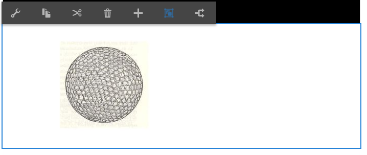

# Lägga till Dynamic Media Classic-funktioner på din sida {#adding-scene-features-to-your-page}

[Adobe Dynamic Media Classic](https://help.adobe.com/en_US/scene7/using/WS26AB0D9A-F51C-464e-88C8-580A5A82F810.html) är en värdbaserad lösning för att hantera, förbättra, publicera och distribuera multimediematerial för webben, mobiler, e-post och internetanslutna skärmar och för tryck.

Du kan visa AEM-resurser som publicerats i Dynamic Media Classic i olika visningsprogram:

* Zoomning
* Utfällbar
* Video
* Bildmall
* Bild

Du kan publicera digitala resurser direkt från AEM till Dynamic Media Classic och du kan publicera digitala resurser från Dynamic Media Classic till AEM.

I det här dokumentet beskrivs hur du publicerar digitala resurser från AEM till Dynamic Media Classic och vice versa. Visningsprogrammen beskrivs också i detalj. Mer information om hur du konfigurerar AEM för Dynamic Media Classic finns i [Integrera Dynamic Media Classic med AEM](/help/sites-administering/scene7.md).

Se även [Lägga till bildscheman](image-maps.md).

Mer information om hur du använder videokomponenter med AEM finns i [Video](video.md).

>[!NOTE]
>
>Om resurserna i Dynamic Media Classic inte visas som de ska kontrollerar du att Dynamic Media är [inaktiverat](config-dynamic.md#disabling-dynamic-media) och uppdaterar sedan sidan.

## Publicera manuellt till Dynamic Media Classic från resurser {#manually-publishing-to-scene-from-assets}

Du kan publicera digitala resurser till Dynamic Media Classic på följande sätt:

* [I det klassiska användargränssnittet från Resurskonsolen](/help/sites-classic-ui-authoring/manage-assets-classic-s7.md#publishing-from-the-assets-console)
* [I det klassiska användargränssnittet för en resurs](/help/sites-classic-ui-authoring/manage-assets-classic-s7.md#publishing-from-an-asset)
* [I det klassiska användargränssnittet finns Target-mappen CQ](/help/sites-classic-ui-authoring/manage-assets-classic-s7.md#publishing-assets-from-outside-the-cq-target-folder)

>[!NOTE]
>
>AEM publicerar till Dynamic Media Classic asynkront. När du har klickat **[!UICONTROL Publish]** kan det ta flera sekunder innan resursen publiceras till Dynamic Media Classic.

## Dynamic Media Classic-komponenter {#scene-components}

Följande Dynamic Media Classic-komponenter är tillgängliga i AEM:

* Zoomning
* Utfällbar (zoom)
* Bildmall
* Bild
* Video

>[!NOTE]
>
>De här komponenterna är inte tillgängliga som standard och måste markeras i **[!UICONTROL Design]** läget innan du använder.

När de har gjorts tillgängliga i **[!UICONTROL Design]** läge kan du lägga till komponenterna på sidan precis som andra AEM-komponenter. Resurser som ännu inte har publicerats i Dynamic Media Classic publiceras i Dynamic Media Classic om de ligger i en synkroniserad mapp, på en sida eller med en Dynamic Media Classic-molnkonfiguration.

>[!NOTE]
>
>Om du skapar och utvecklar anpassade visningsprogram och använder Content Finder måste du lägga till **[!UICONTROL allowfullscreen]** parametern explicit.

### Meddelande om att Flash Viewer har upphört {#flash-viewers-end-of-life-notice}

Från och med den 31 januari 2017 upphör stödet för Flash-visningsprogramplattformen i Adobe Dynamic Media Classic.

Mer information om den här viktiga förändringen finns i Vanliga frågor och svar om [användarvänligheten i Flash Viewer](https://docs.adobe.com/content/docs/en/aem/6-1/administer/integration/marketing-cloud/scene7/flash-eol.html).

### Lägga till en Dynamic Media Classic-komponent (Scene7) på en sida {#adding-a-scene-component-to-a-page}

Att lägga till en Dynamic Media Classic-komponent (Scene7) på en sida är detsamma som att lägga till en komponent på en sida. Dynamic Media Classic-komponenter beskrivs i detalj i följande avsnitt.

**Lägga till en Dynamic Media Classic-komponent (Scene7) på en sida**

1. I AEM öppnar du den sida där du vill lägga till komponenten Dynamic Media Classic (Scene7).

1. Om det inte finns några tillgängliga Dynamic Media Classic-komponenter klickar du på **[!UICONTROL Design]** läge, trycker på en komponent med en blå kant, trycker på **[!UICONTROL Parent]** -ikonen och sedan på **[!UICONTROL Configuration]** -ikonen. I **[!UICONTROL Parsys (Design)]** markerar du alla Dynamic Media Classic-komponenter som du vill göra dem tillgängliga och klickar på **[!UICONTROL OK]**.

   

1. Klicka **[!UICONTROL Edit]** för att återgå till **[!UICONTROL Edit]** läget.

1. Dra en komponent från Dynamic Media Classic-gruppen i sidosparken till den önskade platsen på sidan.

1. Klicka på **[!UICONTROL Configuration]** ikonen för att öppna komponenten.

1. Redigera komponenten efter behov och klicka på **[!UICONTROL OK]** för att spara ändringarna.
1. Dra bilden eller videon från innehållsläsaren till den Dynamic Media Classic-komponent som du har lagt till på sidan.

   >[!NOTE]
   >
   >Om du bara använder gränssnittet måste du dra och släppa bilden eller videon till den Dynamic Media Classic-komponent som du monterade på sidan. Det går inte att markera och redigera Dynamic Media Classic-komponenten och sedan välja resursen.

### Lägga till interaktiva tittarupplevelser på en responsiv webbplats {#adding-interactive-viewing-experiences-to-a-responsive-website}

Responsiv design för dina resurser innebär att dina resurser anpassas beroende på var de visas. Med responsiv design kan samma resurser visas effektivt på flera enheter.

Se även [Responsiv design för webbsidor](/help/sites-developing/responsive.md).

**Lägga till en interaktiv tittarupplevelse på en responsiv webbplats**

1. Logga in på AEM och kontrollera att du har [konfigurerat Adobe Dynamic Media Classic-Cloud Service](/help/sites-administering/scene7.md#configuring-scene-integration) och att Dynamic Media Classic-komponenter är tillgängliga.

   >[!NOTE]
   >
   >Om Dynamic Media Classic-komponenter inte är tillgängliga måste du [aktivera dem i designläge](/help/sites-authoring/default-components-designmode.md).

1. På en webbplats där **[!UICONTROL Dynamic Media Classic]** komponenterna är aktiverade drar du en **[!UICONTROL Image]** komponent till sidan.
1. Markera komponenten och tryck på konfigurationsikonen.
1. Justera brytpunkterna på **[!UICONTROL Dynamic Media Classic Settings]** fliken.

   

1. Bekräfta att tittarna ändrar storlek rejält och att alla interaktioner är optimerade för datorer, surfplattor och mobiler.

### Gemensamma inställningar för alla Dynamic Media Classic-komponenter {#settings-common-to-all-scene-components}

Även om konfigurationsalternativen varierar är följande vanligt för alla [!UICONTROL Dynamic Media Classic] komponenter:

* **[!UICONTROL File Reference]** - Bläddra till en fil som du vill referera till. Filreferensen visar resurs-URL:en och inte nödvändigtvis den fullständiga Dynamic Media Classic-URL:en, inklusive URL-kommandona och -parametrarna. Du kan inte lägga till Dynamic Media Classic URL-kommandon och -parametrar i det här fältet. De måste läggas till med motsvarande funktioner i komponenten.
* **[!UICONTROL Width]** - Ange bredden.
* **[!UICONTROL Height]** - Här kan du ange höjden.

Du anger dessa konfigurationsalternativ genom att öppna (dubbelklicka) en Dynamic Media Classic-komponent, till exempel när du öppnar en **[!UICONTROL Zoom]** komponent:

### Zoomning {#zoom}

HTML5 Zoom-komponenten visar en större bild när du trycker på **[!UICONTROL +]** knappen.

Resursen har zoomverktyg längst ned. Tryck **[!UICONTROL +]** för att förstora. Tryck **[!UICONTROL -]** för att minska. Om du trycker på **[!UICONTROL x]** eller återställer zoompilen återställs bilden till den ursprungliga storlek den importerades som. Tryck på de diagonala pilarna för att göra den i helskärmsläge. Tryck **[!UICONTROL Edit]** för att konfigurera komponenten. Med den här komponenten kan du konfigurera [inställningar som är gemensamma för alla [!UICONTROL Dynamic Media Classic]-komponenter](#settings-common-to-all-scene-components).

### Utfällbar {#flyout}

I HTML5- **[!UICONTROL Flyout]** komponenten visas resursen som en delad skärm. lämnade tillgången i den angivna storleken, till höger visas zoomdelen. Tryck **[!UICONTROL Edit]** för att konfigurera komponenten. Med den här komponenten kan du konfigurera [inställningar som är gemensamma för alla Dynamic Media Classic-komponenter](#settings-common-to-all-scene-components).

>[!NOTE]
>
>Om din **[!UICONTROL Flyout]** komponent använder en anpassad storlek används den anpassade storleken och responsiv konfiguration av komponenten inaktiveras.
>
>Om din **[!UICONTROL Flyout]** komponent använder standardstorleken, enligt inställningen i **[!UICONTROL Design View]** används standardstorleken och komponenten sträcks ut för att passa sidlayoutstorleken med responsiv inställning för komponenten aktiverad. Tänk dock på att det finns en begränsning för responsiv konfiguration av komponenten. När du använder **[!UICONTROL Flyout]** komponenten med responsiv konfiguration bör du inte använda den med full sidsträckning. I annat fall kan **[!UICONTROL Flyout]** det sträcka sig utanför sidans högra kant.

### Bild {#image}

Med **[!UICONTROL Image]** komponenten Dynamic Media Classic kan du lägga till Dynamic Media Classic-funktioner i dina bilder, till exempel Dynamic Media Classic-modifierare, bild- eller visningsförinställningar samt skärpa. Dynamic Media Classic- **[!UICONTROL Image]** komponenten liknar andra bildkomponenter i AEM med speciella Dynamic Media Classic-funktioner. I det här exemplet används Dynamic Media Classic URL-modifieraren `&op_invert=1` .

**[!UICONTROL Title, Alt Text]** - Lägg till en titel på bilden och alternativ text på fliken **[!UICONTROL Advanced]** för användare som har bilder inaktiverade.

**[!UICONTROL URL, Open in]** - Du kan ställa in en resurs från för att öppna en länk. Ange **[!UICONTROL URL]** och i **[!UICONTROL Open in]** anger om du vill att den ska öppnas i samma fönster eller i ett nytt fönster.

**[!UICONTROL Viewer preset]** - Välj en befintlig visningsförinställning i listrutan. Om den visningsförinställning som du söker efter inte visas kan du behöva göra den synlig. Se [Hantera visningsförinställningar](/help/assets/managing-viewer-presets.md). Du kan inte välja en visningsförinställning om du använder en bildförinställning och vice versa.

**[!UICONTROL Dynamic Media Classic Configuration]** - Välj den Dynamic Media Classic-konfiguration som du vill använda för att hämta aktiva bildförinställningar från SPS.

**[!UICONTROL Image preset]** - Välj en befintlig bildförinställning i listrutan. Om den bildförinställning du söker inte syns kan du behöva göra den synlig. Se [Hantera bildförinställningar](/help/assets/managing-image-presets.md). Du kan inte välja en visningsförinställning om du använder en bildförinställning och vice versa.

**[!UICONTROL Output Format]** - Välj bildens utdataformat, till exempel jpeg. Beroende på vilket utdataformat du väljer kan det finnas ytterligare konfigurationsalternativ. Mer information finns i [Bästa tillvägagångssätt](/help/assets/managing-image-presets.md#image-preset-options)för bildförinställning.

**[!UICONTROL Sharpening]** - Välj hur du vill öka skärpan i bilden. Skärpeinställningen förklaras i detalj i [Bästa praxis](/help/assets/managing-image-presets.md#image-preset-options) för bildförinställningar och [Bästa tillvägagångssätt](/help/assets/assets/s7_sharpening_images.pdf)för skärpeökning.

**[!UICONTROL URL Modifiers]** - Du kan ändra bildeffekter genom att ange ytterligare bildkommandon i Dynamic Media Classic. Dessa beskrivs i [Bildförinställningar](/help/assets/managing-image-presets.md) och [Kommandoradsreferensen](https://marketing.adobe.com/resources/help/en_US/s7/is_ir_api/is_api/http_ref/c_command_reference.html).

**[!UICONTROL Breakpoints]** - Om webbplatsen är responsiv vill du justera brytpunkterna. Brytpunkter måste avgränsas med kommatecken ( , ).

### Bildmall {#image-template}

[Dynamic Media Classic-bildmallar](https://help.adobe.com/en_US/scene7/using/WS60B68844-9054-4099-BF69-3DC998A04D3C.html) är lageruppbyggt Photoshop-innehåll som importerats till Dynamic Media Classic, där innehåll och egenskaper parametriserats för variabilitet. Med **[!UICONTROL Image template]** komponenten kan du importera bilder och ändra texten dynamiskt i AEM. Dessutom kan du konfigurera **[!UICONTROL Image template]** komponenten så att värden från klientkontexten används, så att varje användare upplever bilden på ett personligt sätt.

Tryck **[!UICONTROL Edit]** för att konfigurera komponenten. Du kan konfigurera [inställningar som är gemensamma för alla Dynamic Media Classic-komponenter](#settings-common-to-all-scene-components) samt andra inställningar som beskrivs i det här avsnittet.

**[!UICONTROL File Reference, Width, Height]** - Se gemensamma inställningar för alla komponenter i ScDynamic Media Classic7.

>[!NOTE]
>
>Det går inte att lägga till Dynamic Media Classic-URL-kommandon och -parametrar direkt i filreferenswebbadressen. De kan bara definieras i komponentgränssnittet på **[!UICONTROL Parameter]** panelen.

**[!UICONTROL Title, Alt Text]** - På fliken Dynamic Media Classic Image Template lägger du till en titel i bilden och alternativ text för de användare som har inaktiverat grafik.

**[!UICONTROL URL, Open in]** - Du kan ställa in en resurs från för att öppna en länk. Ange URL:en och Öppna i anger om du vill att den ska öppnas i samma fönster eller i ett nytt fönster.

**[!UICONTROL Parameter Panel]** - När du importerar en bild fylls parametrarna i automatiskt med information från bilden. Om det inte finns något innehåll som kan ändras dynamiskt är det här fönstret tomt.

#### Ändra text dynamiskt {#changing-text-dynamically}

Om du vill ändra texten dynamiskt anger du ny text i fälten och klickar på **[!UICONTROL OK]**. I det här exemplet **[!UICONTROL Price]** är nu 50 dollar och frakten 99 cent.

Texten i bilden ändras. Du kan återställa texten till det ursprungliga värdet genom att trycka **[!UICONTROL Reset]** bredvid fältet.

#### Ändra text så att värdet för en klientkontext återspeglas {#changing-text-to-reflect-the-value-of-a-client-context-value}

Om du vill länka ett fält till ett klientkontextvärde trycker du **[!UICONTROL Select]** för att öppna klientsnabbmenyn, markerar klientkontexten och trycker på **[!UICONTROL OK]**. I det här exemplet ändras namnet baserat på att namnet länkas till det formaterade namnet i profilen.

Texten återspeglar namnet på den inloggade användaren. Du kan återställa texten till det ursprungliga värdet genom att klicka **[!UICONTROL Reset]** bredvid fältet.

#### Göra Dynamic Media Classic Image Template till en länk {#making-the-scene-image-template-a-link}

1. Tryck på på sidan med **[!UICONTROL Image Template]** komponenten Dynamic Media Classic **[!UICONTROL Edit]**.
1. I **[!UICONTROL URL]** fältet anger du den URL som användarna ska gå till när användaren trycker på bilden. I **[!UICONTROL Open in]** fältet väljer du om du vill att målet ska öppnas (ett nytt fönster eller samma fönster).

   

1. Tryck på **[!UICONTROL OK]**.

### Videokomponent {#video-component}

I Dynamic Media Classic- **[!UICONTROL Video]** komponenten (som finns i Dynamic Media Classic-avsnittet i sidosparken) används enhets- och bandbreddsidentifiering för att visa rätt video för varje skärm. Den här komponenten är en HTML5-videospelare; det är ett enda visningsprogram som kan användas över flera kanaler.

Den kan användas för adaptiva videouppsättningar, en enda MP4-video eller en enda F4V-video.

Mer information om hur videofilmer fungerar med integrering med Dynamic Media Classic finns i [Video](s7-video.md) . Se även [Komponenten Dynamic Media Classic Video jämfört med komponenten](s7-video.md)Foundation Video.

### Kända begränsningar för videokomponenten {#known-limitations-for-the-video-component}

Adobe DAM och WCM visar om en primär källvideo har överförts. De visar inte följande proxyresurser:

* Dynamic Media Classic-kodade återgivningar
* Dynamic Media Classic adaptiva videouppsättningar

När du använder en adaptiv videouppsättning med videokomponenten i Dynamic Media Classic måste du ändra storlek på komponenten så att den passar videofilens mått.

## Dynamic Media Classic-innehållsläsare {#scene-content-browser}

I Dynamic Media Classic kan du visa innehåll från Dynamic Media Classic direkt i AEM. Om du vill få åtkomst till innehållsläsaren väljer du **[!UICONTROL Content Finder]** i det pekoptimerade användargränssnittet eller **[!UICONTROL Dynamic Media Classic]** **[!UICONTROL S7]** ikonen i det klassiska användargränssnittet. Funktionen är identisk mellan båda användargränssnitten.

Om du har flera konfigurationer visar AEM som standard [standardkonfigurationen](/help/sites-administering/scene7.md#configuring-a-default-configuration). Du kan välja olika konfigurationer direkt i webbläsaren för Dynamic Media Classic-innehåll i listrutan.

>[!NOTE]
>
>* Resurser som finns i ad hoc-mappen visas inte i Dynamic Media Classic-innehållsläsaren.
>* När [Säker förhandsvisning är aktiverat](/help/sites-administering/scene7.md#configuring-the-state-published-unpublished-of-assets-pushed-to-scene)visas både publicerade och opublicerade resurser i Dynamic Media Classic i innehållsläsaren i Dynamic Media Classic.
>* Om du inte ser **[!UICONTROL Dynamic Media Classic]** eller **[!UICONTROL S7]** ikonen som ett alternativ i webbläsaren måste du [konfigurera Dynamic Media Classic så att det fungerar med AEM](/help/sites-administering/scene7.md).
>* För video har Dynamic Media Classic-innehållsläsaren stöd för:
   >   * Adaptiva videouppsättningar: behållare för alla videoåtergivningar som behövs för sömlös uppspelning på flera skärmar
   >   * Enkel MP4-video
   >   * En F4V-video

### Bläddra i det pekoptimerade användargränssnittet {#browsing-content-in-the-touch-optimized-ui}

Du kan öppna innehållsläsaren i det pekoptimerade eller klassiska användargränssnittet. För närvarande har pekoptimeringen följande begränsning:

* FXG- och Flash-resurser från Dynamic Media Classic stöds inte.

Bläddra bland Dynamic Media Classic-resurser genom att välja **[!UICONTROL Dynamic Media Classic]** från den tredje listrutan. Dynamic Media Classic visas inte i listan om du inte har konfigurerat Dynamic Media Classic/AEM-integrering.

>[!NOTE]
>
>* Dynamic Media Classic-innehållsläsaren läser in ungefär 100 resurser och sorterar dem efter namn.
>* Om du har en säker förhandsgranskningsserver angiven använder webbläsaren den förhandsvisningsservern för att återge miniatyrer och resurser.
>

Dessutom kan du bläddra bland upplösningsinformation, storlek, dagar sedan ändringen och filnamn genom att hålla markören över resursen i webbläsaren.

* För adaptiva videouppsättningar och mallar genereras ingen storleksinformation för miniatyrbilder.
* För adaptiva videouppsättningar genereras ingen upplösning för miniatyrbilder.

### Söka efter Dynamic Media Classic-resurser med innehållsläsaren {#searching-for-scene-assets-with-the-content-browser}

Att söka efter Dynamic Media Classic-resurser liknar att söka efter AEM-resurser, förutom att när du söker ser du en fjärrvy av resurserna i Dynamic Media Classic-systemet i stället för att importera dem direkt till AEM.

Du kan använda det klassiska användargränssnittet eller det pekoptimerade användargränssnittet för att både visa och söka efter resurser. Beroende på gränssnittet är sökningen något annorlunda.

När du söker i något av användargränssnitten kan du filtrera efter följande villkor (visas här i det pekoptimerade användargränssnittet):

**[!UICONTROL Enter keywords]** - Du kan söka efter resurser efter namn. När du söker efter nyckelord som du anger är det filnamnet börjar med. Om du till exempel skriver ordet &quot;simning&quot; söker du efter alla resursfilnamn som börjar med de bokstäverna i den ordningen. Var noga med att trycka på Retur när du har skrivit in termen för att hitta resursen.

**[!UICONTROL Folder/path]** - Namnet på mappen som visas baseras på den konfiguration du har valt. Du kan gå ned till lägre nivåer genom att trycka på mappikonen och välja en undermapp. Tryck sedan på bockmarkeringen för att markera den.

Om du anger ett nyckelord och väljer en mapp söker AEM igenom den mappen och eventuella undermappar. Om du inte anger några nyckelord när du söker efter, kommer endast resurserna i den mappen att visas om du väljer mappen. Inga undermappar kommer att visas.

Som standard söker AEM igenom den markerade mappen och alla undermappar.

**[!UICONTROL Type of Asset]** - Välj **[!UICONTROL Dynamic Media Classic]** om du vill bläddra i Dynamic Media Classic-innehåll. Det här alternativet är bara tillgängligt om Dynamic Media Classic har konfigurerats.

**[!UICONTROL Configuration]** - Om du har definierat fler än en Dynamic Media Classic-konfiguration i [!UICONTROL Cloud Services]kan du markera den här. Därför ändras mappen baserat på den konfiguration du har valt.

**[!UICONTROL Asset type]** - I Dynamic Media Classic-webbläsaren kan du filtrera resultaten så att de innehåller något av följande: bilder, mallar, videor och anpassningsbara videouppsättningar. Om du inte väljer någon resurstyp söker AEM som standard igenom alla resurstyper.

>[!NOTE]
>
>* I det klassiska användargränssnittet kan du även söka efter **Flash** och **FXG**. Filtrering för dessa i det pekoptimerade användargränssnittet stöds för närvarande inte.
   >
   >
* När du söker efter video söker du efter en enskild återgivning. Resultatet returnerar den ursprungliga återgivningen (endast &amp;ast;.mp4) och den kodade återgivningen.
>* När du söker i en adaptiv videouppsättning söker du i mappen och i alla undermappar, men bara om du har lagt till ett nyckelord i sökningen. Om du inte har lagt till något nyckelord söker AEM inte igenom undermapparna.
>

**[!UICONTROL Publish Status]** - Du kan filtrera efter resurser baserat på publiceringsstatus: **[!UICONTROL Unpublished]** eller **[!UICONTROL Published]**. Om du inte väljer något **[!UICONTROL Publish Status]** söker AEM som standard igenom alla publiceringsstatusar.

