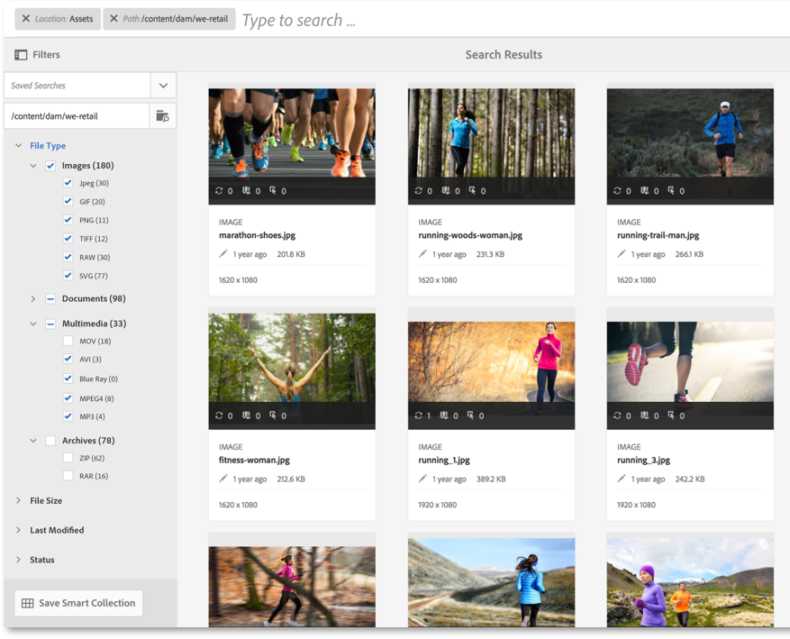
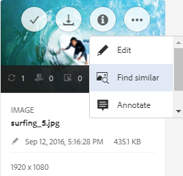

# Söka efter resurser i AEM {#search-assets-in-aem}

Adobe Experience Manager Assets (AEM) innehåller robusta metoder för resursidentifiering som hjälper er att uppnå högre innehållshastighet. Teamen minskar time to market med sömlös, intelligent sökupplevelse med hjälp av färdiga funktioner och anpassade metoder. Att söka resurser är centralt för användningen av ett digitalt resurshanteringssystem - oavsett om det är avsett för kreativa användare, för robust hantering av resurser av företagsanvändare och marknadsförare eller för administration av DAM-administratörer. Enkla, avancerade och anpassade sökningar som du kan utföra via användargränssnittet i AEM Resurser eller andra appar och ytor hjälper dig att fylla i dessa användningsområden.

AEM stöder följande användningsfall och den här artikeln beskriver användning, begrepp, konfigurationer, begränsningar och felsökning för dessa användningsområden.

| Sök resurser | Konfiguration och administration | Arbeta med sökresultat |
|---|---|---|
| [Grundläggande sökningar](#searchbasics) | [Sökindex](#searchindex) | [Sortera resultat](#sort) |
| [Förstå sökgränssnittet](#searchui) | [Visuell sökning eller likhetssökning](#configvisualsearch) | [Kontrollera egenskaper och metadata för en resurs](#checkinfo) |
| [Sökförslag](#searchsuggestions) | [Obligatoriska metadata](#mandatorymetadata) | [Hämta](#download) |
| [Förstå sökresultat och beteenden](#searchbehavior) | [Ändra sökfaktorer](#searchfacets) | [Massmetadatauppdateringar](#metadataupdates) |
| [Sökrankning och förstärkning](#searchrank) | [Textextrahering](#extracttextupload) | [Smarta samlingar](#collections) |
| [Avancerad sökning: filtrering och sökningens omfattning](#scope) | [Anpassade predikat](#custompredicates) | [Förstå oväntade resultat och felsökning](#troubleshoot-unexpected-search-results-and-issues) |
| [Sök bland andra lösningar och appar](#beyondomnisearch):<ul><li>[Adobe Asset Link](#aal)</li><li>[Varumärkesportal](#brandportal)</li><li>[AEM-skrivbordsapp](#desktopapp)</li><li>[Adobe Stock-bilder](#adobestock)</li><li>[Dynamiska medieresurser](#dynamicmedia)</li></ul> |  |  |
| [Resursväljare/väljare](#assetselector) |  |  |
| [Begränsningar](#limitations) och [tips](#tips) |  |  |
| [Illustrerade exempel](#samples) |  |  |

Sök efter resurser med Omnissearch-fältet högst upp i AEM-webbgränssnittet. Gå till **[!UICONTROL Resurser]** > **[!UICONTROL Filer]** i AEM, klicka på sökikonen i det övre fältet, ange söknyckelord och tryck på Retur. Du kan också använda kortkommandot / (snedstreck) för att öppna Omnissearch-fältet. Plats:Resurser är förmarkerade för att begränsa sökningarna till DAM-resurser. AEM ger förslag när du börjar skriva ett söknyckelord.

Använd panelen **[!UICONTROL Filter]** om du vill begränsa sökningen genom att filtrera sökresultaten baserat på olika alternativ (prediktiv), t.ex. filtyp, filstorlek, senaste ändringsdatum, status för mediefilen, information om insikter och Adobe Stock-licensiering. Administratörerna kan anpassa filterpanelen och lägga till eller ta bort sökpredikt med hjälp av sökfaktorer.

AEM-sökfunktionen stöder sökning efter samlingar och sökning efter resurser i en samling. Se [söksamlingar](/help/assets/managing-collections-touch-ui.md).

## Förstå sökgränssnittet {#searchui}

Bekanta dig med sökgränssnittet och de tillgängliga åtgärderna.

*Bild: Förstå delar av gränssnittet för resurssökningsresultat*

**** S. Spara sökningen som en smart samling. **** B. Filter (predikat) för att begränsa sökresultaten. **C.** Visa filer, mappar eller båda i sökresultatet. **** D. Klicka på Filter för att öppna eller stänga den vänstra listen. **** E. Sökplatsen är DAM. **** F. Omsökningsfält med användardefinierat söknyckelord. **** G. Markera kryssrutan för att markera alla sökresultat. **** H. Antal visade sökresultat av totalt antal sökresultat. ******Jag. Stäng sökningen** J. Växla mellan kortvyn och listvyn.

### Dynamiska sökfaktorer {#dynamicfacets}

Du kan identifiera önskade resurser snabbare från sökresultatsidan med det dynamiskt uppdaterade antalet förväntade sökresultat i sökmetoderna. Det förväntade antalet resurser uppdateras även innan sökfiltret används. Genom att se det förväntade antalet mot filtret kan du snabbt och effektivt navigera bland sökresultaten. Mer information finns i [Söka efter resurser i AEM](search-assets.md).

*Bild:Se det ungefärliga antalet resurser utan att filtrera sökresultaten i sökfaktorer.*

## Förstå sökresultat och beteenden {#searchbehavior}

### Grundläggande söktermer och sökresultat {#searchbasics}

Du kan köra nyckelordssökningar från OmniSearch-fältet. Nyckelordssökningen är inte skiftlägeskänslig och är en fulltextsökning (i alla vanliga metadatafält). Om mer än ett nyckelord söks efter används standardoperatorn mellan nyckelorden `AND` för standardsökning och det är `OR` när resurserna är smarta taggade.

Resultatet sorteras efter relevans, med början med närmast matchande. För flera nyckelord är mer relevanta resultat de resurser som innehåller båda termerna i sina metadata. I metadata rangordnas nyckelord som visas som smarta taggar högre än nyckelord som visas i andra metadatafält. Med AEM kan du ge en viss sökterm högre vikt. Det går också att [höja rankningen](#searchrank) för vissa målresurser för specifika söktermer.

För att snabbt hitta relevanta resurser innehåller det avancerade gränssnittet funktioner för filtrering, sortering och markering. Du kan filtrera resultat baserat på flera villkor och se antalet sökningar efter olika filter. Du kan också köra sökningen igen genom att ändra frågan i fältet Omnissearch. När du ändrar söktermer eller filter används de andra filtren för att bevara sökkontexten.

När resultatet är många resurser visas de första 100 i kortvyn och 200 i listvyn. När användare rullar läses fler resurser in. Detta för att förbättra prestandan.

>[!VIDEO](https://www.youtube.com/watch?v=LcrGPDLDf4o)

Ibland kan du se oväntade resurser i sökresultaten. Mer information finns i [oväntade resultat](#troubleshoot-unexpected-search-results-and-issues).

AEM kan söka i många filformat och sökfiltren kan anpassas efter företagets behov. Kontakta administratören för att få veta vilka sökalternativ som är tillgängliga för DAM-databasen och vilka begränsningar ditt konto har.

### Resultat med och utan förbättrade smarta taggar {#withsmarttags}

Som standard kombineras söktermerna med AND-satsen i AEM-sökningen. Du kan till exempel söka efter nyckelordskvinna som springer. Som standard visas endast resurser med både kvinna och nyckelord som körs i metadata i sökresultatet. Samma beteende bevaras när specialtecken (punkter, understreck eller streck) används med nyckelorden. Följande sökfrågor returnerar samma resultat:

* `woman running`
* `woman.running`
* `woman-running`

Frågan `woman -running` returnerar emellertid resurser utan `running` metadata.
Om du använder smarta taggar läggs en extra `OR` sats till för att hitta någon av söktermerna som de använda smarta taggarna. En resurs som är taggad med antingen `woman` eller `running` med smarta taggar visas också i en sådan sökfråga. Sökresultaten är en kombination av

* Resurser med `woman` och `running` nyckelord i metadata (standardbeteende).

* Resurser som är smarta och taggade med något av nyckelorden (beteendet Smarta taggar).

### Sök efter förslag medan du skriver {#searchsuggestions}

När du börjar skriva nyckelord föreslår AEM möjliga söknyckelord eller fraser. Förslagen baseras på metadata för de befintliga resurserna. AEM indexerar alla metadatafält som ska vara till hjälp vid sökning. Systemet använder värdena från följande metadatafält för att ge sökförslag. Om du vill ge sökförslag bör du överväga att fylla i följande fält med lämpliga nyckelord:

* Resurstaggar. (kartor till `jcr:content/metadata/cq:tags`)
* Resursrubrik. (kartor till `jcr:content/metadata/dc:title`)
* Resursbeskrivning. (kartor till `jcr:content/metadata/dc:description`)
* Titel i JCR-databasen. Värdet kan mappas till Resursrubrik. (kartor till `jcr:content/jcr:title`)
* Beskrivning i JCR-databasen. Värdet kan mappas till tillgångsbeskrivningen. (kartor till `jcr:content/jcr:description`)

Om du vill få förslag på fler än ett söknyckelord fortsätter du att skriva alla nyckelord utan att markera något förslag för ett nyckelord.

*Bild:Skriv in flera nyckelord för att visa förslag som passar alla*

### Sök efter rankning och förstärkning {#searchrank}

Sökresultaten som matchar alla söktermer i metadatafält visas först, följt av sökresultaten som matchar någon av söktermerna i de smarta taggarna. I ovanstående exempel är den ungefärliga visningsordningen för sökresultat:

1. Matchningar av `woman running` i de olika metadatafälten.
1. Matchar `woman running` i smarta taggar.
1. Matchar `woman` eller matchar `running` i smarta taggar.

Du kan förbättra nyckelordens relevans för vissa resurser för att öka sökningen baserat på nyckelorden. Det innebär att de bilder som du befordrar särskilda nyckelord för visas högst upp i sökresultatet när du söker baserat på dessa nyckelord.

1. Öppna egenskapssidan för resursen från resursanvändargränssnittet. Klicka på **[!UICONTROL Avancerat]** och klicka/tryck på **[!UICONTROL Lägg till]** under **[!UICONTROL Upphöjd för att söka efter nyckelord]**.
1. I rutan **[!UICONTROL Sök efter]** ökning anger du ett nyckelord som du vill öka sökningen efter bilden för och klickar/trycker sedan på **[!UICONTROL Lägg till]**. Du kan ange flera nyckelord på samma sätt.
1. Klicka/tryck på **[!UICONTROL Spara och stäng]**. Den resurs som du befordrade för det här nyckelordet visas bland de översta sökresultaten.

Du kan använda detta till din fördel genom att öka rankningen för vissa resurser i sökresultaten för nyckelordet target. Se exempelvideon nedan. Mer information finns i [Söka i AEM](https://helpx.adobe.com/experience-manager/kt/assets/using/search-feature-video-use.html).

>[!VIDEO](https://video.tv.adobe.com/v/16766/?quality=6)

*Förstå hur sökresultaten rangordnas och hur rangordningen kan påverkas.*

## Avancerad sökning {#scope}

I AEM finns olika metoder, till exempel filter som gäller för de sökda resurserna, så att du snabbare kan hitta de önskade resurserna. Nedan beskrivs några vanliga metoder. Några [illustrerade exempel](#samples) visas nedan.

**Sök efter filer eller mappar**: Se antingen filer, mappar eller båda i sökresultaten. På **[!UICONTROL filterpanelen]** kan du välja lämpligt alternativ. Se [sökgränssnitt](#searchui).

**Sök efter resurser i en mapp**: Du kan begränsa sökningen till en viss mapp. Lägg till en mappsökväg på panelen **[!UICONTROL Filter]** . Du kan bara markera en mapp i taget.

*Bild:Begränsa sökresultaten till en mapp genom att lägga till en mappsökväg i panelen Filter*

### Söka efter liknande bilder {#visualsearch}

Om du vill söka efter bilder som visuellt liknar en användarmarkerad bild klickar du på alternativet **[!UICONTROL Sök liknande]** i kortvyn för en bild eller i verktygsfältet. AEM visar de smarta taggade bilder från DAM-databasen som liknar den bild som användaren har valt. Se [hur du konfigurerar likhetssökning](#configvisualsearch).

*Bild:Söka efter liknande bilder med hjälp av alternativet i kortvyn*

### Adobe Stock-bilder {#adobestock}

I AEM-användargränssnittet kan användare söka efter [Adobe Stock-mediefiler](/help/assets/aem-assets-adobe-stock.md) och licensiera de mediefiler som behövs. Lägg till `Location: Adobe Stock` i omsökningsfältet. Du kan också använda panelen Filter för att hitta alla licensierade eller olicensierade mediefiler eller söka efter en viss mediefil med hjälp av Adobe Stock-filnumret.

### Dynamiska medieresurser {#dmassets}

Du kan filtrera efter dynamiska mediabilder genom att välja **[!UICONTROL Dynamiska media > Uppsättningar]** på panelen **[!UICONTROL Filter]** . Den filtrerar och visar resurser som bilduppsättningar, karuseller, blandade medieuppsättningar och snurruppsättningar.

### Söka med specifika värden i metadatafält {#gqlsearch}

Du kan söka efter resurser baserat på exakta värden för specifika metadatafält, som titel, beskrivning och författare. Funktionen för fulltextsökning i GQL hämtar endast resurser vars metadatavärde exakt matchar din sökfråga. Namnen på egenskaperna (till exempel författare, titel och så vidare) och värdena är skiftlägeskänsliga.

| Metadatafält | Fasettvärde och -användning |
|---|---|
| Titel | title:John |
| Originalformat | skapare:John |
| Plats | plats:NA |
| Beskrivning | description:&quot;Sample Image&quot; |
| Skapare | creatortool:&quot;Adobe Photoshop CC 2015&quot; |
| Copyright-ägare | copyrightowner:&quot;Adobe Systems&quot; |
| Medarbetare | medarbetare:John |
| Användningsvillkor | usageterms:&quot;CopyRights Reserved&quot; |
| Skapad | skapad:YYY-MM-DDTHH |
| Utgångsdatum | förfaller:ÅÅÅ-MM-DDTHH |
| I tid | ontime:YYY-MM-DDTHH |
| Fråntid | offtime:YYY-MM-DDTHH |
| Tidsintervall (förfaller dateontime, offtime) | faktafält: nedsänkt..upperbound |
| Bana | /content/dam/&lt;mappnamn> |
| PDF-titel | pdftitle:&quot;Adobe Document&quot; |
| Ämne | ämne:&quot;Utbildning&quot; |
| Taggar | taggar:&quot;Plats och resa&quot; |
| Typ | type:&quot;image\png&quot; |
| Bildens bredd | width:lowerbound..upperbound |
| Bildens höjd | height:lowerbound..upperbound |
| Person | person:John |

Egenskapernas sökväg, gräns, storlek och sorteringsordning kan inte vara ORed med någon annan egenskap.

Nyckelordet för en användargenererad egenskap är dess fältetikett i egenskapsredigeraren i gemener, med borttagna blanksteg.

Här är några exempel på sökformat för komplexa frågor:

* Så här visar du alla resurser med flera facets-fält (till exempel: title=John Doe and creator tool = Adobe Photoshop): `tiltle:"John Doe" creatortool : Adobe*`
* Så här visar du alla resurser när värdet för facets inte är ett enda ord utan en mening (till exempel: title=Scott Reynolds): `title:"Scott Reynolds"`
* Så här visar du resurser med flera värden för en enda egenskap (till exempel: title=Scott Reynolds eller John Doe): `title:"Scott Reynolds" OR "John Doe"`
* Så här visar du resurser med egenskapsvärden som börjar med en viss sträng (till exempel: heter Scott Reynolds): `title:Scott*`
* Så här visar du resurser med egenskapsvärden som slutar med en viss sträng (till exempel: heter Scott Reynolds): `title:*Reynolds`
* Så här visar du resurser med ett egenskapsvärde som innehåller en viss sträng (till exempel: title = Basel Meeting Room): `title:*Meeting*`
* Så här visar du resurser som innehåller en viss sträng och har ett specifikt egenskapsvärde (till exempel: sök efter Adobe-strängen i resurser med title=John Doe): `*Adobe* title:"John Doe"`

## Sök efter resurser från andra AEM-erbjudanden eller gränssnitt {#beyondomnisearch}

Adobe Experience Manager (AEM) kopplar DAM-databasen till olika andra AEM-lösningar för att ge snabbare åtkomst till digitalt material och effektivisera de kreativa arbetsflödena. Alla resursidentifieringar börjar med bläddring eller sökning. Sökfunktionen är i stort sett densamma på de olika ytorna och lösningarna. Vissa sökmetoder ändras när målgruppen, användningsexemplen och användargränssnittet varierar mellan olika AEM-lösningar. De specifika metoderna beskrivs för de enskilda lösningarna på länkarna nedan. De universellt tillämpliga tipsen och beteendena beskrivs i den här artikeln.

### Söka efter resurser från Adobe Asset Link-panelen {#aal}

Med Adobe Asset Link kan formgivarna nu komma åt innehåll som lagras i AEM Assets, utan att lämna de Adobe Creative Cloud-program som stöds. Med hjälp av panelen i appen i Creative Cloud-programmen kan du enkelt söka efter, söka efter, checka ut och checka in resurser: Photoshop, Illustrator och InDesign. Med Asset Link kan du också söka visuellt liknande resultat. Visuella sökresultat bygger på Adobe Senseis maskininlärningsalgoritmer och hjälper användarna att hitta estetiskt liknande bilder. Se [söka efter och bläddra bland resurser](https://helpx.adobe.com/enterprise/using/manage-assets-using-adobe-asset-link.html#UseAdobeAssetLink) med Adobe Asset Link.

### Sök efter resurser i AEM-skrivbordsappen {#desktopapp}

Kreatörer använder datorprogrammet för att göra AEM Resurser enkelt sökbara och tillgängliga lokalt på datorn (Win eller Mac). Kreatörerna kan enkelt visa de önskade resurserna i Finder eller Utforskaren i Mac, öppna i skrivbordsprogram och ändra lokalt - ändringarna sparas tillbaka till AEM med en ny version som skapas i databasen. Programmet stöder enkla sökningar med ett eller flera nyckelord, * och ? jokertecken och operatorn AND. Se [Bläddra bland, söka efter och förhandsgranska resurser](https://docs.adobe.com/content/help/en/experience-manager-desktop-app/using/using.html#browse-search-preview-assets) i skrivbordsappen.

### Sök efter resurser i varumärkesportalen {#brandportal}

Affärsanvändare och marknadsförare använder Brand Portal för att effektivt och säkert dela godkänt digitalt material med interna team, partners och återförsäljare. Se [Sök resurser på varumärkesportalen](https://docs.adobe.com/content/help/en/experience-manager-brand-portal/using/search-capabilities/brand-portal-searching.html).

### Sök efter Adobe Stock-bilder {#adobestock-1}

I AEM-användargränssnittet kan användarna söka efter Adobe Stock-mediefiler och licensiera de mediefiler som behövs. Lägg till `Location: Adobe Stock` i Omnissearch-fältet. Du kan också använda **[!UICONTROL filterpanelen]** för att hitta alla licensierade eller olicensierade mediefiler eller söka efter en viss mediefil med hjälp av Adobe Stock-filnumret. Se [Hantera Adobe Stock-bilder i AEM](/help/assets/aem-assets-adobe-stock.md#usemanage).

### Sök efter Dynamic Media-resurser {#dynamicmedia}

Du kan filtrera efter dynamiska mediabilder genom att välja **[!UICONTROL Dynamiska media]** > **[!UICONTROL Uppsättningar]** på panelen **[!UICONTROL Filter]** . Den filtrerar och visar resurser som bilduppsättningar, karuseller, blandade medieuppsättningar och snurruppsättningar. När du redigerar webbsidor kan författarna söka efter uppsättningar inifrån Content Finder. Ett filter för uppsättningar är tillgängligt på en snabbmeny.

### Söka efter resurser i Content Finder vid redigering av webbsidor {#contentfinder}

Författare kan använda Content Finder för att söka i DAM-databasen efter relevanta resurser och använda resurserna på de webbsidor de skapar. Upphovsmannen kan också använda funktionen Anslutna resurser för att söka efter resurser som är tillgängliga på en AEM-fjärrdistribution. Författare kan sedan använda dessa resurser på webbsidor på en lokal AEM-distribution. Se [Använda fjärrresurser](/help/assets/use-assets-across-connected-assets-instances.md#use-remote-assets).

### Sök i samlingar {#collections}

AEM-sökfunktionen stöder sökning efter samlingar och sökning efter resurser i en samling. Se [söksamlingar](/help/assets/managing-collections-touch-ui.md).

## Resursväljare {#assetselector}

Med resursväljaren kan du söka efter, filtrera och bläddra bland DAM-resurser på ett speciellt sätt. Resursväljaren finns på `https://[aem-server]:[port]/aem/assetpicker.html`. Du kan hämta metadata för resurser som du väljer med resursväljaren. Du kan starta det med begärandeparametrar som stöds, till exempel resurstyp (bild, video, text) och markeringsläge (enstaka eller flera markeringar). Dessa parametrar anger kontexten för resursväljaren för en viss sökinstans och förblir intakta genom hela markeringen.

Resursväljaren använder HTML5-meddelandet Window.postMessage för att skicka data för den valda resursen till mottagaren. Resursväljaren baseras på Granites vokabulär för att välja bas. Som standard arbetar resursväljaren i bläddringsläge.

Du kan skicka följande frågeparametrar i en URL för att starta resursväljaren i ett visst sammanhang:

| Namn | Värden | Exempel | Syfte |
|---|---|---|---|
| resurssuffix (B) | Mappsökväg som resurssuffix i URL:[https://localhost:4502/aem/assetpicker.html/&lt;mappsökväg>](https://localhost:4502/aem/assetpicker.html) | Om du vill starta resursväljaren med en viss mapp markerad, t.ex. när mappen är `/content/dam/we-retail/en/activities` markerad, ska URL:en ha formatet: [https://localhost:4502/aem/assetpicker.html/content/dam/we-retail/en/activities?assettype=images](https://localhost:4502/aem/assetpicker.html/content/dam/we-retail/en/activities?assettype=images) | Om du vill att en viss mapp ska väljas när resursväljaren startas, skickar du den som ett resurssuffix. |
| läge | en, flera | <ul><li>[https://localhost:4502/aem/assetpicker.html?mode=single](https://localhost:4502/aem/assetpicker.html?mode=single)</li><li>[https://localhost:4502/aem/assetpicker.html?mode=multiple](https://localhost:4502/aem/assetpicker.html?mode=multiple)</li></ul> | I flera lägen kan du markera flera resurser samtidigt med resursväljaren. |
| mimeType | mimtyp(er) (`/jcr:content/metadata/dc:format`) av en resurs (jokertecken stöds också) | <ul><li>[https://localhost:4502/aem/assetpicker.html?mimetype=image/png](https://localhost:4502/aem/assetpicker.html?mimetype=image/png)</li><li>[https://localhost:4502/aem/assetpicker.html?mimetype=*png](https://localhost:4502/aem/assetpicker.html?mimetype=*png)</li><li>[https://localhost:4502/aem/assetpicker.html?mimetype=*presentation](https://localhost:4502/aem/assetpicker.html?mimetype=*presentation)</li><li>[https://localhost:4502/aem/assetpicker.html?mimetype=*presentation&amp;mimetype=*png](https://localhost:4502/aem/assetpicker.html?mimetype=*presentation&mimetype=*png)</li></ul> | Använd det för att filtrera resurser baserat på MIME-typ(er) |
| dialog | true, false | [https://localhost:4502/aem/assetpicker.html?dialog=true](https://localhost:4502/aem/assetpicker.html?dialog=true) | Använd de här parametrarna för att öppna resursväljaren som Granite-dialogrutan. Det här alternativet kan bara användas när du startar resursväljaren via fältet Bevilja sökväg och konfigurerar den som URL för pickerSrc. |
| assettype (S) | bilder, dokument, multimedia, arkiv | <ul><li>[https://localhost:4502/aem/assetpicker.html?assettype=images](https://localhost:4502/aem/assetpicker.html?assettype=images)</li><li>[https://localhost:4502/aem/assetpicker.html?assettype=documents](https://localhost:4502/aem/assetpicker.html?assettype=documents)</li><li>[https://localhost:4502/aem/assetpicker.html?assettype=multimedia](https://localhost:4502/aem/assetpicker.html?assettype=multimedia)</li><li>[https://localhost:4502/aem/assetpicker.html?assettype=archives](https://localhost:4502/aem/assetpicker.html?assettype=archives)</li></ul> | Använd det här alternativet om du vill filtrera resurstyper baserat på det skickade värdet. |
| root | &lt;mappsökväg> | [https://localhost:4502/aem/assetpicker.html?assettype=images&amp;root=/content/dam/we-retail/en/activities](https://localhost:4502/aem/assetpicker.html?assettype=images&root=/content/dam/we-retail/en/activities) | Använd det här alternativet om du vill ange rotmappen för resursväljaren. I det här fallet kan du bara välja underordnade resurser (direkt/indirekt) under rotmappen. |

Om du vill komma åt resursväljargränssnittet går du till `https://[aem_server]:[port]/aem/assetpicker`. Navigera till önskad mapp och markera en eller flera resurser. Du kan också söka efter den önskade resursen i rutan Sök, tillämpa det filter som behövs och sedan markera den.

*Bild:Bläddra och markera resurs i resursväljaren*

## Begränsningar {#limitations}

Sökfunktionen i AEM Assets har följande begränsningar:

* Ange inget radavståndsutrymme i sökfrågan, annars fungerar inte sökningen.
* AEM kan fortsätta att visa söktermen efter att du har valt egenskaper för en resurs bland sökresultaten och sedan avbrutit sökningen. <!-- (CQ-4273540) -->
* När du söker efter mappar, filer och mappar kan sökresultaten inte sorteras efter någon parameter.
* Om du trycker på Retur utan att skriva något i Omnissearch bar, returnerar AEM en lista med endast filer och inte mappar. Om du söker specifikt efter mappar utan att använda ett nyckelord returnerar AEM inga resultat.
* Med kryssrutan [!UICONTROL Markera alla] kan du bara välja de första 100 sökbara resurserna i kortvyn och de första 200 sökbara resurserna i listvyn. Om du rullar och läser in fler resurser i användargränssnittet kan du välja fler med alternativet [!UICONTROL Markera alla] .

Visuell sökning eller likhetssökning har följande begränsningar:

* Visuell sökning fungerar bäst med större databaser. Även om det inte finns något minsta antal bilder som krävs för bra resultat, kanske inte matchningskvaliteten för ett fåtal bilder är lika bra som matchningarna från en stor databas.
* Du kan inte ändra modell eller utbilda AEM för att hitta liknande bilder. Modellen ändras inte om du till exempel lägger till eller tar bort smarta taggar för ett fåtal resurser. Resurserna tas inte med i de visuellt liknande sökresultaten.

Sökfunktionen kan ha prestandabegränsningar i följande scenarier:

* Kortvyn har en snabbare inläsningstid jämfört med listvyn för att visa sökresultaten.

## Söktips {#tips}

* När du övervakar granskningsstatusen för resurser ska du använda lämpligt alternativ för att hitta vilka resurser som är godkända eller vilka resurser som väntar på godkännande.
* Använd Insights-predikatet för att söka efter resurser som stöds baserat på användningsstatistik från olika Creative-program. Användningsdata grupperas under Användningspoäng, Impressions, Clicks och Media-kanaler där resurserna visas i kategorier.
* Använd kryssrutan **[!UICONTROL Markera alla]** för att välja de sökda resurserna. Den väljer de första 100 resurserna i kortvyn och de första 200 resurserna i listvyn. Du kan arbeta med markeringen, till exempel hämta de markerade resurserna, uppdatera metadataegenskaperna i grupp för de markerade resurserna eller lägga till de markerade resurserna i en samling.
* Mer information om hur du söker efter resurser som inte innehåller de obligatoriska metadata finns i [obligatoriska metadata](#mandatorymetadata).
* Alla metadatafält används för sökningen. En allmän sökning, som att söka efter 12, ger vanligtvis många resultat. Du får bättre resultat om du använder dubbla (inte enkla) citattecken eller ser till att talet ligger intill ett ord utan specialtecken (till exempel *sko12*).
* Fulltextsökning stöder operatorer som -, ^ och så vidare. Om du vill söka efter de här bokstäverna som stränglitteraler omger du sökuttrycket med citattecken. Använd till exempel &quot;Anteckningsbok - Skönhet&quot; i stället för Anteckningsbok - Skönhet.
* Om sökresultaten är för många kan du begränsa [sökningen](#scope) till noll för de önskade resurserna. Det fungerar bäst om du har en aning om hur du ska söka efter de önskade resurserna, till exempel en viss filtyp, en viss plats, specifika metadata och så vidare.

* **Taggning**: Taggar hjälper dig att kategorisera resurser som du kan bläddra bland och söka efter mer effektivt. Taggning hjälper till att sprida rätt taxonomi till andra användare och arbetsflöden. AEM erbjuder metoder för att automatiskt tagga resurser med hjälp av Adobe Senseis artificiellt intelligenta tjänster som hela tiden blir bättre på att tagga upp materialet med användning och utbildning. När du söker efter resurser tas smarta taggar med i beräkningen om funktionen är aktiverad på ditt konto. Det fungerar tillsammans med AEM:s inbyggda sökfunktioner. Se [sökbeteende](#searchbehavior). Om du vill optimera den ordning i vilken sökresultaten visas kan du [öka sökrankningen](#searchrank) för några utvalda resurser.

* **Indexering**: Endast indexerade metadata och resurser returneras i sökresultatet. För bättre täckning och prestanda bör du se till att indexeringen är korrekt och följa bästa praxis. Se [indexering](#searchindex).

## Några exempel som illustrerar sökning {#samples}

Använd citattecken runt nyckelord för att hitta resurser som innehåller den exakta frasen i exakt den ordning som anges av användaren.

*Bild:Sökbeteende med och utan citattecken*

**Sök med asterisk som jokertecken**: Om du vill bredda sökningen använder du en asterisk före eller efter sökordet för att matcha ett valfritt antal tecken. Om du till exempel söker efter en körning utan asterisk returneras inga resurser som innehåller någon variant av ordet (inklusive i metadata). En asterisk ersätter ett valfritt antal tecken. Exempel:

* `run` returnerar resurser med nyckelordet exakt run
* `run*` returnerar resurser som körs, körs, körs och så vidare.
* `*run` returnerar utfall, kör igen och så vidare.
* `*run*` returnerar alla möjliga kombinationer.

*Bild:Illustration use asterisk wildcard in Asset search using a example*

**Sök med frågetecken**: Om du vill bredda sökningen använder du en eller flera ? tecken som matchar det exakta antalet tecken. I följande bild

* `run???` frågan matchar inte någon resurs.

* `run????` frågan matchar ordet `running` med fyra tecken efter `run`.

* `??run` frågan matchar ordet `rerun` med två tecken före `run`.

*Bild:Illustration use of question mark wildcard in Asset search using a example*

**Exkludera ett nyckelord**: Använd streck för att söka efter resurser som inte innehåller något nyckelord. Frågan returnerar till exempel resurser som innehåller `running -shoe` men inte `running``shoe`. På samma sätt returnerar frågan resurser som innehåller `camp -night` men inte `camp` `night`. Observera att `camp-night` frågan returnerar resurser som innehåller både `camp` och `night`.

*Bild:Användning av bindestreck för att söka efter resurser som inte innehåller ett exkluderat nyckelord*

## Konfigurations- och administrationsuppgifter som rör sökfunktioner {#configadmin}

### Sök i indexkonfigurationer {#searchindex}

Resursidentifiering bygger på indexering av DAM-innehåll, inklusive metadata. Snabbare och exaktare tillgångsidentifiering bygger på optimerad indexering och lämpliga konfigurationer. Se [sökindex](/help/assets/performance-tuning-guidelines.md#search-indexes), [frågor och indexering](/help/sites-deploying/queries-and-indexing.md)samt [metodtips](/help/sites-deploying/best-practices-for-queries-and-indexing.md).

### Visuell sökning eller likhetssökning {#configvisualsearch}

Visuell sökning använder smart taggning och kräver AEM 6.5.2.0 eller senare. Följ de här stegen när du har konfigurerat funktionen för smart taggning.

1. I AEM CRXDE i `/oak:index/lucene` noden lägger du till följande egenskaper och värden och sparar ändringarna.

   * `costPerEntry` type-egenskap `Double` med värdet `10`.

   * `costPerExecution` type-egenskap `Double` med värdet `2`.

   * `refresh` type-egenskap `Boolean` med värdet `true`.
   Den här konfigurationen tillåter sökningar från lämpligt index.

1. Om du vill skapa Lucene-index i CRXDE `/oak:index/damAssetLucene/indexRules/dam:Asset/properties`skapar du en nod med namnet `imageFeatures` av typen `nt-unstructured`. I `imageFeatures` noden

   * Lägg till `name` egenskap av typen `String` med värdet `jcr:content/metadata/imageFeatures/haystack0`.

   * Lägg till `nodeScopeIndex` egenskap av typen `Boolean` med värdet för `true`.

   * Lägg till `propertyIndex` egenskap av typen `Boolean` med värdet för `true`.

   * Lägg till `useInSimilarity` egenskap av typen `Boolean` med värdet `true`.
   Spara ändringarna.

1. Få åtkomst till `/oak:index/damAssetLucene/indexRules/dam:Asset/properties/predictedTags` och lägg till `similarityTags` egenskaper av typen `Boolean` med värdet för `true`.
1. Använd smarta taggar för resurserna i din AEM-databas. Se [hur du konfigurerar smarta taggar](https://docs.adobe.com/content/help/en/experience-manager-learn/assets/metadata/smart-tags-technical-video-setup.html).
1. I CRXDE i `/oak-index/damAssetLucene` noden anger du `reindex` egenskapen till `true`. Spara ändringarna.
1. (Valfritt) Om du har skapat ett anpassat sökformulär kopierar du `/libs/settings/dam/search/facets/assets/jcr%3Acontent/items/similaritysearch` noden till `/conf/global/settings/dam/search/facets/assets/jcr:content/items`. Spara alla ändringar.

Relaterad information finns i [Lär dig mer om smarta taggar i AEM](https://helpx.adobe.com/experience-manager/kt/assets/using/smart-tags-feature-video-understand.html) och [hur du hanterar smarta taggar](/help/assets/managing-smart-tags.md).

### Obligatoriska metadata {#mandatorymetadata}

Affärsanvändare, administratörer och DAM-bibliotek kan definiera vissa metadata som obligatoriska metadata som är ett måste för att affärsprocesserna ska fungera. Av olika anledningar kan vissa resurser sakna dessa metadata, t.ex. äldre resurser eller resurser som migrerats i grupp. Resurser med saknade eller ogiltiga metadata identifieras och rapporteras baserat på den indexerade metadataegenskapen. Mer information om hur du konfigurerar den finns i [obligatoriska metadata](/help/assets/metadata-schemas.md#define-mandatory-metadata).

### Ändra sökfaktorer {#searchfacets}

För att öka upptäcktshastigheten erbjuder AEM Assets sökfunktioner som du kan använda för att filtrera sökresultaten. Panelen Filter innehåller som standard några standardaspekter. Administratörer kan anpassa filterpanelen för att ändra standardmetoderna med hjälp av inbyggda predikat. AEM har en bra samling inbyggda prediktiv och en redigerare för att anpassa ansiktena. Se [sökfaktorer](/help/assets/search-facets.md).

### Extrahera text när resurser överförs {#extracttextupload}

Du kan konfigurera AEM så att texten extraheras från resurserna när användarna överför resurser, till exempel PSD- eller PDF-filer. AEM indexerar den extraherade texten och hjälper användarna att söka efter dessa resurser baserat på den extraherade texten. Se [Överföra resurser](/help/assets/managing-assets-touch-ui.md#uploading-assets).

### Anpassade predikat för att filtrera sökresultat {#custompredicates}

Predikat används för att skapa ansikten. Administratörer kan anpassa sökmetoderna på panelen Filter med förkonfigurerade predikat. Dessa predikat kan anpassas med hjälp av övertäckningar. Se [Skapa anpassade prediktiv](/help/assets/searchx.md).

Du kan söka efter digitala resurser baserat på en eller flera av följande egenskaper. Filter som gäller för vissa av dessa egenskaper är som standard tillgängliga och vissa andra filter kan skapas för att användas på andra egenskaper.

| Sökfält | Sök egenskapsvärden |
|---|---|
| MIME-typer | Bilder, Dokument, Multimedia, Arkiv eller Annat. |
| Senast ändrad | Timme, Dag, Vecka, Månad eller År. |
| Filstorlek | Liten, Medel eller Stor. |
| Publiceringsstatus | Publicerad eller opublicerad. |
| Godkänd status | Godkänd eller Avvisad. |
| Orientering | Vågrät, Lodrät eller Fyrkant. |
| Format | Färg eller Svartvitt. |
| Videohöjd | Anges som lägsta och högsta värde. Värdet lagras endast i metadata för videoåtergivningar. |
| Videobredd | Anges som lägsta och högsta värde. Värdet lagras endast i metadata för videoåtergivningar. |
| Videoformat | DVI, Flash, MPEG4, MPEG, OGG Theora, QuickTime, Windows Media. Värdet lagras i källvideons metadata och eventuella återgivningar. |
| Videokodek | x264. Värdet lagras endast i metadata för videoåtergivningar. |
| Videobithastighet | Anges som lägsta och högsta värde. Värdet lagras endast i metadata för videoåtergivningar. |
| Ljudkodek | Libvorbis, Lame MP3, AAC-kodning. Värdet lagras endast i metadata för videoåtergivningar. |
| Bithastighet för ljud | Anges som lägsta och högsta värde. Värdet lagras endast i metadata för videoåtergivningar. |

## Arbeta med resurssökningsresultat {#aftersearch}

När du ser sökningar efter resurser som matchar dina villkor kan du utföra följande vanliga uppgifter med eller utföra följande åtgärder på sökresultaten:

* Visa metadataegenskaper och annan information.
* Hämta en eller flera resurser.
* Använd Skrivbordsåtgärder för att öppna resurserna i skrivbordsappen.
* Skapa smarta samlingar.

### Sortera sökresultat {#sort}

Genom att sortera sökresultaten blir det enklare att hitta den mediefil du behöver snabbare. Sortering av sökresultat fungerar endast i listvyn och när du väljer **[!UICONTROL [Filer](#searchui)]**på panelen**[!UICONTROL  Filter ]**. I AEM Resurser används serversortering för att snabbt sortera alla resurser (oavsett hur många) i en mapp eller resultaten av en sökfråga. Sortering på serversidan ger snabbare och exaktare resultat än sortering på klientsidan.

I listvyn kan du sortera sökresultaten på samma sätt som du kan sortera resurser i valfri mapp. Sortering fungerar för de här kolumnerna - Namn, Titel, Status, Dimensioner, Storlek, Klassificering, Användning, Skapad (Datum), Ändrad (Datum), Publicerad, Arbetsflöde och Utcheckad.

Begränsningar av sorteringsfunktioner finns i [Begränsningar](#limitations).

### Kontrollera detaljerad information om en resurs {#checkinfo}

Du kan kontrollera detaljerad information om en sökresurs från sökresultatsidan.

Om du vill visa alla metadata för en resurs markerar du resursen och klickar på **[!UICONTROL egenskaper]** i verktygsfältet.

Om du vill kontrollera kommentarerna för en resurs eller versionshistorik för en resurs klickar du på resursen för att öppna en stor förhandsvisning. Öppna tidslinjen i den vänstra listen och välj **[!UICONTROL Kommentarer]** eller **[!UICONTROL versioner]**. Du kan också sortera tidslinjeaktiviteten som kommentarer eller versioner i kronologisk ordning.

*Bild:Sortera tidslinjeposter för en sökresurs*

### Hämta sökbara resurser {#download}

Du kan hämta de sökda resurserna och deras återgivningar på samma sätt som du hämtar vanliga resurser från mappar. Välj en eller flera resurser från sökresultaten och klicka på **[!UICONTROL Hämta]** i verktygsfältet.

### Uppdatera metadataegenskaper gruppvis {#metadataupdates}

Det går att göra satsvisa uppdateringar av de gemensamma metadatafälten för flera resurser. Välj en eller flera resurser från sökresultaten. Klicka på **[!UICONTROL Egenskaper]** i verktygsfältet och uppdatera metadata efter behov. Klicka på **[!UICONTROL Spara och stäng]** när du är klar. De befintliga metadata i de uppdaterade fälten skrivs över.

För resurser som är tillgängliga i en enda mapp eller en samling är det enklare att [uppdatera metadata gruppvis](/help/assets/managing-multiple-assets.md). För resurser som är tillgängliga i olika mappar eller matchar ett gemensamt villkor är det snabbare att uppdatera metadata i grupp via sökning.

### Smarta samlingar {#collections-1}

En samling är en ordnad uppsättning resurser som kan innehålla resurser från olika platser, eftersom samlingar bara innehåller referenser till dessa resurser. Samlingar är av följande två typer:

* En statisk referenslista med resurser, mappar och andra samlingar.
* En dynamisk lista (smart samling) som fyller i resurser i samlingen baserat på sökvillkor.

Du kan skapa smarta samlingar baserat på sökvillkoren. På **[!UICONTROL filterpanelen]** väljer du **[!UICONTROL Filer]** och klickar på **[!UICONTROL Spara smart samling]**. Se [Hantera samlingar](/help/assets/managing-collections-touch-ui.md).

## Felsöka oväntade sökresultat och problem {#troubleshoot-unexpected-search-results-and-issues}

| Fel, problem, symtom | Möjlig orsak | Möjlig korrigering eller förståelse för problemet |
|---|---|---|
| Felaktiga resultat vid sökning efter resurser som saknar metadata |  När du söker efter resurser som saknar obligatoriska metadata kan AEM visa resurser som har giltiga metadata. Resultatet baseras på indexerad metadataegenskap. | När metadata har uppdaterats krävs omindexering för att återspegla rätt status för resursens metadata. Se [obligatoriska metadata](metadata-schemas.md#define-mandatory-metadata). |
| För många sökresultat | En stor sökparameter. | Överväg att begränsa [sökningens](#scope)omfattning. Smarta taggar kan ge fler sökresultat än du förväntade dig. Se [sökbeteendet med smarta taggar](#withsmarttags). |
| Orelaterade eller delvis relaterade sökresultat | Sökbeteendet ändras med smart taggning. | Förstå [hur sökningen ändras efter smart taggning](#withsmarttags). |
| Inga förslag för resurser som fylls i automatiskt | Nyligen överförda resurser har ännu inte indexerats. Metadata är inte omedelbart tillgängliga som förslag när du börjar skriva ett söknyckelord i omsökningsfältet. | AEM Resurser väntar tills en timeout-period har gått ut (en timme som standard) innan ett bakgrundsjobb körs för att indexera metadata för alla nyligen överförda eller uppdaterade resurser och lägger sedan till metadata i listan med förslag. |
| Inga sökresultat | <ul><li>Det finns inga resurser som matchar din fråga.</li><li>Du lade till ett tomt utrymme före sökfrågan.</li><li>Ett metadatafält som inte stöds innehåller nyckelordet som du söker efter.</li><li>I tid och offline konfigureras resursen och sökningen gjordes när resursen var ledig.</li></ul> | <ul><li>Sök med ett annat nyckelord. Du kan även använda smart taggning för att förbättra sökresultaten.</li><li>Det är en [känd begränsning](#limitations).</li><li>Alla metadatafält beaktas inte vid sökningar. Se [omfång](#scope).</li><li>Sök senare eller ändra på- och avtidsinställningarna för de nödvändiga resurserna.</li></ul> |
| Sökfilter/ predikat är inte tillgängligt | <ul><li>Sökfiltret är inte konfigurerat.</li><li>Den är inte tillgänglig för din inloggning.</li><li>(Sannolikheten är mindre) Sökalternativen är inte anpassade efter den distribution du använder.</li></ul> | <ul><li>Kontakta administratören för att kontrollera om sökanpassningarna är tillgängliga eller inte.</li><li>Kontakta administratören för att kontrollera om ditt konto har behörighet att använda anpassningen.</li><li>Kontakta administratören och kontrollera tillgängliga anpassningar för den AEM Resurser-distribution du använder.</li></ul> |
| När du söker efter visuellt liknande bilder saknas en förväntad bild | <ul><li>Bilden är inte tillgänglig i AEM.</li><li>Bilden är inte indexerad. Vanligtvis när den nyligen har överförts.</li><li>Bilden är inte smart taggad.</li></ul> | <ul><li>Lägg till bilden i AEM Resurser.</li><li>Kontakta administratören om du vill indexera om databasen. Se även till att du använder rätt index.</li><li>Kontakta administratören om du vill tagga de relevanta resurserna på ett smart sätt.</li></ul> |
| När du söker efter visuellt liknande bilder visas en irrelevant bild | Visuell sökfunktion. | AEM visar så många potentiellt relevanta resurser som möjligt. Mindre relevanta bilder, om sådana finns, läggs till i resultatet men med en lägre sökrankning. Kvaliteten på matchningarna och relevansen hos de sökda resurserna minskar när du bläddrar nedåt i sökresultaten. |
| När du väljer och arbetar med sökresultat används inte alla sökresurser | Med alternativet [!UICONTROL Markera alla] markeras endast de första 100 sökresultaten i kortvyn och de första 200 sökresultaten i listvyn. |  |

>[!MORELIKETHIS]
>
>* [Implementeringshandbok för AEM-sökning](https://docs.adobe.com/content/help/en/experience-manager-learn/sites/developing/search-tutorial-develop.html)
>* [Avancerad konfiguration av predikat för sökning av flera värden och taggar](https://docs.adobe.com/content/help/en/experience-manager-learn/assets/metadata/search-feature-video-use.html)
>* [Konfigurera smart översättningssökning](https://docs.adobe.com/content/help/en/experience-manager-learn/assets/translation/smart-translation-search-technical-video-setup.html)

