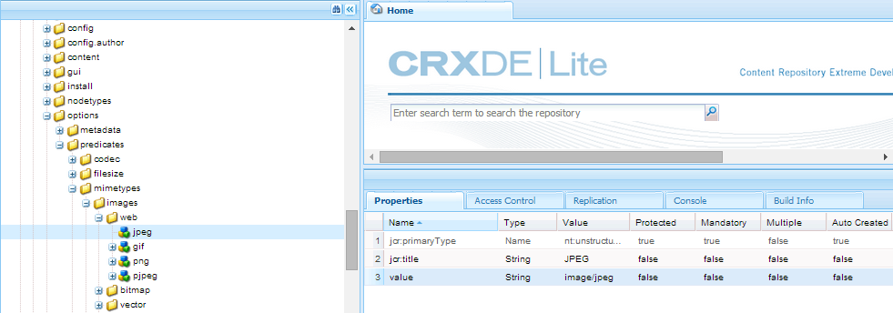

# Söka efter fasetter {#search-facets}

En företagsövergripande driftsättning av [!DNL Adobe Experience Manager Assets] har kapacitet att lagra många resurser. Ibland kan det vara besvärligt och tidskrävande att hitta rätt resurs om du bara använder de allmänna sökfunktionerna i [!DNL Experience Manager].

Använd sökfaktorer på panelen Filter för att göra sökningen mer detaljerad och göra sökfunktionen mer effektiv och flexibel. Sökfaktorer lägger till flera dimensioner (predikat) som gör att du kan utföra mer komplicerade sökningar. Panelen Filter innehåller några standardaspekter. Du kan också lägga till anpassade sökfaktorer.

Med sökfaktorer kan du söka efter resurser på flera olika sätt i stället för i en enda, förutbestämd, taxonisk ordning. Du kan enkelt gå ned till önskad detaljnivå för en mer fokuserad sökning.

Om du till exempel söker efter en bild kan du välja om du vill ha en bitmapp eller en vektorbild. Du kan minska sökningen ytterligare genom att ange MIME-typen för bilden. På samma sätt kan du ange formatet när du söker efter dokument, till exempel PDF eller MS Word.

## Lägg till ett predikat {#adding-a-predicate}

De sökfaktorer som visas på panelen Filter definieras i det underliggande sökformuläret med hjälp av predikat. Om du vill visa fler eller olika aspekter lägger du till predikat i standardformuläret eller använder ett anpassat formulär som innehåller de egenskaper du vill använda.

Lägg till predikatet i formuläret för fulltextsökningar [!UICONTROL Fulltext] . Använd predikatet Egenskap för att söka efter resurser som matchar en enskild egenskap som du anger. Använd predikatet Alternativ för att söka efter resurser som matchar ett eller flera värden för en viss egenskap. Lägg till predikatet för datumintervall för att söka efter resurser som skapats inom ett angivet datumintervall.

1. Click the [!DNL Experience Manager] logo, and then go to **[!UICONTROL Tools]** > **[!UICONTROL General]** > **[!UICONTROL Search Forms]**.
1. På sidan Sök i Forms väljer du **[!UICONTROL Assets Admin Search Rail]** och klickar sedan på **[!UICONTROL Edit]** redigeringsikonen .

   

   >[!NOTE]
   >
   >Gör så här om du vill använda mappsökningsfunktionen från den förkonfigurerade **resursadministratörens sökväg** från en tidigare version:
   >
   >1. Navigera till `/conf/global/settings/dam/search/facets/assets/jcr:content/items` i CRXDE.
   >1. Ta bort **typnoden** .
   >1. Från sökvägen */libs/settings/dam/search/facets/assets/jcr:content/items* kopierar du noderna **asset, directory, typeor, excludepaths** och **searchtype** till den sökväg som nämns i steg 1.
   >1. Spara ändringarna.


1. In the Edit Search Forms page, drag a predicate from the **[!UICONTROL Select Predicate]** tab to the main pane. Dra till exempel **[!UICONTROL Property Predicate]**.

   

   *Bild: Tryck och flytta ett predikat för att anpassa sökfiltren.*

1. Ange en fältetikett, platshållartext och beskrivning för predikatet på fliken Inställningar. Ange ett giltigt namn för metadataegenskapen som du vill associera med predikatet.

   Rubriketiketten på fliken Inställningar identifierar det valda predikatets typ.

   

   Använd fliken Inställningar för att ange de alternativ som krävs för ett predikat

1. I fältet **[!UICONTROL Property Name]** anger du ett giltigt namn för den metadataegenskap som du vill associera med predikatet. Det är det namn som sökningen baseras på. Skriv till exempel `jcr:content/metadata/dc:description` eller `./jcr:content/metadata/dc:description`.

   Du kan också välja en befintlig nod i urvalsdialogrutan.

   

   Associera en metadataegenskap med ett predikat i fältet Egenskapsnamn

1. Klicka på **[!UICONTROL Preview]** förhandsgranskningen  för att generera en förhandsgranskning av panelen Filter så som den visas när du har lagt till predikatet.
1. Granska layouten för predikatet i förhandsgranskningsläget.

   

   Förhandsgranska sökformuläret innan ändringarna skickas

1. Om du vill stänga förhandsgranskningen klickar du på **[!UICONTROL Close]** stängningen  i förhandsvisningens övre högra hörn.
1. Klicka **[!UICONTROL Done]** för att spara inställningarna.
1. Navigate to the Search panel in the [!DNL Assets] user interface. Egenskapspredikatet läggs till på panelen.
1. Ange en beskrivning av resursen som ska genomsökas i textrutan. For example, enter `Adobe`. När du utför en sökning visas resurser med matchande beskrivning `Adobe` i sökresultaten.

## Lägg till ett alternativs predikat {#adding-an-options-predicate}

Med predikatet Alternativ kan du lägga till flera sökalternativ på panelen Filter. Du kan välja ett eller flera av dessa alternativ på panelen Filter om du vill söka efter resurser. Om du till exempel vill söka efter resurser baserat på filtyp konfigurerar du alternativ som Bilder, Multimedia, Dokument och Arkiv i sökformuläret. När du har konfigurerat de här alternativen utförs sökningen på resurser av typen GIF, JPEG, PNG och så vidare när du väljer alternativet Bilder på panelen Filter.

Om du vill mappa alternativen till respektive egenskap skapar du en nodstruktur för alternativen och anger sökvägen till den överordnade noden i egenskapen Egenskapsnamn för predikatet Alternativ. Den överordnade noden ska vara av typen `sling`: `OrderedFolder`. Alternativen ska vara av typen `nt:unstructured`. Alternativnoderna ska ha egenskaperna `jcr:title` och `value` konfigurationen.

Egenskapen `jcr:title` är ett användarvänligt namn för alternativet som visas på panelen Filter. Fältet `value` används i frågan för att matcha den angivna egenskapen.

När du väljer ett alternativ utförs sökningen baserat på alternativnodens och eventuella underordnade noders `value` egenskap. Hela trädet under alternativnoden gås igenom och egenskapen för varje underordnad nod kombineras med en OR-åtgärd för att skapa sökfrågan. `value`

Om du till exempel väljer ”Bilder” för filtyper skapas sökfrågan för resurserna genom att egenskapen `value` kombineras med en OR-åtgärd. Sökfrågan efter bilder skapas till exempel genom att kombinera resultaten som matchar *image/jpeg*, *image/gif*, *image/png*, *image/pjpeg* och *image/tiff* för egenskapen `jcr:content/metadata/dc:format` med en OR-åtgärd.



Egenskapen value för en filtyp, som visas i CRXDE, används för att söka i frågor som ska fungera

I stället för att manuellt skapa en nodstruktur för alternativen i CRXDE-databasen, kan du definiera alternativen i en JSON-fil genom att ange motsvarande nyckelvärdepar. Ange sökvägen till JSON-filen i fältet **[!UICONTROL Property Name]**. Du kan till exempel definiera nyckelvärdesparen `image/bmp`, `image/gif`, `image/jpeg` och `image/png` och ange deras värden så som de visas i följande JSON-exempelfil. In the **[!UICONTROL Property Name]** field, you can specify the CRXDE path for this file.

```json
{
    "options" :
 [
          {"value" : "image/bmp","text" : "BMP"},
          {"value" : "image/gif","text" : "GIF"},
          {"value" : "image/jpeg","text" : "JPEG"},
          {"value" : "image/png","text" : "PNG"}
 ]
}
```

Om du vill använda en befintlig nod anger du den i valdialogrutan.

>[!NOTE]
>
>Alternativpredikatet är en anpassad wrapper som innehåller egenskapspredikat som demonstrerar det beskrivna beteendet. För närvarande finns det ingen tillgänglig REST-slutpunkt som stöder funktionen internt.

1. Click the [!DNL Experience Manager] logo, and then go to **[!UICONTROL Tools]** > **[!UICONTROL General]** > **[!UICONTROL Search Forms]**.
1. Markera på **[!UICONTROL Search Forms]** sidan **[!UICONTROL Assets Admin Search Rail]** och klicka sedan på **[!UICONTROL Edit]**.
1. På sidan **[!UICONTROL Edit Search Form]** drar du **[!UICONTROL Options Predicate]** från fliken **[!UICONTROL Select Predicate]** till huvudrutan.
1. Ange en etikett och ett namn för egenskapen på fliken **[!UICONTROL Settings]**. Om du till exempel vill söka efter resurser baserat på deras format anger du ett användarvänligt namn på etiketten, till exempel **[!UICONTROL File Type]**. Ange egenskapen som ska användas för sökningen i egenskapsfältet, till exempel `jcr:content/metadata/dc:format.`
1. Gör något av följande:

   * In the **[!UICONTROL Property Name]** field, mention the path of the JSON file where you define the nodes for the options and specify corresponding key-value pairs.
   * Klicka på `+` symbolen bredvid fältet Alternativ för att ange visningstexten och värdet för de alternativ du vill ange på panelen Filter. Om du vill lägga till ytterligare ett alternativ klickar du på `+` symbolen och upprepar steget.

1. Kontrollera att **[!UICONTROL Single Select]** är avmarkerat så att användaren kan välja flera alternativ för filtyper samtidigt (till exempel bilder, dokument, multimedia och arkiv). Om du väljer **[!UICONTROL Single Select]** kan användaren bara välja ett alternativ åt gången för olika filtyper.

   

   De tillgängliga fälten i Alternativpaletten

1. Ange en valfri beskrivning i **[!UICONTROL Description]** fältet och klicka sedan på **[!UICONTROL Done]**.
1. Navigera till sökpanelen. Alternativpredikatet läggs till på **sökpanelen** . Alternativen för **[!UICONTROL File Type]** visas som kryssrutor.

## Lägg till ett predikat för flervärdesegenskaper {#adding-a-multi-value-property-predicate}

Med Multi Value Property-predikatet kan du söka efter resurser efter flera värden. Tänk dig ett scenario där du har bilder av flera produkter i [!DNL Assets] och där metadata för varje bild innehåller ett SKU-nummer som är kopplat till produkten. Du kan använda det här predikatet för att söka efter produktbilder baserat på flera SKU-nummer.

1. Click the [!DNL Experience Manager] logo, and then go to **[!UICONTROL Tools]** > **[!UICONTROL General]** > **[!UICONTROL Search Forms]**.
1. På sidan Sök i Forms väljer du **[!UICONTROL Assets Admin Search Rail]** ikonen **[!UICONTROL Edit]** Redigera .
1. På sidan Redigera sökformulär drar du **[!UICONTROL Multi Value Property Predicate]** från fliken **[!UICONTROL Select Predicate]** till huvudrutan.
1. In the **[!UICONTROL Settings]** tab, enter a label and placeholder text for the predicate. Specify the property name based on which the search is to be performed in the property field, for example `jcr:content/metadata/dc:value`. Du kan också använda valdialogrutan för att välja en nod.
1. Kontrollera att **[!UICONTROL Delimiter Support]** är markerat. I fältet **[!UICONTROL Input Delimiters]** anger du avgränsare för att separera enskilda värden. Som standard anges kommatecken som avgränsare. Du kan ange en annan avgränsare.
1. Ange en valfri beskrivning i fältet **Beskrivning** och klicka sedan på **[!UICONTROL Done]**.
1. Navigate to the Filters panel in the [!DNL Assets] user interface. Predikatet **[!UICONTROL Multi Value Property]** läggs till på panelen.
1. Ange flera värden i fältet Flervärde avgränsat med avgränsarna och utför sökningen. Predikatet hämtar en exakt textmatchning för de värden du anger.

## Lägg till ett taggpredikat {#adding-a-tags-predicate}

Med taggpredikatet kan du utföra taggbaserade sökningar efter resurser. Som standard söker efter resurser efter en eller flera taggar som matchar baserat på de taggar du anger [!DNL Assets] . Med andra ord utför sökfrågan en ELLER-åtgärd med de angivna taggarna. Du kan dock använda alternativet Matcha alla taggar för att söka efter resurser som innehåller alla taggar som du anger.

1. Click the [!DNL Experience Manager] logo, and then go to **[!UICONTROL Tools]** > **[!UICONTROL General]** > **[!UICONTROL Search Forms]**.
1. På sidan Sök i Forms väljer du **[!UICONTROL Assets Admin Search Rail]** och klickar sedan på **[!UICONTROL Edit]** redigeringsikonen .
1. In the Edit Search Form page, drag **[!UICONTROL Tags Predicate]** from the Select Predicate tab to the main pane.
1. Ange en platshållartext för predikatet på fliken Inställningar. Specify the property name based on which the search is to be performed in the property field, for example *jcr:content/metadata/cq:tags*. Du kan också välja en nod i CRXDE i urvalsdialogrutan.
1. Konfigurera sökvägsegenskapen för rottaggar för det här predikatet för att fylla i olika taggar i listan Taggar.
1. Välj **[!UICONTROL Show match all tags option]** om du vill söka efter resurser som innehåller alla taggar du anger.

   

   Vanliga inställningar för taggar-predikat

1. Ange en valfri beskrivning i **[!UICONTROL Description]** fältet och klicka sedan på **[!UICONTROL Done]**.
1. Navigera till sökpanelen. The **[!UICONTROL Tags]** predicate is added to the Search panel.
1. Ange taggar baserat på vilka du vill söka efter resurser eller välj från listan med förslag.

   

   *Bild: Förslag som visas av Experience Manager när du skriver namnet på taggen.*

1. Select **[!UICONTROL Match all]** to search for matches that include all tags that you specify.

## Lägg till andra predikat {#adding-other-predicates}

På samma sätt som du lägger till ett egenskapsprediat eller ett alternativpredikat kan du lägga till följande ytterligare predikat på sökpanelen:

| Predikatnamn | Beskrivning | Egenskaper |
|---|---|---|
| [!UICONTROL Fulltext] | Sök på predikatet för att utföra fullständig textsökning på en hel objektnod. Den mappas med operatorn jcr:contains. Du kan ange en relativ sökväg om du vill utföra en fullständig textsökning på en viss del av resursnoden. | <ul><li>Etikett</li><li>Platshållare</li><li>Egenskapsnamn</li><li>Beskrivning</li></ul> |
| [!UICONTROL Path Browser] | Sökpredikat för att söka efter resurser i mappar och undermappar på en förkonfigurerad rotsökväg | <ul><li>Platshållare</li><li>Rotsökväg</li><li>Beskrivning</li></ul> |
| [!UICONTROL Path] | Använd den för att filtrera resultaten på plats. Du kan ange olika banor som alternativ. | <ul><li>Etikett</li><li>Bana</li><li>Beskrivning</li></ul> |
| [!UICONTROL Publish Status] | Sök efter predikat för att söka efter resurser baserat på deras publiceringsstatus | <ul><li>Etikett</li><li>Egenskapsnamn</li><li>Beskrivning</li></ul> |
| [!UICONTROL Relative Date] | Sökpredikatet för att söka efter resurser baserat på det relativa datumet då de skapades. Du kan till exempel konfigurera alternativ som för 2 månader sedan, för 3 veckor sedan och så vidare. | <ul><li>Etikett</li><li>Egenskapsnamn</li><li>Relativt datum</li></ul> |
| [!UICONTROL Range] | Sök på predikatet för att söka efter resurser som ligger inom ett angivet intervall. På sökpanelen kan du ange lägsta och högsta värden för intervallet. | <ul><li>Etikett</li><li>Egenskapsnamn</li><li>Beskrivning</li></ul> |
| [!UICONTROL Date Range] | Sökpredikatet för att söka efter resurser som skapats inom ett angivet intervall efter en datumegenskap. På sökpanelen kan du ange start- och slutdatum med datumväljare. | <ul><li>Etikett</li><li>Platshållare</li><li>Egenskapsnamn</li><li>Intervalltext (från)</li><li>Intervalltext (till)</li><li>Beskrivning</li></ul> |
| [!UICONTROL Date] | Sökpredikatet för en skjutreglagebaserad sökning efter resurser baserat på en date-egenskap. | <ul><li>Etikett</li><li>Egenskapsnamn</li><li>Beskrivning</li></ul> |
| [!UICONTROL File Size] | Sök efter predikatorn för att söka efter resurser baserat på deras storlek. Det är ett sifferbaserat predikat där du väljer skjutreglagealternativ från en konfigurerbar nod. Standardalternativen finns i /libs/dam/options/preates/filesize i CRXDE-databasen. Filstorleken anges i byte. | <ul><li>Etikett</li><li>Egenskapsnamn</li><li>Bana</li><li>Beskrivning</li></ul> |
| [!UICONTROL Asset Last Modified] | Sök efter predikat för att söka efter nyligen ändrade resurser | <ul><li>Egenskapsnamn</li><li>Egenskapsvärde</li><li>Beskrivning</li></ul> |
| [!UICONTROL Publish Status] | Sök efter predikat för att söka efter resurser baserat på deras publiceringsstatus | <ul><li>Etikett</li><li>Egenskapsnamn</li><li>Beskrivning</li></ul> |
| [!UICONTROL Rating] | Sökprediktion för att söka efter resurser baserat på deras genomsnittliga klassificering | <ul><li>Etikett</li><li>Egenskapsnamn</li><li>Alternativ bana</li><li>Beskrivning</li></ul> |
| [!UICONTROL Expiry Status] | Sök efter predikat för att söka efter resurser baserat på deras förfallostatus | <ul><li>Etikett</li><li>Egenskapsnamn</li><li>Beskrivning</li></ul> |
| [!UICONTROL Hidden] | Sökpredikat som definierar en dold fältegenskap för att söka efter resurser | <ul><li>Egenskapsnamn</li><li>Egenskapsvärde</li><li>Beskrivning</li></ul> |

## Återställ standardsökfaktorer {#restoring-default-search-facets}

Som standard visas en låsikon som  före **[!UICONTROL Assets Admin Search Rail]** på **[!UICONTROL Search Forms]** sidan. Låsikonen mot ett alternativ på söksidan i Forms anger att standardinställningarna är intakta och inte anpassade. Ikonen  försvinner om du lägger till sökfaktorer i formuläret, vilket anger att standardformuläret har ändrats.


Så här återställer du standardsökaspekten:

1. Markera **[!UICONTROL Assets Admin Search Rail]** på **[!UICONTROL Search Forms]** sidan.
1. Klicka på **[!UICONTROL Delete]** Ta  i verktygsfältet.
1. Klicka på **[!UICONTROL Delete]** för att ta bort de anpassade ändringarna i bekräftelsedialogrutan.

   After you delete the custom changes to search facets, the lock icon  reappears before **[!UICONTROL Assets Admin Search Rail]** in the **[!UICONTROL Search Forms]** page.

## Användarbehörigheter {#user-permissions}

Om du inte har tilldelats en administratörsroll finns det en lista med behörigheter som du behöver för att utföra redigerings-, borttagnings- och förhandsgranskningsåtgärder som omfattar sökfaktorer.

| Åtgärd | Behörigheter |
| ------------------- | ---------------------------------------------------------------- |
| [!UICONTROL Edit] | Läsa och skriva behörigheter på `/apps` noden i CRXDE |
| [!UICONTROL Delete] | Läsa, skriva och ta bort behörigheter på `/apps` noden i CRXDE |
| [!UICONTROL Preview] | Läsa, skriva och ta bort behörigheter på `/var/dam/content` noden i CRXDE. Läs- och skrivbehörigheter på `/apps` noden. |

>[!MORELIKETHIS]
>
>* [Utöka sökfunktionen för resurser](searchx.md)
>* [Söka efter resurser](search-assets.md)

