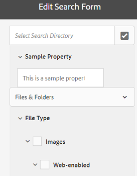

# Sök efter ansikten {#search-facets}

Lär dig hur du skapar, ändrar och använder sökfunktioner i AEM.

En företagsövergripande driftsättning av Adobe Experience Manager Assets (AEM) kan lagra många resurser. Ibland kan det vara besvärligt och tidskrävande att hitta rätt resurs om du bara använder de allmänna sökfunktionerna i AEM.

Använd sökfaktorer på panelen Filter för att göra sökningen mer detaljerad och göra sökfunktionen mer effektiv och flexibel. Sökfaktorer lägger till flera dimensioner (predikat) som gör att du kan utföra mer komplicerade sökningar. Panelen Filter innehåller några standardaspekter. Du kan också lägga till anpassade sökfaktorer.

Med sökfaktorer kan du söka efter resurser på flera olika sätt i stället för i en enda, förutbestämd, taxonisk ordning. Du kan enkelt gå ned till önskad detaljnivå för en mer fokuserad sökning.

Om du till exempel söker efter en bild kan du välja om du vill ha en bitmapp eller en vektorbild. Du kan minska sökningen ytterligare genom att ange MIME-typen för bilden. På samma sätt kan du ange formatet när du söker efter dokument, till exempel PDF eller MS Word.

## Lägg till ett predikat {#adding-a-predicate}

De sökfaktorer som visas på panelen Filter definieras i det underliggande sökformuläret med hjälp av predikat. Om du vill visa fler eller olika aspekter lägger du till predikat i standardformuläret eller använder ett anpassat formulär som innehåller de egenskaper du vill använda.

För textsökningar lägger du till predikatet Fulltext i formuläret. Använd predikatet Egenskap för att söka efter resurser som matchar en enskild egenskap som du anger. Använd predikatet Alternativ för att söka efter resurser som matchar ett eller flera värden för en viss egenskap. Lägg till predikatet för datumintervall för att söka efter resurser som skapats inom ett angivet datumintervall.

1. Tryck/klicka på AEM-logotypen och gå sedan till **[!UICONTROL Verktyg]** > **[!UICONTROL Allmänt]** > **[!UICONTROL Sökformulär]**.
1. På sidan Sök efter formulär väljer du **[!UICONTROL Resurser Admin Search Rail]** och sedan trycker du på **Redigera** .

   

   Leta reda på och välj Resursadministratörens sökspår

   >[!NOTE]
   >
   >Gör så här om du vill använda mappsökningsfunktionen från den förkonfigurerade **resursadministratörssökningen** från en tidigare AEM-version:
   >
   >1. Navigera till */conf/global/settings/dam/search/facets/assets/jcr:content/items* i CRXDE.
   >1. Ta bort **typnoden** .
   >1. Kopiera noderna från sökväg */libs/settings/dam/search/facets/assets/jcr:content/items*, **asset, directory, typeor, excludepaths** och **searchtype** till den sökväg som anges i steg 1.
   >1. Spara ändringarna.


1. På sidan Redigera sökformulär drar du ett predikat från fliken **[!UICONTROL Välj predikat]** till huvudrutan. Dra t.ex. **[!UICONTROL Egenskapsförutsägelse]**.

   

   Anpassa sökfiltren genom att dra och släppa ett predikat

1. Ange en fältetikett, platshållartext och beskrivning för predikatet på fliken Inställningar. Ange ett giltigt namn för metadataegenskapen som du vill associera med predikatet.

   Rubriketiketten på fliken Inställningar identifierar det valda predikatets typ.

   

   Använd fliken Inställningar för att ange de alternativ som krävs för ett predikat

1. I fältet **[!UICONTROL Egenskapsnamn]** anger du ett giltigt namn för den metadataegenskap som du vill associera med predikatet. Det är det namn som sökningen baseras på. Skriv `jcr:content/metadata/dc:description` eller `./jcr:content/metadata/dc:description`.

   Du kan också välja en befintlig nod i urvalsdialogrutan.

   

   Associera en metadataegenskap med ett predikat i fältet Egenskapsnamn

1. Tryck/klicka på **[!UICONTROL Förhandsgranska]**  för att generera en förhandsgranskning av panelen Filter så som den visas när du har lagt till predikatet.
1. Granska layouten för predikatet i förhandsgranskningsläget.

   

   Förhandsgranska sökformuläret innan ändringarna skickas

1. Om du vill stänga förhandsgranskningen trycker/klickar du på **[!UICONTROL Stäng]**  i det övre högra hörnet av förhandsvisningen.
1. Tryck på **[!UICONTROL Klar]** för att spara inställningarna.
1. Navigera till sökpanelen i användargränssnittet Resurser. Egenskapspredikatet läggs till på panelen.
1. Ange en beskrivning av resursen som ska genomsökas i textrutan. Ange t.ex.&quot;Adobe.&quot; När du gör en sökning visas resurser med en beskrivning som matchar&quot;Adobe&quot; i sökresultaten.

## Lägg till ett alternativs predikat {#adding-an-options-predicate}

Med predikatet Alternativ kan du lägga till flera sökalternativ på panelen Filter. Du kan välja ett eller flera av dessa alternativ på panelen Filter om du vill söka efter resurser. Om du till exempel vill söka efter resurser baserat på filtyp konfigurerar du alternativ som Bilder, Multimedia, Dokument och Arkiv i sökformuläret. När du har konfigurerat de här alternativen utförs sökningen på resurser av typen GIF, JPEG, PNG och så vidare när du väljer alternativet Bilder på panelen Filter.

Om du vill mappa alternativen till respektive egenskap skapar du en nodstruktur för alternativen och anger sökvägen till den överordnade noden i egenskapen Egenskapsnamn för predikatet Alternativ. Den överordnade noden ska vara av typen `sling`: `OrderedFolder`. Alternativen ska vara av typen `nt:unstructured`. Alternativnoderna ska ha egenskaperna `jcr:title` och `value` konfigurationen.

Egenskapen `jcr:title` är ett användarvänligt namn för alternativet som visas på panelen Filter. Fältet `value` används i frågan för att matcha den angivna egenskapen.

När du väljer ett alternativ utförs sökningen baserat på alternativnodens och eventuella underordnade noders `value` egenskap. Hela trädet under alternativnoden gås igenom och egenskapen för varje underordnad nod kombineras med en OR-åtgärd för att skapa sökfrågan. `value`

Om du till exempel väljer Bilder för filtyper skapas sökfrågan för resurserna genom att kombinera `value` egenskapen med en OR-åtgärd. Sökfrågan efter bilder skapas till exempel genom att kombinera resultaten som matchar *image/jpeg*, *image/gif*, *image/png*, *image/pjpeg* och *image/tiff* `jcr:content/metadata/dc:format` för egenskapen¥ med en OR-åtgärd.


Egenskapen value för en filtyp, som visas i CRXDE, används för att söka i frågor som ska fungera

I stället för att manuellt skapa en nodstruktur för alternativen i CRXDE-databasen, kan du definiera alternativen i en JSON-fil genom att ange motsvarande nyckelvärdepar. Ange sökvägen till JSON-filen i fältet **[!UICONTROL Egenskapsnamn]** . Du kan till exempel definiera nyckelvärdepar, `image/bmp`, `image/gif`, `image/jpeg`och `image/png` ange deras värden så som de visas i följande JSON-exempelfil. I fältet **[!UICONTROL Egenskapsnamn]** kan du ange CRXDE-sökvägen för den här filen.

```JSON
{
    "options" :
 [
          {"value" : "image/bmp","text" : "BMP"},
          {"value" : "image/gif","text" : "GIF"},
          {"value" : "image/jpeg","text" : "JPEG"},
          {"value" : "image/png","text" : "PNG"}
 ]
}
```

Om du vill använda en befintlig nod anger du den i valdialogrutan.

>[!NOTE]
>
>Alternativpredikatet är en anpassad wrapper som innehåller egenskapspredikat som demonstrerar det beskrivna beteendet. För närvarande finns det ingen tillgänglig REST-slutpunkt som stöder funktionen internt.

1. Tryck på AEM-logotypen och gå sedan till **[!UICONTROL Verktyg > Allmänt > Sök efter formulär]**.
1. På sidan **[!UICONTROL Sök efter formulär]** väljer du **[!UICONTROL Resurser Admin Search Rail]** och trycker sedan på ikonen Redigera.
1. På sidan **[!UICONTROL Redigera sökformulär]** drar du **[!UICONTROL Alternativpredikat]** från fliken **[!UICONTROL Välj predikat]** till huvudrutan.
1. Ange en etikett och ett namn för egenskapen på fliken **[!UICONTROL Inställningar]** . Om du till exempel vill söka efter resurser baserat på deras format anger du ett användarvänligt namn för etiketten, till exempel **[!UICONTROL Filtyp]**. Ange egenskapen som ska användas för att utföra sökningen i egenskapsfältet, till exempel `jcr:content/metadata/dc:format.`
1. Gör något av följande:

   * I fältet **[!UICONTROL Egenskapsnamn]** anger du sökvägen till JSON-filen där du definierar noderna för alternativen och anger motsvarande nyckelvärdepar.
   * Tryck eller klicka på `+` symbolen bredvid fältet Alternativ för att ange visningstexten och värdet för de alternativ du vill ange på panelen Filter. Om du vill lägga till ytterligare ett alternativ trycker/klickar du på `+` symbolen och upprepar steget.

1. Se till att **[!UICONTROL Markera]** en fil är avmarkerat så att användaren kan välja flera alternativ samtidigt för olika filtyper (t.ex. Bilder, Dokument, Multimedia och Arkiv). Om du väljer **[!UICONTROL Enkelt val]** kan användaren bara välja ett alternativ åt gången för filtyper.

   

   De tillgängliga fälten i Alternativpaletten

1. Ange en valfri beskrivning i fältet **[!UICONTROL Beskrivning]** och klicka sedan på **[!UICONTROL Klar]**.
1. Navigera till sökpanelen. Alternativpredikatet läggs till på **sökpanelen** . Alternativen för **[!UICONTROL Filtyp]** visas som kryssrutor.

## Lägg till ett predikat för flervärdesegenskaper {#adding-a-multi-value-property-predicate}

Med Multi Value Property-predikatet kan du söka efter resurser efter flera värden. Tänk dig ett scenario där du har bilder på flera produkter i AEM Resurser och metadata för varje bild innehåller ett SKU-nummer som är kopplat till produkten. Du kan använda det här predikatet för att söka efter produktbilder baserat på flera SKU-nummer.

1. Klicka på AEM-logotypen och gå sedan till **[!UICONTROL Verktyg]** > **[!UICONTROL Allmänt]** > **[!UICONTROL Sökformulär]**.
1. På sidan Sök efter formulär väljer du **[!UICONTROL Resurser Admin Search Rail]** och trycker på **[!UICONTROL Redigera]** aemassets_edit .
1. På sidan Redigera sökformulär drar du ett predikat **[!UICONTROL för]** flervärdesegenskaper från fliken **[!UICONTROL Välj predikat]** till huvudrutan.
1. Ange en etikett och platshållartext för predikatet på fliken **[!UICONTROL Inställningar]** . Ange egenskapsnamnet som ska användas för att utföra sökningen i egenskapsfältet, till exempel `jcr:content/metadata/dc:value`. Du kan också använda valdialogrutan för att välja en nod.
1. Kontrollera att **[!UICONTROL Avgränsarstöd]** är valt. I fältet **[!UICONTROL Indataavgränsare]** anger du avgränsare som ska separera enskilda värden. Som standard anges kommatecken som avgränsare. Du kan ange en annan avgränsare.
1. Ange en valfri beskrivning i fältet **Beskrivning** och tryck sedan på **[!UICONTROL Klar]**.
1. Navigera till panelen Filter i resursanvändargränssnittet. Predikatet **[!UICONTROL för]** flervärdesegenskapen läggs till på panelen.
1. Ange flera värden i fältet Flervärde avgränsat med avgränsarna och utför sökningen. Predikatet hämtar en exakt textmatchning för de värden du anger.

## Lägg till ett taggpredikat {#adding-a-tags-predicate}

Med taggpredikatet kan du utföra taggbaserade sökningar efter resurser. Som standard söker AEM Resurser efter en eller flera taggar som matchar baserat på de taggar du anger. Med andra ord utför sökfrågan en ELLER-åtgärd med de angivna taggarna. Du kan dock använda alternativet Matcha alla taggar för att söka efter resurser som innehåller alla taggar som du anger.

1. Klicka på AEM-logotypen och gå sedan till **[!UICONTROL Verktyg]** > **[!UICONTROL Allmänt]** > **[!UICONTROL Sökformulär]**.
1. På sidan Sök efter formulär väljer du **[!UICONTROL Resurser Admin Search Rail]** och sedan trycker du på **[!UICONTROL Edit]** .
1. På sidan Redigera sökformulär drar du **[!UICONTROL taggpredikatet]** från fliken Välj predikat till huvudrutan.
1. Ange en platshållartext för predikatet på fliken Inställningar. Ange egenskapsnamnet som ska användas för sökningen i egenskapsfältet, till exempel *jcr:content/metadata/cq:tags*. Du kan också välja en nod i CRXDE i urvalsdialogrutan.
1. Konfigurera sökvägsegenskapen för rottaggar för det här predikatet för att fylla i olika taggar i listan Taggar.
1. Välj alternativet **** Visa matcha alla taggar om du vill söka efter resurser som innehåller alla taggar som du anger.

   

   Vanliga inställningar för taggar-predikat

1. Ange en valfri beskrivning i fältet **[!UICONTROL Beskrivning]** och klicka/tryck sedan på **[!UICONTROL Klar]**.
1. Navigera till sökpanelen. Predikatet **[!UICONTROL Taggar]** läggs till på sökpanelen.
1. Ange taggar baserat på vilka du vill söka efter resurser eller välj från listan med förslag.

   

   AEM-tillhandahållet förslag när taggens namn skrivs

1. Välj **[!UICONTROL Matcha alla]** om du vill söka efter matchningar som innehåller alla taggar som du anger.

## Lägg till andra predikat {#adding-other-predicates}

På samma sätt som du lägger till ett egenskapsprediat eller ett alternativpredikat kan du lägga till följande ytterligare predikat på sökpanelen:

| Predikatnamn | Beskrivning | Egenskaper |
|---|---|---|
| [!UICONTROL Fulltext] | Sök på predikatet för att utföra fullständig textsökning på en hel objektnod. Den mappas med operatorn jcr:contains. Du kan ange en relativ sökväg om du vill utföra en fullständig textsökning på en viss del av resursnoden. | <ul><li>Etikett</li><li>Platshållare</li><li>Egenskapsnamn</li><li>Beskrivning</li></ul> |
| [!UICONTROL Sökvägsläsaren] | Sökpredikat för att söka efter resurser i mappar och undermappar på en förkonfigurerad rotsökväg | <ul><li>Platshållare</li><li>Rotsökväg</li><li>Beskrivning</li></ul> |
| [!UICONTROL Bana] | Använd den för att filtrera resultaten på plats. Du kan ange olika banor som alternativ. | <ul><li>Etikett</li><li>Bana</li><li>Beskrivning</li></ul> |
| [!UICONTROL Publiceringsstatus] | Sök efter predikat för att söka efter resurser baserat på deras publiceringsstatus | <ul><li>Etikett</li><li>Egenskapsnamn</li><li>Beskrivning</li></ul> |
| [!UICONTROL Relativt datum] | Sökpredikatet för att söka efter resurser baserat på det relativa datumet då de skapades. Du kan till exempel konfigurera alternativ som för 2 månader sedan, för 3 veckor sedan och så vidare. | <ul><li>Etikett</li><li>Egenskapsnamn</li><li>Relativt datum</li></ul> |
| [!UICONTROL Intervall] | Sök predikatet för att söka efter resurser som ligger inom ett angivet intervall. På sökpanelen kan du ange lägsta och högsta värden för intervallet. | <ul><li>Etikett</li><li>Egenskapsnamn</li><li>Beskrivning</li></ul> |
| [!UICONTROL Datumintervall] | Sökpredikatet för att söka efter resurser som skapats inom ett angivet intervall efter en datumegenskap. På sökpanelen kan du ange start- och slutdatum med datumväljare. | <ul><li>Etikett</li><li>Platshållare</li><li>Egenskapsnamn</li><li>Intervalltext (från)</li><li>Intervalltext (till)</li><li>Beskrivning</li></ul> |
| [!UICONTROL Date] | Sökpredikatet för en skjutreglagebaserad sökning efter resurser baserat på en date-egenskap. | <ul><li>Etikett</li><li>Egenskapsnamn</li><li>Beskrivning</li></ul> |
| [!UICONTROL Filstorlek] | Sök efter predikatorn för att söka efter resurser baserat på deras storlek. Det är ett sifferbaserat predikat där du väljer skjutreglagealternativ från en konfigurerbar nod. Standardalternativen finns i /libs/dam/options/preates/filesize i CRXDE-databasen. Filstorleken anges i byte. | <ul><li>Etikett</li><li>Egenskapsnamn</li><li>Bana</li><li>Beskrivning</li></ul> |
| [!UICONTROL Senast ändrad resurs] | Sök efter predikat för att söka efter nyligen ändrade resurser | <ul><li>Egenskapsnamn</li><li>Egenskapsvärde</li><li>Beskrivning</li></ul> |
| [!UICONTROL Publiceringsstatus] | Sök efter predikat för att söka efter resurser baserat på deras publiceringsstatus | <ul><li>Etikett</li><li>Egenskapsnamn</li><li>Beskrivning</li></ul> |
| [!UICONTROL Klassificering] | Sökprediktion för att söka efter resurser baserat på deras genomsnittliga klassificering | <ul><li>Etikett</li><li>Egenskapsnamn</li><li>Alternativ bana</li><li>Beskrivning</li></ul> |
| [!UICONTROL Förfallostatus] | Sök efter predikat för att söka efter resurser baserat på deras förfallostatus | <ul><li>Etikett</li><li>Egenskapsnamn</li><li>Beskrivning</li></ul> |
| [!UICONTROL Dold] | Sökpredikat som definierar en dold fältegenskap för att söka efter resurser | <ul><li>Egenskapsnamn</li><li>Egenskapsvärde</li><li>Beskrivning</li></ul> |

## Återställ standardsökfaktorer {#restoring-default-search-facets}

Som standard visas en låsikon före **[!UICONTROL Resursadministratörens sökspår]** på sidan **[!UICONTROL Sökformulär]** . Ikonen Lås försvinner om du lägger till sökfaktorer i formuläret, vilket anger att standardformuläret har ändrats.


Ikonen Lås för ett alternativ på sidan Sökformulär anger att standardinställningarna är intakta och inte anpassade.

Så här återställer du standardsökaspekten:

1. Välj **[!UICONTROL Resurser Admin Search Rail]** på sidan **[!UICONTROL Sökformulär]** .
1. Tryck på **[!UICONTROL Ta bort]** i verktygsfältet.
   
1. I bekräftelsedialogrutan trycker du på **[!UICONTROL Delete]** för att ta bort de anpassade ändringarna.

   När du har tagit bort de anpassade ändringarna för sökaspekter visas låsikonen igen innan **[!UICONTROL resursadministratörens sökväg]** på sidan **[!UICONTROL Sökformulär]** .

## Användarbehörigheter {#user-permissions}

Om du inte har tilldelats en administratörsroll finns det en lista med behörigheter som du behöver för att utföra redigerings-, borttagnings- och förhandsgranskningsåtgärder som omfattar sökfaktorer.

| Åtgärd | Behörigheter |
|---|---|
| [!UICONTROL Redigera] | Läsa och skriva behörigheter på `/apps` noden i CRXDE |
| [!UICONTROL Ta bort] | Läsa, skriva och ta bort behörigheter på `/apps` noden i CRXDE |
| [!UICONTROL Förhandsgranska] | Läsa, skriva och ta bort behörigheter på `/var/dam/content` noden i CRXDE. Läs- och skrivbehörigheter på `/apps` noden. |

>[!MORELIKETHIS]
>
>* [Utöka sökfunktionen för resurser](searchx.md)
>* [Sök resurser](search-assets.md)

